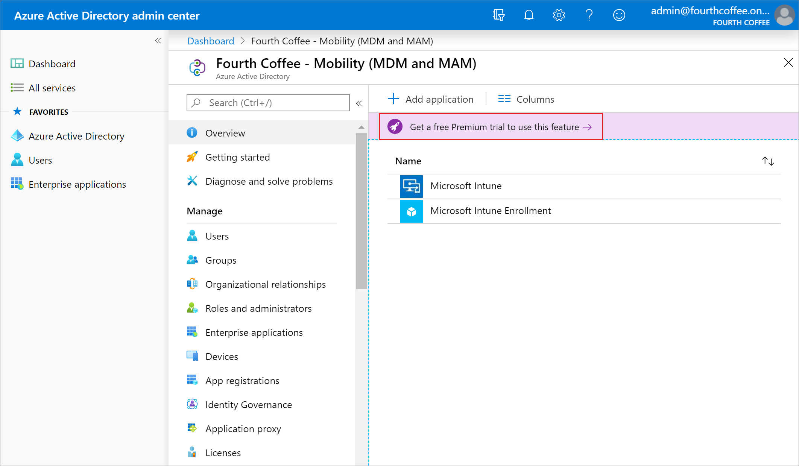
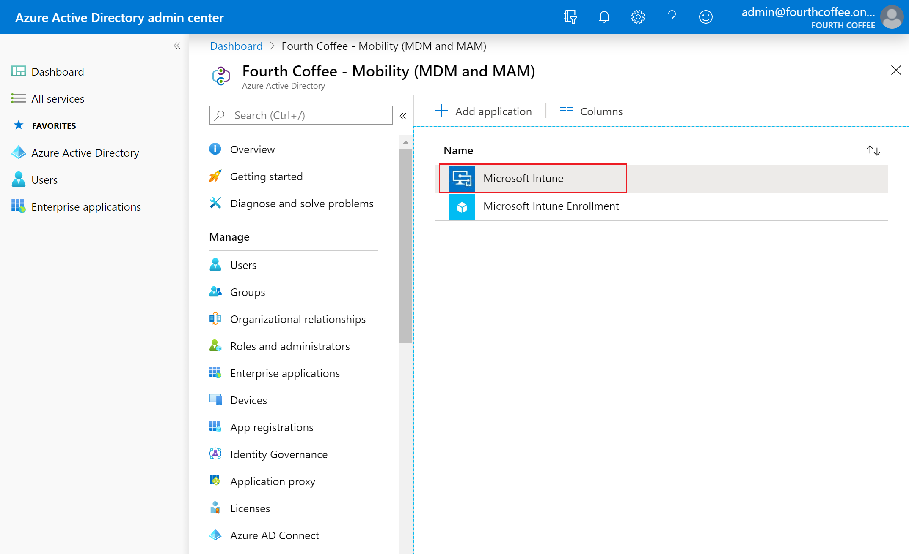
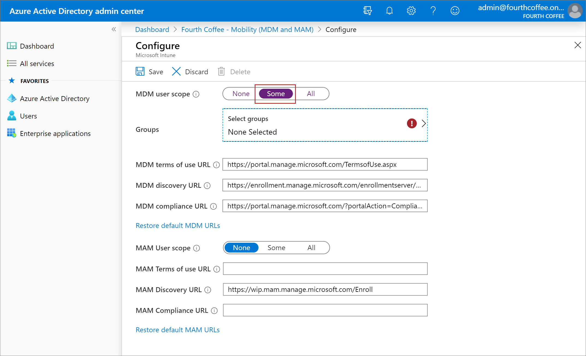
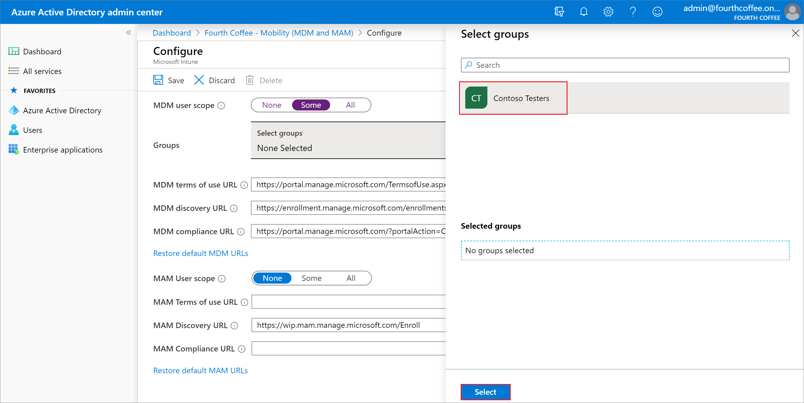

---
# required metadata

title: Set up automatic enrollment in Intune
description: Enable Intune automatic enrollment of Windows 10/11 devices that join or register with your Azure AD. 
services: microsoft-intune
author: Lenewsad
ms.author: lanewsad
ms.service: microsoft-intune
ms.subservice: enrollment
ms.localizationpriority: high
ms.topic: quickstart
ms.date: 01/30/2023

# optional metadata

#ROBOTS:
#audience:

ms.reviewer: maholdaa
ms.suite: ems
search.appverid: MET150
#ms.tgt_pltfrm:
ms.custom: intune-classic
ms.collection:
- tier1
- M365-identity-device-management
- highpri
---

# Step 4: Set up automatic enrollment for Windows 10/11 devices  

**Applies to**:

- Windows 10  
- Windows 11  

In this task, you'll set up Microsoft Intune to automatically enroll corporate owned or user owned devices. You can scope automatic enrollment to some Azure AD users, all users, or none.  

[!INCLUDE [intune-evaluate](../includes/intune-evaluate.md)]

If you don't have an Intune subscription, [sign up for a free trial account](../fundamentals/free-trial-sign-up.md) to try out this tutorial.

## Prerequisites

To complete this evaluation step, you must:

1. Sign up for Microsoft Intune subscription or trial subscription.
2. [Create a user](../fundamentals/quickstart-create-user.md).
3. [Create a group](../fundamentals/quickstart-create-group.md).
4. Sign up for the Azure AD free Premium trial (this article describes how to sign up).

To access Microsoft Intune, sign in to the [Microsoft Intune admin center](https://go.microsoft.com/fwlink/?linkid=2109431) with a Global Administrator account. If you've already created an Intune Trial subscription, the account you created the subscription with is a Global Administrator.

## Set up automatic enrollment

For this example, you'll configure MDM enrollment settings so that both corporate and bring-your-own-devices can be automatically enrolled in Intune. If your intent is to enable automatic enrollment for Windows BYOD devices to an MDM, configure the MDM user scope to All (or Some, and specify a group) and configure the MAM user scope to None (or Some, and specify a group, ensuring that users are not members of a group targeted by both MDM and MAM user scopes). For corporate devices, the MDM user scope takes precedence if both MDM and MAM user scopes are enabled. The device will be automatically enrolled in the configured MDM.  

> [!IMPORTANT]
> For Windows BYOD devices, the MAM user scope takes precedence if both the MAM user scope and the MDM user scope (automatic MDM enrollment) are enabled for all users or the same groups of users. The device will not be MDM enrolled, and Microsoft Purview Information Protection policies will apply if you configured them.  

1. In the [Microsoft Intune admin center](https://go.microsoft.com/fwlink/?linkid=2109431), choose **All services** > **M365 Azure Active Directory** > **All services** > **Azure Active Directory** > **Mobility (MDM and MAM)**.  
2. Select **Get a free Premium trial to use this feature**. Selecting this option will allow auto enrollment using the Azure Active Directory free Premium trial. 

    

3. Choose the **Enterprise Mobility + Security E5** free trial option.
4. Select **Free trial** > **Activate**. It can take a minute to activate.

5. Select **Microsoft Intune** to configure Intune.

    

6. Select **Some** from the **MDM user scope** to use MDM auto-enrollment to manage enterprise data on your employees' Windows devices. MDM auto-enrollment will be configured for Azure AD joined devices and bring-your-own-device scenarios.

    

7. Choose **Select groups** > **Contoso Testers** > **Select** as the assigned group.

    

8. For **MAM User scope**, select **None**.  
9. Use the default values for the remaining configuration values on the page.    
10. Choose **Save**.  

## Clean up resources

To reconfigure Intune automatic enrollment, check out [Set up enrollment for Windows devices](windows-enroll.md).  

## Next steps

In this task, you learned how to set up auto-enrollment for devices running Windows 10/11. For more information about device enrollment, see [Device enrollment overview(deployment-guide-enrollment.md).  

To continue to evaluate Microsoft Intune, go to the next step:

> [!div class="nextstepaction"]
> [Step 5 - Enroll your Windows 10/11 device](quickstart-enroll-windows-device.md)
