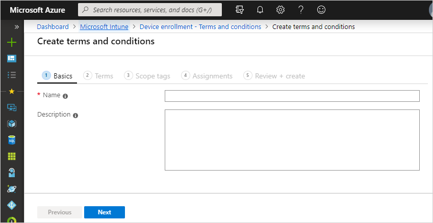

---
# required metadata

title: Set terms and conditions in Microsoft Intune
titleSuffix: 
description: Set terms and conditions that users see in the Company Portal for Intune.
keywords:
author: ErikjeMS
ms.author: erikje
manager: dougeby
ms.date: 10/20/2018
ms.topic: conceptual
ms.service: microsoft-intune
ms.subservice: enrollment
ms.localizationpriority: high
ms.technology:
ms.assetid: 4a3a11a8-9c0c-4334-8c6b-6fea4d0a2efb

# optional metadata

#ROBOTS:
#audience:
#ms.devlang:
ms.reviewer: amyro
ms.suite: ems
search.appverid: MET150
#ms.tgt_pltfrm:
ms.custom: intune-azure
ms.custom: seodec18
ms.collection: M365-identity-device-management
---

# Terms and conditions for user access

[!INCLUDE [azure_portal](../includes/azure_portal.md)]

As an Intune admin, you can require that users accept your company's terms and conditions before using the Company Portal to:
- enroll devices
- access resources like company apps and email.

Configuration of terms and conditions is optional.

You can create multiple sets of terms and assign them to different groups, such as to support different languages.

There are two ways to create your company terms and conditions:
- by using Intune as described in this article.
- by using the [Azure Active Directory terms of use feature](https://docs.microsoft.com/azure/active-directory/governance/active-directory-tou)

To learn which method is best for you, check out the [Choosing the right Terms solution for your organization blog post](https://go.microsoft.com/fwlink/?linkid=2010506&clcid=0x409). 

## Create terms and conditions
Complete these steps to create terms and conditions. The display name and description are for administrative use while terms properties are displayed to users in the Company Portal.

1. Sign in to the [Microsoft Endpoint Manager Admin Center](https://go.microsoft.com/fwlink/?linkid=2109431), choose **Tenant administration** > **Terms and Conditions**.
2. Choose **Create**.
3. On the **Basics** page, specify the following information:

   - **Name**: The name for the terms in the Azure portal. Users don't see this name.
   - **Description**: Optional details that help you identify this set of terms in the Azure portal.

    

4. Choose **Next** to go to the **Terms** page and provide the following information:

   - **Title**: The name for your terms that users see in the Company Portal above the **Summary**.
   - **Terms and Conditions**: The terms and conditions that users see and must either accept or reject.
   - **Summary of Terms**: Text that explains what it means when users accept the terms. For example, "By enrolling your device, you're agreeing to the terms of use set out by Contoso. Read the terms carefully before proceeding."

5. Choose **Next** to go to the **Scope tags** page.

6. Choose **Select scope tags**, select the scope tags that you want to assign to these terms and conditions, and then choose **Select**. 

7. Choose **Next** to go to the **Assignments** page and choose one of the following options for **Assign to**:
    - **All users**: Choose this option to assign these terms and conditions to all users.
    - **Select groups**: Choose this option to assign these terms and conditions to everyone in the groups that you identify by choosing **Select groups to include**.

8. Choose **Next** > **Create**.

## See how terms are displayed to your users
The following example shows the **Title** and **Summary of Terms** in the admin console and Company Portal.

The following example shows the terms and conditions in the admin console and the Company Portal.

## Monitor terms and conditions

1. Sign in to the [Microsoft Endpoint Manager Admin Center](https://go.microsoft.com/fwlink/?linkid=2109431), choose **Tenant administration** > **Terms and Conditions**.
2. In the list of terms and conditions, choose the terms you want to view acceptance for > **Acceptance Reporting**.

## Work with multiple versions of terms and conditions
You can edit your terms and conditions and manage their versions. Each time you make a significant change to your terms and conditions, you should:
- increase the version number
- require users to accept the new terms and conditions

Keep the current version number if, for example, you're fixing typos or changing formatting.

1. Sign in to the [Microsoft Endpoint Manager Admin Center](https://go.microsoft.com/fwlink/?linkid=2109431), choose **Tenant administration** > **Terms and Conditions** > choose the terms and conditions you want to modify > **Properties**.

2. On the **Properties** pane, choose **Terms and Conditions** and then modify the **Title**, **Summary of Terms**, and **Terms and Conditions** as needed. If your changes make it necessary for users to reaccept the new terms, choose **Require users to re-accept, and increment the version number to**

3. Choose **OK** > **Save**.

Users only have to accept updated terms and conditions once. Users with multiple devices don't have to accept terms and conditions on each device.
