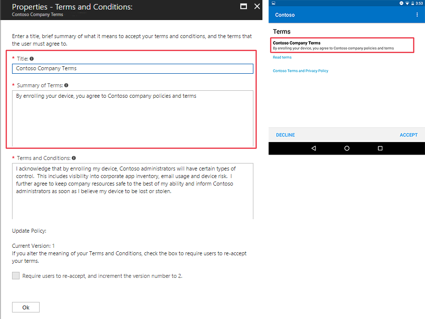
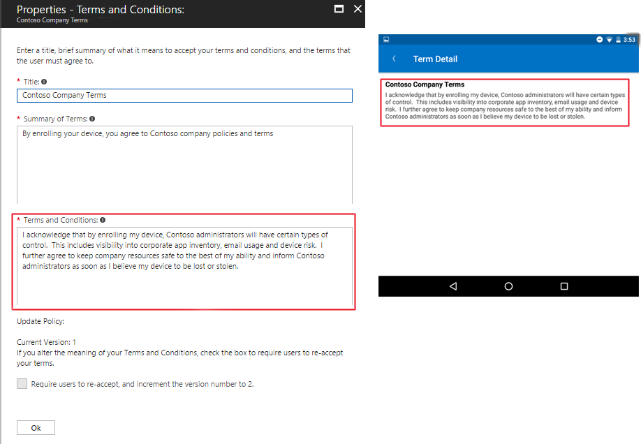

---
# required metadata

title: Set terms and conditions in Microsoft Intune
titleSuffix: 
description: Set terms and conditions that users see in the Company Portal for Intune.
keywords:
author: Lenewsad
ms.author: lanewsad
manager: dougeby
ms.date: 02/08/2022
ms.topic: how-to
ms.service: microsoft-intune
ms.subservice: enrollment
ms.localizationpriority: high
ms.technology:
ms.assetid: 4a3a11a8-9c0c-4334-8c6b-6fea4d0a2efb

# optional metadata

#ROBOTS:
#audience:

ms.reviewer: amyro
ms.suite: ems
search.appverid: MET150
#ms.tgt_pltfrm:
ms.custom: intune-azure;seodec18
ms.collection:
- tier2
- M365-identity-device-management
---

# Terms and conditions for user access

[!INCLUDE [azure_portal](../includes/azure_portal.md)]

Use an Intune terms and conditions policy to present relevant disclaimers for legal or compliance requirements to device users. A terms and conditions policy requires targeted users to accept your terms in Company Portal before they can enroll devices or access protected resources. 

This article describes how to get started with terms and conditions in Intune.  

## Create terms and conditions
Complete these steps to create an Intune terms and conditions policy. 

1. Sign in to the [Microsoft Intune admin center](https://go.microsoft.com/fwlink/?linkid=2109431) and select **Tenant administration** > **Terms and conditions**.
2. Select **Create**.
3. On the **Basics** page, enter the following information:

   - **Name**: Give your policy a name so that you can recognize it in Intune later. Device users don't see this name.  
   - **Description**: Optionally, describe the purpose or intended use for this specific set of terms.   

4. Select **Next**.
5. On the **Terms** page, enter the following information:

   - **Title**: The display name for your terms. Users see the title in the Company Portal app.  
   - **Terms and conditions**: The terms and conditions that users see and must either accept or reject.
   - **Summary of Terms**: Enter a brief, high-level explanation of what the user is agreeing to. This text is visible to device users.   
   
      Example message: *By enrolling your device, you're agreeing to the terms of use set out by Contoso. Read the terms carefully before proceeding.*  

5. Select **Next**.

6. On the **Select scope tags**, select a scope tag from the list to add it to the terms and conditions, or select the default scope tag. Then select **Next**. 

7. On the **Assignments** page, choose who you want to assign the terms to. Your options:
    - **Add all users**: Choose this option to assign these terms and conditions to all device users.
    - **Add groups**: Choose this option to assign these terms and conditions to users in select groups.  

8. Select **Next**.
9. Review the summary of your new terms and conditions, and then select **Create**.  

## How it looks to users   
Targeted users can see the terms and conditions in the Intune Company Portal app. The following image shows what the title and summary of terms look like in the app. Intune formats the title with bold font to make it stand out, with the summary of terms positioned directly under it.  

> [!div class="mx-imgBorder"]
> 

Device users tap **Read terms** to expand the terms and conditions to full-view. The following image shows what the terms and conditions look like when expanded. 

> [!div class="mx-imgBorder"]
>   

## Monitor acceptance of terms 
An acceptance report provides the details of an individual's agreement to your terms and conditions. Intune reports the following details:  

* User name: The name of the user who accepted the terms.
* Accepted version: The version that was accepted. 
* Accepted time: The date and time of acceptance.
* Accepted latest: Shows whether device user accepted the latest terms and conditions available. 
* UPN: The user principal name assigned to the device user.

To view and export acceptance reports: 

1. Go to **Tenant administration** > **Terms and conditions**.
2. Select your terms from the table. 
3. Select **Acceptance Reporting** to view available reports.  
4. Select **Export** to save the reports to your device.  

> [!NOTE]
> Report data is updated every 24 hours and can take up to 12 hours to finish generating. Because of this, data in the report can have up to a 36 hour latency.  

## Provide localized terms and conditions  
You can create multiple policies using localized text, and then target each policy to the appropriate groups of users.   

## Update terms and conditions  

Microsoft Intune provides a version control setting so that you can track versions and notify users of changes to your terms. As a best practice, every time you make a significant change to your terms and conditions, you should: 

- Increase the version number in Intune.  
- Require assigned users to review and reaccept the updated terms.  

> [!TIP]
> Do not change the version number for changes like typo and formatting fixes. 

To edit terms and conditions:  

1. Select **Tenant administration** > **Terms and conditions**.
2. From the table, choose the terms and conditions you want to edit.  
3. Select **Properties** and then next to **Terms**, select **Edit.**
4. Adjust the existing content as needed. 
5. If you edit the meaning of the terms at all, select the checkbox next to **Require users to re-accept, and increment the version number to *next version*.** In place of *next step*, you'll see the actual version number. 
3. Select **Review + save**.  
4. Review the summary for your terms and conditions, and then select **Save**.  

Users only have to accept the updated terms and conditions once. This means that a user associated with multiple enrolled devices won't need to accept the terms and conditions on each device.  

## Use Azure AD Terms of use feature  
You can use the [Azure Active Directory terms of use](/azure/active-directory/conditional-access/terms-of-use) feature to configure stricter compliance requirements. Capabilities include: 

* Attach multiple localized versions to a single policy  
* Render terms in PDF format for a richer experience that allows for branding, images, and hyperlinks
* Require users to expand the terms of use  
* Require users to consent on every device  
* Expire consents  
* Require users to reaccept terms after a certain period of time  
* Provide terms for non-enrollment scenarios  

These terms are shown to users when they sign in to targeted apps and resources. If you configure both Azure AD terms of use and Intune terms and conditions, users will be required to accept both. For a comparison of both solutions, see [Choosing the right Terms solution for your organization](https://go.microsoft.com/fwlink/?linkid=2010506&clcid=0x409). 
