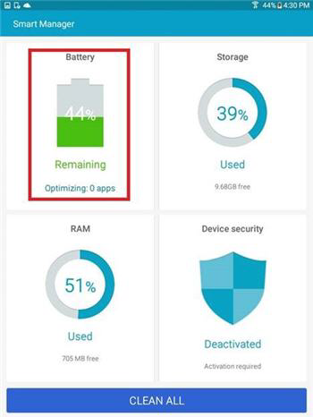
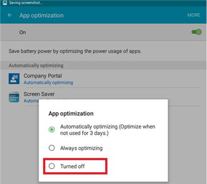

---
# required metadata

title: Troubleshoot device enrollment
titleSuffix: Microsoft Intune
description: Suggestions for troubleshooting device enrollment issues in Microsoft Intune.
keywords:
author: ErikjeMS
ms.author: erikje
manager: dougeby
ms.date: 11/09/2018
ms.topic: troubleshooting
ms.service: microsoft-intune
ms.subservice: enrollment
ms.localizationpriority: high
ms.technology:
ms.assetid: 6982ba0e-90ff-4fc4-9594-55797e504b62
ROBOTS: NOINDEX,NOFOLLOW

# optional metadata

#audience:+
#ms.devlang:
ms.reviewer: damionw
ms.suite: ems
search.appverid: MET150
#ms.tgt_pltfrm:
ms.custom: intune-classic;seoapril2019
ms.collection: M365-identity-device-management
---

# Troubleshoot device enrollment in Microsoft Intune

This article provides suggestions for troubleshooting [device enrollment](device-enrollment.md) issues. If this information doesn't solve your problem, see [How to get support for Microsoft Intune](../fundamentals/get-support.md) to find more ways to get help.

## Initial troubleshooting steps

Before you begin troubleshooting, check to make sure that you've configured Intune properly to enable enrollment. You can read about those configuration requirements in:

- [Get ready to enroll devices in Microsoft Intune](../fundamentals/setup-steps.md)
- [Set up iOS/iPadOS and Mac device management](ios-enroll.md)
- [Set up Windows device management](windows-enroll.md)
- [Set up Android device management](android-enroll.md) - No additional steps required

You can also make sure that the time and date on the user's device are set correctly:

1. Restart the device.
2. Make sure that the time and date are set close to GMT standards (+ or - 12 hours) for the end user's time zone.
3. Uninstall and reinstall the Intune company portal (if applicable).

Your managed device users can collect enrollment and diagnostic logs for you to review. User instructions for collecting logs are provided in:

- [Send Android enrollment errors to your IT admin](https://docs.microsoft.com/user-help/send-enrollment-errors-to-your-it-admin-android)
- [Send iOS/iPadOS errors to your IT admin](https://docs.microsoft.com/user-help/send-errors-to-your-it-admin-ios)

## General enrollment issues
These issues may occur on all device platforms.

### Device cap reached
**Issue:** A user receives an error during enrollment (like **Company Portal Temporarily Unavailable**).

**Resolution:**

#### Check number of devices enrolled and allowed

Check to see that the user isn't assigned more than the maximum number of devices by following these steps:

1. In the [Microsoft Endpoint Manager Admin Center](https://go.microsoft.com/fwlink/?linkid=2109431), choose **Devices** > **Enrollment restrictions** > **Device limit restrictions**. Note the value in the **Device limit** column.

2. In the [Microsoft Endpoint Manager Admin Center](https://go.microsoft.com/fwlink/?linkid=2109431), choose **Users** > **All users** > select the user > **Devices**. Note the number of devices.

3. If the user's number of enrolled devices already equals their device limit restriction, they can't enroll any more until:
    - [Existing devices are removed](../remote-actions/devices-wipe.md), or
    - You increase the device limit by [setting device restrictions](enrollment-restrictions-set.md).

To avoid hitting device caps, be sure to remove stale device records.

> [!NOTE]
> 
> You can avoid the device enrollment cap by using Device Enrollment Manager account, as described in [Enroll corporate-owned devices with the Device Enrollment Manager in Microsoft Intune](device-enrollment-manager-enroll.md).
> 
> A user account that is added to Device Enrollment Managers account will not be able to complete enrollment when Conditional Access policy is enforced for that specific user login.

### Company Portal Temporarily Unavailable
**Issue:** Users receive a **Company Portal Temporarily Unavailable** error on their device.

**Resolution:**

1. Remove the Intune Company Portal app from the device.

2. On the device, open the browser, browse to [https://portal.manage.microsoft.com](https://portal.manage.microsoft.com), and try a user login.

3. If the user fails to sign in, they should try another network.

4. If that fails, validate that the user's credentials have synced correctly with Azure Active Directory.

5. If the user successfully logs in, an iOS/iPadOS device will prompt you to install the Intune Company Portal app and enroll. On an Android device, you'll need to manually install the Intune Company Portal app, after which you can retry enrolling.

### MDM authority not defined
**Issue:** A user receives an **MDM authority not defined** error.

**Resolution:**

1. Verify that the MDM Authority has been [set appropriately](../fundamentals/mdm-authority-set.md).
    
2. Verify that the user's credentials have synced correctly with Azure Active Directory. You can verify that the user's UPN matches the Active Directory information in the Microsoft 365 admin center.
    If the UPN doesn't match the Active Directory information:

    1. Turn off DirSync on the local server.

    2. Delete the mismatched user from the **Intune Account Portal** user list.

    3. Wait about one hour to allow the Azure service to remove the incorrect data.

    4. Turn on DirSync again and check if the user is now synced properly.

### Unable to create policy or enroll devices if the company name contains special characters
**Issue:** You can't create policy or enroll devices.

**Resolution:** In the [Microsoft 365 admin center](https://admin.microsoft.com/), remove the special characters from the company name and save the company information.

### Unable to sign in or enroll devices when you have multiple verified domains
**Issue:** This problem may occur when you add a second verified domain to your ADFS. Users with the user principal name (UPN) suffix of the second domain may not be able to log into the portals or enroll devices.

<strong>Resolution:</strong> Microsoft Office 365 Customers are required to deploy a separate instance of the AD FS 2.0 Federation Service for each suffix if they:
- use single sign-on (SSO) through AD FS 2.0, and
- have multiple top-level domains for users' UPN suffixes within their organization (for example, @contoso.com or @fabrikam.com).

A [rollup for AD FS 2.0](https://support.microsoft.com/kb/2607496) works in conjunction with the <strong>SupportMultipleDomain</strong> switch to enable the AD FS server to support this scenario without requiring additional AD FS 2.0 servers. For more information, see [this blog](https://blogs.technet.microsoft.com/abizerh/2013/02/05/supportmultipledomain-switch-when-managing-sso-to-office-365/).

## Android issues

### Android enrollment errors

The following table lists errors that end users might see while enrolling Android devices in Intune.

|Error message|Issue|Resolution|
|---|---|---|
|**IT admin needs to assign license for access** Your IT admin hasn't given you access to use this app. Get help from your IT admin or try again later.|The device can't be enrolled because the user's account doesn't have the necessary license.|Before users can enroll their devices, they must have been assigned the necessary license. This message means that they have the wrong license type for the mobile device management authority. For example, they'll see this error if both of the following are true:<ol><li>Intune has been set as the mobile device management authority</li><li>They're using a System Center 2012 R2 Configuration Manager license.</li></ol>For more information, see [Assign Intune licenses to your user accounts](/intune/licenses-assign).|
|**IT admin needs to set MDM authority** Looks like your IT admin hasn't set an MDM authority. Get help from your IT admin or try again later.|The mobile device management authority hasn't been defined.|The mobile device management authority hasn't been set in Intune. See information about how to [set the mobile device management authority](/intune/mdm-authority-set).|

### Devices fail to check in with the Intune service and display as "Unhealthy" in the Intune admin console
**Issue:** Some Samsung devices that are running Android versions 4.4.x and 5.x might stop checking in with the Intune service. If devices don't check in:

- They can't receive policy, apps, and remote commands from the Intune service.
- They show a Management State of **Unhealthy** in the administrator console.
- Users who are protected by Conditional Access policies might lose access to corporate resources.

Samsung Smart Manager software, which ships on certain Samsung devices, can deactivate the Intune Company Portal and its components. When the Company Portal is in a deactivated state, it can't run in the background and can't contact the Intune service.

**Resolution #1:**

Tell your users to start the Company Portal app manually. Once the app restarts, the device checks in with the Intune service.

> [!IMPORTANT]
> Opening the Company Portal app manually is a temporary solution, because Samsung Smart Manager may deactivate the Company Portal app again.

**Resolution #2:**

Tell your users to try upgrading to Android 6.0. The deactivation issue doesn't occur on Android 6.0 devices. To check if an update is available, go to **Settings** > **About device** > **Download updates manually** > follow the prompts.

**Resolution #3:**

If Resolution #2 doesn't work, have your users follow these steps to make Smart Manager exclude the  Company Portal app:

1. Launch the Smart Manager app on the device.

   

2. Choose the **Battery** tile.

   

3. Under **App power saving** or **App optimization**, select **Detail**.

   

4. Choose **Company Portal** from the list of apps.

   

5. Choose **Turned off**.

   

6. Under **App power saving** or **App optimization**, confirm that Company Portal is turned off.

   

### Profile installation failed
**Issue:** A user receives a **Profile installation failed** error on an Android device.

**Resolution:**

1. Confirm that the user is assigned an appropriate license for the version of the Intune service that you're using.

2. Confirm that the device isn't already enrolled with another MDM provider.

3. Confirm that the device doesn't already have a management profile installed.

4. Confirm that Chrome for Android is the default browser and that cookies are enabled.

### Android certificate issues

**Issue**: Users receive the following message on their device:
*You can't sign in because your device is missing a required certificate.*

**Resolution 1**:

The user might be able to retrieve the missing certificate by following the instructions in [Your device is missing a required certificate](../user-help/your-device-is-missing-an-IT-required-certificate-android.md). If the error persists, try Resolution 2.

**Resolution 2**:

After entering their corporate credentials and getting redirected for federated login, users might still see the missing certificate error. In this case, the error may mean that an intermediate certificate is missing from your Active Directory Federation Services (AD FS) server

The certificate error occurs because Android devices require intermediate certificates to be included in an [SSL Server hello](https://technet.microsoft.com/library/cc783349.aspx). Currently, a default AD FS server or WAP - AD FS Proxy server installation sends only the AD FS service SSL certificate in the SSL server hello response to an SSL Client hello.

To fix the issue, import the certificates into the Computers Personal Certificates on the AD FS server or proxies as follows:

1. On the ADFS and proxy servers, right-click **Start** > **Run** > **certlm.msc** to launch the Local Machine Certificate Management Console.
2. Expand **Personal** and choose **Certificates**.
3. Find the certificate for your AD FS service communication (a publicly signed certificate), and double-click to view its properties.
4. Choose the **Certification Path** tab to see the certificate's parent certificate/s.
5. On each parent certificate, choose **View Certificate**.
6. Choose **Details** > **Copy to file…**.
7. Follow the wizard prompts to export or save the public key of the parent certificate to the a file location of your choice.
8. Right-click **Certificates** > **All Tasks** > **Import**.
9. Follow the wizard prompts to import the parent certificate(s) to **Local Computer\Personal\Certificates**.
10. Restart the AD FS servers.
11. Repeat the above steps on all of your AD FS and proxy servers.

To verify a proper certificate installation, you can use the diagnostics tool available on [https://www.digicert.com/help/](https://www.digicert.com/help/). In the **Server Address** box, enter your ADFS server's FQDN (IE: sts.contso.com) and click **Check Server**.

**To validate that the certificate installed correctly**:

The follow steps describe just one of many methods and tools that you can use to validate that the certificate installed correctly.

1. Go to the [free Digicert tool](ttps://www.digicert.com/help/).
2. Enter your AD FS server's fully qualified domain name (for example, sts.contoso.com) and select **CHECK SERVER**.

If the Server certificate is installed correctly, you see all check marks in the results. If the problem above exists, you see a red X in the "Certificate Name Matches" and the "SSL Certificate is correctly Installed" sections of the report.

## iOS/iPadOS issues

### iOS/iPadOS enrollment errors
The following table lists errors that end users might see while enrolling iOS/iPadOS devices in Intune.

|Error message|Issue|Resolution|
|-------------|-----|----------|
|NoEnrollmentPolicy|No enrollment policy found|Check that all enrollment prerequisites, like the Apple Push Notification Service (APNs) certificate, have been set up and that "iOS/iPadOS as a platform" is enabled. For instructions, see [Set up iOS/iPadOS and Mac device management](ios-enroll.md).|
|DeviceCapReached|Too many mobile devices are enrolled already.|The user must remove one of their currently enrolled mobile devices from the Company Portal before enrolling another. See the instructions for the type of device you're using: [Android](../user-help/unenroll-your-device-from-intune-android.md), [iOS/iPadOS](../user-help/unenroll-your-device-from-intune-ios.md), [Windows](../user-help/unenroll-your-device-from-intune-windows.md).|
|APNSCertificateNotValid|There's a problem with the certificate that lets the mobile device communicate with your company's network.  |The Apple Push Notification Service (APNs) provides a channel to contact enrolled iOS/iPadOS devices. Enrollment will fail and this message will appear if:<ul><li>The steps to get an APNs certificate weren't completed, or</li><li>The APNs certificate has expired.</li></ul>Review the information about how to set up users in [Sync Active Directory and add users to Intune](../fundamentals/users-add.md) and [organizing users and devices](../fundamentals/groups-add.md).|
|AccountNotOnboarded|There's a problem with the certificate that lets the mobile device communicate with your company's network.  |The Apple Push Notification Service (APNs) provides a channel to contact enrolled iOS/iPadOS devices. Enrollment will fail and this message will appear if:<ul><li>The steps to get an APNs certificate weren't completed, or</li><li>The APNs certificate has expired.</li></ul>For more information, review [Set up iOS/iPadOS and Mac management with Microsoft Intune](ios-enroll.md).|
|DeviceTypeNotSupported|The user might have tried to enroll using a non-iOS device. The mobile device type that you're trying to enroll isn't supported.  Confirm that device is running iOS/iPadOS version 8.0 or later.  |Make sure that your user's device is running iOS/iPadOS version 8.0 or later.|
|UserLicenseTypeInvalid|The device can't be enrolled because the user's account isn't yet a member of a required user group.  |Before users can enroll their devices, they must be members of the right user group. This message means that they have the wrong license type for the mobile device management authority. For example, they'll see this error if both of the following are true:<ol><li>Intune has been set as the mobile device management authority</li><li>they'e using a System Center 2012 R2 Configuration Manager license.</li></ol>Review the following articles for more information:  Review [Set up iOS/iPadOS and Mac management with Microsoft Intune](ios-enroll.md) and information about how to set up users in [Sync Active Directory and add users to Intune](../fundamentals/users-add.md) and [organizing users and devices](../fundamentals/groups-add.md).|
|MdmAuthorityNotDefined|The mobile device management authority hasn't been defined.  |The mobile device management authority hasn't been set in Intune.  Review item #1 in the "Step 6: Enroll mobile devices and install an app" section in [Get started with a 30-day trial of Microsoft Intune](../fundamentals/free-trial-sign-up.md).|

### Devices are inactive or the admin console can't communicate with them
**Issue:** iOS/iPadOS devices aren't checking in with the Intune service. Devices must check in periodically with the service to maintain access to protected corporate resources. If devices don't check in:

- They can't receive policy, apps, and remote commands from the Intune service.
- They show a Management State of **Unhealthy** in the administrator console.
- Users who are protected by Conditional Access policies might lose access to corporate resources.

**Resolution:** Share the following resolutions with your end users to help them regain access to corporate resources.

When users start the iOS/iPadOS Company Portal app, it can tell if their device has lost contact with Intune. If it detects that there's no contact, it automatically tries to sync with Intune to reconnect (users will see the **Trying to sync…** message).

  

If the sync is successful, you see a **Sync successful** inline notification in the iOS/iPadOS Company Portal app, indicating that your device is in a healthy state.

  

If the sync is unsuccessful, users see an **Unable to sync** inline notification in the iOS/iPadOS Company Portal app.

  

To fix the issue, users must select the **Set up** button, which is to the right of the **Unable to sync** notification. The Set up button takes users to the Company Access Setup flow screen, where they can follow the prompts to enroll their device.

  

Once enrolled, the devices return to a healthy state and regain access to company resources.

### Verify WS-Trust 1.3 is enabled
**Issue** Device Enrollment Program (DEP) iOS/iPadOS devices can't be enrolled

Enrolling DEP devices with user affinity requires WS-Trust 1.3 Username/Mixed endpoint to be enabled to request user tokens. Active Directory enables this endpoint by default. To get a list of enabled endpoints, use the Get-AdfsEndpoint PowerShell cmdlet and looking for the trust/13/UsernameMixed endpoint. For example:

      Get-AdfsEndpoint -AddressPath "/adfs/services/trust/13/UsernameMixed"

For more information, see [Get-AdfsEndpoint documentation](https://technet.microsoft.com/itpro/powershell/windows/adfs/get-adfsendpoint).

For more information, see [Best practices for securing Active Directory Federation Services](https://technet.microsoft.com/windows-server-docs/identity/ad-fs/operations/best-practices-securing-ad-fs). For help in determining if WS-Trust 1.3 Username/Mixed is enabled in your identity federation provider:
- contact Microsoft Support if you use ADFS
- contact your third party identity vendor.

### Profile installation failed
**Issue:** A user receives a **Profile installation failed** error on an iOS/iPadOS device.

### Troubleshooting steps for failed profile installation

1. Confirm that the user is assigned an appropriate license for the version of the Intune service that you're using.

2. Confirm that the device isn't already enrolled with another MDM provider.

3. Confirm the device doesn't already have a management profile installed.

4. Navigate to [https://portal.manage.microsoft.com](https://portal.manage.microsoft.com) and try to install the profile when prompted.

5. Confirm that Safari for iOS/iPadOS is the default browser and that cookies are enabled.

### User's iOS/iPadOS device is stuck on an enrollment screen for more than 10 minutes

**Issue**: An enrolling device may get stuck in either of two screens:
- Awaiting final configuration from "Microsoft"
- Guided Access app unavailable. Please contact your administrator.

This issue can happen if:
- there's a temporary outage with Apple services, or
- iOS/iPadOS enrollment is set to use VPP tokens as shown in the table but there's something wrong with the VPP token.

| Enrollment settings | Value |
| ---- | ---- |
| Platform | iOS/iPadOS |
| User Affinity | Enroll with User Affinity |
|Authenticate with Company Portal instead of Apple Setup Assistant | Yes |
| Install Company Portal with VPP | Use token: token address |
| Run Company Portal in Single App Mode until authentication | Yes |

**Resolution**: To fix the problem, you must:
1. Determine if there's something wrong with the VPP token and fix it.
2. Identify which devices are blocked.
3. Wipe the affected devices.
4. Tell the user to restart the enrollment process.

#### Determine if there's something wrong with the VPP token
1. In the [Microsoft Endpoint Manager Admin Center](https://go.microsoft.com/fwlink/?linkid=2109431), choose **Devices** > **iOS** > **iOS enrollment** > **Enrollment program tokens** > token name > **Profiles** > profile name > **Manage** > **Properties**.
2. Review the properties to see if any errors similar to the following appear:
    - This token has expired.
    - This token is out of Company Portal licenses.
    - This token is being used by another service.
    - This token is being used by another tenant.
    - This token was deleted.
3. Fix the issues for the token.

#### Identify which devices are blocked by the VPP token
1. In the [Microsoft Endpoint Manager Admin Center](https://go.microsoft.com/fwlink/?linkid=2109431), choose **Devices** > **iOS**k > **iOS enrollment** > **Enrollment program tokens** > token name > **Devices**.
2. Filter the **Profile status** column by **Blocked**.
3. Make a note of the serial numbers for all the devices that are **Blocked**.

#### Remotely wipe the blocked devices
After you've fixed the issues with the VPP token, you must wipe the devices that are blocked.
1. In the [Microsoft Endpoint Manager Admin Center](https://go.microsoft.com/fwlink/?linkid=2109431), choose **Devices** > **All devices** > **Columns** > **Serial number** > **Apply**. 
2. For each blocked device, choose it in the **All devices** list and then choose **Wipe** > **Yes**.

#### Tell the users to restart the enrollment process
After you've wiped the blocked devices, you can tell the users to restart the enrollment process.

## macOS issues

### macOS enrollment errors
**Error message 1:** *It looks like you're using a virtual machine. Make sure you've fully configured your virtual machine, including serial number and hardware model. If this isn't a virtual machine, please contact support.*  

**Error message 2:** *We're having trouble getting your device managed. This problem could be caused if you're using a virtual machine, have a restricted serial number, or if this device is already assigned to someone else. Learn how to resolve these problems or contact your company support.*

**Issue:** This message could be a result of any of the following reasons:  
- A macOS virtual machine (VM) isn't configured correctly  
- You've enabled device restrictions that require the device to be corporate-owned or have a registered device serial number in Intune  
- The device has already been enrolled and is still assigned to someone else in Intune  

**Resolution:** First, check with your user to determine which of the issues affects their device. Then complete the most relevant of the following solutions:

- If the user is enrolling a VM for testing, make sure it's been fully configured so that Intune can recognize its serial number and hardware model. Learn more about how to [set up VMs](macos-enroll.md#enroll-virtual-macos-machines-for-testing) in Intune.
- If your organization turned on enrollment restrictions that block personal macOS devices, you must manually [add the personal device's serial number](corporate-identifiers-add.md#manually-enter-corporate-identifiers) to Intune.  
- If the device is still assigned to another user in Intune, its former owner did not use the Company Portal app to remove or reset it. To clean up the stale device record from Intune:  

    1. In the [Microsoft Endpoint Manager Admin Center](https://go.microsoft.com/fwlink/?linkid=2109431), sign in with your administrative credentials.
    2. Choose **Devices** > **All devices**.  
    3. Find the device with the enrollment problem. Search by device name or MAC/HW Address to narrow your results.
    4. Select the device > **Delete**. Delete all other entries associated with the device.  

## PC Issues

|Error message|Issue|Resolution|
|---|---|---|
|**IT admin needs to assign license for access** Your IT admin hasn't given you access to use this app. Get help from your IT admin or try again later.|The device can't be enrolled because the user's account doesn't have the necessary license.|Before users can enroll their devices, they must have been assigned the necessary license. This message means that they have the wrong license type for the mobile device management authority. For example, they'll see this error if both of the following are true: <ol><li>Intune has been set as the mobile device management authority</li><li>They're using a System Center 2012 R2 Configuration Manager license.</li></ol>See information about [how to assign Intune licenses to your user accounts](../fundamentals/licenses-assign.md).|

### The machine is already enrolled - Error hr 0x8007064c

**Issue:** Enrollment fails with the error **The machine is already enrolled**. The enrollment log shows error **hr 0x8007064c**.

This failure may occur because the computer:

- was previously enrolled, or
- has the cloned image of a computer that was already enrolled.
The account certificate of the previous account is still present on the computer.

**Resolution:**

1. From the **Start** menu, type **Run** -> **MMC**.
1. Choose **File** > **Add/ Remove Snap-ins**.
1. Double-click **Certificates**, choose **Computer account** > **Next**, and select **Local Computer**.
1. Double-click **Certificates (Local computer)** and choose **Personal/ Certificates**.
1. Look for the Intune cert issued by Sc_Online_Issuing, and delete it, if present.
1. If the following registry key exists, delete it: **HKEY_LOCAL_MACHINE\SOFTWARE\Microsoft\OnlineManagement regkey** and all sub keys.
1. Try to re-enroll.
1. If the PC still can't enroll, look for and delete this key, if it exists: **KEY_CLASSES_ROOT\Installer\Products\6985F0077D3EEB44AB6849B5D7913E95**.
1. Try to re-enroll.

    > [!IMPORTANT]
    > This section, method, or task contains steps that tell you how to modify the registry. However, serious problems might occur if you modify the registry incorrectly. Therefore, make sure that you follow these steps carefully. For added protection, back up the registry before you modify it. Then, you can restore the registry if a problem occurs.
    > For more information about how to back up and restore the registry, read [How to back up and restore the registry in Windows](https://support.microsoft.com/kb/322756)

## General enrollment Error codes

|Error code|Possible problem|Suggested resolution|
|--------------|--------------------|----------------------------------------|
|0x80CF0437 |The clock on the client computer isn't set to the correct time.|Make sure that the clock and the time zone on the client computer are set to the correct time and time zone.|
|0x80240438, 0x80CF0438, 0x80CF402C|can't connect to the Intune service. Check the client proxy settings.|Verify that Intune supports the proxy configuration on the client computer. Verify that the client computer has Internet access.|
|0x80240438, 0x80CF0438|Proxy settings in Internet Explorer and Local System aren't configured.|can't connect to the Intune service. Check the client proxy settings.Verify that Intune supports the proxy configuration on the client computer. Verify that the client computer has Internet access.|
|0x80043001, 0x80CF3001, 0x80043004, 0x80CF3004|Enrollment package is out of date.|Download and install the current client software package from the Administration workspace.|
|0x80043002, 0x80CF3002|Account is in maintenance mode.|You can't enroll new client computers when the account is in maintenance mode. To view your account settings, sign in to your account.|
|0x80043003, 0x80CF3003|Account is deleted.|Verify that your account and subscription to Intune is still active. To view your account settings, sign in to your account.|
|0x80043005, 0x80CF3005|The client computer has been retired.|Wait a few hours, remove any older versions of the client software from the computer, and then retry the client software installation.|
|0x80043006, 0x80CF3006|The maximum number of seats allowed for the account has been reached.|Your organization must buy additional seats before you can enroll more client computers in the service.|
|0x80043007, 0x80CF3007|Couldn't find the certificate file in the same folder as the installer program.|Extract all files before you start the installation. Do not rename or move any of the extracted files: all files must exist in the same folder or the installation will fail.|
|0x8024D015, 0x00240005, 0x80070BC2, 0x80070BC9, 0x80CFD015|The software can't be installed because a restart of the client computer is pending.|Restart the computer and then retry the client software installation.|
|0x80070032|One or more prerequisites for installing the client software weren't found on the client computer.|Make sure that all required updates are installed on the client computer and then retry the client software installation.|
|0x80043008, 0x80CF3008|Failed to start the Microsoft Online Management Updates service.|Contact Microsoft Support as described in [How to get support for Microsoft Intune](../fundamentals/get-support.md).|
|0x80043009, 0x80CF3009|The client computer is already enrolled into the service.|You must retire the client computer before you can re-enroll it in the service.|
|0x8004300B, 0x80CF300B|The client software installation package can't run because the version of Windows that is running on the client isn't supported.|Intune doesn't support the version of Windows that is running on the client computer.|
|0xAB2|The Windows Installer couldn't access VBScript run time for a custom action.|This error is caused by a custom action that is based on Dynamic-Link Libraries (DLLs). When troubleshooting the DLL, you might have to use the tools that are described in [Microsoft Support KB198038: Useful Tools for Package and Deployment Issues](https://support.microsoft.com/kb/198038).|
|0x80cf0440|The connection to the service endpoint terminated.|Trial or paid account is suspended. Create a new trial or paid account and re-enroll.|

## Next steps

If this troubleshooting information didn't help you, contact Microsoft Support as described in [How to get support for Microsoft Intune](../fundamentals/get-support.md).
