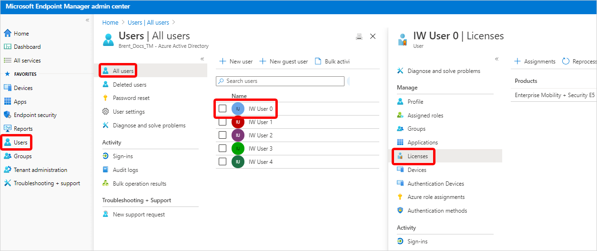
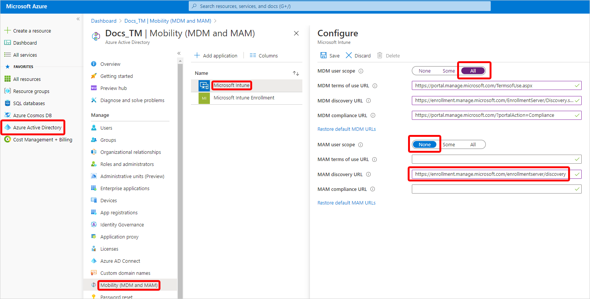
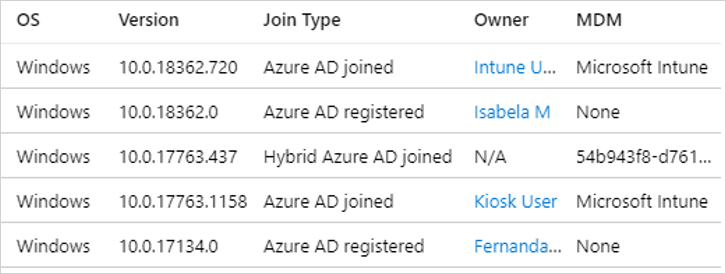
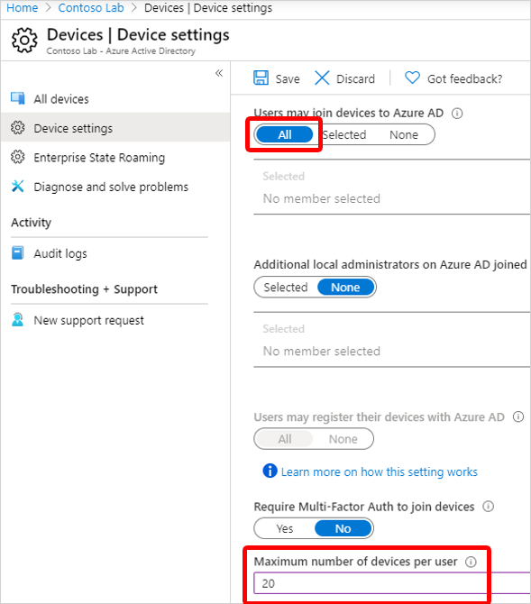
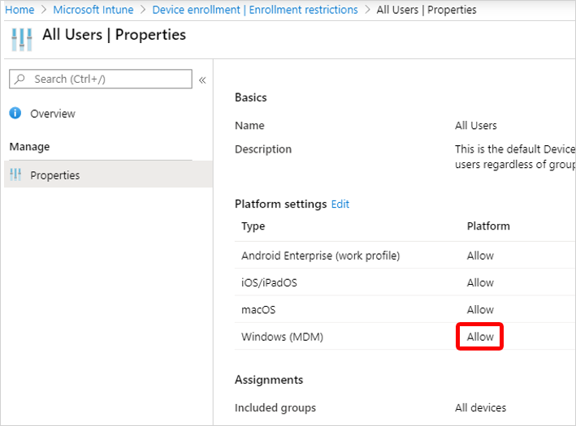
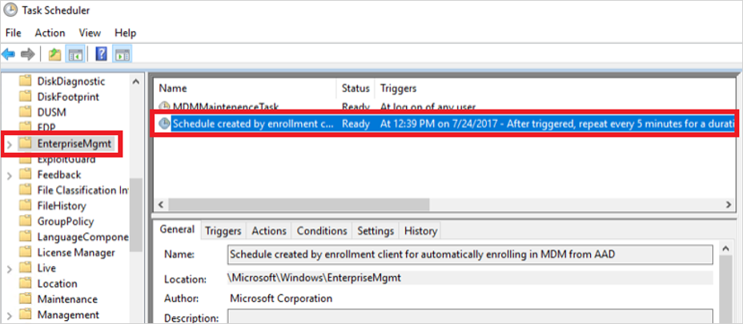

---
# required metadata

title: Troubleshoot Windows 10 auto-enrollment in Intune
titleSuffix: Microsoft Intune
description: Learn how to troubleshoot auto-enrollment.
keywords:
author: ErikjeMS 
ms.author: erikje
manager: dougeby
ms.date: 8/3/2020
ms.topic: how-to
ms.service: microsoft-intune
ms.subservice: enrollment
ms.localizationpriority: high
ms.technology:
ms.assetid: 

# optional metadata

#ROBOTS:
#audience:

ms.reviewer: jchombe
ms.suite: ems
search.appverid: MET150
#ms.tgt_pltfrm:
ms.custom: intune-azure;seodec18 
ms.collection: M365-identity-device-management
---

# Troubleshoot Windows 10 group policy-based auto-enrollment in Intune

You can use group policy to trigger auto-enrollment to MDM for Active Directory (AD) domain-joined devices. For more information on this feature, see [Enroll a Windows 10 device automatically using Group Policy](https://docs.microsoft.com/windows/client-management/mdm/enroll-a-windows-10-device-automatically-using-group-policy).

## Verify the configuration

Before you start troubleshooting, it's best to verify that everything is configured correctly. If the issue can’t be fixed during verification, you can troubleshoot further by checking some important log files.

- Verify that a valid Intune license is assigned to the user who is trying to enroll the device.

   

- Verify that auto-enrollment is enabled for all users who will enroll the devices in Intune. For more information, see [Azure AD and Microsoft Intune: Automatic MDM enrollment in the new Portal](https://docs.microsoft.com/windows/client-management/mdm/azure-ad-and-microsoft-intune-automatic-mdm-enrollment-in-the-new-portal).

   

   - Verify that **MDM user scope** is set to **All** to allow all users to enroll a device in Intune.
   - Verify that **MAM User scope** is set to **None**. Otherwise, this setting will have precedence over the MDM scope and cause issues.
   - Verify that **MDM discovery URL** is set to **https://enrollment.manage.microsoft.com/enrollmentserver/discovery**.

- Verify that the device is running Windows 10, version 1709 or a later version.

- Verify that the devices are set to **hybrid Azure AD joined**. This setting means that the devices are both domain-joined and Azure AD-joined.

   To verify the settings, run **dsregcmd /status** at the command line. Then, verify the following status values in the output:

   - Device State
 
     ```asciidoc
     AzureAdJoined: YES
     DomainJoined: YES
     ```

   - SSO State

     ```asciidoc
     AzureAdPrt: YES
     ```

   You can find this same information in the list of Azure AD-joined devices:

   

- Both **Microsoft Intune** and **Microsoft Intune Enrollment** might be listed under **Mobility (MDM and MAM)** in the Azure AD blade. If both are present, make sure that you configure the auto-enrollment settings under **Microsoft Intune**.

- Verify that the following Group Policy policy setting is successfully deployed to all devices that should be enrolled in Intune:

   **Computer Configuration** > **Policies** > **Administrative Templates** > **Windows Components** > **MDM** > **Enable automatic MDM enrollment using default Azure AD credentials**

   You can contact your domain administrators to verify that the Group Policy policy setting is deployed successfully.

- Make sure that the device isn't enrolled in Intune by using the classic PC agent.
- Verify the following settings in Azure AD and Intune:

   **In Azure AD Device settings:**

   

   - The **Users may join devices to Azure AD** setting is set to **All**.
   - The number of devices that a user has in Azure AD doesn't exceed the **Maximum number of devices per user** quota.
   
   **In Intune enrollment restrictions:**

   - Enrollment of Windows devices is allowed.

     

## Troubleshooting

If the issue persists, examine the MDM logs on the device in the following location in Event Viewer:

**Applications and Services Logs** > **Microsoft** > **Windows** > **DeviceManagement-Enterprise-Diagnostic-Provider** > **Admin**

Look for Event ID 75 (Event message "Auto MDM Enroll: Succeeded"). This event indicates that the auto-enrollment succeeded.

Event ID 75 isn't logged in the following situations:

- The enrollment fails.

  To verify this error, look for Event ID 76 (Event message: Auto MDM Enroll: Failed (Unknown Win32 Error code: 0x8018002b)). This event indicates a failed auto-enrollment.

  For a resolution to this error, see [Troubleshooting Windows device enrollment problems in Microsoft Intune](https://docs.microsoft.com/intune/troubleshoot-windows-enrollment-errors).

- The enrollment wasn't triggered at all. In this case, event ID 75 and event ID 76 aren't logged.
  
  The auto-enrollment process is triggered by the "**Schedule created by enrollment client for automatically enrolling in MDM from AAD**" task that's located under **Microsoft** > **Windows** > **EnterpriseMgmt** in Task Scheduler.

  

  This task is created when the **Enable automatic MDM enrollment using default Azure AD credentials** Group Policy policy setting is successfully deployed to the target device. The task is scheduled to run every 5 minutes during 1 day.

  To verify that the task is started, check the task scheduler event logs under the following location in Event Viewer:

  **Applications and Services Logs > Microsoft > Windows > Task Scheduler > Operational**

  When the task is triggered on the scheduler, Event ID 107 is logged.

  When the task is completed, Event ID 102 is logged. The event is logged whether or not auto enrollment succeeds.

  > [!NOTE]
  > You can use the task scheduler log to check whether auto-enrollment is triggered. However, you can't use the log to determine whether auto-enrollment succeeded.

  The following situation may cause the Schedule created by enrollment client for automatically enrolling in MDM from AAD task not to be started:

  - The device is already enrolled in another MDM solution. In this case, Event ID 7016 together with error code 2149056522 is logged in the **Applications and Services Logs** > **Microsoft** > **Windows** > **Task Scheduler** > **Operational** event log.

    To fix this issue, unenroll the device from the MDM.

  - A Group Policy issue exists. In this case, force an update of Group Policy settings by running the following command:

    **gpupdate /force**

    If the issue persists, do additional troubleshooting in Active Directory.

## Next steps
[Troubleshoot Windows device enrollment](troubleshoot-windows-enrollment-errors.md)