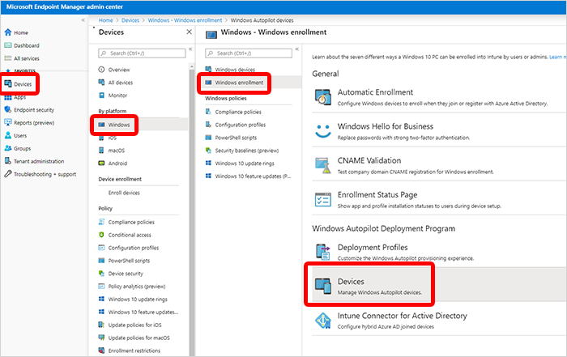
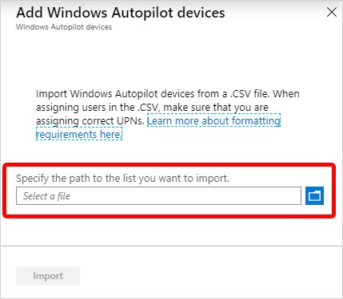

---
# required metadata

title: Tutorial - Use Autopilot to enroll devices in Intune
titleSuffix: Microsoft Intune
description: In this tutorial, you'll set up Windows Autopilot to enroll devices in Intune.
keywords:
author: Lenewsad
ms.author: lanewsad
manager: dougeby
ms.date: 07/13/2022
ms.topic: tutorial
ms.service: microsoft-intune
ms.subservice: enrollment
ms.localizationpriority: high
ms.technology:
ms.assetid: 
Customer intent: As an Intune admin, I want to set up Windows Autopilot so that users can enroll in Intune.

# optional metadata

#ROBOTS:
#audience:

ms.reviewer: 
ms.suite: ems
search.appverid: MET150
#ms.tgt_pltfrm:
ms.custom: intune
ms.collection:
  - M365-identity-device-management
  - highpri
---

# Tutorial: Use Autopilot to enroll Windows devices in Intune

[Windows Autopilot](../../autopilot/index.yml) simplifies enrolling devices. With Microsoft Intune and Autopilot, you can give new devices to your end users without the need to build, maintain, and apply custom operating system images.

In this tutorial, you'll learn how to:
> [!div class="checklist"]
> * Add devices to Intune
> * Create an Autopilot device group
> * Create an Autopilot deployment profile
> * Assign the Autopilot deployment profile to the device group
> * Distribute Windows devices to users

If you don't have an Intune subscription, [sign up for a free trial account](../fundamentals/free-trial-sign-up.md).

For an overview of Autopilot benefits, scenarios, and prerequisites, see [Overview of Windows Autopilot](/windows/deployment/windows-autopilot/windows-10-autopilot).

## Prerequisites
- [Set up Windows automatic enrollment](quickstart-setup-auto-enrollment.md)
- [Azure Active Directory Premium subscription](/azure/active-directory/active-directory-get-started-premium) <!--&#40;[trial subscription](https://go.microsoft.com/fwlink/?LinkID=816845)&#41;-->

## Add devices

The first step in setting up Windows Autopilot is to add the Windows devices to Intune. All you have to do is create a CSV file and import it into Intune.

1. In any text editor, create a list of comma-separated values (CSV) that identify the Windows devices. Use the following format:
    
    *serial-number*, *windows-product-id*, *hardware-hash*, *optional-Group-Tag*
    
    The first three items are required, but the Group Tag (previously known "order ID") is optional.

2. Save the CSV file.

3. In the [Microsoft Endpoint Manager admin center](https://go.microsoft.com/fwlink/?linkid=2109431), choose **Devices** > **Windows** > **Windows Enrollment** > **Devices** (under **Windows Autopilot Deployment Program** > **Import**.

    

4. Under **Add Windows Autopilot devices**, browse to the CSV file you saved.

    

5. Choose **Import** to start importing the device information. Importing can take several minutes.

4. After import is complete, choose **Devices** > **Windows** > **Windows enrollment** > **Devices** (under **Windows Autopilot Deployment Program** > **Sync**. A message displays that the synchronization is in progress. The process might take a few minutes to complete, depending on how many devices you're synchronizing.

5. Refresh the view to see the new devices.

## Create an Autopilot device group

Next, you'll create a device group and put the Autopilot devices you just loaded into it.

1. In the [Microsoft Endpoint Manager admin center](https://go.microsoft.com/fwlink/?linkid=2109431), choose **Groups** > **New group**.
2. In the **Group** blade:
    1. For **Group type**, choose **Security**.
    2. For **Group name**, enter *Autopilot Group*. For **Group description**, enter *Test group for Autopilot devices*.
    3. For **Membership type**, choose either **Assigned**.
3. In the **Group** blade, choose **Members** and add the Autopilot devices to the group. Autopilot devices that aren't yet enrolled are devices where the name equals the serial number of the device.
4. Choose **Create**.  

## Create an Autopilot deployment profile

After creating a device group, you must create a deployment profile so that you can configure the Autopilot devices.

1. In the [Microsoft Endpoint Manager admin center](https://go.microsoft.com/fwlink/?linkid=2109431), choose **Devices** > **Windows** > **Windows enrollment** > **Deployment Profiles** > **Create Profile**.
2. On the **Basics** page, for **Name**, enter *Autopilot Profile*. For **Description**, enter *Test profile for Autopilot devices*.
3. Set **Convert all targeted devices to Autopilot** to **Yes**. This setting makes sure that all devices in the list get registered with the Autopilot deployment service. Allow 48 hours for the registration to be processed.
4. Select **Next**.
5. On the **Out-of-box experience (OOBE)** page, for **Deployment mode**, choose **User-driven**. Devices with this profile are associated with the user enrolling the device. User credentials are required to enroll the device.
6. In the **Join to Azure AD as** box, choose **Azure AD joined**.
7. Configure the following options and leave others set to the default:
    - **End-user license agreement (EULA)**: **Hide**
    - **Privacy settings**: **Show**
    - **User account type**: **Standard**
8. Select **Next**.
9. On the **Assignments** page, choose **Selected groups** for **Assign to**.
10. Choose **Select groups to include**, choose **Autopilot Group**.
11. Select **Next**.
12. On the **Review + Create** page, choose **Create** to create the profile.

## Distribute devices to users

You can now distribute the Windows devices to your users. When they sign in for the first time, the Autopilot system will automatically enroll and configure the devices. 

## Clean up resources

If you don't want to use Autopilot devices anymore, you can delete them.

1. If the devices are enrolled in Intune, you must first [delete them from the Azure Active Directory portal](../remote-actions/devices-wipe.md#delete-devices-from-the-azure-active-directory-portal).

2. In the [Microsoft Endpoint Manager admin center](https://go.microsoft.com/fwlink/?linkid=2109431), choose **Devices** > **Windows** > **Windows enrollment** > **Devices** (under **Windows Autopilot Deployment Program**).

3. Choose the devices you want to delete, and then choose **Delete**.

4. Confirm the deletion by choosing **Yes**. It can take a few minutes to delete.

## Next steps

You can find more information about other options available for Windows Autopilot.

> [!div class="nextstepaction"]
> [In-depth Autopilot enrollment article](../../autopilot/enrollment-autopilot.md)