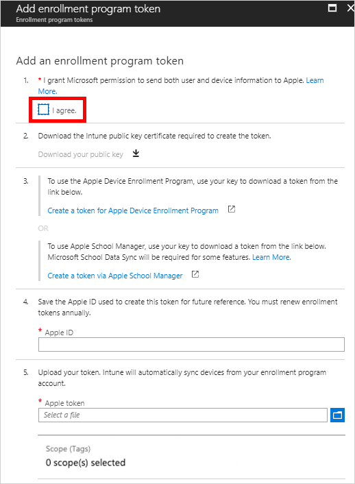

---
# required metadata

title: Tutorial - Use Apple Business Manager to enroll iOS/iPadOS devices in Intune
titleSuffix: Microsoft Intune
description: In this tutorial, you'll set up Apple's corporate device enrollment features from ABM to enroll iOS/iPadOS devices in Intune.
keywords:
author: Lenewsad
ms.author: lanewsad
manager: dougeby
ms.date: 04/30/2019
ms.topic: tutorial
ms.service: microsoft-intune
ms.subservice: enrollment
ms.localizationpriority: high
ms.technology:
ms.assetid: 
Customer intent: As an Intune admin, I want to set up the Apple's corporate device enrollment features so that corporate devices can automatically enroll in Intune.
ms.collection:
  - M365-identity-device-management
  - highpri
---

# Tutorial: Use Apple's Corporate Device Enrollment features in Apple Business Manager (ABM) to enroll iOS/iPadOS devices in Intune
The Device Enrollment features in Apple Business Manager simplifies enrolling devices. Intune also supports Apple's older Device Enrollment Program (DEP) portal, but we encourage you to start fresh with Apple Business Manager. With Microsoft Intune and Apple Corporate Device Enrollment, devices are automatically securely enrolled the first time the user turns on the device. You can therefore ship devices to many users without having to set up each device individually. 

In this tutorial, you'll learn how to:
> [!div class="checklist"]
> * Get an Apple Device Enrollment token
> * Sync managed devices to Intune
> * Create an Enrollment profile
> * Assign the Enrollment profile to devices

If you don't have an Intune subscription, [sign up for a free trial account](../fundamentals/free-trial-sign-up.md).

## Prerequisites
- Devices purchased in [Apple Business Manager](https://business.apple.com) or [Apple's Device Enrollment Program](http://deploy.apple.com)
- Set the [mobile device management authority](../fundamentals/mdm-authority-set.md)
- Get an [Apple MDM Push certificate](apple-mdm-push-certificate-get.md)

## Get an Apple Device Enrollment token
Before enrolling iOS/iPadOS devices with Apple's corporate enrollment features, you need an Apple Device Enrollment token (.pem) file. This token lets Intune sync information about Apple devices that your corporation owns. It also permits Intune to upload enrollment profiles to Apple and to assign devices to those profiles.

You use the Apple portal to create a Device Enrollment token. You also use the portals to assign devices to Intune for management.

1. In the [Microsoft Endpoint Manager admin center](https://go.microsoft.com/fwlink/?linkid=2109431), choose **Devices** > **iOS/iPadOS** > **iOS/iPadOS enrollment** > **Enrollment Program Tokens** > **Add**.

2. Grant permission to Microsoft to send user and device information to Apple by selecting **I agree**.

   

3. Choose **Download your public key** to download and save the encryption key (.pem) file locally. The .pem file is used to request a trust-relationship certificate from the Apple portal.

4. Choose **Create a token for Apple's Device Enrollment Program** to open Apple's Deployment Program portal, and sign in with your company Apple ID. You can use this Apple ID to renew your token.

5. In Apple's [Deployment Programs portal](https://deploy.apple.com), choose **Get Started** for **Device Enrollment Program**. Your process may be slightly different than the following steps in [Apple Business Manager](https://business.apple.com).

4. On the **Manage Servers** page, choose **Add MDM Server**.

5. For **MDM Server Name**, enter *TestMDMServer* and then choose **Next**. The server name is for your reference to identify the mobile device management (MDM) server. It isn't the name or URL of the Microsoft Intune server.

6. The **Add <ServerName>** dialog box opens, stating **Upload Your Public Key**. Select **Choose File…** to upload the .pem file, and then choose **Next**.

6. Go to  **Deployment Programs** > **Device Enrollment Program** > **Manage Devices**.
7. Under **Choose Devices By**, choose **Serial Number**. <!--ask Tiffany about this-->

8. For **Choose Action**, choose **Assign to Server**, choose the &lt;ServerName&gt; specified for Microsoft Intune, and then choose **OK**. The Apple portal assigns the specified devices to the Intune server for management and then displays **Assignment Complete**.

   In the Apple portal, go to **Deployment Programs** &gt; **Device Enrollment Program** &gt; **View Assignment History** to see a list of devices and their MDM server assignment.

9. For future reference, in Intune in the Azure portal, provide the Apple ID used to create this token.

    

10. In the **Apple token** box, browse to the certificate (.pem) file, choose **Open**, and then choose **Create**. 

11. If you want to apply Scope Tags to limit which admins have access to this token, select scopes.

## Create an Apple enrollment profile
Now that you've installed your token, you can create an enrollment profile for corporate-owned iOS/iPadOS devices. A device enrollment profile defines the settings applied to a group of devices during enrollment.

1. In the [Microsoft Endpoint Manager admin center](https://go.microsoft.com/fwlink/?linkid=2109431), choose **Devices** > **iOS/iPadOS** > **iOS enrollment** > **Enrollment Program Tokens**.

2. Select the token you just installed, choose **Profiles** > **Create profile** > **iOS/iPadOS**.

3. On the **Basics** page, enter *TestProfile* for **Name** and *Testing ADE for iOS/iPadOS devices* for **Description**. Users do not see these details.

4. Select **Next**.

5. On the **Management Settings** page, decide if you want your devices to enroll with or without **User Affinity**. User Affinity is designed for devices that will be used by particular users. If your users will want to use the Company Portal for services like installing apps, choose **Enroll with User Affinity**. If your users do not need the Company Portal or you want to provision the device for many users, choose **Enroll without User Affinity**.

6. If you chose to enroll with User Affinity, the **Select where users must authenticate** option appears. Decide if you want to Authenticate with Company Portal or Apple Setup Assistant.
   - **Company Portal**: Select this option to use Multi-Factor Authentication, allow users to change passwords upon first sign in, or prompt users to reset their expired passwords during enrollment. If you want the Company Portal application to update automatically on end users' devices, separately deploy the Company Portal as a required app to these users through Apple's Volume Purchasing Program (VPP).
   - **Setup Assistant**: Select this option to use Apple's provided basic HTTP authentication through Apple Setup Assistant
  
7. If you chose to enroll with User Affinity and Authenticate with Company Portal, the **Install Company Portal with VPP** option appears. If you install the Company Portal with a VPP token, your user won't have to enter an Apple ID and Password to download the Company Portal from the app store during enrollment. Choose **Use Token:** under **Install Company Portal with VPP** to select a VPP token that has free licenses of the Company Portal available. If you don't want to use VPP to deploy the Company Portal, choose **Don't use VPP**. 

8. If you chose to enroll with User Affinity, Authenticate with Company Portal, and Install Company Portal with VPP, decide if you want to run the Company Portal in Single App Mode until Authentication. This setting allows you to ensure the user will not have access to other apps until they have finished the corporate enrollment. If you want to restrict the user to this flow until enrollment is completed, choose **Yes** under **Run Company Portal in Single App Mode until authentication**. 

9. Under **Device Management Settings**, choose **Yes** under **Supervised** (if you chose **Enroll with User Affinity**, this is automatically set to **Yes**). Supervised devices give you the most management options for your corporate iOS/iPadOS devices.

10. Choose **Yes** under **Locked enrollment** to ensure your users cannot remove management of the corporate device. 

11. Choose an option under **Sync with Computers** to determine if the iOS/iPadOS devices will be able to sync with computers.

12. By default, Apple names the device with the device type (i.e. iPad). If you want to provide a different name template, choose **Yes** under **Apply device name template**. Enter the name you want to apply to the devices, where the strings *{{SERIAL}}* and *{{DEVICETYPE}}* will substitute each device's serial number and device type. Otherwise, choose **No** under **Apply device name template**.

13. Choose **Next**.

14. On the **Setup Assistant** page, *Tutorial department* for **Department Name**. This string is what users see when they tap **About configuration** during device activation.

15. Under **Department Phone**, enter a phone number. This number appears when users tap the **Need help** button during activation.

16. You can **Show** or **Hide** a variety of screens during device activation. For the most seamless enrollment experience, set all screens to **Hide**.

17. Choose **Next** to go to the **Review + Create** page. Select **Create**.

## Sync managed devices to Intune

After you set up an enrollment program token with the ABM, ASM, or ADE portal and assign devices there to the MDM server, you can wait for these devices to sync to the Intune service, or manually push a sync. Without a manual sync, devices may take up to 24 hours to show up in the Azure portal.

1. In the [Microsoft Endpoint Manager admin center](https://go.microsoft.com/fwlink/?linkid=2109431), choose **Devices** > **iOS/iPadOS** > **iOS enrollment** > **Enrollment Program Tokens** > choose a token in the list > **Devices** > **Sync**.

## Assign an enrollment profile to iOS/iPadOS devices

You must assign an enrollment program profile to devices before they can enroll. These devices are synced to Intune from Apple, and must be assigned to the proper MDM server token in the ABM, ASM, or ADE portal.

1. In the [Microsoft Endpoint Manager admin center](https://go.microsoft.com/fwlink/?linkid=2109431), choose **Devices** > **iOS/iPadOS** > **iOS enrollment** > **Enrollment Program Tokens** > choose your token in the list.
2. Choose **Devices** > choose devices in the list > **Assign profile**.
3. Under **Assign profile**, choose a profile for the devices > **Assign**.

> [!NOTE]
> Ensure that **Device Type Restrictions** under **Enrollment Restrictions** does not have the default **All Users** policy set to block the iOS/iPadOS platform. This setting will cause automated enrollment to fail and your device will show as Invalid Profile, regardless of user attestation. To permit enrollment only by company-managed devices, block only personally owned devices, which will permit corporate devices to enroll. Microsoft defines a corporate device as a device that's enrolled via a Device Enrollment Program or a device that's manually entered under **Corporate device identifiers**.

## Distribute devices to users

You've set up management and syncing between Apple and Intune, and assigned a profile to let your ADE devices enroll. You can now distribute devices to users. Devices with user affinity require each user be assigned an Intune license.

## Next steps

You can find more information about other options available for enrolling iOS/iPadOS devices.

> [!div class="nextstepaction"]
> [In-depth iOS/iPadOS ADE enrollment article](device-enrollment-program-enroll-ios.md)

<!--commenting out because inaccurate>
## Clean up resources
<!--If you don't want to use iOS/iPadOS corporate enrolled devices anymore, you can delete them.>
<!--- If the devices are enrolled in Intune, you must first [delete them from the Azure Active Directory portal](../remote-actions/devices-wipe.md#delete-devices-from-the-azure-active-directory-portal).>
