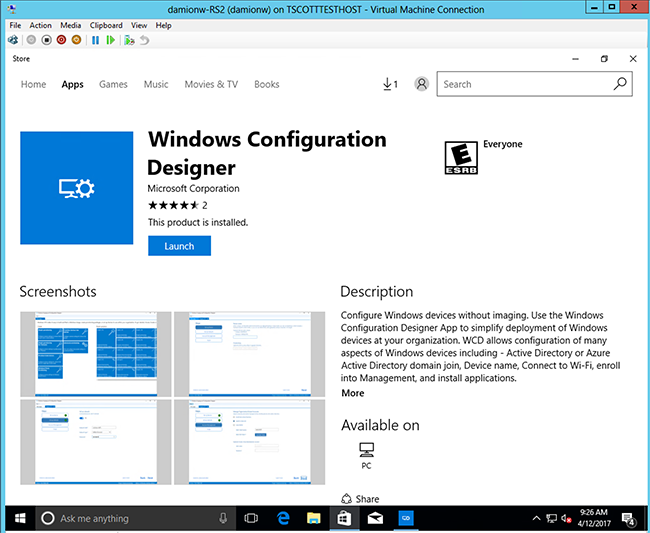
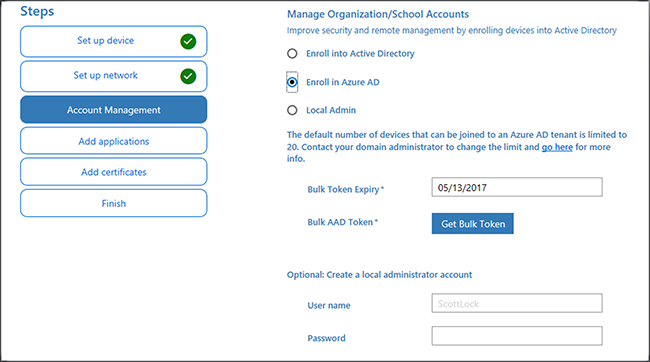

# Bulk enrollment for Windows devices  

**Applies to**  
- Windows 10  
- Windows 11  

Join new Windows devices to Azure Active Directory and Intune. To bulk enroll devices for your Azure AD tenant, you create a provisioning package with the Windows Configuration Designer (WCD) app. Applying the provisioning package to corporate-owned devices joins the devices to your Azure AD tenant and enrolls them for Intune management. Once the package is applied, it's ready for your Azure AD users to sign in.

> [!NOTE]
> Users must have a specific Azure AD role assignment to create a bulk enrollment token. You can assign these roles in Intune for Education > **Tenant settings** or in the Microsoft Intune admin center > **Tenant administration**. The roles are:  
> - Global Administrator
> - Cloud Device Administrator
> - Intune Administrator
> - Password Administrator 

Azure AD users are standard users on these devices and receive assigned Intune policies and required apps. Windows devices that are enrolled into Intune using Windows bulk enrollment can use the Company Portal app to install available apps. 

## Prerequisites for Windows devices bulk enrollment

- Devices running Windows 11 or Windows 10 Creator update (build 1709) or later  
- [Windows automatic enrollment](windows-enroll.md#enable-windows-automatic-enrollment)

## Create a provisioning package

1. Download [Windows Configuration Designer (WCD)](https://www.microsoft.com/p/windows-configuration-designer/9nblggh4tx22) from the Microsoft Store.
   

1. Open the **Windows Configuration Designer** app and select **Provision desktop devices**.
   

1. A **New project** window opens where you specify the following information:
   - **Name** - A name for your project
   - **Project folder** - Save location for the project
   - **Description** - An optional description of the project
   

1. Enter a unique name for your devices. Names can include a serial number (%SERIAL%) or a random set of characters. Optionally, you can also enter a product key if you are upgrading the edition of Windows, configure the device for shared use, and remove pre-installed software.
   
   

1. Optionally, you can configure the Wi-Fi network devices connect to when they first start.  If the network devices aren't configured, a wired network connection is required when the device is first started.
   

1. Select **Enroll in Azure AD**, enter a **Bulk Token Expiry** date, and then select **Get Bulk Token**. The token validity period is 180 days.
   

   > [!NOTE]
   > Once a provisioning package is created, it can be revoked before its expiration by removing the associated package_{GUID} user account from Azure AD.

1. Provide your Azure AD credentials to get a bulk token.
   

   > [!NOTE]
   > The account used to request the bulk token must be included in the [MDM user scope](windows-enroll.md#enable-windows-automatic-enrollment) that is specified in Azure AD.

1. In the **Stay signed in to all your apps** page, select **No, sign in to this app only**. If you keep the check box selected and press OK, the device you are using will become managed by your organization. If you do not intend for your device to be managed, make sure to select **No, sign in to this app only**. 

1. Click **Next** when **Bulk Token** is fetched successfully.

1. Optionally, you can **Add applications** and **Add certificates**. These apps and certificates are provisioned on the device.

1. Optionally, you can password protect your provisioning package.  Click **Create**.
    

## Provision devices

1. Access the provisioning package in the location specified in **Project folder** specified in the app.

2. Choose how you're going to apply the provisioning package to the device.  A provisioning package can be applied to a device one of the following ways:
   - Place the provisioning package on a USB drive, insert the USB drive into the device you'd like to bulk enroll, and apply it during initial setup
   - Place the provisioning package on a network folder, and apply it after initial setup

   For step-by-step instruction on applying a provisioning package, see [Apply a provisioning package](/windows/configuration/provisioning-packages/provisioning-apply-package).

3. After you apply the package, the device will automatically restart in one minute.
   

4. When the device restarts, it connects to the Azure Active Directory and enrolls in Microsoft Intune.

## Troubleshooting Windows bulk enrollment

### Provisioning issues
Provisioning is intended to be used on new Windows devices. Provisioning failures might require a wipe of the device or device recovery from a boot image. These examples describe some reasons for provisioning failures:

- A provisioning package that attempts to join an Active Directory domain or Azure Active Directory tenant that does not create a local account could make the device unreachable if the domain-join process fails due to lack of network connectivity.
- Scripts run by the provisioning package are run in system context. The scripts are able to make arbitrary changes to the device file system and configurations. A malicious or bad script could put the device in a state that can only be recovered by reimaging or wiping the device.

You can check for success/failure of the settings in your package in the **Provisioning-Diagnostics-Provider** Admin log in Event Viewer.

> [!NOTE]
> Bulk enrollment is considered a userless enrollment method, and because of it, only the "Default" enrollment restriction in Intune would apply during enrollment. Make sure Windows platform is allowed in the default restriction, otherwise, the enrollment will fail.
> To check the capabilities alongside other Windows enrollment methods, see [Intune enrollment method capabilities for Windows devices](enrollment-method-capab.md).  

### Bulk enrollment with Wi-Fi 

When not using an open network, you must use [device-level certificates](../protect/certificates-configure.md) to initiate connections. Bulk enrolled devices are unable to use to user-targeted certificates for network access. 

### Conditional access

Conditional access is available for devices enrolled via bulk enrollment running Windows 11 or Windows 10, version 1803 and later.  
