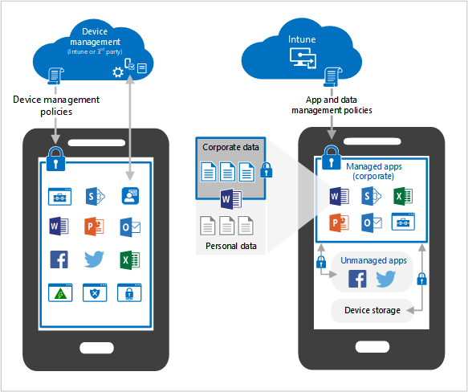

---
# required metadata
title: Technology decisions for BYOD with EMS
description: Key technology decisions to enable BYOD and protect corporate data with Microsoft Enterprise Mobility + Security.
keywords:
author: dougeby
ms.author: dougeby
manager: dougeby
ms.date: 12/8/2017
ms.topic: conceptual
ms.service: microsoft-intune
ms.subservice: fundamentals
ms.localizationpriority: high
ms.assetid: 297926f6-c029-4003-bda4-9ee031d47dda

# optional metadata

#ROBOTS:
#audience:

ms.reviewer: pfetty
ms.suite: ems
search.appverid: MET150
#ms.tgt_pltfrm:
#ms.custom:
ms.collection:
- tier2
- M365-identity-device-management
---

# Technology decisions for enabling BYOD with Microsoft Enterprise Mobility + Security (EMS)

As you develop your strategy to enable employees to work remotely on their own devices (BYOD), you need to make key decisions in the scenarios to enable BYOD and how to protect your corporate data. Fortunately, EMS offers all of the capabilities you need in a comprehensive set of solutions.  

In this topic, we examine the simple use case of enabling BYOD access to corporate email. We'll focus on whether or not you need to manage the entire device or just the applications, both of which are completely valid choices.

## Assumptions
* You have basic knowledge of Azure Active Directory and Microsoft Intune
* Your email accounts are hosted in Exchange Online

## Common reasons to manage the device (MDM)
You can easily drive users to enroll their devices into device management by deploying a [Conditional Access](/azure/active-directory/active-directory-conditional-access-azure-portal) policy on Exchange Online. Here are the reasons you might want to manage personal devices:

**WiFi/VPN** – If your users need a corporate connectivity profile to be productive, this can be seamlessly configured.

**Applications** – If your users need a set of apps to be pushed to their device, these can be seamlessly delivered. This includes applications that you might require for security purposes, like a Mobile Threat Defense app.

**Compliance** – Some organizations need to comply with regulatory or other policies that call out specific MDM controls. For example, you need MDM to encrypt the entire device or to produce a report of all apps on the device.

## Common reasons to only manage the apps (MAM)
MAM without MDM is very popular for organizations that support BYOD. You can drive users to access email from Outlook Mobile (which supports MAM protections) by deploying a Conditional Access policy on Exchange Online. Here are the reasons you might want to only manage apps on personal devices:

**User experience** – MDM enrollment includes many warning prompts (enforced by the platform) that often result in the user deciding they would rather not access their email on their personal device after all. MAM is much less alarming to users, as they simply get a pop-up one time to let them know MAM protections are in place.

**Compliance** – Some organizations need to comply with policies that require less management capabilities on personal devices. For example, MAM is only able to remove corporate data from the apps, as opposed to MDM which is able to remove all data from the device.

Learn more about [device management and app management lifecycles](device-lifecycle.md).

## MDM vs MAM capability comparison
As already mentioned, Conditional Access can drive a user to enroll their device or use a managed app like Outlook Mobile. Many other conditions can be applied in either case, including:

* Which user is attempting the access
* Whether the location is trusted or untrusted
* Sign-in risk level
* Device platform

Still, many organizations often have specific risks they're concerned about.  The table below lists the common concerns and MDM vs MAM response to that concern.

| Concern   |   MDM  |   MAM  |
|------------|--------|--------|
|Unauthorized data access | Require group membership | Require group membership |
|Unauthorized data access | Require device enrollment | Require protected app |
|Unauthorized data access | Require specific location | Require specific location |
| | | |
|Compromised user account| Require MFA | Require MFA|
|Compromised user account | Block high risk users | Block high risk users |
|Compromised user account | Device PIN | App PIN |
| | | |
| Compromised device or app | Require a compliant device | Jailbreak/root check on app launch |
| Compromised device or app | Encrypt device data | Encrypt app data |
| | | |
|Lost or stolen device | Remove all device data | Remove all app data|
| | | |
| Accidental data sharing or saving to unsecured locations | Restrict device data backups | Restrict backups of org data |
| Accidental data sharing or saving to unsecured locations | Restrict save-as | Restrict save-as |
|Accidental data sharing or saving to unsecured locations | Disable printing | Disable printing of org data |

## Next steps
Now it's time to decide if you are going to enable BYOD in your organization by focusing on device management, app management, or a combination of the two. The implementation choice is yours, where you can rest assured that the identity and security features available with Azure AD will be available regardless.  

Use the Intune [Planning Guide](intune-planning-guide.md) to map out your next level of planning.