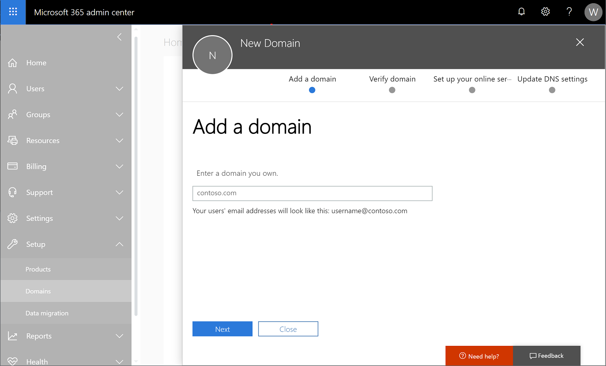

---
# required metadata

title: Configure a custom domain name
titleSuffix: Microsoft Intune
description: Add a custom domain name for your Microsoft Intune subscription
keywords:
author: dougeby
ms.author: dougeby
manager: dougeby
ms.date: 06/26/2019
ms.topic: how-to
ms.service: microsoft-intune
ms.subservice: fundamentals
ms.localizationpriority: high
ms.assetid: 2382f36f-13d8-4a32-81ad-6cfa604889c3

# optional metadata

#ROBOTS:
#audience:

ms.reviewer: angerobe
ms.suite: ems
search.appverid: MET150
#ms.tgt_pltfrm:
ms.custom: intune-classic; get-started
ms.collection:
- tier2
- M365-identity-device-management
---

# Configure a custom domain name

This topic tells administrators how you can create a DNS CNAME to simplify and customize your logon experience using Microsoft Intune.

When your organization signs up for a Microsoft cloud-based service like Intune, you're given an initial domain name hosted in Azure Active Directory (AD) that looks like **your-domain.onmicrosoft.com**. In this example, **your-domain** is the domain name that you chose when you signed up. **onmicrosoft.com** is the suffix assigned to the accounts you add to your subscription. You can configure your organization's custom domain to access Intune instead of the domain name provided with your subscription.

Before you create user accounts or synchronize your on-premises Active Directory, we strongly recommend that you decide whether to use only the .onmicrosoft.com domain or to add one or more of your custom domain names. Set up a custom domain before adding users to simplify user management. Setting up a customer domain lets users sign in with the credentials they use to access other domain resources.

When you subscribe to a cloud-based service from Microsoft, your instance of that service becomes a Microsoft  [Azure AD tenant](/previous-versions/azure/azure-services/jj573650(v=azure.100)#BKMK_WhatIsAnAzureADTenant), which provides identity and directory services for your cloud-based service. And, because the tasks to configure Intune to use your organizations custom domain name are the same as for other Azure AD tenants, you can use the information and procedures found in [Add your domain](/azure/active-directory/fundamentals/add-custom-domain).

> [!TIP]
> To learn more about custom domains, see [Conceptual overview of custom domain names in Azure Active Directory](/azure/active-directory/users-groups-roles/domains-manage).

You cannot rename or remove the initial onmicrosoft.com domain name. You can add, verify, or remove custom domain names used with Intune to keep your business identity clear.

## To add and verify your custom domain

1. Go to [Microsoft 365 admin center](https://admin.microsoft.com/) and sign into your administrator account.

2. In the navigation pane, choose **Setup** &gt; **Domains**.

3. Choose **Add domain**, and type your custom domain name. Select **Next**.
   
4. The **Verify domain** dialog box opens giving you the values to create the TXT record in your DNS hosting provider.
    - **GoDaddy users**: Microsoft 365 admin center redirects you to GoDaddy's login page. After you enter your credentials and accept the domain change permission agreement, the TXT record is created automatically. You can alternatively [create the TXT record](https://support.office.com/article/Create-DNS-records-at-GoDaddy-for-Office-365-f40a9185-b6d5-4a80-bb31-aa3bb0cab48a).
    - **Register.com users**: Follow the [step-by-step instructions](https://support.office.com/article/Create-DNS-records-at-Register-com-for-Office-365-55bd8c38-3316-48ae-a368-4959b2c1684e#BKMK_verify) to create the TXT record.
5. You may need to create additional DNS records for Intune enrollments. For more information, see [Enable auto-discovery of Intune enrollment server](../enrollment/windows-enrollment-create-cname.md).  

The steps to add and verify a custom domain can also be [performed in Azure Active Directory](/azure/active-directory/fundamentals/add-custom-domain).

You can learn more [about your initial onmicrosoft.com domain in Microsoft 365](https://support.office.com/article/About-your-initial-onmicrosoft-com-domain-in-Office-365-B9FC3018-8844-43F3-8DB1-1B3A8E9CFD5A).  