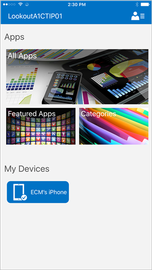

---
# required metadata

title: How your iOS/iPadOS users get their apps 
description: Methods for making iOS/iPadOS apps available to end users
keywords:
author: lenewsad
ms.author: lanewsad
manager: dougeby
ms.date: 05/07/2019
ms.topic: conceptual
ms.service: microsoft-intune
ms.subservice: fundamentals
ms.localizationpriority: high
ms.technology:
ms.assetid: 7e3135c1-df26-48c9-aa4c-cdab6168897a

# optional metadata

#ROBOTS:
#audience:
#ms.devlang:
ms.reviewer: aanavath
ms.suite: ems
search.appverid: MET150
#ms.tgt_pltfrm:
ms.custom: intune-classic
ms.collection: M365-identity-device-management
---

# How your iOS/iPadOS users get their apps

Use this information to understand how and where your end users get the apps that you distribute through Microsoft Intune.

**Required apps**--Apps that are required by the admin and that are installed on the device with minimal user involvement, depending on the platform.

**Available apps**--Apps that are provided in the Company Portal app list and that a user may optionally choose to install.

**Managed apps**--Apps that can be managed through policies and that have been "wrapped" by Intune or have been built with the Intune App Software Development Kit (SDK). These apps can be managed by Intune, and app protection policies can be applied to them.

**Unmanaged apps**--Apps that users can download from the iOS/iPadOS App Store that aren't integrated with the Intune app SDK. Intune doesn’t have any control over the distribution, management, or selective wipe of these apps.  

Apple restrictions prohibit line-of-business and managed App Store apps from being listed in the Company Portal app. To get around this issue, the tiles in the Company Portal app for iOS/iPadOS point users to different views in a single location (the Company Portal website) for all of their apps.

Enrolled users get their apps by tapping on the following tiles on the Apps screen of the Company Portal app:

- **All Apps** points to a list of all apps in the ALL tab of the [Company Portal website](https://portal.manage.microsoft.com).

- **Featured Apps** take users to the FEATURED tab of the Company Portal website.

- **Categories** points to the CATEGORIES tab of the Company Portal website.

For information on how to add apps, see [How to add an app to Microsoft Intune](../apps/apps-add.md).

## See also

[How your Android users get their apps](end-user-apps-android.md)

[How your Windows users get their apps](end-user-apps-windows.md)
