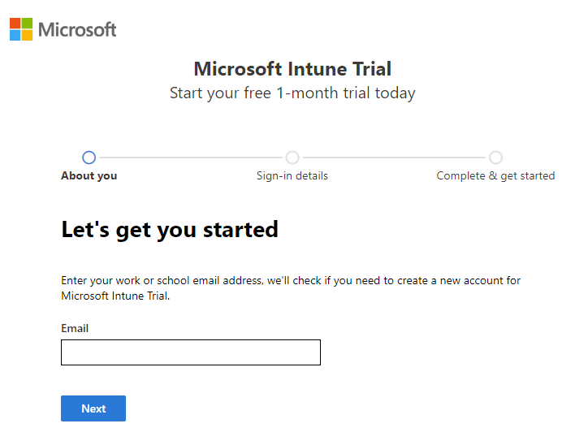
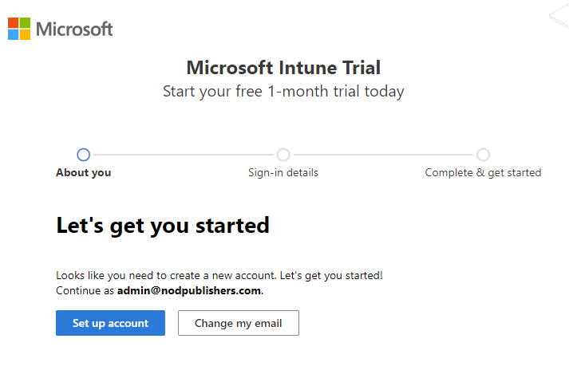
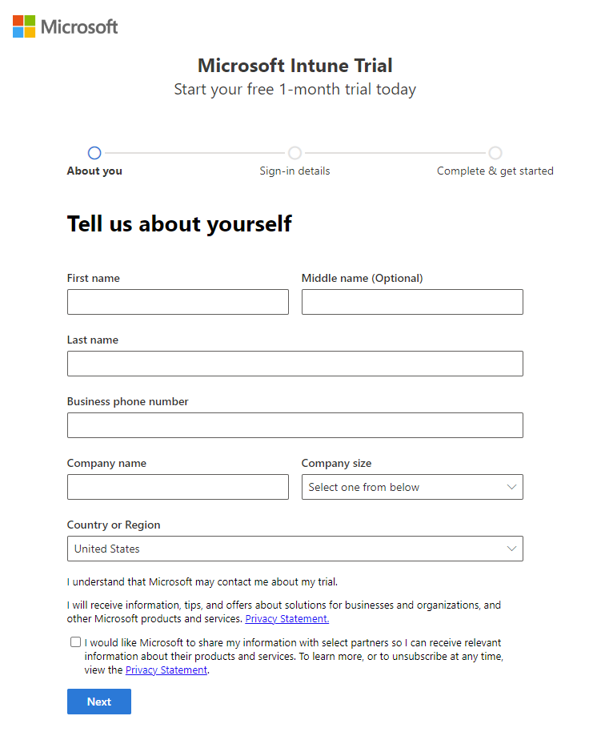
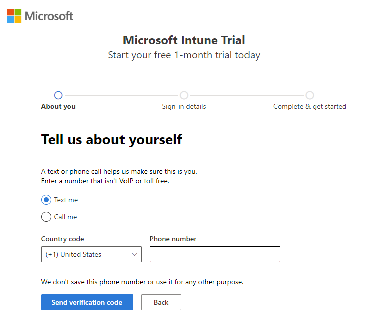
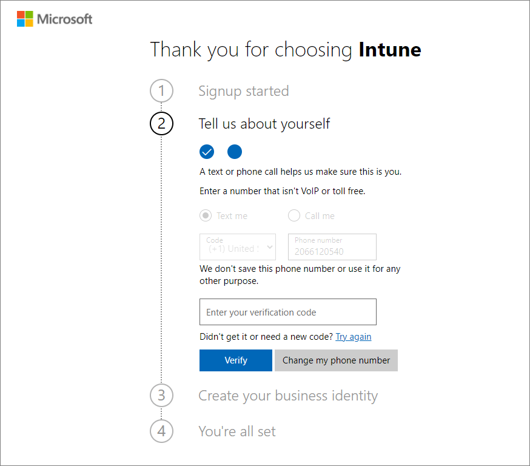
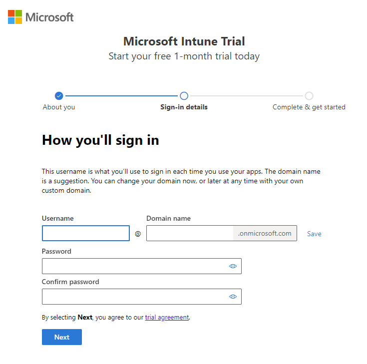
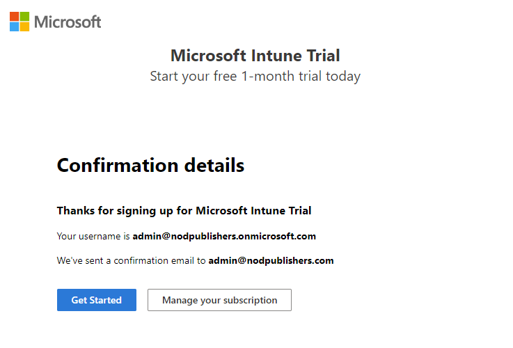
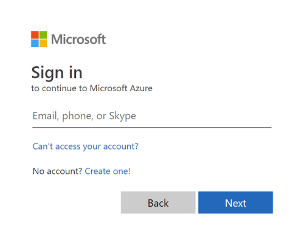
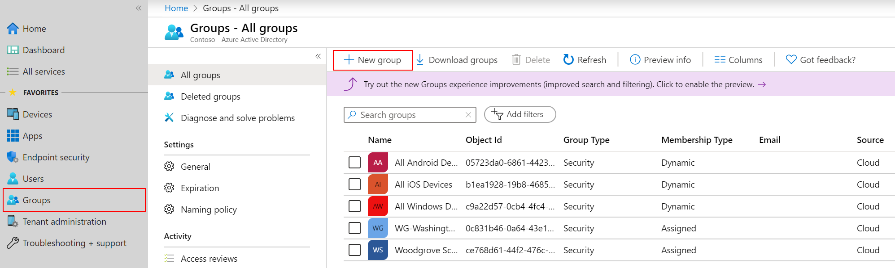
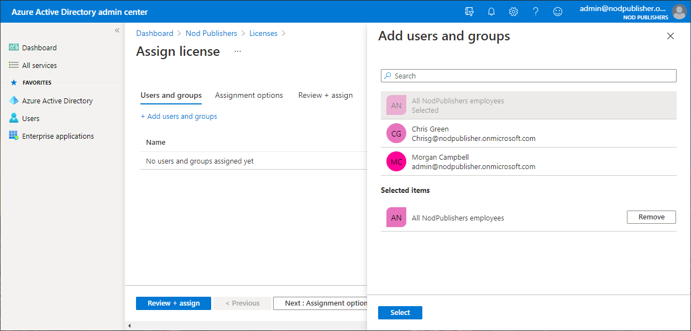

---
# required metadata

title: Try Microsoft Intune for free
titleSuffix: 
description: Understand how to create a free trial subscription, understand supported configurations and networking requirements, and optionally configure your domain name.
keywords:
author: Erikre
ms.author: erikre
manager: dougeby
ms.date: 11/21/2022
ms.topic: conceptual
ms.service: microsoft-intune
ms.subservice: fundamentals
ms.localizationpriority: high

# optional metadata

#ROBOTS:
#audience:

ms.reviewer:
ms.suite: ems
search.appverid: MET150
#ms.tgt_pltfrm:
ms.custom: intune-azure
ms.collection: 
  - M365-identity-device-management
  - highpri
---

# Try Microsoft Intune for free

The devices that the people at your organization use to be productive must be managed before you can give them access to your organization's resources. In addition, the same devices must be managed before you can configure the settings for those devices. You can use Microsoft Intune as a cloud-base endpoint management solution to ensure your workforce's corporate resources (data, devices, and apps) are correctly configured, accessed, and updated, meeting your company's compliance policies and requirements.

> [!VIDEO https://www.microsoft.com/videoplayer/embed/RWAoF9]

Microsoft Intune, which is a part of Microsoft Endpoint Manager, provides the cloud infrastructure, the cloud-based mobile device management (MDM), the cloud-based mobile application management (MAM), and the cloud-based PC management for your organization. It lets you protect your organization by controlling features and settings on Android, Android Enterprise, iOS/iPadOS, macOS, and Windows 10/11 devices. It integrates closely with Azure Active Directory (Azure AD) for identity and access control and also Azure Information Protection to help protect your organization's data. If you have on-premises infrastructure, such as Exchange or an Active Directory, you can use Intune connectors to help you connect to external services. Intune is included in Microsoft's [Enterprise Mobility + Security (EMS) suite](https://www.microsoft.com/microsoft-365/enterprise-mobility-security?azure-portal=true).

Suppose that you're the administrator or business decision maker of a company with several thousand employees. You need to keep your corporate data safe by protecting data, apps, and devices that your employees use, as well as keep your employees productive and maximize the return on your investment. You and your company have determined that Microsoft Intune is the endpoint management solution that they want to use to manage end users devices, apps, and data. You currently have a limited Mobile Device Management solution. Learn how you can set up Microsoft Intune and [benefit from modern endpoint management](/learn/modules/benefits-microsoft-endpoint-manager?azure-portal=true).

In this topic, you'll step through the process of setting up Microsoft Intune. Also, this topic will provide the choices and considerations you need to make when setting up an endpoint management solution such as Intune.

In this topic, you will:
  - Review the supported configurations
  - Sign up for the Microsoft Intune trial
  - Configure the Intune tenant domain name
  - Add users to Intune
  - Create groups in Intune
  - Assign licenses to users
  - Grant admin permissions for Intune
  - Understand the MEM authority

> [!IMPORTANT]
> If you're currently using Microsoft Endpoint Configuration Manager to manage computers and servers, you can [cloud-attach Configuration Manager with co-management](/configmgr/comanage/overview?azure-portal=true). Cloud attach lets you to leverage both Configuration Manager and Microsoft Intune from Microsoft Endpoint Manager.

When you complete the sign up process, you'll have a new tenant. A tenant is a dedicated instance of Azure Active Directory (Azure AD) where your subscription to Intune is hosted. You can then configure the tenant, add users and groups, and assign licenses to users. When you're ready, you can help users enroll their devices and add apps that they need to begin the modern endpoint management process. As you continue, you can set configuration and protection policies, as well as other endpoint management capabilities.

## Prerequisites
Before setting up Microsoft Intune, review the following requirements:

- [Supported operating systems and browsers](supported-devices-browsers.md)
- [Network configuration requirements and bandwidth](network-bandwidth-use.md)
- Basic knowledge of Microsoft Endpoint Manager and endpoint management concepts, see [Microsoft Endpoint Manager fundamentals](/training/paths/endpoint-manager-fundamentals/).
- Understand your endpoint management objectives, device inventory considerations, licensing needs, infrastructure objectives, and rollout plans, see [Determine your endpoint management implementation](/learn/modules/determine-endpoint-implementation?azure-portal=true).

## Review supported configurations

Before you begin setting up Microsoft Intune, you can review the device platforms and operating systems that are supported by Intune. Additionally, you can learn which web browsers are supported when accessing Intune using Microsoft Endpoint Manager admin center. Also, you should be familiar with the network bandwidth requirements to perform installations and updates using Intune.

## Intune supported operating systems

You can manage devices running operating systems on the following platforms:
- Apple iOS/iPadOS
- macOS
- Android
- Android Enterprise
- Surface Hub
- Windows operating systems

For more information about Intune supported devices, platforms, and operating systems, see [Intune supported operating systems](/mem/intune/fundamentals/supported-devices-browsers?azure-portal=true#intune-supported-operating-systems).

### Intune supported web browsers

Different administrative tasks require that you use one of the following administrative websites when working with Intune:

- [Microsoft Endpoint Manager admin center](https://go.microsoft.com/fwlink/?linkid=2109431)
- [Microsoft 365 admin center](https://go.microsoft.com/fwlink/p/?LinkId=698854)
- [Azure Active Directory admin center](https://aad.portal.azure.com)

The following browsers are supported for these portals:

- Microsoft Edge (latest version)
- Microsoft Internet Explorer 11
- Safari (latest version, Mac only)
- Chrome (latest version)
- Firefox (latest version)

### Intune network configuration requirements

It is important to understand that there are different bandwidth requirements for your Intune deployments. To ensure devices receive the updates and content from Intune, they must periodically connect to the Internet. The time required to receive updates or content can vary, but they should remain continuously connected to the Internet for at least one hour each day.

**Content requiring a single installation:**

- Intune client installation
- Client enrollment package
- Endpoint Protection agent
- Operations Manager agent
- Policy agent
- Remote Assistance via Microsoft Easy Assist agent

**Content requiring daily updates:**
- Daily client operations
- Endpoint Protection malware definition updates

**Content requiring monthly updates:**
- Endpoint Protection engine update
- Software updates

Other content updates vary. For instance, content related to service packs and software distribution will vary depending on when you deploy service packs and software. For more information, see Intune's [average network traffic](/mem/intune/fundamentals/network-bandwidth-use?azure-portal=true#average-network-traffic).

### Intune bandwidth considerations

If bandwidth is a concern, you do have ways to reduce bandwidth that your tenant uses. For instances, you can do any of the following to reduce bandwidth:

- **Use a proxy server to cache content requests:** 
    A proxy server can cache content to reduce duplicate downloads and reduce network bandwidth from content from the Internet. For related information, see [Use a proxy server to cache content requests](/mem/intune/fundamentals/network-bandwidth-use?azure-portal=true#use-a-proxy-server-to-cache-content-requests).
 
- **Delivery Optimization:** 
    Delivery Optimization lets you use Intune to reduce bandwidth consumption when your Windows 10/11 devices download applications and updates. For related information, see [Delivery Optimization](/mem/intune/fundamentals/network-bandwidth-use?azure-portal=true#delivery-optimization).

- **Background Intelligent Transfer Service (BITS) and BranchCache:** 
    You can use Microsoft Intune to manage Windows PCs either as [mobile devices with mobile device management (MDM)](/mem/intune/enrollment/windows-enroll?azure-portal=true) or as computers with the Intune software client. Microsoft recommends that you use the MDM management solution whenever possible. For more information, see [Background Intelligent Transfer Service (BITS) and BranchCache](/mem/intune/fundamentals/network-bandwidth-use?azure-portal=true#background-intelligent-transfer-service-bits-and-branchcache).

## Sign up for a Microsoft Intune free trial

When you sign up for the Intune free trial, you create a new Intune trial subscription using your work or school account. The trial subscription last 30 days. If you choose, you can convert the trial subscription to a full subscription based on your choice of product licenses. If you already are using your work or school account for a Microsoft service, you can **sign in** with that account and add Intune to your subscription. If you're uncertain whether you have an existing account, you can follow the Intune free trial sign-up steps below to check whether you need to create a new account for Intune.

>[!WARNING]
>You can't combine an existing work or school account after you sign up for a new account.

When you complete the sign up process, you'll have a new tenant. A tenant is a dedicated instance of Azure Active Directory (Azure AD) where your subscription to Intune is hosted. You can then configure the tenant, add users and groups, and assign licenses to users. When you're ready, you can help users enroll their devices and add apps that they need to begin the modern endpoint management process. As you continue, you can set configuration and protection policies, as well as other endpoint management capabilities.

To sign up for the Microsoft Intune free trial, follow the steps below:

1. Navigate to the [Intune set up account page](https://admin.microsoft.com/Signup/Signup.aspx?azure-portal=true&OfferId=40BE278A-DFD1-470a-9EF7-9F2596EA7FF9&dl=INTUNE_A&ali=1#0%20).

2. Enter your email address and click **Next**.

   > [!NOTE]
   > If you already have an account set up with another Microsoft service using your email address, you can choose to sign in to use the account with the Intune trial, or you can create a new account. These steps assume you are creating a new account.

   

3. Click **Set up account** to create a new account.

   

4. Add your name, phone number, company name, company size, and region. Then, click **Next**.

      

5. Click **Send Verification Code** to verify the phone number you added.

      

6. Enter the verification code you receive on your mobile device, then click **Verify**.

      

7. Add a domain name for your trial that represents your business or organization. Your name will be added before *.onmicrosoft.com*. Click **Check availability** > **Next**. If you like, you can later change this domain name to your custom domain name.

      

8. Add your user name and password that you'll use to log in to Microsoft Intune. Review the trial agreement and privacy statement. Click **Sign up** to create your account.

    > [!IMPORTANT]
    > Be sure to make a note of your user name and password.

      

9. After your account has been created, you'll see your user name. You'll use this user name to log in to Intune. Additionally, you receive an email message that contains your account information at the email address that you provided during the sign-up process. This email confirms your subscription is active.

### Sign in to Microsoft Intune

Once you have signed up for Intune, you can use any device with a [supported browser](/mem/intune/fundamentals/supported-devices-browsers?azure-portal=true#intune-supported-web-browsers) to sign in to the [Microsoft Endpoint Manager admin center](https://go.microsoft.com/fwlink/??zure-portal=true&linkid=2109431) to administer the Intune service.

> [!NOTE]
> Microsoft Intune is a part of Microsoft Endpoint Manager. Microsoft Endpoint Manager is the overall management platform for managing, protecting, and monitoring all of your organization's endpoints.

1. In a supported web browser, navigate to the [Microsoft Endpoint Manager admin center](https://go.microsoft.com/fwlink/?azure-portal=true&linkid=2109431).
2. Sign in using your newly created user name and password.

### View Microsoft Intune free trial details

To view the Intune product details for your free trial, use the following steps:

1. Sign in to the [Microsoft 365 admin center](https://go.microsoft.com/fwlink/p/?LinkId=698854).
2. Select **Your products** > **Microsoft Intune Trial**.

The **Microsoft Intune Trial** pane provides license, subscription, and product details.

## Configure Intune tenant domain name

When your organization signs up for Microsoft Intune, you're given an initial domain name hosted in Azure Active Directory (Azure AD) that looks like **your-domain.onmicrosoft.com**. In this example, **your-domain** is the domain name that you chose when you signed up. **onmicrosoft.com** is the suffix assigned to all accounts added to subscriptions. You can optionally configure your organization's custom domain to access Intune, instead of the domain name provided with your subscription.

> [!NOTE]
> Setting up a custom domain name is **optional**. If you are simply evaluating Intune using the free trial, you can skip the steps in this section.

Azure AD is the underlying infrastructure that supports identity management for all Microsoft cloud services. Azure AD stores information about license assignment states for users. Your subscription to Intune is hosted by an [Azure AD tenant](/previous-versions/azure/azure-services/jj573650(v=azure.100)). The tenant represents your organization. It's a dedicated instance of Azure AD that your organization receives at the beginning of a relationship with Microsoft. It's in this Azure AD tenant that you register and manage your end user's devices and apps.

Before you create user accounts or synchronize your on-premises Active Directory (for those using Endpoint Configuration Manager), we strongly recommend that you decide whether to use only the *.onmicrosoft.com* domain or to add one or more of your custom domain names. Set up a custom domain before adding users will help to simplify user management. Setting up a custom domain lets users sign in with the credentials they use to access your organization's other domain resources.

> [!TIP]
> To learn more about custom domains, see [Managing custom domain names in your Azure Active Directory](/azure/active-directory/enterprise-users/domains-manage?azure-portal=true).

You would not rename or remove the initial *onmicrosoft.com* domain name. However, you can add, verify, or remove a custom domain name used with Intune to keep your business identity clear. You must have access to your own custom domain name in order to add it to your Intune tenant.

### Add and verify your custom domain (OPTIONAL)

1. Go to [Microsoft 365 admin center](https://admin.microsoft.com/?azure-portal=true) and sign into your administrator account.
2. In the navigation pane, choose **Setup** > **Get your custom domain set up** > **Get started**.

    > [!TIP]
    > In this step, you'll see a provided video. Viewing this video will also show you how to add your domain.

3. Add your domain name and then click **Use this domain**.

    

    If you are using a common domain registrar like GoDaddy or WordPress, verifying your domain is a quick process. In this case, you'll see a 'sign in' option to verify your domain.

    The **Verify domain** dialog box opens, giving you the values to create the TXT record in your DNS hosting provider.
    - **GoDaddy users**: Microsoft 365 admin center redirects you to GoDaddy's login page. After you enter your credentials and accept the domain change permission agreement, the TXT record is created automatically. You can alternatively [create the TXT record](https://support.office.com/article/Create-DNS-records-at-GoDaddy-for-Office-365-f40a9185-b6d5-4a80-bb31-aa3bb0cab48a?azure-portal=true).
    - **Register.com users**: Follow the [step-by-step instructions](https://support.office.com/article/Create-DNS-records-at-Register-com-for-Office-365-55bd8c38-3316-48ae-a368-4959b2c1684e#BKMK_verify?azure-portal=true) to create the TXT record.

4. If you see the options to add a TXT record, add an MX record, or add a text file to the domain's website, you'll need to choose how you want to verify your domain. 

   

   The steps to add and verify a custom domain can also be [performed in Azure Active Directory](/azure/active-directory/fundamentals/add-custom-domain?azure-portal=true).

## Add users to Intune

The people in your organization each need a user account before they can sign in and access Microsoft Intune. To create user accounts, you can add users to Intune. Once added, you can grant permissions and assign licenses to users. Then later, you can assign different types of policies to users to help and protect them.

As an administrator, you can add users individually or in bulk to Intune. The easiest way to add user accounts is to add them one at a time in the Microsoft Endpoint Manager admin center.

> [!NOTE]
> You must be an admin (global, license, or a user admin) to add users to Intune. If you set up Intune using the free trial, you are a global admin.

### Add individual Intune users one at a time

The following steps allow you to add individual users to Intune:

1. In the [Microsoft Endpoint Manager admin center](https://go.microsoft.com/fwlink/?linkid=2109431?azure-portal=true), choose **Users** > **All users** > **New user** > **Create user**.
2. Specify the following user details:
   - **User name** - The new name that the user will use to sign in to Azure Active Directory.
   - **Name** - The user's given name. 
3. Choose whether you want to create the password for the new user or have it autogenerated.  
4. (Optional) If you have already created a new group, you can assign the new user to the group. To assign the new user to groups, choose **0 groups selected** to open the **Groups** pane. Here you can select the groups you want to assign to the user. When finished selecting groups, choose **Select**.
5. (Optional) By default, the new user is assigned the role of **User**. If you want to add roles to the user, select **User** next to **Roles**. In the **Directory roles** pane, select the roles you want to assign to the user and then choose **Select**.
6. If you want to block the user from signing in, you can select **Yes** for **Block sign in**. Make sure to switch this back to **No** when you're ready to let the user sign in.
7. Choose a **Usage location** for the new user. Usage location is required before you can assign the new user an Intune license.
8. (Optional) You can also provide information for the **Job title**, **Department**, **Company name**, and **Manager** fields.
9. Select **Create** to add the new user to Intune.

### Add multiple Intune users at the same time

You can add Intune users in bulk by uploading a csv file containing the full list of users. The following steps allow you to add multiple users to Intune:

1. In the [Microsoft Endpoint Manager admin center](https://go.microsoft.com/fwlink/?linkid=2109431?azure-portal=true), choose **Users** > **All users** > **Bulk operations** > **Bulk create**. The **Bulk create user** pane is displayed.
2. Download, edit, and upload a *csv* template containing a list of users that you want to add to Intune. 

The *csv* file is a comma-separated value list that can be edited in Notepad or Excel. For more information about using a *csv* file to add Intune users, see [Bulk create users in Azure Active Directory](/azure/active-directory/enterprise-users/users-bulk-add?azure-portal=true).

> [!NOTE]
> If you're using [Microsoft Endpoint Configuration Manager](/learn/modules/intro-to-endpoint-manager/4-endpoint-configuration-manager?azure-portal=true) for your on-premises device management, you can configure directory synchronization to import user accounts from your on-premises Active Directory to Microsoft Azure Active Directory (Azure AD). Having your on-premises Active Directory service connected with all of your Azure Active Directory-based services makes managing user identity much simpler. You can use the [Azure AD Connect wizard](https://www.microsoft.com/download/details.aspx?azure-portal=true&id=47594) to connect your on-premises identity infrastructure to the cloud.

You can also add users manually using the Microsoft 365 admin center. For more information, see [Add Intune users in the Microsoft 365 admin center](/mem/intune/fundamentals/users-add#add-intune-users-in-the-microsoft-365-admin-center?azure-portal=true) and [Add users and assign licenses at the same time](https://support.office.com/article/Add-users-individually-or-in-bulk-to-Office-365-Admin-Help-1970f7d6-03b5-442f-b385-5880b9c256ec?azure-portal=true).

## Create groups in Intune

Intune uses Azure Active Directory (Azure AD) groups to organize and manage devices and users. As an Intune admin, you can set up groups to suit your organizational needs. For instance, you can create groups to organize users or devices by geographic location, department, or hardware characteristics. Also, you can use groups to manage tasks at scale. For example, you can set policies for many users or deploy apps to a set of devices based on groups.

You can add the following types of groups in Intune:

- **Assigned groups** - Manually add users or devices into a static group.
- **Dynamic groups** (Requires [Azure AD Premium](/azure/active-directory/fundamentals/active-directory-get-started-premium)) - Automatically add users or devices to user groups or device groups based on an expression you create. For example, when a user is added with the manager title, the user is automatically added to an **All managers** users group. Or, when a device has the iOS/iPadOS device OS type, the device is automatically added to an **All iOS/iPadOS devices** group.

### Add a new group

Use the following steps to create a new group:

1. Sign in to the [Microsoft Endpoint Manager admin center](https://go.microsoft.com/fwlink/?linkid=2109431).
2. Select **Groups** > **New group**:

   

3. In **Group type**, choose one of the following options:

    - **Security**: Security groups are used to assign apps, resources, and licenses to group members. Group members can be users, devices, service principals, and other groups. Security groups are recommended for your groups in Intune. You can create groups for users, such as **All Charlotte employees** or **Remote workers**. Or, create groups for devices, such as **All iOS/iPadOS devices** or **All Windows 10 student devices**.
    - **Microsoft 365**: Microsoft 365 groups collaboration opportunities by members access to a shared mailbox, calendar, files, SharePoint sites, and more. Group members can only be users. This option also lets you give people outside of your organization access to the group. For more information, see [Learn about Microsoft 365 Groups](https://support.office.com/article/learn-about-office-365-groups-b565caa1-5c40-40ef-9915-60fdb2d97fa2).

    > [!TIP]
    > The users and groups created can also be seen in the [Microsoft 365 admin center](https://admin.microsoft.com), [Azure Active Directory admin center](https://aad.portal.azure.com), and [Microsoft Intune in the Endpoint Manager admin center](https://go.microsoft.com/fwlink/?linkid=2090973). In your organization tenant, you can create and manage groups in all these areas.
    >
    > If your primary role is device management, we recommend you use the [Microsoft Endpoint Manager admin center](https://go.microsoft.com/fwlink/?linkid=2109431).

4. Enter a **Group name** and **Group description** for the new group.
5. Select whether Azure AD roles can be assigned to the group. If you choose **Yes**, you can assign a cloud group to Azure AD built-in roles. With this feature, you can use groups to grant admin access in Azure AD with minimal effort from your Global and Privileged role admins. Once set, the group's eligibility for role assignment is permanent.​ For more information, see [Use cloud groups to manage role assignments in Azure Active Directory](/azure/active-directory/roles/groups-concept).
6. Select the **Membership type**. Your options include the following choices:

    - **Assigned**: Administrators manually assign users or devices to this group, and manually remove users or devices.
    - **Dynamic User**: Administrators create membership rules to automatically add and remove members.
    - **Dynamic Device**: Administrators create dynamic group rules to automatically add and remove devices.

    > [!NOTE]
    > In this admin center, when you create users or groups, you might not see the **Azure Active Directory** branding. But, that's what you're using.
7. Choose whether you want to add owners and members at this time.
8. Click **Create** to add the new group. Your group is shown in the list.

You can create a wide variety of dynamic user and device groups you, such as:
- All Students in Contoso high school
- All Android Enterprise devices
- All iOS 11 and older devices
- Marketing
- Human Resources
- All Charlotte employees
- All WA employees

### Groups and policies

Access to your organization's resources are controlled by users and groups you create.

When you create groups, consider how you'll apply [compliance policies](/mem/intune/protect/device-compliance-get-started?azure-portal=true) and [configuration profiles](/mem/intune/configuration/device-profiles?azure-portal=true). For example, you might have:

- Policies that are specific to a device operating system.
- Policies that are specific to different roles in your organization.
- Policies that are specific to organizational units you defined in Active Directory.

To create the basic compliance requirements of your organization, you can create a default policy that applies to all groups and devices. Then, create more specific policies for the broadest categories of users and devices. For example, you might create email policies for each of the device operating systems.

## Assign licenses to users

Microsoft Intune is available for different organization sizes and needs, from a simple-to-use management experience for schools and small businesses, to more advanced functionality required by enterprise customers. An admin must have a license assigned to them to administer Intune (unless you have selected to allow unlicensed admins).

Whether you added users one at a time or all at once, you must assign each user an Intune license before users can enroll their devices in Intune. The Microsoft Intune free trial provides 25 Intune licenses. For a list of licenses, see [Licenses that include Intune](/mem/intune/fundamentals/licenses?azure-portal=true).

> [!NOTE]
> If you manage devices on-premises using Microsoft Endpoint Configuration Manager, you can also add cloud-based users and assign licenses to accounts synchronized from your on-premises Active Directory to Azure AD.

### Assign an Intune license to an individual user

The following steps allow you to assign an Intune license to a user:

1. In the [Microsoft Endpoint Manager admin center](https://go.microsoft.com/fwlink/?linkid=2109431), select **Users** > **All Users** > *the user's name* > **Licenses** > **Assignments**. The **Update license assignments** pane is displayed.

2. Choose the box for **Intune** > **Save**.

   The user account now has the permissions needed to use the service and enroll devices into management.

### Assign Intune licenses to multiple users

The following steps allow you to assign Intune licenses to multiple users all at once:

1. Sign in to the [**Azure AD admin center**](https://aad.portal.azure.com).

    > [!NOTE]
    > To manage licenses, the admin account must be a license administrator, user administrator, or global administrator. The account you create using the Intune free trial is a global administrator.

2. Select **Azure Active Directory** > **Licenses** > **All products** to see and manage all licensable products that you have available for your organization.
3. Select the box next to **Intune**.
4. Click **Assign** > **Add users and groups**.
5. If you have created a group of users, click the group to add it to the **Selected items** list. Otherwise, select individual users that you have created earlier. Click **Select** to confirm your selection.

   
  
6. Click **Next: Assignment options** to confirm **Microsoft Intune** is **On**.
7. Click **Review + assign** to confirm your license assignment settings.
10. Click **Assign** to assign the licenses to the selected users.

   A notification is displayed in the upper-right corner that shows the status and outcome of the process. If the assignment to the group couldn't be completed (for example, because of pre-existing licenses in the group), you can click the notification to view details.

   The user accounts now have the permissions needed to use the service and enroll devices into management.

You can also assign Intune licenses to users by using School Data Sync (SDS). For more information, see [Overview of School Data Sync](https://support.office.com/article/Overview-of-School-Data-Sync-and-Classroom-f3d1147b-4ade-4905-8518-508e729f2e91?azure-portal=true).

## Grant admin permissions for Intune

After you've added users to your Intune tenant, we recommend that you grant a few users administrative permission. Microsoft Intune includes a set of admin roles that you can assign to users in your organization using the Microsoft Endpoint Manager admin center. Each admin role maps to common business functions and gives people in your organization permissions to do specific tasks in the admin centers. 

The account you use to create your Microsoft Intune subscription is a global administrator. As a best practice, don't use a global administrator for day-to-day management tasks. While an administrator doesn't require an Intune license to access Intune within the Microsoft Endpoint Manager admin center, in order to perform certain management tasks, such as setting up the Exchange service Connector,  an Intune license is required.

### Give permissions in Microsoft Endpoint Manager admin center

Because Intune is a part of Microsoft Endpoint Manager, you can add roles using Microsoft Endpoint Manager admin center. To grant permissions, follow these steps:

1. Sign in to the [Microsoft Endpoint Manager admin center](https://go.microsoft.com/fwlink/?azure-portal=true&linkid=2109431) with a global administrator account > **Users** > **All users** > *the user's name*. You'll see the user's **Profile**.
2. Select **Assigned roles** > **Add assignments**.
3. In the **Directory roles** pane, select the roles you want to assign to the user.
4. Click **Add**.

### Give permissions in Microsoft 365 admin center

You can also use the Microsoft 365 admin center to add roles. There are a number of additional roles available in the Microsoft 365 admin center that you can use with a variety of Microsoft services. The Microsoft 365 admin center also lets you manage Azure AD roles and Microsoft Intune roles. 

> [!TIP]
> To access the Microsoft 365 admin center, your account must have a **Sign-in allowed** set. In the portal under **Profile**, set **Block sign in** to **No** to allow access. This status is different from having a license to the subscription. By default, all user accounts are **Allowed**. Users without administrator permissions can use the Microsoft 365 admin center to reset Intune passwords.

To grant permissions, follow these steps:

1. Sign in to the [Microsoft 365 admin center](https://admin.microsoft.com?azure-portal=true) with a global administrator account >  select **Users** > **Active users** > *choose the user to give admin permissions*.
2. In the user pane, choose **Manage roles** under **Roles**.

    > [!NOTE]
    > If you don't see a **Roles** section in the user pane, check whether the user has a license in the **Active users** list.
 
3. In the **Manage admin roles** pane, choose the admin permission to grant from the list of available roles.
4. Click **Save changes**.

### Common types of administrators

Assign users one or more administrator permissions. These permissions define the administrative scope for users and the tasks they can manage. Administrator permissions are common between the different Microsoft cloud services, and some services might not support some permissions. Both the Microsoft Endpoint Manager admin center and Microsoft 365 admin center list limited administrator roles that aren't used by Intune. Common Intune administrator permissions include the following options:

- **Global administrator** - (Microsoft 365 and Intune) Accesses all administrative features in Intune. By default the person who signs up for Intune becomes a Global admin. Global admins are the only admins who can assign other admin roles. You can have more than one global admin in your organization. As a best practice, we recommend that only a few people in your company have this role to reduce the risk to your business.
- **Password administrator** - (Microsoft 365 and Intune) Resets passwords, manages service requests, and monitors service health. Password admins are limited to resetting passwords for non-admin users and some admin roles.
- **Service support administrator** - (Microsoft 365 and Intune) Opens support requests with Microsoft, and views the service dashboard and message center. They have "view only" permissions except for opening support tickets and reading them.
- **Billing administrator** - (Microsoft 365 and Intune) Makes purchases, manages subscriptions, manages support tickets, and monitors service health.
- **User administrator** - (Microsoft 365 and Intune) Resets passwords, monitors service health, adds and deletes user accounts, and manages service requests. The user management admin can't delete a global admin, create other admin roles, or reset passwords for other admins.
- **Intune administrator** - Full access to Intune, manages users and devices to associate policies, as well as creates and manages groups. All Intune Global administrator permissions except permission to create administrators with **Directory Role** options.

For more information about roles, see [Admin roles in Microsoft 365](/microsoft-365/admin/add-users/about-admin-roles?azure-portal=true).

## Understand the MDM authority

The mobile device management (MDM) authority setting determines how you manage your devices. By default, the Intune free trial sets your MDM authority to Intune.

If you are changing your tenant to support Intune, you will need to change your MDM authority configuration. Possible configurations are the following choices:

- **Microsoft Intune** - This cloud-only management configuration includes the full set of capabilities that Microsoft Intune offers.
- **Intune co-management** - This configuration integrates Microsoft Intune with Microsoft Endpoint Configuration Manager. Configuration Manager allows you to manage on-premises Windows 10/11 devices. For more information, see [Enable co-management in Configuration Manager](/mem/configmgr/comanage/tutorial-co-manage-clients?azure-portal=true#enable-co-management-in-configuration-manager).
- **Basic Mobility and Security for Microsoft 365** - If you have this configuration activated, you'll see the MDM authority set to "Office 365". If you want to start using Intune, you'll need purchase an Intune license or sign up for the Intune free trial.
- **Basic Mobility and Security for Microsoft 365 [coexistence](/mem/intune/fundamentals/mdm-authority-set?azure-portal=true#coexistence)** - You can add Intune to your tenant if you're already using Basic Mobility and Security for Microsoft 365 and set the management authority to either Intune or Basic Mobility and Security for Microsoft 365 for each user to dictate which service will be used to manage their MDM-enrolled devices. Each user's management authority is defined based on the license assigned to the user: If the user has only a license for Microsoft 365 Basic or Standard, their devices will be managed by Basic Mobility and Security for Microsoft 365. If the user has a license entitling Intune, their devices will be managed by Intune. If you add a license entitling Intune to a user previously managed by Basic Mobility and Security for Microsoft 365, their devices will be switched to Intune management. Be sure to have Intune configurations assigned to users to replace Basic Mobility and Security for Microsoft 365 before switching users to Intune, otherwise their devices will lose Basic Mobility and Security for Microsoft 365 configuration and won't receive any replacement from Intune.

### Confirm your tenant's MDM authority

To confirm that your MDM authority is set to Intune, use the following steps:

1. In the [Microsoft Endpoint Manager admin center](https://go.microsoft.com/fwlink/?linkid=2109431), select **Tenant administration** > **Tenant status**.
2. Under the **Tenant details** tab, find **MDM authority**.

For more information, see [Set the mobile device management authority](/mem/intune/fundamentals/mdm-authority-set?azure-portal=true).

## Summary 

This topic provided the choices and considerations that are needed to set up the Microsoft Intune endpoint management solution. 

In this topic, you accomplished the following actions:

- Reviewed the supported configurations, which include the supported operating systems, browsers, and network
- Signed up for the Microsoft Intune trial
- Configured the Intune tenant domain name
- Added users to Intune
- Created groups in Intune
- Assigned licenses to users
- Granted admin permissions for Intune
- Learned about the Mobile Device Management (MDM) authority

## Next steps

To evaluate Microsoft Intune and the Microsoft technologies available with Microsoft's Enterprise Mobility + Security (EMS), continue with the free trial:
- [Get a free trial, evaluate Enterprise Mobility + Security (EMS)](https://go.microsoft.com/fwlink/?linkid=845167)

To get expert guidance to help plan, deploy, and migrate your organization to Microsoft Endpoint Manager, continue by learning more about FastTrack: 
- [Explore endpoint management support from FastTrack](https://go.microsoft.com/fwlink/?linkid=2143850)

## Resources

For more information about Microsoft Endpoint Manager, see the following resources:

- [Microsoft Endpoint Manager documentation](/mem/?azure-portal=true)
- [Steps to set up Intune](/mem/intune/fundamentals/setup-steps)