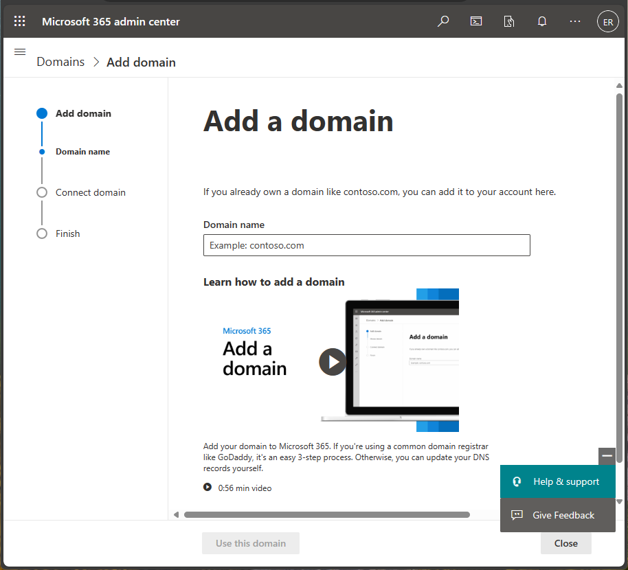

---
# required metadata

title: Quickstart - Try Microsoft Intune for free
titleSuffix: 
description: In this quickstart you will create a free trial subscription, understand supported configurations and networking requirements, and optionally configure your domain name.
keywords:
author: Erikre
ms.author: erikre
manager: dougeby
ms.date: 01/16/2020
ms.topic: quickstart
ms.service: microsoft-intune
ms.subservice: fundamentals
ms.localizationpriority: high
ms.technology:
ms.assetid: 195931c0-8208-43bd-b0af-b1f8e469a32c

# optional metadata

#ROBOTS:
#audience:

ms.reviewer:
ms.suite: ems
search.appverid: MET150
#ms.tgt_pltfrm:
ms.custom: intune-azure
ms.collection: M365-identity-device-management
---

# Quickstart: Try Microsoft Intune for free

Microsoft Intune helps you protect your workforce's corporate data by managing devices and apps. In this quickstart, you will create a free subscription to try Intune in a test environment.

Intune provides mobile device management (MDM) and mobile app management (MAM) from a secure cloud-based service that is administered using the Microsoft Endpoint Manager admin center. Using Intune, you ensure your workforce's corporate resources (data, devices, and apps) are correctly configured, accessed, and updated, meeting your company's compliance policies and requirements.

## Prerequisites
Before setting up Microsoft Intune, review the following requirements:

- [Supported operating systems and browsers](supported-devices-browsers.md)
- [Network configuration requirements and bandwidth](network-bandwidth-use.md)

## Sign up for a Microsoft Intune free trial

Trying out Intune is free for 30 days. If you already have a work or school account, **sign in** with that account and add Intune to your subscription. Otherwise, you can **sign up** for a new account to use Intune for your organization.

> [!IMPORTANT]
> You can't combine an existing work or school account after you sign up for a new account.

1. Go to the [Microsoft Intune Trial](https://go.microsoft.com/fwlink/?linkid=2019088) page and fill out the form.

    

    If most of your IT operations and users are in a different locale than you, you may want to select that locale under **Country or region**. Azure uses your regional information to deliver the right services. This setting can't be changed later.

2. Create an account using your company name followed by **.onmicrosoft.com**. 

    

    If your organization has its own custom domain that you want to use without **.onmicrosoft.com**, you can change that in the Microsoft 365 admin center described later in this article.

3. View your new account information at the end of the sign-up process.

     

## Sign in to Intune in the Microsoft Endpoint Manager

If you're not already signed in to the portal, complete the following steps:

1. Open a new browser window and enter **https://endpoint.microsoft.com** in the address bar. 
2. Use the user ID that you were given in the steps above to sign in (*yourID@yourdomain*.onmicrosoft.com).

    

When you sign up for a trial, you will also receive an email message that contains your account information and the email address that you provided during the sign-up process. This email confirms your trial is active.

> [!TIP]
> When working with the Microsoft Endpoint Manager, you may have better results working with a browser in regular mode, rather than private mode.

## Confirm the MDM authority in Intune

By default, the MDM authority is set when you create your free trial. You can confirm that the MDM authority is set by using the following steps:

1. If you're not already signed in, sign in to the Microsoft Endpoint Manager.
2. Click **Tenant administration**.
3. View the tenant details. The **MDM authority** should be set to **Microsoft Intune**.

If after signing in to the Microsoft Endpoint Manager, you see an orange banner indicating that you haven't yet set the MDM authority, you can activate it at this time. The mobile device management (MDM) authority setting determines how you manage your devices. The MDM authority must be set before users can enroll devices for management.

### To set the MDM authority to Intune, follow these steps:

1. Open a new browser window and enter **https://portal.azure.com** in the address bar. 
2. Choose **All services** > **Microsoft Intune**.
3. Select the banner indicating that you haven't enabled device management, or if you don't immediately see the banner, select **Device enrollment**. The **Choose MDM Authority** blade will be displayed if you haven't enabled device management yet.

    > [!NOTE]
    > If you have set the MDM Authority, you will see the MDM authority value on the **Device enrollment** blade. The orange banner is only displayed if you haven't yet set the MDM authority. 

     

4. If your MDM Authority is not set, under **Choose MDM Authority**, set your MDM authority to **Intune MDM Authority**.

For more information about the MDM authority, see [Set the mobile device management authority](mdm-authority-set.md).

## Configure your custom domain name (Optional)

As mentioned above, if your organization has its own custom domain that you want to use without **.onmicrosoft.com**, you can change it in the Microsoft 365 admin center. You can add, verify, and configure your custom domain name using the following steps.  

> [!IMPORTANT]
> You cannot rename or remove the *initial* **onmicrosoft.com** part of the domain name. However, you can add, verify or remove *custom* domain names used with Intune to keep your business identity clear. For more information, see [Configure a custom domain name](custom-domain-name-configure.md).

1. Go to [Microsoft 365 admin center](https://admin.microsoft.com) and sign in using your administrator account.

2. In the navigation pane, choose **Setup** > **Domains** > **Add domain**.

3. Type your custom domain name. Then, select **Next**.

   

4. Verify that you are the owner of the domain that you entered in the previous step. 
    
    Selecting **send code via email** will send an email to the registered contact of your domain. After you receive the email, copy the code and enter it in the field labeled **Type your verification code here**. If the verification code matches, the domain will be added to your tenant. The email displayed may not look familiar. Some registrars hide the real email address. Also, the email address may be different then what was provided when the domain was registered.

   

   > [!NOTE]
   > For TXT record verification details, see [Create DNS records at any DNS hosting provider for Office 365](https://support.office.com/article/Create-DNS-records-at-any-DNS-hosting-provider-for-Office-365-7B7B075D-79F9-4E37-8A9E-FB60C1D95166).

## Admin experiences

There are two portals that you will use most often:
- The Microsoft Endpoint Manager admin center ([https://endpoint.microsoft.com/](https://endpoint.microsoft.com/)) is where you can explore the [capabilities of Intune](what-is-intune.md). This is where an admin would work with Intune.
- The Microsoft 365 admin center ([https://admin.microsoft.com](https://admin.microsoft.com)) is where you can add and manage users, if you are not using Azure Active Directory for this. You can also manage other aspects of your account, including billing and support.

## Next steps

In this quickstart, you've created a free subscription to try Intune in a test environment. For more information about setting up Intune, see [Set up Intune](setup-steps.md).

To follow this series of Intune quickstarts, continue to the next quickstart.

> [!div class="nextstepaction"]
> [Quickstart: Create a user and assign a license to it](quickstart-create-user.md)
