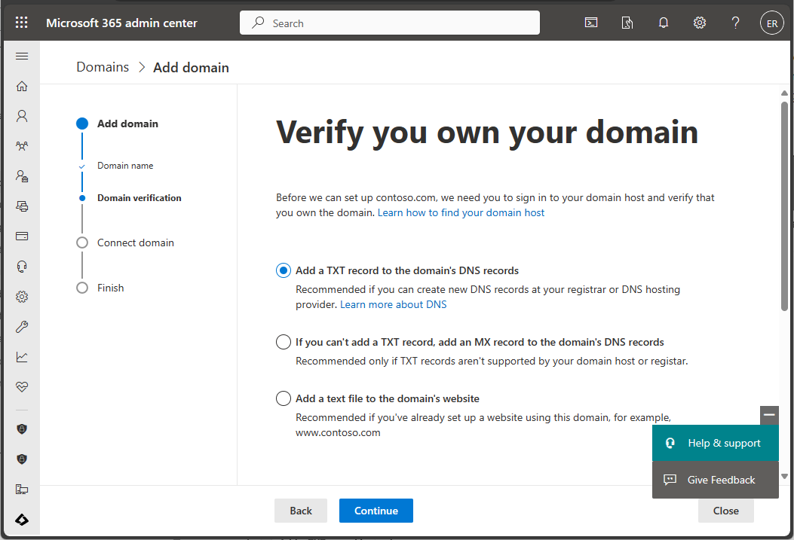

---
# required metadata

title: Try Microsoft Intune for free
titleSuffix: 
description: Create a free trial subscription, understand supported configurations and networking requirements, and optionally configure your domain name.
keywords:
author: Erikre
ms.author: erikre
manager: dougeby
ms.date: 01/30/2023
ms.topic: conceptual
ms.service: microsoft-intune
ms.subservice: fundamentals
ms.localizationpriority: high

# optional metadata

#ROBOTS:
#audience:

ms.reviewer:
ms.suite: ems
search.appverid: MET150
#ms.tgt_pltfrm:
ms.custom: intune-azure
ms.collection:
- tier1
- M365-identity-device-management
- highpri
---

# Try Microsoft Intune for free

Microsoft Intune helps you protect your workforce's corporate data by managing devices and apps. In this topic, you will create a free subscription to try Intune in a test environment.

Intune provides mobile device management (MDM) and mobile app management (MAM) from a secure cloud-based service that is administered using the Microsoft Intune admin center. Using Intune, you ensure your workforce's corporate resources (data, devices, and apps) are correctly configured, accessed, and updated, meeting your company's compliance policies and requirements.

When you complete the signup process, you'll have a new tenant. A tenant is a dedicated instance of Azure Active Directory (Azure AD) where your subscription to Intune is hosted. You can then configure the tenant, add users and groups, and assign licenses to users. When you're ready, you can help users enroll their devices and add apps that they need to begin the modern endpoint management process. As you continue, you can set configuration and protection policies, as well as other endpoint management capabilities.

## Prerequisites

Before setting up Microsoft Intune, review the following requirements:

- [Supported operating systems and browsers](supported-devices-browsers.md)
- [Network configuration requirements and bandwidth](network-bandwidth-use.md)

## Sign up for a Microsoft Intune free trial

Trying out Intune is free for 30 days. If you already have a work or school account, **sign in** with that account and add Intune to your subscription. Otherwise, you can **sign up** for a new account to use Intune for your organization.

> [!IMPORTANT]
> You can't combine an existing work or school account after you sign up for a new account.

To sign up for the Microsoft Intune free trial, follow the steps below:

1. Navigate to the [Intune set up account page](https://go.microsoft.com/fwlink/?linkid=2019088).

2. Enter your email address and click **Next**.

   > [!NOTE]
   > If you already have an account set up with another Microsoft service using your email address, you can choose to sign in to use the account with the Intune trial, or you can create a new account. These steps assume you are creating a new account.

   :::image type="content" source="./media/free-trial-sign-up/sign-up-for-intune-01.png" alt-text="Screenshot of the Microsoft Intune set up account page - Enter email" border="true":::

3. Click **Set up account** to create a new account.

   :::image type="content" source="./media/free-trial-sign-up/sign-up-for-intune-02.png" alt-text="Screenshot of the Microsoft Intune set up account page - Set up account" border="true":::

4. Add your name, phone number, company name, company size, and region. Review the remaining information and click **Next**.

   :::image type="content" source="./media/free-trial-sign-up/sign-up-for-intune-03.png" alt-text="Screenshot of the Microsoft Intune set up account page - Add account details" border="true":::

5. Click **Send verification code** to verify the phone number you added.

   :::image type="content" source="./media/free-trial-sign-up/sign-up-for-intune-04.png" alt-text="Screenshot of the Microsoft Intune set up account page -  Send verification code" border="true":::

6. Enter the verification code you receive on your mobile device, then click **Verify**.

   :::image type="content" source="./media/free-trial-sign-up/sign-up-for-intune-05.png" alt-text="Screenshot of the Microsoft Intune set up account page -  Verify code" border="true":::

7. Add your **Username** and **Domain name** for your trial that represents your business or organization. Your name will be added before *.onmicrosoft.com*. Click **Save** to check availability. Click **Next** to continue. If you like, you can later change this domain name to your custom domain name.

   :::image type="content" source="./media/free-trial-sign-up/sign-up-for-intune-06.png" alt-text="Screenshot of the Microsoft Intune set up account page -  Sign in" border="true":::

8. After your account has been created, you'll see your user name. You'll use this user name to log in to Intune. Additionally, you receive an email message that contains your account information at the email address that you provided during the sign-up process. This email confirms your subscription is active.

   :::image type="content" source="./media/free-trial-sign-up/sign-up-for-intune-07.png" alt-text="Screenshot of the Microsoft Intune set up account page -  Confirmation details" border="true":::

   > [!NOTE]
   > If you click **Get Started**, you'll open the **Microsoft 365 admin center** home page. If you click **Manage your subscription**, you'll open **Your products** and view details about your Microsoft Intune Trial subscription.

## Sign in to Intune in the Microsoft Intune admin center

If you're not already signed in to the admin center, complete the following steps:

1. Open a new browser window and enter **[https://endpoint.microsoft.com](https://endpoint.microsoft.com)** in the address bar.
2. Use the user ID that you were given in the steps above to sign in. The user ID will look similar to the following: *yourID@yourdomain.onmicrosoft.com*.

    

When you sign up for a trial, you will also receive an email message that contains your account information and the email address that you provided during the sign-up process. This email confirms your trial is active.

> [!TIP]
> When working with the Microsoft Intune, you may have better results working with a browser in regular mode, rather than private mode.

## Confirm the MDM authority in Microsoft Intune

By default, the Mobile Device Management (MDM) authority is set when you create your free trial. You can confirm that the MDM authority is set by using the following steps:

1. If you're not already signed in, sign in to the [Microsoft Intune admin center](https://go.microsoft.com/fwlink/?linkid=2109431).
2. Click **Tenant administration**.
3. View the tenant details. The **MDM authority** should be set to **Microsoft Intune**.

If after signing in to the Microsoft Intune admin center, you see an orange banner indicating that you haven't yet set the MDM authority, you can activate it at this time. The mobile device management (MDM) authority setting determines how you manage your devices. The MDM authority must be set before users can enroll devices for management.

### Set the MDM authority to Intune

1. If you do not have the MDM authority set, sign in to the [Microsoft Intune admin center](https://go.microsoft.com/fwlink/?linkid=2109431).
2. Select the orange banner to open the **Mobile Device Management Authority** setting. The orange banner is only displayed if you haven't yet set the MDM authority.

    > [!NOTE]
    > If you have set the MDM Authority, you will see the MDM authority value on the **Tenant administration** pane. The orange banner is only displayed if you haven't yet set the MDM authority.

   

3. If your MDM Authority is not set, under **Choose MDM Authority**, set your MDM authority to **Intune MDM Authority**.

For more information about the MDM authority, see [Set the mobile device management authority](mdm-authority-set.md).

## Configure your custom domain name (Optional)

As mentioned above, if your organization has its own custom domain that you want to use without **.onmicrosoft.com**, you can change it in the Microsoft 365 admin center. You can add, verify, and configure your custom domain name using the following steps.  

> [!IMPORTANT]
> You cannot rename or remove the *initial* **onmicrosoft.com** part of the domain name. However, you can add, verify or remove *custom* domain names used with Intune to keep your business identity clear. For more information, see [Configure a custom domain name](custom-domain-name-configure.md).

1. Go to [Microsoft 365 admin center](https://admin.microsoft.com) and sign in using your administrator account.

2. In the navigation pane, choose **Setup** > **Domains** > **Add domain**.

3. Type your custom domain name. Then, select **Next**.

   

4. Verify that you are the owner of the domain that you entered in the previous step.

    Selecting **send code via email** will send an email to the registered contact of your domain. After you receive the email, copy the code and enter it in the field labeled **Type your verification code here**. If the verification code matches, the domain will be added to your tenant. The email displayed may not look familiar. Some registrars hide the real email address. Also, the email address may be different than what was provided when the domain was registered.

   

   > [!NOTE]
   > For TXT record verification details, see [Create DNS records at any DNS hosting provider for Microsoft 365](https://support.office.com/article/Create-DNS-records-at-any-DNS-hosting-provider-for-Office-365-7B7B075D-79F9-4E37-8A9E-FB60C1D95166).

## Confirm your licenses

A Microsoft Intune license is created for you when you sign up for the Intune free trial. As part of this trial, you'll also have a trial Enterprise Mobility + Security (EMS) subscription. An Enterprise Mobility + Security (EMS) subscription includes both Azure Active Directory Premium and Microsoft Intune.

To confirm your Azure Active Directory Premium and Microsoft Intune, see [Confirm your licenses](../fundamentals/licenses.md#confirm-your-licenses).

## Admin experiences

There are two admin centers that you will use most often:

- The Microsoft Intune admin center ([https://endpoint.microsoft.com](https://endpoint.microsoft.com/)) is where you can explore the [capabilities of Intune](what-is-intune.md). This is where an admin would work with Intune.

- The Microsoft 365 admin center ([https://admin.microsoft.com](https://admin.microsoft.com)) is where you can add and manage users, if you are not using Azure Active Directory for this. You can also manage other aspects of your account, including billing and support.

## Next steps

In this topic, you've created a free subscription to try Intune in a test environment. For more information about setting up Intune, see [Set up Intune](setup-steps.md).

To continue to evaluate Microsoft Intune, go to the next step:

> [!div class="nextstepaction"]
> [Step 2 - Create a user and assign a license to it](quickstart-create-user.md)
