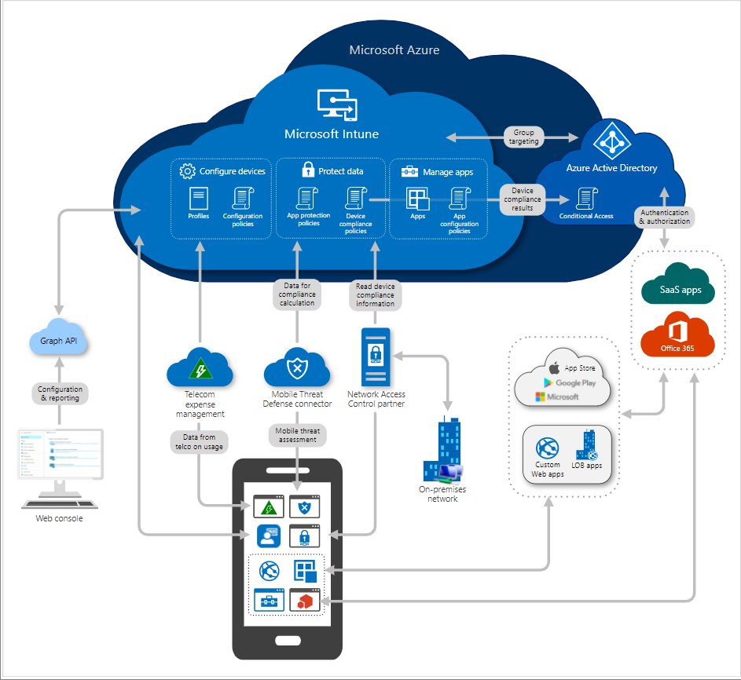

---
# required metadata

title: Getting started with Microsoft Intune
description: Learn about the Microsoft Intune architecture, deployment, enrollment, configuration, policies, service updates, and more.
keywords:
author: Erikre
ms.author: erikre
manager: dougeby
ms.date: 09/27/2022
ms.topic: overview
ms.service: mem
ms.subservice: fundamentals
ms.localizationpriority: high
ms.technology:
ms.assetid: 

# optional metadata

#ROBOTS:
#audience:
ms.reviewer: dougeby
ms.suite: ems
search.appverid: MET150
#ms.tgt_pltfrm:
ms.custom: 
  - get-started
  - intro-get-started
ms.collection:
  - M365-identity-device-management
  - highpri
  - highseo
---

# Get started with Microsoft Intune

As part of your Microsoft 365 license, you also get Microsoft Intune for cloud-based app management, device management, and security. 

This articles provides an overview of the Microsoft Intune architecture, deployment, enrollment, configuration, policies, service updates, and more.

For more information about what Microsoft Intune can do for your organization, go to [What is Microsoft Intune](what-is-intune.md).

## A global cloud service architecture

Your administrative management experience is centralized from the Microsoft Endpoint Manager admin center, which uses [Microsoft Graph](/graph/overview) calls to the Intune service. Every action from app configuration to mobile device management settings to security in the admin center is a Microsoft Graph call. If you’re not familiar with Graph, take some time to understand it, specifically how [Graph integrates with Microsoft Intune](/graph/intune-concept-overview).

### Intune service architecture

Initially, Intune began as a combination of a set of services running on physical machines in a private datacenter, and a set of distributed services running on Azure. By 2018, all Intune services were re-architected to run on Microsoft Azure. Today, Intune’s cloud services are built on Azure Service Fabric. All services are deployed to a Service Fabric cluster consisting of a group of front-end and middle-tier nodes. We refer to these clusters as an Azure scale unit, or ASU.

### Azure scale unit architecture: Global view

Azure scale unit details:

- There are 18 clusters spread over three regions in North America, Europe, and Asia Pacific. Each cluster has about 5,000 services running, all partitioned to scale out.
- The clusters are completely isolated and independent of one other. They are hosted in different subscriptions and datacenters and cannot access each other.
- Data is backed up to an external persisted Azure table/blob storage. This enables fast recovery for replicas in case of catastrophic failure.

Moving from physical machines in a private datacenter to a cloud-based, micro-service architecture enabled Microsoft to scale Intune to billions of devices and apps and to rapidly deliver new innovations. Customers experienced increased reliability, stability, and performance of the service. You can find out more about the development of this architecture in the blog post [How we built (rebuilt!) Intune into a leading globally scaled cloud service](https://www.microsoft.com/microsoft-365/blog/2018/06/12/how-we-built-rebuilt-intune-into-a-leading-globally-scaled-cloud-service/).

## Cloud attach with Configuration Manager

Microsoft Endpoint Configuration Manager, which is a part of Microsoft Endpoint Manager, helps you protect the on-premises devices, apps, and data that the people at your organization use to be productive. If you need to manage only cloud-based endpoints, you can use Microsoft Intune. If you need to manage only on-premises endpoints, such as the computers your organization has attached to your internal network, you can use Microsoft Endpoint Configuration Manager. However, if you need to manage a combination of both cloud and on-premises endpoints, you can use cloud attach to leverage both Intune and Configuration Manager from Microsoft Endpoint Manager.

There are two steps to cloud attach your on-premises devices. The first step of attachment is called [tenant attach](./configmgr/tenant-attach/index.yml), which is registering your Intune tenant with your Configuration Manager deployment. The second step is called [co-management](./configmgr/comanage/index.yml), which is concurrently managing Windows 10 devices with both Configuration Manager and Microsoft Intune. These are incremental steps on the journey to having full cloud attachment. You get immediate value through tenant attach and you get additional value through co-management.

## Plan your Intune deployment

A successful adoption or migration to Microsoft Intune starts with a plan. This plan depends on your company’s current device management solution, business goals, and technical requirements. Additionally, you should include key stakeholders who will support and collaborate with the plan.

The following resources will help plan and deploy Intune:

- [Deployment guide: Setup or move to Microsoft Intune](./intune/fundamentals/deployment-guide-intune-setup.md) 
- [Planning guide to move to Microsoft Intune](./intune/fundamentals/intune-planning-guide.md) 
- [Set up Microsoft Intune](./intune/fundamentals/setup-steps.md)

> [!TIP]
> Get started quickly with [Microsoft Endpoint Manager fundamentals](/training/paths/endpoint-manager-fundamentals/), [Plan your migration to Microsoft Endpoint Manager](/training/modules/paths-to-modern-endpoint-management/), and [Determine your endpoint management implementation](/training/modules/determine-endpoint-implementation/).

## Device enrollment

By using Intune, you can manage devices and apps, and how they access company data. To use Intune mobile device management (MDM), the devices must first be enrolled in the Intune service. When a device is enrolled, it's issued an MDM certificate. This certificate is used to communicate with the Intune service.

Devices can be enrolled on the following platforms. For the specific versions, see [Supported operating systems](./intune/fundamentals/supported-devices-browsers.md):

- Android
- iOS/iPadOS
- macOS
- Windows

Different platforms may have additional requirements. For example, iOS/iPadOS and macOS devices require an [MDM push certificate from Apple](./intune/enrollment/apple-mdm-push-certificate-get.md).

The following resources will help you learn more about device enrollment for each platform:

- [What is device enrollment in Intune?](./intune/enrollment/device-enrollment.md)
- [Enrolled device management capabilities of Microsoft Intune](./intune/enrollment/device-management-capabilities.md)
- [Enrollment options for devices managed by Intune](./intune/enrollment/enrollment-options.md)
- [Intune enrollment methods for Windows devices](./intune/enrollment/windows-enrollment-methods.md)
- [Enroll iOS/iPadOS devices in Intune](./intune/enrollment/ios-enroll.md)
- [Enroll Android devices](./intune/enrollment/android-enroll.md)
- [Set up enrollment for macOS devices in Intune](./intune/enrollment/macos-enroll.md)

## Device configuration

Microsoft Intune includes settings and features you can enable or disable on different devices within your organization. These settings and features are added to configuration profiles. You can create profiles for different devices and different platforms, including iOS/iPadOS, macOS, Android device administrator, Android Enterprise, and Windows. Then, use Intune to apply or "assign" the profile to the devices.

The following resources will help you understand how to configure device settings:

- [Configure device settings](./intune/configuration/index.yml)
- [Windows security baselines](/windows/security/threat-protection/windows-security-baselines)
- [iOS/iPadOS Enterprise security configuration framework](./intune/enrollment/ios-ipados-configuration-framework.md)
- [Android Enterprise security configuration framework](./intune/enrollment/android-configuration-framework.md)
- [Device features and settings in Microsoft Intune](./intune/configuration/device-profiles.md)
- [Use the settings catalog to configure settings on Windows and macOS devices](./intune/configuration/settings-catalog.md)
- [Assign device profiles in Microsoft Intune](./intune/configuration/device-profile-assign.md)
- [App configuration policies for Microsoft Intune](./intune/apps/app-configuration-policies-overview.md)
- [Manage endpoint security in Microsoft Intune](./intune/protect/endpoint-security.md)

## Compliance policies

MDM solutions like Intune can help set requirements for users and devices to protect organizational data. In Intune, you manage these requirements with compliance policies. There are two parts to compliance policies in Intune:

- **Compliance policy settings**  – These tenant-wide settings are much like a built-in compliance policy that every device receives. Compliance policy settings set a baseline for how compliance policy works in your Intune environment, including whether devices that haven’t received any device compliance policies are compliant or noncompliant.

- **Device compliance policy** – These are platform-specific rules that administrators can configure and deploy to groups of users or devices. These rules define requirements for devices, like minimum operating systems or the use of disk encryption. Devices must meet these rules to be considered compliant.

The following articles will help you understand how to create and monitor compliance policies in Intune, as well as how to integrate with MTD and NAC solutions, and Conditional Access:

- [Device compliance policies in Microsoft Intune](./intune/protect/device-compliance-get-started.md)
- [Create a compliance policy in Microsoft Intune](./intune/protect/create-compliance-policy.md)
- [Enable Mobile Threat Defense connector in Microsoft Intune](./intune/protect/mtd-connector-enable.md)
- [Enforce compliance for Microsoft Defender for Endpoint with Conditional Access in Intune](./intune/protect/advanced-threat-protection.md)
- [Network access control integration with Microsoft Intune](./intune/protect/network-access-control-integrate.md)
- [Integrate with Conditional Access](./intune/protect/device-compliance-get-started.md#integrate-with-conditional-access)
- [App-based Conditional Access with Intune](./intune/protect/app-based-conditional-access-intune.md)
- [Conditional Access scenarios](./intune/protect/conditional-access-intune-common-ways-use.md)
- [Monitor device compliance policies in Microsoft Intune](./intune/protect/compliance-policy-monitor.md)

## App protection policies

Intune app protection policies (APP) allow you to protect organizational data within an application. Together with app configuration capabilities, you can implement mobile application management (MAM) in Intune to help protect sensitive data that is accessed from managed applications. See the official list of [Microsoft Intune protected apps](./intune/apps/apps-supported-intune-apps.md) available for public use.

To get an overview of app protection policies and how they work, check out the following articles:

- [App protection policies overview](./intune/apps/app-protection-policy.md)
- [Data protection framework using app protection policies](./intune/apps/app-protection-framework.md)
- [Understand app protection policy delivery timing](./intune/apps/app-protection-policy-delivery.md)
- [How to create and assign app protection policies](./intune/apps/app-protection-policies.md)
- [How to manage data transfer between iOS apps in Microsoft Intune](./intune/apps/data-transfer-between-apps-manage-ios.md)
- [How to monitor app protection policies](./intune/apps/app-protection-policies-monitor.md)
- [Review client app protection logs](./intune/apps/app-protection-policy-settings-log.md)
- [Frequently asked questions about MAM and app protection](./intune/apps/mam-faq.yml)

## Deliver apps to devices

Intune supports a wide range of apps, including store apps for iOS, macOS, Android, and Windows, and line-of-business (LOB) apps. You can manage app deployment from the [Microsoft Endpoint Manager admin center](https://endpoint.microsoft.com/). Also, you can use Intune to orchestrate store app deployment with managed Google Play, the Apple App Store, and the Microsoft Store.

Check out these resources to find out how to add and manage apps with Intune:

- [What is app management in Microsoft Intune](./intune/apps/app-management.md)
- [Add apps to Microsoft Intune](./intune/apps/apps-add.md)
- [Add and assign managed Google Play apps to Android Enterprise devices](./intune/apps/apps-add-android-for-work.md)
- [Add iOS store apps to Microsoft Intune](./intune/apps/store-apps-ios.md)
- [How to manage iOS and macOS apps purchased through Apple Business Manager](./intune/apps/vpp-apps-ios.md)
- [Windows 10 app deployment by using Microsoft Intune](./intune/apps/apps-windows-10-app-deploy.md)
- [How to protect your company app data with Microsoft Intune](/graph/api/resources/intune-app-conceptual?view=graph-rest-beta&preserve-view=true)
- [Manage Android Enterprise system apps in Microsoft Intune](./intune/apps/apps-ae-system.md)

## Next steps

