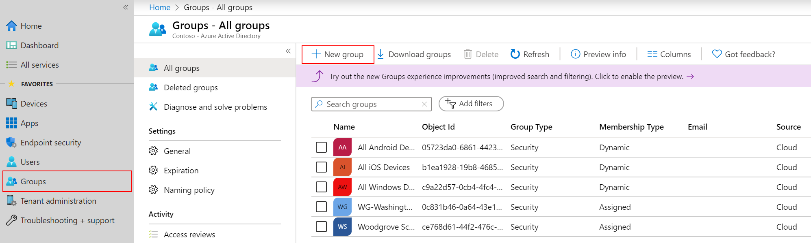
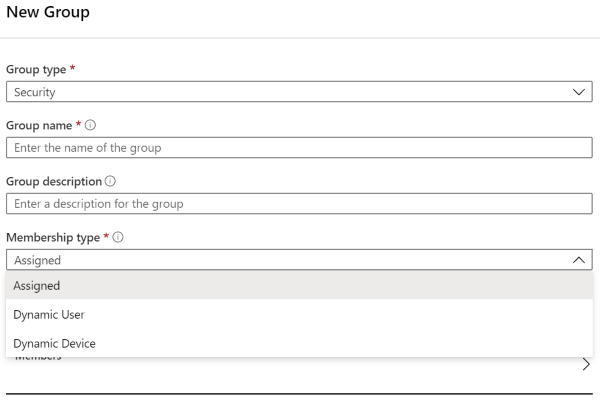

---
# required metadata

title: Add groups to organize users and devices
titleSuffix: Microsoft Intune
description: Add groups to organize users and devices by geography, department, or hardware specifics.
keywords:
author: Smritib17
ms.author: smbhardwaj
manager: dougeby
ms.date: 11/29/2021
ms.topic: how-to
ms.service: microsoft-intune
ms.subservice: fundamentals
ms.localizationpriority: high

# optional metadata

#ROBOTS:
#audience:

ms.reviewer: scottduf
ms.suite: ems
search.appverid: MET150
#ms.tgt_pltfrm:
ms.custom: intune-azure
ms.collection: 
  - M365-identity-device-management
  - highpri
---

# Add groups to organize users and devices

Intune uses Azure Active Directory (Azure AD) groups to manage devices and users. As an Intune admin, you can set up groups to suit your organizational needs. Create groups to organize users or devices by geographic location, department, or hardware characteristics. Use groups to manage tasks at scale. For example, you can set policies for many users or deploy apps to a set of devices.

> [!NOTE]
> Default groups created from [Microsoft 365 admin center](https://go.microsoft.com/fwlink/p/?linkid=2024339) are not security enabled. You must explicitly create security enabled Microsoft 365 groups in [Microsoft 365 admin center](https://go.microsoft.com/fwlink/p/?linkid=2024339), the [Azure AD admin center](https://portal.azure.com/), or [Microsoft Endpoint Manager admin center](https://go.microsoft.com/fwlink/?linkid=2109431).

You can add the following types of groups:

- **Assigned groups** - Manually add users or devices into a static group. 
- **Dynamic groups** (Requires Azure AD Premium) - Automatically add users or devices to user groups or device groups based on an expression you create.

  For example, when a user is added with the manager title, the user is automatically added to an **All managers** users group. Or, when a device has the iOS/iPadOS device OS type, the device is automatically added to an **All iOS/iPadOS devices** devices group.

## Add a new group

Use the following steps to create a new group.

1. Sign in to the [Microsoft Endpoint Manager admin center](https://go.microsoft.com/fwlink/?linkid=2109431).
2. Select **Groups** > **New group**:

   

3. In **Group type**, choose one of the following options:

    - **Security**: Security groups define who can access resources, and are recommended for your groups in Intune. For example, you can create groups for users, such as **All Charlotte employees** or **Remote workers**. Or, create groups for devices, such as **All iOS/iPadOS devices** or **All Windows 10 student devices**.

        > [!TIP]
        > The users and groups created can also be seen in the [Microsoft 365 admin center](https://admin.microsoft.com), Azure Active Directory admin center, and [Microsoft Intune in the Azure portal](https://go.microsoft.com/fwlink/?linkid=2090973). In your organization tenant, you can create and manage groups in all these areas.
        >
        > If your primary role is device management, we recommend you use the [Microsoft Endpoint Manager admin center](https://go.microsoft.com/fwlink/?linkid=2109431).

    - **Microsoft 365**: Provides collaboration opportunities by giving members access to a shared mailbox, calendar, files, SharePoint site, and more. This option also lets you give people outside of your organization access to the group. For more information, see [Learn about Microsoft 365 Groups](https://support.office.com/article/learn-about-office-365-groups-b565caa1-5c40-40ef-9915-60fdb2d97fa2).

Please note: Only security-enabled Microsoft 365 Groups are supported

4. Enter a **Group name** and **Group description** for the new group. Be specific and include information so others know what the group is for.

    For example, enter **All Windows 10 student devices** for group name, and **All Windows 10 devices used by students in Contoso high school grades 9-12** for group description.

5. Enter the **Membership type**. Your options:

    - **Assigned**: Administrators manually assign users or devices to this group, and manually remove users or devices.
    - **Dynamic User**: Administrators create membership rules to automatically add and remove members.
    - **Dynamic Device**: Administrators create dynamic group rules to automatically add and remove devices.

        

    For more information on these membership types, and creating dynamic expressions, see:

    - [Create a basic group and add members using Azure AD](/azure/active-directory/fundamentals/active-directory-groups-create-azure-portal)
    - [Dynamic membership rules for groups in Azure AD](/azure/active-directory/users-groups-roles/groups-dynamic-membership)

    > [!NOTE]
    > In this admin center, when you create users or groups, you might not see the **Azure Active Directory** branding. But, that's what you're using.

6. Choose **Create** to add the new group. Your group is shown in the list.

> [!TIP]
> Consider some of the other dynamic user and device groups you can create, such as:
>
> - All Students in Contoso high school
> - All iOS 11 and older devices
> - Marketing
> - Human Resources
> - All Charlotte employees
> - All WA employees

## Intune All Users and All Devices groups
When assigning policies and apps in the admin center you can choose to assign to **All Users** or **All devices** groups, which are pre-created. The **All devices** group targets all devices that are enrolled into management and the **All users** group is a simple way to target all users that are assigned an Intune license. These groups are considered "virtual" because you do not create them or view them in Azure Active Directory. They are convenient to use (because they are pre-created in your tenant) and they are a faster targeting unit than Azure AD groups.

When assigning policies and applications to large groups such as **All users** and **All devices** you may choose to use **Filters**, so that you can dynamically control which devices the policy or app deployment should apply to.

For more guidance on using Filters, see [Use filters when assigning your apps, policies, and profiles in Microsoft Endpoint Manager](../fundamentals/filters.md)

## See also

- [Role-based access control (RBAC) with Microsoft Intune](role-based-access-control.md)
- [Manage access to resources with Azure AD groups](/azure/active-directory/active-directory-manage-groups)
- [Assign apps to groups with Microsoft Intune](../apps/apps-deploy.md)
