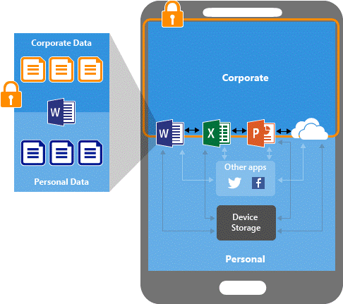
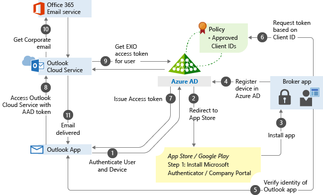

# Guided scenario - Secure Microsoft Office mobile apps

By following this guided scenario in the Device Management portal, you can enable basic Intune app protection on iOS/iPadOS and Android devices.

The app protection that you enable will enforce the following actions:

- Encrypt work files.
- Require a PIN to access work files.
- Require the PIN to be reset after five failed attempts.
- Block work files from being backed up in iTunes, iCloud, or Android backup services.  
- Require work files to only be saved to OneDrive or SharePoint.
- Prevent protected apps from loading work files on jailbroken or rooted devices.
- Block access to work files if the device is offline for 720 minutes.
- Remove work files if device is offline for 90 days.

## Background

Office mobile apps, as well as Microsoft Edge for Mobile, support dual identity. Dual identity allows the apps to manage work files separately from personal files. 

[Intune app protection policies](../apps/app-protection-policy.md) help protect your work files on devices that are enrolled into Intune. You can also use app protection policies on employee owned devices that are not enrolled for management in Intune. In this case, even though your company doesn't manage the device, you still need to make sure that work files and resources are protected.

You can use App protection policies to prevent users from saving work files in unprotected locations. You can also restrict data movement to other apps that aren't protected by App protection policies. App protection policy settings include:

- Data relocation policies like **Save copies of org data**, and **Restrict cut, copy, and paste**.
- Access policy settings to require simple PIN for access, and block managed apps from running on jailbroken or rooted devices.

App-based conditional access and client app management add a security layer by making sure only client apps that support Intune app protection policies can access Exchange online and other Microsoft 365 services.

You can block the built-in mail apps on iOS/iPadOS and Android when you allow only the Microsoft Outlook app to access Exchange Online. Additionally, you can block apps that don't have Intune app protection policies applied from accessing SharePoint Online.

In this example, the admin has applied app protection policies to the Outlook app followed by a conditional access rule that adds the Outlook app to an approved list of apps that can be used when accessing corporate e-mail.

## Prerequisites

You'll need the follow Intune admin permissions:

- Managed apps read, create, delete, and assign permissions
- Policy sets read, create, and assign permissions
- Organization read permission

## Step 1 - Introduction

By following the **Intune App Protection** guided scenario, you will prevent data from being shared or leaked outside of your organization. 

Assigned iOS/iPadOS and Android users must enter a PIN each time they open an Office app. After 5 failed PIN attempts, users must reset their PIN. If you already require a device PIN, users won't be impacted.​

### What you will need to continue

We'll ask you about the apps your users need, and what's needed to access them. Make sure you have the following information handy:

- List of Office apps approved for corporate use.
- Any PIN requirements for launching approved apps on non-managed devices.

## Step 2 - Basics

In this step, you must enter a **Prefix** and **Description** for your new App protection policy. As you add the **Prefix**, the details related to the resources that the guided scenario creates will be updated. These details will make it easy to find your policies later if you need to change the assignments and configuration.

> [!TIP]
> Consider making a note of the resources that will be created, so that you can refer to them later.

## Step 3 - Apps

To help you get started, this guided scenario pre-selects the following mobile apps to protect on iOS/iPadOS and Android devices:

- Microsoft Excel
- Microsoft Word
- Microsoft Teams
- Microsoft Edge
- Microsoft PowerPoint
- Microsoft Outlook
- Microsoft OneDrive

This guided scenario will also configure these apps to open weblinks in Microsoft Edge to guarantee work sites are opened in a protected browser.

Modify the list of policy-managed apps that you want to protect. Add or remove apps from this list.

When you've selected the apps, click **Next**.

## Step 4 - Configuration

In this step, you must configure the requirements for accessing and sharing the corporate files and emails in these apps. By default, users can save data to your organization's OneDrive and SharePoint accounts.

:::image type="content" border="true" source="./media/guided-scenarios-office-mobile/guided-scenarios-office-mobile-03.png" alt-text="Screenshot of the App protection settings.":::

The following settings are applied when using the **Enhanced data protection** setting shown above.

| Setting | Description | Value |
|---------------------------------------------------------------|-------------------------------------------------------------------------------------------------------------------------------------------------------------------------------------------------------------------------------------------------------------------------------------|---------------|
|Timeout (minutes of inactivity) |Specify a time in minutes after which either a passcode or numeric (as configured) PIN will override the use of a biometric. This timeout value should be greater than the value specified under 'Recheck the access requirements after (minutes of inactivity)'. Default value: 30 | 720

## Step 5 - Assignments

In this step, you can choose the user groups that you want to include to ensure that they have access to your corporate data. App protection is assigned to users, and not devices, so your corporate data will be secure regardless of the device used and its enrollment status.

Users without app protection policies and conditional access settings assigned will be able to save data from their corporate profile to personal apps and non-managed local storage on their mobile devices. They could also connect to corporate data services, such as Microsoft Exchange, with personal apps.

## Step 6 - Review + create

The final step allows you to review a summary of the settings you configured. Once you have reviewed your choices click **Create** to complete the guided scenario. Once the guided scenario is complete, a table of resources is displayed. You can edit these resources later, however once you leave the summary view, the table will not be saved.

> [!IMPORTANT]
> Once the guided scenario is complete it will display a summary. You can modify the resources listed in the summary later, however the table displaying these resources will not be saved.

## Next steps

- Enhance the security of work files by assigning users an App-based conditional access policy to protect cloud services from sending work files to unprotected apps. For more information, see [Set up app-based Conditional Access policies with Intune](../protect/app-based-conditional-access-intune-create.md).
