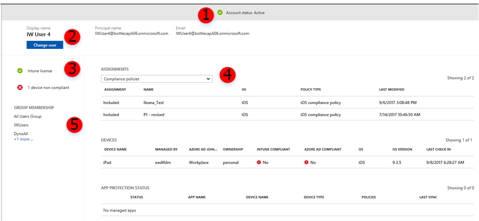

# Use the troubleshooting portal to help users at your company

[!INCLUDE [azure_portal](../includes/azure_portal.md)]

The troubleshooting portal lets help desk operators and Intune administrators view user information to address user help requests. Organizations that include a help desk can assign the **Help desk operator** to a group of users. The help desk operator role can use the **Troubleshoot** pane.

The **Troubleshoot** pane also shows user enrollment issues. Details about the issue and suggested remediation steps can help administrators and help desk operators troubleshoot problems. Certain enrollment issues aren't captured and some errors might not have remediation suggestions.

For steps on adding a help desk operator role, see [Role-based administration control (RBAC) with Intune](role-based-access-control.md)

When a user contacts support with a technical issue with Intune, the help desk operator enters the user's name. Intune shows useful data that can help resolve many tier-1 issues, including:

- User status
- Assignments
- Compliance issues
- Device not responding
- Device not getting VPN or Wi-Fi settings
- App installation failure

## To review troubleshooting details

In the troubleshooting pane, choose **Select user** to view user information. User information can help you understand the current state of users and their devices.  

1. Sign in to [Intune](https://go.microsoft.com/fwlink/?linkid=2090973).
3. On the **Intune** pane, choose **Troubleshoot**.
4. Click **Select** to select a user to troubleshoot.
5. Select a user by typing the name or email address. Click **Select**. The troubleshooting information for the user shows in the Troubleshooting pane. The following table explains the information.

> [!Note]  
> You can also access the **troubleshooting** pane by pointing your browser to: [https://aka.ms/intunetroubleshooting](https://aka.ms/intunetroubleshooting).

## Areas of troubleshooting dashboard

You can use the **Troubleshoot** pane to review user information.

| Area | Name | Description |
| ---  | ---  | ---         |
| 1.   | Account status  | Shows the status of the current Intune tenant as **Active** or **Inactive**.       |
| 2.   | User selection  | The name of the currently selected user. Click **Change user** to choose a new user.       |
| 3.   | User status  | Displays the status of the user's Intune license, number of devices, each device compliance, number of apps, and app compliance.       |
| 4.   | User information  | Use the list to select the details to review in the pane.  You can select: <ul><li>Client apps<li>Compliance policies<li> Configuration policies<li>App protection policies <li>Enrollment restrictions</ul>      |
| 5.   | Group membership  | Shows the current groups the selected user is a member of.       |

<!-- this section needs to be updated

## Client apps reference

The apps that are running devices
- managed by Intune and Azure Active Directory (AD) 
- owned by users managed by Intune and Azure Active Directory (AD).

### Properties

The properties of client apps.

| Property      | Description                                                                                                                                                                                                                                                                                                                                                                                                                                                                                                                                                                       |
|---------------|-----------------------------------------------------------------------------------------------------------------------------------------------------------------------------------------------------------------------------------------------------------------------------------------------------------------------------------------------------------------------------------------------------------------------------------------------------------------------------------------------------------------------------------------------------------------------------------|
| Name          | The name of the application.                                                                                                                                                                                                                                                                                                                                                                                                                                                                                                                                                      |
| OS            | The operating system installed on the device.                                                                                                                                                                                                                                                                                                                                                                                                                                                                                                                                     |
| Type          | You can choose an assignment type for each app.    **Available** - Users install the app from the Company Portal app or website.    **Not Applicable** - The app is not installed or shown in the Company Portal.   **Uninstall** - The app is uninstalled from devices in the selected groups.    **Available with or without enrollment** - Assign this app to groups of users whose devices are not enrolled with Intune. |
| Last Modified | The name of the type of device.                                                                                                                                                                                                                                                                                                                                                                                                                                                                                                                                                   |

### Devices

Devices managed by Intune or by users managed by Intune or Azure AD.

| Property           | Description                                                                                                                         |
|--------------------|-------------------------------------------------------------------------------------------------------------------------------------|
| Device name        | The name of the type of device.                                                                                                     |
| Managed by         | The timestamp the policy was modified.                                                                                              |
| Azure AD join type | The status of each of the users' app protection apps. The possible statuses for the apps are **Checked in** and **Not checked in**. |
| Ownership          | The type of device ownership (**Company**, **Personal**, or **Unknown**).                                               |
| Intune compliant   | The name of the type of device.                                                                                                     |
| Azure AD compliant | The status of each of the users' app protection apps. The possible statuses for the apps are **Checked in** and **Not checked in**. |
| App install | Denotes whether an app install failure or success has occurred on the individual device. |
| OS                 | The operating system installed on the device.                                                                                       |
| OS version         | The Operating System version number of the device.                                                                                  |
| Last check-in      | The name of the type of device.                                                                                                     |

### App protection status

An app protection policy is available to mobile apps that integrate with Enterprise Mobility Solution (EMS) technologies. These policies give a baseline of protection for your corporate data when it is downloaded to mobile apps, including the Office mobile apps. 

| Property    | Description                                                                           |
|-------------|---------------------------------------------------------------------------------------|
| Status      | The type of device ownership (**Company**, **Personal**, or **Unknown**). |
| App name    | The name of the application                                                           |
| Device name | The name of the type of device.                                                       |
| Device type | The name of the type of device.                                                       |
| Policies    | The type of device ownership (**Company**, **Personal**, or **Unknown**). |
| Last sync   | The timestamp of the last time the device synchronized with Intune.                   |

## App protection policies reference

An app protection policy is available to mobile apps that integrate with EMS technologies.These policies give a baseline of protection for your corporate data when it is downloaded to mobile apps, including the Office mobile apps. 

### Properties

The table summarizes app protection policies status for devices managed by Intune.

| Property    | Description                                                                                                                                |
|-------------|-------------------------------------------------------------------------------------------------------------------------------------|
| Name        | The name of the application.                                                                                                        |
| Deployed    | The status of each of the users' app protection apps. The possible statuses for the apps are **Checked in** and **Not checked in**. |
| Platform    | The type of device ownership (**Company**, **Personal**, or **Unknown**).                                               |
| Enrollment  | The name of the type of device.                                                                                                     |
| Last Update | The timestamp the policy was modified.                                                                                              |

### Devices

Devices managed by Intune or by users managed by Intune or Azure AD.

| Property           | Text                                                                                                                                |
|--------------------|-------------------------------------------------------------------------------------------------------------------------------------|
| Device Name        | The name of the type of device.                                                                                                     |
| Managed By         | The timestamp the policy was modified.                                                                                              |
| Azure AD join type | The status of each of the users' app protection apps. The possible statuses for the apps are **Checked in** and **Not checked in**. |
| Ownership          | The type of device ownership (**Company**, **Personal**, or **Unknown**).                                               |
| Intune compliant   | The name of the type of device.                                                                                                     |
| Azure AD compliant | The status of each of the users' app protection apps. The possible statuses for the apps are **Checked in** and **Not checked in**. |
| Azure AD compliant | The status of each of the users' app protection apps. The possible statuses for the apps are **Checked in** and **Not checked in**. |
| OS                 | The operating system installed on the device.                                                                                       |
| OS version         | The Operating System version number of the device.                                                                                  |
| Last Check in      | The name of the type of device.                                                                                                     |

## Compliance policies reference

Makes sure that the devices used to access company apps and data, comply with certain rules like using a PIN to access the device, and encryption of data stored on the device.

### Properties

The properties of the compliance policies.

| Property      | Description                                                                                                                         |
|---------------|-------------------------------------------------------------------------------------------------------------------------------------|
| Assignment    | The status of each of the users' app protection apps. The possible statuses for the apps are **Checked in** and **Not checked in**. |
| Name          | The name of the application.                                                                                                        |
| OS            | The operating system installed on the device.                                                                                       |
| Policy Type   | The type of device ownership (**Company**, **Personal**, and **Unknown**).                                               |
| Last Modified | The name of the type of device.                                                                                                     |

### Devices

Devices managed by Intune or by users managed by Intune or Azure AD.

| Property           | Description                                                                                                                         |
|--------------------|-------------------------------------------------------------------------------------------------------------------------------------|
| Device name        | The name of the type of device.                                                                                                     |
| Managed by         | The timestamp the policy was modified.                                                                                              |
| Azure AD join type | The status of each of the users' app protection apps. The possible statuses for the apps are **Checked in** and **Not checked in**. |
| Ownership          | The type of device ownership (**Company**, **Personal**, and **Unknown**).                                               |
| Intune compliant   | The name of the type of device.                                                                                                     |
| Azure AD compliant | The status of each of the users' app protection apps. The possible statuses for the apps are **Checked in** and **Not checked in**. |
| OS                 | The operating system installed on the device.                                                                                       |
| OS version         | The Operating System version number of the device.                                                                                  |
| Last check-in      | The name of the type of device.                                                                                                     |

### App protection policies

An app protection policy is available to mobile apps that integrate with EMS technologies. These policies give a baseline of protection for your corporate data when it is downloaded to mobile apps, including the Office mobile apps. 

| Property    | Description                                                                           |
|-------------|---------------------------------------------------------------------------------------|
| Status      | The type of device ownership (**Company**, **Personal**, or **Unknown**). |
| App name    | The name of the application                                                           |
| Device name | The name of the type of device.                                                       |
| Device type | The name of the type of device.                                                       |
| Policies    | The type of device ownership (**Company**, **Personal**, or **Unknown**). |
| Last sync   | The timestamp of the last time the device synchronized with Intune.                   |

## Configuration policies reference

An app configuration policy is available to mobile apps with vendor-specific configuration. 

### Properties

The properties of the configuration policies.

| Property      | Description                                                                                                                         |
|---------------|-------------------------------------------------------------------------------------------------------------------------------------|
| Assignment    | The status of each of the users' app protection apps. The possible statuses for the apps are **Checked in** and **Not checked in**. |
| Name          | The name of the application.                                                                                                        |
| OS            | The operating system installed on the device.                                                                                       |
| Policy Type   | The type of device ownership (**Company**, **Personal**, or **Unknown**).                                               |
| Last Modified | The name of the type of device.                                                                                                     |

### Devices

Devices managed by Intune or by users managed by Intune or Azure AD.

| Property           | Description                                                                                                                         |
|--------------------|-------------------------------------------------------------------------------------------------------------------------------------|
| Device name        | The name of the type of device.                                                                                                     |
| Managed by         | The timestamp the policy was modified.                                                                                              |
| Azure AD join type | The status of each of the users' app protection apps. The possible statuses for the apps are **Checked in** and **Not checked in**. |
| Ownership          | The type of device ownership (**Company**, **Personal**, or **Unknown**).                                               |
| Intune compliant   | The name of the type of device.                                                                                                     |
| Azure AD compliant | The status of each of the users' app protection apps. The possible statuses for the apps are **Checked in** and **Not checked in**. |
| OS                 | The operating system installed on the device.                                                                                       |
| OS version         | The Operating System version number of the device.                                                                                  |
| Last check-in      | The name of the type of device.                                                                                                     |

### App protection policies

An app protection policy is available to mobile apps that integrate with EMS technologies. These policies give a baseline of protection for your corporate data when it is downloaded to mobile apps, including the Office mobile apps. 

| Property    | Description                                                                           |
|-------------|---------------------------------------------------------------------------------------|
| Status      | The type of device ownership (**Company**, **Personal**, or **Unknown**). |
| App name    | The name of the application                                                           |
| Device name | The name of the type of device.                                                       |
| Device type | The name of the type of device.                                                       |
| Policies    | The type of device ownership (**Company**, **Personal**, or **Unknown**). |
| Last sync   | The timestamp of the last time the device synchronized with Intune.                   |

-->

## Enrollment failure reference

The Enrollment Failures table lists enrollment attempts that failed. A device listed in the below table may have subsequently enrolled successfully during another attempt. Some failed attempts may not be listed. Mitigation information isn't available for all failures.

| Table column | Description |
|-------------|----------|
| Enrollment start | The start time when the user first began enrolling. |
| OS | The device's operating system. |
| OS version | The device's operating system version. |
| Failure | The reason for the failure. |

### Failure details

When you choose a failure row, more details are provided.

| Section | Description |
|-------------|----------|
| Failure details | A more detailed explanation of the failure. |
| Potential remediations | Suggested steps to resolve the error. Some failures may not have remediations. |
| Resources (Optional) | Links for further reading or areas in the portal to take action. |

### Enrollment errors

| Error | Details |
|-------------|----------|
| iOS/iPadOS Timeout or Failure | A timeout between the device and Intune due to the user taking too long to complete enrollment. |
| User not found or licensed | The user is missing a license or has been removed from the service. |
| Device already enrolled | Someone attempted to enroll a device by using the Company Portal on a device that is still enrolled by another user. |
| Not onboarded into Intune | An enrollment was attempted when the Intune mobile device management (MDM) authority wasn't configured. |
| Enrollment authorization failed | An enrollment was attempted using an old version of company portal. |
| Device not supported | The device doesn't meet the minimum requirements for Intune enrollment. |
| Enrollment restrictions not met | This enrollment was blocked due to an admin configured enrollment restriction. |
| Device version too low | The admin has configured an enrollment restriction requiring a higher device version. |
| Device version too high | The admin has configured an enrollment restriction requiring a lower device version. |
| Device cannot be enrolled as personal | The admin has configured an enrollment restriction to block personal enrollments and the failed device wasn't predefined as corporate. |
| Device platform blocked | The admin has configured an enrollment restriction that blocks this device's platform. |
| Bulk token expired | The bulk token in the provisioning package has expired. |
| Autopilot device or details not found | The Autopilot device wasn't found when attempting to enroll. |
| Autopilot profile not  found or not assigned | The device doesn't have an active Autopilot profile. |
| Autopilot enrollment method unexpected | The device attempted to enroll by using a non-allowed method. |
| Autopilot device removed | The device attempting to enroll has been removed from Autopilot for this account. |
| Device cap reached | This enrollment was blocked due to an admin configured device limit restriction. |
| Apple onboarding | All iOS/iPadOS devices were blocked from enrolling at this time due to a missing or expired Apple MDM push certificate within Intune. |
| Device not preregistered | The device wasn't pre-registered as corporate and all personal enrollments were blocked by an admin. |
| Feature not supported | The user was likely attempting to enroll via a method not compatible with your Intune configuration. |

## Collect available data from mobile device

Use the following resources to help collect device data when troubleshooting user's device issues:
- [Send iOS/iPadOS enrollment errors to your IT administrator](../user-help/send-errors-to-your-it-admin-ios.md)
- [Help your company support fix device issues with verbose logging](../user-help/use-verbose-logging-to-help-your-it-administrator-fix-device-issues-android.md)
- [Send Android logs to your company support using a USB cable](../user-help/send-logs-to-your-it-admin-using-cable-android.md)
- [Send Android diagnostic data logs to your IT administrator using email](../user-help/send-logs-to-your-it-admin-by-email-android.md)
- [Send Android enrollment errors to your IT administrator](../user-help/send-logs-to-your-it-admin-by-email-android.md)

## Next steps

You can learn more about Role-based administration control (RBAC) to define roles in your organizational device, mobile application management, data protection tasks. For more information, see [Role-based administration control (RBAC) with Intune](role-based-access-control.md).

Learn about any known issues in Microsoft Intune. For more information, see [Known issues in Microsoft Intune](https://techcommunity.microsoft.com/t5/Intune-Customer-Success/bg-p/IntuneCustomerSuccess).

Learn how to create a support ticket a get help when you need it. [Get support](get-support.md).
