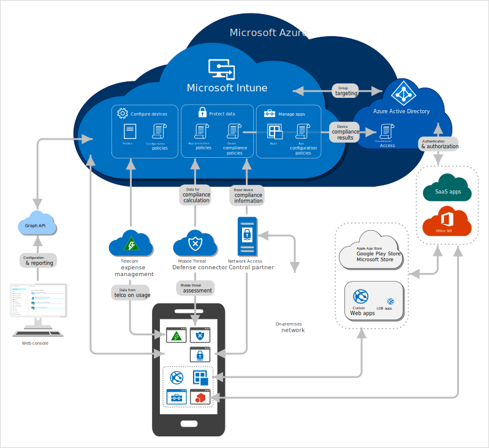

---
# required metadata

title: High-level architecture for Microsoft Intune
description: This reference architecture shows options for integrating Microsoft Intune in your Azure environment with Azure Active Directory.
keywords:
ms.author: dougeby
author: dougeby
manager: dougeby
ms.date: 03/11/2019
ms.topic: conceptual
ms.service: microsoft-intune
ms.subservice: fundamentals
ms.localizationpriority: high
ms.technology:
ms.assetid: 3b992f64-fe34-4270-9730-bc6c65c308ed

# optional metadata

#ROBOTS:
#audience:

ms.reviewer: 
#ms.suite: ems
search.appverid: MET150
#ms.tgt_pltfrm:
#ms.custom:
ms.collection: M365-identity-device-management
---
# High-level architecture for Microsoft Intune
This reference architecture shows options for integrating Microsoft Intune in your Azure environment with Azure Active Directory.  

[Image with dark contrast](./media/intunearchitecture.svg)
