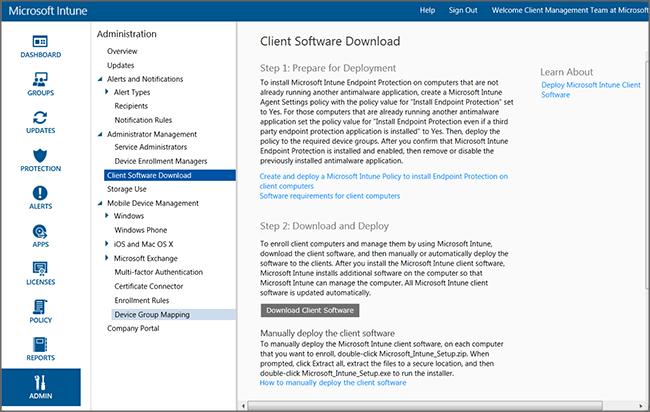
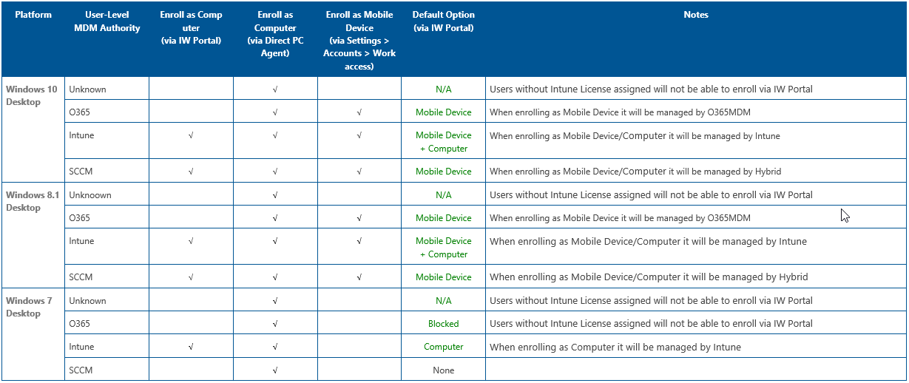
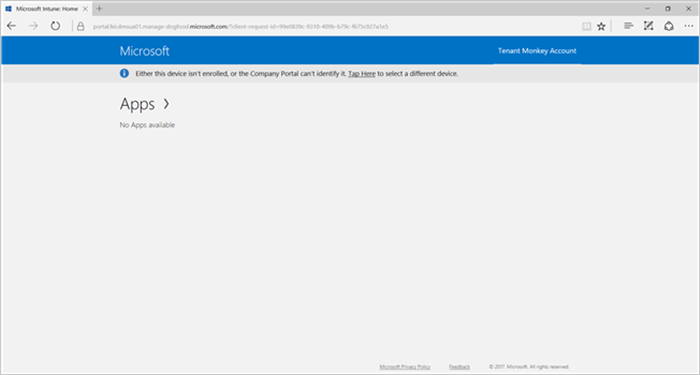
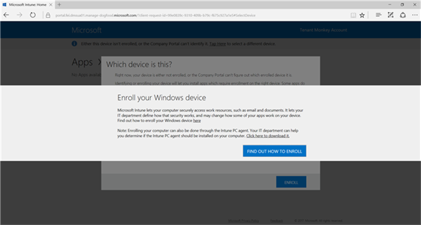
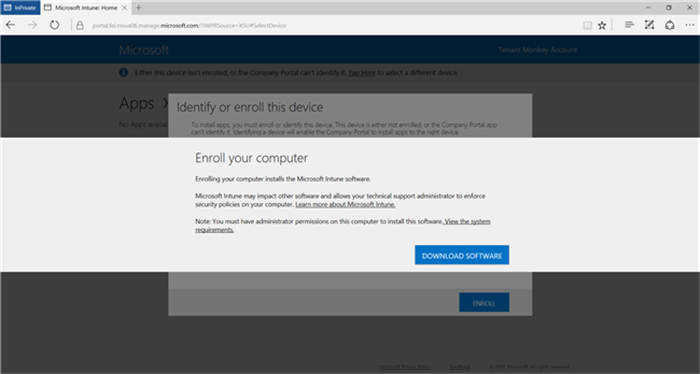
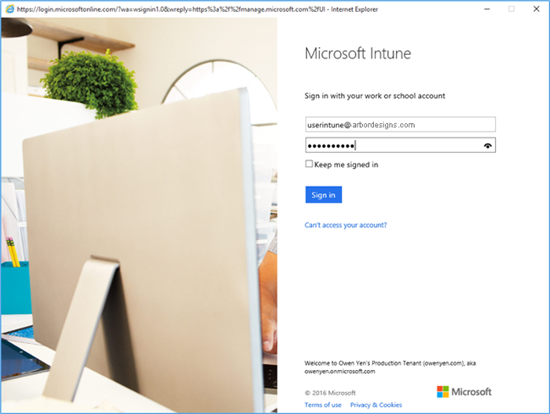
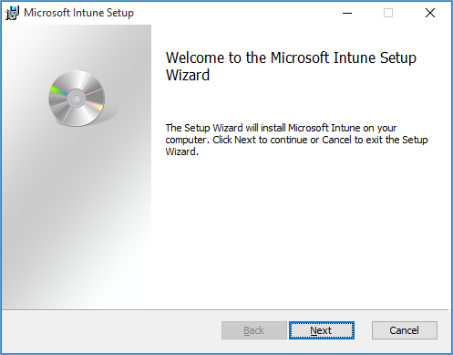
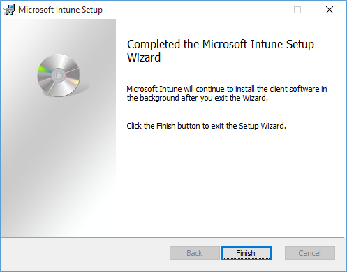
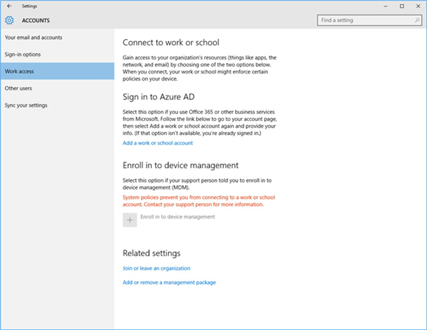

---

# required metadata

title: Install the PC client software
description: Use this guide to help you get your Windows PCs managed by the Microsoft Intune client software.
keywords:
author: ErikjeMS
ms.author: erikje
ms.date: 07/13/2017
ms.topic: archived
ms.service: microsoft-intune
ms.subservice: fundamentals
ms.localizationpriority: medium
ms.assetid: 99dcf916-d80f-42c5-863b-a4595e1ec67a

# optional metadata

#audience:
#ms.devlang:
ms.reviewer: owenyen
ms.suite: ems
search.appverid: MET150
#ms.tgt_pltfrm:
ms.custom: intune
ms.collection: M365-identity-device-management
---

# Install the Intune software client on Windows PCs

[!INCLUDE [classic-portal](../includes/classic-portal.md)]

> [!NOTE]
> You can use Microsoft Intune to manage Windows PCs either [as mobile devices with mobile device management (MDM)](../enrollment/windows-enroll.md) or as computers with the Intune software client as described below. However, Microsoft recommends that customers [use the MDM management solution](../enrollment/windows-enroll.md) whenever possible. For more information see [Compare managing Windows PCs as computers or mobile devices](pc-management-comparison.md) 


Windows PCs can be enrolled by installing the Intune client software. The Intune client software can be installed by using the following methods:

- By the IT admin, using one of these methods: manual installation, Group Policy, or installation included in a disk image

- By end users, who manually install the client software

The Intune client software contains the minimum software necessary to enroll the PC in Intune management. After a PC has been enrolled, the Intune client software then downloads the full client software required for PC management.

This series of downloads reduces the impact on the network's bandwidth and minimizes the time required to initially enroll the PC in Intune. It also ensures that the client has the most recent software available after the second download has finished.

One Intune license allows the installation of the Intune client software on up to five PCs.

## Download the Intune client software

All methods, except those in which users install the Intune client software themselves, require that IT admins download the software first so that it can be subsequently deployed to end users.

1. In the [Microsoft Intune administration console](https://manage.microsoft.com/), click **Admin** &gt; **Client Software Download**.

   

2. On the **Client Software Download** page, click **Download Client Software**. Then save the **Microsoft_Intune_Setup.zip** package that contains the software to a secure location on your network.

   The Intune client software installation package contains unique and specific information, which is available through an embedded certificate, about your account. If unauthorized users gain access to the installation package, they can enroll PCs to the account that is represented by its embedded certificate and might gain access to company resources.

3. Extract the contents of the installation package to the secure location on your network.

    > [!IMPORTANT]
    > Do not rename or remove the **ACCOUNTCERT** file that is extracted, or the client software installation will fail.

## Deploy the client software manually

On the computer(s) on which the client software is going to be installed, go to the folder where the client software installation files are located. Then run **Microsoft_Intune_Setup.exe** to install the client software.

> [!NOTE]
> The status of the installation is displayed when you hover over the icon in the taskbar on the client PC.

## Deploy the client software by using Group Policy

1. In the folder that contains the files **Microsoft_Intune_Setup.exe** and **MicrosoftIntune.accountcert**, run the following command to extract the Windows Installer-based installation programs for 32-bit and 64-bit computers:

    ```
    Microsoft_Intune_Setup.exe/Extract <destination folder>
    ```

2. Copy the **Microsoft_Intune_x86.msi** file, the **Microsoft_Intune_x64.msi** file, and the **MicrosoftIntune.accountcert** file to a network location that can be accessed by all computers on which the client software is going to be installed.

    > [!IMPORTANT]
    > Do not separate or rename the files or the client software installation will fail.

3. Use Group Policy to deploy the software to computers on your network.

    For more information about how to use Group Policy to automatically deploy software, see [Group Policy for Beginners](https://technet.microsoft.com/library/hh147307.aspx).

## Deploy the client software as part of an image
You can deploy the Intune client software to computers as part of an operating system image by using the following procedure as a guide:

1. Copy the client installation files, **Microsoft_Intune_Setup.exe** and **MicrosoftIntune.accountcert**, to the **%Systemdrive%\Temp\Microsoft_Intune_Setup** folder on the reference computer.

2. Create the **WindowsIntuneEnrollPending** registry entry by adding the following command to the **SetupComplete.cmd** script:

    ```cmd
    %windir%\system32\reg.exe add HKEY_LOCAL_MACHINE\Software\Microsoft\Onlinemanagement\Deployment /v
    WindowsIntuneEnrollPending /t REG_DWORD /d 1
    ```

3. Add the following command to **setupcomplete.cmd** to run the enrollment package with the /PrepareEnroll command-line argument:

    ```cmd
    %systemdrive%\temp\Microsoft_Intune_Setup\Microsoft_Intune_Setup.exe /PrepareEnroll
    ```

    > [!TIP]
    > The **SetupComplete.cmd** script enables Windows Setup to make modifications to the system before a user signs on. The **/PrepareEnroll** command-line argument prepares a targeted computer to be automatically enrolled in Intune after Windows Setup finishes.

4. Put **SetupComplete.cmd** in the **%Windir%\Setup\Scripts** folder on the reference computer.

5. Capture an image of the reference computer and then deploy this to targeted computers.

    When the targeted computer restarts at the completion of Windows Setup, the **WindowsIntuneEnrollPending** registry key is created. The enrollment package checks to see if the computer is enrolled. If the computer is enrolled, no further action is taken. If the computer is not enrolled, the enrollment package creates a Microsoft Intune Automatic Enrollment Task.

    When the automatic enrollment task runs at the next scheduled time, it checks the existence of the **WindowsIntuneEnrollPending** registry value, and it tries to enroll the targeted PC in Intune. If the enrollment fails for any reason, the enrollment is retried the next time the task runs. The retries continue for a month.

    The Intune Automatic Enrollment Task, the **WindowsIntuneEnrollPending** registry value, and the account certificate are deleted from the targeted computer either when the enrollment is successful or after a month (whichever comes first).

## Instruct users to self-enroll

Users install the Intune client software by going to the [Company Portal website](https://portal.manage.microsoft.com). The exact information that users see in the web portal varies, depending on your account's MDM Authority and the OS platform/version of the user's PC.

If users haven't been assigned an Intune license or if the organization's MDM Authority hasn't been set to Intune, users aren't shown any options to enroll.

If users have been assigned an Intune license, and the organization's MDM Authority has been set to Intune:

- Windows 7 or Windows 8 PC users are shown ONLY the option to enroll to Intune by downloading and installing the PC client software that is unique to their organization.

- Windows 10 or Windows 8.1 PC users are shown two enrollment options:

  - **Enroll PC as a mobile device**: Users choose the **Find Out How to Enroll** button and are taken to instructions on how to enroll their PC as a mobile device. This button is prominently displayed, because MDM enrollment is considered to be the default and preferred enrollment option. However, the MDM option is not applicable to this topic, which covers only the client software installation.
  - **Enroll PC using the Intune client software**: You'll need to tell your users to select the **Click here to download it** link, which takes them through the client software installation.

The following table summarizes the options.

  

The following screenshots show what users see as they enroll their devices using the software client.

Users are first prompted to identify or to enroll their device.

  

To have your users install the PC client software, you'll need to tell them to select the **Click here to download it** link, which enables users to download the PC client software and takes them through the installation process. The **Find out how to enroll** button takes users to documentation about how to enroll using MDM enrollment, which is not relevant to these software client instructions.

  

When users click the link, they see a **Download Software** button, which they select to start the PC client software installation.

  

Users are then asked to sign in with their corporate credentials.

  

Users are taken to the Welcome page for the installation.

  

Users choose **Next**, and the installation starts.

  

When the installation completes, users choose **Finish**.

  

If users try to enroll their PC as a mobile device after having already enrolled using the Intune PC client software, they see the following error screen.

  

## Monitor and validate successful client deployment
Use one of the following procedures to help you monitor and validate successful client deployment.

### To verify the installation of the client software from the Microsoft Intune administrator console

1. In the [Microsoft Intune administration console](https://manage.microsoft.com/), click **Groups** &gt; **All Devices** &gt; **All Computers**.

2. In the list, find the computers that are communicating with Intune, or search for a specific managed computer by typing the computer name (or any part of the name) in the **Search devices** box.

3. Examine the status of the computer in the bottom pane of the console. Resolve any errors.

### To create a computer inventory report to display all enrolled computers

1. In the [Microsoft Intune administration console](https://manage.microsoft.com/), click **Reports** &gt; **Computer Inventory Reports**.

2. On the **Create New Report** page, leave the default values in all fields (unless you want to apply filters), and then click **View Report**.

3. The **Computer Inventory Report** page opens in a new window that displays all computers that are successfully enrolled in Intune.

    > [!TIP]
    > Click any column heading in the report to sort the list by the contents of that column.

## Uninstall the Windows client software

There are two ways to unenroll the Windows client software:

- From the Intune admin console (recommended method)
- From a command prompt on the client

### Unenroll by using the Intune admin console

To unenroll the software client by using the Intune admin console, go to **Groups** > **All Computers** > **Devices**. Right-click the client, and select **Retire/Wipe**.

### Unenroll by using a command prompt on the client

Using an elevated command prompt, run one of the following commands.

**Method 1**:

    "C:\Program Files\Microsoft\OnlineManagement\Common\ProvisioningUtil.exe" /UninstallAgents /MicrosoftIntune

**Method 2** Note that all of these agents are installed on every SKU of Windows:

    wmic product where name="Microsoft Endpoint Protection Management Components" call uninstall
    wmic product where name="Microsoft Intune Notification Service" call uninstall
    wmic product where name="System Center 2012 - Operations Manager Agent" call uninstall
    wmic product where name="Microsoft Online Management Policy Agent" call uninstall
    wmic product where name="Microsoft Policy Platform" call uninstall
    wmic product where name="Microsoft Security Client" call uninstall
    wmic product where name="Microsoft Online Management Client" call uninstall
    wmic product where name="Microsoft Online Management Client Service" call uninstall
    wmic product where name="Microsoft Easy Assist v2" call uninstall
    wmic product where name="Microsoft Intune Monitoring Agent" call uninstall
    wmic product where name="Windows Intune Endpoint Protection Agent" call uninstall
    wmic product where name="Windows Firewall Configuration Provider" call uninstall
    wmic product where name="Microsoft Intune Center" call uninstall
    wmic product where name="Microsoft Online Management Update Manager" call uninstall
    wmic product where name="Microsoft Online Management Agent Installer" call uninstall
    wmic product where name="Microsoft Intune" call uninstall
    wmic product where name="Windows Endpoint Protection Management Components" call uninstall
    wmic product where name="Windows Intune Notification Service" call uninstall
    wmic product where name="System Center 2012 - Operations Manager Agent" call uninstall
    wmic product where name="Windows Online Management Policy Agent" call uninstall
    wmic product where name="Windows Policy Platform" call uninstall
    wmic product where name="Windows Security Client" call uninstall
    wmic product where name="Windows Online Management Client" call uninstall
    wmic product where name="Windows Online Management Client Service" call uninstall
    wmic product where name="Windows Easy Assist v2" call uninstall
    wmic product where name="Windows Intune Monitoring Agent" call uninstall
    wmic product where name="Windows Intune Endpoint Protection Agent" call uninstall
    wmic product where name="Windows Firewall Configuration Provider" call uninstall
    wmic product where name="Windows Intune Center" call uninstall
    wmic product where name="Windows Online Management Update Manager" call uninstall
    wmic product where name="Windows Online Management Agent Installer" call uninstall
    wmic product where name="Windows Intune" call uninstall

> [!TIP]
> Client unenrollment will leave a stale server-side record for the affected client. The unenrollment process is asynchronous, and there are nine agents to uninstall, so it may take up to 30 mins to complete.

### Check the unenrollment status

Check "%ProgramFiles%\Microsoft\OnlineManagement" and ensure that only the following directories are shown on the left:

- AgentInstaller
- Logs
- Updates
- Common

### Remove the OnlineManagement folder

The unenrollment process does not remove the OnlineManagement folder. Wait 30 minutes after the uninstall, and then run this command. If you run it too soon, the uninstall could be left in an unknown state. To remove the folder, start an elevated prompt and run:

    "rd /s /q %ProgramFiles%\Microsoft\OnlineManagement".

## Next steps
[Common Windows PC management tasks with the Intune software client](common-windows-pc-management-tasks-with-the-microsoft-intune-computer-client.md)
