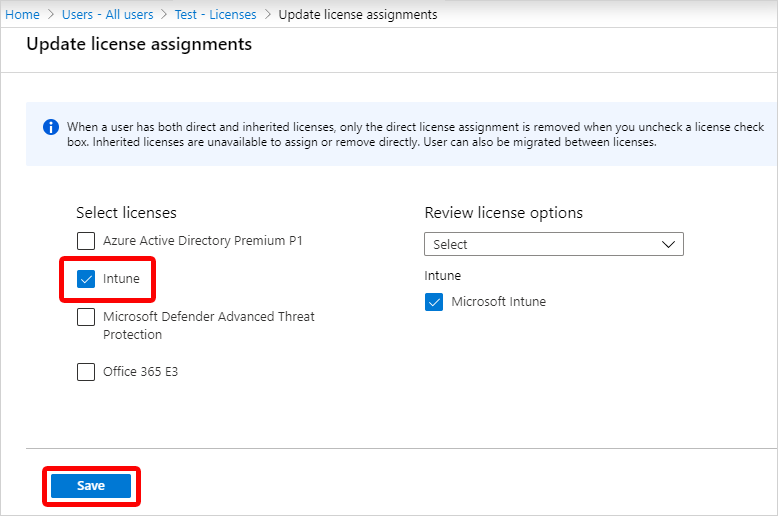
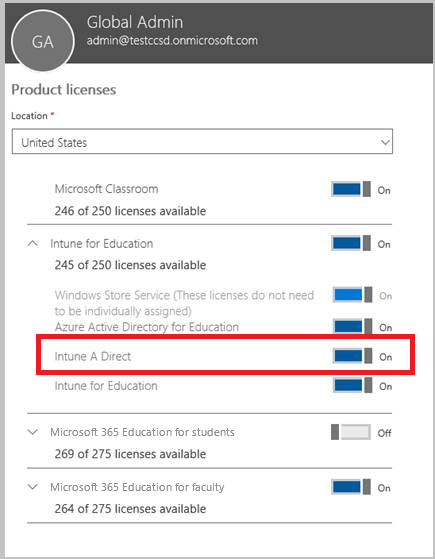
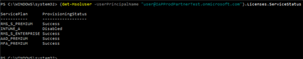

---
# required metadata

title: Assign Microsoft Intune licenses
description: Assign licenses to users so they can enroll in Intune
keywords:
author: Erikre
ms.author: erikre
manager: dougeby
ms.date: 08/01/2022
ms.topic: how-to
ms.service: microsoft-intune
ms.subservice: fundamentals
ms.localizationpriority: high

# optional metadata

#ROBOTS:
#audience:

ms.reviewer: amsaeedi
ms.suite: ems
search.appverid: MET150
#ms.tgt_pltfrm:
ms.custom: intune-classic; get-started
ms.collection:
- tier1
- M365-identity-device-management
- highpri
- EngageScoreOct2022
---

# Assign licenses to users so they can enroll devices in Intune

Whether you manually add users or synchronize from your on-premises Active Directory, you must first assign each user an Intune Plan 1 license before users can enroll their devices in Intune. For a list of licenses, see [Microsoft Intune licensing](licenses.md).

> [!NOTE]
> Users assigned Intune app protection policy and not enrolling their devices into Microsoft Intune will also require an Intune license to receive policy.

## Assign an Intune license in the Microsoft Intune admin center

You can use the [Microsoft Intune admin center](https://go.microsoft.com/fwlink/?linkid=2109431) to manually add cloud-based users and assign licenses to both cloud-based user accounts and accounts synchronized from your on-premises Active Directory to Azure AD.

1. In the [Microsoft Intune admin center](https://go.microsoft.com/fwlink/?linkid=2109431), select **Users** > **All Users** > choose a user > **Licenses** > **Assignments**.

2. Choose the box for **Intune** > **Save**. If you want to use the Enterprise Mobility + Security E5 or other license, choose that box instead.

   

3. The user account now has the permissions needed to use the service and enroll devices into management.

## Assign an Intune license by using Azure Active Directory

You can also assign Intune licenses to users by using Azure Active Directory. For more information, see the [License users in Azure Active Directory article](/azure/active-directory/active-directory-licensing-group-assignment-azure-portal).

## Use School Data Sync to assign licenses to users in Intune for Education

If you are an educational organization, you can use School Data Sync (SDS) to assign Intune for Education licenses to synced users. Just choose the Intune for Education checkbox when you're setting up your SDS profile.  


When you assign an Intune for Education license, make sure that Intune A Direct license is also assigned.



See this [overview of School Data Sync](https://support.office.com/article/Overview-of-School-Data-Sync-and-Classroom-f3d1147b-4ade-4905-8518-508e729f2e91) to learn more about SDS.

## How user and device licenses affect access to services

- Each **user** that you assign a user software license to may access and use the online services and related software (including System Center software) to manage applications and up to 15 MDM devices.
- You can purchase licenses for any devices separately from user licenses. Device licenses do not need to be assigned to the devices. Each device that accesses and uses the online services and related software (including System Center software) must have a device license.
- If a device is used by more than one user, each device requires a device based software license or all users require a user software license.
- If you remove a license from a user that has managed devices, it may affect the compliance or management of those devices.  

## How to restore users accidentally unlicensed

- If you have accidentally removed the license for one or more users, you can restore their device compliance and management by re-assigning the license for those users. For more information, see [Assign Microsoft Intune licenses](#assign-an-intune-license-in-the-microsoft-intune-admin-center).

## Understanding the type of licenses you have purchased

How you purchased Intune determines your subscription information:

- If you purchased Intune through an Enterprise Agreement, you can find your subscription information in the Volume License portal under **Subscriptions**.
- If you purchased Intune through a Cloud Solution Provider, check with your reseller.
- If you purchased Intune with a CC# or Invoice, then your licenses will be user-based.

## Look up current licenses using PowerShell

To view the number of free and used licenses on a Microsoft Intune subscription, you can use the following steps to run PowerShell commands.

1. From a PowerShell prompt, run the following command:

   ```powershell
   $creds = Get-Credential
   ```

2. A pop-up window will prompt for credentials. Enter your Microsoft Intune credentials.
3. Run the following command:

   ```powershell
   Connect-MsolService -Credential $creds
   ```

4. Run the following command:

   ```powershell
   Get-MsolAccountSku
   ```

A list of the **Account ID**, the **Active Units**, and the **Consumed Units** will appear. Note that this will also display any Microsoft Office 365 licenses on the subscription.

> [!NOTE]
> To confirm your Azure Active Directory Premium and Microsoft Intune using Microsoft Intune admin center, see [Confirm your licenses](../fundamentals/licenses.md#confirm-your-licenses).

## Use PowerShell to selectively manage EMS user licenses

Organizations that use Microsoft Enterprise Mobility + Security (formerly Enterprise Mobility Suite) might have users who only require Azure Active Directory Premium or Intune services in the EMS package. You can assign one or a subset of services using [Azure Active Directory PowerShell cmdlets](/previous-versions/azure/jj151815(v=azure.100)).

To selectively assign user licenses for EMS services, open PowerShell as an administrator on a computer with the [Azure Active Directory Module for Windows PowerShell](/previous-versions/azure/jj151815(v=azure.100)#bkmk_installmodule) installed. You can install PowerShell on a local computer or on an ADFS server.

You must create a new license SKU definition that applies only to the desired service plans. To do this, disable the plans you don't want to apply. For example, you might create a license SKU definition that does not assign an Intune license. To see a list of available services, type:

```powershell
(Get-MsolAccountSku | Where {$_.SkuPartNumber -eq "EMS"}).ServiceStatus
```

You can run the following command to exclude the Intune service plan. You can use the same method to expand to an entire security group or you can use more granular filters.

**Example 1**<br>
Create a new user on the command line and assign an EMS license without enabling the Intune portion of the license:

```powershell
Connect-MsolService

New-MsolUser -DisplayName "Test User" -FirstName FName -LastName LName -UserPrincipalName user@<TenantName>.onmicrosoft.com –Department DName -UsageLocation US

$CustomEMS = New-MsolLicenseOptions -AccountSkuId "<TenantName>:EMS" -DisabledPlans INTUNE_A
Set-MsolUserLicense -UserPrincipalName user@<TenantName>.onmicrosoft.com -AddLicenses <TenantName>:EMS -LicenseOptions $CustomEMS
```

Verify with:

```powershell
(Get-MsolUser -UserPrincipalName "user@<TenantName>.onmicrosoft.com").Licenses.ServiceStatus
```

**Example 2**<br>
Disable the Intune portion of EMS license for a user that is already assigned with a license:

```powershell
Connect-MsolService

$CustomEMS = New-MsolLicenseOptions -AccountSkuId "<TenantName>:EMS" -DisabledPlans INTUNE_A
Set-MsolUserLicense -UserPrincipalName user@<TenantName>.onmicrosoft.com -LicenseOptions $CustomEMS
```

Verify with:

```powershell
(Get-MsolUser -UserPrincipalName "user@<TenantName>.onmicrosoft.com").Licenses.ServiceStatus
```


