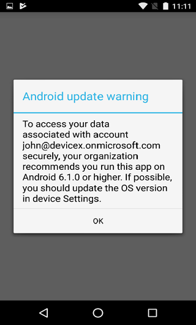
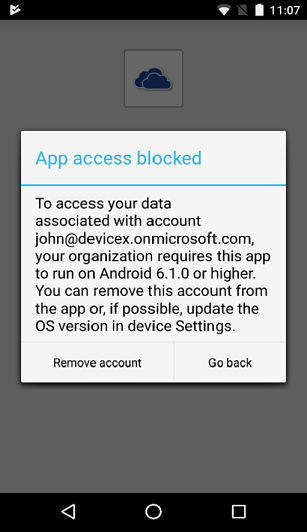

---
# required metadata

title: Manage operating system versions with Intune
titleSuffix: Microsoft Intune
description: Learn how to manage operating system versions across platforms with Microsoft Intune. 
keywords:
author: brenduns
ms.author: brenduns
manager: dougeby
ms.date: 02/17/2021
ms.topic: conceptual
ms.service: microsoft-intune
ms.subservice: fundamentals
ms.localizationpriority: high
ms.assetid: 361ef17b-1ee0-4879-b7b1-d678b0787f5a

# optional metadata

#ROBOTS:
#audience:

ms.reviewer: 
#ms.suite: ems
search.appverid: MET150
#ms.tgt_pltfrm:
#ms.custom:
ms.collection: M365-identity-device-management
---

# Manage operating system versions with Intune
On modern mobile and desktop platforms, major updates, patches, and new versions release at a rapid pace. You have controls to fully manage updates and patches on Windows, but other platforms like iOS/iPadOS and Android require your end users to participate in the process.  Microsoft Intune has the capabilities to help you structure your operating system version management across different platforms.

Intune can help you address these common scenarios: 
- Determine which operating system versions are on your end-user devices
- Control access to organizational data on devices while you validate a new operating system release
- Encourage/require end users to upgrade to the latest operating system version approved by your organization
- Manage an organization-wide rollout to a new operating system version
  
## Operating system version control using Intune mobile device management (MDM) enrollment restrictions
Intune MDM enrollment restrictions let you define the client device requirements before you allow enrollment of the device. The goal is to require that your end users enroll only compliant devices before gaining access organizational resources. Device requirements include both minimum and maximum allowed operating system versions for supported platforms.

:::image type="content" source="./media/manage-os-versions/os-version-platform-configurations.png" alt-text="Platform configuration restrictions blade":::

### In practice

Organizations are using device type restrictions to control access to organizational resources by using the following settings:

1. Use minimum operating system version to keep end users on current and supported platforms in your organization.
2. Leave maximum operating system unspecified (no limit) or set it to the last validated version in your organization to allow time for internal testing of new operating system releases.

For details, see [Create a device platform restriction](../enrollment/create-device-platform-restrictions.md).

## Operating system version reporting and compliance with Intune MDM device compliance policies

Intune MDM device compliance policies provide you the following tools:

- Specify compliance rules
- View compliance status via reporting
- Act on noncompliance via device quarantine and Conditional Access

Like enrollment restrictions, device compliance policies include both minimum and maximum operating system versions. Policies also have a compliance timeline to provide your users a grace period to get compliant. Device compliance policies keep your enrolled end-user devices compliant with organizational policy.

:::image type="content" source="./media/manage-os-versions/os-version-actions-noncompliance.png" alt-text="Device compliance - actions for noncompliant devices":::

For details, see [Get started with device compliance](../protect/device-compliance-get-started.md).

### In practice
Organizations are using device compliance policies for the same scenarios as enrollment restrictions. These policies keep users on current, validated operating system versions in your organization. When end-user devices fall out of compliance, access to organizational resources can be blocked via Conditional Access until end users are within the supported operating system range for your organization. End users are notified that they are out of compliance and they are provided the steps to regain access.   

For details, see [Get started with device compliance](../protect/device-compliance-get-started.md).
 
## Operating system version controls using Intune app protection policies    
Intune app protection policies and mobile application management (MAM) access settings let you specify the minimum operating system version at the app layer. This lets you inform and encourage, or require, your end users to update their operating system to a specified minimum version.
 
You have two different options: 
- **Warn** - Warn informs the end user that they should upgrade if they open an app with an application protection policy or MAM access settings on a device with an operating system version below the specified version. Access is allowed for the app and organizational data.  
  

- **Block** - Block informs the end user that they must upgrade when they open an app with an application protection policy or MAM access settings on a device with an operating system version below the specified version. Access is not allowed for app and organizational data.  
  

### In practice
Organizations are using app protection policy settings today when apps are opened or resumed as a way to educate end users about the need to keep their apps current. An example configuration is that end users are warned on current version minus one and blocked on current version minus two.
 
For details, see [How to create and assign app protection policies](../apps/app-protection-policies.md).

## Managing a new operating system version rollout
You can use the Intune capabilities described in this article to help you move your organization to a new operating system version within the timeline you define. The following steps provide a sample deployment model to move your users from operating system v1 to operating system v2 in seven days.
1. Use enrollment restrictions to require operating system v2 as the minimum version to enroll the device. This ensures new end-user devices are compliant at enrollment time.
2. Use Intune app protection policies to warn users when the app opens or resumes that operating system v2 is required.
3. Use device compliance policies to require operating system v2 as the minimum version for a device to be compliant. Use **Actions** for noncompliance to allow a seven-day grace period and to send end users an email notification with your timeline and requirements.
   - These policies will inform end users that existing devices need to be updated through email, the Intune Company Portal, and when the app is opened for apps enabled with an app protection policy.
   - You can run a compliance report to identify users that are out of compliance. 
4. Use Intune app protection policies to block users when an app opens or resumes if the device is not running operating system v2.
5. Use device compliance policies to require operating system v2 as the minimum version for a device to be compliant.
   - These policies require devices to be updated for them to continue to access organizational data. Protected services are blocked when used with device Conditional Access. Apps enabled with an app protection policy are blocked when opened or when they access organizational data.

## Next steps

Use the following resources to manage operating system versions in your organization:

- [Set device type restrictions](../enrollment/enrollment-restrictions-set.md)
- [Get started with device compliance](../protect/device-compliance-get-started.md)
- [How to create and assign app protection policies](../apps/app-protection-policies.md)
