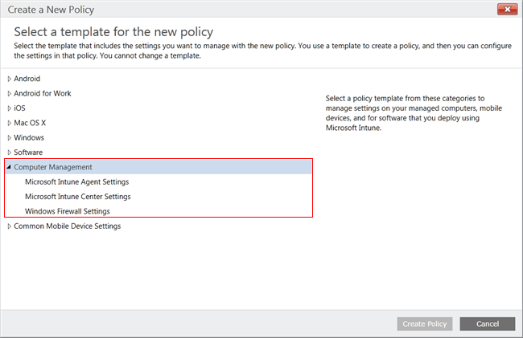
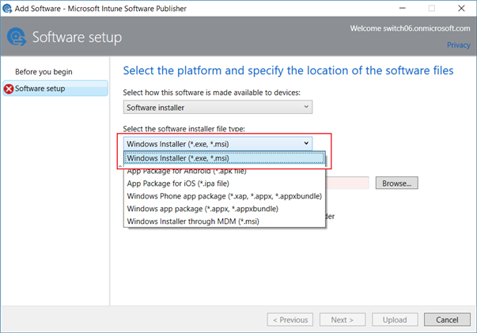
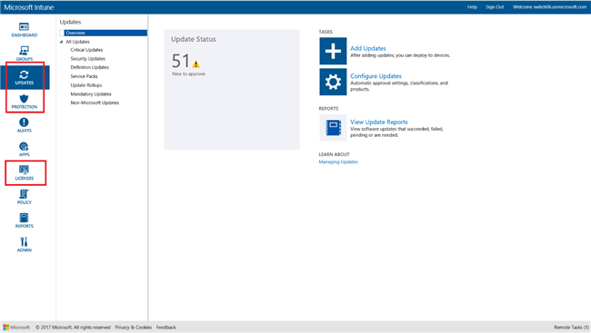

---
# required metadata

title: Manage PCs with client software in Microsoft Intune - Azure | Microsoft Docs
description: Manage Windows PCs by installing the Intune client software.
keywords:
author: MandiOhlinger
ms.author: mandia
manager: dougeby
ms.date: 10/15/2019
ms.topic: archived
ms.service: microsoft-intune
ms.subservice: fundamentals
ms.localizationpriority: medium
ms.assetid: 3b8d22fe-c318-4796-b760-44f1ccf34312

# optional metadata

#audience:

ms.reviewer: owenyen
ms.suite: ems
search.appverid: MET150
#ms.tgt_pltfrm:
ms.custom: intune-classic-keep
ms.collection: M365-identity-device-management
---

# Manage Windows PCs as computers via Intune software client

[!INCLUDE [classic-portal](../includes/classic-portal.md)]

> [!WARNING]
> Microsoft announced that [Windows 7 support ends on January 14th 2020](https://support.microsoft.com/help/4057281/windows-7-support-will-end-on-january-14-2020). On this date, Intune also retires support for devices running Windows 7. Microsoft strongly recommends that you move to Windows 10 to prevent any service or support disruptions.
> 
> For more information, see [Plan for Change blog post](https://aka.ms/Windows7_Intune).

> [!NOTE]
> You can use Microsoft Intune to manage Windows PCs either [as mobile devices with mobile device management (MDM)](../enrollment/windows-enroll.md) or as computers with the Intune software client as described below. However, Microsoft recommends that customers [use the MDM management solution](../enrollment/windows-enroll.md) whenever possible. For more information, see [Compare managing Windows PCs as computers or mobile devices](pc-management-comparison.md) 

Intune provides a comprehensive solution for organizations to manage mobile devices. Intune can manage Windows PCs as mobile devices using the modern device management capabilities built in to the Windows 10 operating system. To meet your organization’s management needs, Intune can also manage Windows PCs as computers with the Intune software client. This management method uses traditional computer management capabilities in the legacy Windows operating system.

The Intune software client is best suited for Windows PCs running legacy operating systems such as Windows 7 which cannot be managed as mobile devices. The Intune software client uses management capabilities like Group Policy to manage PCs from the cloud.

Intune supports management of Windows PCs as computers using the software client for up to 7,000 PCs. For larger deployments, manage Windows 10 PCs as mobile devices. Each release of Intune and update of Windows 10 includes management features based on the mobile device management architecture. We strongly recommend that you move your organization to Windows 10 managed as mobile devices.

> [!NOTE]
> You can manage Windows 8.1 and later devices either as PCs by using the Intune client software or as mobile devices. You cannot use both methods on the same device. Carefully consider before deciding to manage PCs with the Intune client software. This topic applies only to managing devices as PCs by running the Intune client software.

## Requirements for Intune PC client management

**Hardware**:  
The following are minimum hardware requirements for installing the Intune client software:

|Requirement|More information|
|---------------|--------------------|
|Network|The client requires the PC to have Internet connectivity.|
|Processor and Memory|Refer to the processor and RAM requirements for the PC's operating system.|
|Disk space|200 MB available disk space before the client software is installed.|

**Software**:  
The following are software requirements for installing the client software:

|Requirement|More information|
|---------------|--------------------|
|Operating system | Windows device running Windows 7 SP1 and Windows 8.1 or later.   **Home edition versions are not supported.**|
|Administrative permissions|The account that installs the client software must have local administrator permissions on that device.|
|Windows Installer 3.1|The PC must have, at a minimum, Windows Installer 3.1.  To view the version of Windows Installer on a PC:    On the PC, right-click **%windir%\System32\msiexec.exe**, and then click **Properties**.  You can download the latest version of Windows Installer from [Windows Installer Redistributables](https://go.microsoft.com/fwlink/?LinkID=234258) on the Microsoft Developer Network website.|
|Remove incompatible client software|Before you install the Intune client software, uninstall any Configuration Manager, Operations Manager, and Service Manager client software from that PC.|

## Deploying the Intune software client
As an Intune admin, you can make the Intune software client available to users in a variety of ways. For guidance, see [Install the Intune software client on Windows PCs](../install-the-windows-pc-client-with-microsoft-intune.md).

## Computer management capabilities with the Intune client software
In most scenarios, you will enroll your devices with Microsoft Intune, which provides a greater set of capabilities. However, you can also manage PCs by using the Intune software client, which provides the following features:

- **[Software update management](../keep-windows-pcs-up-to-date-with-software-updates-in-microsoft-intune.md)** - You can keep PCs up-to-date and decide when updates are applied.

- **[Windows Firewall policy](../help-protect-windows-pcs-using-windows-firewall-policies-in-microsoft-intune.md)** - This helps to ensure that no PC that's used in your company has an inactive or improperly-configured Windows Firewall.

- **[Anti-malware protection](../help-secure-windows-pcs-with-endpoint-protection-for-microsoft-intune.md)** - Intune includes Endpoint Protection, which helps protect your PCs from malware.

- **[Remote assistance](common-windows-pc-management-tasks-with-the-microsoft-intune-computer-client.md)** - Intune lets users contact IT support staff, who can then provide assistance by using a remote desktop feature that is included with Intune (requires TeamViewer software).

- **[Software license management](../manage-license-agreements-for-windows-pc-software-in-microsoft-intune.md)** - Track how many software licenses are available, and how many available licenses are being used.
- **[App deployment](add-apps-for-windows-pcs-in-microsoft-intune.md)** - Deploy software to PCs that you manage. Some app management features are not available when you manage PCs with the software client.

<!-- - **Compliance settings reporting** -->

## Policies and app deployments for the Intune software client

While the Intune client software supports [management capabilities that help protect PCs](policies-to-protect-windows-pcs-in-microsoft-intune.md) by managing software updates, Windows firewall, and Endpoint Protection, PCs managed with the Intune client software cannot be targeted with other Intune policies, including those **Windows** policy settings that are specific to mobile device management.

When you use the Intune client software to manage Windows PCs, you can use only the policies shown under the **Computer Management** section.

Intune manages Windows PCs using policies, similar to how Windows Server Active Directory Domain Services (AD DS) Group Policy Objects (GPOs) do. If you manage Active Directory domain-joined computers with Intune, [ensure that Intune policies do not conflict with other GPOs](resolve-gpo-and-microsoft-intune-policy-conflicts.md) used in your organization. To read more, see [Group Policy for beginners](https://technet.microsoft.com/library/hh147307.aspx).

  

When deploying apps, you can use only the Windows Installer (.exe, .msi).

  

## Common tasks for Windows PCs

You can use the Intune admin console to perform other common computer management tasks on Windows PCs that have the client installed:
- [Use policies to simplify PC management](use-policies-to-simplify-windows-pc-management.md) - Describes Intune's **Computer Management** policies and lists the settings for the Microsoft Intune Center.

- [View hardware and software inventory for Windows PCs](view-hardware-and-software-inventory-for-windows-pcs-in-microsoft-intune.md) - Explains how to create a report that lists information about the hardware capabilities of PCs and the software installed on them. Also explains how to refresh PC inventory to ensure that it is current.
- [Retire a Windows PC](retire-a-windows-pc-with-microsoft-intune.md) - Lists the steps for retiring a Windows PC and describes what happens when you retire a PC.
- [Manage user-device linking for Windows PCs](../manage-user-device-linking-for-windows-pcs-with-microsoft-intune.md) - Explains when and how you need to link a user to a PC before you deploy software to the user.
- [Request and provide remote assistance for Windows PCs](request-and-provide-remote-assistance-for-windows-pcs-in-microsoft-intune.md) - Explains how Intune PC users get remote assistance help from you and describes prerequisites and TeamViewer setup.

For more information about the above tasks, see [common computer management tasks](common-windows-pc-management-tasks-with-the-microsoft-intune-computer-client.md).

## Management limitations of the Intune client software

Some management options, which can be used to manage PCs as mobile devices, cannot not used for PCs that are managed with the Intune client software:

- Full wipe (selective wipe is available)
- Conditional Access

Also note that in the Intune admin console, certain sections, such as **Updates**, **Protection**, and **Licenses** appear only if you have enrolled devices using the Intune client software.

  

## Help with troubleshooting

The Intune client software usually runs quietly in the background without the need for much user interaction or troubleshooting. If you need to resolve PC management issues, you can check the logs. The Intune client software and corresponding logs are installed under the %Program Files%\Microsoft\OnlineManagement directory.

You can also review [device enrollment](../enrollment/device-enrollment.md) for more information about enrolling devices with Microsoft Intune.
