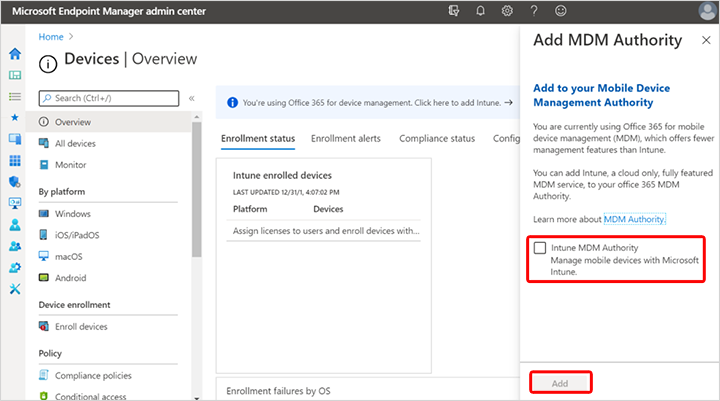

---
# required metadata

title: Set the mobile device management authority
titleSuffix: Microsoft Intune
description: Set the mobile device management authority in Intune.
keywords:
author: Smritib17
ms.author: smbhardwaj
manager: dougeby
ms.date: 02/17/2021
ms.topic: how-to
ms.service: microsoft-intune
ms.subservice: fundamentals
ms.localizationpriority: high

# optional metadata

#ROBOTS:
#audience:

ms.reviewer: dagerrit
ms.suite: ems
search.appverid: MET150
#ms.tgt_pltfrm:
ms.custom: intune-azure
ms.collection:
- tier1
- M365-identity-device-management
  - highpri
---

# Set the mobile device management authority

The mobile device management (MDM) authority setting determines how you manage your devices. As an IT admin, you must set an MDM authority before users can enroll devices for management. You should also be assigned an Intune license to to set the MDM Authority.

Possible configurations are:

- **Intune Standalone** - Cloud-only management, which you configure by using the Azure portal. Includes the full set of capabilities that Intune offers. [Set the MDM authority in the Microsoft Intune admin center](#set-mdm-authority-to-intune).

- **Intune co-management** - Integration of the Intune cloud solution with Configuration Manager for Windows 10 devices. You configure Intune by using the Configuration Manager console. [Configure auto-enrollment of devices to Intune](/configmgr/comanage/tutorial-co-manage-clients#configure-auto-enrollment-of-devices-to-intune).

- **Basic Mobility and Security for Microsoft 365** - If you have this configuration activated, you'll see the MDM authority set to "Office 365". If you want to start using Intune, you'll need purchase Intune licenses.

- **Basic Mobility and Security for Microsoft 365 [coexistence](#coexistence)** - You can add Intune to your tenant if you're already using Basic Mobility and Security for Microsoft 365 and set the management authority to either Intune or Basic Mobility and Security for Microsoft 365 for each user to dictate which service will be used to manage their MDM-enrolled devices. Each user's management authority is defined based on the license assigned to the user: If the user has only a license for Microsoft 365 Basic or Standard, their devices will be managed by Basic Mobility and Security for Microsoft 365. If the user has a license entitling Intune, their devices will be managed by Intune. If you add a license entitling Intune to a user previously managed by Basic Mobility and Security for Microsoft 365, their devices will be switched to Intune management. Be sure to have Intune configurations assigned to users to replace Basic Mobility and Security for Microsoft 365 before switching users to Intune, otherwise their devices will lose Basic Mobility and Security for Microsoft 365 configuration and won't receive any replacement from Intune.

## Set MDM authority to Intune

For tenants using the 1911 service release and later, the MDM authority is automatically set to Intune.

For pre-1911 service release tenants, if you haven't yet set the MDM authority, follow the steps below.

1. In the [Microsoft Intune admin center](https://go.microsoft.com/fwlink/?linkid=2109431), select the orange banner to open the **Mobile Device Management Authority** setting. The orange banner is only displayed if you haven't yet set the MDM authority.
2. Under **Mobile Device Management Authority**, choose your MDM authority from the following options:

    - **Intune MDM Authority**
    - **None**

  

  A message indicates that you have successfully set your MDM authority to Intune.

### Workflow of Intune Administration UI

When Android or Apple device management is enabled, Intune sends device and user information to integrate with these third-party services to manage their respective devices.

Scenarios that add a consent to share data are included when:

- You enable Android Enterprise personally-owned or corporate-owned work profiles.
- You enable and upload Apple MDM push certificates.
- You Enable any of the Apple services, such as Device Enrollment Program, School Manager, or Volume Purchasing Program.

In each case, the consent is strictly related to running a mobile device management service. For example, confirming that an IT Admin has authorized Google or Apple devices to enroll. Documentation to address what information is shared when the new workflows go live is available from the following locations:

- [Data Intune sends to Google](../protect/data-intune-sends-to-google.md)
- [Data Intune sends to Apple](../protect/data-intune-sends-to-apple.md)

## Key Considerations

After you switch to the new MDM authority, there will likely be transition time (up to eight hours) before the device checks in and synchronizes with the service. You're required to configure settings in the new MDM authority to make sure enrolled devices will continue to be managed and protected after the change.

- Devices must connect with the service after the change so that the settings from the new MDM authority (Intune standalone) replace the existing settings on the device.
- After you change the MDM authority, some of the basic settings (such as profiles) from the previous MDM authority will remain on the device for up to seven days or until the device connects to the service for the first time. It's recommended that you configure apps and settings (like policies, profiles, and apps) in the new MDM authority as soon as possible and deploy the setting to the user groups that contains users who have existing enrolled devices. As soon as a device connects to the service after the change in MDM authority, it will receive the new settings from the new MDM authority and prevent gaps in management and protection.
- Devices that don't have associated users (typically when you have iOS/iPadOS Device Enrollment Program or bulk enrollment scenarios) aren't migrated to the new MDM authority. For those devices, you need to call support for assistance to move them to the new MDM authority.

## Coexistence

Enabling coexistence lets you use Intune for a new set of users while continuing to use Basic Mobility and Security for the existing users. You control which devices are managed by Intune through the user. If a user is assigned an Intune license or is using Intune co-management with Configuration Manager, then all their enrolled devices will be managed by Intune. Otherwise, the user is managed by Basic Mobility and Security.

There are three major steps to enable coexistence:

1. Preparation
2. Add Intune MDM authority
3. User and Device migration (optional).

### Preparation

Before enabling coexistence with Basic Mobility and Security, consider the following points:

- Make sure you have sufficient [Intune licenses](licenses.md) for the users you intend to manage through Intune.
- Review which users are assigned Intune licenses. After you enable coexistence, any user already assigned an Intune license will have their devices switch to Intune. To avoid unexpected device switches, we recommend not assigning any Intune licenses until you've enabled coexistence.
- Create and deploy Intune policies to replace device security policies that were originally deployed through the Office 365 Security & Compliance portal. This replacement should be done for any users you expect to move from Basic Mobility and Security to Intune. If there are no Intune policies assigned to those users, enabling coexistence may cause them to lose Basic Mobility and Security settings. These settings will be lost without replacement, like managed email profiles. Even when replacing device security policies with Intune policies, users may be prompted to re-authenticate their email profiles after the device is moved to Intune management.
- You can't unprovision Basic Mobility and Security after you've set it up. However, there are steps you can take to turn off the policies. For more information, see [Turn off Basic Mobility and Security](/microsoft-365/admin/basic-mobility-security/turn-off).

### Add Intune MDM authority

To enable coexistence, you must add Intune as the MDM authority for your environment:

1. Sign in to the [Microsoft Intune admin center](https://go.microsoft.com/fwlink/?linkid=2109431) with Azure AD Global or Intune service administrator rights.
2. Navigate to **Devices**.
3. The **Add MDM Authority blade** displays.
4. To switch the MDM authority from *Office 365* to *Intune* and enable coexistence, select **Intune MDM Authority** > **Add**.
  

### Migrate users and devices (optional)

After the Intune MDM authority is enabled, coexistence is activated and you can begin managing users through Intune. Optionally, if you want to move devices previously managed by Basic Mobility and Security to be managed by Intune, assign those users an Intune license. The users' devices will switch to Intune on their next MDM check-in. Settings applied to these devices through Basic Mobility and Security will no longer be applied and will be removed from the devices.

## Mobile device cleanup after MDM certificate expiration

The MDM certificate is renewed automatically when mobile devices are communicating with the Intune service. If mobile devices are wiped, or they fail to communicate with the Intune service for some period of time, the MDM certificate won't get renewed. The device is removed from the Azure portal 180 days after the MDM certificate expires.

## Remove MDM authority

The MDM authority can't be changed back to Unknown. The MDM authority is used by the service to determine which portal enrolled devices report to (Microsoft Intune or Basic Mobility and Security for Microsoft 365).

## What to expect after changing the MDM authority

- When the Intune service detects that a tenant's MDM authority has changed, it sends out a notification message to all the enrolled devices to check in and synchronize with the service (this notification is outside of the regularly scheduled check-in). Therefore, after the MDM authority for the tenant has been changed from Intune standalone, all the devices that are powered on and online will connect with the service, receive the new MDM authority, and be managed by the new MDM authority. There's no interruption to the management and protection of these devices.
- Even for devices that are powered on and online during (or shortly after) the change in MDM authority, there will be a delay of up to eight hours (depending on the timing of the next scheduled regular check-in) before devices are registered with the service under the new MDM authority.  

 > [!IMPORTANT]  
 > Between the time when you change the MDM authority and when the renewed APNs certificate is uploaded to the new authority, new device enrollments and device check-in for iOS/iPadOS devices fail. Therefore, it's important that you review and upload the APNs certificate to the new authority as soon as possible after the change in MDM authority.

- Users can quickly change to the new MDM authority by manually starting a check-in from the device to the service. Users can easily make this change by using the Company Portal app and starting a device compliance check.
- To validate that things are working correctly after devices have checked-in and synchronized with the service after the change in MDM authority, look for the devices in the new MDM authority.
- There's an interim period when a device is offline during the change in MDM authority and when that device checks in to the service. To help ensure that the device remains protected and functional during this interim period, the following profiles remain on the device for up to seven days (or until the device connects with the new MDM authority and receives new settings that overwrite the existing ones):
  - E-mail profile
  - VPN profile
  - Cert profile
  - Wi-Fi profile
  - Configuration profiles
- After you change to the new MDM authority, the compliance data in the Microsoft Intune admin center can take up to a week to accurately report. However, the compliance states in Azure Active Directory and on the device will be accurate so the device is still be protected.
- Make sure the new settings that are intended to overwrite existing settings have the same name as the previous ones to ensure that the old settings are overwritten. Otherwise, the devices might end up with redundant profiles and policies.  

 > [!TIP]  
 > As a best practice, you should create all management settings and configurations, as well as deployments, shortly after the change to the MDM authority has completed. This helps ensure that devices are protected and actively managed during the interim period.

- After you change the MDM authority, perform the following steps to validate that new devices are enrolled successfully to the new authority:  
  - Enroll a new device
  - Make sure the newly enrolled device shows up in the new MDM authority.
  - Perform an action, such as Remote Lock, from the Microsoft Intune admin center to the device. If it's successful, the device is being managed by the new MDM authority.
- If you have issues with specific devices, you can unenroll and re-enroll the devices to get them connected to the new authority and managed as quickly as possible.

## Next steps

With the MDM authority set, you can start [enrolling devices](../enrollment/device-enrollment.md).
