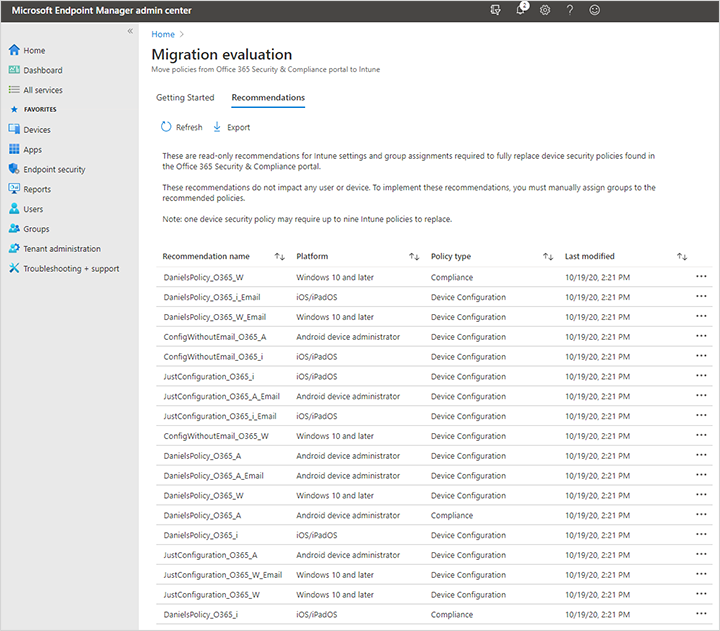
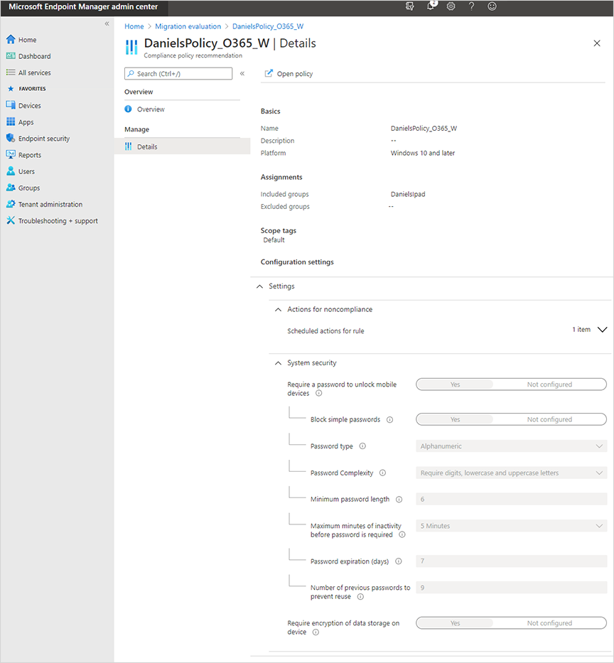

---
# required metadata

title: Migrate device management from Basic Mobility and Security to Intune
titleSuffix: Microsoft Intune
description: Learn how to migrate your mobile device management from Basic Mobility and Security (formerly Office 365) to Intune.
keywords:
author: Smritib17
ms.author: smbhardwaj
manager: dougeby
ms.date: 12/18/2020
ms.topic: how-to
ms.service: microsoft-intune
ms.subservice: enrollment
ms.localizationpriority: high
ms.technology:
ms.assetid: 

# optional metadata

#ROBOTS:
#audience:

ms.reviewer: dagerrit
ms.suite: ems
search.appverid: MET150
#ms.tgt_pltfrm:
ms.custom: seodec18
ms.collection:
- tier2
- M365-identity-device-management
---

# Migrate your mobile device management from Basic Mobility and Security to Intune

This article will help you migrate your mobile device management (MDM) from Basic Mobility and Security (Office 365) to the Microsoft Endpoint Manager portal (Intune).

Moving to Intune combines all your MDM in one solution. It lets all your users benefit from the wider set of features offered by Intune. To see a comparison of the features available in the two services, see [Choose between Basic Mobility and Security or Intune](/microsoft-365/admin/basic-mobility-security/choose-between-basic-mobility-and-security-and-intune).

After migrating to Intune, the existing device security policies deployed with Basic Mobility and Security will be permanently frozen.

Migrating to Intune requires the following three major steps:

1. **Prepare**: Review your Intune licenses, Basic Mobility and Security policies, group memberships, and devices to streamline the migration.
2. **Migrate policies**: Use the migration evaluation tool to get Intune policy and group recommendations to replace the Basic Mobility and Security policies.
3. **Migrate users and devices**: Assign licenses to users or groups, which will automatically switch the users to Intune device management at the next refresh cycle.

For a mapping reference of the policies migrated by this tool, see [Policy mapping between Basic Mobility and Security and Intune](policy-map-between-basic-mobility-security-intune.md).

## Prepare

Before you migrate your device management from Basic Mobility and Security to Intune, follow these steps:

1. Be sure to have enough [Intune licenses](./licenses.md) to cover all your users managed by Basic Mobility and Security.
2. Review the [device security policies](/microsoft-365/admin/basic-mobility-security/set-up#step-4-recommended-manage-device-security-policies) in the Office 365 Security & Compliance portal and delete any that you no longer need. Deleting unneeded policies reduces the number of recommendations created by the migration tool so you have fewer to review after migration.
3. Review the [membership of groups](/microsoft-365/admin/basic-mobility-security/create-device-security-policies#step-3-deploy-a-policy-to-your-organization) currently assigned device security policies. If these groups contain users that are already licensed for Intune, you should create new groups to separate Intune-licensed users from groups without Intune licenses. Only assign device security policies to those users who aren't assigned Intune licenses.
4. Review the types of devices currently enrolled in Basic Mobility and Security. Unsupported [OS versions and variants](../fundamentals/supported-devices-browsers.md#intune-supported-operating-systems) may continue to work, but they won’t be supported if migrated to Intune. For example, the settings applied to a Windows 8.1 Phone won’t be moved to Intune. If the user is licensed for Intune, their phone will lose any configuration set by device security policies in the Office 365 Security & Compliance portal.    
5. Before migration, don’t assign Intune licenses to users whose devices are managed by Basic Mobility and Security. Don't assign Intune licenses to enable [Mobile Application Management (MAM)](../apps/app-protection-policy.md). Only assign Intune licenses to users after the policy migration step is complete. The license assignment controls the migration of devices from Basic Mobility and Security to Intune. Before the first device is moved, make sure that sufficient Intune policies have been created to replace Basic Mobility and Security.   

After the migration evaluation process activates, you won’t be able to make changes to your device security policies in the Office 365 Security & Compliance portal. The existing policies will be enforced, but changes to them won’t be saved.

> [!IMPORTANT]
> Contact support before proceeding if you have any of the following products: 
> - Enterprise Mobility + Security A3 for Faculty 
> - Enterprise Mobility + Security A3 for Students 
> - Enterprise Mobility + Security A3 for students use benefit 
> - Enterprise Mobility + Security A5 for Faculty 
> - Enterprise Mobility + Security A5 for Students 
> - Enterprise Mobility + Security A5 for students use benefit 
> - Intune for Education 
> - Intune for Education Add-On 
> - Microsoft Intune for Education for Faculty 
> - Microsoft Intune for Education for Student 
> - Microsoft Intune for Education Prepaid Device

## Migrate policies

After you’ve prepared your licenses and Basic Mobility and Security policies as described in the previous section, you can use the Migration Evaluation tool to get Intune policy recommendations. The tool will migrate your existing Basic Mobility and Security device security policies to Intune as [compliance policies](../protect/device-compliance-get-started.md) and [configuration profiles](../configuration/device-profiles.md) and recommendations for which groups they ought to be assigned.

These Intune recommendations are designed to replicate the Basic Mobility and Security policies. You’ll need to review these recommendations to make sure that they mirror the old policies.
- You won’t need to review or make changes to the settings controlling conditional access to Office 365 services because they’re backed by classic Azure Active Directory conditional access policies and are directly available through the Azure AD portal. These are exactly the same underlying policies managed indirectly through the device security policies in the Office 365 Security & Compliance portal, so there’s no need to review or change them.
- Not all device settings offered in device security policies exactly correspond to Intune settings and values. Therefore, they can’t be moved with precise one-to-one mapping. You’ll need to review and possibly adjust such settings.

After you review and possibly change the migrated policies, you can assign the policies to Intune groups. The new policies will go into effect once assigned and devices managed by the Basic Mobility and Security will migrate after you assign Intune licenses to the users and the next [refresh cycle](../configuration/device-profile-troubleshoot.md#how-long-does-it-take-for-devices-to-get-a-policy-profile-or-app-after-they-are-assigned) occurs.

> [!NOTE]
> For the Windows operating system, only Windows 10 desktop devices will have policy migrated for them. Other versions of Windows and Windows Phone won't have policy migrated for them. For more information, see the [Policy mapping for Access Requirements](./policy-map-access-requirements.md) and [Policy mapping for Configuration](./policy-map-configurations.md). 

To migrate policies from Basic Mobility and Security to Intune, follow these steps:

1. Complete the steps under the [Prepare](#prepare) section above. 
2. Open the [Migration evaluation tool](https://endpoint.microsoft.com/#blade/Microsoft_Intune_Workflows/MifoPolicyListBlade) > choose **Start**. It will take a few minutes to complete the evaluation.
    >[!NOTE]
    > If you navigate away from the Migration evaluation tool, the only way to return is to use the link above.
    > [!IMPORTANT]
    > After you start the migration evaluation, you’ll no longer be able to create new or edit existing device security policies in the Office 365 Security & Compliance portal.
3. Select **Recommendations**. This page displays the Intune policy recommendations based on your Basic Mobility and Security policies. The recommendations are read only and won’t change. The name of each recommendation has a prefix based on the Basic Mobility and Security policy name. You’ll need to review each item in the list as follows.
    
4. Select an item in the list to open the **Compliance policy recommendation overview** page and review the instructions. 
5.	Select **Details** to review the recommended settings and group assignments.
    
    
 
    The policy recommendation on this page isn’t itself an Intune policy. It’s only a read-only report documenting the suggested settings and assignments to use. While reviewing the recommendations, keep these points in mind:
    - If the groups listed in the recommendation already have Intune policies assigned to them, these may conflict with the recommended settings. To learn how conflicts are handled for a specific setting, refer to the documentation for [device configuration](../configuration/device-profiles.md) or [device compliance](../protect/device-compliance-get-started.md).
    > [!NOTE]
    > If you make any changes to the migrated email profiles or fail to assign them to recommended groups, users may be asked to re-enter their username and password to access email on their devices when the device migrates to Intune. See [policy mapping for Configuration](policy-map-configurations.md) 
    - If there are already Intune-licensed users in the recommended groups, verify that the recommended policies will also be appropriate for them. After you assign the policies to these groups, all Intune licensed users will receive them, even users not previously managed by Basic Mobility and Security.
6. If you want to implement the recommended policy, choose **Open policy**. This opens the actual policy page. Initially, the policy doesn’t have any groups assigned to it. This means that it’s not affecting any users who are licensed for Intune and happened to be in the same groups assigned to the original device security policy. You’ll need to assign the recommended groups to the Intune policy to replace the device settings configured in Basic Mobility and Security. If you don’t, devices managed by Basic Mobility and Security could lose settings and email configuration when their users are licensed for Intune causing their devices to migrate.
   > [!NOTE]
   > If you delete the policy, the **Open policy** link from the recommendation page won’t work.
7. To assign the recommended groups to the policy, choose **Properties** > **Edit** (next to **Assignments**) > use the assignments workflow to assign the groups.
    - Optionally, you can first assign a group of test users who have devices enrolled in Basic Mobility and Security. In this case, instead of assigning the actual suggested groups to the policy, assign a test group and confirm that the policies behave as expected.
8. Enable [coexistence](../fundamentals/mdm-authority-set.md#coexistence). After enabling coexistence, all users that are or get assigned an Intune license will immediately migrate to Intune.
9. Assign Intune [licenses](/azure/active-directory/fundamentals/license-users-groups) to the users. The new policies will begin affecting the users' devices after the next [refresh cycle](../configuration/device-profile-troubleshoot.md#how-long-does-it-take-for-devices-to-get-a-policy-profile-or-app-after-they-are-assigned).

### Known issues
#### Start button always appears
The **Start** button will appear each time you visit the Migration evaluation page, even if the evaluation has already been generated. If you dismiss the **Start** prompt, the previously generated recommendations won’t load.
**Workaround**: Start the evaluation again. It won’t create more or duplicate recommendations or policies. Re-running the migration detects that the evaluation has already succeeded and loads the previous recommendations.

#### Number of sign-in failures before device is wiped setting isn’t migrated
The **Number of sign-in failures before device is wiped** setting isn’t migrated to Intune. 
**Workaround**: This setting must be manually added to Intune device configuration profiles if it was enabled in the Basic Mobility and Security policy.

## Migrate users and devices

To migrate a user and their devices to Intune from Basic Mobility and Security, follow these steps:

1. Enable [coexistence](../fundamentals/mdm-authority-set.md#coexistence). Enabling coexistence will immediately migrate all devices whose users are assigned an Intune license.
2. Sign in to the [Microsoft Endpoint Manager admin center](https://go.microsoft.com/fwlink/?linkid=2109431) with Azure AD Global or License administrator rights.
3. Assign Intune licenses to the users you want to migrate by using Users or Groups:
    - Assign licenses to **Users**. For more information, see [Assign licenses to users](/azure/active-directory/fundamentals/license-users-groups).
    - Assign licenses to **Groups**. For more information, see [Assign licenses to a group](/azure/active-directory/enterprise-users/licensing-groups-assign).
4. After a user is licensed for Intune, their devices will automatically switch to Intune management at the next device refresh cycle. See [Refresh cycles](../configuration/device-profile-troubleshoot.md#how-long-does-it-take-for-devices-to-get-a-policy-profile-or-app-after-they-are-assigned).

## Next steps

[Manage your devices in Intune](../fundamentals/what-is-intune.md).
