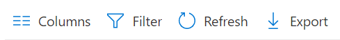

---
# required metadata

title: Audit changes and events in Microsoft Intune - Azure | Microsoft Docs
description: Learn how to review audit logs that record Microsoft Intune activities.
keywords: 
ms.author: dougeby
author: dougeby
manager: dougeby
ms.date: 03/18/2019
ms.topic: troubleshooting
ms.service: microsoft-intune
ms.subservice: fundamentals
ms.localizationpriority: medium
ms.technology:
ms.assetid: 6ee841cc-5694-4ba1-8f66-1d58edec30a4

# optional metadata

#ROBOTS:
#audience:

#ms.reviewer: [ALIAS]
#ms.suite: ems
search.appverid: MET150
#ms.tgt_pltfrm:
#ms.custom:
ms.collection: M365-identity-device-management
---

# Use audit logs to track and monitor events in Microsoft Intune

Audit logs include a record of activities that generate a change in Microsoft Intune. Create, update (edit), delete, assign, and remote actions all create audit events that administrators can review for most Intune workloads. By default, auditing is enabled for all customers. It can't be disabled.

> [!NOTE]
> Audit events started recording on the December 2017 feature release. Prior events aren't available.

## Who can access the data?

Users with the following permissions can review audit logs:

- Global Administrator
- Intune Service Administrator
- Administrators assigned to an Intune role with **Audit data** - **Read** permissions

## Audit logs for Intune workloads

You can review audit logs in the monitoring group for each Intune workload:

1. Sign in to the [Microsoft Endpoint Manager Admin Center](https://go.microsoft.com/fwlink/?linkid=2109431).
2. Select **Tenant administration** > **Audit logs**.
3. To filter the results, select **Filter** and refine the results using the following options.
    - **Category**: such as **Compliance**, **Device**, and **Role**.
    - **Activity**: the options listed here are restricted by the option chosen under **Category**.
    - **Date range**: you can choose logs for the previous month, week, or day.
4. Choose **Apply**.
4. Select an item in the list to see the activity details.

## Route logs to Azure Monitor

Audit logs and operational logs can also be routed to Azure Monitor. In **Audit logs**, select **Export Data Settings**:

> [!NOTE]
> For more information about this feature and to review the prerequisites to use it, see [send log data to storage, event hubs, or log analytics](review-logs-using-azure-monitor.md).

> [!NOTE]
> **Initiated by (actor)** includes information on who ran the task, and where it was run. For example, if you run the activity in Intune in the Azure portal, then **Application** always lists **Microsoft Intune portal extension** and the **Application ID** always uses the same GUID.
>
> The **Target(s)** section lists multiple targets and the properties that were changed.  

## Use Graph API to retrieve audit events

For details on using the graph API to get up to one year of audit events, see [List auditEvents](https://docs.microsoft.com/graph/api/intune-auditing-auditevent-list?view=graph-rest-1.0).

## Next steps

[Send log data to storage, event hubs, or log analytics](review-logs-using-azure-monitor.md).

[Review client app protection logs](../apps/app-protection-policy-settings-log.md).
