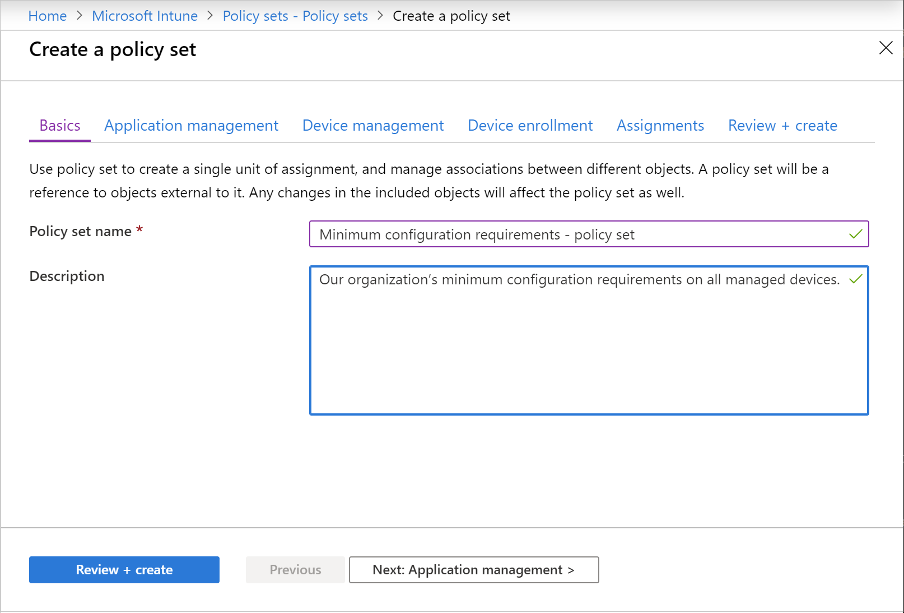

---
# required metadata

title: Policy sets 
titleSuffix: Microsoft Intune
description: Use policy sets to group collections of management objects in Microsoft Intune.
keywords:
author: Erikre
ms.author: erikre
manager: dougeby
ms.date: 04/10/2024
ms.topic: conceptual
ms.service: microsoft-intune
ms.subservice: fundamentals
ms.localizationpriority: high

# optional metadata

#ROBOTS:
#audience:

ms.reviewer: DaGerrit
ms.suite: ems
search.appverid: MET150
#ms.tgt_pltfrm:
ms.custom: intune-azure
ms.collection:
- tier1
- M365-identity-device-management
- highpri
---

# Use policy sets to group collections of management objects

Policy sets allow you to create a bundle of references to already existing management entities that need to be identified, targeted, and monitored as a single conceptual unit. A policy set is an assignable collection of apps, policies, and other management objects you've created. Creating a policy set enables you to select many different objects at once, and assign them from a single place. As your organization changes, you can revisit a policy set to add or remove its objects and assignments. You can use a policy set to associate and assign existing objects, such as apps, policies, and VPNs in a single package.

> [!IMPORTANT]
> For a list of known issues related to policy sets, [Policy sets known issues](policy-sets.md#policy-sets-known-issues).

Policy sets don't replace existing concepts or objects. You can continue to assign individual objects and you can also reference individual objects as part of a policy set. Therefore, any changes to those individual objects will be reflected in the policy set.​

You can use policy sets to:

- Group objects that need to be assigned together
- Assign your organization's minimum configuration requirements on all managed devices
- Assign commonly used or relevant apps to all users

You can include the following management objects in a policy set:

- Apps
- App configuration policies
- App protection policies
- Device configuration profiles
- Device compliance policies
- Windows autopilot deployment profiles
- Enrollment status page
- Settings catalog policies

> [!IMPORTANT]
> As of September 2021, enrollment restrictions based on device type can no longer be included in policy sets. For more information about how to create enrollment restrictions, see [Set enrollment restrictions](../enrollment/enrollment-restrictions-set.md).  

When you create a policy set, you create a single unit of assignment, and manage associations between different objects. A policy set will be a reference to objects external to it. Any changes in the included objects will affect the policy set as well. After you create a policy set, you can repeatedly view and edit its objects and assignments.

> [!NOTE]
> Policy sets support Windows, Android, macOS, and iOS/iPadOS settings, and can be assigned cross-platform.

## How to create a policy set

1. Sign in to the [Microsoft Intune admin center](https://go.microsoft.com/fwlink/?linkid=2109431).
2. Select **Devices** > **Policy Sets** > **Policy sets** > **Create**.
3. On the **Basics** page, add the following values:
    - **Policy set name** - Provide a name for this policy set.
    - **Description** - Optionally, provide a description for the policy set.
   

      

4. Click **Next: Application management**.  
   On the **Application management** page you can optionally [add apps](../apps/apps-add.md), [app configuration policies](../apps/app-configuration-policies-overview.md), and [app protection policies](../apps/app-protection-policy.md) to your policy set. For information about app management, see [What is Microsoft Intune app management?](../apps/app-management.md).
5. Click **Next: Device management**.  
   The **Device management** page allows you to add device management objects to your policy set, such as [device configuration profiles](../configuration/device-profiles.md) and [device compliance policies](../protect/device-compliance-get-started.md). Be sure to include all associated objects, such as other policies, certificates, and security baseline profiles.
6. Click **Next: Device enrollment**.  
   The **Device enrollment** page allows you to add device enrollment objects to your policy set, such as [Windows Autopilot deployment profiles](/autopilot/enrollment-autopilot), and [enrollment status page profiles](../enrollment/windows-enrollment-status.md).
7. Click **Next: Assignments**.  
   The **Assignments** page allows you can assign the policy set to users and devices. It's important to note that you can assign a policy set to a device whether or not the device is managed by Intune.
8. Click **Next: Review + create** to review the values you entered for the profile.
9. When you're done, click **Create** to create the policy set in Intune.

## Policy sets known issues

Policy sets, new to 1910, have the following known issues.

- When creating a policy set, if a scoped admin tries to create a policy set without any scope tags selected, upon reaching the **Review + Create** page, validation will fail and an error will be displayed on the status bar. The admin must switch to a different page in the process, then return to the **Review + Create** page. This will enable the **Create** option.  

- The following app types are currently supported by policy sets:
  - iOS/iPadOS store app
  - iOS/iPadOS line-of-business app
  - Managed iOS/iPadOS line-of-business app
  - Android store app
  - Android line-of-business app
  - Managed Android line-of-business app
  - Microsoft 365 Apps (Windows 10 and later)
  - Microsoft 365 Apps (macOS)
  - Microsoft Edge (Windows 10 and later)
  - Microsoft Edge (macOS)
  - Microsoft Defender ATP (macOS)
  - Windows MSI line-of-business app
  - Web link
  - Built-In iOS/iPadOS app
  - Built-In Android app

> [!NOTE]
> Policy sets supports a  subset of Intune App, Policy and Platform types. If an app or policy type is not available in the Policy Set picker experience, it is not officially supported.

- Setting a policy set assignment of **All Users** to **Autopilot Profile** is unsupported.

- Policy sets have the following enrollment restrictions and Enrollment Status Page (ESP) issues:
  - Restrictions and ESP don't support virtual group assignments.
  - Restrictions and ESP don't strictly support exclusion group assignments.
  - Restrictions and ESP use priority-based conflict resolution. Restrictions and ESP might not be applied to the same users as the rest of a policy set's payloads if the restrictions and ESP are also targeted by a higher priority restriction and ESP.  
  - The default restrictions and ESP can't be added to a policy set.  

- MAM policy types that support policy sets include the following:
  - MAM WIP (Windows) MDM targeted managed app protection
  - MAM iOS/iPadOS targeted managed app protection
  - MAM Android targeted managed app protection
  - MAM iOS/iPadOS targeted managed app configuration
  - MAM Android targeted managed app configuration

- MAM policy types that don't support policy sets include the following:
  - MAM WIP (Windows) targeted managed app protection

- MAM processes policy set assignments as direct assignments for the following policy types:
  - MAM iOS/iPadOS targeted managed app protection
  - MAM Android targeted managed app protection
  - MAM iOS/iPadOS targeted managed app configuration
  - MAM Android targeted managed app configuration

    If a policy is added to a policy set that is deployed to a group, the group would show as directly assigned in the workload, not "assigned via the policy set". As a result of this, MAM doesn't process group assignment deletions coming from policy sets.

- MAM doesn't support deployment to **All Users** and **All Devices** virtual groups for any policy types.
- The Device Configuration Profile of type "Administrative Templates" can't be selected as part of a policy set.

## Next steps

- [Enroll devices in Microsoft Intune](../enrollment/index.yml)
