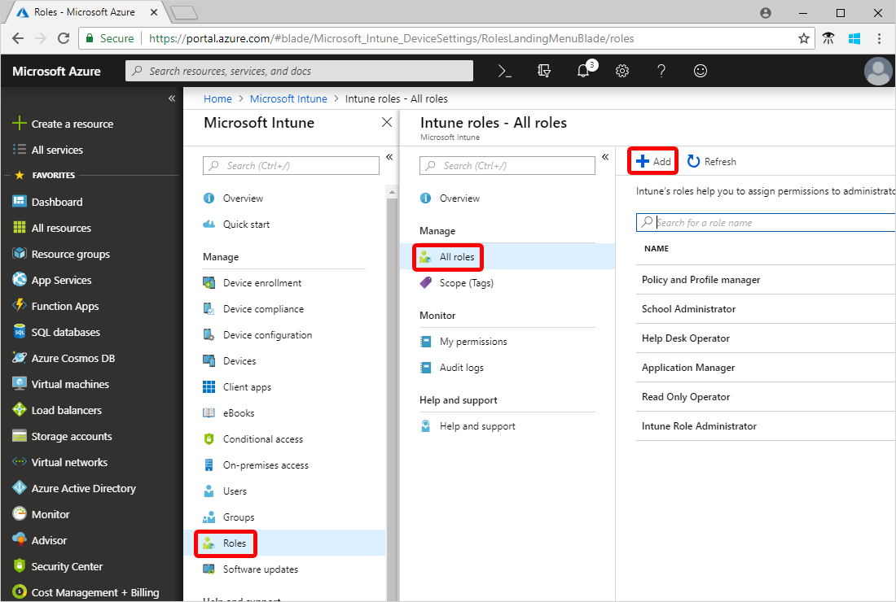
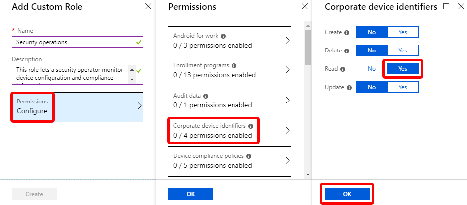

---
# required metadata

title: Create and assign a custom role in Intune
description: Create and assign a custom role for a remote device manager.
services: microsoft-intune
author: Smritib17
ms.service: microsoft-intune
ms.subservice: fundamentals
ms.localizationpriority: high
ms.topic: conceptual
ms.date: 03/26/2019
ms.author: smbhardwaj
ms.assetid: 0b3ac749-4a61-4717-bf08-e0e6a15c3b0a
# optional metadata

#ROBOTS:
#audience:

ms.reviewer: pjain
ms.suite: ems
search.appverid: MET150
#ms.tgt_pltfrm:
ms.custom: intune
ms.collection:
- tier3
- M365-identity-device-management
---

# Step 10: Create and assign a custom role

In this Intune topic, you'll create a custom role with specific permissions for a security operations department. Then you'll assign the role to a group of such operators. There are several default roles that you can use right away. But by creating custom roles like this one, you have precise access control to all parts of your mobile device management system.

If you don't have an Intune subscription, [sign up for a free trial account](free-trial-sign-up.md).

## Prerequisites

- To complete this evaluation step, you must [create a group](quickstart-create-group.md).

## Sign in to Intune

Sign in to [Intune](https://aka.ms/intuneportal) as a Global Administrator or an Intune Service Administrator. If you have created an Intune Trial subscription, the account you created the subscription with is the Global administrator.

## Create a custom role

When you create a custom role, you can set permissions for a wide range of actions. For the security operations role, we'll set a few Read permissions so that the operator can review a device's configurations and policies.

1. In Intune, choose **Roles** > **All roles** > **Add**.

2. Under **Add custom role**, in the **Name** box, enter *Security operations*.
3. In the **Description** box, enter *This role lets a security operator monitor device configuration and compliance information.*
4. Choose **Configure** > **Corporate device identifiers** > **Yes** next to **Read** > **OK**.

5. Choose **Device compliance policies** > **Yes** next to **Read** > **OK**.
6. Choose **Device configurations** > **Yes** next to **Read** > **OK**.
7. Choose **Organization** > **Yes** next to **Read** > **OK**.
8. Choose **OK** > **Create**.

## Assign the role to a group

Before your security operator can use the new permissions, you must assign the role to a group that contains the security user.

1. In Intune, choose **Roles** > **All roles** > **Security operations**.
2. Under **Intune roles**, choose **Assignments** > **Assign**.
3. In the **Assignment name** box, enter *Sec ops*.
4. Choose **Member (Groups)** > **Add**.
5. Choose the **Contoso Testers** group.
6. Choose **Select** > **OK**.
7. Choose **Scope (Groups)** > **Select groups to include** > **Contoso Testers**.
8. Choose **Select** > **OK** > **OK**.

Now everyone in the group is a member of the *Security operations* role and can review the following information about a device: corporate device identifiers, device compliance policies, device configurations, and organization information.

## Clean up resources

If you don't want to use the new custom role any more, you can delete it. Choose **Roles** > **All roles** > choose the ellipses next to the role > **Delete**.

## Next steps

In this quickstart, you created a custom security operations role and assigned it to a group. For more information about roles in Intune, see [Role-based administration control (RBAC) with Microsoft Intune](role-based-access-control.md)

To continue to evaluate Microsoft Intune, go to the next step:

> [!div class="nextstepaction"]
> [Step 11: Create an email device profile for iOS/iPadOS](../configuration/quickstart-email-profile.md)
