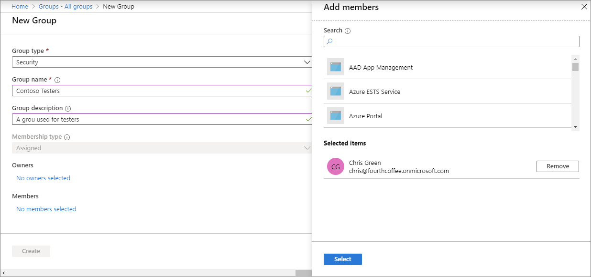

---
# required metadata

title: Create a group to manage users
titleSuffix: Microsoft Intune
description: In this topic, you will use Microsoft Intune to create a group based on existing users.
keywords:
author: Erikre
ms.author: erikre
manager: dougeby
ms.date: 01/30/2023
ms.topic: conceptual
ms.service: microsoft-intune
ms.subservice: fundamentals
ms.localizationpriority: high
ms.technology:
ms.assetid: 723f4b4e-3090-4811-84ff-6af652abea5a

# optional metadata

#ROBOTS:
#audience:

ms.reviewer: scottduf
ms.suite: ems
search.appverid: MET150
#ms.tgt_pltfrm:
ms.custom: intune-azure
ms.collection:
- tier2
- M365-identity-device-management
---

# Step 3: Create a group to manage users

In this topic, you will use Intune to create a group based on an existing user. Groups are used to manage your users and control your employees' access to your company resources. These resources can be part of your company's intranet or can be external resources, such as SharePoint sites, SaaS apps, or web apps.

[!INCLUDE [intune-evaluate](../includes/intune-evaluate.md)]

If you don't have an Intune subscription, [sign up for a free trial account](free-trial-sign-up.md).

>[!NOTE]
>Intune provides pre-created **All Users** and **All Devices** groups in the console with built-in optimizations for your convenience.

## Prerequisites

- Microsoft Intune subscription - [sign up for a free trial account](../fundamentals/free-trial-sign-up.md).
- To complete this step, you must [create a user](quickstart-create-user.md).

## Sign in to the Microsoft Intune admin center

Sign in to [Microsoft Intune admin center](https://go.microsoft.com/fwlink/?linkid=2109431) as a [Global administrator or an Intune Service administrator](users-add.md#types-of-administrators). If you have created an Intune Trial subscription, the account you created the subscription with is the Global administrator.

## Create a group

You will create a group that will be used later in this evaluation series. To create a group:

1. Once you've opened the [Microsoft Intune admin center](https://go.microsoft.com/fwlink/?linkid=2109431), select **Groups** > **New group**.
2. In the **Group type** dropdown box, select **Security**.
3. In the **Group name** field, enter the name for the new group (for example, **Contoso Testers**).
4. Add a **Group description** for the group.
5. Set the **Membership type** to **Assigned**. 
6. Under **Members**, select the link and add one or more members for the group from the list.

    

7. Click **Select** > **Create**.

Once you have successfully created the group, it will appear in the list of **All groups**. 

## Next steps

In this topic, you used Intune to create a group based on an existing user. For more information about adding groups to Intune, see [Add groups to organize users and devices](groups-add.md).

To continue to evaluate Microsoft Intune, go to the next step:

> [!div class="nextstepaction"]
> [Step 4 - Set up automatic enrollment for Windows 10/11 devices](../enrollment/quickstart-setup-auto-enrollment.md)
