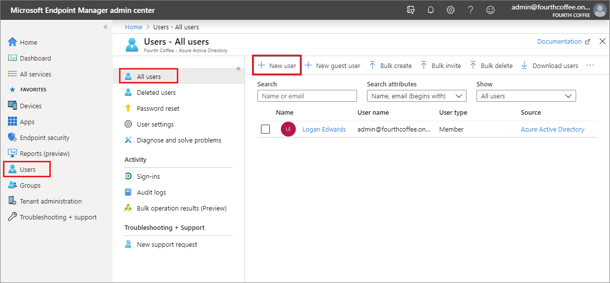
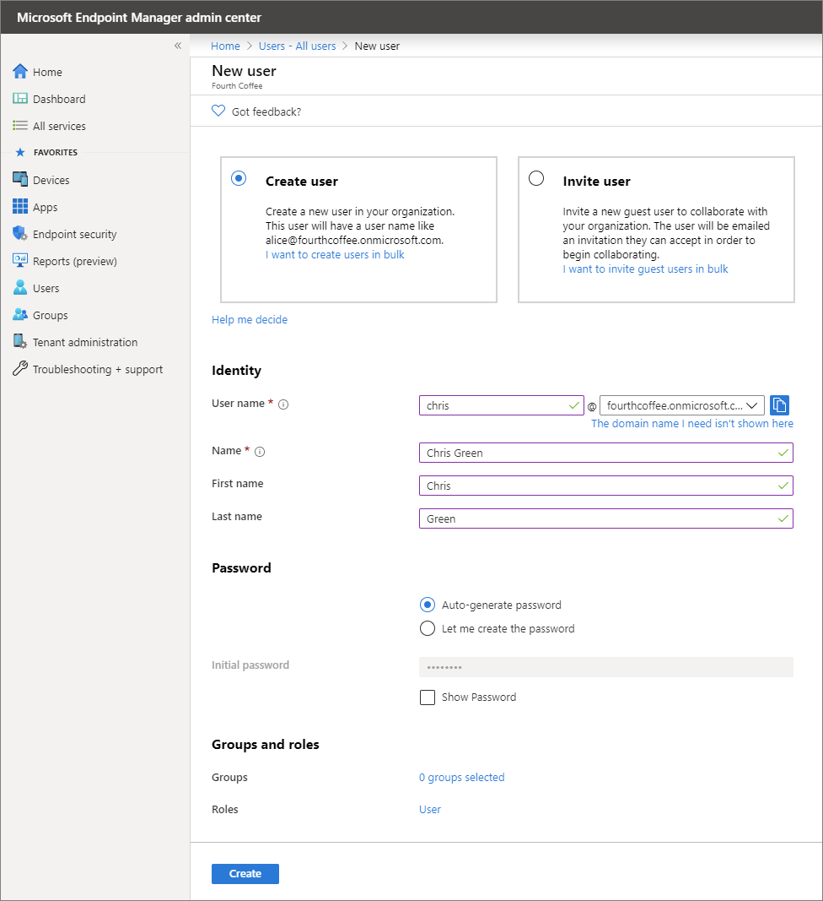
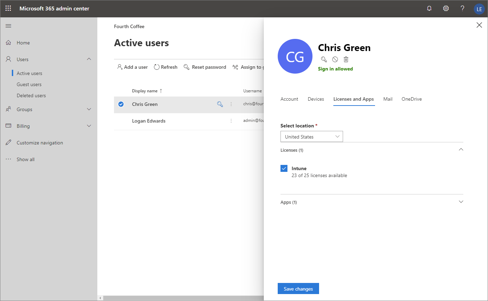
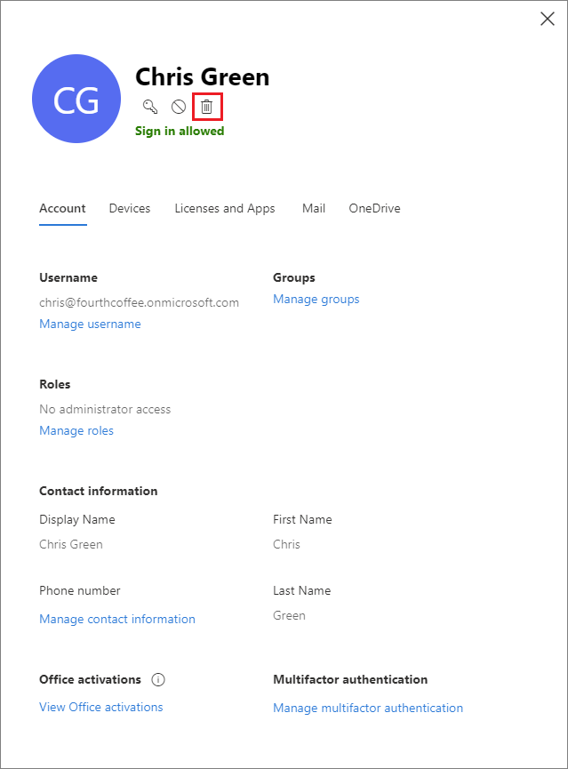

---
# required metadata

title: Create a user in Intune
description: Create a user in Intune.
services: microsoft-intune
author: Smritib17
ms.service: microsoft-intune
ms.subservice: fundamentals
ms.localizationpriority: high
ms.topic: conceptual
ms.date: 01/30/2023
ms.author: smbhardwaj
manager: dougeby
ms.assetid: 820fcb18-0927-4ebd-be79-dce92b51c261

# optional metadata

#ROBOTS:
#audience:

ms.reviewer: jlynn
ms.suite: ems
search.appverid: MET150
#ms.tgt_pltfrm:
ms.custom: intune
ms.collection:
- tier3
- M365-identity-device-management
---

# Step 2: Create a user in Intune and assign the user a license

In this topic, you'll create a user and then assign the user an Intune license. When you use Intune, each person you want to have access to company data must have their own user account. Intune admins can configure users later to manage access control.

## Prerequisites

- A Microsoft Intune subscription. [Sign up for a free trial account](../fundamentals/free-trial-sign-up.md).

## Sign in to the Microsoft Intune admin center

Sign in to [Microsoft Intune admin center](https://go.microsoft.com/fwlink/?linkid=2109431) as a [Global administrator or an Intune Service administrator](users-add.md#types-of-administrators). If you've created an Intune trial subscription, the account you created the subscription with is the Global administrator.

## Create a user

A user must have a user account to enroll in Intune device management. To create a new user:

1. In the Microsoft Intune admin center, select **Users** > **All users** > **New user**:
    
2. In the **Name** box, enter a name, such as *Dewey Kellum*:
    
3. In the **User name** box, enter a user identifier, such as Dewey@contoso.onmicrosoft.com.

    > [!NOTE]
    > If you haven't configured your customer domain name, use the verified domain name you used to create the Intune subscription (or [free trial](free-trial-sign-up.md#sign-up-for-a-microsoft-intune-free-trial)). 

4. Select **Show password** and be sure to remember the automatically generated password so that you can sign in to a test device.
5. Select **Create**.

## Assign a license to the user

After you've created a user, you must use the [Microsoft 365 admin center](https://go.microsoft.com/fwlink/p/?LinkId=698854) to assign an Intune license to the user. If you don't assign the user a license, they'll be unable to enroll their device into Intune.

To assign an Intune license to a user:

1. Sign in to the [Microsoft 365 admin center](https://go.microsoft.com/fwlink/p/?LinkId=698854) with the same credentials you used to sign in to Intune.
2. Select **Users** > **Active Users**, and then select the user you just created.
3. Select the **Licenses and Apps** tab.
4. Under **Select location**, select a location for the user, if it's not already set.
2. Select the **Intune** check box in the **Licenses** section. If another license includes Intune, you can select that license. The displayed [product name](/azure/active-directory/users-groups-roles/licensing-service-plan-reference) is used as the service plan in Azure management.

    

   > [!NOTE]
   > This setting uses one of your licenses for the user. If you're using a trial environment, you'll later reassign this license to a real user in a live environment.

6. Select **Save changes**.

The new active Intune user will now show that they're using an **Intune** license.

## Clean up resources

If you don't need this user anymore, you can delete the user by going to the [Microsoft 365 admin center](https://go.microsoft.com/fwlink/p/?LinkId=698854) and selecting **Users** > *the user* > *the delete user icon* > **Delete user** > **Close**.

   

## Next steps

In this topic, you created a user and assigned an Intune license to that user. For more information about adding users to Intune, see [Add users and grant administrative permission to Intune](users-add.md).

To continue to evaluate Microsoft Intune, go to the next step:

> [!div class="nextstepaction"]
> [Step 3 - Create a group to manage users](quickstart-create-group.md)