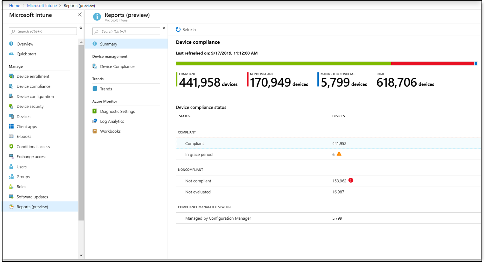

---
# required metadata

title: Microsoft Intune reports
titleSuffix: Microsoft Intune
description: Intune provides specific report types with focused views that contain consistent and timely data. 
keywords:
author: erikre
ms.author: erikre
manager: dougeby
ms.date: 12/19/2019
ms.topic: how-to
ms.service: microsoft-intune
ms.subservice: fundamentals
ms.localizationpriority: high
ms.assetid: 

# optional metadata

#ROBOTS:
#audience:

ms.suite: ems
#ms.tgt_pltfrm:
ms.custom: intune-azure
ms.collection: M365-identity-device-management
---
# Intune reports
Microsoft Intune reports allows you to more effectively and proactively monitor the health and activity of endpoints across your organization, and also provides other reporting data across Intune. For example, you will be able to see reports about device compliance, device health, and device trends. In addition, you can create custom reports to obtain more specific data. 

> [!NOTE]
> The Intune reporting changes will roll out gradually over a period of time to help you prepare and adapt to the new structure.

The report types are organized into the following focus areas:
- **Operational** - Provides timely, targeted data that helps you focus and take action. Admins, subject matter experts, and helpdesk will find these reports most helpful.
- **Organizational** - Provides a broader summary of an overall view, such as device management state. Managers and admins will find these reports most helpful.
- **Historical** - Provides patterns and trends over a period of time. Managers and admins will find these reports most helpful.
- **Specialist** - Allows you to use raw data to create your own custom reports. Admins will find these reports most helpful.

The reporting framework provides a consistent and more comprehensive reporting experience. The available reports provide the following functionality:
- **Search and sort** – You can search and sort across every column, no matter how large the dataset.
- **Data paging** – You can scan your data based on paging, either page-by-page or by jumping to a specific page.
- **Performance** - You can quickly generate and view reports created from large tenants.
- **Export** – You can quickly export reporting data generated from large tenants.

### Who can access the data?

Users with the following permissions can review logs:

- Global Administrator
- Intune Service Administrator
- Administrators assigned to an Intune role with **Read** permissions

## Non-compliant devices report (Operational)
The Non-compliant devices report surfaces data typically used by Helpdesk or admin roles to identify problems and help remediate issues. The data found in these reports is timely, calls out unexpected behavior, and is meant to be actionable. The report is available alongside the workload, making the non-compliant devices report accessible without browsing away from active workflows. This report provides filtering, searching, paging, and sorting capabilities. Also, you can drill down to help troubleshoot.

You can view the **Noncompliant devices** report using the following steps:

1. Sign in to the [Microsoft Endpoint Manager admin center](https://go.microsoft.com/fwlink/?linkid=2109431).
2. Select **Devices** > **Monitor** > **Noncompliant devices**.

    

    > [!TIP]
    > If you have previously used Intune in the Azure portal, you found the above details in the Azure portal by signing in to [Intune](https://go.microsoft.com/fwlink/?linkid=2090973) and selecting **Device compliance** > **Noncompliant devices**.

## Device compliance report (Organizational)

Device compliance reports are meant to be broad in nature and provide a more traditional reporting view of data to identify aggregated metrics. This report is designed to work with large datasets to get a full device compliance picture. For example, the device compliance report for device compliance shows all the compliance states for devices to give a broader view of the data, no matter how large the dataset. This report shows the full breakdown of records in addition to a convenient visualization of aggregated metrics. This report can be generated by applying filters on it and selecting the "Generate report" button. This will refresh the data to show the latest state with the ability to view the individual records that make up the aggregate data. Like most reports in the new framework, these records can be sorted and searched upon to focus on the information you need.

To see a generated report of device state, you can use the following steps:

1. Sign in to the [Microsoft Endpoint Manager admin center](https://go.microsoft.com/fwlink/?linkid=2109431).
2. Select **Reports** to view the reports summary.
3. Select **Device compliance**.
4. Select the **Compliance status**, **OS**, and **Ownership** filters to refine your report.
5. Click **Generate report** (or **Generate again**) to retrieve current data.

    

    > [!NOTE]
    > This **Device compliance** report provides a time stamp of when the report was last generated. 

For related information, see [Enforce compliance for Microsoft Defender ATP with Conditional Access in Intune](../protect/advanced-threat-protection.md).

## Reports summary 

The device compliance report is available as the summary report in the **Reports** workload. Use the following steps to view the device compliance report:

1. Sign in to the [Microsoft Endpoint Manager admin center](https://go.microsoft.com/fwlink/?linkid=2109431).
2. Select **Reports** to view the reports summary.

    

## Device compliance trend report (Historical)

Device compliance trend reports are more likely to be used by admins and architects to identify long term trends for device compliance. The aggregated data is displayed over a period of time, and is useful for making future investment decisions, driving process improvements, or prompting investigation into any anomalies. Filters can also be applied to see specific trends. The data provided by this report is a snapshot of the current tenant state (near real-time). 

A device compliance trend report for device compliance trends can show the trend of device compliance states over a period of time. You can identify where compliance peaks occurred and focus your time and effort accordingly.

You can view the **Trends** report using the following steps:

1. Sign in to the [Microsoft Endpoint Manager admin center](https://go.microsoft.com/fwlink/?linkid=2109431).
2. Select **Reports** > **Trends** to view device compliance over a 60 day trend.

    

## Azure Monitor integration reports (Specialist)
You can customize your own reports to get the data you want. The data in your reports will optionally be available via [Azure Monitor](https://docs.microsoft.com/azure/azure-monitor/overview) using [Log Analytics](reports.md#log-analytics) and [Azure Monitor workbooks](reports.md#workbooks). These solutions allow you to create custom queries, configure alerts, and make dashboards to show the device compliance data in the manner you want. Additionally, you can retain the activity logs in your Azure storage account, integrate with the reports using [security information and event management (SIEM) tools](https://docs.microsoft.com/microsoft-365/security/office-365-security/siem-server-integration), and correlate the reports to Azure AD activity logs. Azure Monitor workbooks can be used in addition to importing dashboards for custom reporting needs.

> [!NOTE]
> Complex reporting functionality require an Azure subscription.

An example specialist report would corelate device ownership data with platform enrollment data in a custom report. Then, this custom report could be displayed on an existing dashboard in the Azure Active Directory portal.

You can create and view custom reports using the following steps:

1. Sign in to the [Microsoft Endpoint Manager admin center](https://go.microsoft.com/fwlink/?linkid=2109431).
2. Select **Reports** > **Diagnostic settings** add a [diagnostic setting](reports.md#diagnostic-settings).

    

3. Click **Add diagnostic setting** to display the **Diagnostic settings** pane. 
4. Add a **Name** for the diagnostic settings. 
5. Select the **Send to Log Analytics** and **DeviceComplianceOrg** settings.

    

6. Click **Save**.
7. Next, select **Log analytics** to create and run a new log query using [Log Analytics](reports.md#log-analytics).

   

8. Select **Workbooks** to create or open an interactive report using [Azure Monitor workbooks](reports.md#workbooks).

   

### Diagnostic settings
Each Azure resource requires its own diagnostic setting. The diagnostic setting defines the following for a resource:

- Categories of logs and metric data sent to the destinations defined in the setting. The available categories will vary for different resource types.
- One or more destinations to send the logs. Current destinations include Log Analytics workspace, Event Hubs, and Azure Storage.
- Retention policy for data stored in Azure Storage.

A single diagnostic setting can define one of each of the destinations. If you want to send data to more than one of a particular destination type (for example, two different Log Analytics workspaces), then create multiple settings. Each resource can have up to 5 diagnostic settings.

For more information, about diagnostic settings, see [Create diagnostic setting to collect platform logs and metrics in Azure](https://docs.microsoft.com/azure/azure-monitor/platform/diagnostic-settings).

### Log Analytics
Log Analytics is the primary tool in the Azure portal for writing log queries and interactively analyzing the results of the queries. Even if a log query is used elsewhere in Azure Monitor, you'll typically write and test the query first using Log Analytics. For details about using Log Analytics and creating log queries, see [Overview of log queries in Azure Monitor](https://docs.microsoft.com/azure/azure-monitor/log-query/log-query-overview). 

### Workbooks
Workbooks combine text, Analytics queries, Azure Metrics, and parameters into rich interactive reports. Workbooks are editable by any other team members who have access to the same Azure resources. For more information about workbooks, see [Azure Monitor workbooks](https://docs.microsoft.com/azure/azure-monitor/app/usage-workbooks). Also, you can work with and contribute to workbook templates. For more information, see [Azure Monitor Workbook Templates](https://go.microsoft.com/fwlink/?linkid=867045).

## Next steps 

Learn more about the following technologies:
- [Blog - Microsoft Intune reporting framework](https://techcommunity.microsoft.com/t5/Intune-Customer-Success/New-Reporting-Framework-Coming-to-Intune/ba-p/1009553)
- [Azure Monitor](https://docs.microsoft.com/azure/active-directory/reports-monitoring/concept-activity-logs-azure-monitor)
- [What is Log Analytics?](https://docs.microsoft.com/azure/azure-monitor/log-query/log-query-overview#what-is-log-analytics)
- [Log queries](https://docs.microsoft.com/azure/azure-monitor/log-query/log-query-overview)
- [Get started with Log Analytics in Azure Monitor](https://docs.microsoft.com/azure/azure-monitor/log-query/get-started-portal)
- [Azure Monitor workbooks](https://docs.microsoft.com/azure/azure-monitor/app/usage-workbooks)
- [Security information and event management (SIEM) tools](https://docs.microsoft.com/microsoft-365/security/office-365-security/siem-server-integration)
