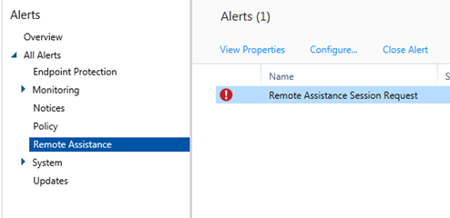

---
# required metadata

title: Request and provide remote assistance for Windows PCs 
titleSuffix: Microsoft Intune
description: Describes end-user and IT admin steps needed for remote assistance for Windows desktops that are being managed as PCs, and steps for remotely starting a PC.
keywords:
author: dougeby
ms.author: dougeby
manager: dougeby
ms.date: 01/01/2018
ms.topic: archived
ms.service: microsoft-intune
ms.subservice: fundamentals
ms.localizationpriority: medium
ms.technology:
ms.assetid: c2654491-5144-408a-a45a-644eb91ac1bb

# optional metadata

#audience:

ms.reviewer: owenyen
ms.suite: ems
search.appverid: MET150
#ms.tgt_pltfrm:
ms.custom: intune-classic-keep
ms.collection: M365-identity-device-management
---

# Request and provide remote assistance for Windows PCs

[!INCLUDE [classic-portal](../includes/classic-portal.md)]

The information in this topic applies only to Windows desktops that you are managing as PCs by using the Intune software client.

Intune can use the [TeamViewer](https://www.teamviewer.com) software, purchased separately, to enable you to give remote assistance to your users who are running the Intune software client. When a user requests help from the Microsoft Intune Center, you are informed by an alert, can accept the request, and then provide assistance. This functionality replaces the existing Windows Remote Assistance functionality in Intune.

## Before you start

Before you begin to establish and to respond to remote assistance requests, ensure that the following prerequisites are in place:

- You must have [signed up for a TeamViewer account](https://login.teamviewer.com/LogOn#register) to log in to the TeamViewer website.
- Windows PCs that you want to administer must be [managed by the Windows software client](../manage-windows-pcs-with-microsoft-intune.md)
- All Windows PC operating systems supported by Intune can be administered.

## Configure the TeamViewer Connector

1. In the [Microsoft Intune administration console](https://manage.microsoft.com), choose **Admin**.
2. In the **Admin** workspace, choose **TeamViewer**.
3. On the **TeamViewer** page, under **TeamViewer Connector**, choose **Enable**.
4. In the **Enable TeamViewer** dialog box, view, then **Accept** the license terms. If you don't already own a TeamViewer license, choose **Purchase a TeamViewer license**.
5. After the TeamViewer browser window opens, sign into the site with your TeamViewer credentials.
6. On the TeamViewer site, read, then accept the options to allow Intune to connect with TeamViewer.
7. In the Intune console, verify that the **TeamViewer Connector** item shows as **Enabled**.

## Open a remote assistance request (end user)

1. On a client Windows PC, open the **Microsoft Intune Center**.
2. Under **Remote Assistance**, choose **Request Remote Assistance**.
3. After you approve the request (see below), TeamViewer opens on the client. The user must accept any messages indicating that the web browser is trying to open the TeamViewer application.
4. The user sees a message asking if you can control their PC. They must accept this message to continue.
5. During the remote assistance session, the user sees a window that shows them you are connected. If they close this window, the remote session ends.

## Respond to a remote assistance request

1. When a user submits a remote assistance request, you can view it in the **Alerts** workspace, under **Monitoring** > **Remote Assistance**. For example:
   > 

 If a request goes unanswered for more than 4 hours, it is removed.
2. To accept the request, choose **Approve request and launch Remote Assistance**.
3. In the **A New Remote Assistance Request is Pending** dialog box, choose **Accept the remote assistance request**. If it's not already installed, TeamViewer will install any necessary apps on your PC.
4. TeamViewer then notifies the end user that you want to take control of their PC. After the user has accepted the request, the TeamViewer windows opens, and you can control the PC.

While in a remote assistance session, you can use all available TeamViewer commands to control the remote PC. For help with these commands, download the [Manual for remote control](http://www.teamviewer.com/en/support/documents/) from the TeamViewer website.

## Close the remote assistance session

From the **Actions** menu of the **TeamViewer** window, choose **End Session**.

## Remotely restart a Windows PC
When helping your users with issues, you might need to remotely restart their PC from time to time. Use the following steps to remotely restart a Windows PC.

1. In the [Microsoft Intune administration console](https://manage.microsoft.com/), choose **Groups** &gt; **All Devices** (or another group that contains the PC you want to restart).

2. Select one or more PCs, and then choose **Remote Tasks** &gt; **Restart Computer**.

3. To view the task status, choose **Remote Tasks** in the bottom right corner of the page.

4. In the **Task Status** dialog box, review the current remote tasks, task status, device name, and any reported errors.

## See also

[Common Windows PC management tasks with the Intune software client](common-windows-pc-management-tasks-with-the-microsoft-intune-computer-client.md)
