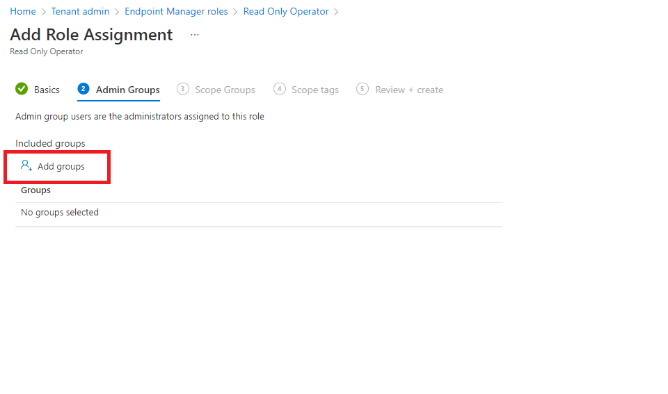

---
# required metadata

title: Use role-based access control (RBAC) and scope tags for distributed IT in Intune | Microsoft Docs
description: Use scope tags to filter configuration profiles to specific roles.
keywords:
author: Smritib17
ms.author: smbhardwaj
manager: dougeby
ms.date: 08/06/2019
ms.topic: how-to
ms.service: microsoft-intune
ms.subservice: fundamentals

# optional metadata

#ROBOTS:
#audience:

ms.reviewer: craigma
ms.suite: ems
search.appverid: MET150
#ms.tgt_pltfrm:
ms.custom: intune-azure
ms.collection: 
  - M365-identity-device-management
  - highpri
---

# Use role-based access control (RBAC) and scope tags for distributed IT

You can use role-based access control and scope tags to make sure that the right admins have the right access and visibility to the right Intune objects. Roles determine what access admins have to which objects. Scope tags determine which objects admins can see.

For example, let's say a Seattle regional office admin has the Policy and Profile Manager role. You want this admin to see and manage only the profiles and policies that only apply to Seattle devices. To set up this access, you would:

1. Create a scope tag called Seattle.
2. Create a role assignment for the Policy and Profile Manager role with: 
    - Members (Groups) = A security group named Seattle IT admins. All admins in this group will have  permission to manage policies and profiles for users/devices in the Scope (Groups).
    - Scope (Groups) = A security group named Seattle users. All users/devices in this group can have their profiles and policies managed by the admins in the Members (Groups). 
    - Scope (Tags) = Seattle. Admins in the Member (Groups) can see Intune objects that also have the Seattle scope tag.
3. Add the Seattle scope tag to policies and profiles that you want admins in Members (Groups) to have access to.
4. Add the Seattle scope tag to devices that you want visible to admins in the Members (Groups). 

## Default scope tag
The default scope tag is automatically added to all untagged objects that support scope tags.

The default scope tag feature is similar to the security scopes feature in Microsoft Endpoint Configuration Manager. 

## To create a scope tag

1. In the [Microsoft Endpoint Manager admin center](https://go.microsoft.com/fwlink/?linkid=2109431), choose **Tenant administration** > **Roles** > **Scope (Tags)** > **Create**.
2. On the **Basics** page, provide a **Name** and optional **Description**. Choose **Next**.
3. On the **Assignments** page, choose the groups containing the devices that you want to assign this scope tag. Choose **Next**.
4. On the **Review + create** page, choose **Create**.

## To assign a scope tag to a role

1. In the [Microsoft Endpoint Manager admin center](https://go.microsoft.com/fwlink/?linkid=2109431), choose **Tenant administration** > **Roles** > **All roles** > choose a role > **Assignments** > **Assign**.
2. On the **Basics** page, provide an **Assignment name** and **Description**. Choose **Next**.
3. On the **Admin Groups** page, choose **Add groups**, and select the groups that you want as part of this assignment. Users in these groups will have permissions to manage users/devices in the Scope (Groups). Choose **Next**.

    

4. On the **Scope Groups** page, select one of the following options for **Included groups**:
    - **Add groups**: Select the groups containing the users/devices that you want to manage. All users/devices in the selected groups will be managed by the users in the Admin Groups.
    - **Add All users**: All users can be managed by the users in the Admin Groups.
    - **Add All devices**: All devices can be managed by the users in the Admin Groups.

5. Choose **Next**
6. On the **Scope tags** page, select the tags that you want to add to this role. Users in the Admin Groups will have access to Intune objects that also have the same scope tag. You can assign a maximum of 100 scope tags to a role.
7. Choose **Next** to go to the **Review + create** page and then choose **Create**.

## Assign scope tags to other objects

For objects that support scope tags, scope tags usually appear under **Properties**. For example, to assign a scope tag to a configuration profile, follow these steps:

1. In the [Microsoft Endpoint Manager admin center](https://go.microsoft.com/fwlink/?linkid=2109431), choose **Devices** > **Configuration profiles** > choose a profile.

2. Choose **Properties** > **Scope (Tags)** > **Edit** > **Select scope tags** > choose the tags that you want to add to the profile. You can assign a maximum of 100 scope tags to an object.
4. Choose **Select** > **Review + save**.

## Scope tag details
When working with scope tags, remember these details: 

- You can assign scope tags to an Intune object type if the tenant can have multiple versions of that object (such as role assignments or apps).
  The following Intune objects are exceptions to this rule and don't currently support scope tags:
    - Corp Device Identifiers
    - Autopilot Devices
    - Device compliance locations
    - Jamf devices
- Volume Purchase Program (VPP) apps and ebooks associated with the VPP token inherit the scope tags assigned to the associated VPP token.
- When an admin creates an object in Intune, all scope tags assigned to that admin will be automatically assigned to the new object.
- Intune RBAC doesn't apply to Azure Active Directory roles. So, the Intune Service Admins and Global Admins roles have full admin access to Intune no matter what scope tags they have.
- If a role assignment has no scope tag, that IT admin can see all objects based on the IT admins permissions. Admins that have no scope tags essentially have all scope tags.
- You can only assign a scope tag that you have in your role assignments.
- You can only target groups that are listed in the Scope (Groups) of your role assignment.
- If you have a scope tag assigned to your role, you can't delete all scope tags on an Intune object. At least one scope tag is required.

## Next steps

Learn how scope tags behave when there are [multiple role assignments](role-based-access-control.md#multiple-role-assignments).
Manage your [roles](role-based-access-control.md) and [profiles](../configuration/device-profile-assign.md).

