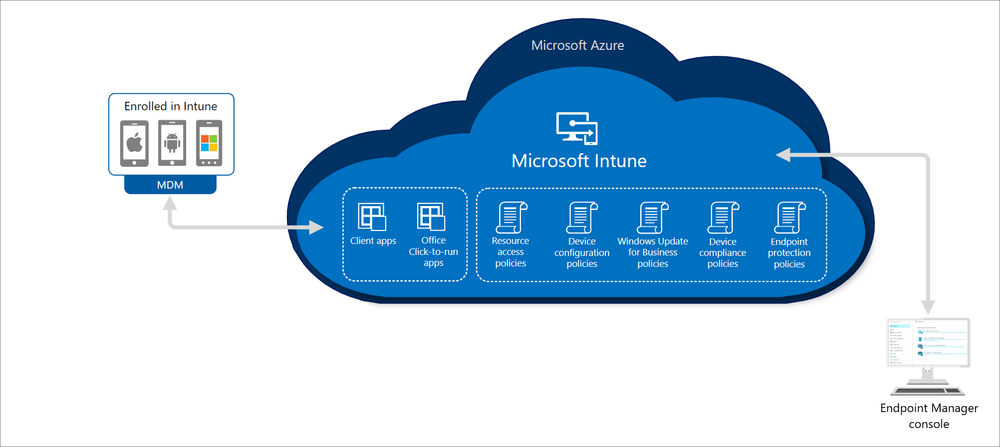

---
# required metadata

title: Try Microsoft Intune overview
titleSuffix: 
description: Evaluate Microsoft Intune by stepping through common Intune settings.
keywords:
author: Erikre
ms.author: erikre
manager: dougeby
ms.date: 02/01/2023
ms.topic: conceptual
ms.service: microsoft-intune
ms.subservice: fundamentals
ms.localizationpriority: high

# optional metadata

#ROBOTS:
#audience:

ms.reviewer:
ms.suite: ems
search.appverid: MET150
#ms.tgt_pltfrm:
ms.custom: intune-azure
ms.collection: 
  - M365-identity-device-management
  - highpri
---

# Evaluate Microsoft Intune

Microsoft Intune, which is a part of the Microsoft Intune family of products, provides the cloud infrastructure, the cloud-based mobile device management (MDM), cloud-based mobile application management (MAM), and cloud-based PC management for your organization. It lets you protect your organization by controlling features and settings on Android, Android Enterprise, iOS/iPadOS, macOS, and Windows 10/11 devices. It integrates closely with Azure Active Directory (Azure AD) for identity and access control and Azure Information Protection and advanced threat protection products for data protection. When you use it with Microsoft 365, you can enable your workforce to be productive on all their devices while keeping your organization's information protected. If you have on-premises infrastructure, such as Exchange or an Active Directory, you can use Intune connectors to help you connect to external services. Intune is included in Microsoft's [Enterprise Mobility + Security (EMS) suite](https://www.microsoft.com/microsoft-365/enterprise-mobility-security?azure-portal=true). 

In the following diagram, you can see how Intune interacts with other components in both your on-premises and cloud infrastructure:

## Prerequisites

The following list includes recommended (but not required) prerequisites:
- Available devices (iOS device, Android device, Windows device, macOS device)
- Familiarity with [Intune's supported operating systems](../fundamentals/supported-devices-browsers.md)
- Familiarity with [Network endpoints for Microsoft Intune](../fundamentals/intune-endpoints.md)
- An [app](../apps/apps-supported-intune-apps.md) that you would like to add to Intune

## Learning objectives

In this topic, you will set up a testing environment to evaluate Intune. Then, you will step through specific actions to better understand and evaluate Intune.
- Set up the Microsoft Intune free trial
- Create users and groups
- Set up device enrollment
- Create compliance policies
- Understand notifications
- Add and assign apps
- Create and assign app policies
- Create and assign customer roles
- Create a device profile

## Benefits of Microsoft Intune

Microsoft Intune helps you and your organization by increasing security and productivity, providing flexibility, and maximizing your management investment.

Microsoft Intune provides the following:
- Intelligent and unified endpoint security
- Flexible and unified endpoint management
- Data protection without device enrollment
- Greater end users productivity
- Co-management for cloud and on-premises devices

Learn how the Microsoft Intune family of products helps you maximize your return on investment. For more information see, [Benefits of Microsoft Intune](/training/modules/benefits-microsoft-endpoint-manager/).

## Next steps

Start by signing up for the [Intune free trial](../fundamentals/free-trial-sign-up.md). When you complete the sign up process, you'll have a new tenant and you'll understand the basics of working with Microsoft Intune.

## Learn more

For more information about Microsoft Intune, see the following resources:

- [Microsoft Intune fundamentals](/training/paths/endpoint-manager-fundamentals)
- [Modern management and security principles driving our Microsoft endpoint management vision](https://techcommunity.microsoft.com/t5/microsoft-endpoint-manager-blog/modern-management-and-security-principles-driving-our-microsoft/ba-p/946797?azure-portal=true)
