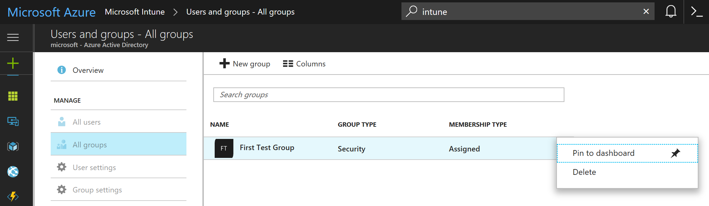

---
# required metadata

title: Tutorial - Walkthrough Intune in the Azure portal
titleSuffix: Microsoft Intune
description: In this tutorial, you will tour Microsoft Intune to better understand how to accomplish tasks.
keywords:
author: Erikre
ms.author: erikre
manager: dougeby
ms.date: 11/06/2019
ms.topic: tutorial
ms.service: microsoft-intune
ms.subservice: fundamentals
ms.localizationpriority: high
ms.technology:
ms.assetid: e892d8a3-7f74-498c-98d5-e968a8fbb049
Customer intent: As an Intune admin, I want to learn where to find the different features in Intune.

# optional metadata

#ROBOTS:
#audience:
#ms.devlang:
ms.reviewer:
ms.suite: ems
#ms.tgt_pltfrm:
ms.custom: intune-azure
ms.collection: M365-identity-device-management
---

# Tutorial: Walkthrough of Microsoft Intune in the Azure portal

[Azure](https://docs.microsoft.com/learn/modules/welcome-to-azure) contains over 100 services to assist you with a variety of cloud computing scenarios and possibilities. Microsoft Intune is one of several services available in Azure. Intune helps you ensure that your company's devices, apps, and data meet your company's security requirements. You have the control to set which requirements need to be checked and what happens when those requirements aren't met. The [Azure portal](https://portal.azure.com) is where you can find the Microsoft Intune service. Understanding the features available in Intune will help you accomplish various Mobile Device Management (MDM) and Mobile Application Management (MAM) tasks.

In this tutorial, you will:
> [!div class="checklist"]
> * Tour Microsoft Intune
> * Configure the Azure portal

If you don’t have an Intune subscription, [sign up for a free trial account](free-trial-sign-up.md).

## Prerequisites
Before setting up Microsoft Intune, review the following requirements:

- [Supported operating systems and browsers](../supported-devices-browsers.md) 
- [Network configuration requirements and bandwidth](../network-bandwidth-use.md)

## Sign up for a Microsoft Intune free trial

Trying out Intune is free for 30 days. If you already have a work or school account, **sign in** with that account and add Intune to your subscription. Otherwise, you can [sign up for a free trial account](free-trial-sign-up.md) to use Intune for your organization.

> [!IMPORTANT]
> You can't combine an existing work or school account after you sign up for a new account.

## Tour Microsoft Intune

Follow the steps below to better understand Intune in the Azure portal. Once you complete the tour, you'll have a better understanding of some of the major areas of Intune.

1. Open a browser and sign in to the [Intune portal](https://aka.ms/intuneportal). If you are new to Intune, use your free trial subscription.

    

    When you open Intune or any other service in Azure, the service is displayed in a pane. Some of the first workloads you may use in Intune include **Devices**, **Client apps**, **Users**, and **Groups**. A workload is simply a sub-area of a service. When you select the workload, it opens that pane as a full page. Other panes slide out from the right side of the pane when they open, and close to reveal the previous pane. A pane is also referred to as a blade. 

    By default, when you open Intune you'll see the **Overview** pane. This pane provides an overall visual snapshot of device assignment and compliance status, as well as app installation status.

2. From [Intune](https://aka.ms/intuneportal), select **Device enrollment** to display details about the enrolled devices in your Intune tenant. If you are starting with a new Intune tenant, you will not have any enrolled devices yet. 

    
    
    Intune lets you manage your workforce’s devices and apps, including how they access your company data. To use this mobile device management (MDM) service, the devices must first be enrolled in Intune. When a device is enrolled, it is issued an MDM certificate. This certificate is used to communicate with the Intune service. 

    There are several methods to enroll your workforce’s devices into Intune. Each method depends on the device's ownership (personal or corporate), device type (iOS/iPadOS, Windows, Android), and management requirements (resets, affinity, locking). However, before you can enable device enrollment, you must set up your Intune infrastructure. In particular, device enrollment requires that you [set your MDM authority](mdm-authority-set.md). For more information about getting your Intune environment (tenant) ready, see [Set up Intune](setup-steps.md). Once you have your Intune tenant ready, you can enroll devices. For more information about device enrollment, see [What is device enrollment?](../intune/enrollment/device-enrollment.md)

3. From [Intune](https://aka.ms/intuneportal), select **Device compliance** to display details about compliance for devices managed by Intune. You will see details similar to the following image.

    
    
    Compliance requirements are essentially rules, such as requiring a device PIN, or requiring device encryption. Device compliance policies define the rules and settings that a device must follow to be considered compliant. To use device compliance, you must have:
    - An Intune and an Azure Active Directory (Azure AD) Premium subscription
    - Devices running a supported platform
    - Devices must be enrolled in Intune
    - Devices that are enrolled to either one user or no primary user.
    
    For more information, see [Get started with device compliance policies in Intune](../intune/protect/device-compliance-get-started.md).

4. From [Intune](https://aka.ms/intuneportal), select **Device configuration** to display details about device profiles in Intune.

    
    
    Intune includes settings and features that you can enable or disable on different devices within your organization. These settings and features are added to "configuration profiles". You can create profiles for different devices and different platforms, including iOS/iPadOS, Android, and Windows. Then, you can use Intune to apply the profile to devices in your organization.   

    For more information about device configuration, see [Apply features settings on your devices using device profiles in Microsoft Intune](../intune/configuration/device-profiles.md).

5. From [Intune](https://aka.ms/intuneportal), select **Devices** to display details about your Intune tenant's enrolled devices. If you are starting with a new Intune enlistment, you will not have any enrolled devices yet.

    

    The **Devices** pane provides details about your tenant's enrolled devices. You can click **All devices** to display a list of devices for your Intune tenant.

6. From [Intune](https://aka.ms/intuneportal), select **Client apps** to display app installation status.

    

    As an IT admin, you can use Microsoft Intune to manage the client apps that your company's workforce uses. This functionality is in addition to managing devices and protecting data. One of an admin's priorities is to ensure that end users have access to the apps they need to do their work. Additionally, you might want to assign and manage apps on devices that are not enrolled with Intune. Intune offers a range of capabilities to help you get the apps you need on the devices you want. For more information about adding and assigning apps, see [Add apps to Microsoft Intune](../intune/apps/apps-add.md) and [Assign apps to groups with Microsoft Intune](../intune/apps/apps-deploy.md).

7. From [Intune](https://aka.ms/intuneportal), select **Conditional Access** to display details about access policies.

    

    Conditional Access refers to ways you can control the devices and apps that are allowed to connect to your email and company resources. To learn about device-based and app-based Conditional Access, and find common scenarios for using Conditional Access with Intune, see [What's Conditional Access?](../intune/protect/conditional-access.md)

8. From [Intune](https://aka.ms/intuneportal), select **Users** to display details about the users that you have included in Intune. These users are your company's workforce.

    

    You can add users directly to Intune or synchronize users from your on-premises Active Directory. Once added, users can enroll devices and access company resources. You can also give users additional permissions to access Intune. For more information, see [Add users and grant administrative permission to Intune](users-add.md).

9. From [Intune](https://aka.ms/intuneportal), select **Groups** to display details about the Azure Active Directory (Azure AD) groups included in Intune. As an Intune admin, you use groups to manage devices and users.

    

    You can set up groups to suit your organizational needs. Create groups to organize users or devices by geographic location, department, or hardware characteristics. Use groups to manage tasks at scale. For example, you can set policies for many users or deploy apps to a set of devices. For more information about groups, see [Add groups to organize users and devices](../groups-add.md).

10. From [Intune](https://aka.ms/intuneportal), select **Help and support** to request help. As an IT admin, you can use the **Help and Support** option to search and view solutions, as well as file an on-line support ticket for Intune. 

    

    To create a support ticket, your account must be assigned as an administrator role in Azure Active Directory. Administrator roles include, **Intune administrator**, **Global administrator**, and **Service administrator**. For more information, see [How to get support for Microsoft Intune](../get-support.md).

11. From [Intune](https://aka.ms/intuneportal), select **Tenant Status** to display details about your Intune tenant.

    

    Tenant status details include connector status, Intune service health, and Intune news. If there are any issues with your tenant or Intune itself, you will find details in the **Tenant Status** pane. For more information, see [Intune Tenant Status](../tenant-status.md).

12. From [Intune](https://aka.ms/intuneportal), select **Troubleshoot** to reach a shortcut on troubleshooting tips, requesting support, or checking the status of Intune. This information is specific the Intune user you select.

    

For more information about troubleshooting within Intune, see [Use the troubleshooting portal to help users at your company](../help-desk-operators.md).

## Configure the Azure portal

Azure allows you to customize and configure the view of the portal.

### Change the sidebar

The **sidebar** on the left side of the Azure portal shows you a list of all available Azure services. This comprehensive list can be changed from the default view so that you can keep a persistent view of the services that matter most to you. The information below uses Intune as the example of a service to add to the top of the list.

1. Select **All services** from the sidebar on the left side of the page.
2. Search for **Intune** in the filter box.
3. Select the **star** to add Intune to the bottom of the list of your favorite services.
4. Hover over the Intune service. Select and drag Intune using the **three vertical dots** on the right side of the service name.

### Change the dashboard

Your default landing page is the **dashboard**. This page is where you customize your tiles to show information that is most relevant to you.

To modify your current dashboard, select the **Edit dashboard** button. If you don't want to change your default dashboard, you can also create a **New dashboard**. Creating a new dashboard gives you an empty, private dashboard with the **Tile Gallery**, which lets you add or rearrange tiles. You can find tiles by their **General** category, **Type**, through **Search**, and through a **Resource group** or **Tag**.

You can also add tiles directly to your dashboard from any **ellipsis** button and selecting **Pin to dashboard**.

This capability will be more relevant after you've added more content, like groups and users, to Intune.

## Next steps

To get running quickly on Microsoft Intune, step through the Intune Quickstarts by first setting up a free Intune account.

> [!div class="nextstepaction"]
> [Quickstart: Try Microsoft Intune for free](free-trial-sign-up.md)
