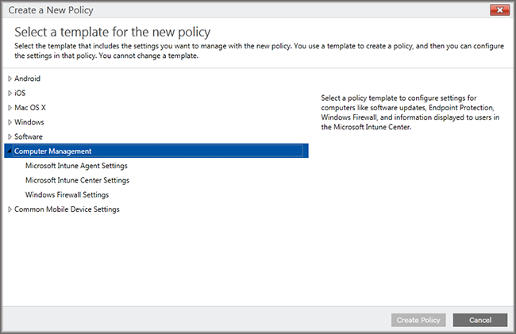

---
# required metadata

title: Use policies to simplify Windows PC management 
titleSuffix: Microsoft Intune
description: Describes the Windows PC management policies and the settings for the Microsoft Intune Center.
keywords:
author: dougeby
ms.author: dougeby
manager: dougeby
ms.date: 01/01/2018
ms.topic: archived
ms.service: microsoft-intune
ms.subservice: fundamentals
ms.localizationpriority: medium
ms.technology:
ms.assetid: f0afda7e-f4c3-4bcd-b4bf-4304103cf73e

# optional metadata

#audience:

ms.reviewer: owenyen
ms.suite: ems
search.appverid: MET150
#ms.tgt_pltfrm:
ms.custom: intune-classic-keep
ms.collection: M365-identity-device-management
---

# Use policies to simplify Windows PC management

[!INCLUDE [classic-portal](../includes/classic-portal.md)]

To manage Windows desktops as PCs, by running the Intune software client on them, you can use only the policies that are under **Computer Management** policies in the Intune admin console. All of the other policies listed in the admin console are for mobile devices only. Using the **Computer Management** policies, you can configure the settings in the Microsoft Intune Center, control updates to PCs, and configure Windows Firewall for PCs.

## Manage the Microsoft Intune Center
Users see the Intune software client as the **Microsoft Intune Center**. The Microsoft Intune Center lets users:

- Get applications from the company portal.

- Check for updates.

- Manage Microsoft Intune Endpoint Protection.

- Request remote assistance.

The Microsoft Intune Center is installed on all managed computers. You can configure the following settings in an Intune policy, and these are displayed to users in the Microsoft Intune Center:

|Policy setting|Details|
|------------------|--------------------|
|**Name**|The name of the administrator who manages the computer. Maximum length: 40 characters|
|**Phone number**|The telephone number of the administrator who manages the computer. Maximum length: 20 characters|
|**Email address**|The email address of the administrator who manages the computer. Maximum length: 40 characters|
|**Web site name**|The name of your support website for users. >Maximum length: 40 characters|
|**Web site URL**|The URL of your support website. Maximum length: 150 characters|
|**Notes**|A note that is displayed to users. Maximum length: 120 characters|

See the following resources for information about policies and settings that you can configure for Windows PCs:

- [Keep Windows PCs up-to-date with software updates in Microsoft Intune](keep-windows-pcs-up-to-date-with-software-updates-in-microsoft-intune.md) - These policies make managed computers check for, and download software updates from, Microsoft and from third parties. These updates do not include OS upgrades (e.g., upgrading from Windows 7 to Windows 10, or upgrades from one Windows 10 version to a later version).

- [Help secure Windows PCs with Endpoint Protection for Microsoft Intune](help-secure-windows-pcs-with-endpoint-protection-for-microsoft-intune.md) - These settings include scan schedules and actions to take when malware is detected.

- [Help protect Windows PCs using Windows Firewall policies in Microsoft Intune](help-protect-windows-pcs-using-windows-firewall-policies-in-microsoft-intune.md) - These policies simplify the administration of Windows Firewall settings on managed computers.

## See also

[Common Windows PC management tasks with the Intune software client](common-windows-pc-management-tasks-with-the-microsoft-intune-computer-client.md)
