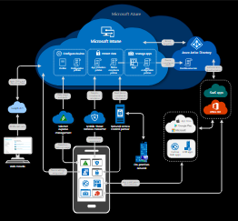
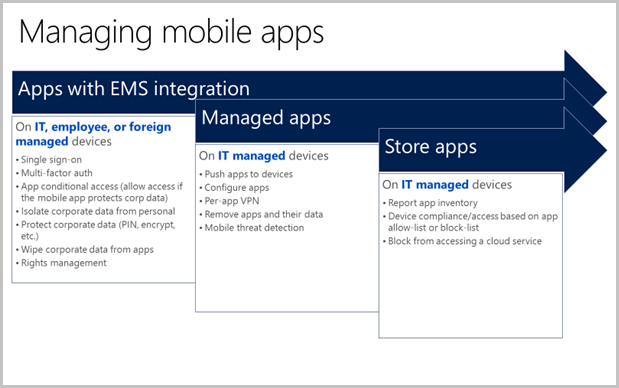

---
# required metadata

title: What is Microsoft Intune
description: Learn how Microsoft Intune is the mobile device management (MDM) and mobile app management (MAM) component of the Enterprise Mobility + Security solution and how it helps you protect company data.
keywords: what is Intune
author: dougeby
ms.author: dougeby
manager: dougeby
ms.date: 06/23/2020
ms.topic: overview
ms.service: microsoft-intune
ms.subservice: fundamentals
ms.localizationpriority: high
ms.custom: 
  - intro-overview
  - get-started
# optional metadata

#ROBOTS:
#audience:

ms.reviewer: pmay
ms.suite: ems
search.appverid: MET150
#ms.tgt_pltfrm:
ms.collection: 
  - M365-identity-device-management
  - highpri
  - highseo
---

# Microsoft Intune is an MDM and MAM provider for your devices

Microsoft Intune is a cloud-based service that focuses on mobile device management (MDM) and mobile application management (MAM). You control how your organization’s devices are used, including mobile phones, tablets, and laptops. You can also configure specific policies to control applications. For example, you can prevent emails from being sent to people outside your organization. Intune also allows people in your organization to use their personal devices for school or work. On personal devices, Intune helps make sure your organization's data stays protected and can isolate organization data from personal data.

Intune is part of Microsoft's [Enterprise Mobility + Security (EMS) suite](https://www.microsoft.com/microsoft-365/enterprise-mobility-security). Intune integrates with Azure Active Directory (Azure AD) to control who has access and what they can access. It also integrates with Azure Information Protection for data protection. It can be used with the Microsoft 365 suite of products. For example, you can deploy Microsoft Teams, OneNote, and other Microsoft 365 apps to devices. This feature enables people in your organization to be productive on all of their devices while keeping your organization’s information protected with the policies you create.

With Intune, you can:

- Choose to be 100% cloud with Intune, or be [co-managed](/configmgr/comanage/overview) with Configuration Manager and Intune.
- Set rules and configure settings on personal and organization-owned devices to access data and networks.
- Deploy and authenticate apps on devices -- on-premises and mobile.
- Protect your company information by controlling the way users access and share information.
- Be sure devices and apps are compliant with your security requirements.

## Manage devices

In Intune, you manage devices using an approach that's right for you. For organization-owned devices, you may want full control over the devices, including settings, features, and security. In this approach, devices and users of these devices "enroll" in Intune. Once enrolled, they receive your rules and settings through policies configured in Intune. For example, you can set password and PIN requirements, create a VPN connection, set up threat protection, and more.

For personal devices, or bring-your-own devices (BYOD), users may not want their organization administrators to have full control. In this approach, give users options. For example, users [enroll](../enrollment/device-enrollment.md) their devices if they want full access to your organization's resources. Or, if these users only want access to email or Microsoft Teams, then use app protection policies that require multi-factor authentication (MFA) to use these apps.

When devices are enrolled and managed in Intune, administrators can:

- See the devices enrolled and get an inventory of devices accessing organization resources.
- Configure devices, so they meet your security and health standards. For example, you probably want to block jailbroken devices.
- Push certificates to devices so users can easily access your Wi-Fi network or use a VPN to connect to your network.
- See reports on users and devices compliance.
- Remove organization data if a device is lost, stolen, or not used anymore.

**Online resources**:

- [What is device enrollment?](../enrollment/device-enrollment.md)

- [Apply features and settings on your devices using device profiles](../configuration/device-profiles.md)

- [Protect devices with Microsoft Intune](../protect/device-protect.md)

### Try the interactive guide
The [Manage devices with Microsoft Endpoint Manager](https://mslearn.cloudguides.com/guides/Manage%20devices%20with%20Microsoft%20Endpoint%20Manager) interactive guide steps you through the Microsoft Endpoint Manager admin center to show you how to manage and protect mobile and desktop applications.  

<iframe allowfullscreen width="95%" height="450" src="https://mslearn.cloudguides.com/guides/Manage%20devices%20with%20Microsoft%20Endpoint%20Manager" frameborder="0" scrolling="no" loading="lazy"/></iframe>

## Manage apps

Mobile application management (MAM) in Intune is designed to protect organization data at the application level, including custom apps and store apps. App management can be used on organization-owned devices and personal devices.

When apps are managed in Intune, administrators can:

- Add and assign mobile apps to user groups and devices, including users in specific groups, devices in specific groups, and more.
- Configure apps to start or run with specific settings enabled and update existing apps already on the device.
- See reports on which apps are used and track their usage.
- Do a selective wipe by removing only organization data from apps.

One way that Intune provides mobile app security is through **[app protection policies](../apps/app-protection-policy.md)**. App protection policies:

- Use Azure AD identity to isolate organization data from personal data. So personal information is isolated from organizational IT awareness. Data accessed using organization credentials are given additional security protection.
- Help secure access on personal devices by restricting actions users can take, such as copy-and-paste, save, and view.
- Can be created and deployed on devices that are enrolled in Intune, enrolled in another MDM service, or not enrolled in any MDM service. On enrolled devices, app protection policies can add an extra layer of protection.

For example, a user signs in to a device with their organization credentials. Their organization identity allows access to data that's denied to their personal identity. As that organization data is used, app protection policies control how the data is saved and shared. When users sign in with their personal identity, those same protections aren't applied. In this way, IT has control of organization data, while end users maintain control and privacy over their personal data.

You can also use Intune with the other services in EMS. This feature provides your organization's mobile app security beyond what's included with the operating system and any apps. Apps managed with EMS have access to a broader set of mobile app and data protection features.

## Compliance and conditional access

Intune integrates with Azure AD to enable a broad set of access control scenarios. For example, require mobile devices be compliant with organization standards defined in Intune before accessing network resources, such as email or SharePoint. Likewise, you can lock down services, so they're only available to a specific set of mobile apps. For example, you can lock down Exchange Online, so it's only accessed by Outlook or Outlook Mobile.

**Online resources**:

- [Set rules on devices to allow access to your organization resources](../protect/device-compliance-get-started.md)

- [Common ways to use Conditional Access with Intune](../protect/conditional-access-intune-common-ways-use.md)

## How to get Intune

There are many ways to get Intune. For more information, see [Licenses available for Microsoft Intune](licenses.md).

Intune is used in many sectors, including [government](/enterprise-mobility-security/solutions/ems-govt-service-description), [education](https://www.microsoft.com/education/intune), [kiosk or dedicated device](../configuration/kiosk-settings.md) for manufacturing and retail, and more.

## Next steps

- Read some of the [common business problems that Intune helps solve](common-scenarios.md).
- Start with a [30-day trial of Intune](free-trial-sign-up.md).
- Plan your [migration to Intune](migration-guide.md).
- Using your free trial or subscription, step through the [Quickstart: Create an email device profile for iOS](../configuration/quickstart-email-profile.md).
