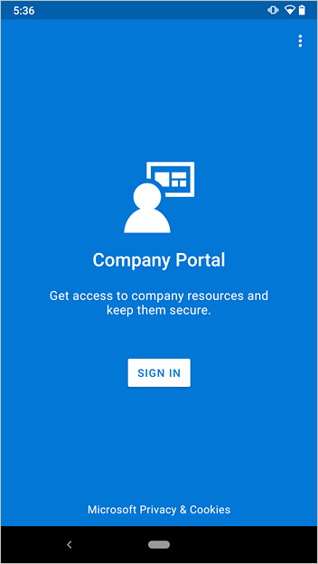
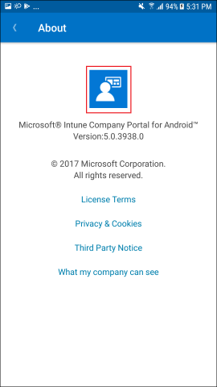
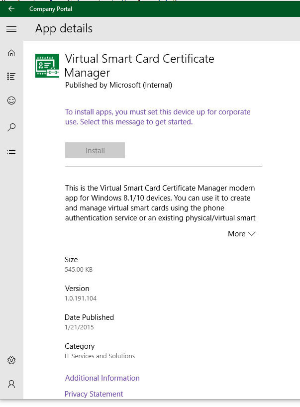

---
# required metadata

title: UI updates for Intune end-user apps
titleSuffix: Microsoft Intune
description: Find out what has changed in UI for apps that work on end-user devices with Microsoft Intune.
keywords:
author: lenewsad
ms.author: lanewsad
manager: dougeby
ms.date: 02/20/2025 
ms.topic: conceptual
ms.service: microsoft-intune
ms.subservice: fundamentals
ms.localizationpriority: high
ms.assetid: b782e382-8deb-48a7-a437-d7c5a17163f1

# optional metadata

#ROBOTS:
#audience:

ms.reviewer: esalter
ms.suite: ems
search.appverid: MET150
#ms.tgt_pltfrm:
ms.custom: intune-azure
ms.collection:
- tier2
- M365-identity-device-management
---
# UI updates for Intune end-user apps  

Learn about the most recent updates to the Microsoft Intune apps. We regularly add to and improve the Intune Company Portal app and website. If you're an Intune administrator or support person, this article provides the information you need to:

* Alert students and employees to app and enrollment changes.
* Update your organization's documentation or helpdesk procedures.  

If you're an employee or student, be sure to check out the screenshots and links to the Company Portal help documentation. For more information about how to use the Company Portal app, see the [Company Portal user help documentation](../user-help/use-managed-devices-to-get-work-done.md).  

## Week of August 1, 2022

### Company Portal for Windows bulk app install<!-- 6401437 -->
The Company Portal for Windows now allows users to select multiple apps and install in bulk. We recommend that users use the multi-app installation option for better performance when installing more than one app. From the **Apps** tab of the Company Portal for Windows, select the multi-select view button on the top right corner of the page. Then, select the checkbox next to each app that you need to install. Next, select the **Install Selected** button to start installation. All selected apps will install at the same time without requiring users to right-click each app or navigate to each app's page. For related information, see [Install and share apps on your device](../user-help/install-apps-cpapp-windows.md) and [How to configure the Intune Company Portal apps, Company Portal website, and Intune app](../apps/company-portal-app.md).

## Week of June 6, 2022  

### UI improvements show Android enrollment is available, not required<!-- 8764312 -->

We updated the iconography in the Company Portal for Android app to make it easier for users to recognize when device enrollment is available but not required. The new iconography appears in scenarios where the device enrollment availability is set to **Available, no prompts** in the Microsoft Intune admin center (**Tenant admin** > **Customization** > **Create** or **Edit** a policy > **Settings**).      

Changes include:

 - On the Devices screen, users will no longer see a red exclamation point next to non-enrolled devices.  
 - On the Device Details screen, users will no longer see a red exclamation point next to the enrollment message. Instead, they will see the info **(i)** icon.  

   
|Updated Devices screen|Previous Devices screen|   
|---|---|   
| ||  

 
|Updated Device Details screen|Previous Device Details screen|   
|---|---|   
| ||  

## Week of November 15, 2021  

### New privacy consent screen during Company Portal installation <!-- 6600502 wn -->  

We've added a new privacy consent screen to Company Portal to meet privacy requirements for certain app stores, such as those in China. People installing Company Portal for the first time from those stores will see the new screen during installation. The screen explains what information Microsoft collects and how it's used. A person must agree to the terms before they can use the app. Users who installed Company Portal prior to this release will not see the new screen.  

 > [!div class="mx-imgBorder"]
 >   

## Week of November 9, 2020  

### Improvements to work profile messaging in Company Portal for Android<!--8378333 -->  

We've updated messaging in Company Portal for Android to better introduce and explain how work profile works. After the work profile setup flow, users see a new informational screen explaining where to find work apps, with links to help documentation.   

 > [!div class="mx-imgBorder"]
 >   

When a user accidentally re-enables the Company Portal app in the personal profile, they'll see a screen (formerly **Your device now has a profile just for work**) that guides them to their work apps, with links to help documentation.   

|Updated|Previous|   
|---|---|   
| ||  

When they swipe right, they'll learn how to get more work apps from the Google Play Store.  `

 > [!div class="mx-imgBorder"]
 >   

Finally, on the **Help** page > **Frequently Asked Questions** section, there's a new link to a Microsoft technical article about how to find work profile apps.

 > [!div class="mx-imgBorder"]
 >   

## Week of September 28, 2020  

### Improved work profile messaging in Company Portal for Android  
The Company Portal screen previously titled "You're Halfway There!" has been updated to better explain how work profile management works. Users will see this screen if they re-enable Company Portal in the personal profile after they've already gone through work profile enrollment. They may also see this screen during work profile enrollment on some Android OS versions, as shown in the help doc, [Enroll with Android work profile](../user-help/enroll-device-android-work-profile.md).  

|Updated|Previous|   
|---|---|   
||| 

## Week of August 10, 2020

### Improvement to Update device settings page in Company Portal app for Android to shows descriptions<!-- 7414768 -->

In the Company Portal app on Android devices, the **Update device settings** page lists the settings that need updated to be compliant. Users expand the issue to see more information, and see the **Resolve** button.

This user experience is improved. The listed settings are expanded by default to show the description, and show the **Resolve** button, when applicable. Previously, the issues were collapsed by default. This new default behavior reduces the number of clicks, so users can resolve issues more quickly.

## Week of June 8, 2020

### Updates to informational screen in Company Portal for iOS/iPadOS <!-- 7032452 -->
We've updated an informational screen in Company Portal for iOS/iPadOS to better explain what an admin can see and do on devices. These clarifications are only about corporate-owned devices. Only the text has been updated, no actual modifications have been made to what the admin can see or do on user devices. To learn more about what's visible to an admin, see [What information can my organization see when I enroll my device?](../user-help/what-info-can-your-company-see-when-you-enroll-your-device-in-intune.md)  

## Week of May 18, 2020  
### Update to icons in Company Portal app for iOS/iPadOS and macOS <!--6057697 -->  
We've updated the icons in Company Portal to create a more modern look and feel that's supported on dual screen devices and aligns with the Microsoft Fluent Design System.

|Updated for iOS/iPadOS|Previously for iOS/iPadOS|   
|---|---|   
||| 

|Updated for macOS|  
|---|
||  

## Week of May 4, 2020
### Company Portal for Android guides users to get apps after work profile enrollment <!-- 6103999 -->
We've improved the in-app guidance in Company Portal to make it easier for users to find and install apps. After they enroll in work profile management, users will get a message explaining how to find suggested apps in the badged version of Google Play. The last step in [Enroll device with Android profile](../user-help/enroll-device-android-work-profile.md) has been updated to show the new message. 

  

Users will also see a new **Get Apps** link in the Company Portal drawer on the left. 

  

To make way for these new and improved experiences, the **APPS** tab shown in the following image has been removed.  

  

## Week of March 2, 2020   
### Improved sign-in experience in Company Portal for Android   
We've updated the layout of several sign-in screens in the Company Portal app for Android to make the experience more modern, simple, and clean for users. To see all Company Portal for Android enrollment instructions, go to [Enroll your Android device](../user-help/enroll-device-android-company-portal.md) or [Enroll with Android work profile](../user-help/enroll-device-android-work-profile.md).   

|Updated|Previous|   
|---|---|   
||| 
|||
## Week of February 3, 2020

### Screen removed from Company Portal, Android work profile enrollment <!--6103987 -->
The **What's next?** screen has been removed from the Android work profile enrollment flow in Company Portal to streamline the user experience. Go to [Enroll with Android work profile](../user-help/enroll-device-android-work-profile.md) to see the updated Android work profile enrollment flow.  

## Week of November 11, 2019  

### Web apps launched from the Windows Company Portal app <!-- 5030972 -->
End-users can now launch web apps directly from the Windows Company Portal app. End-users can select the web app and then choose the option **Open in browser**. The published web URL is opened directly in a web browser. This functionality will be rolled out over the next week. For more information about Web apps, see [Add web apps to Microsoft Intune](../apps/web-app.md).

  

### Improved macOS enrollment experience in Company Portal <!-- 5074349 WNready -->
The Company Portal for macOS enrollment experience has a simpler enrollment process that aligns more closely with the Company Portal for iOS enrollment experience. Device users now see:  

* A sleeker user interface.  
* An improved enrollment checklist.  
* Clearer instructions about how to enroll their devices.  
* Improved troubleshooting options.  

## Week of October 28, 2019  

### Improved checklist design in Company Portal app for Android <!-- 5550857 -->
The setup checklist in the Company Portal app for Android has been updated with a lightweight design and new icons. The changes align with the recent updates made to the Company Portal app for iOS/iPadOS. For a look at the updated enrollment steps, see [Enroll with Android work profile](../user-help/enroll-device-android-work-profile.md) and [Enroll your Android device](../user-help/enroll-device-android-company-portal.md).  

The following screens show the updated checklist for Android work profile enrollment:

|Updated|Previous|  
|---|---|  
|||   

The following screens show the updated checklist for Android device administrator enrollment:  

|Updated|Previous|  
|---|---|  
|||  

## Week of September 9, 2019

### Updates to Microsoft Intune app <!-- 4997846 -->
The Microsoft Intune app for Android has been updated with the following improvements:
- Updated and improved the layout to include bottom navigation for the most important actions.
- Added an additional page that shows the user's profile.
- Added the display of actionable notifications in the app for the user, such as the need to update their device settings.
- Added the display of custom push notifications, aligning the app with the support recently added in the Company Portal app for iOS and Android. For more information, see [Send custom notifications in Intune](../remote-actions/custom-notifications.md).

    User profile example: 
       

    Notifications and bottom navigation example: 
       

## Week of June 24, 2019  

The Company Portal website's new **Installed Apps** page lists all managed apps (both required and available) that are installed on a user's devices. In addition to assignment type, users can see the app's publisher, date published, and current installation status. If you haven't made any apps required or available to your users, they'll see a message explaining that no company apps have been installed. To see the new page on the web, go to the [Company Portal website](https://portal.manage.microsoft.com) and click **Installed Apps**.   

     

### New view lets app users see all managed apps installed on device <!-- 2352913 -->
The Company Portal app for Windows now lists all managed apps (both required and available) that are installed on a user's device. Users can also see attempted and pending app installations, and their current statuses. If you haven't made apps required or available to your users, they'll see a message explaining that no company apps have been installed. To see the new view, go to the Company Portal navigation pane and select **Apps** > **Installed Apps**.   

  

## Week of June 17, 2019  

### New features in Microsoft Intune app
We've added new features to the Microsoft Intune app (preview) for Android. Users on fully managed Android devices can now:  

* View and manage the devices they've enrolled through the Intune Company Portal or Microsoft Intune app.    
* Contact their organization for support.    
* Send their feedback to Microsoft.    
* View terms and conditions, if set by their organization. 

## Week of April 15, 2019  

### New end user app (Microsoft Intune app) <!--3903244 -->  
There's a new end-user app for Android fully managed devices called **Microsoft Intune**. This new app is light-weight and modern, and provides similar functionally as the Company Portal app, but for fully managed, corporate devices. For more information, see [Microsoft Intune app on Google Play](https://play.google.com/store/apps/details?id=com.microsoft.intune).  

Example screenshot of the device details screen: 

   

Example screenshot the **Setup access** screen:  

   

Example screenshot of the app menu:  

   

Example screenshot of the **Help** screen:  

   

## Week of April 1, 2019  

### Changes to Company Portal enrollment for iOS 12 device users <!--3448635 -->  
The Company Portal for iOS enrollment screens and steps have been updated to align with the MDM enrollment changes released in Apple iOS 12.2. The updated workflow prompts users to:  

* Allow Safari to open the Company Portal website and download the management profile before returning to the Company Portal app.  
* Open the Settings app to install the management profile on their device.  
* Return to the Company Portal app to complete enrollment.  

For updated enrollment steps and screens, see [Enroll iOS device in Intune](../user-help/enroll-your-device-in-intune-ios.md).  

### User experience update for the Company Portal app for iOS <!-- 2536024 -->
The home page of the Company Portal app for iOS devices has been redesigned. With this change, the home page will better follow iOS UI patterns, and also provide improved discoverability for apps and ebooks.  

## Week of February 19, 2019  
### New App categories screen in the Company Portal app for Windows 10<!-- 3834780 WNready4Review -->  
A new screen called **App categories** has been added to improve the app browsing and selection experience in Company Portal for Windows 10. Users will now see their apps sorted under categories such as **Featured**, **Education**, and **Productivity**. This change appears in Company Portal versions 10.3.3451.0 and later. For more information about installing apps in Company Portal, see [Install and share apps on your device](../user-help/install-apps-cpapp-windows.md).  

## Week of November 12, 2018

### Windows Company Portal keyboard shortcuts <!-- 2771518 -->
End users will now be able to trigger app and device actions in the Windows Company Portal [using keyboard shortcuts (accelerators)](../apps/company-portal-app.md#windows-company-portal-keyboard-shortcuts).

## Week of October 22, 2018

### Add custom brand image for Company Portal app <!-- 1916266 -->
As the Microsoft Intune admin, you can upload a custom brand image which will be displayed as a background image on the user's profile page in the iOS Company Portal app. For more information about configuring the Company Portal app, see [How to configure the Microsoft Intune Company Portal app](../apps/company-portal-app.md).  

## Week of August 27, 2018  

### New user experience update for the Company Portal website <!--2000968 -->  
We've added new features, based on feedback from customers, to the Company Portal website. You'll experience a significant improvement in existing functionality and usability from your devices. Specific areas of the site, such as device details, feedback and support, and device overview, now have a new, modern, responsive design. The [Intune Company Portal website documentation](../user-help/using-the-intune-company-portal-website.md) has been updated to reflect these changes.   

Updates you'll see include:  

- Streamlined workflows across all device platforms
- Improved device identification and enrollment flows
- More helpful error messages
- Friendlier language, less tech jargon
- Ability to share direct links to apps
- Improved performance for large app catalogs
- Increased accessibility for all users  

|Updated|Previous|
|---|---|
|||
|||  

## Week of July 16, 2018  

### More opportunities to sync in the Company portal app for Windows   
The Company Portal app for Windows now lets you initiate a sync directly from the Windows taskbar and Start menu. This feature is especially useful if your only task is to sync devices and get access to corporate resources. To access the new feature, right-click the Company portal icon pinned to your taskbar or **Start** menu. In the menu options (also referred to as a jump list), select **Sync this device**. The Company Portal will open to the **Settings** page and initiate your sync.  

  

### New browsing experiences in the Company portal app for Windows  

Now when browsing or searching for apps in the Company Portal app for Windows, you can toggle between the existing **Tiles** view and the new **Details** view. This new view lists application details such as name, publisher, publication date, and installation status.  

The **Apps** page's **Installed** view lets you see details about completed and in-progress app installations.  

Example screenshot showing the Tiles view:  
 
  

Example screenshot showing the Details view:  

## Week of April 23, 2018
### Updated navigation view in the Company Portal app for Windows 10 <!-- 1195010 -->
The Intune Company Portal app for Windows 10 has been updated with the [Fluent Design System's navigation view](/windows/uwp/design/basics/navigation-basics). Along the side of the app, you'll notice a static, vertical list of all top-level pages. Click any link to quickly view and switch between pages. This is the first of several updates you'll see as part of our ongoing effort to create a more adaptive, empathetic, and familiar experience in Intune. 

## Week of April 2, 2018

### User experience update for the Company Portal app for iOS <!-- 1412866 -->
We've released a major user experience update to the Company Portal app for iOS/iPadOS. The update features a complete visual redesign that includes a modernized look and feel. We've maintained the functionality of the app, but increased its usability and accessibility.  

You'll also see:
- Support for iPhone X.
- Faster app launch and loading responses, to save users time.
- Additional progress bars to provide users with the most up-to-date status information.
- Improvements to the way users upload logs, so if something goes wrong, it's easier to report.  

|Before|After|
|---|---|
|||
|*Combined with previous step*||
|||

### Improvements to the language in the Company Portal app for Windows <!-- 1683758 -->
We've improved the language in the Company Portal for Windows 10 to be more user-friendly and specific to your company.

|Before|After|
|---|---|
|||
||

## Week of March 12, 2018

### Company Portal for Android visual updates <!-- 976944 -->

We've updated the Company Portal app for Android to follow Android's [Material Design](https://material.io/) guidelines.

|Before|After|
|---|---|
|||
|||
|||
|||
|||
|||
|||

## Week of November 27, 2017

### New "Device Categories" step in guided setup for the Company Portal app for Windows 10 <!-- 1335292 -->

If you've enabled [device group mapping](../enrollment/device-group-mapping.md), the Company Portal app for Windows 10 now walks your users through selecting a device category after enrolling their device.

## Week of November 13, 2017

### Improvements to device setup workflow in the Company Portal for iOS in version 2.9.0 <!-- 1417174 -->

We've improved the device setup workflow in the Company Portal app for iOS/iPadOS. The language is more user-friendly and we've combined screens where possible. We have also made the language more specific to your company by using your company name throughout the setup text.

> [!NOTE]
> We use the company name you have set in the Azure Portal in **Microsoft Intune** > **Client Apps** > **Company Portal branding** > **Company name**. If you have not set this value, we will use the tenant name set in **Microsoft Entra ID** > **Properties** > **Name**. If you have not set a company name in Company Portal branding and don't want your tenant name to be displayed, we recommend that you set the company name in the Company Portal branding tab. If you don't want this string to show in the header in Company Portal, you can deselect the checkbox to "Show company name next to logo."

|Before|After|
|---|---|
|||
||*Combined with previous step*|
|||
|||
|||
|||
|||

## Week of November 6, 2017

### Updates to the Company Portal app for Windows 10 <!--1299474-->
The Settings page in the Company Portal app for Windows 10 has been updated to make the settings and intended user actions to be more consistent across all settings. It has also been updated to match the layout of other Windows apps.

|Before|After|
|---|---|
|||

### Search improvements to the Company Portal apps and website <!-- 1418189 -->
The Company Portal apps now use searches across app categories, names, and descriptions. The results are sorted in decreasing order of relevance. These updates are also available on the [Company Portal website](https://portal.manage.microsoft.com).

We're still fine-tuning the way relevance is tracked, so please let us know how it's working using the "Feedback" link at the bottom of the Company Portal website.

## Week of October 16, 2017

### Search improvements to the Company Portal website <!-- 1331697 -->
We're improving our app search capabilities, starting with the [Company Portal website](https://portal.manage.microsoft.com). Searches will now be performed on app categories in addition to the Name and Description fields. The results will be sorted, by default, in decreasing order of relevance. 

iOS users will also receive this change, as the Company Portal website is also used as part of the Company Portal app for iOS/iPadOS. The Company Portal apps for Android and Windows will receive similar updates in the coming months.

We're still fine-tuning the way relevance is tracked, so please let us know how it's working using the "Feedback" link at the bottom of the Company Portal website.

### iOS Company Portal displays large icons <!-- 1454593 -->
This release fixes a known issue with how the iOS Company Portal displays icons in the app tile. If you upload app icons of 120x120 pixels or larger, they now display in the [Company Portal website](https://portal.manage.microsoft.com) and the iOS Company Portal's apps pages at the full size of the app tile.

## Week of October 2, 2017

### Improvements to device setup workflow in Company Portal <!-- 1490692 -->
We've improved the device setup workflow in the Company Portal app for Android. The language is more user-friendly and specific to your company, and we've combined screens where possible. 

|Before|After|
|---|---|
|||
|| *Combined with previous step* |
|||
|||

Additional steps have been improved on Android work profile devices.

|Before|After|
|---|---|
|||
|| *Combined with previous step* |
|||
|||
|| *Combined with previous step* |

We've also updated the Conditional Access email activation screen.

|Before|After|
|---|---|
||

## Week of September 11, 2017

### Easier-to-understand phrasing for the Company Portal app for Android <!-- 1396349 -->  

The enrollment process for the Company Portal app for Android has been simplified with new text to make it easier for end-users to enroll. If you have custom enrollment documentation, you will want to update it to reflect the new screens. You can find sample images below:

|Before|After|
|---|---|
|||
|||
|||
|||
|||

## August 2017

### iOS 11 Mail app will support OAuth <!-- 1196951 -->

Conditional Access with Intune supports more secure authentication on iOS devices with OAuth. To support this, there will now be a different flow on the Company Portal app for iOS to allow for more secure authentication. When end users try to sign in to a new Exchange account in the Mail app, they will see a web view prompt. Upon enrollment in Intune, users will see a prompt to allow the native Mail app to access a certificate. Most end users will not see any more quarantined emails. Existing mail accounts will continue to use basic authentication protocol, so these users will still have quarantine emails delivered to them. This sign in experience for end users is similar to the one on Office mobile apps.

### Intune Mobile Application Management (MAM) dialog boxes will have a modern interface <!-- 1199015 -->

Intune Mobile Application Management (MAM) dialog boxes will be updated to a modern look and feel. The dialog boxes will function in the same way as the previous style.

**Previous experience**

**Modern experience**

### Updates to the "Device Details" page on the Company Portal app for Windows 10 <!-- 1287448 -->

The Company Portal app for Windows 10 is moving the __Category__ tag from below the title to a property on the __Device Details__ page.

## July 2017

### Apps details pages will display new information for Android devices <!--1287476-->

The apps details page of the Company Portal app for Android will now display the app categories that the IT admin has defined for that app.

### Improved sign in experience across Company Portal apps for all platforms <!--User Story 1132123-->

We are announcing a change that is coming in the next few months that will improve the sign-in experience for the Intune Company Portal apps for Android, iOS/iPadOS, and Windows. The new user experience will automatically appear across all platforms for the Company Portal app when Microsoft Entra ID makes this change. In addition, users can now sign in to the Company Portal from another device with a generated, single-use code. This is especially useful in cases when users need to sign in without credentials.  

Below you can see the previous sign-in experience, the new sign-in experience with credentials, and the new sign-in experience from another device.

__Previous sign in experience__

__New sign in experience__

__New sign in experience when signing in from another device__

Tap the __Sign-in from another device__ link.

Launch a browser and go to [https://aka.ms/devicelogin](https://aka.ms/devicelogin).

Enter the code you saw in the Company Portal app. When you select __Continue__, you will be able to authenticate in the using any method that is supported by your company, such as a smartcard.

The Company Portal app will begin signing in.

## June 2017

### Company Portal app for Android now has a new end-user experience for App Protection Policies
Based on customer feedback, we've modified the Company Portal app for Android to show an **Access Company Content** button. The intent is to prevent end users from unnecessarily going through the enrollment process when they only need to access apps that support App Protection Policies, a feature of Intune mobile application management.

The user will tap on the **Access Company Content** button instead of beginning to enroll the device.

The user then is taken to the Company Portal website to authorize the app for use on their device, where the Company Portal website verifies their credentials.

The device can still be enrolled into full management by tapping on the **action** menu.

### Improvements to app syncing with Windows 10 Creators Update <!--676505-->

The Company Portal app for Windows 10 will now automatically initiate a sync for app install requests for devices with Windows 10 Creators Update (version 1709). This will reduce the issue of app installs stalling during the "Pending Sync" state. In addition, users will be able to manually initiate a sync from within the app.

### New guided experience for Windows 10 Company Portal <!---1058938--->
The Company Portal app for Windows 10 will include a guided Intune walkthrough experience for devices that have not been identified or enrolled. The new experience provides step-by-step instructions that guide the user through registering into Microsoft Entra ID (required for Conditional Access features) and MDM enrollment (required for device management features). The guided experience will be accessible from the Company Portal home page. Users can continue to use the app if they do not complete registration and enrollment, but will experience limited functionality.

This update is only visible on devices running Windows 10 Anniversary Update (build 1607) or higher.

### New menu action to easily remove Company Portal <!--1164569-->
Based on user feedback, the Company Portal app for Android has added a new menu action to initiate the removal of Company Portal from your device. This action removes the device from Intune management so that the app can be removed from the device by the user.

### Improvements to the app tiles in the Company Portal app for iOS <!--1230777-->
We updated the design of the app tiles on the homepage to reflect the branding color you set for the Company Portal.

**Before**

**After**

### Account picker now available for the Company Portal app for iOS
If users have used their work or school account to sign in to other Microsoft apps on their iOS device, then they may see our new account picker when signing into the Company Portal for the first time.

## April 2017

### New icons for the Managed Browser and the Company Portal <!--918433, 918431-->

The Managed Browser is receiving updated icons for both the Android and iOS versions of the app. The new icon will contain the updated Intune badge to make it more consistent with other apps in Enterprise Mobility + Security (EM+S).

The Company Portal is also receiving updated icons for the Android, iOS, and Windows versions of the app to improve consistency with other apps in EM+S. These icons will be gradually released across platforms from April to late May.

### Sign in progress indicator in Android Company Portal <!--953374-->

An update to the Android Company Portal app shows a sign-in progress indicator when the user launches or resumes the app. The indicator progresses through new statuses, beginning with "Connecting...", then "Signing in...", then "Checking for security requirements..." before allowing the user to access the app.

### Improved app install status for the Windows 10 Company Portal app <!--676495-->
The Windows 10 Company Portal app now provides an install progress bar on the app details page. This is supported for modern apps on devices running the Windows 10 Anniversary Update and up.

__Before__
  

__After__
  

## February 2017

### New user experience for the Company Portal app for Android <!--621622, announced 1702-->
Beginning in March, the Company Portal app for Android will follow [material design guidelines](https://material.io/guidelines/material-design/introduction.html) to create a more modern look and feel. This improved user experience includes:

* __Colors__: tab headers can be colored according to your custom color palette.

* __Interface__: __Featured Apps__ and __All Apps__ buttons have been updated in the __Apps__ tab. The __Search__ button is now a floating action button.

* __Navigation__: All Apps shows a tabbed view of __Featured__, __All__ and __Categories__ for easier navigation. __Contact IT__ has been streamlined for improved readability.  

## January 2017

### Modernizing the Company Portal website <!--753980, announced 1701-->
Beginning in February, the Company Portal website will support apps that are targeted to users who do not have managed devices. The website will align with other Microsoft products and services by using a new contrasting color scheme, dynamic illustrations, and a "hamburger menu,"  which will contain helpdesk contact details and information on existing managed devices. The landing page will be rearranged to emphasize apps that are available to users, with carousels for Featured and Recently Updated apps.

## Coming soon in the UI
These are the plans for ways we will be improving the user experience by updating our user interface.

> [!Note]
> The images below may be previews, and the announced product may differ from the presented versions.  

## See also
* [Microsoft Intune Blog](https://techcommunity.microsoft.com/t5/microsoft-intune-blog/bg-p/MicrosoftEndpointManagerBlog)
* [Cloud Platform roadmap](https://www.microsoft.com/cloud-platform/roadmap)
* [What's new in Intune](whats-new.md)
