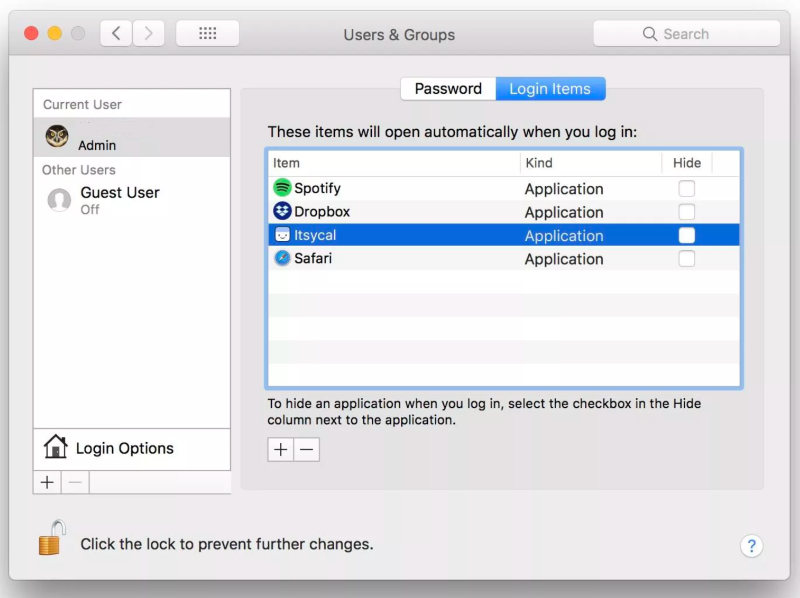
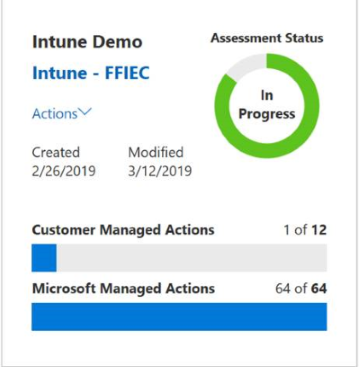
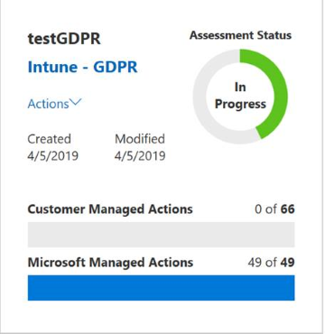

---
# required metadata
title: What's new in previous months in the Microsoft Intune
titleSuffix: 
description: Review older announcements from the Intune what's new page
keywords:
author: dougeby  
ms.author: dougeby
manager: dougeby
ms.date: 04/19/2023
ms.topic: conceptual
ms.service: microsoft-intune
ms.subservice: fundamentals
ms.localizationpriority: medium
ms.technology:
ms.assetid: 9ba01d60-4a03-4e3e-9aba-8be905c0054c

# optional metadata

ROBOTS: NOINDEX,NOFOLLOW
#audience:

ms.reviewer: lebacon
ms.suite: ems
search.appverid: MET150
#ms.tgt_pltfrm:
ms.custom: intune-azure
ms.collection:
- tier2
- M365-identity-device-management
---

# What's new in the Microsoft Intune - previous months

[!INCLUDE [azure_portal](../includes/azure_portal.md)]

<!-- ########################## -->

## Week of September 19, 2022 (Service release 2209)

### App management

#### New app types for Microsoft Intune<!-- 7210233 -->
As an admin, you can create and assign two new types of Intune apps:
- **iOS/iPadOS web clip** 
- **Windows web link**

These new app types work in a similar way to the existing **web link** application type, however they apply only for their specific platform, whereas web link applications apply across all platforms. With these new app types, you can assign to groups and also use assignment filters to limit the scope of assignment. This functionality is in the [Microsoft Intune admin center](https://go.microsoft.com/fwlink/?linkid=2109431) > **Apps** > **All Apps** > **Add**.

### Device management

#### Microsoft Intune is ending support for Windows 8.1<!-- 14740233 -->
Microsoft Intune is ending support on October 21, 2022 for devices running Windows 8.1. After that date, technical assistance and automatic updates that help protect your devices running Windows 8.1 will no longer be available. Additionally, because the sideloading scenario for line-of-business apps is only applicable to Windows 8.1 devices, Intune no longer supports Windows 8.1 sideloading. Sideloading is installing, and then running or testing an app that isn't certified by the Microsoft Store. In Windows 10/11, "sideloading" is simply setting a device config policy to include "Trusted app installation". For more information, see [Plan for Change: Ending support for Windows 8.1](../fundamentals/whats-new.md#plan-for-change-ending-support-for-windows-81-).

#### Group member count visible in assignments<!-- 13434676 -->
When assigning policies in the admin center, you can now see the number of users and devices in a group. Having both counts help you pinpoint the right group and understand the impact the assignment has before you apply it.

### Device configuration

#### New lock screen message when adding custom support information to Android Enterprise devices<!-- 13158348 -->
On Android Enterprise devices, you can create a device restrictions configuration profile that shows a custom support message on the devices (**Devices** > **Configuration profiles** > **Create profile** > **Android Enterprise** > **Fully managed, dedicated, and corporate-owned work profile** for platform > **Device restrictions** for profile type > **Custom support information**).

There's a new setting you can configure:
- **Lock screen message**: Add a message that's shown on the device lock screen. 

When you configure the **Lock screen message**, you can also use the following device tokens to show device-specific information:
- `{{AADDeviceId}}`: Azure AD device ID
- `{{AccountId}}`: Intune tenant ID or account ID
- `{{DeviceId}}`: Intune device ID
- `{{DeviceName}}`: Intune device name
- `{{domain}}`: Domain name
- `{{EASID}}`: Exchange Active Sync ID
- `{{IMEI}}`: IMEI of the device
- `{{mail}}`: Email address of the user
- `{{MEID}}`: MEID of the device
- `{{partialUPN}}`: UPN prefix before the `@` symbol
- `{{SerialNumber}}`: Device serial number
- `{{SerialNumberLast4Digits}}`: Last four digits of the device serial number
- `{{UserId}}`: Intune user ID
- `{{UserName}}`: User name
- `{{userPrincipalName}}`: UPN of the user

> [!NOTE]
> Variables aren't validated in the UI and are case sensitive. As a result, you may see profiles saved with incorrect input. For example, if you enter `{{DeviceID}}`, instead of `{{deviceid}}` or `{{DEVICEID}}`, then the literal string is shown instead of the device's unique ID. Be sure to enter the correct information. All lowercase or all uppercase variables are supported, but not a mix.

For more information on this setting, go to [Android Enterprise device settings to allow or restrict features using Intune](../configuration/device-restrictions-android-for-work.md#custom-support-information).

Applies to:
- Android 7.0 and newer
- Android Enterprise corporate owned fully managed
- Android Enterprise corporate owned dedicated devices
- Android Enterprise corporate owned work profile

#### Filter on the user scope or device scope in the settings catalog for Windows devices<!-- 13949975 -->
When you create a settings catalog policy, you can use **Add settings** > **Add filter** to filter settings based on the Windows OS edition (**Devices** > **Configuration profiles** > **Create profile** > **Windows 10 and later** for platform > **Settings catalog** for profile type).

When you **Add filter**, you can also filter on the settings by user scope or device scope.

For more information on the settings catalog, go to [Use the settings catalog to configure settings on Windows, iOS/iPadOS and macOS devices](../configuration/settings-catalog.md).

Applies to:
- Windows 10
- Windows 11

#### Android Open Source Project (AOSP) platform is generally available<!-- 15027949 -->
Microsoft Intune management of corporate-owned devices that run on the Android Open Source Project (AOSP) platform is now generally available (GA). This feature includes the full suite of capabilities that are available as part of the public preview.

Currently, Microsoft Intune only supports the new Android (AOSP) management option for RealWear devices.
- [Deployment guide: Manage Android devices in Microsoft Intune](deployment-guide-platform-android.md)
- [Deployment guide: Enroll Android devices in Microsoft Intune](deployment-guide-enrollment-android.md)

Applies to:
- Android Open Source Project (AOSP)

#### Device Firmware Configuration Interface (DFCI) now supports Acer devices<!-- 15240661 -->
For Windows 10/11 devices, you can create a DFCI profile to manage UEFI (BIOS) settings (**Devices** > **Configuration profiles** > **Create profile** > **Windows 10 and later** for platform > **Templates** > **Device Firmware Configuration Interface** for profile type).

New Acer devices running Windows 10/11 will be enabled for DFCI in later 2022. So, admins can create DFCI profiles to manage the BIOS and then deploy the profiles to these Acer devices.

Contact your device vendor or device manufacturer to ensure you get eligible devices.

For more information about DFCI profiles in Intune, go to [Use Device Firmware Configuration Interface (DFCI) profiles on Windows devices in Microsoft Intune](../configuration/device-firmware-configuration-interface-windows.md).

Applies to:
- Windows 10
- Windows 11

#### New settings available in the iOS/iPadOS and macOS settings catalog<!-- 15349701 -->
The [settings catalog](../configuration/settings-catalog.md) lists all the settings you can configure in a device policy, and all in one place. 

There are new settings available in the settings catalog. In the [Microsoft Intune admin center](https://go.microsoft.com/fwlink/?linkid=2109431), you can see these settings at **Devices** > **Configuration profiles** > **Create profile** > **iOS/iPadOS** or **macOS** for platform > **Settings catalog** for profile type.

New settings include:

**Accounts > LDAP**:

- LDAP Account Description
- LDAP Account Host Name
- LDAP Account Password
- LDAP Account Use SSL
- LDAP Account User Name
- LDAP Search Settings

Applies to:
- iOS/iPadOS
- macOS

The following settings are also in settings catalog. Previously, they were only available in Templates:

**Privacy > Privacy Preferences Policy Control**:

- Accessibility
- Address Book
- Apple Events
- Calendar
- Camera
- File Provider Presence
- Listen Event
- Media Library
- Microphone
- Photos
- Post Event
- Reminders
- Screen Capture
- Speech Recognition
- System Policy All Files
- System Policy Desktop Folder
- System Policy Documents Folder
- System Policy Downloads Folder
- System Policy Network Volumes
- System Policy Removable Volumes
- System Policy Sys Admin Files

Applies to:

- macOS

For more information about configuring settings catalog profiles in Intune, see [Create a policy using settings catalog](../configuration/settings-catalog.md).

### Device enrollment

#### Set up enrollment notifications (public preview)<!-- 9283605 -->
Enrollment notifications inform device users, via email or push notification, when a new device has been enrolled in Microsoft Intune. You can use enrollment notifications for security purposes to notify users and help them report devices enrolled in error, or for communicating to employees during the hiring or onboarding process. Enrollment notifications are available to try now in public preview for Windows, Apple, and Android devices. This feature is only supported with user-driven enrollment methods.

### Device security

#### Assign compliance policies to the All devices group<!-- 2213410 -->
The **All devices** option is now available for [compliance policy](../protect/create-compliance-policy.md) assignments. With this option, you can assign a compliance policy to all enrolled devices in your organization that match the policy's platform, without needing to create an Azure Active Directory group that contains all devices. 
 
When you include the *All devices* group you can then exclude individual groups of devices to further refine the assignment scope.

#### Trend Micro – New mobile threat defense partner<!-- 11017779 -->
You can now use [Trend Micro Mobile Security as a Service](../protect/trend-micro-mobile-threat-defense-connector.md) as an integrated mobile threat defense (MTD) partner with Intune. By configuring the Trend MTD connector in Intune, you can control mobile device access to corporate resources using conditional access that's based on risk assessment.
 
For more information, see:
- [Mobile threat defense integration with Intune](../protect/mobile-threat-defense.md)

<!-- - [Trend Micro Mobile Security documentation](https://docs.trendmicro.com/en-us/enterprise/trend-micro-vision-one/mobile-security/getting-started-with_003.aspx) -->

#### Grace period status visible on Intune Company Portal website<!-- 15025900 -->
The Intune Company Portal website now shows a grace period status to account for devices that don't meet compliance requirements but are still within their given grace period. Users are shown the date by which they need to become compliant and the instructions for how to become compliant. If they don't update their device by the given date, their status changes to noncompliant. For more information about setting grace periods, see [Configure compliance policies with actions for noncompliance](../protect/actions-for-noncompliance.md#available-actions-for-noncompliance).

### Intune apps

#### Newly available protected apps for Intune<!-- 15007580, 15235927 -->
The following protected apps are now available for Microsoft Intune:
- RingCentral for Intune by RingCentral, Inc.
- MangoApps, Work from Anywhere by MangoSpring, Inc.

For more information about protected apps, see [Microsoft Intune protected apps](../apps/apps-supported-intune-apps.md).

## Week of September 12, 2022

### Device management

#### Intune now requires iOS/iPadOS 14 and higher<!-- 14778947 -->
With Apple's release of iOS/iPadOS 16, Microsoft Intune and the Intune Company Portal will now require iOS/iPadOS 14 and higher. For related information, see [Supported operating systems and browsers in Intune](../fundamentals/supported-devices-browsers.md).

#### Intune now requires macOS 11.6 and higher<!-- 14766663 -->
With Apple's release of macOS 13 Ventura, Microsoft Intune, the Company Portal app, and the Intune MDM agent will now require macOS 11.6 (Big Sur) and later. For related information, see [Supported operating systems and browsers in Intune](../fundamentals/supported-devices-browsers.md).

## Week of September 05, 2022

### Device management

#### Remote Help version: 4.0.1.13 release<!-- 15329690 -->

With Remote Help 4.0.1.13 fixes were introduced to address an issue that prevented people from having multiple sessions open at the same time. The fixes also addressed an issue where the app was launching without focus, and prevented keyboard navigation and screen readers from working on launch.

For more information, go to [Use Remote Help with Intune and Microsoft Intune](/mem/intune/fundamentals/remote-help)

## Week of August 29, 2022

### App management

#### Updated Microsoft Intune App SDK for Android<!-- 15363982 -->
The developer guide for the Intune App SDK for Android has been updated. The updated guide provides the following stages:
- Planning the integration
- MSAL prerequisite
- Getting started with MAM
- MAM integration essentials
- Multi-Identity
- App configuration
- App participation features

For more information, see [Intune App SDK for Android](../developer/app-sdk-android-phase1.md).

## Week of August 22, 2022

### Device management

#### Use Intune role-based access control (RBAC) for tenant attached devices <!-- 14996522 -->

You can now use Intune role-based access control (RBAC) when interacting with tenant attached devices from the Microsoft Intune admin center. For example, when using Intune as the role-based access control authority, a user with Intune's [Help Desk Operator role](role-based-access-control.md#built-in-roles) doesn't need an assigned security role or additional permissions from Configuration Manager. For more information, see [Intune role-based access control for tenant attached clients](../../configmgr/cloud-attach/use-intune-rbac.md).

## Week of August 15, 2022 (Service release 2208)

### App management

#### Android strong biometric change detection<!-- 9740832 -->
The Android **Fingerprint instead of PIN for access** setting in Intune, which allows the end-user to use [fingerprint authentication](https://developer.android.com/about/versions/marshmallow/android-6.0.html#fingerprint-authentication) instead of a PIN, is being modified. This change will allow you to require end-users to set strong biometrics, as well as require end-users to confirm their app protection policy (APP) PIN if a change in strong biometrics is detected. You can find Android app protection polices in [Microsoft Intune admin center](https://go.microsoft.com/fwlink/?linkid=2109431) by selecting **Apps** > **App protection policies** > **Create policy** > **Android**. For more information, see [Android app protection policy settings in Microsoft Intune](../apps/app-protection-policy-settings-android.md#access-requirements).

#### Noncompliance details available for Android (AOSP) in Microsoft Intune app<!-- 12645770 -->
Android (AOSP) users can view noncompliance reasons in the Microsoft Intune app. These details describe why a device is marked noncompliant, and are available on the Device details page for devices enrolled as user-associated Android (AOSP) devices.  

### Intune apps

#### Newly available protected apps for Intune<!-- 14709109, 14955442, 14981985 -->
The following protected apps are now available for Microsoft Intune:
- Nexis Newsdesk Mobile by LexisNexis
- My Portal by MangoApps (Android)
- Re:Work Enterprise by 9Folders, Inc.

For more information about protected apps, see [Microsoft Intune protected apps](../apps/apps-supported-intune-apps.md).

### Device enrollment

#### Configure zero-touch enrollment from Microsoft Intune admin center<!-- 1872357 -->
Now you can configure Android zero-touch enrollment from the [Microsoft Intune admin center](https://go.microsoft.com/fwlink/?linkid=2109431). This feature lets you link your zero-touch account to Intune, add support information, configure zero-touch enabled devices, and customize provisioning extras. For more information about how to enable zero-touch from the admin center, see [Enroll by using Google Zero Touch](../enrollment/android-dedicated-devices-fully-managed-enroll.md#enroll-by-using-google-zero-touch).  

### Device management

#### Custom settings for Windows 10/11 device compliance is now generally available<!-- 12862904 -->
Support to [create custom compliance policy settings](../protect/compliance-use-custom-settings.md) for Windows devices using PowerShell scripts, and to create custom compliance rules and remediation messages that appear in the Company Portal, is now generally available.

Applies to:  
- Windows 10/11

#### View contents of macOS shell scripts and custom attributes<!-- 14757037 -->
You can view the contents of macOS shell scripts and custom attributes after you upload these to Intune. You can view Shell scripts and custom attributes in [Microsoft Intune admin center](https://go.microsoft.com/fwlink/?linkid=2109431) by selecting **Devices** > **macOS**. For related information, see [Use shell scripts on macOS devices in Intune](../apps/macos-shell-scripts.md).

#### Reset passcode remote action available for Android (AOSP) Corporate devices<!-- 10247332 -->
You'll be able to leverage Reset passcode remote action from the [Microsoft Intune admin center](https://go.microsoft.com/fwlink/?linkid=2109431) for Android Open Source Project (AOSP) Corporate devices.

For information on remote actions, see:
- [Reset or remove a device passcode in Intune](../remote-actions/device-passcode-reset.md)
- [Remotely restart devices with Intune](../remote-actions/device-restart.md)
- [Remotely lock devices with Intune](../remote-actions/device-remote-lock.md)

Applies to:
- Android Open Source Project (AOSP)

### Device configuration

#### Certificate profiles support for Android (ASOP) devices<!-- 8506336 -->
You can now use Simple Certificate Enrollment Protocol (SCEP) [certificate profiles](../protect/certificates-configure.md) with corporate-owned and userless devices that run the Android Open Source Project (AOSP) platform.

#### Import, create, and manage custom ADMX and ADML administrative templates<!-- 4970862 -->
You can create a device configuration policy that uses built-in ADMX templates. In [Microsoft Intune admin center](https://go.microsoft.com/fwlink/?linkid=2109431), select **Devices** > **Configuration profiles** > **Create profile** > **Windows 10 and later** for platform > **Templates** > **Administrative templates**.

You can also import custom and third party/partner ADMX and ADML templates into the Intune admin center. Once imported, you can create a device configuration policy, assign the policy to your devices, and manage the settings in the policy.

For information, go to:
- [Import custom ADMX and ADML administrative templates into Intune](../configuration/administrative-templates-import-custom.md)
- [Overview: Use Windows 10/11 templates to configure group policy settings in Microsoft Intune](../configuration/administrative-templates-windows.md).

Applies to:
- Windows 11
- Windows 10

#### Add an HTTP proxy to Wi-Fi device configuration profiles on Android Enterprise<!-- 13975609 -->
On Android Enterprise devices, you can create a Wi-Fi device configuration profile with basic and enterprise settings. In [Microsoft Intune admin center](https://go.microsoft.com/fwlink/?linkid=2109431), select **Devices** > **Configuration profiles** > **Create profile** > **Android Enterprise** > **Fully Managed, Dedicated, and Corporate-Owned Work Profile** for platform > **Wi-Fi**.

When you create the profile, you can configure an HTTP proxy using a PAC file or configure the settings manually. You can configure an HTTP proxy for each Wi-Fi network in your organization.

When the profile is ready, you can deploy this profile to your Fully Managed, Dedicated, and Corporate-Owned Work Profile devices. 

For more information on the Wi-Fi settings you can configure, go to [Add Wi-Fi settings for Android Enterprise dedicated and fully managed devices in Microsoft Intune](../configuration/wi-fi-settings-android-enterprise.md).

Applies to:
- Android Enterprise Fully Managed, Dedicated, and Corporate-Owned Work Profile

#### iOS/iPadOS settings catalog supports declarative device management (DDM)<!-- 15016105 -->
On iOS/iPadOS 15+ devices enrolled using [User Enrollment](../enrollment/ios-user-enrollment.md), the settings catalog automatically uses Apple’s declarative device management (DDM) when configuring settings.
- No action is required to use DDM. The feature is built into the settings catalog.
- There is no impact to existing policies in the settings catalog.
- iOS/iPadOS devices that aren't enabled for DDM continue to use Apple’s standard MDM protocol.

For more information, go to:
- [Meet declarative device management](https://aka.ms/DDM2021) (opens Apple's web site)
- [Microsoft simplifies Intune enrollment for Apple updates](https://techcommunity.microsoft.com/t5/microsoft-endpoint-manager-blog/microsoft-simplifies-endpoint-manager-enrollment-for-apple/ba-p/3570319)
- [Use the settings catalog to configure settings on Windows, iOS/iPadOS and macOS devices](../configuration/settings-catalog.md)

Applies to:
-  iOS/iPadOS 15 or later devices enrolled using Apple User Enrollment

#### New macOS settings available in the settings catalog <!-- 15020250 -->
The [settings catalog](../configuration/settings-catalog.md) lists all the settings you can configure in a device policy, and all in one place. New settings are available in the settings catalog. In [Microsoft Intune admin center](https://go.microsoft.com/fwlink/?linkid=2109431), select **Devices** > **Configuration profiles** > **Create profile** > **macOS** for platform > **Settings catalog** for profile type.

New settings include:

**Microsoft Auto Update**:

- Current Channel
- Number of minutes for the final countdown timer

**Restrictions**:

- Allow Universal Control

The following settings are also in settings catalog. Previously, they were only available in Templates:

**Authentication > Extensible Single Sign On**:

- Extension Data
- Extension Identifier
- Hosts
- Realm
- Screen Locked Behavior
- Team Identifier
- Type
- URLs

**Authentication > Extensible Single Sign On > Extensible Single Sign On Kerberos**:

- Extension Data
- Allow Automatic Login
- Allow Password Change
- Credential Bundle ID ACL
- Credential Use Mode
- Custom Username Label
- Delay User Setup
- Domain Realm Mapping
- Help Text
- Include Kerberos Apps In Bundle ID ACL
- Include Managed Apps In Bundle ID ACL
- Is Default Realm
- Monitor Credentials Cache
- Perform Kerberos Only
- Preferred KDCs
- Principal Name
- Password Change URL
- Password Notification Days
- Password Req Complexity
- Password Req History
- Password Req Length
- Password Req Min Age
- Password Req Text
- Require TLS For LDAP
- Require User Presence
- Site Code
- Sync Local Password
- Use Site Auto Discovery
- Extension Identifier
- Hosts
- Realm
- Team Identifier
- Type

For more information about configuring settings catalog profiles in Intune, see [Create a policy using settings catalog](../configuration/settings-catalog.md).

Applies to:
- macOS

#### New iOS/iPadOS settings in the settings catalog<!-- 15020319 -->
The [settings catalog](../configuration/settings-catalog.md) lists all the settings you can configure in a device policy, and all in one place. There are new iOS/iPadOS settings available in the settings catalog. In [Microsoft Intune admin center](https://go.microsoft.com/fwlink/?linkid=2109431), select **Devices** > **Configuration profiles** > **Create profile** > **iOS/iPadOS** for platform > **Settings catalog** for profile type. Previously, these settings were only available in Templates:

**Authentication > Extensible Single Sign On**:

- Extension Data
- Extension Identifier
- Hosts
- Realm
- Screen Locked Behavior
- Team Identifier
- Type
- URLs

**Authentication > Extensible Single Sign On > Extensible Single Sign On Kerberos**:

- Extension Data
- Allow Automatic Login
- Credential Bundle ID ACL
- Domain Realm Mapping
- Help Text
- Include Managed Apps In Bundle ID ACL
- Is Default Realm
- Preferred KDCs
- Principal Name
- Require User Presence
- Site Code
- Use Site Auto Discovery
- Extension Identifier
- Hosts
- Realm
- Team Identifier
- Type

**System Configuration > Lock Screen Message**:
- Asset Tag Information
- Lock Screen Footnote

For more information about configuring settings catalog profiles in Intune, see [Create a policy using settings catalog](../configuration/settings-catalog.md).

Applies to:
- iOS/iPadOS

### Monitor and troubleshoot

#### New noncompliant devices and settings report<!-- 13532817 -->
In **Reports** > **Device Compliance** > **Reports**, there's a new **Noncompliant devices and settings** organization report. This report:
- Lists each noncompliant device.
- For each noncompliant device, it shows the compliance policy settings that the devices aren't compliant with.

For more information on this report, go to [Noncompliant devices and settings report (Organizational)](reports.md#noncompliant-devices-and-settings-report-organizational).

## Week of August 1, 2022

### Device security

#### Disable use of UDP connections on your Microsoft Tunnel Gateway servers<!-- 9295335 -->

You can now disable the use of UDP by your Microsoft Tunnel Servers. When you disable use of UDP, the VPN server supports only TCP connections from tunnel clients. To support use of only TCP connections, your devices must use the generally available version of [Microsoft Defender for Endpoint as the Microsoft Tunnel client app](../protect/microsoft-tunnel-migrate-app.md) as the tunnel client app.

To disable UDP, [create or edit a *Server configuration* for Microsoft Tunnel Gateway](../protect/microsoft-tunnel-configure.md#create-a-server-configuration) and select the checkbox for the new option named **Disable UDP Connections**.

### App management

#### Company Portal for Windows bulk app install<!-- 6401437 -->
The Company Portal for Windows now allows users to select multiple apps and install in bulk. From the **Apps** tab of the Company Portal for Windows, select the multi-select view button on the top right corner of the page. Then, select the checkbox next to each app that you need to install. Next, select the **Install Selected** button to start installation. All selected apps will install at the same time without requiring users to right-click each app or navigate to each app's page. For related information, see [Install and share apps on your device](../user-help/install-apps-cpapp-windows.md) and [How to configure the Intune Company Portal apps, Company Portal website, and Intune app](../apps/company-portal-app.md).

## Week of July 25, 2022 (Service release 2207)

### Device management

#### Initiate compliance checks for your AOSP devices from the Microsoft Intune app<!--12645739 -->
You can now initiate a compliance check for your AOSP devices from the Microsoft Intune app. Go to **Device details**. This feature is available on devices that are enrolled via the Microsoft Intune app as user-associated (Android) AOSP devices.

#### Monitor bootstrap escrow status on a Mac<!-- 12404441 -->  
Monitor the bootstrap token escrow status for an enrolled Mac in the [Microsoft Intune admin center](https://go.microsoft.com/fwlink/?linkid=2109431). A new hardware property in Intune, called *Bootstrap token escrowed*, reports whether or not a bootstrap token has been escrowed in Intune. For more information about bootstrap token support for macOS, see [Bootstrap tokens](../enrollment/macos-enroll.md#bootstrap-tokens).

#### Enable Common Criteria mode for Android Enterprise devices<!-- 13158881 -->
For Android Enterprise devices, you can use a new setting, **Common Criteria mode**, to enable an elevated set of security standards that are typically used by only highly sensitive organizations, such as government establishments.

Applies to:
- Android 5.0 and newer
- Android Enterprise corporate owned fully managed
- Android Enterprise corporate owned dedicated devices
- Android Enterprise corporate owned work profile

The new setting, *Common Criteria mode*, is found in the *System security* category when you configure a [Device restrictions](../configuration/device-restrictions-configure.md) template for the *Android Enterprise - Fully Managed, Dedicated, and Corporate-Owned Work Profile*.
 
Devices that receive a policy with *Common Criteria mode* set to **Require**, elevate security components that include but are not limited to:  
- AES-GCM encryption of Bluetooth Long Term Keys
- Wi-Fi configuration stores
- Blocks bootloader download mode, the manual method for software updates
- Mandates additional key zeroization on key deletion
- Prevents non-authenticated Bluetooth connections
- Requires that FOTA updates have 2048-bit RSA-PSS signature

Learn more about Common Criteria:
- [Common Criteria for Information Technology Security Evaluation](https://www.commoncriteriaportal.org) at commoncriteriaportal.org
- [CommonCriteriaMode](https://developers.google.com/android/management/reference/rest/v1/enterprises.policies#commoncriteriamode) in the Android Management API documentation
- [Knox Deep Dive: Common Criteria Mode](https://www.samsungknox.com/blog/knox-deep-dive-common-criteria-mode) at samsungknox.com

#### New hardware detail available for individual devices running on iOS/iPadOS and macOS<!-- 9598434 -->
In [Microsoft Intune admin center](https://go.microsoft.com/fwlink/?linkid=2109431), select **Devices** > **All devices** > *select one of your listed devices* and open it's **Hardware** details. The following new detail is available in the **Hardware** pane of individual devices:
 - **Product name**: Shows the product name of the device, such as iPad8,12. Available for iOS/iPadOS and macOS devices. 

For more information, see [View device details with Microsoft Intune](../remote-actions/device-inventory.md).

Applies to:
- iOS/iPadOS, macOS

#### Remote Help Version: 4.0.1.12 release<!-- 14999203 -->
With Remote Help 4.0.1.12 various fixes were introduced to address the 'Try again later' message that appears when not authenticated. The fixes also include an improved auto-update capability. 

For more information, see [Use Remote Help with Intune](/mem/intune/fundamentals/remote-help)

### Device enrollment

#### Intune supports sign-in from another device during iOS/iPadOS and macOS Setup Assistant with modern authentication<!-- 12377183 -->  
Users going through automated device enrollment (ADE) can now authenticate by signing in from another device. This option is available for iOS/iPadOS and macOS devices enrolling via Setup Assistant with modern authentication. The screen that prompts device users to sign in from another device is embedded into Setup Assistant and shown to them during enrollment. For more information about the sign-in process for users, see [Get the Intune Company Portal app (../user-help/sign-in-to-the-company-portal.md#sign-in-via-another-device).  

#### Detect and manage hardware changes on Windows Autopilot devices<!-- 12795465 --> 
Microsoft Intune will now alert you when it detects a hardware change on an Autopilot-registered device. You can view and manage all affected devices in the admin center. Additionally, you have the option to remove the affected device from Windows Autopilot and register it again so that the hardware change is accounted for.

### Device configuration

#### New macOS Microsoft AutoUpdate (MAU) settings in the settings catalog<!-- 14873468 -->
The settings catalog supports settings for Microsoft AutoUpdate (MAU) (**Devices** > **Configuration profiles** > **Create profile** > **macOS** for platform >**Settings catalog** for profile type).

The following settings are now available:

**Microsoft Auto Update**:

- Automatically acknowledge data collection policy
- Days before forced updates
- Deferred updates
- Disable Office Insider membership
- Enable AutoUpdate
- Enable check for updates
- Enable extended logging
- Register app on launch
- Update cache server
- Update channel
- Update check frequency (mins)
- Updater optimization technique

The settings can be used to configure preferences for the following applications:

- Company Portal
- Microsoft Auto Update
- Microsoft Defender
- Microsoft Defender ATP
- Microsoft Edge
- Microsoft Edge Beta
- Microsoft Edge Canary
- Microsoft Edge Dev
- Microsoft Excel
- Microsoft OneNote
- Microsoft Outlook
- Microsoft PowerPoint
- Microsoft Remote Desktop
- Microsoft Teams
- Microsoft Word
- OneDrive
- Skype for Business

For more information about the settings catalog, go to:
- [Tasks you can complete using the Settings Catalog in Intune](../configuration/settings-catalog-common-features.md)
- [Create a policy using settings catalog in Microsoft Intune](../configuration/settings-catalog.md)

For more information about Microsoft AutoUpdate settings you can configure, go to:
- [Use preferences to manage privacy controls for Office for Mac - Deploy Office](/deployoffice/privacy/mac-privacy-preferences#preference-setting-for-connected-experiences-that-download-online-content).
- [Set a deadline for updates from Microsoft AutoUpdate](/deployoffice/mac/mau-deadline)

Applies to:
- macOS

#### New iOS/iPadOS settings in the settings catalog<!-- 14875716 -->
The [settings catalog](../configuration/settings-catalog.md) lists all the settings you can configure in a device policy, and all in one place. There are new iOS/iPadOS settings available in the settings catalog (**Devices** > **Configuration profiles** > **Create profile** > **iOS/iPadOS** for platform > **Settings catalog** for profile type).

New settings include:

**Networking > Cellular**:
- Allowed Protocol Mask
- Allowed Protocol Mask In Domestic Roaming
- Allowed Protocol Mask In Roaming
- Authentication Type
- Name
- Password
- Proxy Port
- Proxy Server
- Username

The following settings are also in settings catalog. Previously, they were only available in Templates:

**User experience > Notifications**:
- Grouping type
- Preview type
- Show In Car Play

**Printing > Air Print**:
- Force TLS
- Port

**App Management > App Lock**:
- Disable Auto Lock
- Disable Device Rotation
- Disable Ringer Switch
- Disable Sleep Wake Button
- Disable Touch
- Disable Volume Buttons
- Enable Assistive Touch
- Enable Invert Colors
- Enable Mono Audio
- Enable Speak Selection
- Enable Voice Control
- Enable Voice Over
- Enable Zoom
- Assistive Touch
- Invert Colors
- Voice Control
- Voice Over
- Zoom

**Networking > Domains**:
- Safari Password Auto Fill Domain

**Networking > Network Usage Rules**:
- Application Rules
- Allow Cellular Data
- Allow Roaming Cellular Data
- App Identifier Matches

**Restrictions**:
- Allow Account Modification
- Allow Activity Continuation
- Allow Adding Game Center Friends
- Allow Air Drop
- Allow Air Print
- Allow Air Print Credentials Storage
- Allow Air Print iBeacon Discovery
- Allow App Cellular Data Modification
- Allow App Clips
- Allow App Installation
- Allow App Removal
- Allow Apple Personalized Advertising
- Allow Assistant
- Allow Assistant User Generated Content
- Allow Assistant While Locked
- Allow Auto Correction
- Allow Auto Unlock
- Allow Automatic App Downloads
- Allow Bluetooth Modification
- Allow Bookstore
- Allow Bookstore Erotica
- Allow Camera
- Allow Cellular Plan Modification
- Allow Chat
- Allow Cloud Backup
- Allow Cloud Document Sync
- Allow Cloud Keychain Sync
- Allow Cloud Photo Library
- Allow Cloud Private Relay
- Allow Continuous Path Keyboard
- Allow Definition Lookup
- Allow Device Name Modification
- Allow Diagnostic Submission
- Allow Diagnostic Submission Modification
- Allow Dictation
- Allow Enabling Restrictions
- Allow Enterprise App Trust
- Allow Enterprise Book Backup
- Allow Enterprise Book Metadata Sync
- Allow Erase Content And Settings
- Allow ESIM Modification
- Allow Explicit Content
- Allow Files Network Drive Access
- Allow Files USB Drive Access
- Allow Find My Device
- Allow Find My Friends
- Allow Find My Friends Modification
- Allow Fingerprint For Unlock
- Allow Fingerprint Modification
- Allow Game Center
- Allow Global Background Fetch When Roaming
- Allow Host Pairing
- Allow In App Purchases
- Allow iTunes
- Allow Keyboard Shortcuts
- Allow Listed App Bundle IDs
- Allow Lock Screen Control Center
- Allow Lock Screen Notifications View
- Allow Lock Screen Today View
- Allow Mail Privacy Protection
- Allow Managed Apps Cloud Sync
- Allow Managed To Write Unmanaged Contacts
- Allow Multiplayer Gaming
- Allow Music Service
- Allow News
- Allow NFC
- Allow Notifications Modification
- Allow Open From Managed To Unmanaged
- Allow Open From Unmanaged To Managed
- Allow OTAPKI Updates
- Allow Paired Watch
- Allow Passbook While Locked
- Allow Passcode Modification
- Allow Password Auto Fill
- Allow Password Proximity Requests
- Allow Password Sharing
- Allow Personal Hotspot Modification
- Allow Photo Stream
- Allow Podcasts
- Allow Predictive Keyboard
- Allow Proximity Setup To New Device
- Allow Radio Service
- Allow Remote Screen Observation
- Allow Safari
- Allow Screenshot
- Allow Shared Device Temporary Session
- Allow Shared Stream
- Allow Spell Check
- Allow Spotlight Internet Results
- Allow System App Removal
- Allow UI App Installation
- Allow UI Configuration Profile Installation
- Allow Unmanaged To Read Managed Contacts
- Allow Unpaired External Boot To Recovery
- Allow Untrusted TLS Prompt
- Allow USB Restricted Mode
- Allow Video Conferencing
- Allow Voice Dialing
- Allow VPN Creation
- Allow Wallpaper Modification
- Autonomous Single App Mode Permitted App IDs
- Blocked App Bundle IDs
- Enforced Software Update Delay
- Force Air Drop Unmanaged
- Force Air Play Outgoing Requests Pairing Password
- Force Air Print Trusted TLS Requirement
- Force Assistant Profanity Filter
- Force Authentication Before Auto Fill
- Force Automatic Date And Time
- Force Classroom Automatically Join Classes
- Force Classroom Request Permission To Leave Classes
- Force Classroom Unprompted App And Device Lock
- Force Delayed Software Updates
- Force Encrypted Backup
- Force iTunes Store Password Entry
- Force Limit Ad Tracking
- Force On Device Only Dictation
- Force On Device Only Translation
- Force Watch Wrist Detection
- Force WiFi Power On
- Force WiFi To Allowed Networks Only
- Require Managed Pasteboard
- Safari Accept Cookies
- Safari Allow Autofill
- Safari Allow JavaScript
- Safari Allow Popups
- Safari Force Fraud Warning

For more information about configuring Settings catalog profiles in Intune, see [Create a policy using settings catalog](../configuration/settings-catalog.md).

Applies to:
- iOS/iPadOS

#### New macOS settings available in the settings catalog<!-- 14875745 -->
The [settings catalog](../configuration/settings-catalog.md) lists all the settings you can configure in a device policy, and all in one place. New settings are available in the settings catalog (**Devices** > **Configuration profiles** > **Create profile** > **macOS** for platform > **Settings catalog** for profile type).

New settings include:

**System configuration > System extensions**:

- Removable System Extensions

The following settings are also in settings catalog. Previously, they were only available in Templates:

**System configuration > System extensions**:
- Allow User Overrides
- Allowed System Extension Types
- Allowed System Extensions
- Allowed Team Identifiers

For more information about configuring settings catalog profiles in Intune, see [Create a policy using settings catalog](../configuration/settings-catalog.md).

Applies to:
- macOS

#### New search feature in Preview devices when creating a filter<!-- 14921046 -->
In [Microsoft Intune admin center](https://go.microsoft.com/fwlink/?linkid=2109431), you can create filters, and then use these filters when assigning apps and policies (**Devices** > **Filters** > **Create**).

When you create a filter, you can select **Preview devices** to see a list of enrolled devices that match your filter criteria. In **Preview devices**, you can also search through the list using the device name, OS version, device model, device manufacturer, user principal name of the primary user, and device ID.

For more information on filters, go to [Use filters when assigning your apps, policies, and profiles in Microsoft Intune](../fundamentals/filters.md).

## Week of July 18, 2022

### Device management

#### New event viewers to assist in debugging WMI issues<!-- 14712854  -->
Intune’s remote action to [collect diagnostics](../remote-actions/collect-diagnostics.md#collect-diagnostics) has been expanded to collect details about Windows Management Instrumentation (WMI) app issues.

The new event viewers include the following:
- Microsoft-Windows-WMI-Activity/Operational
- Microsoft-Windows-WinRM/Operational

For more information about Windows device diagnostics, see [Collect diagnostics from a Windows device](../remote-actions/collect-diagnostics.md).

## Week of July 4, 2022

### Device management

#### Endpoint analytics scores per device model<!-- 14439211 -->

Endpoint analytics now displays [scores by device model](../../analytics/scores.md#bkmk_model). These scores help admins contextualize the user experience across device models in the environment. Scores per model and per device are available in all Endpoint analytics reports, including the [Work from anywhere](../../analytics/work-from-anywhere.md) report.

### Monitor and troubleshoot

#### Use Collect diagnostics to collect details about Windows expedited updates<!--  14337387 -->

Intune’s remote action to [Collect diagnostics](../remote-actions/collect-diagnostics.md) now collects additional details about [Windows expedited updates](../protect/windows-10-expedite-updates.md) that you deploy to devices. This information can be of use when troubleshooting problems with expedited updates.

The new details that are collected include:  
- Files: `C:\Program Files\Microsoft Update Health Tools\Logs\*.etl`
- Registry Keys: `HKEY_LOCAL_MACHINE\SOFTWARE\Microsoft\CloudManagedUpdate`


## Week of June 27, 2022 (Service release 2206)

### App management

#### Enterprise feedback policies for Web Company Portal<!-- 9846764 -->
Feedback settings are now available to address M365 enterprise feedback policies for the currently logged in user via the [Microsoft 365 Apps admin center](https://config.office.com/). The settings are used to determine whether feedback can be enabled or must be disabled for a user in the Web Company Portal. For related information, see [Configure feedback settings for Company Portal and Microsoft Intune apps](../apps/company-portal-app.md#configure-feedback-settings-for-company-portal-and-microsoft-intune-apps).

#### App Protection Policies with Android Enterprise dedicated devices and Android (AOSP) devices<!-- 13819227 -->
Intune-managed Android Enterprise dedicated devices enrolled with Azure Active Directory (Azure AD) shared mode and Android (AOSP) devices can now receive app protection policies and can be targeted separately from other Android device types. For related information, see [Add Managed Google Play apps to Android Enterprise devices with Intune](../apps/apps-add-android-for-work.md). For more information about Android Enterprise dedicated devices and Android (AOSP), see [Android Enterprise dedicated devices](../fundamentals/deployment-guide-enrollment-android.md#android-enterprise-dedicated-devices).

### Device security

#### Users assigned the Endpoint Security Manager admin role can modify Mobile Threat Defense connector settings<!-- 14179885 -->
We’ve updated the permissions of the built-in [Endpoint Security Manager](../fundamentals/role-based-access-control.md#built-in-roles) admin role. The role now has the **Modify** permission for the **Mobile Threat Defense** category set to **Yes**. With this change, users assigned this role have permission to change the [Mobile Threat Defense connector](../protect/mtd-connector-enable.md) (MTD connector) settings for your Tenant. Previously, this permission was set to *No*.

If you missed the previous notice about this coming change, now is a good time to review the users that are assigned the *Endpoint Security Manager* role for your tenant. If any should not have permissions to edit the MTD connector settings, update their role permissions or [create a custom role](../fundamentals/create-custom-role.md) that includes only *Read* permissions for Mobile Threat Defense.

View the full list of permissions for the built-in [Endpoint Security Manager role](../protect/endpoint-security.md#permissions-granted-by-the-endpoint-security-manager-role).

#### Improved certificate profile support for Android Enterprise Fully Managed devices<!-- 14217083  -->
We’ve improved our [PKCS](../protect/certificates-pfx-configure.md) and [SCEP](../protect/certificates-profile-scep.md) certificate profile support for Android Enterprise Fully Managed (Device Owner) devices. You can now use the Intune device ID variable, **CN={{DeviceID}}**, as the subject alternative name (SAN) in your certificates for these devices. 

### Device configuration

### Certificate profiles support for Android (ASOP) devices<!-- 8506319, 8506363 -->
You can now use the following [certificate profiles](../protect/certificates-configure.md) with corporate-owned and userless devices that run the Android Open Source Project (AOSP) platform: 
- Trusted certificate profile
- PKCS certificate profile

#### New settings for DFCI profiles on Windows 10/11 devices<!-- 6039135 -->
On Windows 10/11 devices, you can create a Device Firmware Configuration Interface (DFCI) profile (**Devices** > **Configuration profiles** > **Create profile** > **Windows 10 and later** for platform > **Templates** > **Device Firmware Configuration Interface** for profile type).

DFCI profiles let Intune pass management commands to UEFI (Unified Extensible Firmware Interface) using the DFCI firmware layer. This additional firmware layer makes configuration more resilient to malicious attacks. DFCI also limits end users' control over the BIOS by graying out managed settings.

There are new settings you can configure:
- **Microphones and Speakers**:
  - Microphones

- **Radios**:
  - Bluetooth
  - Wi-Fi

- **Ports**:
  - USB type A

- **Wake settings**:
  - Wake on LAN
  - Wake on power

For more information, see the following resources:
- [Use Device Firmware Configuration Interface profiles on Windows devices in Microsoft Intune](../configuration/device-firmware-configuration-interface-windows.md)
- [Device Firmware Configuration Interface (DFCI) profile settings in Microsoft Intune](../configuration/device-firmware-configuration-interface-windows-settings.md)

Applies to:
- Windows 10/11

#### Add custom support information to Android Enterprise devices<!-- 7913128 -->
On Android Enterprise devices, you can create a device restrictions configuration profile that manages device settings (**Devices** > **Configuration profiles** > **Create profile** > **Android Enterprise** > **Fully managed, dedicated, and corporate-owned work profile** for platform > **Device restrictions** for profile type > **Custom support information**).

There are some new settings you can configure:
- **Short support message**: When users try to change a managed setting, you can add a short message that's shown to users in a system dialog window.
- **Long support message**: You can add a long message that's shown in **Settings** > **Security** > **Device admin apps** > **Device Policy**.

By default, the OEM default messages are shown. When you deploy a custom message, the Intune default message is also deployed. If you don't enter a custom message for the device's default language, then the Intune default message is shown. 

For example, you deploy a custom message for English and French. The user changes the device's default language to Spanish. Since you didn't deploy a custom message to the Spanish language, the Intune default message is shown.

The Intune default message is translated for all languages in the Endpoint Manger admin center (**Settings** > **Language + Region**). The **Language** setting value determines the default language used by Intune. By default, it's set to **English**.

In the policy, you can customize the messages for the following languages:
- Czech
- German
- English (United States)
- Spanish (Spain)
- French (France)
- Hungarian
- Indonesian
- Italian
- Japanese
- Korean
- Dutch
- Polish
- Portuguese (Brazil)
- Portuguese (Portugal)
- Russian
- Swedish
- Turkish
- Chinese (Simplified)
- Chinese (Traditional)

For more information on these settings and the other settings you can configure, go to [Android Enterprise device settings to allow or restrict features using Intune](../configuration/device-restrictions-android-for-work.md).

Applies to:
- Android 7.0 and newer
- Android Enterprise corporate owned fully managed (COBO)
- Android Enterprise corporate owned dedicated devices (COSU)
- Android Enterprise corporate owned work profile (COPE)

#### Create and deploy Wi-Fi profiles to Android AOSP devices<!-- 8506299 -->
You create configure and deploy a Wi-Fi profile to your Android AOSP devices.

For more information on these settings, go to [Add Wi-Fi settings for Android (AOSP) devices in Microsoft Intune](../configuration/wi-fi-settings-android-aosp.md).

Applies to:
- Android (AOSP)

#### Settings catalog is generally available (GA) for Windows and macOS devices<!-- 9558656 -->
The settings catalog is generally available (GA). For more information, go to:
- [Use the settings catalog to configure settings](../configuration/settings-catalog.md)
- [Tasks you can complete using the Settings Catalog in Intune](../configuration/settings-catalog-common-features.md)

Applies to:
- macOS
- Windows 10/11

#### Migrate feature in Group policy analytics supports sovereign clouds<!-- 13927582 -->
Using Group Policy analytics, you can import your on-premises GPOs, and create a settings catalog policy using these GPOs. Previously, this Migrate feature wasn't supported on Sovereign Clouds.

The Migrate feature is now supported on Sovereign Clouds.

For more information on these features, go to:
- [Analyze your on-premises GPOs using Group Policy analytics in Microsoft Endpoint Manager](../configuration/group-policy-analytics.md)
- [Create a Settings Catalog policy using your imported GPOs in Microsoft Endpoint Manager](../configuration/group-policy-analytics-migrate.md)

#### iOS/iPadOS platform is in settings catalog<!-- 13934066 -->
The [settings catalog](../configuration/settings-catalog.md) lists all the settings you can configure in a device policy, and all in one place. The iOS/iPadOS platform and some settings are now available in the settings catalog (**Devices** > **Configuration profiles** > **Create profile** > **iOS/iPadOS** for platform > **Settings catalog** for profile type).

New settings include:

**Accounts > Caldav**:

- Card DAV Account Description
- Card DAV Host Name
- Card DAV Password
- Card DAV Port
- Card DAV Principal URL
- Card DAV Use SSL
- Card DAV Username

**Accounts > Carddav**:

- Card DAV Account Description
- Card DAV Host Name
- Card DAV Password
- Card DAV Port
- Card DAV Principal URL
- Card DAV Use SSL
- Card DAV Username

**AirPlay**:

- Allow List
- Password

- **Profile Removal Password**:

- Removal Password

**Proxies > Global HTTP Proxy**:

- Proxy Captive Login Allowed
- Proxy PAC Fallback Allowed
- Proxy PAC URL
- Proxy Password
- Proxy Server
- Proxy Server Port
- Proxy Type
- Proxy Username

The following settings are also in Settings Catalog. Previously, they were only available in Templates:

**Networking > Domains**:

- Email Domains

**Printing > Air Print**:

- Printers
- IP Address
- Resource Path

**Restrictions**:

- Allow Activity Continuation
- Allow Adding Game Center Friends
- Allow Air Drop
- Allow Auto Unlock
- Allow Camera
- Allow Cloud Document Sync
- Allow Cloud Keychain Sync
- Allow Cloud Photo Library
- Allow Cloud Private Relay
- Allow Diagnostic Submission
- Allow Dictation
- Allow Erase Content And Settings
- Allow Fingerprint For Unlock
- Allow Game Center
- Allow Multiplayer Gaming
- Allow Music Service
- Allow Passcode Modification
- Allow Password Auto Fill
- Allow Password Proximity Requests
- Allow Password Sharing
- Allow Remote Screen Observation
- Allow Screenshot
- Allow Spotlight Internet Results
- Allow Wallpaper Modification
- Enforced Software Update Delay
- Force Classroom Automatically Join Classes
- Force Classroom Request Permission To Leave Classes
- Force Classroom Unprompted App And Device Lock
- Force Delayed Software Updates
- Safari Allow Autofill

**Security > Passcode**:

- Allow Simple Passcode
- Force PIN
- Max Failed Attempts
- Max Grace Period
- Max Inactivity
- Max PIN Age In Days
- Min Complex Characters
- Min Length
- PIN History
- Require Alphanumeric Passcode

**User Experience > Notifications**:

- Alert Type
- Badges Enabled
- Bundle Identifier
- Critical Alert Enabled
- Notifications Enabled
- Show In Lock Screen
- Show In Notification Center
- Sounds Enabled

For more information about configuring Settings catalog profiles in Intune, see [Create a policy using settings catalog](../configuration/settings-catalog.md).

Applies to:
- iOS/iPadOS

#### Use TEAP authentication in wired networks device configuration profiles for Windows devices<!-- 14042602 -->
On Windows devices, you can create a **Wired Networks** device configuration profile that supports the Extensible Authentication Protocol (EAP) (**Devices** > **Configuration profiles** > **Create profile** > **Windows 10 and later** for platform > **Templates** > **Wired networks** for profile type).

When you create the profile, you can use the Tunnel Extensible Authentication Protocol (TEAP).

For more information on wired networks, go to [Add and use wired networks settings on your macOS and Windows devices in Microsoft Intune](../configuration/wired-networks-configure.md).

Applies to:
- Windows 11
- Windows 10

#### Unlock the work profile on Android Enterprise corporate owned work profile (COPE) devices after a set time using password, PIN, or pattern<!-- 14133548 -->

On Android Enterprise devices, you can create a device restrictions configuration profile that manages device settings (**Devices** > **Configuration profiles** > **Create profile** > **Android Enterprise** > **Fully managed, dedicated, and corporate-owned work profile** for platform > **Device restrictions** for profile type).

On Android Enterprise COPE devices, you can configure the **Work profile password** > **Required unlock frequency** setting. Use this setting to select how long users have before they're required to unlock the work profile using a strong authentication method.

For more information on this setting, go to [Android Enterprise device settings to allow or restrict features using Intune](../configuration/device-restrictions-android-for-work.md).

Applies to:
- Android 8.0 and newer
- Android Enterprise corporate owned work profile (COPE)

#### New macOS settings in Settings Catalog<!-- 14158964 -->
The Settings Catalog has new macOS settings you can configure (**Devices** > **Configuration profiles** > **Create profile** > **macOS** for platform >**Settings catalog** for profile type):

**Accounts > Caldav**:

- Cal DAV Account Description
- Cal DAV Host Name
- Cal DAV Password
- Cal DAV Port
- Cal DAV Principal URL
- Cal DAV Use SSL
- Cal DAV Username

**Accounts > Carddav**:

- Card DAV Account Description
- Card DAV Host Name
- Card DAV Password
- Card DAV Port
- Card DAV Principal URL
- Card DAV Use SSL
- Card DAV Username

**User Experience > Dock**:

- Allow Dock Fixup Override
- Auto Hide
- Auto Hide Immutable
- Contents Immutable
- Double Click Behavior
- Double Click Behavior Immutable
- Large Size
- Launch Animation
- Launch Animation Immutable
- Magnification
- Magnification Size Immutable
- Magnify Immutable
- MCX Dock Special Folders
- Minimize Effect
- Minimize Effect Immutable
- Minimize Into Application Immutable
- Minimize To Application
- Orientation
- Persistent Apps
- Persistent Others
- Position Immutable
- Show Indicators Immutable
- Show Process Indicators
- Show Recents
- Show Recents Immutable
- Size Immutable
- Static Apps
- Static Only
- Static Others
- Tile Size
- Window Tabbing
- Window Tabbing Immutable

**System Configuration > Energy Saver**:

- Desktop Power
- Desktop Schedule
- Destroy FV Key On Standby
- Laptop Battery Power
- Laptop Power
- Sleep Disabled

**System Configuration > System Logging**:

- Enable Private Data

**System Configuration > Time Server**:

- Time Server
- Time Zone

The following settings are also in Settings Catalog. Previously, they were only available in Templates:

**Security > Passcode**:

- Allow Simple Passcode
- Change At Next Auth
- Force PIN
- Max Failed Attempts
- Max Grace Period
- Max Inactivity
- Max PIN Age In Days
- Min Complex Characters
- Min Length
- Minutes Until Failed Login Reset
- PIN History
- Require Alphanumeric Passcode

There isn't any conflict resolution between policies created using the Settings catalog and policies created using Templates. When creating new policies in the Settings Catalog, be sure there are no conflicting settings with your current policies.

For more information about configuring Settings catalog profiles in Intune, see [Create a policy using settings catalog in Microsoft Intune](../configuration/settings-catalog.md).

Applies to:
- macOS

#### New Microsoft Office and Microsoft Outlook preference settings in the macOS Settings Catalog<!-- 14193331 -->
The Settings Catalog supports preference settings for Microsoft Office and Microsoft Outlook (**Devices** > **Configuration profiles** > **Create profile** > **macOS** for platform >**Settings catalog** for profile type). 

The following settings are available:

**Microsoft Office > Microsoft Office**:

- Allow experiences and functionality that analyzes user content
- Allow experiences and functionality that downloads user content
- Allow macros to modify Visual Basic projects
- Allow optional connected experiences
- Allow Visual Basic macros to use system APIs
- Background accessibility checking
- Default to local files for open - save
- Diagnostic data level
- Disable cloud fonts
- Disable third-party store add-in catalog
- Disable user surveys
- Enable automatic sign-in
- Prevent all Visual Basic macros from executing
- Prevent Visual Basic macros from using external dynamic libraries
- Prevent Visual Basic macros from using legacy MacScript
- Prevent Visual Basic macros from using pipes to communicate
- Show Template Gallery on app launch
- Show What's New dialog
- Visual Basic macro policy

**Microsoft Office > Microsoft Outlook**:

- Allow S - MIME certificates without a matching email address
- Allowed Email Domains
- Default domain name
- Default weather location
- Disable 'Do Not Forward' options
- Disable automatic updating of weather location
- Disable email signatures
- Disable export to OLM files
- Disable import from OLM and PST files
- Disable Junk settings
- Disable Microsoft 365 encryption options
- Disable Microsoft Teams meeting support
- Disable S - MIME
- Disable Skype for Business meeting support
- Download embedded images
- Enable New Outlook
- Hide On My Computer folders
- Hide the 'Get started with Outlook' control in the task pane
- Hide the 'Personalize the new Outlook' dialog
- Set the order in which S - MIME certificates are considered
- Set theme
- Specify first day of the week
- Trust Office 365 autodiscover redirects
- Use domain-based autodiscover instead of Office 365

For more information about the Settings Catalog, go to:

- [Tasks you can complete using the Settings Catalog in Intune](../configuration/settings-catalog-common-features.md)
- [Create a policy using settings catalog in Microsoft Intune](../configuration/settings-catalog.md)

For more information about Microsoft Office and Outlook settings you can configure, go to:

- [Use preferences to manage privacy controls for Office for Mac - Deploy Office](/deployoffice/privacy/mac-privacy-preferences#preference-setting-for-connected-experiences-that-download-online-content).
- [Set preferences for Outlook for Mac - Deploy Office](/deployoffice/mac/preferences-outlook)

Applies to:
- macOS

### Device management

#### Remotely restart and shut down macOS device<!-- 12472418 -->
You'll be able to remotely restart or shut down a macOS device using device actions. These device actions are available for devices running macOS 10.13 and later. 

For more information, see [Restart devices with Microsoft Intune](../remote-actions/device-restart.md). 

#### Additional Remote actions for Android (AOSP) Corporate devices<!-- 8504019 -->
For Android Open Source Project (AOSP) Corporate devices, you can soon leverage additional remote actions from the Microsoft Endpoint Manager admin center - Reboot and Remote lock. 

For information about these features, see:
 - [Remotely restart devices with Intune](../remote-actions/device-restart.md)
 - [Remotely lock devices with Intune](../remote-actions/device-remote-lock.md).

Applies to:
- Android Open Source Project (AOSP)

#### User configuration support for  Windows 11 multi-session VMs is in public preview<!-- 7231329 -->

You'll be able to:
- Configure user scope policies using **Settings catalog** and assign to groups of users
- Configure user certificates and assign to users
- Configure PowerShell scripts to install in the user context and assign to users

Applies to: 
 - Windows 11

> [!Note]
> User support for Windows 10 multi-session builds will be available later this year.

For more information, go to
[Using Azure Virtual Desktop multi-session with Microsoft Intune](../fundamentals/azure-virtual-desktop-multi-session.md)

#### View a managed device's group membership<!-- 4100067 -->
In the monitor section of the **Devices** workload of Intune, you can view the group membership of all Azure AD groups for a managed device. You can select **Group Membership** by signing in to [Microsoft Endpoint Manager admin center](https://go.microsoft.com/fwlink/?linkid=2109431) and selecting **Devices** > **All devices** > *select a device* > **Group Membership**. For more information, see [Device group membership report](../fundamentals/reports.md#device-group-membership-report-organizational).

#### Improved certificate reporting details<!-- 13316515 -->
We’ve changed what Intune displays when you view certificate details for devices and certificate profiles. To view the report, in the [Microsoft Endpoint Manager admin center](https://go.microsoft.com/fwlink/?linkid=2109431) go to > **Devices** > **Monitor** > **Certificates**.

With the improved reporting view, Intune displays information for the following:

- Valid certificates
- Certificates that were revoked within the last 30 days
- Certificates that expired within the last 30 days

The report no longer displays details for certificates that are not valid or that are no longer on a device.

### Device enrollment

### Utilize bootstrap tokens on macOS devices<!-- 12693392 -->
Bootstrap token support, previously in public preview, is now generally available to all Microsoft Intune customers, including GCC High and Microsoft Azure Government Cloud tenants. Intune supports the use of bootstrap tokens on enrolled devices running macOS, version 10.15 or later.

Bootstrap tokens allow for non-admin users to have increased MDM permissions, and perform specific software functions on behalf of the IT admin.  Bootstrap tokens is supported on:  

- Supervised devices (in Intune, that's all user-approved enrollments)  
- Devices enrolled in Intune via Apple automated device enrollment   

For more information about how bootstrap tokens work with Intune, see [Set up enrollment for macOS devices](../enrollment/macos-enroll.md#bootstrap-tokens).

### Intune apps

#### Newly available protected apps for Intune<!-- 14469921, 14645753 -->
The following protected apps are now available for Microsoft Intune:

- Condeco by Condeco Limited
- RICOH Spaces by Ricoh Digital Services

For more information about protected apps, see [Microsoft Intune protected apps](../apps/apps-supported-intune-apps.md).


## Week of June 13, 2022

### Device security

#### Microsoft Tunnel support for Red Hat Enterprise Linux 8.6<!-- 14642908  -->

You can now use Red Hat Enterprise Linux (RHEL) 8.6 with [Microsoft Tunnel](../protect/microsoft-tunnel-overview.md). There are no additional requirements beyond those that are needed for RHEL 8.5 support.
 
Like RHEL 8.5, you can use the [readiness tool](../protect/microsoft-tunnel-prerequisites.md#run-the-readiness-tool) (mst-readiness) to check for the presence of the ip_tables module in the Linux kernel. By default, RHEL 8.6 doesn’t load the ip_tables module.

For Linux servers that don't load the module, we've provided [instructions](../protect/microsoft-tunnel-prerequisites.md#manually-load-ip_tables) to load them immediately, and to configure the Linux server to automatically load them at boot.

## Week of June 6, 2022  

### App management  

#### Photo library data transfer support via app protection policies<!-- 9450163, 14062176 -->
You can now select to include **Photo Library** as a supported application storage service. By selecting **Photo Library** from the **Allow users to open data from selected services** or the **Allow users to save data to selected services** setting within Intune, you can allow managed accounts to allow *incoming* and *outgoing* data to and from their device's photo library to their managed apps on iOS and Android platforms. In [Microsoft Intune admin center](https://go.microsoft.com/fwlink/?linkid=2109431), select **Apps** > **App protection policies** > **Create Policy**. Choose either **iOS/iPadOS** or **Android**. This setting is available as part of the **Data protection** step and specifically for **Policy managed apps**. For related information, see [Data protection](../apps/app-protection-framework.md#data-protection-2).

#### UI improvements show Android enrollment is available, not required<!-- 8764312 -->

We updated the iconography in the Company Portal for Android app to make it easier for users to recognize when device enrollment is available to them but not required. The new iconography appears in scenarios where the device enrollment availability is set to **Available, no prompts** in the admin center (**Tenant admin** > **Customization** > **Create** or **Edit** a policy > **Settings**).      

Changes include:  

 - On the Devices screen, users will no longer see a red exclamation point next to a non-enrolled device.  
 - On the Device Details screen, users will no longer see a red exclamation point next to the enrollment message. Instead, they will see the info **(i)** icon.    

To view screenshots of the changes, see [UI updates for Intune end-user apps](../fundamentals/whats-new-app-ui.md). 

### Device management

#### Windows Update compatibility reports for Apps and Drivers (public preview)<!-- 11019842 -->

In public preview, two Windows Update compatibility reports are now available to help you prepare for a Windows upgrade or update. These reports fill a gap that is currently covered by Desktop Analytics, which is [scheduled to be retired](https://aka.ms/DANextSteps) on November 30, 2022.

Use these reports to help you plan for an upgrade from Windows 10 to 11 or for installing the latest Windows feature update:

- **Windows feature update device readiness report (Preview)** - This report provides per-device information about compatibility risks that are associated with an upgrade or update to a chosen version of Windows.
- **Windows feature update compatibility risks report (Preview)** - This report provides a summary view of the top compatibility risks across your organization for a chosen version of Windows. You can use this report to understand which compatibility risks impact the greatest number of devices in your organization.

These reports are rolling out to tenants over the next week. If you don't see them yet, check back again in a day or so. To learn about prerequisites, licensing, and what information is available with these reports, see [Windows Update compatibility reports](../protect/windows-update-compatibility-reports.md).

## Week of May 30, 2022 (Service release 2205)

### App management

#### iOS Company Portal minimum required version<!-- 13016075 -->
Starting June 1, 2022, the minimum supported version of the iOS Company Portal app will be v5.2205. If your users are running v5.2204 or below, they will be prompted for an update at login. If you have enabled the **[Block installing apps using App Store](../configuration/device-restrictions-ios.md#settings-apply-to-automated-device-enrollment-supervised)** device restriction setting, you will likely need to push an update to the related devices that use this setting. Otherwise, no action is needed. If you have a helpdesk, you may want to make them aware of the prompt to update the Company Portal app. In most cases, users have app updates set to automatic, so they receive the updated Company Portal app without taking any action. For related information, see [Intune Company Portal](../apps/company-portal-app.md).

#### Push notifications are automatically sent when device ownership changes from Personal to Corporate<!-- 12390037 -->
For iOS/iPad and Android devices, a push notification is now automatically sent when a device's [ownership type is changed from Personal to Corporate](../enrollment/corporate-identifiers-add.md#change-device-ownership). The notification is pushed through the Company Portal app on the device.

With this change, we've removed the Company Portal configuration setting that was previously used to manage this notification behavior.

#### iOS/iPadOS notifications require March Company Portal or newer<!-- 14131757 -->
With Intune's May (2205) service release, we have made service side updates to iOS/iPadOS notifications that require users to have the March Company Portal app (version 5.2203.0) or newer. If you are using functionality that could generate iOS/iPadOS Company Portal push notifications, you must ensure your users update the iOS/iPadOS Company Portal to continue receiving push notifications. There is no additional change in functionality. For related information, see [Update the Company Portal app](../user-help/install-a-new-version-of-the-company-portal-app.md).

#### Deployment of macOS LOB apps by uploading PKG-type installer files is now generally available<!-- 10671861 -->  
You can now deploy macOS line-of-business (LOB) apps by uploading PKG-type installer files to Intune. This capability is out of public preview and is now generally available. 

To add a macOS LOB app from [Microsoft Intune admin center](https://go.microsoft.com/fwlink/?linkid=2109431), select **Apps** > **macOS** > **Add** > **Line-of-business app**. Additionally, the App Wrapping Tool for macOS will no longer be required to deploy macOS LOB apps. For related information, see [How to add macOS line-of-business (LOB) apps to Microsoft Intune](../apps/lob-apps-macos.md).

#### Improved report experience on the Managed Apps pane<!-- 10147133 -->
The **Managed Apps** pane has been updated to better display managed app details for a device. You can switch between displaying managed app details for the primary user and other users on a device, or display app details for the device without any user. The generated app details will be displayed using the primary user of the device when the report is initially loaded, or displayed with no primary user if none exists. For more information, see [Managed Apps report](../fundamentals/reports.md#managed-apps-report-organizational).

#### MSfB licenses and Apple VPP licenses<!-- 10742713a -->
Removing an Intune license from a user will no longer revoke app licenses granted through the Microsoft Store for Business or through Apple VPP. For related information, see [How to manage volume purchased apps from the Microsoft Store for Business with Microsoft Intune](../apps/windows-store-for-business.md), [Revoking iOS app licenses](../apps/vpp-apps-ios.md#revoking-app-licenses), and [Microsoft Intune licensing](../fundamentals/licenses.md).

#### Reporting for unlicensed users<!-- 10742713b -->
Intune will no longer remove users from all Intune reports when they are unlicensed. Until the user is deleted from Azure AD, Intune will continue to report the user in most common scenarios. For related information about reporting, see [Intune reports](../fundamentals/reports.md).

### Device security

#### New Device Control profile for Intune’s endpoint security Attack Surface Reduction policy<!-- 8844611 -->

As part of the continuing [rollout of new profiles for endpoint security policies](whats-new-archive.md#new-profile-templates-and-settings-structure-for-endpoint-security-policies), which began in April 2022, we’ve released a new Device Control profile template for [Attack Surface Reduction](../protect/endpoint-security-asr-policy.md) policy for endpoint security in Intune. This profile replaces the previous profile of the same name for the *Windows 10 and later* platform.

With this replacement, only instances of the new profile can be created. However, any profiles you’ve previously created that use the old profile structure remain available to use, edit, and deploy.

The new Device Control profile:
- Includes all the settings that were available in the original profile.
- Introduces five new settings that are not available in the older profile.

The five new settings focus on removable devices, like USB devices:
- [Prevent installation of removable devices](/windows/client-management/mdm/policy-csp-admx-deviceinstallation?WT.mc_id=Portal-fx#admx-deviceinstallation-deviceinstall-removable-deny)
- [WPD Devices: Deny read access](/windows/client-management/mdm/policy-csp-admx-removablestorage?WT.mc_id=Portal-fx#admx-removablestorage-wpddevices-denyread-access-2)
- [WPD Devices: Deny read access (User)](/windows/client-management/mdm/policy-csp-admx-removablestorage?WT.mc_id=Portal-fx#admx-removablestorage-wpddevices-denyread-access-1)
- [WPD Devices: Deny write access](/windows/client-management/mdm/policy-csp-admx-removablestorage?WT.mc_id=Portal-fx#admx-removablestorage-wpddevices-denywrite-access-2)
- [WPD Devices: Deny write access (User)](/windows/client-management/mdm/policy-csp-admx-removablestorage?WT.mc_id=Portal-fx#admx-removablestorage-wpddevices-denywrite-access-1)

### Device configuration

#### Unlock Android Enterprise devices after a set time using password, PIN, or pattern<!-- 7913163 -->
On Android Enterprise devices, you can create a device restrictions configuration profile that manages device settings (**Devices** > **Configuration profiles** > **Create profile** > **Android Enterprise** > **Fully managed, dedicated, and corporate-owned work profile** for platform > **Device restrictions** for profile type).

In **Device password** and **Work profile password**, there's a new **Required unlock frequency** setting. Select how long users must unlock the device using a strong authentication method (password, PIN, or pattern). Your options:

- **24 hours since last pin, password, or pattern unlock**: The screen locks 24 hours after users last used a strong authentication method to unlock the device or work profile.
- **Device default** (default): The screen locks using the device's default time.

[2.3.4. Advanced passcode management](https://developers.google.com/android/work/requirements#2.3.-advanced-passcode-management_1) (opens Android's web site)

For a list of the settings you can configure, go to [Android Enterprise device settings to allow or restrict features using Intune](../configuration/device-restrictions-android-for-work.md).

Applies to:
- Android 8.0 and newer
- Android Enterprise corporate owned fully managed (COBO)
- Android Enterprise corporate owned dedicated devices (COSU)
- Android Enterprise corporate owned work profile (COPE)

#### Use the Settings Catalog to create a Universal Print policy on Windows 11 devices<!-- 5513123 -->
Many organizations are moving their printer infrastructure to the cloud using [Universal Print](/universal-print/fundamentals/universal-print-whatis).

In the Intune admin center, you can use the Settings Catalog to create a universal print policy (**Device configuration** > **Create profile** > **Windows 10 and later** for platform > **Settings catalog** for profile type > **Printer provisioning**). When you deploy the policy, users select the printer from a list of registered Universal Print printers.

For more information, go to [Create a Universal Print policy in Microsoft Intune](../configuration/settings-catalog-printer-provisioning.md).

Applies to:
- Windows 11

#### New macOS settings in the Settings Catalog<!-- 13923348 -->
The Settings Catalog has new macOS settings you can configure (**Devices** > **Configuration profiles** > **Create profile** > **macOS** for platform >**Settings catalog** for profile type):

**Accounts > Accounts**:
- Disable Guest Account
- Enable Guest Account

**Networking > Firewall**:
- Allow Signed
- Allow Signed App
- Enable Logging
- Logging Option

**Parental Controls > Parental Controls Time Limits**:
- Family Controls Enabled
- Time Limits

**Proxies > Network Proxy Configuration**:
- Proxies
- Exceptions List
- Fall Back Allowed
- FTP Enable
- FTP Passive
- FTP Port
- FTP Proxy
- Gopher Enable
- Gopher Port
- Gopher Proxy
- HTTP Enable
- HTTP Port
- HTTP Proxy
- HTTPS Enable
- HTTPS Port
- HTTPS Proxy
- Proxy Auto Config Enable
- Proxy Auto Config URL String
- Proxy Captive Login Allowed
- RTSP Enable
- RTSP Port
- RTSP Proxy
- SOCKS Enable
- SOCKS Port Integer
- SOCKS Proxy

**Security > Smart Card**:
- Allow Smart Card
- Check Certificate Trust
- Enforce Smart Card
- One Card Per User
- Token Removal Action
- User Pairing

**Software Update**:
- Allow Pre Release Installation
- Automatic Check Enabled
- Automatic Download
- Automatically Install App Updates
- Automatically Install Mac OS Updates
- Config Data Install
- Critical Update Install
- Restrict Software Update Require Admin To Install

**User Experience > Screensaver User**:
- Idle Time
- Module Name
- Module Path

There isn't any conflict resolution between policies created using the Settings catalog and policies created using Templates. When creating new policies in the Settings Catalog, be sure there are no conflicting settings with your current policies.

For more information about configuring Settings catalog profiles in Intune, see [Create a policy using settings catalog in Microsoft Intune](../configuration/settings-catalog.md).

Applies to:
- macOS

### Intune apps

#### Newly available protected apps for Intune<!-- 13867257, 13867471, 13922181, 13983022, 14064381, 14121805 -->
The following protected apps are now available for Microsoft Intune:

- F2 Manager Intune by cBrain A/S
- F2 Touch Intune (Android) by cBrain A/S
- Microsoft Lists (Android) by Microsoft
- Microsoft Lens - PDF Scanner by Microsoft
- Diligent Boards by Diligent Corporation
- Secure Contacts by Provectus Technologies GmbH
- My Portal by MangoApps by MangoSpring Inc

For more information about protected apps, see [Microsoft Intune protected apps](../apps/apps-supported-intune-apps.md).

### Device management

#### Software updates page for tenant attached devices<!-- 13089257, 13035723 -->
There's a new **Software updates** page for tenant attached devices. This page displays the status for software updates on a device. You can review which updates are successfully installed, failed, and are assigned but not yet installed. Using the timestamp for the update status assists with troubleshooting. For more information, see [Tenant attach: Software updates in the admin center](../../configmgr/tenant-attach/software-updates.md).

#### Microsoft Defender for Endpoint support for App Sync on iOS/iPadOS<!-- 9768396 -->
*Before you can use this capability you must opt in to an MDE Preview. To opt in, contact `mdatpmobile@microsoft.com`.* 

When you use Microsoft Defender for Endpoint (MDE) as your Mobile Threat Defense application, as part of a preview from MDE, you can [configure MDE to request Application Inventory data](../protect/advanced-threat-protection-configure.md#enable-microsoft-defender-for-endpoint-in-intune) from Intune from iOS/iPadOS devices. The following two settings are now available:

- **Enable App Sync for iOS Devices**:  Set to **On** to allow MDE to request metadata of iOS applications from Intune to use for threat analysis purposes. The iOS device must be MDM-enrolled and will provide updated app data during device check-in.

- **Send full application inventory data on personally owned iOS/iPadOS Devices**: This setting controls the application inventory data that Intune shares with MDE when MDE syncs app data and requests the app inventory list.

  When set to **On**, MDE can request a list of applications from Intune for personally owned iOS/iPadOS devices. This includes unmanaged apps as well as apps that were deployed through Intune.

  When set to **Off**, data about unmanaged apps isn’t provided. Intune does share data for the apps that were deployed through Intune.

#### Support for Retire on Android Enterprise corporate-owned work-profiles devices<!-- 10216870 -->
You can now use the **Retire** admin action in the **Microsoft Intune admin center**  to remove the work profile including all corporate apps, data, and policies from an Android Enterprise corporate-owned work profile device. Go to **Intune admin center** > **Devices** pane > **All Devices** > then select the name of the device you want to retire and select **Retire**.  

When you select **Retire**, the device is unenrolled from Intune management. However, all the data and apps associated with your personal profile will remain untouched on the device.
For more information, see [Retire or wipe devices using Microsoft Intune](../remote-actions/devices-wipe.md).

### Device enrollment

#### Improvements for enrollment profiles for Apple Automated Device Enrollment<!-- 13165752 -->
Two Setup Assistant skip panes, previously released in Intune for public preview, are now generally available to use in Intune. These screens typically appear in Setup Assistant during Apple Automated Device Enrollment (ADE).  You can configure screen visibility while you're setting up an enrollment profile in Intune.  Intune-supported screen settings are available in the device enrollment profile under the **Setup Assistant** tab.  The new skip panes are: 
 
- Pane name: **Get Started** 
  - Available for iOS/iPadOS 13 and later.
  - This pane is visible in Setup Assistant during ADE by default.  
  
- Pane name: **Auto Unlock with Apple Watch**
  - Available for macOS 12 and later. 
  - This pane is visible in Setup Assistant during ADE by default.  

There is no change to functionality from the public preview release.

#### Enroll to co-management from Windows Autopilot<!-- 11300628 -->
You can configure device enrollment in Intune to enable co-management, which happens during the [Windows Autopilot](../../autopilot/windows-autopilot.md) process. This behavior directs the workload authority in an orchestrated manner between Configuration Manager and Intune.

If the device is targeted with an [Autopilot enrollment status page (ESP) policy](../enrollment/windows-enrollment-status.md), the device will wait for Configuration Manager. The Configuration Manager client installs, registers with the site, and applies the production co-management policy. Then the Autopilot ESP continues.

For more information, see [How to enroll to co-management with Autopilot](../../configmgr/comanage/autopilot-enrollment.md).

## Week of May 9, 2022

### Device security

#### Security Management with Defender for Endpoint is generally available<!-- 13816763 -->

The Microsoft Intune and Microsoft Defender for Endpoint (MDE) team are excited to announce the general availability of Security Management for MDE devices. As part of this general availability, support for Antivirus, Endpoint Detection and Response, as well as Firewall and Firewall rules are now generally available. This general availability applies to Windows Server 2012 R2 and Later, as well as Windows 10 and Windows 11 clients. In the future we will be adding support for additional platforms and profiles in a preview capacity.

For more information, see [Manage Microsoft Defender for Endpoint on devices with Microsoft Intune](../protect/mde-security-integration.md).

### Device management


#### Elevation enhancements to Remote Help<!-- 12453415 -->

Elevation permissions will no longer be assigned when a session is started. Elevation permissions will now apply only when JIT (just in time) access is requested.  The access is requested with the click of a button on the toolbar. 
When elevation permissions are assigned, the log off behavior for the sharer has been modified as follows:
 - If the admin (helper) ends the Remote Help session, the user (sharer) will not be logged off.
 - If the sharer tries to end the session, they will be prompted that they will be logged off if they continue.
 - If the sharer is a local admin on their device, the access UAC prompt option will not be available to the helper as they can guide the sharer to perform elevated actions under their own profile.
For more information about Remote Help, see [Use Remote Help](/mem/intune/fundamentals/remote-help)

## Week of May 2, 2022

### App management

#### Update priority of Managed Google Play apps<!-- 11050956 -->
You can set the update priority of Managed Google Play apps on Android Enterprise devices that are dedicated, fully managed, or corporate-owned with a work profile. By selecting **Postpone** as the **Update Priority** app setting, the device will wait for 90 days after a new version of the app is detected before installing the app update. For related information, see [Add Managed Google Play apps to Android Enterprise devices with Intune](..\apps\apps-add-android-for-work.md).

## Week of April 25, 2022 (Service release 2204)

### App management

#### Updated app configuration policies list<!-- 13903969 -->
The **App configuration policies** list has been modified in Intune. This list will no longer contain the **Assigned** column. To view whether an app configuration policy has been assigned, navigate to [Microsoft Intune admin center](https://go.microsoft.com/fwlink/?linkid=2109431) > **Apps** > **App configuration policies** > *select a policy* > **Properties**.

#### Password complexity for Android devices<!-- 9321870 -->
The **Require device lock** setting in Intune has been extended to include values (**Low Complexity**, **Medium Complexity**, and **High Complexity**). If the device lock doesn’t meet the minimum password requirement, you can **warn**, **wipe data**, or **block** the end user from accessing a managed account in a managed app. This feature targets devices that operate on Android 11+. For devices operating on Android 11 and earlier, setting a complexity value of **Low**, **Medium**, or **High** will default to the expected behavior for **Low Complexity**. For related information, see [Android app protection policy settings in Microsoft Intune](..\apps\app-protection-policy-settings-android.md).
management
### Improvements to Win32 App Log collection<!-- 9978316 -->
Win32 App Log collection via Intune Management Extension has moved to the Windows 10 device diagnostic platform, reducing time to collect logs from 1-2 hours to 15 minutes. We've also increased the log size from 60mb to 250mb.  Along with performance improvements, the app logs are available under the **Device diagnostics monitor** action for each device, as well as the managed app monitor. For information about how to collect diagnostics, see [Collect diagnostics from a Windows device](..\remote-actions\collect-diagnostics.md) and [Troubleshooting Win32 app installations with Intune](/troubleshoot/mem/intune/troubleshoot-win32-app-install).

### Device management

#### Windows 10 and Windows 11 Enterprise multi-session is generally available<!-- 14012240-->

In addition to the existing functionality, you can now: 

 - Configure profiles under Endpoint Security when you select **Platform** Windows 10, Windows 11, and Windows Server.
 - Manage **Windows 10** and **Windows 11 Enterprise multi-session** VMs created in Azure Government Cloud in US Government Community (GCC) High and DoD. 

For more information, see [Windows 10/11 Enterprise multi-session remote desktops](../fundamentals/azure-virtual-desktop-multi-session.md).

#### Device actions available to Android (AOSP) users in Microsoft Intune app<!-- 12645718 -->
AOSP device users can now rename their enrolled devices in the Microsoft Intune app. This feature is available on devices enrolled in Intune as user-associated (Android) AOSP devices. For more information about Android (AOSP) management, see [Set up Intune enrollment for Android (AOSP) corporate-owned user-associated devices](../enrollment/android-aosp-corporate-owned-user-associated-enroll.md).  

#### Support for Audio Alert on Android corporate owned work profiles and fully managed (COBO and COPE) devices<!-- 13499471 -->
You can now use the device action **Play lost device sound**  to trigger an alarm sound on the device to assist in locating the lost or stolen Android Enterprise corporate owned work profile and fully managed devices. For more information, see [Locate lost or stolen devices](../remote-actions/device-locate.md).

### Device enrollment

#### New enrollment profile settings for Apple Automated Device Enrollment (public preview)<!-- 10111795 -->
We've added two new Setup Assistant settings that you can use with Apple Automated Device Enrollment. Each setting controls the visibility of a Setup Assistant pane shown during enrollment. Setup Assistant panes are shown during enrollment by default, so you have to adjust the settings in Microsoft Intune if you want to hide them. The new Setup Assistant settings are the following:<p>
- **Get Started** (preview):  Show or hide the Get Started pane during enrollment. For devices running iOS/iPadOS 13 and later. 
- **Auto Unlock with Apple Watch** (preview):  Show or hide the Unlock Your Mac with your Apple Watch pane during enrollment. For devices running macOS 12 and later.

 To configure Setup Assistant settings for Automated Device Enrollment, [create an iOS/iPadOS enrollment profile](../enrollment/device-enrollment-program-enroll-ios.md#create-an-apple-enrollment-profile) or [macOS enrollment profile](../enrollment/device-enrollment-program-enroll-macos.md#create-an-apple-enrollment-profile) in Microsoft Intune.  

### Device security

### Microsoft Defender for Endpoint as the Tunnel client app for iOS is now Generally Available<!-- 9849514  --> 

Use of Microsoft Defender for Endpoint that supports [Microsoft Tunnel](../protect/microsoft-tunnel-overview.md) on iOS/iPadOS is now out of preview and is generally available. With general availability, a new version of the Defender for Endpoint app for iOS is available from the App store to download and deploy. If you’ve been using the preview version as your Tunnel client app for iOS, we recommend you upgrade to the latest Defender for Endpoint app for iOS soon to gain the benefits of the latest updates and fixes.

As of August 30, 2022, the connection type is named **Microsoft Tunnel**.

With this release, by the end of June both the standalone Tunnel client app and the preview version of Defender for Endpoint as the Tunnel client app for iOS will be deprecated and be dropped from support. Soon after that deprecation, the standalone Tunnel client app will no longer function and will no longer support opening connections to Microsoft Tunnel.

If you're still using the standalone tunnel app for iOS, plan to [migrate to the Microsoft Defender for Endpoint app](../protect/microsoft-tunnel-migrate-app.md) before support for the standalone app ends and it’s support to connect to Tunnel no longer functions.


#### Attack surface reduction rules profile<!-- 8858871 -->
The **Attack Surface Reduction Rules (ConfigMgr)** profile for tenant attached devices is now in public preview. For more information, see [Tenant attach: Create and deploy attack surface reduction policies](../../configmgr/tenant-attach/deploy-asr-policy.md#bkmk_asr).

### Device configuration

#### Endpoint security profiles support filters<!-- 11889620 -->
There are some new features when using filters:
- When you create a device configuration profile for Windows devices, a per-policy report shows reporting information in the **Device and user check-in status** (**Devices** > **Configuration profiles** > Select an existing policy).

  When you select **View report**, the report has an **Assignment Filter** column. Use this column to determine if a filter successfully applied to your policy.

- Endpoint Security policies support filters. So, when you assign an endpoint security policy, you can use filters to assign the policy based on rules you create.

- When you create a new endpoint security policy, it automatically uses the [new device configuration profile reporting](whats-new-archive.md#new-reporting-experience-for-device-configuration-profiles). When you look at the per-policy report, it also has an **Assignment Filter** column (**Devices** > **Configuration profiles** > Select an existing endpoint security policy > **View report**). Use this column to determine if a filter successfully applied to your policy.

For more information on filters, see:
- [Use filters when assigning your apps, policies, and profiles](filters.md)
- [List of platforms, policies, and app types supported by filters](filters-supported-workloads.md)

Applies to:
- All platforms

Does not apply to:
- Administrative Templates (Windows 10/11)
- Device Firmware Configuration Interface (DFCI) (Windows 10/11)
- OEMConfig (Android Enterprise)

#### Create a Settings Catalog policy using your imported GPOs with Group Policy analytics (public preview)<!-- 6379751 -->
Using Group Policy analytics, you can import your on-premises GPO, and see the settings that are supported in Microsoft Intune. It also shows any deprecated settings, or settings not available to MDM providers.

When the analysis runs, you see the settings that are ready for migration. There is a **Migrate** option that creates a Settings Catalog profile using your imported settings. Then, you can assign this profile to your groups.

For more information, go to [Create a Settings Catalog policy using your imported GPOs in Microsoft Intune](../configuration/group-policy-analytics-migrate.md).

Applies to:
- Windows 11
- Windows 10

#### New wired networks device configuration profile for Windows devices<!-- 1746923 -->
There is a new **Wired Networks** device configuration profile for Windows 10/11 devices (**Devices** > **Configuration profiles** > **Create profile** > **Windows 10 and later** for platform > **Templates** > **Wired networks** for profile type).

Use this profile to configure common wired network settings, including authentication, EAP type, server trust, and more. For more information on the settings you can configure, go to [Add wired network settings for Windows devices in Microsoft Intune](../configuration/wired-network-settings-windows.md).

Applies to:
- Windows 11
- Windows 10

#### "ADMX_" Policy CSP settings in Administrative Templates and Settings Catalog apply to Windows Professional editions<!-- 13812105 -->
The [Windows Policy CSP settings](/windows/client-management/mdm/policy-configuration-service-provider) that begin with "ADMX_" apply to Windows devices running Windows Professional edition. Previously, these settings were shown as **Not applicable** on devices running Windows Professional edition.

You can use Administrative Templates and Settings Catalog to configure these "ADMX_" settings in a policy, and deploy the policy to your devices (**Devices** > **Configuration profiles** > **Create profile** > **Windows 10 and later** for platform > **Templates** > **Settings catalog** or **Administrative Templates** or for profile type).

To use this set of "ADMX_" settings, the following updates must be installed on your Windows 10/11 devices:
- **Windows 11**: [March 28, 2022—KB5011563 (OS Build 22000.593) Preview](https://support.microsoft.com/topic/march-28-2022-kb5011563-os-build-22000-593-preview-40df54c9-b5a9-42e5-ae1c-9a33ff91ca91)

- **Windows 10** (20H1, 20H2, 21H1, 21H2): [March 22, 2022—KB5011543 (OS Builds 19042.1620, 19043.1620, and 19044.1620) Preview
](https://support.microsoft.com/topic/march-22-2022-kb5011543-os-builds-19042-1620-19043-1620-and-19044-1620-preview-4fe2d1c0-720f-47fe-9523-75339bc107a1)

To learn more about these features, go to:
-  [Use Windows 10/11 templates to configure group policy settings in Microsoft Intune](../configuration/administrative-templates-windows.md)
- [Use the settings catalog to configure settings on Windows and macOS devices](../configuration/settings-catalog.md)
- [The latest in Group Policy settings parity in Mobile Device Management blog post](https://techcommunity.microsoft.com/t5/intune-customer-success/the-latest-in-group-policy-settings-parity-in-mobile-device/ba-p/2269167)

To see a list of all the ADMX settings that support Windows Professional edition, go to [Windows Policy CSP settings](/windows/client-management/mdm/policy-configuration-service-provider). Any setting that begins with "ADMX_" supports Windows Professional edition.

Applies to:
- Windows 11
- Windows 10

#### New macOS settings in Setting Catalog<!-- 13654614 -->
The Settings Catalog has new macOS settings you can configure (**Devices** > **Configuration profiles** > **Create profile** > **macOS** for platform > **Settings catalog** for profile type):

**Accounts > Mobile Accounts**:
- Ask For Secure Token Auth Bypass
- Create At Login
- Expiry Delete Disused Seconds
- Warn On Create
- Warn On Create Allow Never

**App Management > Autonomous Single App Mode**:
- Bundle Identifier
- Team Identifier

**App Management > NS Extension Management**: 
- Allowed Extensions
- Denied Extension Points
- Denied Extensions

**App Store**: 
- Disable Software Update Notifications
- Restrict Store Software Update Only
- restrict-store-disable-app-adoption

**Authentication > Directory Service**: 
- AD Allow Multi Domain Auth
- AD Allow Multi Domain Auth Flag
- AD Create Mobile Account At Login
- AD Create Mobile Account At Login Flag
- AD Default User Shell
- AD Default User Shell Flag
- AD Domain Admin Group List
- AD Domain Admin Group List Flag
- AD Force Home Local 
- AD Force Home Local Flag
- AD Map GGID Attribute
- AD Map GGID Attribute Flag
- AD Map GID Attribute
- AD Map GID Attribute Flag
- AD Map UID Attribute
- AD Map UID Attribute Flag
- AD Mount Style
- AD Namespace
- AD Namespace Flag
- AD Organizational Unit
- AD Packet Encrypt
- AD Packet Encrypt Flag
- AD Packet Sign
- AD Packet Sign Flag
- AD Preferred DC Server
- AD Preferred DC Server Flag
- AD Restrict DDNS
- AD Restrict DDNS Flag
- AD Trust Change Pass Interval Days
- AD Trust Change Pass Interval Days Flag
- AD Use Windows UNC Path
- AD Use Windows UNC Path Flag
- AD Warn User Before Creating MA Flag
- Client ID
- Description
- Password
- User Name

**Authentication > Identification**: 
- Prompt
- Prompt Message

**Login > Login Window Login Items**:
- Disable Login Items Suppression

**Media Management Disc Burning**:
- Burn Support

**Parental Controls > Parental Controls Application Restrictions**:
- Family Controls Enabled

**Parental Controls > Parental Controls Content Filter**:
- Allowlist Enabled
- Filter Allowlist
- Filter Blocklist
- Site Allowlist
- Address
- Page Title
- Use Content Filter

**Parental Controls > Parental Controls Dictionary**:
- Parental Control

**Parental Controls > Parental Controls Game Center**:
- GK Feature Account Modification Allowed

**System Configuration > File Provider**:
- Allow Managed File Providers To Request Attribution

**System Configuration > Screensaver**:
- Ask For Password
- Ask For Password Delay
- Login Window Idle Time
- Login Window Module Path

**User Experience > Finder**:
- Prohibit Burn
- Prohibit Connect To
- Prohibit Eject
- Prohibit Go To Folder
- Show External Hard Drives On Desktop
- Show Hard Drives On Desktop
- Show Mounted Servers On Desktop
- Show Removable Media On Desktop
- Warn On Empty Trash

**User Experience > Managed Menu Extras**:
- AirPort
- Battery
- Bluetooth
- Clock
- CPU
- Delay Seconds
- Displays
- Eject
- Fax
- HomeSync
- iChat
- Ink
- IrDA
- Max Wait Seconds
- PCCard
- PPP
- PPPoE
- Remote Desktop
- Script Menu
- Spaces
- Sync
- Text Input
- TimeMachine
- Universal Access
- User
- Volume
- VPN
- WWAN

**User Experience > Notifications**:
- Alert Type
- Badges Enabled
- Critical Alert Enabled
- Notifications Enabled
- Show In Lock Screen
- Show In Notification Center
- Sounds Enabled

**User Experience > Time Machine**:
- Auto Backup
- Back up All Volumes
- Back up Size MB
- Back up Skip System
- Base Paths
- Mobile Backups
- Skip Paths

**Xsan**:
- San Auth Method

**Xsan > Xsan Preferences**:
- Deny DLC
- Deny Mount
- Only Mount
- Prefer DLC
- Use DLC

The following settings are also in Settings Catalog. Previously, they were only available in Templates:

**App Management > Associated Domains**:

- Enable Direct Downloads

**Networking > Content Caching**:

- Allow Cache Delete
- Allow Personal Caching
- Allow Shared Caching
- Auto Activation
- Auto Enable Tethered Caching
- Cache Limit
- Data Path
- Deny Tethered Caching
- Display Alerts
- Keep Awake
- Listen Ranges
- Listen Ranges Only
- Listen With Peers And Parents
- Local Subnets Only
- Log Client Identity
- Parent Selection Policy
- Parents
- Peer Filter Ranges
- Peer Listen Ranges
- Peer Local Subnets Only
- Port
- Public Range

**Restrictions**:

- Allow Activity Continuation
- Allow Adding Game Center Friends
- Allow Air Drop
- Allow Auto Unlock
- Allow Camera
- Allow Cloud Address Book
- Allow Cloud Bookmarks
- Allow Cloud Calendar
- Allow Cloud Desktop And Documents
- Allow Cloud Document Sync
- Allow Cloud Keychain Sync
- Allow Cloud Mail
- Allow Cloud Notes
- Allow Cloud Photo Library
- Allow Cloud Private Relay
- Allow Cloud Reminders
- Allow Content Caching
- Allow Diagnostic Submission
- Allow Dictation
- Allow Erase Content And Settings
- Allow Fingerprint For Unlock
- Allow Game Center
- Allow iTunes File Sharing
- Allow Multiplayer Gaming
- Allow Music Service
- Allow Passcode Modification
- Allow Password Auto Fill
- Allow Password Proximity Requests
- Allow Password Sharing
- Allow Remote Screen Observation
- Allow Screenshot
- Allow Spotlight Internet Results
- Allow Wallpaper Modification
- Enforced Fingerprint Timeout
- Enforced Software Update Delay
- Enforced Software Update Major OS Deferred Install Delay
- Enforced Software Update Minor OS Deferred Install Delay
- Enforced Software Update Non OS Deferred Install Delay
- Force Classroom Automatically Join Classes
- Force Classroom Request Permission To Leave Classes
- Force Classroom Unprompted App And Device Lock
- Force Delayed App Software Updates
- Force Delayed Major Software Updates
- Force Delayed Software Updates
- Safari Allow Autofill

There isn't any conflict resolution between policies created using the Settings catalog and policies created using Templates. When creating new policies in the Settings Catalog, be sure there are no conflicting settings with your current policies.

For more information about configuring Settings catalog profiles in Intune, see [Create a policy using settings catalog in Microsoft Intune](../configuration/settings-catalog.md).

Applies to:

- macOS

## April 2022

### App management

#### Uninstall DMG-type applications on managed macOS devices (Public preview)<!-- 13155022 -->
You can use the **Uninstall** assignment type to remove DMG-type applications on managed macOS devices from Microsoft Intune. You can find macOS DMG apps in [Microsoft Intune admin center](https://go.microsoft.com/fwlink/?linkid=2109431) by selecting **Apps** > **macOS** > **macOS app (.DMG)**. For related information, see [Add a macOS DMG app to Microsoft Intune](../apps/lob-apps-macos-dmg.md). 

### Device Management

#### Updating the device diagnostics folder structure<!-- 8637490 -->

Intune now exports [Windows Device Diagnostic data](../remote-actions/collect-diagnostics.md) in an updated format. With the updated format, the logs collected are named to match the data collected, and when multiple files are collected a folder is created. With the earlier format, the zip file used a flat structure of numbered folders that did not identify their contents.

To take advantage of this diagnostic logging update, devices must install one of the following updates:
- **Windows 11** - KB5011563
- **Windows 10** - KB5011543

These updates are available through the Windows Updates on April 12, 2022.

#### Microsoft Intune premium add-ons<!-- 12953253  -->

Microsoft Intune is introducing a new centralized experience to help IT admins identify premium add-on capabilities. These capabilities can be added for an additional licensing cost available for Microsoft Intune. The first premium add-on is Remote Help.

You can find premium add-ons in Intune under **Tenant administration** > **Premium add-ons**. The **Summary** blade shows all premium add-ons that have been released, a short description, and the status of the add-on. You can view the status of each add-on as either **Active** or **Available for trial or purchase**. The premium add-ons capability can be used by Global and Billing administrators to start trials or purchase licenses for premium add-ons.

For more information about Premium add-ons, see [Use Premium add-ons capabilities with Intune](../fundamentals/intune-add-ons.md).

### Device security

#### New profile templates and settings structure for endpoint security policies<!-- 13742640 -->

We’ve begun to release new [endpoint security profile templates](../protect/endpoint-security-policy.md) that use the settings format as found in the Settings Catalog. Each new profile template includes the same settings as the older profile it replaces, while bringing the following improvements:

- **Setting names match the Windows CSP name**: In most cases, each setting name in the new profiles is a match to the name of the CSP that the setting configures. However, in the Intune UI we’ve added spaces to that name to make the setting name easier to read. For example, a setting in the Intune UI that’s named *Allow USB Connection* configures the CSP named [AllowUSBConnection](/windows/client-management/mdm/policy-csp-connectivity#connectivity-allowusbconnection).

- **Setting options align to those of the Windows CSP**: Options for settings now align directly to those options as described and supported by the Windows CSP, with one addition. The addition is that we’ve included the option of Not configured. When a setting is set to Not configured, that Intune profile does not actively manage that setting. When a profile is changed to go from active configuration of  setting Not configured, Intune stops actively enforcing the configuration for that setting on the device.

- **Setting guidance is taken from the Windows CSP**: The information about the setting found in the Intune UI is taken directly from the Windows CSP content, with Learn more links opening the documentation for the relevant CSP, or the content page that includes that CSP. The CSP defines and manages the settings behavior.

When a new platform and profile template is available for a policy type, the older profile of the same name will no longer be available to create new profiles. Instead, new profiles must use the new profiles and settings format. Eventually, your old profiles will be supported for conversion to the new profile format.  Until that conversion is available, you can still use, edit, and deploy your existing profiles.  

The following profile templates are now available in the new settings format:

| Policy type  | Platform  | Profile (template) name  |
|-----------------|-----------------|-----------------|
| Antivirus | Windows 10, Windows 11, and Windows Server | Windows Security experience |
| Antivirus | Windows 10, Windows 11, and Windows Server | Windows Defender Antivirus    |
| Antivirus | Windows 10, Windows 11, and Windows Server | Windows Defender Antivirus Exclusions
| Firewall | Windows 10, Windows 11, and Windows Server | Microsoft Defender Firewall |
| Firewall | Windows 10, Windows 11, and Windows Server | Microsoft Defender Firewall Rules |
| Endpoint detection and response | Windows 10, Windows 11, and Windows Server | Endpoint detection and response |
| Attack surface reduction | Windows 10 and Later | Attack surface reduction rules |
| Attack surface reduction | Windows 10 and Later | Exploit protection |

## March 2022

### App management

#### Newly available protected app for Intune<!-- 13157367 -->
The following protected app is now available for Microsoft Intune:
- CAPTOR&trade; for Intune by Inkscreen LLC

For more information about protected apps, see [Microsoft Intune protected apps](../apps/apps-supported-intune-apps.md).

#### iOS/iPadOS notifications will require March Company Portal update<!-- 9819536 -->
If you are using a functionality that could generate iOS/iPadOS Company Portal push notifications, you will want to ensure your users update the iOS/iPadOS Company Portal in March or April 2022. There is no additional change in functionality. We will be making service side updates to iOS/iPadOS notifications expected in Intune's May (2205) service release. The Company Portal update will be released prior to the service change, so most users will likely have updated the app and will not be impacted. However, you may want to notify users of this change to ensure all users continue to receive push notifications sent by your organization. For related information, see [Update the Company Portal app](../user-help/install-a-new-version-of-the-company-portal-app.md).

#### Feedback settings for Company Portal and Microsoft Intune apps<!-- 10012370 -->
Feedback settings are provided to address M365 enterprise feedback policies for the currently logged in user via the [Microsoft 365 Apps admin center](https://config.office.com/). The settings are used to determine whether feedback can be enabled or must be disabled for a user. This feature is available for Intune Company Portal and Microsoft Intune apps. For more information, see [Configure feedback settings for Company Portal and Microsoft Intune apps](../apps/company-portal-app.md#configure-feedback-settings-for-company-portal-and-microsoft-intune-apps).

#### Deploy macOS LOB apps by uploading PKG-type installer files (Public preview)<!-- 13155147 -->
You can now upload and deploy PKG-type installer files as macOS line-of-business apps. You can add a macOS LOB app from [Microsoft Intune admin center](https://go.microsoft.com/fwlink/?linkid=2109431) by selecting **Apps** > **macOS** > **Add** > **Line-of-business app**. For more information about macOS LOB apps, see [How to add macOS line-of-business apps to Microsoft Intune](../apps/lob-apps-macos.md).


#### Apps UI when using Android 12L OS<!-- 12536901 -->
The Android 12L OS contains new features designed to improve the Android 12 experience on large and folding dual-screen devices. Intune apps now supports Android 12L OS on Android dual-screen devices.

#### Display Android Enterprise device serial number using Managed Home Screen app<!-- 11020860 -->
On Android Enterprise dedicated devices using Managed Home Screen, customers can now use app configuration to configure the Managed Home Screen app to show the serial number for the device on all supported OS versions (8 and above). For information related to the Managed Home Screen app, see [Configure the Microsoft Managed Home Screen app for Android Enterprise](../apps/app-configuration-managed-home-screen-app.md).

### Device management

#### See the IPv4 address and Wi-Fi subnet ID on Android Enterprise devices<!-- 12396463 -->
Customers can view the IPv4 address and Wi-Fi subnet ID reported for Android Enterprise corporate-owned fully managed, dedicated, and work profile devices. 

#### Android (AOSP) users can view all devices in Intune app<!-- 10454654 -->
AOSP device users can now view a list of their managed devices and device properties in the Microsoft Intune app. This feature is available on devices enrolled in Intune as user-associated (Android) AOSP devices.

#### Update eSim cellular data plan in bulk for iOS/iPadOS (public preview)<!-- 13139261a -->  
You can now perform a Bulk device action (**Devices** > **Bulk device action** > **Update cellular data**) to remotely activate or update the cellular data plan on iOS/iPadOS devices that support it. This feature is currently in public preview. For related information, see [Use bulk device actions](..\remote-actions\bulk-device-actions.md).

#### Preserve cellular data plan when bulk wiping iOS/iPadOS devices<!-- 13139261b --> 
When you perform a Bulk device action (**Devices** > **Bulk device action** > **Wipe**) to remotely wipe iOS/iPadOS devices from Intune, any cellular data plan on the device will be preserved. However, if you would like to have the devices' data plan removed, then you have the option to select a checkbox and remove the cellular data plan when wiping the devices. For related information, see [Use bulk device actions](..\remote-actions\bulk-device-actions.md).

#### Freeze the install of system updates for Android Enterprise corporate-owned devices<!-- 7912819  -->
For Android Enterprise corporate-owned devices that run version 9.0 and later, you can configure freeze periods during which no system or security updates can install.

To configure a freeze, use Intune device restriction profiles to set one or more blocks that can recur each year. Each block can be for up to 90 days, but you must have a minimum of 60 days between freeze periods, when system updates are allowed to install.

For information about configuring a freeze period, see **Freeze periods for system updates** in [Android Enterprise device settings to allow or restrict features using Intune](../configuration/device-restrictions-android-for-work.md).

For information about Android requirements for implementing a freeze, see [FreezePeriod](https://developers.google.com/android/management/reference/rest/v1/enterprises.policies#freezeperiod) in the Google developer documentation.

### Device security

#### Tenant attach: Antivirus profile<!-- 13425641 -->
The Endpoint Security Microsoft Defender Anti-virus profile is now generally available. For more information, see [Tenant attach: Create and deploy Antivirus policies from the admin center](../../configmgr/tenant-attach/endpoint-security-get-started.md).

### Monitor and troubleshoot

#### AppxPackaging event viewer is part of collect diagnostics<!-- 12809781 -->
 Intune's remote action to [Collect diagnostics](../remote-actions/collect-diagnostics.md) will collect additional details from Windows devices.  (**Devices** > **Windows** > *select a Windows device* > **Collect diagnostics**)
 
The new details include the **Microsoft-Windows-AppxPackaging/Operational** Event Viewer and the following office log files to assist in troubleshooting office installation issues:

`%windir%\temp\%computername%*.log`</br>
`%windir%\temp\officeclicktorun*.log`  

### Device configuration

#### New reporting experience for device configuration profiles<!-- 8466004 -->
There is now a new reporting experience for device configuration profiles. This reporting experience excludes Windows administrative template (ADMX), Android Enterprise devices with OEMConfig, and Device Firmware Configuration Interface (DFCI) profile types. 

We are continuing to update Intune's report experience to enhance consistency, accuracy, organization, and data representation, which gives an overall "facelift" of Intune's per policy reporting. The new experience updates the per policy overview page to shift away from donut charts to a sleeker overview chart that quickly updates as devices/users check-in. 

There are three reports available from the per policy view:
- **Device and user check-in status** - This report combines information that was previously split into separate device status and user status reports. This report shows the list of device and user check-ins for the device configuration profile, with the check-in status and last check-in time. When you open the report, the aggregate chart will remain at the top of the page, and the data will be consistent with the list data. Use the filter column to view assignment filter options.
- **Device assignment status** - This report surfaces data on the latest status for assigned devices from the device configuration profile. Intune reporting will include pending state information.
- **Per setting status** - This report surfaces the summary of device and user check-ins that are in **Success**, **Conflict**, **Error** states at the granular setting level within the device configuration profile. This report leverages the same consistency and performance updates as well as navigation tools we’ve made available to other reports.

More drilldowns are available and additional assignment filters are supported for each report. For more information about each of these reports, see [Intune reports](../fundamentals/reports.md).

#### Google Chrome settings are in Settings Catalog and Administrative Templates<!-- 6198569 -->
Google Chrome settings are included in the Settings Catalog and Administrative Templates (ADMX). Previously, to configure Google Chrome settings on Windows devices, you created a custom OMA-URI device configuration policy.

For more information on these policy types, see:
- [Use the settings catalog to configure settings on Windows and macOS devices](../configuration/settings-catalog.md)
- [Use ADMX templates to configure group policy settings in Microsoft Intune](../configuration/administrative-templates-windows.md)

Applies to:
- Windows 10/11

#### New macOS settings in the Settings Catalog<!-- 13111526 -->
The Settings Catalog has new macOS settings you can configure (**Devices** > **Configuration profiles** > **Create profile** > **macOS** for platform > **Settings catalog** for profile type):

**User Experience > Accessibility**:
- Close View Far Point
- Close View Hotkeys Enabled
- Close View Near Point
- Close View Scroll Wheel Toggle
- Close View Smooth Images
- Contrast
- Flash Screen
- Mouse Driver
- Mouse Driver Cursor Size
- Mouse Driver Ignore Trackpad
- Mouse Driver Initial Delay
- Mouse Driver Max Speed
- Slow Key
- Slow Key Beep On
- Slow Key Delay
- Stereo as Mono
- Sticky Key
- Sticky Key Beep On Modifier
- Sticky Key Show Window
- Voice Over On Off Key
- White On Black

**Air Play**:
- Allow List
- Password

**User Experience > Desktop**: 
-  Override Picture Path

**Preferences > Global Preferences**: 
- Auto Log Out Delay
- Multiple Session Enabled

**Printing > Printing**: 
- Require Admin To Print Locally

**Security > Security Preferences**: 
- Do Not Allow Firewall UI
- Do Not Allow Lock Message UI
- Do Not Allow Password Reset UI

**Preferences > System Preferences**:
- Disabled Preference Panes
- Enabled Preference Panes

**Preferences > User Preferences**: 
- Disable Using Cloud Password

The following settings are also in Settings Catalog. Previously, they were only available in Templates:

**Printing > Air Print**:
- IP Address
- Resource Path

**Networking > Firewall**:
- Allowed
- Bundle ID
- Block All Incoming
- Enable Firewall
- Enable Stealth Mode

**Login > Login Items**:
- Hide

**Login > Login Window Behavior**:
- Admin Host Info
- Allow List
- Deny List
- Disable Console Access
- Disable Screen Lock Immediate
- Hide Admin Users
- Hide Local Users
- Include Network User
- Log Out Disabled While Logged In
- Login Window Text
- Power Off Disabled While Logged In
- Restart Disabled
- Restart Disabled While Logged In
- Show Full Name
- Show Other Users Managed
- Shut Down Disabled
- Shut Down Disabled While Logged In
- Sleep Disabled

**System Policy > System Policy Control**:
- Allow Identified Developers
- Enable Assessment

**System Policy** > **System Policy Managed**:
- Disable Override

There isn't any conflict resolution between policies created using the Settings catalog and policies created using Templates. When creating new policies in the Settings Catalog, be sure there are no conflicting settings with your current policies.

For more information about configuring Settings catalog profiles in Intune, see [Create a policy using settings catalog in Microsoft Intune](../configuration/settings-catalog.md).

Applies to:
- macOS

### Device enrollment

#### Utilize bootstrap tokens on enrolled macOS devices (public preview)<!-- 9539461 -->
Intune now supports the use of bootstrap tokens on enrolled devices running macOS, version 10.15 or later. Bootstrap tokens allow for non-admin users to have increased MDM permissions, and perform specific software functions on behalf of the IT admin.  Tokens are supported on:  

- Supervised devices (in Intune, that's all user-approved enrollments)  
- Devices enrolled in Intune via Apple automated device enrollment   

Bootstrap tokens will begin to function no sooner than March 26, 2022, and it could take longer before they begin to function in all tenants.

For more information about how bootstrap tokens work with Intune, see [Set up enrollment for macOS devices](../enrollment/macos-enroll.md).  

#### Enroll macOS virtual machines running Apple silicon<!-- 13242738 -->
Use the Company Portal app for macOS to enroll virtual machines running on Apple silicon. Intune supports using macOS virtual machines for testing purposes only. For more information about enrolling virtual machines in Intune, see [Set up enrollment for macOS devices](../enrollment/macos-enroll.md).


### Role-based access control

#### Android (AOSP) will support scope tags and RBAC settings<!-- 8503981 -->
When you create a policy for Android (AOSP), you can use role-based access control (RBAC) and scope tags. 

For more information on these features, see:
- [Role-based access control (RBAC) with Microsoft Intune](role-based-access-control.md)
- [Use RBAC and scope tags for distributed IT](scope-tags.md)

Applies to:
- Android Open Source Project (AOSP)

## February 2022
### App management

#### Advanced logging setting in Company Portal app<!-- 12859998  -->
The **Enable Advanced Logging** setting is available in the Intune Company Portal app versions v5.2202 and higher for iOS/iPadOS and macOS. Device users can able to enable or disable advanced logging on a device. By turning on advanced logging, detailed log reports will be sent to Microsoft to troubleshoot issues. By default, the **Enable Advanced Logging** setting will be off. Device users should keep this setting off unless otherwise instructed by their organization's IT admin. For related information, see [Share Company Portal usage data with Microsoft](../user-help/turn-off-microsoft-usage-data-collection-ios.md) and [Manage Company Portal preferences for macOS](../user-help/intune-company-portal-preferences-macos.md).

### Device configuration

#### Cellular data plan for Apple's Automated Device Enrollment<!-- 13729221 -->
As part of an iOS/iPadOS enrollment profile when configuring Automated Device Enrollment (ADE), you can now configure devices to activate cellular data. Configuring this option will send a command to activate cellular data plans for your organization's eSim-enabled cellular devices. Your carrier must provision activations for your devices before you can activate data plans using this command. This setting applies to devices running iOS/iPadOS 13.0 and later that are enrolling with ADE. For more information, see [Automatically enroll iOS/iPadOS devices by using Apple's Automated Device Enrollment](../enrollment/device-enrollment-program-enroll-ios.md#create-an-apple-enrollment-profile).

### Device management

#### Support for Audio Alert on Android Dedicated (COSU) devices<!-- 10567852 -->
You can now use the **Play lost device sound** device action to trigger an alarm sound on the device to assist in locating the lost or stolen Android Enterprise dedicated device.
For more information, see [Locate lost or stolen devices](../remote-actions/device-locate.md).

#### UI updates when creating an on-demand VPN device configuration policy on iOS/iPadOS devices<!-- 13092960 -->
You can create an on-demand VPN connection for your iOS/iPadOS devices (**Devices** > **Configuration profiles** > **Create profile** > **iOS/iPadOS** for platform > **VPN** for profile type > **Automatic VPN** > **On-demand VPN**).

The UI is updated to closer match Apple's technical naming. To see the on-demand VPN settings you can configure, go to [Automatic VPN settings on iOS and iPadOS devices](../configuration/vpn-settings-ios.md#automatic-vpn).

Applies to:
- iOS/iPadOS

#### On Android Enterprise, use the Connect Automatically setting on enterprise Wi-Fi profiles<!-- 10697036 -->
On Android Enterprise devices, you can create Wi-Fi profiles that include common enterprise Wi-Fi settings (**Devices** > **Configuration profiles** > **Create profile** > **Android Enterprise** for platform > **Fully Managed, Dedicated, and Corporate-Owned work profile** > **Wi-Fi** for profile type > **Enterprise** for Wi-Fi type).

You can configure the **Connect automatically** setting that automatically connects to your Wi-Fi network when devices are in range.

To see the settings you can configure, go to [Add Wi-Fi settings for Android Enterprise dedicated and fully managed devices](../configuration/wi-fi-settings-android-enterprise.md).

Applies to:
- Android Enterprise corporate owned fully managed (COBO)
- Android Enterprise corporate owned dedicated devices (COSU)

#### Deprecated status in Group Policy Analytics migration readiness report automatically reevaluates your GPOs<!-- 7983435 -->
Using Group Policy Analytics, you can import your Group Policy Objects (GPOs) to see the settings that are supported in MDM providers, including Microsoft Intune. It also shows any deprecated settings, or settings not available to MDM providers.

The Intune product team updates the mapping logic. When the updates happen, the deprecated settings are automatically reevaluated. Previously, you had to reimport your GPOs.

For more information on Group Policy Analytics and the reporting, see [Analyze your on-premises group policy objects (GPO) using Group Policy analytics in Microsoft Intune](../configuration/group-policy-analytics.md).

Applies to:
- Windows 11
- Windows 10

#### Create terms of use for Android (AOSP) user-associated devices<!-- 8506575 -->
Require Android (AOSP) users to accept your terms and conditions in the Intune Company Portal app before they enroll their devices. This feature is available for corporate-owned, user-associated devices only. For more information about creating terms of use in Intune, see [Terms and conditions for user access](../enrollment/terms-and-conditions-create.md).

### Enforce Azure AD terms of use with Microsoft Intune or Microsoft Intune Enrollment cloud apps<!-- 12522105 -->
Use the Microsoft Intune cloud app and/or Microsoft Intune Enrollment cloud app to enforce a conditional access, Azure AD Terms of Use acceptance policy on iOS and iPadOS devices during automated device enrollment. This functionality is available when you select Setup Assistant with modern authentication as your authentication method.  Both cloud apps now ensure that users accept the terms of use during enrollment and/or during Company Portal sign-in if required by your conditional access policy.

#### New macOS settings in the Settings Catalog<!-- 12987685 -->
The [Settings Catalog](../configuration/settings-catalog.md) lists all the settings you can configure in a device policy, and all in one place. When you create a Settings Catalog policy, there are new settings available for macOS devices (**Devices** > **Configuration profiles** > **Create profile** > **macOS** for platform > **Settings catalog** for profile type).

New settings include:

- Domains > Email Domains

- Printing > Printing:
  - Allow Local Printers
  - Default Printer
    - Device URI
    - Display Name
  - Footer Font Name
  - Footer Font Size
  - Print Footer
  - Print MAC Address
  - Require Admin To Add Printers
  - Show Only Managed Printers
  - User Printer List
    - Device URI
    - Display Name
    - Location
    - Model
    - PPD URL
    - Printer Locked

- Profile Removal Password > Removal Password

- Global HTTP Proxy:
  - Proxy Captive Login Allowed
  - Proxy PAC Fallback Allowed
  - Proxy PAC URL
  - Proxy Password
  - Proxy Server
  - Proxy Server Port
  - Proxy Type
  - Proxy Username

For more information about configuring Settings catalog profiles in Intune, see [Create a policy using settings catalog](../configuration/settings-catalog.md).

### Device security


#### Microsoft Tunnel support for Red Hat Enterprise Linux 8.5<!-- 13182253  -->
You can now use Red Hat Enterprise Linux (RHEL) 8.5 with [Microsoft Tunnel](../protect/microsoft-tunnel-overview.md).

To support RHEL 8.5, we’ve also updated the [readiness tool](../protect/microsoft-tunnel-prerequisites.md#run-the-readiness-tool) (mst-readiness) with a new check for the presence of the ip_tables module in the Linux kernel. By default, RHEL 8.5 doesn’t load the ip_tables module.

For Linux servers that don't load the module, we've provided [instructions](../protect/microsoft-tunnel-prerequisites.md#manually-load-ip_tables) to load them immediately, and to configure the Linux server to automatically load them at boot.

#### Mobile Threat Defense partner Zimperium is now available in GCC High tenants<!-- 10013537 -->
Zimperium is now available as a Mobile Threat Defense (MTD) partner in US GCC High environments.
 
With this support, you’ll find the Intune [connector for Zimperium](../protect/zimperium-mobile-threat-defense-connector.md) as available in the list of [MTD connectors that you can enable](../protect/mtd-connector-enable.md#to-enable-the-mobile-threat-defense-connector) in your GCC High tenant.
 
The GCC High environment is a more regulated environment, and only connectors for those MTD partners that are supported for the GCC High environment are available in it. For more information about support in GCC High tenants, [Microsoft Intune for US Government GCC High and DoD service description](/enterprise-mobility-security/solutions/ems-intune-govt-service-description).

#### Manage the app inventory data for iOS/iPadOS devices that Intune sends to third-party MTD partners<!-- 10722315 -->
You can now configure the type of application inventory data for personally owned iOS/iPadOS devices that Intune sends to your chosen third-party Mobile Threat Defense (MTD) partner.
 
To control the app inventory data, configure the following setting as part of the *MDM Compliance Policy Settings* on the [Mobile Threat Defense connector](../protect/mtd-connector-enable.md#to-enable-the-mobile-threat-defense-connector) for your partner:
 
- **Send full application inventory data on personally owned iOS/iPadOS Devices**
 
  Options for this setting include:
  - **On** - If your MTD partner syncs app data and requests a list of the iOS/iPadOS applications from Intune, that list includes unmanage apps (those not deployed through Intune) in addition to those deployed through Intune. This is the current behavior.
  - **Off** - Data about unmanaged apps won’t be provided, and the MTD partner only receives details about apps that were deployed through Intune.
 
For corporate devices, data about managed and unmanaged apps continues to be included with requests for app data by your MTD vendor.

### Monitor and troubleshoot

#### Remote Help is moving in the Microsoft Intune admin center<!-- 12868177 -->
The Remote Help page in the Microsoft Intune admin center has moved and its now available directly under **Tenant administration** instead of **Connectors and tokens**. 
For more information about Remote Help, see [Use Remote Help](/mem/intune/fundamentals/remote-help).

## January 2022

### App management

#### Deploy DMG-type applications to managed macOS devices<!-- 1171356 -->
You can upload and deploy DMG-type applications to managed Macs from Microsoft Intune using the **required** assignment type. DMG is the file extension for Apple disk image files. DMG-type apps are deployed using the [Microsoft Intune MDM agent for macOS](..\apps\lob-apps-macos-agent.md). You can add a DMG app from [Microsoft Intune admin center](https://go.microsoft.com/fwlink/?linkid=2109431) by selecting **Apps** > **macOS** > **Add** > **macOS app (DMG)**.  For more information, see [Add a macOS DMG app to Microsoft Intune](../apps/lob-apps-macos-dmg.md).

### Device management

#### Choose either user or device scope when creating Windows VPN profiles<!-- 10685553 -->
You can create a VPN profile for Windows devices that configures VPN settings (**Devices** > **Configuration profiles** > **Create profile** > **Windows 10 and later** for platform > **Templates** > **VPN** for profile).

When you create a profile, use the **Use this VPN profile with a user/device scope** setting to apply the profile to the user scope or the device scope:
- **User scope**: The VPN profile is installed within the user's account on the device.
- **Device scope**: The VPN profile is installed in the device context and applies to all users on the device.

Existing VPN profiles will apply to their existing scope, and aren't impacted by this change. All VPN profiles are installed in the user scope *except* for the profiles with device tunnel enabled, which requires device scope.

For more information on VPN settings you can currently configure, see [Windows device settings to add VPN connections using Intune](../configuration/vpn-settings-windows-10.md).

Applies to:
- Windows 11
- Windows 10

#### Filters are Generally Available (GA)<!-- 12466893 -->
You can use filters to include or exclude devices in workload assignments (like policies and apps) based on different device properties. Filters are now generally available (GA).

For more information on filters, see [Use filters when assigning your apps, policies, and profiles](../fundamentals/filters.md).

#### Automatic device clean-up rules support for Android Enterprise devices<!-- 9797532 -->
Intune supports the creation of rules to automatically remove devices that appear to be inactive, stale, or unresponsive. You can now use these clean-up rules with Android Enterprise devices that previously did not support them. These rules are now supported for:
- Android Enterprise Fully Managed
- Android Enterprise Dedicated
- Android Enterprise Corporate-Owned with Work Profile

To learn more about clean-up rules, see [Automatically delete devices with cleanup rules](../remote-actions/devices-wipe.md#automatically-delete-devices-with-cleanup-rules).

#### Use Collect diagnostics to collect additional details from Windows 365 devices through Intune remote actions<!-- 12636207 -->
Intune’s remote action to [*Collect diagnostics*](../remote-actions/collect-diagnostics.md) now collects additional details from Windows 365 (Coud-PC) devices. The new details for Windows 365 devices include the following registry data: 
- HKEY_LOCAL_MACHINE\SYSTEM\CurrentControlSet\Control\Terminal Server\AddIns\WebRTC Redirector 
- HKEY_LOCAL_MACHINE\SOFTWARE\Microsoft\Teams\

For information about remote actions supported for Windows 365 devices, see [Remotely manage Windows 365 devices](/windows-365/enterprise/remotely-manage-cloud-pc).

#### Tenant attach features are Generally Available (GA)<!--12976713 -->
The following [tenant attach](../../configmgr/tenant-attach/index.yml) features are now generally available:
- Client details
- Applications
- Device timeline
- Resource explorer
- CMPivot
- Scripts
- BitLocker Recovery Keys
- Collections

#### Preview filtered device list before deployment<!-- 7541587 -->
Now as you create or edit a filter in Microsoft Intune, you can preview the list of filtered devices. The new view eliminates the need to apply test filters, because you can immediately preview the impact a filter has on devices and adjust filter rules to achieve your desired outcome. For more information about using filters in Microsoft Intune, see [Create a filter](../fundamentals/filters.md).  

### Device security

#### Public preview of Tunnel client functionality in Microsoft Defender for Endpoint app for iOS/iPadOS<!-- 9851681  -->

Microsoft Tunnel client functionality for iOS/iPadOS is migrating into the Microsoft Defender for Endpoint app. With this preview, you can start to use a preview version of Microsoft Defender for Endpoint as the Tunnel app for supported devices. The existing Tunnel client remains available, but will eventually be phased out in favor of the Defender for Endpoint app.

This public preview applies to:  

- iOS/iPadOS

For this preview, you download a preview version of Microsoft Defender for Endpoint from the Apple app store, and then migrate supported devices from the standalone Tunnel client app to the preview app. For details, see [Migrate to the Microsoft Defender for Endpoint app](../protect/microsoft-tunnel-migrate-app.md).

#### New Account protection policy to configure users in local groups on devices in public preview<!--5663034 -->
In public preview, you can use a new profile for Intune Account protection policies to manage the membership of the built-in local groups on Windows 10 and 11 devices. 

Each Windows device comes with a set of built-in local groups. Each local group contains a set of users that have rights within that group. With the new Local user group membership (preview) profile for endpoint security Account protection policies, you can manage which users are members of those local groups.  

To configure local group memberships, you select the built-in local account to modify and then choose the users to add, remove, or replace in the group with other users. Each device that receives the policy the updates the membership of those local groups. Modification of the group membership on each device is done by using the [Policy CSP - LocalUsersAndGroups](/windows/client-management/mdm/policy-csp-localusersandgroups?WT.mc_id=Portal-fx).

To learn more, see [Manage local groups on Windows devices](../protect/endpoint-security-account-protection-policy.md#manage-local-groups-on-windows-devices).

### Scripts/Developer

#### Intune Data Warehouse updates<!-- 9370034 -->
The  `applicationInventory` entity has been removed from the Intune Data Warehouse. A new dataset is now available in the UI and via Intune's export API. For more information, see [Export Intune reports using Graph APIs](../fundamentals/reports-export-graph-apis.md).

## December 2021

### App management

#### Additional Session PIN restrictions available for the Microsoft Managed Home Screen app<!-- 9843535 -->
The Managed Home Screen app for Android Enterprise now has the option to enforce additional restrictions on user's Session PINs. Specifically, Managed Home Screen now offers the following: 
- The ability to define a minimum length for Session PIN.
- The ability to define a maximum number of tries a user has to successfully enter their Session PIN before getting logged out from Managed Home Screen.
- The ability to define complexity values that restrict users from creating PINs with repeating (444) or ordered (123, 321, 246) patterns.

For more information, see [Configure the Microsoft Managed Home Screen app for Android Enterprise](../apps/app-configuration-managed-home-screen-app.md) and [Android Enterprise device settings to allow or restrict features using Intune](../configuration/device-restrictions-android-for-work.md).

### Device configuration

#### New option to see the number of profiles with an error or conflict in device configuration profiles<!-- 9142810 -->
In the Intune admin center, there's a new "X policies with error or conflict" option. When you select this option, you automatically go to the **Devices** > **Monitor** > **Assignment Failures** report. This report helps you troubleshoot errors and conflicts.

This new option is available in the following locations in the Intune admin center:
- Home page
- Dashboard

For more information, see [Monitor device profiles in Microsoft Intune](../configuration/device-profile-monitor.md) and [Assignment failures report](reports.md#assignment-failures-report-operational).

Applies to:

- Windows 11
- Windows 10

#### New Timeout and Block iCloud Private Relay settings for iOS/iPadOS and macOS devices<!-- 10370284 -->
On iOS/iPadOS and macOS devices, you can create a device restrictions policy that manages features on the device (**Devices** > **Configuration Profiles** > **Create profile** > **iOS/iPadOS** or **macOS** for platform > **Device restrictions**).

There are new settings:
- iOS/iPadOS: 
  - **Block iCloud Private Relay**: On supervised devices, this setting prevents users from using the [iCloud Private Relay](https://support.apple.com/HT212614) (opens Apple's web site).
- macOS
  - **Block iCloud Private Relay**: On supervised devices, this setting prevents users from using the [iCloud Private Relay](https://support.apple.com/HT212614) (opens Apple's web site).
  - **Timeout**: Users can unlock their devices using a Touch ID, such as a fingerprint. Use this setting to require users to enter their password after a period of inactivity. The default inactivity period is 48 hours. After 48 hours of inactivity, the device prompts for the password, instead of Touch ID.

Applies to:
- iOS/iPadOS 15 and newer
- macOS 12 and newer

#### New device restrictions settings for Android Enterprise corporate-owned devices with a work profile<!-- 10982232 -->
On Android Enterprise devices, you can configure settings that control features on devices (**Devices** > **Configuration Profiles** > **Create profile** > **Android Enterprise** for platform > **Device restrictions** for profile type > **General**).

For Android Enterprise corporate-owned devices with a work profile, there are new settings:
- Search work contacts and display work contact caller-id in personal profile
- Copy and paste between work and personal profiles
- Data sharing between work and personal profiles

For more information on the settings you can currently configure, see [Android Enterprise device settings to allow or restrict features using Intune](../configuration/device-restrictions-android-for-work.md).

Applies to:
- Android Enterprise corporate-owned work profile (COPE)

#### Settings Catalog is supported on U.S. Government GCC High and DoD<!-- 12389409 -->
Settings Catalog is available and supported on U.S. Government GCC High and DoD.

For more information on Settings Catalog, and what it is, see [Use the settings catalog to configure settings on Windows and macOS devices](../configuration/settings-catalog.md).

Applies to:

- macOS
- Windows 11
- Windows 10

#### Enter the certificate common name in Wi-Fi profiles for Android Enterprise fully managed, dedicated, and corporate-owned work profile devices<!-- 12439458 -->

On Android Enterprise devices, you can create a Wi-Fi profile that configures enterprise Wi-Fi settings (**Devices** > **Configuration Profiles** > **Create profile** > **Android Enterprise** for platform > **Fully Managed, Dedicated, and Corporate-Owned Work Profile** > **Wi-Fi** for profile type).

When you select **Enterprise**, there's a new **Radius server name** setting. This setting is the DNS name used in the certificate presented by the Radius Server during client authentication to the Wi-Fi access point. For example, enter `Contoso.com`, `uk.contoso.com`, or `jp.contoso.com`.

If you have multiple Radius servers with the same DNS suffix in their fully qualified domain name, then you can enter only the suffix. For example, you can enter `contoso.com`.

When you enter this value, user devices can bypass the dynamic trust dialog that's sometimes shown when connecting to the Wi-Fi network.

**What you need to know**:
- New Wi-Fi profiles targeting Android 11 or later may require this setting to be configured. Otherwise, the devices may not connect to your Wi-Fi network.

For more information on the settings you can currently configure, see [Android Enterprise Fully Managed, Dedicated, and Corporate-Owned Work Profile Wi-Fi settings](../configuration/wi-fi-settings-android-enterprise.md#fully-managed-dedicated-and-corporate-owned-work-profile).

Applies to:
- Android Enterprise corporate-owned work profile (COPE)
- Android Enterprise corporate owned fully managed (COBO)
- Android Enterprise dedicated devices (COSU)

#### New Administrative Templates settings for Microsoft Edge 96, 97, and Microsoft Edge updater on Windows devices<!-- 12442597 -->
In Intune, you can use Administrative Templates to configure Microsoft Edge settings (**Devices** > **Configuration profiles** > **Create profile** > **Windows 10 and later** for platform > **Templates** > **Administrative Templates** for profile type).

There are new Administrative Templates settings for Microsoft Edge 96, 97, and the Microsoft  Edge updater, including **Target Channel override** support. Use **Target Channel override** so users get the **Extended Stable** release cycle option, which can be set using Group Policy or through Intune.

For related information, see:
- [Configure Microsoft Edge policy settings in Microsoft Intune](../configuration/administrative-templates-configure-edge.md)
- [Overview of the Microsoft Edge channels](/deployedge/microsoft-edge-channels)
- [Microsoft Edge Browser Policy Documentation](/deployedge/microsoft-edge-policies)

Applies to:

- Windows 11
- Windows 10
- Microsoft Edge

### Device enrollment

#### Apply device type filters to Windows and Apple enrollment restriction policies (preview)<!-- 9284419 -->  
Use the new assignment filters in **Enrollment Restrictions** to include or exclude devices based on device type. For example, you can allow personal devices, while also blocking devices running Windows 10 Home, by applying the **operatingsystemSKU** assignment filter. Filters can be applied to Windows, macOS, and iOS enrollment policies, with Android support coming at a later date. Filters also enable a new setup experience for enrollment restrictions. For more information about how to create filters, see [Create a filter](../fundamentals/filters.md). For more information about using filters with enrollment restrictions, see [Set enrollment restrictions](../enrollment/enrollment-restrictions-set.md). 

#### Use filters on Windows Enrollment Status Page profile assignments<!-- 7423484 -->
Filters allow you to include or exclude devices in policy or app assignments based on different device properties. When you create an Enrollment Status Page (ESP) profile, you'll be able to use filters when assigning the profile. The **All users** and **All devices** assignment options will also be available. In [Microsoft Intune admin center](https://go.microsoft.com/fwlink/?linkid=2109431), select **Devices** > **Enroll devices** > **Enrollment Status Page** > **Create**. For more information about filters, see [Use filters when assigning your apps, policies, and profiles](../fundamentals/filters.md). For more information about ESP profiles, see [Set up the Enrollment Status Page](../enrollment/windows-enrollment-status.md). 

### Device management

#### Launch Remote Help from within the admin center<!-- 12773983 -->
You can now [launch Remote Help from within the Microsoft Intune admin center](/mem/intune/fundamentals/remote-help#how-to-use-remote-help). To do so, in the admin center go to **All devices** and select the device on which assistance is needed. Then select **New Remote Help session**, which is available from the remote actions bar across the top of the devices view. 

#### Endpoint analytics filtering<!--7207888 -->
You can now [add filters](../../analytics/scores.md#filter-reports) to the tables in [Endpoint analytics](../../analytics/overview.md) reports. Using filters enables you to discover trends in your environment or spot potential issues.  

#### Use filters to assign Endpoint analytics proactive remediations scripts in admin center - public preview<!-- 7566953 -->

In the Intune admin center, you can create filters, and then use these filters when assigning apps and policies. You'll be able to use filters to assign the following policy:

* [Endpoint analytics proactive remediations Windows PowerShell scripts](../../analytics/proactive-remediations.md) (**Reports** > **Endpoint analytics** > **Proactive remediations**)   

For more information on filters, see [Use filters when assigning your apps, policies, and profiles](../fundamentals/filters.md).  

Applies to:

- Windows 11
- Windows 10

### Intune apps

#### Newly available protected apps for Intune<!-- 12425933 -->
The following protected app is now available for Microsoft Intune:

- Groupdolists by Centrallo LLC

For more information about protected apps, see [Microsoft Intune protected apps](../apps/apps-supported-intune-apps.md).  

#### BlackBerry – New mobile threat defense partner<!-- 7822722 -->
You can now use [BlackBerry Protect Mobile (powered by Cylance AI)](../protect/blackberry-mobile-threat-defense-connector.md) as an integrated mobile threat defense (MTD) partner with Intune. By connecting the BlackBerry Protect Mobile MTD connector in Intune, you can control mobile device access to corporate resources using conditional access that's based on risk assessment.

For more information, see: 
- [Mobile threat defense integration with Intune](../protect/mobile-threat-defense.md)  
- [BlackBerry UES documentation](https://docs.blackberry.com/en/unified-endpoint-security/blackberry-ues) 

### Monitor and troubleshoot  

#### New event viewer for Windows 10 diagnostics<!-- 10741116 -->
We've added a new event viewer to Windows device diagnostics called *Microsoft-Windows-Windows Firewall with Advanced Security/Firewall*. The event viewer can assist you in troubleshooting issues with the firewall. For more information about Windows device diagnostics, see [Collect diagnostics from a Windows device](../remote-actions/collect-diagnostics.md).   

#### Device compliance status in Company Portal website<!-- 8782968 -->
End users can more easily see the compliance status of their devices from the Company Portal website. End users can navigate to the [Company Portal](https://portal.manage.microsoft.com/devices) website and select the **Devices** page to see device status. Devices will be listed with a status of **Can access company resources**, **Checking access**, or **Can't access company resources**. For related information, see [Manage apps from the Company Portal website](../user-help/manage-apps-cpweb.md) and [How to configure the Intune Company Portal apps, Company Portal website, and Intune app](../apps/company-portal-app.md).

## November 2021  

### App management  

#### Enable app update priority for Managed Google Play apps<!-- 7810180 -->
You can set the update priority of Managed Google Play apps on dedicated, fully managed, and corporate-owned with a work profile Android Enterprise devices. Select **High Priority** to update an app as soon as the developer has published the update, regardless of charge status, Wi-Fi capability, or end user activity on the device. For related information, see [Add Managed Google Play apps to Android Enterprise devices with Intune](..\apps\apps-add-android-for-work.md).

#### Clear app data between sessions for Android Enterprise dedicated devices enrolled with shared device mode (public preview)<!-- 8663319 -->
Using Intune, you can choose to clear app data for applications that have not integrated with Shared device mode to ensure user privacy between sign-in sessions. Users will be required to initiate a sign-out from an application that has integrated with Azure AD's Shared device mode in order for IT-specified apps to have their data cleared. This functionality will be available for Android Enterprise dedicated devices enrolled with shared device mode on Android 9 or later.

#### Export underlying discovered apps list data<!-- 9370255 -->
In addition to exporting the summarized discovered apps list data, you can export the more extensive underlying data. The current summarized export experience provides summarized aggregate data, however the additional new experience also provides the raw data. The raw data export will give you the entire dataset, which is used to create the summarized aggregate report. The raw data is a list of every device and each app discovered for that device. This functionality has been added to the Intune console to replace the Intune Data Warehouse Application Inventories dataset. In the [Microsoft Intune admin center](https://go.microsoft.com/fwlink/?linkid=2109431), select **Apps** > **Monitor** > **Discovered apps** > **Export** to display the export options. For related information, see [Intune discovered apps](../apps/app-discovered-apps.md) and [Export Intune reports using Graph APIs](../fundamentals/reports-export-graph-apis.md).

#### Filter improvements when displaying platform-specific app lists<!-- 10994275 -->
Filters have been improved when displaying platform-specific app lists in the Microsoft Intune admin center. Previously, when navigating to a platform-specific app list, you could not use the **App type** filter on the list. With this change, you  can apply filters (including the **App Type** and **Assignment status** filters) on the platform-specific list of apps. For related information, see [Intune reports](../fundamentals/reports.md).

#### Newly available protected apps for Intune<!-- 11030094 -->
The following protected app is now available for Microsoft Intune:
- PenPoint by Pen-Link, Ltd.

For more information about protected apps, see [Microsoft Intune protected apps](../apps/apps-supported-intune-apps.md).

#### New RBAC permission for Win32 app supersedence and dependency relationships<!-- 11126374 -->
A new Microsoft Intune permission has been added to create and edit Win32 app supersedence and dependency relationships with other apps. The permission is available under the **Mobile apps** category by selecting **Relate**. Starting in the **2202** service release, Intune admins will need this permission to add supersedence and dependency apps when creating or editing a Win32 app in Microsoft Intune admin center. To find this permission in [Microsoft Intune admin center](https://go.microsoft.com/fwlink/?linkid=2109431), choose **Tenant administration** > **Roles** > **All roles** > **Create**. This permission has been added to the following built-in roles:
- Application Manager
- School administrator

For related information, see [Create a custom role in Intune](..\fundamentals\create-custom-role.md).

#### Non-applicable status entries are no longer shown in the **Device Install Status** report<!-- 12419387 -->
Based on a selected app, the **Device Install Status** report provides a list of devices and status information for the selected app. App installation details related to the device includes **UPN**, **Platform**, **Version**, **Status**, **Status details**, and **Last check-in**. If the device's platform differs from the application's platform, rather than showing **Not Applicable** for the **Status details** of the entry, the entry will no longer be provided. For example, if an Android app has been select and the app is targeted to an iOS device, rather than providing a **Not Applicable** device status value, the device status for that entry will not be shown in the **Device Install Status** report.  To find this report, in [Microsoft Intune admin center](https://go.microsoft.com/fwlink/?linkid=2109431), select **Apps** > **All Apps** > *Select an app* > **Device Install status**. For related information, see [Device Install Status report for apps (Operational)](../fundamentals/reports.md#device-install-status-report-for-apps-operational).

#### New ADMX settings for Edge 95 and Edge updater<!-- 12426698 -->
New ADMX settings for Edge 95 and Edge updater have been added to Administrative Templates. This includes support for "Target Channel override" which allows customers to opt into the **[Extended Stable](https://blogs.windows.com/msedgedev/2021/07/15/opt-in-extended-stable-release-cycle/)** release cycle option at any point using Group Policy or through Intune. In [Microsoft Intune admin center](https://go.microsoft.com/fwlink/?linkid=2109431), select **Devices** > **Configuration profiles** > **Create profile**. Then, select **Platform** > **Windows 10 and later** and **Profile** > **Templates** > **Administrative Templates**. For related information, see [Overview of the Microsoft Edge channels](/deployedge/microsoft-edge-channels), [Microsoft Edge Browser Policy Documentation](/deployedge/microsoft-edge-policies), and [Configure Microsoft Edge policy settings in Microsoft Intune](../configuration/administrative-templates-configure-edge.md).  

#### New privacy consent screen during Company Portal installation<!-- 6600502 -->  

We've added a new privacy consent screen to Company Portal for Android to meet privacy requirements for certain app stores, such as those in China. People installing Company Portal for the first time from those stores will see the new screen during installation. The screen explains what information Microsoft collects and how it's used. A person must agree to the terms before they can use the app. Users who installed Company Portal prior to this release will not see the new screen.  

#### Update Android Company Portal and Intune apps for custom notifications<!-- 12473860 -->
We have made service side updates to custom notifications for Intune's November (2111) service release, which requires users to have updated to recent versions of the Android Company Portal (version 5.0.5291.0, released in October 2021) or Android Intune app (version 2021.09.04, released in September 2021) for the best user experience. If users do not update prior to Intune's November (2111) service release and they are sent a custom notification, they will instead receive a notification telling them to update their app to view the notification. Once they update their app, they will see the message sent by your organization in the Notifications section in the app. For related information, see [Send custom notifications in Intune](../remote-actions/custom-notifications.md#receive-a-custom-notification).

### Device management

#### Endpoint analytics per device scoring<!--8462182 -->
 [Per device scores](../../analytics/scores.md#bkmk_per-device) in [Endpoint analytics](../../analytics/overview.md) are now out of preview and generally available. Per device scores help you identify devices that could be impacting user experience. Reviewing scores per device may help you find and resolve end-user impacting issues before a call is made to the help desk.

#### Safeguard holds are now visible in the Feature update failures report<!-- 10948779 -->
When a device is blocked from installing a Windows update due to a [safeguard hold](/windows/deployment/update/safeguard-holds), you’ll now be able to view details about that hold in [Feature update failures report](../protect/windows-update-compliance-reports.md#use-the-feature-update-failures-operational-report) in the Microsoft Intune admin center.

A device with a safeguard hold appears as a device with an error in the report. When you view details for such a device, the *Alert Message* column displays **Safeguard Hold**, and the *Deployment Error Code* column displays the ID of the safeguard hold.

Microsoft occasionally places safeguard holds to block installation of an update on a device when something detected on that device is known to result in a poor post-update experience. For example, software or drivers are common reasons to place a safeguard hold. The hold remains in place until the underlying issue is resolved, and the update is safe to install.

To learn more about active safeguard holds and expectations for their resolution, go to the Windows release health dashboard at [https://aka.ms/WindowsReleaseHealth](/windows/release-health/).  

#### Improvements for managing Windows Updates for pre-release builds<!-- 9231846 -->
We've improved the experience of using [Update rings for Windows 10 and later](../protect/windows-10-update-rings.md) to manage  Windows updates for pre-release builds. The improvements include the following: 
- We've added **Enable pre-release builds** as a new control in on the *Update ring settings* page for update rings. Use this setting to configure assigned devices to update to a pre-release build. You can select the following list of pre-release builds:
  - **Beta Channel**
  - **Dev Channel**
  - **Windows Insider - Release Preview**
  For more information about pre-release builds, see the [Windows Insider](https://insider.windows.com/understand-flighting) website.
- Devices assigned *Update rings for Windows 10 and later* policies will no longer have the *ManagePreviewBuilds* setting changed during Autopilot. When this setting changed during Autopilot, it forced an additional device reboot.

#### Use Update Rings for Windows 10 and later to upgrade to Windows 11<!-- 10753015 -->
We’ve added a [new setting](../protect/windows-update-settings.md#update-settings) to *Update Rings for Windows 10 and later* that you can use to upgrade eligible devices from Windows 10 to Windows 11, when you are ready to do so.
- **Upgrade Windows 10 devices to Latest Windows 11 release**
By default, this setting is set to No. When set to *Yes*, eligible Windows 10 devices that receive this policy will update to the latest build of Windows 11.

When set to *Yes*, Intune displays an information box that confirms that by deploying this setting you are accepting the Microsoft License Terms for devices that upgrade. The information box also contains a link to the [Microsoft License Terms](https://go.microsoft.com/fwlink/?linkid=2171206).

For more information about update rings, see [Update Rings for Windows 10 and later](../protect/windows-10-update-rings.md).

#### Disable Activation Lock remote device action for iOS/iPadOS has been removed from UI<!-- 10606548 -->
The remote device action to *Disable Activation Lock* is no longer available in Intune. You can bypass Activation Lock as detailed at [Disable Activation Lock on Supervised iOS/iPadOS devices with Intune](../remote-actions/device-activation-lock-disable.md).

This remote action is removed because the action to disable the [iOS/iPadOS Activation Lock](https://support.apple.com/en-us/HT201365) feature did not function as intended.

#### Updates for Security Baselines<!-- 9549108,  10873848 -->
We have a pair of updates for [security baselines](../protect/security-baselines.md), which add the following settings:
- **Security baseline for Windows 10 and later** (Applies to Windows 10 and Windows 11) 
  The new baseline version is [November 2021](../protect/security-baseline-settings-mdm-all.md) and adds **Scan scripts that are used in Microsoft browsers** to the *Microsoft Defender* category. This baseline has no other changes.

- **Windows 365 Security Baseline (Preview)**
  The new baseline version is [Version 2110](../protect/security-baseline-settings-windows-365.md) and adds the following two settings, with no other changes:
  - **Scan scripts that are used in Microsoft browsers** is added to the *Microsoft Defender* category.
  - **Enable tamper protection to prevent Microsoft Defender being disabled** is added to *Windows Security*, which is a new category added with this baseline version.

Plan to [update your baselines](../protect/security-baselines-configure.md) to the latest version. To understand what's changed between versions, see [Compare baseline versions](../protect/security-baselines.md) to learn how to export a .CSV file that shows the changes.

#### Use custom settings for Device Compliance for Windows 10/11 devices (public preview)<!-- 7536730 -->
As a public preview, device compliance policy for Windows 10 and Windows 11 devices supports the addition of custom settings to a device compliance policy. Results from custom settings appear in the Microsoft Intune admin center along with other compliance policy details.

To use custom settings, you create and add the following to the admin center to power custom compliance settings:
- **JSON file** – The JSON file details the custom settings and their compliance values. The JSON also includes information you provide to your users on how to remediate the settings when noncompliant.
- **PowerShell script** – The PowerShell script will deploy to devices where it runs to determine the state of the settings defined in your JSON file, and reports them back to Intune.

With the JSON and script ready, you can then create a standard compliance policy that includes your custom settings. The option to include custom settings is found in a new compliance settings category named *Custom Compliance*.

To learn more, including examples for the .JSON and PowerShell script, see [Custom compliance settings](../protect/compliance-use-custom-settings.md).

#### New scheduling options for Feature updates for Windows 10 and later<!-- 6286037 -->
We’ve added a trio of *Rollout options* to support improved scheduling of when the updates from a policy for *Feature updates for Windows 10 and later* are made available for your devices to install. These new options include:
- **Make update available as soon as possible** - There is no delay in making the update available, which has been the previous behavior.
- **Make update available on a specific date** - With this option you then select the first day that this update will be offered by Windows Update to the devices that receive this policy.
- **Make update available gradually** - With this option Windows Update divides the devices that receive this policy into a number of groups that are calculated based on a start group time, end group time, and days to wait between groups. Windows update then offers the update to those groups one at a time, until the last group is offered the update. This process helps distribute the availability of the update across the time you’ve configured and can reduce the impact to your network when compared to offering the update to all devices at the same time.

For more information including details for gradual availability, see [Rollout options for Windows Updates](../protect/windows-update-rollout-options.md).

#### New details for Windows devices available in the Microsoft Intune admin center<!-- 6208666 -->
The following details for Windows 10 and Windows 11 devices are now collected and can be viewed on a devices details pane of the Microsoft Intune admin center: 
- System Management BIOS version
- TPM Manufacturer version
- TPM Manufacturer ID

These details are also included when you *export* the details from the *All devices* pane.  

#### Settings for Shared iPad now generally available<!-- 10975827  -->  
Four Shared iPad settings are now out of preview and generally available to use when creating an Apple enrollment profile. These settings are applied during automated device enrollment (ADE).

For iPadOS 14.5 and later in Shared iPad mode:  
  - **Require Shared iPad temporary setting only**: Configures the device so that users only see the guest version of the sign-in experience, and must sign in as guest users. They can't sign in with a Managed Apple ID.
  - **Maximum seconds of inactivity until temporary session logs out**: If there isn't any activity after the specified time, the temporary session automatically signs out.
  - **Maximum seconds of inactivity until user session logs out**: If there isn't any activity after the specified time, the user session automatically signs out.  

For iPadOS 13.0 and later in Shared iPad mode:  
  - **Maximum seconds after screen lock before password is required for Shared iPad**: If the screen lock exceeds this amount of time, a device password will be required to unlock the device.

For more information about setting up devices in Shared iPad mode, see [Create an Apple enrollment profile](../enrollment/device-enrollment-program-enroll-ios.md#create-an-apple-enrollment-profile).

#### Duplicate a settings catalog profile<!-- 9666635 -->      
Settings catalog profiles now support duplication. To create a copy of an existing profile, simply select **Duplicate**.  The copy contains the same setting configurations and scope tags as the original profile, but doesn't have any assignments attached to it. For more information about the settings catalog, see [Use the settings catalog to configure settings on Windows and macOS devices](../configuration/settings-catalog.md).

#### Work from anywhere report<!-- 7207657 -->
The **Work from anywhere** report has replaced the **Recommended software** report in [Endpoint analytics](../../analytics/overview.md). The **Work from anywhere** report contains metrics for Windows, cloud management, cloud identity, and cloud provisioning. For more information, see the [Work from anywhere report](../../analytics/work-from-anywhere.md) article.

#### Locations deprecated for Android device administrator<!-- 9492223 -->

In October 2021, support for using locations in device compliance policy for devices enrolled as Android device administrator was deprecated. Use of locations is often referred to as network fencing.

For Android device administrator, the policies and dependences that relied on network fence capabilities no longer function. As previously announced, we are re-envisioning support for network fencing  and will share more information about those plans when it becomes available.

### Device security

#### View BitLocker recovery keys for tenant attached devices<!-- 8509415 -->
You can now [view the BitLocker recovery key for tenant-attached devices](../protect/encrypt-devices.md#view-details-for-recovery-keys) in the Microsoft Intune admin center. The recovery keys continue to be stored on-premises for tenant-attached devices, but the visibility in the admin center is intended to assist your Helpdesk scenarios from within the admin center. 

To view the keys, your Intune account must have the Intune RBAC permissions to view BitLocker keys, and must be associated with an on-premises user that has the related on-premises permissions in Configuration Manager of Collection Role, with the permission **Read BitLocker Recovery Key Permission**.

Users with the correct permissions can view keys by going to **Devices** > **Windows devices** > *select a device* > **Recovery keys**.

This capability is supported with Configuration Manager sites that run version 2107 or later. For sites that run version 2107, you’ll need to install an update rollup to support Azure AD joined devices. For more information, see [KB11121541](../../configmgr/hotfix/2107/11121541.md).

#### BitLocker settings added to settings catalog<!-- 10956191 -->  
We have added 9 [BitLocker settings that were previously only available in Group Policy (GP)](/windows/security/information-protection/bitlocker/bitlocker-group-policy-settings) to the Microsoft Intune settings catalog. To access the settings, go to **Devices** > **Configuration profiles** and create a settings catalog profile for devices running Windows 10 and later. Then search **BitLocker** in the settings catalog to view all settings related to BitLocker. For more information about the settings catalog, see [Create a policy using settings catalog](../configuration/settings-catalog.md). The added settings include:  

- **Provide the unique identifiers for your organization** 
- **Enforce drive encryption type on fixed data drives** 
- **Allow devices compliant with InstantGo or HSTI to opt out of preboot PIN** 
- **Allow enhanced PINs for startup** 
- **Disallow standard users from changing the PIN or password** 
- **Enable use of BitLocker authentication requiring preboot keyboard input on slates** 
- **Enforce drive encryption type on operating system drives** 
- **Control use of BitLocker on removable drives**
- **Enforce drive encryption type on removable data drives** 

#### Security Management with Defender for Endpoint (public preview)<!-- 5475445   -->

*This feature is in public preview and will roll out to tenants gradually over the next few weeks. You can confirm your tenant has received this capability when the relevant toggles show in both the Microsoft Intune admin center and Microsoft Defender for Endpoint.*

*Security Management with Microsoft Defender for Endpoint* is a new configuration channel you use to manage the security configuration for Microsoft Defender for Endpoint (MDE) on devices that do not enroll into Microsoft Intune. With this scenario, it’s Defender for Endpoint on a device that retrieves, enforces, and reports on the policies for MDE that you deploy from Microsoft Intune. The devices are joined to your Azure AD and are also visible in the Microsoft Intune admin center alongside other devices you manage with Intune and Configuration Manager.

For more information, see [Manage Microsoft Defender for Endpoint on devices with Microsoft Intune](../protect/mde-security-integration.md).

### Monitor and troubleshoot

#### Remote Help app is available as a public preview<!-- 9843480 -->

As a public preview, you can use of the Remote Help app with your Intune tenant. With Remote Help, users who authenticate to your Azure Active directly can remotely assist others by connecting a Remote Help session between devices.

With permissions in Remote Help managed by Intune role-based access controls, you control who has permissions to help others and the actions they can take while assisting. The capabilities of Remote Help include:

- **Enable Remote Help for your tenant** –If you choose to turn on Remote Help, its use is enabled tenant-wide.
- **Requires Organization login** - To use Remote Help, both the helper and the sharer must sign in with an Azure Active Directory (Azure AD) account from your organization.
- **Use Remote Help with unenrolled devices** – You can choose to allow help to devices that aren't enrolled with Intune.
- **Compliance Warnings** - Before connecting to device, a helper will see a non-compliance warning about that device if it’s not compliant to its assigned policies. This warning doesn’t block access but provides transparency about the risk of using sensitive data like administrative credentials during the session.
- **Role-based access control** – Admins can set RBAC rules that determine the scope of a helper’s access and what the actions they can take while providing assistance.
- **Elevation of privilege** - When needed, a helper with the correct RBAC permissions can interact with the UAC prompt on the sharer's machine to enter credentials.
- **Monitor active Remote Help sessions, and view details about past sessions** – In the Microsoft Intune admin center you can view reports that include details about who helped who, on what device, and for how long. You’ll also find details about active sessions.

This feature is rolling out over the next week and should soon be available for your tenant. For more information, see [Use Remote Help](/mem/intune/fundamentals/remote-help).

#### MDM support data to refresh automatically in Group Policy analytics tool<!-- 7852080 -->
Now whenever Microsoft makes changes to the mappings in Intune, the **MDM Support** column in the GP analytics tool automatically updates to reflect the changes. The automation is an improvement over the previous behavior, which required you to reimport your Group Policy object (GPO) to refresh the data. For more information about Group Policy analytics, see [Use Group Policy analytics](../configuration/group-policy-analytics.md).  

## October 2021

### App management

#### Manage iOS/iPadOS Universal Links using App Protection Policies<!-- 2850827 -->
You can configure both Managed Universal Links and Universal Link Exemptions for iOS/IPadOS apps via Application Protection Policy (APP) settings.  Managed Universal Links allows http/s links to open into the registered APP protected application instead of the protected browser.  Universal Link Exemptions allows http/s links to open into the registered unprotected application instead of the protected browser. For more information, see [Data Transfer](../apps/app-protection-policy-settings-ios.md#data-transfer) and [Universal Links](../apps/app-protection-policy-settings-ios.md#universal-links).

#### Newly available protected apps for Intune<!-- 10946933, 10952707, 10962244 -->
The following protected apps are now available for Microsoft Intune:

- Appian for Intune by Appian Corporation
- Space Connect by SpaceConnect Pty Ltd
- AssetScan For Intune by Align

For more information about protected apps, see [Microsoft Intune protected apps](../apps/apps-supported-intune-apps.md).

#### Connected app support for Android personally owned and corporate-owned work profiles<!-- 9206112 -->
You can now allow users to turn on Connected apps experiences for supported apps. This app configuration setting enables users to connect the app information across the work and personal app instances. In [Microsoft Intune admin center](https://go.microsoft.com/fwlink/?linkid=2109431), choose **Apps** > **App configuration policies** > **Add** > **Managed devices**. For more information, see [Add app configuration policies for managed Android Enterprise devices](../apps/app-configuration-policies-use-android.md).

#### Improved flow when saving logs in Android Company Portal app<!-- 10414688 -->
In the Android Company Portal app, when users download a copy of the Android Company Portal logs, they will now be able to choose which folder the logs will be saved in. To save Android Company Portal logs, users can select **Settings** > **Diagnostic logs** > **SAVE LOGS**.

#### Newly available protected apps for Intune<!-- 10489496, 10436733, 10494599, 10587268 -->
The following protected apps are now available for Microsoft Intune:

- iAnnotate for Intune/O365 by Branchfire, Inc.
- Dashflow for Intune by Intellect Automation International Pty Limited
- HowNow by Wonderush Limited

For more information about protected apps, see [Microsoft Intune protected apps](../apps/apps-supported-intune-apps.md).

### Device enrollment

#### User Assignment<!-- 12376959 part 2 -->
Last week we made a change to the authentication experience during user enrollment for Autopilot. This change impacts all Autopilot deployments where a user is assigned to a specific device prior to going through enrollment.

#### One-time self-deployment and pre-provisioning<!-- 12376959 part 3 -->
We made a change to the Windows Autopilot self-deployment mode and pre-provisioning mode experience, adding in a step to delete the device record as part of the device re-use process. This change impacts all Windows Autopilot deployments where the Autopilot profile is set to self-deployment or pre-provisioning mode. This change will only affect a device when it is re-used or when it is reset and attempts to redeploy. For more information, see [Updates to the Windows Autopilot sign-in and deployment experience](https://techcommunity.microsoft.com/t5/intune-customer-success/updates-to-the-windows-autopilot-sign-in-and-deployment/ba-p/2848452).  

### Device management

#### Removal of Wi-Fi MAC address on specific Android Enterprise devices<!-- 11004658 -->
Intune will no longer display a Wi-Fi MAC address for newly enrolled personally owned work profile devices and devices managed with device administrator running Android 9 and above. Google is requiring all app updates to target [API 30 by November 2021](https://developer.android.com/distribute/play-policies#APILevel30). With this change, Android prevents apps from collecting the MAC address used by the device. For related information, see [Hardware device details](../remote-actions/device-inventory.md#hardware-device-details).

#### Use Feature Updates to upgrade devices to Windows 11<!-- 10053623  -->

You can use *Feature updates for Windows 10 and later*
policy to upgrade devices that meet the Windows 11 minimum requirements to
Windows 11. It's as easy as configuring a new feature updates policy that
specifies the available Windows 11 version as the feature update you want to
deploy. 

For more information, see [Upgrade devices to Windows 11](../protect/windows-10-feature-updates.md#upgrade-devices-to-windows-11).

#### Windows 11 hardware readiness insights<!--9740163-->

The **Work from anywhere** report in [Endpoint analytics](../../analytics/overview.md) now provides [Windows 11 hardware readiness](../../analytics/work-from-anywhere.md#bkmk_windows11) insights. You can quickly determine how many of your enrolled devices meet the minimum system requirements for Windows 11 and which requirements are the top blockers within your organization. Drill in for a device-level view for Windows 11 hardware readiness status. For more information, see [Windows 11 hardware readiness](../../analytics/work-from-anywhere.md#bkmk_windows11).

#### Introducing Microsoft Surface Management Portal in Microsoft Intune<!--10874729 -->  
In light of our continued commitment to bring commercial customers the best possible experience, we partnered with teams across Microsoft to streamline Surface management into a single view within Microsoft Intune. Whether you lead a large organization with thousands of devices or manage IT for a small-medium business, you can gain insights into the health of all your Surface devices and monitor device warranty and support requests in one location. Microsoft Surface management portal is available to U.S. customers now and will be rolling out globally later. For the latest information about Microsoft Surface and the new management portal, follow the [Surface IT Pro Blog](https://techcommunity.microsoft.com/t5/surface-it-pro-blog/bg-p/SurfaceITPro).  
#### Block or allow personal apps for Android Enterprise corporate-owned work profile devices<!-- 8925033 -->
In device configuration, you can create a list of personal apps that will be blocked or allowed on the device. You can choose to leave the setting as not configured, or create a list of blocked or allowed apps in the personal profile. This setting is available in [Microsoft Intune admin center](https://go.microsoft.com/fwlink/?linkid=2109431) by selecting **Devices** > **Android** > **Configuration profiles** > **Create profile**. For information about Android Enterprise corporate-owned work profile device settings, see [Android Enterprise device settings to allow or restrict features using Intune](../configuration/device-restrictions-android-for-work.md#personal-profile).

#### New settings when configuring Kerberos single sign-on extension on iOS/iPadOS and macOS<!-- 10175092 -->
There are new device feature settings available when configuring the Kerberos SSO extension on iOS/iPadOS and macOS devices. In [Microsoft Intune admin center](https://go.microsoft.com/fwlink/?linkid=2109431), choose **Devices** > **iOS/iPadOS** or **macOS** > **Configuration profiles** > **Create profile** > select **Device features** for profile > **Single sign-on app extension** > **Kerberos** for SSO app extension type. For related information, see [iOS/iPadOS device feature settings](../configuration/ios-device-features-settings.md#single-sign-on-app-extension) and [macOS device feature settings in Intune](../configuration/macos-device-features-settings.md#single-sign-on-app-extension).

#### Four new shared iPad enrollment settings in public preview<!--9684925 -->
Four new shared iPad settings are available in Intune for public preview. These settings are applied at the time of automated device enrollment.  

For iPadOS 14.5 and later in Shared iPad mode:  
    - **Require Shared iPad temporary setting only**: Configures the device so that users only see the guest version of the sign-in experience, and must sign in as guest users. They can't sign in with a Managed Apple ID.
    - **Maximum seconds of inactivity until temporary session logs out**: If there isn't any activity after the specified time, the temporary session automatically signs out.
    - **Maximum seconds of inactivity until user session logs out**: If there isn't any activity after the specified time, the user session automatically signs out.  

For iPadOS 13.0 and later in Shared iPad mode:  
    - **Maximum seconds after screen lock before password is required for Shared iPad**: If the screen lock exceeds this amount of time, a device password will be required to unlock the device.

#### Introducing Android (AOSP) management for corporate devices<!-- 8957094 -->  

You can use Microsoft Intune to manage corporate-owned devices that run on the Android Open Source Project (AOSP) platform. Microsoft Intune currently supports the new *Android (AOSP)* management option for RealWear devices only. Management capabilities include:  

* Provision devices as user-associated devices or shared devices.  
* Deploy device configuration and compliance profiles.  

For more information about how to set up Android (AOSP) management, see [Enroll Android devices](/mem/intune/fundamentals/deployment-guide-enrollment-android).  

### Device security

#### MFA changes to Windows Autopilot enrollment flow<!-- 12376959 part 1 -->
To improve the baseline security for Azure Active Directory (Azure AD), we changed Azure AD behavior for multifactor authentication (MFA) during device registration. Previously, if a user completed MFA as part of their device registration, the MFA claim was carried over to the user state after registration was complete. Going forward, the MFA claim is not preserved after registration and users will be prompted to redo MFA for any apps that require MFA by policy. For more information, see [Windows Autopilot MFA changes to enrollment flow](https://techcommunity.microsoft.com/t5/intune-customer-success/windows-autopilot-mfa-changes-to-enrollment-flow/ba-p/2774687).

#### Manage Windows 10 security updates for Windows 10 Enterprise multi-session VMs<!-- 8682461 -->
You can now use the [settings catalog](../configuration/settings-catalog.md) to manage Windows Update settings for quality (security) updates for Windows Enterprise [multi-session VMs](../fundamentals/azure-virtual-desktop-multi-session.md). To find the settings you can use with multi-session VMs in the settings catalog:

1. Create a device configuration policy for Windows 10 that uses the settings catalog, and configure [Settings filter](../fundamentals/azure-virtual-desktop-multi-session.md#to-configure-policies) for *Enterprise multi-session*.

2. Next, expand the *Windows Update for Business* category to select from the update settings that are available for multi-session VMs.

The settings include:

- **Active Hours End**  - See CSP: [Update/ActiveHoursEnd](/windows/client-management/mdm/policy-csp-Update#update-activehoursend)
- **Active Hours Max Range**- See CSP: [Update/ActiveHoursMaxRange](/windows/client-management/mdm/policy-csp-Update?#update-activehoursmaxrange)
- **Active Hours Start** - See CSP: [Update/ActiveHoursStart](/windows/client-management/mdm/policy-csp-Update#update-activehoursstart)
- **Block "Pause Updates" ability** - See CSP: [Update/SetDisablePauseUXAccess](/windows/client-management/mdm/policy-csp-Update#update-setdisablepauseuxaccess)
- **Configure Deadline Grace Period** - See CSP: [Update/ConfigureDeadlineGracePeriod](/windows/client-management/mdm/policy-csp-Update#update-configuredeadlinegraceperiod)
- **Defer Quality Updates Period (Days)** - See CSP: [Update/DeferQualityUpdatesPeriodInDays](/windows/client-management/mdm/policy-csp-Update#update-deferqualityupdatesperiodindays)
- **Pause Quality Updates Start Time** - See CSP: [Update/PauseQualityUpdatesStartTime](/windows/client-management/mdm/policy-csp-Update#update-pausequalityupdatesstarttime)
- **Quality Update Deadline Period (Days)** - See CSP: [Update/ConfigureDeadlineForQualityUpdates](/windows/client-management/mdm/policy-csp-Update?#update-configuredeadlineforqualityupdates)


## September  2021

### App management

#### New app categories available to better target app protection policies<!-- 4802581  -->

We have improved the UX of Microsoft Intune by creating categories of apps that you can use to more easily and quickly target app protection policies. These categories are **All public apps**, **Microsoft apps**, and **Core Microsoft apps**. After you have created the targeted app protection policy, you can select **View a list of the apps that will be targeted** to view a list of the apps that will be affected by this policy. As new apps are supported, we will dynamically update these categories to include those apps as appropriate, and your policies will be automatically applied to all apps in your selected category. If needed, you can continue to target policies for individual apps as well. For more information, see [How to create and assign app protection policies](../apps/app-protection-policies.md) and [Create and deploy Windows Information Protection (WIP) policy with Intune](../apps/windows-information-protection-policy-create.md). 

#### Syncing the iOS/iPadOS/macOS Company Portal version<!-- 10535709 -->
The version of the iOS/iPadOS Company Portal and the macOS Company Portal are syncing to version 5.2019 for the next release. Going forward, the iOS/iPadOS and macOS Company Portal apps will have the same version number. For related information, see [How to configure the Intune Company Portal apps, Company Portal website, and Intune app](../apps/company-portal-app.md).


### Device configuration

#### New iOS device restriction settings for built-in apps, doc viewing<!--10119553 -->  

There are two new device restriction settings you can configure on iOS devices (**Devices** > **iOS/iPadOS** > **Configuration profiles** > **Create profile**  and select **Device restrictions** for profile) in Intune.  

- **Block Siri for translation** (Built-in Apps): Disables the connection to Siri servers so that users can't use Siri to translate text. Applies to iOS and iPadOS versions 15 and later.  
- **Allow copy/paste to be affected by managed open-in** (App Store, Doc Viewing, Gaming): Enforces copy/paste restrictions based on how you configured **Block viewing corporate documents in unmanaged apps**  and **Block viewing non-corporate documents in corporate apps**.  

For more information about iOS device restriction profiles in Intune, see [iOS and iPadOS device settings to allow or restrict features using Intune](../configuration/device-restrictions-ios.md).

#### New macOS device restriction setting blocks users from erasing all content and settings on device<!--10131859 -->

There's a new macOS device restriction setting available (**Devices** > **macOS** > **Configuration profiles** > **Create profile** > and then select **Templates** > **Device restrictions** for profile) in Intune.  

 **Block users from erasing all content and settings on device** (General): Disables the reset option on supervised devices so that users can't reset their device to factory settings.  

For more information about macOS device restriction profiles in Intune, see [macOS device settings to allow or restrict features using Intune](../configuration/device-restrictions-macos.md).  

Applies to:

- macOS version 12 and later

#### New software update restriction settings for macOS<!--10255184 -->

There are five new software update settings available when configuring a macOS device restriction profile (**Devices** > **macOS** > **Configuration profiles** > **Create profile** > and then select **Templates** > **Device restrictions** for profile) in Intune.  

- **Defer software updates** (General): Prevents users from seeing certain types of newly released updates until after a deferral period. Deferring software updates doesn't stop or change scheduled updates. Types of software updates you can defer include: **Major OS software updates**, **Minor OS software updates**, **Non-OS software updates**, or any combination of the three.
- **Delay default visibility of software updates** (General): Defers the default visibility of all software updates for up to 90 days.  After the deferral period, updates will become available to users. This value takes precedence over the default visibility value. Applies to macOS, version 10.13.4 and later.  
- **Delay visibility of major OS software updates** (General):  Delays visibility of major OS software updates for up to 90 days. After the deferral period, updates will become available to users. This value takes precedence over the default visibility value. Applies to macOS, version 11.3 and later.  
- **Delay visibility of minor OS software updates** (General): Delays visibility of minor OS software updates for up to 90 days. After the deferral period, updates will become available to users. This value takes precedence over the default visibility value. Applies to macOS, version 11.3 and later.  
- **Delay visibility of non OS software updates** (General): Delays visibility of non-OS software updates (such as Safari updates) for up to 90 days. After the deferral period, updates will become available to users. This value takes precedence over the default visibility value. Applies to macOS, version 11.0 and later.

For more information about macOS device restriction profiles in Intune, see [macOS device settings to allow or restrict features using Intune](../configuration/device-restrictions-macos.md).  

#### New device restriction setting for Android Enterprise: Developer settings<!--10510385 -->

There is a new device restriction setting for Android Enterprise devices (**Devices** > **Android Enterprise** > **Configuration profiles** > **Create profile**  and select **Device restrictions** for profile) in Intune.  

- Developer settings: When set to **Allow**,  users can access the developer settings on their devices. By default, it's set to **Not configured**. Applies to fully managed, dedicated, and corporate-owned work profile devices.

For more information about Android Enterprise device restriction profiles, see [Android Enterprise device settings to allow or restrict features using Intune](../configuration/device-restrictions-android-for-work.md).

#### New device restrictions setting prevents sharing work profile contacts with paired Bluetooth devices<!-- 8630136 -->

A new device restriction setting for corporate-owned work profile devices prevents users from sharing their work profile contacts with paired Bluetooth devices, such as cars or mobile devices.  To configure the setting, go to **Devices** > **Configuration profiles** > **Create profile** > **Android Enterprise** for platform > **Device restrictions** for profile.  

- Setting name:  **Contact sharing via Bluetooth (work profile-level)**
- Setting toggles:  
- **Block**: Blocks users from sharing work profile contacts via Bluetooth.
- **Not configured**:  Doesn't enforce any restrictions on the device, so users might be able to share their work profile contacts via Bluetooth.

### Device management

#### Intune now supports iOS/iPadOS 13 and higher<!-- 9964998 -->
Microsoft Intune, including the Intune Company Portal and Intune app protection policies now requires [iOS/iPadOS 13 and higher](../fundamentals/supported-devices-browsers.md).

#### Intune now supports macOS 10.15 and later<!-- 10154527 -->
Intune enrollment and the Company Portal now support [macOS 10.15 and later](../fundamentals/supported-devices-browsers.md). Older versions are not supported.

#### New Android device filtering options<!--7479654  -->

You can now choose the following Android enrollment types when filtering by **OS** in the **All devices** list in Intune:

- Android (personally owned work profile)
- Android (corporate-owned work profile)
- Android (fully managed)
- Android (dedicated)
- Android (device administrator)

In [Microsoft Intune admin center](https://go.microsoft.com/fwlink/?linkid=2109431), select **Devices** > **All devices** and view the **OS** column for specific Android enrollment types. For more information about Android enrollment types, see [Intune reports](../fundamentals/reports.md#all-devices-report-operational).

#### Settings catalog policies for policy sets<!-- 8683467  -->

In addition to profiles based on templates, you can add a profile based on the **Settings catalog** to your policy sets. The **Settings catalog** is a list of all the settings you can configure. To create a policy set in [Microsoft Intune admin center](https://go.microsoft.com/fwlink/?linkid=2109431), select **Devices** > **Policy sets** > **Policy sets** > **Create**. For more information, see [Use policy sets to group collections of management objects](../fundamentals/policy-sets.md) and [Use the settings catalog to configure settings on Windows and macOS devices](../configuration/settings-catalog.md).

#### Configure Managed Home Screen sign-in settings for Android Enterprise dedicated devices<!-- 8684724  -->

You can now configure Managed Home Screen sign-in settings in device configuration when using Android Enterprise dedicated devices enrolled using Azure AD Shared device mode. You no longer need to use app configuration for these settings. For related information, see [Configure the Microsoft Managed Home Screen app for Android Enterprise](../apps/app-configuration-managed-home-screen-app.md).

#### Use Feature Updates to upgrade devices to Windows 11<!-- 10053623   -->

You can use *Feature updates for Windows 10 and later* policy to upgrade devices that meet the Windows 11 minimum requirements to Windows 11. It's as easy as configuring a new feature updates policy that specifies the available Windows 11 version as the feature update you want to deploy.

#### Use the Collect diagnostics remote action as a bulk device action for Windows devices<!-- 7554090    -->

We’ve added the **Collect diagnostics** [remote action](../remote-actions/collect-diagnostics.md#collect-diagnostics) as a *Bulk device action* that you can run for Windows devices.
As a [bulk device action](../remote-actions/bulk-device-actions.md) for Windows devices, use *Collect diagnostics* to collect Windows device logs from up to 25 devices at a time without interrupting device users.

#### Support for Locate device remote action on Android Enterprise dedicated devices<!--8589952  -->

You can use the **Locate device** remote action to get the current location of a lost or stolen Android Enterprise dedicated device that is online. If you attempt to locate a device that’s currently off-line, you’ll see its last known location instead, so long as that device was able to check in with Intune within the last seven days.

For more information, see [Locate lost or stolen devices](../remote-actions/device-locate.md).

#### Android Enterprise dedicated devices support the Rename remote action<!--8590028    -->

You can now use the *Rename* remote action on Android Enterprise dedicated devices. You can rename devices individually and in bulk. When using bulk Rename actions, the device name must include a variable that adds either a random number or the device's serial number.

For more information, see [Rename a device in Intune](../remote-actions/device-rename.md)

#### New Azure AD device ID and Intune device ID search parameters added<!--10510385 -->

When searching devices in **Devices** > **All devices**, you can now search by Azure AD device ID or Intune Device ID. For a list of available device details available in Intune, see [View device details with Microsoft Intune](../remote-actions/device-inventory.md).  

### Device security

#### Tenant attach: Device status for endpoint security policies
<!--IN9264837 -->

You can review the status of endpoint security policies for tenant attached devices. The **Device Status** page can be accessed for all endpoint security policy types for tenant-attached clients. For more information, see [Device status](../../configmgr/tenant-attach/atp-onboard.md#device-status-preview) for the endpoint security policy types.

#### Attack surface reduction profiles for Configuration Manager tenant attach<!--7323386   -->

We’ve added two endpoint security profiles for *attack surface reduction* policy that you can use with devices you manage with [Configuration Manager tenant attach](../../configmgr/tenant-attach/deploy-asr-policy.md). These profiles are in preview and manage the same settings as the similarly  named profiles you use for devices managed by Intune. You'll find these new profiles when you configure attack surface reduction policy for the *Windows 10 and later (ConfigMgr)* platform.

The new profiles for tenant attach:

- **Exploit Protection(ConfigMgr)(preview)** - Exploit protection helps protect against malware that uses exploits to infect devices and spread. Exploit protection consists of a number of mitigations that can be applied to either the operating system or individual apps.
- **Web Protection (ConfigMgr)(preview)** - Web protection in Microsoft Defender for Endpoint uses network protection to secure your machines against web threats. Web protection stops web threats without a web proxy and can protect machines while they are away or on premises. Web protection stops access to phishing sites, malware vectors, exploit sites, untrusted or low-reputation sites, as well as sites that you have blocked in your custom indicator list.

#### Expanded support for Windows Defender Security Center  for tenant attach devices<!-- 7323443   -->

We’ve updated the *Windows Security experience (preview)* profile in endpoint security *Antivirus* policy to support additional settings for devices you manage with [Configuration Manager tenant attach](../../configmgr/tenant-attach/deploy-antivirus-policy.md). 

Previously, this profile was limited to Tamper Protection for your tenant attached devices. The updated profile now includes settings for the Windows Defender Security Center. You can [use these new settings](../protect/antivirus-microsoft-defender-settings-windows-tenant-attach.md) to manage the same details for tenant attached devices that you already manage with the similarly named profile for Intune managed devices.

For more information about this profile, see [Endpoint security Antivirus policy](../protect/endpoint-security-antivirus-policy.md#devices-managed-by-configuration-manager).

### Intune apps

#### Notifications from the iOS/iPadOS Company Portal app<!-- 10565849  -->

Notifications from the iOS/iPadOS Company Portal app are now delivered to devices using the default Apple sound, rather than being delivered silently. To turn the notification sound off from the iOS/iPadOS Company Portal app, select **Settings** > **Notifications** > **Comp Portal** and select the **Sound** toggle. For related information, see [Company Portal app notifications](../apps/company-portal-app.md#company-portal-app-notifications).

### Monitor and troubleshoot

#### Organizational report focused on device configuration<!-- 8455708  --> 
We have released a new **Device configuration** organizational report. This report replaces the existing **Assignment status** report found in the [Microsoft Intune admin center](https://go.microsoft.com/fwlink/?linkid=2109431) under **Devices** > **Monitor**. The **Device configuration** report allows you to generate a list of profiles in the tenant that have devices in a state of success, error, conflict, or not applicable. You can use filters for the profile type, OS, and state. The returned results will provide search, sort, filter, pagination, and export capabilities. In addition to device configuration details, this report provides resource access details, and new settings catalog profile details. For related information, see [Intune Reports](../fundamentals/reports.md).

#### Updated support experience in Microsoft Intune admin center<!-- 8920053   -->

Available for Intune and co-management support flows, we’ve updated an improved [support experience](../../get-support.md#updated-support-experience) in the Microsoft Intune admin center. The new experience guides you to issue-specific troubleshooting insights and web-based solutions, to get you a resolution faster.

To learn more about this change, see the [support blog post](https://aka.ms/EndpointManager-support-experience).

#### Safeguard holds are now visible in the Feature update failures report<!--10948779   -->

When a device is blocked from installing a Windows update due to a [safeguard hold](/windows/deployment/update/safeguard-holds), you’ll now be able to view details about that hold in [Feature update failures report](../protect/windows-update-compliance-reports.md#use-the-feature-update-failures-operational-report) in the Microsoft Intune admin center.

A device with a safeguard hold appears as a device with an error in the report. When you view details for such a device, the *Alert Message* column displays **Safeguard Hold**, and the *Deployment Error Code* column displays the ID of the safeguard hold.

Microsoft occasionally places safeguard holds to block installation of an update on a device when something detected on that device is known to result in a poor post-update experience. For example, software or drivers are common reasons to place a safeguard hold. The hold remains in place until the underlying issue is resolved, and the update is safe to install.

To learn more about active safeguard holds and expectations for their resolution, go to the Windows release health dashboard at [https://aka.ms/WindowsReleaseHealth](/windows/release-health/).  

#### Update to the Assignment failures operational report<!-- 6473096  -->

[Security baselines](../protect/security-baselines.md) and endpoint security profiles have been added to the existing **Assignment failures** report. The profile types are differentiated using the **Policy type** column with the ability to filter. Role-based access control (RBAC) permissions have been applied to the report to filter on the set of policies that an admin can see. Those RBAC permissions include the Security Baseline permission, the Device Configuration permission, and the Device Compliance Policies permission. The report shows the number of devices in a state of error and conflict for a given profile, with the ability to drill down into a detailed list of those devices or users and further into the setting details. You can find the **Assignment failures** report in [Microsoft Intune admin center](https://go.microsoft.com/fwlink/?linkid=2109431) by selecting **Devices** > **Monitor**, or by selecting **Endpoint Security** > **Monitor**. For more information, see [Assignment failures report (Operational)](../fundamentals/reports.md#assignment-failures-report-operational).


## August 2021

### Windows 365 now generally available<!--10393594 -->

Windows 365 is a new service from Microsoft that automatically creates Cloud PCs for your end users. Cloud PCs are a new hybrid personal computing category that uses the power of the cloud and the accessing device to provide a full and personalized Windows virtual machine. Admins can use Microsoft Intune to define the configurations and applications that are provisioned for each user’s Cloud PC. End users can access their Cloud PC from any device and any location. Windows 365 stores the end user’s Cloud PC and data in the cloud, not on the device, providing a secure experience.

For more information about Windows 365, see [Windows 365](https://www.microsoft.com/windows-365?rtc=1).

For documentation on how to manage Windows 365 in your organization, see the [Windows 365 documentation](/windows-365/).

### App management

#### Device filter evaluation reports now include filter results for assigned apps<!-- 9974516   -->

If you’re using filters for assigning apps as available, you can now use the filter evaluation report on a device to determine if an app has been made available for install. You can see this report per device, under **Devices > All Devices > select a device > Filter evaluation (preview)**.

- For more information on filters, see [Use filters when assigning your apps, policies, and profiles in Microsoft Intune](filters.md).
- For more information on filter reports, see [Filter reports and troubleshooting in Microsoft Intune](filters-reports-troubleshoot.md).

Applies to:

- Android device administrator
- Android Enterprise
- iOS/iPadOS
- macOS
- Windows 11
- Windows 10

#### Additional Android SafetyNet evaluation type support for conditional launch policies<!-- 9076664  -->

Conditional launch now supports a sub-setting of **SafetyNet device attestation**. If  you select **SafetyNet device attestation** as required for conditional launch, you can specify that a specific SafetyNet evaluation type is used. This evaluation type is a hardware-backed key. The presence of a hardware-backed key as the evaluation type will indicate greater integrity of a device. Devices that do not support hardware-backed keys will be blocked by the MAM policy if they are targeted with this setting. For more information about SafetyNet evaluation and hardware-backed key support, see [Evaluation types](https://developer.android.com/training/safetynet/attestation#evaluation-types) in the Android developer documentation. For more information about Android conditional launch settings, see [Conditional launch](../apps/app-protection-policy-settings-android.md#conditional-launch).

#### Update to Outlook S/MIME settings for iOS and Android devices<!-- 7882166  -->

You can now enable Outlook S/MIME settings to always sign and/or always encrypt on iOS and Android devices when using the managed apps option. You can find this setting in [Microsoft Intune admin center](https://go.microsoft.com/fwlink/?linkid=2109431) when using managed apps by selecting **Apps** > **App configuration policies**.  In addition, you can add an LDAP (Lightweight Directory Access Protocol) URL for Outlook S/MIME on iOS and Android devices for both managed apps and managed devices. For related information, see [App configuration policies for Microsoft Intune](../apps/app-configuration-policies-overview.md).

#### Scope tags for Managed Google Play apps<!-- 6114508  -->

Scope tags determine which objects an admin with specific rights can view in Intune. Most newly created items in Intune take on the scope tags of the creator. This is not the case for Managed Google Play Store apps. You can now optionally assign a scope tag to apply to all newly synced Managed Google Play apps on the **Managed Google Play connector** pane. The chosen scope tag will only apply to new Managed Google Play apps, not Managed Google Play apps that have already been approved in the tenant. For related information see [Add Managed Google Play apps to Android Enterprise devices with Intune](../apps/apps-add-android-for-work.md) and [Use role-based access control (RBAC) and scope tags for distributed IT](../fundamentals/scope-tags.md).

#### Content of macOS LOB apps will be displayed in Intune<!-- 6991005  -->

Intune can now display the contents of macOS LOB apps (`.intunemac` files) in the console. You can review and edit the app detection details in the Intune console that are captured from the `.intunemac` file when adding a macOS LOB app. When uploading a PKG file, detection rules will be auto-created. In the [Microsoft Intune admin center](https://go.microsoft.com/fwlink/?linkid=2109431), select **Apps** > **All apps** > **Add**. Continue by selecting the **Line-of-business** app type and the **App package file** containing the `.intunemac` file. For more information, see [How to add macOS line-of-business (LOB) apps to Microsoft Intune](../apps/lob-apps-macos.md).


### App management

#### Intune Company Portal for macOS devices is now a universal app<!-- 10650481 -->
When you download Intune Company Portal for macOS devices version 2.18.2107 and later, it installs the new universal version of the app that runs natively on Apple Silicon Macs. The same app will install the x64 version of the app on Intel Mac machines. For related information, see [Add the Company Portal for macOS app](..\apps\apps-company-portal-macos.md).

### Device configuration

#### New version of the Certificate Connector for Microsoft Intune<!-- 10592539  -->

We’ve released a new version of the Certificate Connector for Microsoft Intune, version **6.2108.18.0**. This update includes:

- A fix to correctly display the current connector status in Microsoft Intune admin center.
- A fix to correctly report on failures to deliver SCEP certificates.

For more information about the certificate connector, including a list of connector releases and updates, see [Certificate Connector for Microsoft Intune](../protect/certificate-connector-overview.md).

#### Use filters on DFCI configuration profiles on Windows 10/11 devices<!-- 8817773 -->

In Intune, you can create filters to target devices based on different properties. When you create a Device Firmware Configuration Interface (DFCI) profile, you'll be able to use filters when assigning the profile.

- For more information on filters, see [Use filters when assigning your apps, policies, and profiles](filters.md).
- For more information on the DFCI profile, see [Use Device Firmware Configuration Interface profiles on Windows devices](../configuration/device-firmware-configuration-interface-windows.md).

Applies to:

- Windows 11 on supported UEFI
- Windows 10 RS5 (1809) and newer on supported UEFI

#### New Deployment Channel setting for custom device configuration profiles on macOS devices<!--9683731 -->

When creating a custom device restriction policy for macOS devices, there is a new deployment channel setting available (**Devices** > **Configuration profiles** > **Create profile** > **macOS** for platform > **Templates** > **Custom** for profile).

Use the **Deployment channel** setting to deploy the configuration profile to the user channel or the device channel. If you send the profile to the wrong channel, then deployment can fail. For more information on using a payload in a device profile or a user profile, see [Profile-Specific Payload Keys](https://developer.apple.com/documentation/devicemanagement/profile-specific_payload_keys) (opens Apple developer website).

For more information about custom macOS profiles in Intune, see [Use custom settings for macOS devices](../configuration/custom-settings-macos.md).

Applies to:

- macOS

#### Use Wi-Fi networks set up using configuration profiles setting for iOS/iPadOS 14.5 devices and newer<!-- 9764167 -->

When creating a device restrictions policy for iOS/iPadOS devices, there's a new setting available (**Devices** > **Configuration profiles** > **Create profile** > **iOS/iPadOS** for platform > **Device restrictions** for profile):

- **Require devices to use Wi-Fi networks set up via configuration profiles**: Set to **Yes** to require devices to only use Wi-Fi networks set up through configuration profiles.

To see the settings you can currently configure, go to [iOS and iPadOS device settings to allow or restrict features using Intune](../configuration/device-restrictions-ios.md).

Applies to:

- iOS/iPadOS 14.5 and newer

#### New macOS device configuration profile settings, and change to iOS/iPadOS setting name<!-- 9772945  -->

There are new settings you can configure on macOS 10.13 devices and newer (**Devices** > **Configuration profiles** > **Create profile** > **macOS** for platform > **Templates** > **Device restrictions** for profile type):

- **Block adding Game Center friends** (App Store, Doc Viewing, Gaming): Prevents users from adding friends to the Game Center.
- **Block Game Center** (App Store, Doc Viewing, Gaming): Disables the Game Center, and the Game Center icon is removed from the Home screen.
- **Block multiplayer gaming in the Game Center** (App Store, Doc Viewing, Gaming): Prevents multiplayer gaming when using the Game Center.
- **Block modification of wallpaper** (General): Prevents the wallpaper from being changed.

To see the settings you can currently configure, go to [macOS device settings to allow or restrict features](../configuration/device-restrictions-macos.md).

Also, the iOS/iPadOS **Block Multiplayer Gaming** setting name is changing to **Block multiplayer gaming in the Game Center** (**Devices** > **Configuration profiles** > **Create profile** > **iOS/iPadOS** for platform > **Device restrictions** for profile type).

For more information about this setting, go to [iOS and iPadOS device settings to allow or restrict features](../configuration/device-restrictions-ios.md).

Applies to:

- iOS/iPadOS
- macOS 10.13 and newer

#### More iOS/iPadOS home screen layout grid size options<!-- 9569886  -->

On iOS/iPadOS devices, you can configure the grid size on the home screen (**Devices** > **Device Configuration** > **Create profile** > **iOS/iPadOS** for platform > **Device features** for profile > **Home screen layout**). For example, you can set the grid size to 4 columns x 5 rows.

The grid size will have more options:

- 4 columns x 5 rows
- 4 columns x 6 rows
- 5 columns x 6 rows

To see the home screen layout settings you can currently configure, go to [device settings to use common iOS/iPadOS features in Intune](../configuration/ios-device-features-settings.md#home-screen-layout).

Applies to:

- iOS/iPadOS

#### Add certificate server names to enterprise Wi-Fi profiles on Android Enterprise personally owned devices with a work profile<!-- 10285509 -->

On Android devices, you can use certificate-based authentication for Wi-Fi networks on personal devices with a work profile (**Devices** > **Configuration profiles** > **Create profile** > **Android Enterprise** for platform > **Personally owned work profile** > **Wi-Fi**).

When you use the **Enterprise** Wi-Fi type, and select the **EAP type**, there's a new **Certificate server names** setting. Use this setting to add a list of the certificate server domain names used by your certificate. For example, enter `srv.contoso.com`.

On Android 11 and newer devices, if you use the **Enterprise** Wi-Fi type, then you **must** add the certificate server names. If you don't add the certificate server names, users will have connection issues.

For more information on the Wi-Fi settings you can configure on Android Enterprise devices, see [Add Wi-Fi settings for Android Enterprise dedicated and fully managed devices in Microsoft Intune](../configuration/wi-fi-settings-android-enterprise.md).

Applies to:

- Android Enterprise personally owned devices with work profile

### Device enrollment

#### Modern authentication method with Apple Setup Assistant is out of preview for automated device enrollment<!--9579676 -->

The modern authentication method with Apple Setup Assistant is now out of preview and generally available for use for automated device enrollment.

For information on how to use this authentication method on iOS/iPadOS devices, see [Automatically enroll iOS/iPadOS devices by using Apple's Automated Device Enrollment](../enrollment/device-enrollment-program-enroll-ios.md#create-an-apple-enrollment-profile).

For information on how to use this authentication method on macOS devices, see [Automatically enroll macOS devices with the Apple Business Manager or Apple School Manager](../enrollment/device-enrollment-program-enroll-macos.md#create-an-apple-enrollment-profile).

### Device management

#### Endpoint analytics per device scoring<!--8462182 -->

To help you identify devices that could be impacting user experience, [Endpoint analytics](../../analytics/overview.md) shows some scores per device. Reviewing scores per device may help you find and resolve end-user impacting issues before a call is made to the help desk. You'll be able to display and sort by the Endpoint analytics, startup performance, and application reliability scores for each device. For more information, see [Per device scores](../../analytics/scores.md#bkmk_per-device).

#### Adding Windows Hello for Business to Windows 10 Diagnostics<!-- 10184621  -->

We've added the information from the Operational Event Viewer for **Windows Hello for Business** to the data that’s collected for Windows 10 device diagnostics. See [Data collected](../remote-actions/collect-diagnostics.md#data-collected).

### Device security

#### Changes to settings in the settings catalog for Microsoft Defender for Endpoint on macOS<!--9817140  -->

We’ve added eight new settings to manage Microsoft Defender for Endpoint on macOS to the Intune [settings catalog](../configuration/settings-catalog.md). 

The new settings are found as follows under the following four categories in the settings catalog. For information about these settings, see [Set preferences for Microsoft Defender for Endpoint on macOS](/microsoft-365/security/defender-endpoint/mac-preferences) in the *Microsoft Defender for Endpoint on Mac* documentation.

- **Microsoft Defender - Antivirus engine**:
  - Disallowed threat actions
  - Exclusions merge
  - Scan history size
  - Scan Results Retention
  - Threat type settings merge

- **Microsoft Defender - Cloud delivered protection preferences**:
  - Automatic security intelligence updates

- **Microsoft Defender - User interface preferences**:
  - User initiated feedback

- **Microsoft Defender - Network protection** - This is a new category for Microsoft Defender for Endpoint in the catalog:
  - Enforcement level


#### Confirm Tunnel Gateway servers can access your internal network from within the Microsoft Intune admin center<!-- 9840576    -->

We've added the capability to the Microsoft Intune admin center to confirm that your Tunnel Gateway servers can access your internal network, without someone having to access the servers directly. To enable this, you'll configure a new option called *URL for internal network access check* in the properties of each Tunnel Gateway site.

After adding a URL from your internal network to a Tunnel Gateway site, each server in that site periodically attempts to access it, and then reports on the result.

The status for this internal network access check is reported as *Internal network accessibility* on a server's [*Health check* tab](../protect/microsoft-tunnel-monitor.md#use-the-admin-center-ui). Status values for this check include:

- **Healthy** - The server can access the URL specified in the site properties.
- **Unhealthy** - The server can't access the URL specified in the site properties.
- **Unknown** - This status appears when you haven't set a URL in the site properties, and doesn't affect the overall status of the site.

Your servers will need to upgrade to the latest version of the Tunnel Gateway server software for this feature to work.

#### Compliance setting for SafetyNet hardware-backed key attestation for Android Enterprise personally owned work profile<!--8903071  -->

We’ve added a new device compliance setting for Android Enterprise personally owned work profile devices, [Required SafetyNet evaluation type](../protect/compliance-policy-create-android-for-work.md#google-play-protect---for-personally owned-work-profile). This new setting becomes available after you configure *SafetyNet device attestation* to either *Check basic integrity* or *Check basic integrity & certified devices*. The new setting:

**Required SafetyNet evaluation type**:

- **Not configured (defaults to basic evaluation)** – This is the setting default.
- **Hardware-backed key** – Require that hardware-backed key attestation is used for SafetyNet evaluation. Devices that don’t support hardware-backed key attestation are marked as not compliant.

For more information about SafetyNet and which devices support hardware-backed key attestation, see [Evaluation types](https://developer.android.com/training/safetynet/attestation#evaluation-types) in the SafetyNet documentation for Android.

### Intune apps

#### Newly available protected app for Intune<!-- 10378153  -->

The following protected app is now available for Microsoft Intune:

- F2 Touch Intune by cBrain A/S

For more information about protected apps, see [Microsoft Intune protected apps](../apps/apps-supported-intune-apps.md).

### Monitor and troubleshoot

#### Export GPO XML file size increased to 4 MB when using group policy analytics (preview) on Windows client devices<!-- 9560131 -->

In Microsoft Intune, you can use group policy analytics to analyze your on-premises GPOs, and determine how your GPOs translate in the cloud. To use this feature, you export your GPO as an XML file. The XML file size has increased from 750 KB to 4 MB.

For more information on using group policy analytics, see [Analyze your on-premises group policy objects (GPO) using Group Policy analytics in Microsoft Intune](../configuration/group-policy-analytics.md).

Applies to:
- Windows 11
- Windows 10

#### Device configuration reporting has been updated<!-- 10005568  -->

All device configuration and endpoint security profiles are now merged into one report. You can view all the policies applied to your device in the new single report that contains improved data. For instance, you can see the distinction of profile types in the new **Policy type** field. Also, selecting a policy will provide additional details about settings applied to the device and status of the device. Role-based access control (RBAC) permissions have been applied to filter the list of profiles based on your permissions. In Microsoft Endpoint Manger admin center, you will select **Devices** > **All devices** > *select a device* > **Device configuration** to see this report when it is available. For more information, see [Microsoft Intune reports](../fundamentals/reports.md).

#### New details for the Intune antivirus reports<!-- 8504648   -->

We've added two new columns of detail to both the [Windows 10 unhealthy endpoints](../protect/endpoint-security-antivirus-policy.md#unhealthy-endpoints) report and the [Antivirus agent status](../fundamentals/reports.md#antivirus-agent-status-report-organizational) report.

The new details include:

- **MDE Onboarding status** - (HealthState/OnboardingState) Identifies the presence of the Microsoft Defender for Endpoint agent on the device.
- **MDE Sense running state** - (HealthState/SenseIsRunning) Reports on the operational status of the Microsoft Defender for Endpoint health sensor on a device.

For more information about these settings, see [WindowsAdvancedThreatProtection CSP](/windows/client-management/mdm/windowsadvancedthreatprotection-csp).

#### Customize health status thresholds for Microsoft Tunnel Gateway servers<!--10464499  -->

You can now [customize the thresholds](../protect/microsoft-tunnel-monitor.md#manage-health-status-thresholds) that determine the health status for several metrics of Microsoft Tunnel Gateway.

Health status metrics have default values that determine whether the status reports as *healthy*,  *warning*, or *unhealthy*. When you customize a metric, you change the performance requirements for the metrics status. You can customize the following metrics:

- CPU usage
- Memory usage
- Disk space usage
- Latency

When you change a threshold value, the change applies to all Tunnel servers in your tenant. You can also select an option to reset all the metrics o their default value.

After you update the thresholds, the values in the *Health check* tab automatically update to reflect status based on the updated thresholds.

#### View health status trends for Microsoft Tunnel Gateway servers<!-- 10464520   -->  

You can [view health status trends](../protect/microsoft-tunnel-monitor.md#health-status-trends-for-tunnel-servers) for several Microsoft Tunnel Gateway health metrics in the form of a chart. The health status trend charts are available for individual servers you select from the *Health status* page.

The metrics that support trend charts include:

- Connections
- CPU usage
- Disk space usage
- Memory usage
- Average latency
- Throughput

## July 2021

### Device configuration

#### Improved policy support for iPadOS devices enrolled as Shared iPads for Business (public preview)<!-- 9779187   -->

We've added support for user-assigned device configuration policies for [Shared iPads for Business](../enrollment/device-enrollment-shared-ipad.md).

With this change, settings like the home screen layout and most device restrictions assigned to user groups apply to Shared iPad devices while a user from the assigned user groups is active on the device

#### Certificate Connector for Microsoft Intune combines separate certificate connectors<!-- 9843502  -->

We’ve released the [Certificate Connector for Microsoft Intune](../protect/certificate-connector-overview.md). This new connector replaces the use of separate certificate connectors for SCEP and PKCS, and includes the following features:

- Configure each instance of the connector to support one or more of the following capabilities:
  - SCEP
  - PKCS
  - PFX imported certificates
  - Certificate revocation
- Use a normal Active Directory account or the system account for the connector service.
- Based on your tenant location, select government vs. commercial environments.
- Removes the need to select a client certificate for SCEP integration with NDES.
- Auto-updates to the latest version of the connector. Manual update of this connector is also supported.
- Improved logging.

The previous connectors remain in support but are no longer available for download. If you need to install or reinstall a connector, install the new Certificate Connector for Microsoft Intune.

#### Windows Autopilot diagnostics page (public preview)

[Available settings](../enrollment/windows-enrollment-status.md) on the Enrollment Status Page are updated from **Allow users to collect logs about installation errors** to **Turn on log collection and diagnostics page for end users** to support the Windows Autopilot diagnostics page, available in Windows 11. For more information, see [Windows Autopilot: What's new](../../autopilot/windows-autopilot-whats-new.md#windows-autopilot-diagnostics-page). 

### Device management

#### Use filters to assign Windows client update rings in Intune admin center - public preview<!-- 7423515   -->

In the Intune admin center, you can create filters, and then use these filters when assigning apps and policies.

When assigning Windows client update ring policies, you can use filters (**Devices** > **Windows** > **Windows 10 Update Rings**). You can filter the devices that get the update rings policy based on a device property, such as the OS version, device manufacturer, and more. After you create the filter, use the filter when you assign the update rings policy.

- For more information on filters, see [Use filters when assigning your apps, policies, and profiles in Microsoft Intune](filters.md).
- For more information on Windows 10 update rings policies, see [Windows 10 update rings policy in Intune](../protect/windows-10-update-rings.md).

Applies to:
- Windows 11
- Windows 10

#### Collect diagnostics remote action moved to general availability<!--10022807   -->

The **Collect diagnostics** remote action lets you collect diagnostics from corporate devices without interrupting or waiting for the end user. Collected diagnostics include MDM, Autopilot, event viewers, registry key, Configuration Manager client, networking, and other critical troubleshooting diagnostics. For more information see [Collect diagnostics from a Windows device](..\remote-actions\collect-diagnostics.md).

#### Autopilot support for Microsoft HoloLens is now generally available<!--9602654 -->

For more information, see [Windows Autopilot for HoloLens 2](/hololens/hololens2-autopilot).

### Device security

#### Work from anywhere report<!-- 7207657  -->

[Endpoint analytics](../../analytics/overview.md) has a new report named **Work from anywhere**. The **Work from anywhere** report is an evolution of the **Recommended software** report. The new report contains metrics for Windows 10, cloud management, cloud identity, and cloud provisioning. For more information, see the [Work from anywhere report](../../analytics/work-from-anywhere.md) article.

#### Settings catalog support for Microsoft Defender for Endpoint on macOS<!-- 5520115 -->

We’ve added the settings to manage Microsoft Defender for Endpoint on macOS to the Intune [settings catalog](../configuration/settings-catalog.md) to configure Microsoft Defender for Endpoint on macOS.

The new settings can be found as follows under the following four categories in the settings catalog. For information about these settings, see [Set preferences for Microsoft Defender for Endpoint on macOS](/microsoft-365/security/defender-endpoint/mac-preferences) in the *Microsoft Defender for Endpoint on Mac* documentation.

**Microsoft Defender - Antivirus engine**:  

- Allowed threats
- Enable passive mode
- Enable real-time protection
- Scan exclusions
- Threat type settings

**Microsoft Defender - Cloud delivered protection preferences**:  

- Diagnostic collection level
- Enable - disable automatic sample submissions
- Enable - disable cloud delivered protection

**Microsoft Defender - EDR preferences**:  

- Device tags
- Enable - disable early preview

**Microsoft Defender - User interface preferences**:

- Show - hide status menu icon

### Intune apps

#### Improvements to SSO app extension screen for Company Portal for macOS<!-- 9674212  -->

We've improved the Intune Company Portal authentication screen that prompts macOS users to log in to their account using single sign-on (SSO). Users can now:

- See the app that's requesting SSO.
- Select **Don't ask me again** to opt out of future SSO requests.
- Opt back in to SSO requests by going to Company Portal > **Preferences** and deselecting **Don't ask me to sign in with single sign-on for this account**.

#### Newly available protected apps for Intune<!-- 10078767, 10129082, 10172869  -->

The following protected apps are now available for Microsoft Intune:

- Webex for Intune by Cisco Systems, Inc.
- LumApps for Intune by LumApps
- ArchXtract (MDM) by CEGB CO., Ltd.

For more information about protected apps, see [Microsoft Intune protected apps](../apps/apps-supported-intune-apps.md).

## June 2021

### App management

#### Android Company Portal app and Intune app now include Portugal Portuguese support<!-- 9707888, 9707936 -->  
The Android Company Portal app and the Android Intune app now support Portuguese from Portugal (language code pt-PT). Intune already supports Portuguese from Brazil.

#### Improvements for viewing managed apps status<!-- 9359228  -->  
We've added some improvements to how [Intune displays status information about the managed apps](/troubleshoot/mem/intune/troubleshoot-app-install) that have deployed to users or devices.

Intune now displays only the apps that are specific to the platform of the device you’re viewing. We’ve also introduced performance enhancements and additional support for the Android and Windows platforms.

#### Updated default license type for Apple VPP apps<!-- 9914613  -->  
When you create a new assignment for an Apple Volume Purchase Program (VPP) app, the default license type is now "device". Existing assignments remain unchanged. For more information about Apple VPP apps, see [How to manage iOS and macOS apps purchased through Apple Business Manager with Microsoft Intune](../apps/vpp-apps-ios.md).

#### Newly available protected apps for Intune<!-- 9766113, 9838907, 9916207, 9219639, 9779226, 9698578, 9731891, 9904508  -->  
The following protected apps are now available for Microsoft Intune:

- Confidential File Viewer by Hitachi Solutions, Ltd.
- AventX Mobile Work Orders by STR Software
- Slack for Intune by Slack Technologies, Inc.
- Dynamics 365 Sales by Microsoft
- Leap Work for Intune by LeapXpert Limited
- iManage Work 10 For Intune by iManage, LLC
- Microsoft Whiteboard by Microsoft (Android version)

For more information about protected apps, see [Microsoft Intune protected apps](../apps/apps-supported-intune-apps.md).

### Device configuration

#### Manage cookies and cross site tracking in Safari on iOS/iPadOS devices<!-- 9771966  -->  
When creating a device restriction policy for iOS/iPadOS devices, you can manage cookies in the Safari app (**Devices** > **Configuration profiles** > **Create profile** > **iOS/iPadOS** for platform > **Device restrictions** for profile > **Built-in Apps**).

The **Safari cookies** setting is updated to help manage cookies and cross site tracking. For more information on this setting, see [Built-in Apps for iOS/iPadOS devices](../configuration/device-restrictions-ios.md#built-in-apps).

Applies to:

- iOS/iPadOS versions 4 and newer

### Device enrollment

#### Browser access automatically enabled during corporate Android enrollment<!--6613616  -->  
Browser access is now automatically turned on during new enrollments of the following devices:

- Android Enterprise dedicated devices enrolled with Azure AD Shared device mode
- Android Enterprise fully managed devices
- Android Enterprise corporate-owned work profile devices

Compliant devices can use the browser to access resources protected by conditional access.

This change has no impact on devices that are already enrolled.

#### Intune support for Android Enterprise corporate-owned devices with a work profile<!--9606159 -->  
Intune support for Android Enterprise corporate-owned devices with a work profile is now generally available. For more information, see [Announcing general availability of Android Enterprise corporate-owned devices with a work profile](https://aka.ms/COPEGA)

### Device management

#### Use filters on Settings Catalog configuration profiles, and Risk Score and Threat Level compliance policy settings<!-- 10023995 7556913   -->  
When you use [filters](filters.md) to assign your policies, you can:

- Use filters on compliance policies that use the **Risk Score** and **Threat Level** settings.
- Use filters on configuration profiles that use the **Settings Catalog** profile type.

For more information on what you can do, see [List of platforms, policies, and app types supported by filters](filters-supported-workloads.md).

Applies to:

- Android device administrator
- Android Enterprise
- iOS/iPadOS
- macOS
- Windows 11
- Windows 10

#### Use the EnrollmentProfileName property when creating a filter for Android Enterprise<!-- 10022750   -->  
In Intune, you can create [filters](filters.md) to target devices based on different properties, including device name, manufacturer, and more. On iOS/iPadOS and Windows 10/11 devices, you can create a filter using the enrollment profile name. The enrollment profile name property is available for Android Enterprise devices.

To see the filter properties you can configure, go to [Device properties, operators, and rule editing when creating filters](filters-device-properties.md).

Applies to:

- Android Enterprise

#### New iOS/iPadOS remote action lets you update the eSIM cellular plan  (public preview)<!--7119250 -->  
The new **Update cellular data plan (preview)** action lets you remotely activate the eSIM cellular plan on iOS/iPadOS devices that support it. This feature is currently in public preview. For more information, see [Update cellular data plan](../remote-actions/update-cellular-data-plan.md).

### Tenant attach: Offboarding<!-- CMADO7043245 INADO9412904 -->  
While we know customers get enormous value by enabling tenant attach, there are rare cases where you might need to offboard a hierarchy. For example, you may need to offboard following a disaster recovery scenario where the on-premises environment was removed. To remove your Configuration Manager hierarchy from the Microsoft Intune admin center, select **Tenant administration**, **Connectors and tokens** then **Microsoft Endpoint Configuration Manager**. Choose the name of the site you would like to offboard, then select **Delete**. For more information, see [Enable tenant attach](../../configmgr/tenant-attach/device-sync-actions.md#bkmk_offboard).

### Device security

#### Microsoft Defender for Endpoint for Microsoft Tunnel on Android is out of preview<!-- 9370486 -->  
The Microsoft Defender for Endpoint app that supports Microsoft Tunnel functionality on Android is now out of preview and [generally available for use](../protect/microsoft-tunnel-overview.md). With this change:

- You no longer need to opt in to use Defender of Endpoint as the tunnel app on Android.
- The standalone app for Android is now deprecated and will be removed from the Google app store when support ends on January 31, 2022.

Plan to download and use the updated Microsoft Defender for Endpoint app for Microsoft Tunnel app for Android. If you participated in the preview, update your devices with the new version of Defender for Endpoint from the Google Play store. If you are still using the standalone tunnel app, plan to [migrate to the Microsoft Defender for Endpoint app](../protect/microsoft-tunnel-migrate-app.md) before support for the standalone app ends.

The standalone tunnel app for iOS remains in preview.  

### Monitor and troubleshoot

#### Export option for Proactive remediations<!-- 10198545 -->  
[Proactive remediations](../../analytics/proactive-remediations.md) are script packages that can detect and fix common support issues on a user's device before they even realize there's a problem. To help you easily analyze returned outputs, an **Export** option was added that allows you to save the output as a `.csv` file. For more information, see [Proactive remediations](../../analytics/proactive-remediations.md).

#### Updated certificates report<!-- 10034112  -->  
The **Certificates** report, which shows the current device certificates in use, has been updated to include better capabilities to search, page, sort, and export the report. In the [Microsoft Intune admin center](https://go.microsoft.com/fwlink/?linkid=2109431), select **Devices** > **Monitor** > **Certificates**. For more information about reports in Intune, see [Intune reports](../fundamentals/reports.md).

## May 2021

### App management

#### Improved Conditional Access messaging for Android and iOS/iPadOS users<!-- 9908622 -->

Azure Active Directory has updated the wording on a Conditional Access screen to better explain access and setup requirements to users. Android and iOS/iPadOS users will see this screen when they try to access corporate resources from a device that's not enrolled in Intune management. For more information about this change, see [What's new in Azure Active Directory](/azure/active-directory/fundamentals/whats-new#improved-conditional-access-messaging-for-android-and-ios).

#### New tiles provided app install failure count<!-- 6381269  -->

The **Home**, **Dashboard**, and **Apps Overview** panes now provide updated tiles to show the number of app installation failures for the tenant. In the [Microsoft Intune admin center](https://go.microsoft.com/fwlink/?linkid=2109431), select **Home** to view the Home pane, or **Dashboard** to view the Dashboard pane. Select **Apps** > **Overview** to view the **Apps Overview** pane. For related information, see [Intune reports](../fundamentals/reports.md).

### Device configuration

#### Per setting status report in Settings Catalog<!-- 9061277  -->  
When you create a **Settings Catalog** profile, you can see how many devices are in each state, including success, conflict, and error (**Devices** > **Configuration profiles** > select the policy). This report includes a **Per setting status** that:

- Shows the total number of devices impacted by a specific setting.
- Has controls to search, sort, filter, export, and go to the next/previous pages.

For more information on the settings catalog, see [Use the settings catalog to configure settings on Windows and macOS devices](../configuration/settings-catalog.md).

#### New settings for iOS/iPadOS 14.5 devices and newer<!-- 9428309   -->  
When creating a device restrictions policy for iOS/iPadOS devices, there are new settings available (**Devices** > **Configuration profiles** > **Create profile** > **iOS/iPadOS** for platform > **Device restrictions** for profile):

- **Block Apple Watch auto unlock**: Set to **Yes** to block users from unlocking their device with Apple Watch.
- **Allow users to boot devices into recovery mode with unpaired devices**: Set to **Yes** to allow users to boot their device into recovery with an unpaired device.
- **Block Siri for dictation**: Set to **Yes** to disable connections to Siri servers so that users can't use Siri to dictate text.

To see these settings, go to [iOS and iPadOS device settings to allow or restrict features using Intune](../configuration/device-restrictions-ios.md).

Applies to:

- iOS/iPadOS 14.5 and newer

### Device management

#### Support has ended for Restart remote action on Android Enterprise corporate-owned devices with a work profile<!--9584646   -->  
Support has ended for the **Restart** remote action on corporate-owned devices with a work profile. The **Restart** button has been removed from the **Device** page for corporate-owned devices with a work profile. If you try to restart devices using bulk device actions, the corporate-owned work profile devices won't restart and those device actions will be marked report as **Not supported**. Other device types that are included in the bulk device action will restart as normal for that action.

### Windows 10/11 Enterprise multi-session support (public preview)<!--8666391  -->

Windows 10/11 Enterprise multi-session is a new Remote Desktop Session Host exclusive to [Azure Virtual Desktop](/azure/virtual-desktop/) on Azure which allows multiple concurrent user sessions. This gives users a familiar Windows client experience while IT can benefit from the cost advantages of multi-session and use existing per-user Microsoft 365 licensing.

Microsoft Intune lets you manage multi-session remote desktops with device-based configurations like a shared, user-less Windows client. You can now enroll Hybrid Azure AD joined VMs in Intune automatically and target with OS scope policies and apps.

You can:

- Host multiple concurrent user sessions using the Windows 10/11 Enterprise multi-session SKU exclusive to Azure Virtual Desktop on Azure.
- Manage multi-session remote desktops with device-based configurations like a shared, user-less Windows 10/11 Enterprise client.
- Automatically enroll Hybrid Azure AD joined virtual machines in Intune and target them with device scope policies and apps.

For more information, see [Windows 10/11 Enterprise multi-session remote desktops](azure-virtual-desktop-multi-session.md).

#### Use filters to assign policies in Intune admin center<!-- 9518236 -->

There's a new **Filters** option that can be used when assigning apps or policies to groups. To create a filter, go to:

- **Devices** > **Filters** > **Create**
- **Apps** > **Filters** > **Create**
- **Tenant administration** > **Filters** > **Create**

You can filter the scope of affected devices using device properties. For example, you can filter on the OS version, device manufacturer, and more. After you create the filter, you can use the filter when you assign a policy or profile.

For more information, see [Use filters when assigning your apps, policies, and profiles in Microsoft Intune](filters.md).

Applies to:

- Android device administrator
- Android Enterprise
- iOS/iPadOS
- macOS
- Windows 11
- Windows 10

#### Use Intune policy to expedite installation of Windows 10/11 security updates<!-- 5584682    -->

In public preview, you can use Intune’s **Windows 10 quality updates** policy to [expedite the install of the most recent Windows 10/11 security updates](../protect/windows-10-expedite-updates.md) to devices you manage with Intune.

When you expedite an update, devices can start the download and install of the update as soon as possible, without having to wait for the device to check in for updates. Other than expediting the install of the update, use of this policy leaves your existing update deployment policies and processes untouched.

To help monitor expedited updates, you can use the following options:

- The [Windows Expedited Updates report](../protect/windows-10-expedite-updates.md#summary-report)
- [Expedited update failures](../protect/windows-10-expedite-updates.md#device-report) device report

### Device security

#### Windows Security experience profiles support tri-state settings<!-- 9741752  -->

For Windows 10 devices, we’ve updated the bi-state settings to be tri-state settings in the [Windows Security experience profile](../protect/antivirus-security-experience-windows-settings.md) for Endpoint security Antivirus policy.

Most settings in the profile previously supported only two options of **Yes** and **Not configured**.  Moving forward, those same settings now include **Yes**, **Not configured**, and a new option of **No**.

- For existing profiles, settings that are set to *Not configured* remain as *Not configured*. When you create new profiles or edit an existing profile, you can now choose to explicitly specify *No*.

In addition, the following applies to configuration of the *Hide the Virus and threat protection area in the Windows Security app* setting and its child *Hide the Ransomware data recovery option in the Windows Security app* setting:

- If the parent setting (Hide the Virus and threat protection area) was set to *Not configured* and the child setting was set to *Yes*, both the parent and child settings will be set to *Not configured*.

#### New Microsoft Tunnel Gateway version<!--10145583-->  
We’ve released a [new version](../protect/microsoft-tunnel-upgrade.md#microsoft-tunnel-update-history) of the Microsoft Tunnel Gateway. It includes the following changes:

- Minor bug fixes.
- Image updates with security updates for all dependencies.

For sites that are configured to update automatically, the Tunnel Gateway server will automatically update to the new version. For sites that are configured to update manually, you'll need to approve the update.

#### Conditional access on Jamf-managed macOS devices for Government Cloud now available<!--9081124 -->  
You can now use Intune's compliance engine to evaluate Jamf-managed macOS devices for Government Cloud. To do so, activate the compliance connector for Jamf. For more information, see [Integrate Jamf Pro with Intune for compliance](../protect/conditional-access-integrate-jamf.md).

#### Changes for the Microsoft Tunnel Gateway<!--6305140     -->  
We have a pair of updates to announce for the Microsoft Tunnel Gateway this month:

- **Microsoft Tunnel Gateway is now generally available**  
  With this service release, [Microsoft Tunnel Gateway](../protect/microsoft-tunnel-overview.md) is now out of preview, and generally available. While the Microsoft Tunnel Gateway server component is out of preview, the following Microsoft Tunnel client apps remain in preview:

  - Microsoft Tunnel standalone app for Android
  - Microsoft Tunnel standalone app for iOS
  - Microsoft Defender for Endpoint with support for Microsoft Tunnel for Android

- **Custom setting support in VPN profiles for Microsoft Tunnel for Microsoft Defender for Endpoint for Android**

  When you use the Microsoft Defender for Endpoint as your Microsoft Tunnel client app for Android and as a mobile threat defense (MTD) app, you can now use [custom settings](../protect/microsoft-tunnel-configure.md#use-custom-settings-for-microsoft-defender-for-endpoint) in the VPN Profile for Microsoft Tunnel to configure Microsoft Defender for Endpoint.

  In this scenario, using custom settings to configure Microsoft Defender for Endpoint in the VPN profile removes the need to deploy a separate app configuration profile for Microsoft Defender for Endpoint.

  For the following platforms, you can choose to use either the custom settings in the VPN profile or to use a separate app configuration profile for Microsoft Defender for Endpoint:

  - Android Enterprise Fully Managed
  - Android Enterprise Corporate-Owned Work Profile

  However, for an Android Enterprise Personally Owned Work profile, use *only* the VPN profile with custom settings. Personally Owned Work Profile devices that receive a separate app configuration profile for Microsoft Defender for Endpoint in addition to a Microsoft Tunnel VPN profile may be unable to connect to the Microsoft Tunnel.

### Monitor and troubleshoot

#### New operational report providing app install status<!-- 6381268  -->  
The new **App Install Status** report provides a list of apps with versions and installation details. App installation details are included as separate columns in the list. Additionally, the installation details provide the app install and failure totals for devices and users. You have the ability to sort and search this report as well. In the [Microsoft Intune admin center](https://go.microsoft.com/fwlink/?linkid=2109431), select **Apps** > **Monitor** > **App Install Status**. For more information about reports in Intune, see [Intune reports](../fundamentals/reports.md).

#### New operational report providing app install status based on device<!-- 6381269  -->  
Based on a selected app, the new **Device Install Status** report provides a list of devices and status information related to the specific app. App installation details related to the device includes **UPN**, **Platform**, **Version**, **Status**, **Status details**, and **Last check-in**. You have the ability to sort, filter, and search this report as well. In the [Microsoft Intune admin center](https://go.microsoft.com/fwlink/?linkid=2109431), select **Apps** > **All Apps** > *Select an app* > **Device Install status**. For more information about reports in Intune, see [Intune reports](../fundamentals/reports.md).

#### New operational report providing app install status based on user<!-- 6381273  -->  
Based on a selected app, the new **User Install Status** report provides a list of users and status information related to the specific app. App installation details related to the user include **Name**, **UPN**, **Failures**, **Installs**, **Pending**, **Not Installed**, and **Not Applicable**. You have the ability to sort, filter, and search this report as well. In the [Microsoft Intune admin center](https://go.microsoft.com/fwlink/?linkid=2109431), select **Apps** > **All apps** > *Select an app* > **User Install Status**. For more information about reports in Intune, see [Intune reports](../fundamentals/reports.md).

#### Export Intune reports using Graph API v1.0 or beta<!-- 8090911  -->  
Intune reporting export API now is available in Graph v1.0, and continues to be available in Graph beta. For related information, see [Intune reports](../fundamentals/reports.md) and [Export Intune reports using Graph APIs](../fundamentals/reports-export-graph-apis.md).

### Scripts

#### New property value supported for Android Open Source Project devices<!-- 9749555  -->  
The `IntuneAosp` property value is now supported in the `managementAgentType` enum. The `ManagementAgentTypeID` value for this property is `2048`.  It represents the device type that is managed by Intune's MDM for AOSP (Android Open Source Project) devices. For related information, see [managementAgentType](../developer/reports-ref-devices.md#managementagenttypes) in the beta section of the Intune Data Warehouse API.

## April 2021 

### App management

#### Updated privacy screen in Company Portal for iOS<!-- 9746018  -->

We added additional text to the Company Portal privacy screen to clarify how Company Portal uses collected data. It assures users that the collected data is only used to verify that devices are compliant with their organization's policies.  

#### Installation status for device-assigned required apps<!-- 7283852  -->

From the **Installed apps** page of the Windows Company Portal or the Company Portal website, end users can view the installation status and details for device-assigned required apps. This functionality is provided in addition to the installation status and details of user-assigned required apps. For more information about the Company Portal, see [How to configure the Intune Company Portal apps, Company Portal website, and Intune app](../apps/company-portal-app.md).

#### Win32 app version displayed in console<!-- 2617349  -->

The version of your Win32 app is now displayed in the Microsoft Intune admin center. The app version is provided in the **All apps** list, where you can filter by Win32 apps and select the optional **version** column. In the [Microsoft Intune admin center](https://go.microsoft.com/fwlink/?linkid=2109431), select **Apps** > **All apps** > **Columns** > **Version** to display the app version in the app list. For related information, see [Win32 app management in Microsoft Intune](../apps/apps-win32-app-management.md).

#### Maximum OS version setting for app conditional launch on iOS devices<!-- 9493137 -->

Using Intune app protection policies, you can add a new conditional launch setting to ensure end users are not using any pre-release or beta OS build to access work or school account data on iOS devices. This setting ensures that you can vet all OS releases before end users are actively using new OS functionality on iOS devices. In [Microsoft Intune admin center](https://go.microsoft.com/fwlink/?linkid=2109431), select **Apps** > **App protection policies**. For related information, see [How to create and assign app protection policies](../apps/app-protection-policies.md).

### Device configuration

### New modern authentication method with Apple Setup Assistant (public preview)<!--4843770 -->

When creating an Automated Device Enrollment profile, you can now choose a new authentication method: **Setup Assistant with modern authentication**. This method provides all the security from Setup Assistant but avoids the issue of leaving end users stuck on a device they can't use while the Company Portal installs on the device. The user has to authenticate using Azure AD Multi-Factor Authentication during the setup assistant screens. This will require an additional Azure AD login post-enrollment in the Company Portal app to gain access to corporate resources protected by Conditional Access. The correct Company Portal version will automatically be sent down as a required app to the device for iOS/iPadOS. For macOS, here are the options to get the Company Portal on the device - [Add the Company Portal for macOS app](../apps/apps-company-portal-macos.md).

Enrollment is completed once the user lands on the home screen, and users can freely use the device for resources not protected by Conditional Access. User affinity is established when the user lands on the home screen after the setup screens, however the device will not be fully registered with Azure AD until the Company Portal login. The device will not show up in a given user's device list in the Azure AD portal until the Company Portal login. If the tenant has multifactor  authentication turned on for these devices or users, the users will be asked to complete multifactor authentication during enrollment during Setup Assistant. Multifactor  authentication is not required, but it is available for this authentication method within Conditional Access if needed.

This method has the following options for installing the Company Portal:

- For iOS/iPadOS: The **Install Company Portal** setting will not be there when choosing this flow for iOS/iPadOS. The CP will be a required app on the device with the correct app configuration policy on it once the end user lands on the home screen. User must sign in with Azure AD credentials into the CP after enrollment to gain access to resources protected by Conditional Access and be fully Azure AD registered.
- For macOS: Users must sign into the Company Portal to complete Azure AD registration and gain access to resources protected by Conditional Access. The end user will not be locked to the CP after landing on the home page, but an additional login into the CP will be required to access corporate resources and be compliant.  For more information, see [Add the macOS Company Portal app](../apps/apps-company-portal-macos.md).

For information on how to use this authentication method on iOS/iPadOS devices, see [Automatically enroll iOS/iPadOS devices by using Apple's Automated Device Enrollment](../enrollment/device-enrollment-program-enroll-ios.md#create-an-apple-enrollment-profile).

For information on how to use this authentication method on macOS devices, see [Automatically enroll macOS devices with the Apple Business Manager or Apple School Manager](../enrollment/device-enrollment-program-enroll-macos.md#create-an-apple-enrollment-profile).

#### Updated OEMConfig policy reporting for Android Enterprise devices<!-- 5255334   -->  
On Android Enterprise devices, you can create an OEMConfig policy to add, create, and customize OEM-specific settings. Now, the policy reporting is updated to also show success on a user, a device, and for each setting in the policy.

For more information, see [Use and manage Android Enterprise devices with OEMConfig in Microsoft Intune](../configuration/android-oem-configuration-overview.md).

Applies to:

- Android Enterprise

#### Disable NFC pairing on iOS/iPadOS devices running 14.2 and newer<!-- 9112701   -->  
On supervised iOS/iPadOS devices, you can create a device restrictions profile that disables NFC (**Devices** > **Configuration profiles** > **Create profile** > **iOS/iPadOS** for platform > **Device restrictions** for profile > **Connected devices** > **Disable near field communication (NFC)**). When you disable this feature, it prevents devices from pairing with other NFC-enabled devices, and disables NFC.

To see this setting, go to [iOS and iPadOS device settings to allow or restrict features using Intune](../configuration/device-restrictions-ios.md).

Applies to:

- iOS/iPadOS 14.2 and newer

### Device management
 
#### Locate device remote action for Windows client devices<!--710717  -->  
You can now use a new locate device remote action to get the geographical location of a device. Supported devices include:

- Windows 11
- Windows 10 version 20H2 (10.0.19042.789) or later
- Windows 10 version 2004 (10.0.19041.789) or later
- Windows 10 version 1909 (10.0.18363.1350) or later
- Windows 10 version 1809 (10.0.17763.1728) or later

To see the new action, sign in to the [Microsoft Intune admin center](https://go.microsoft.com/fwlink/?linkid=2109431) and choose **Devices** > **Windows** > choose a device > **Locate device**.

This action will work in a similar manner as the current [Locate device action for Apple devices](..\remote-actions\device-locate.md) (but will not include any lost mode functionality).

Location services must be enabled on devices for this remote action to work. If Intune is unable to fetch the device's location and the user has set a default location in device settings, it will display the default location.

#### Microsoft Intune ending support for Android 5.x<!--9058248  -->

Microsoft Intune no longer supports Android 5.x devices.

#### Support to display phone numbers for corporate Android Enterprise devices<!--9086174  -->

For corporate Android Enterprise devices (Dedicated, Fully Managed, and Fully managed with work profile), the associated device phone numbers are now displayed in the Microsoft Intune admin center. If multiple numbers are associated with the device, only one number will be displayed.

#### EID property support for iOS/iPadOS devices<!--9255367 -->

The eSIM identifier (EID) is a unique identifier for the embedded SIM (eSIM). The EID property now appears on the hardware details page for iOS/iPadOS devices.

#### Intune support for provisioning Azure Active Directory shared devices<!--9585326 -->

The ability to provision Android Enterprise dedicated devices with Microsoft Authenticator automatically configured into Azure AD shared device mode is now Generally Available. For more info on how to use this enrollment type, see [Set up Intune enrollment of Android Enterprise dedicated devices](../enrollment/android-kiosk-enroll.md).

#### View end of support details for your feature update profiles<!-- 9699729   -->

To help you plan for end-of-service for Windows 10 feature updates you deploy with Intune, we’ve added two new columns of information to [Feature Updates profiles](../protect/windows-10-feature-updates.md#manage-feature-updates-for-windows-10-and-later-policy) in the Microsoft Intune admin center.

The first new column displays a status that identifies when the update in the profile is near or has reached its end of service, and the second column displays that end of service date. When an update reaches its end of service, it is no longer deployed to devices, and the policy can be removed from Intune.

The new columns and details include:

- **Support** – This column displays the status of the feature update:
  - **Supported** – The update is supported for distribution.
  - **Support ending** – The update is within two months of its end of service date.
  - **Not supported** – The update is no longer supported, having reached its end of service date.

- **Support End Date** – This column displays the end-of-service date for the feature update in the profile.

For information about end of service dates for Windows 10 releases, see [Windows 10 release information](/windows/release-health/release-information) in the Windows release health documentation.

### Device security

#### Use Antivirus profiles to prevent or allow merger of Antivirus exclusion lists on devices<!-- 9070651  -->

You can now configure **Defender local admin merge** as a setting in a *Microsoft Defender Antivirus* profile to block merger of local exclusion lists for Microsoft Defender Antivirus on Windows 10 devices.

Exclusion lists for Microsoft Defender Antivirus can be configured locally on a device, and specified by Intune Antivirus policy:  

- When exclusion lists are merged, locally defined exclusions are merged with those from Intune.
- When merge is blocked, only exclusions from policy will be effective on the device.

For more information about this and related settings, see [Microsoft Defender Antivirus Exclusions](../protect/antivirus-microsoft-defender-settings-windows.md#microsoft-defender-antivirus-exclusions).

#### Improved flow for conditional access on Surface Duo devices<!-- 7552043    -->

We’ve streamlined the conditional access flow on Surface Duo devices. These changes happen automatically and don't require any configuration updates by administrators. (**Endpoint security** > **Conditional access**)

On a Duo device:

- When access to a resource is blocked by conditional access, users are now redirected to the Company Portal app that was preinstalled on the device. Previously, they were sent to the Google Play store listing of the Company Portal app.
- For devices that are enrolled as a personally owned work profile, when a user tries to sign in to a personal version of an app using their work credentials they are now sent to the work version of the Company Portal where guidance messaging is shown. Previously, the user was sent to the Google Play store listing of the personal version of the Company Portal app, where they would have had to reenable the personal Company Portal to see the guidance messaging.

#### Configure options that apply to Tunnel Gateway server upgrades<!-- 8664465   -->

We've added options to help you manage the [upgrade of your Microsoft Tunnel Gateway servers](../protect/microsoft-tunnel-configure.md#upgrade-microsoft-tunnel). The new options apply to the Sites configuration and include:

- Set a [maintenance window](../protect/microsoft-tunnel-configure.md) for each tunnel site. The window defines when the tunnel servers that assigned to that site can start to upgrade.  
- Configure the [server upgrade type](../protect/microsoft-tunnel-configure.md), which determines how all servers at the site proceed with upgrades. You can choose between:  
  - **Automatic** - All servers at the site will upgrade as soon as possible after a new server version becomes available.
  - **Manual** - Servers at the site will upgrade only after an admin explicitly chooses to allow the upgrade.  

- The [Health check tab](../protect/microsoft-tunnel-monitor.md#use-the-admin-center-ui) now displays status for the server's software version to help you understand when your tunnel server software is out of date. Status includes:
  - **Healthy** - up to date with the most recent software version.
  - **Warning** - one version behind
  - **Unhealthy** - two or more versions behind

### Intune apps

#### Newly available protected apps for Intune<!-- 9350479, 9449308, 9526437   -->  
The following protected apps are now available for Microsoft Intune:

- Omnipresence Go by Omnipresence Technologies, Inc.
- Comfy by Building Robotics, Inc.
- M-Files for Intune by M-Files Corporation

For more information about protected apps, see [Microsoft Intune protected apps](../apps/apps-supported-intune-apps.md).

### Monitor and troubleshoot

#### New UI to filter data for new operational reports<!-- 9600112  -->  
New operational reports will now support a new UI to add data filters. The new filter pill offers an improved experience to help slice, refine, and view report data. For more information about reports in Intune, see [Intune reports](../fundamentals/reports.md).

#### Windows restart frequency report in Endpoint analytics is generally available<!-- 9606273 -->  
Endpoint analytics [startup performance](../../analytics/startup-performance.md) currently provides IT with insights to measure and optimize PC boot times. However, restart frequency can be just as impactful to the user experience since a device that reboots daily because of blue screens will have a poor user experience even if the boot times are fast. We have now included a report on restart frequencies within your organization to help you identify problematic devices. For more information, see [Restart frequency in endpoint analytics](../../analytics/restart-frequency.md).

## March 2021 

### App management

#### Intune management agent for macOS devices is now a universal app<!-- 9294405 -->  
When you deploy shell scripts or custom attributes for macOS devices from Microsoft Intune, it deploys the new universal version of the Intune management agent app that runs natively on Apple Silicon Mac machines. The same deployment will install the x64 version of the app on Intel Mac machines. Rosetta 2 is required to run x64 (Intel) version of apps on Apple Silicon Macs. To install Rosetta 2 on Apple Silicon Macs automatically, you can deploy a shell script in Intune. For more information, see [Microsoft Intune management agent for macOS](../apps/lob-apps-macos-dmg.md).

#### Microsoft 365 Apps for macOS devices are now universal apps<!-- 9076318  -->

When you deploy Microsoft 365 Apps for macOS devices from Microsoft Intune, it now deploys the new universal versions of the app that runs natively on Apple Silicon Macs. The same deployment will install the x64 versions of the app on Intel Macs running macOS 10.14 and higher. To add Microsoft 365 Apps for macOS, in the [Microsoft Intune admin center](https://go.microsoft.com/fwlink/?linkid=2109431) > **Apps** > **All apps** > **Add**. Select **macOS** in the **App type** list under **Microsoft 365 Apps**. For related information, see [Assign Microsoft 365 to macOS devices with Microsoft Intune](../apps/apps-add-office365-macos.md).

#### Additional configuration keys for the Microsoft Launcher app<!-- 9364310  -->  
You can now set folder configuration settings for Microsoft Launcher on Android Enterprise corporate owned fully managed devices. By using an app configuration policy and configuration key values, you can set values for folder shape, folder opened to full screen, and folder scroll direction. Also, you can position the folder on the home screen in addition to positioning apps and weblinks. Additionally, you can choose to allow end users to modify the folder style values within the app. For more information about Microsoft Launcher, see [Configure Microsoft Launcher for Android Enterprise with Intune](..\apps\configure-microsoft-launcher.md).

#### Support for Win32 app supersedence in Intune<!-- 8517457-->  
We've enabled a public preview of app supersedence in Intune. You can now create supersedence relationships between apps, which allows you to update and replace existing Win32 apps with newer versions of the same app, or entirely different Win32 apps. For more information, see [Win32 app supersedence](../apps/apps-win32-supersedence.md).

#### Maximum OS version setting for app conditional launch on Android devices<!-- 7764870  -->  
Using Intune app protection policies, you can add a new conditional launch setting to ensure end users are not using any pre-release or beta OS build to access work or school account data on Android devices. This setting ensures that you can vet all OS releases before end users are actively using new OS functionality on Android devices. In [Microsoft Intune admin center](https://go.microsoft.com/fwlink/?linkid=2109431), you will be able to find this setting by selecting **Apps** > **App protection policies**. For related information, see [How to create and assign app protection policies](../apps/app-protection-policies.md).

### Device configuration

#### New version of the PFX Certificate Connector<!-- 9494956-->  
We’ve released a new version of the PFX Certificate Connector, version **6.2101.16.0**. This update adds improvements to the PFX Create flow to prevent duplication of Certificate Request files on on-premises servers that host the connector.

For more information about certificate connectors, including a list of connector releases for both certificate connectors, see [Certificate connectors](../protect/certificate-connectors.md).

#### Use Cisco AnyConnect as a VPN connection type for Windows 10/11 and Windows Holographic for Business<!-- 2605377 -->  
You can create VPN profiles using Cisco AnyConnect as a connection type (**Devices** > **Device configuration** > **Create profile** > **Windows 10 and later** for platform > **VPN** for profile > **Cisco AnyConnect** for connection type) without needing to use custom profiles.

This policy uses the Cisco AnyConnect app available in the Microsoft store. It doesn't use the Cisco AnyConnect desktop application.

For more information on VPN profiles in Intune, see [Create VPN profiles to connect to VPN servers](../configuration/vpn-settings-configure.md).

Applies to:

- Windows 11
- Windows 10
- Windows Holographic for Business

#### Run Microsoft Edge version 87 and newer in single app kiosk mode on Windows 10/11 devices<!-- 8271248   -->  
On Windows client devices, you configure a device to run as a kiosk that runs one app, or runs many apps (**Devices** > **Configuration profiles** > **Create profile** > **Windows 10 and later** for platform > **Templates** > **Kiosk**). When you select single app mode, you can:

- Run Microsoft Edge version 87 and newer.
- Select **Add Microsoft Edge legacy browser** to run Microsoft Edge version 77 and older.

For more information on the settings you can configure in kiosk mode, see [Kiosk settings for Windows client devices](../configuration/kiosk-settings-windows.md).

Applies to:

- Windows 11 in single-app kiosk mode
- Windows 10 in single-app kiosk mode
- Microsoft Edge version 87 and newer
- Microsoft Edge version 77 and older

#### Administrative Templates is available in Settings Catalog, and has more settings<!-- 9262405 -->  
In Intune, you can use Administrative Templates to create policies (**Devices** > **Configuration profiles** > **Create profile** > **Windows 10 and later** for platform > **Administrative Templates** for profile).

In the Settings Catalog, Administrative Templates are also available, and have more settings (**Devices** > **Configuration profiles** > **Create profile** > **Windows 10 and later** for platform > **Settings Catalog** for profile).

With this release, admins can configure additional settings that only existed in on-premises group policy, and weren't available in cloud-based MDM. These settings are available for **Windows Insider** client endpoint builds, and may be backported to in-market Windows versions, such as 1909, 2004, or 2010.

If you want to create Administrative Templates, and use all the available settings exposed by Windows, then use the Settings Catalog.

For more information, see:

- [Use Windows 10/11 templates to configure group policy settings](../configuration/administrative-templates-windows.md)
- [Use the settings catalog to configure settings](../configuration/settings-catalog.md)

Applies to:

- Windows 11
- Windows 10

#### More Microsoft Edge settings, and setting categories are removed in Settings Catalog for macOS<!-- 9220407   -->  
On macOS devices, you can use the Settings Catalog to configure Microsoft Edge version 77 and newer (**Devices** > **Configuration profiles** > **Create profile** > **macOS** for platform > **Settings Catalog**).

In this release:

- More Microsoft Edge settings are added.
- Temporarily, the setting categories are removed. To find a specific setting, use the **Microsoft Edge - All** category, or search for the setting name. For a list of settings, see  [Microsoft Edge - Policies](/DeployEdge/microsoft-edge-policies).

For more information on the Settings Catalog, see [Use the settings catalog to configure settings](../configuration/settings-catalog.md).

Applies to:

- macOS
- Microsoft Edge

#### Windows 10/11 in cloud configuration is available as a Guided Scenario<!-- 9272086  -->  
Windows 10/11 in cloud configuration is a Microsoft-recommended device configuration for Windows 10/11. Windows 10/11 in cloud configuration is optimized for the cloud and designed for users with focused workflow needs.

There's a guided scenario that automatically adds the apps, and creates the policies that configure your Windows 10/11 devices in a cloud configuration.

For more information, see [Guided scenario for Windows 10/11 in cloud configuration](../fundamentals/cloud-configuration.md).

Applies to:

- Windows 11
- Windows 10

### Device enrollment

#### Sync status of enrollment program tokens<!-- 9235108  -->  
The sync status for automated device enrollment tokens listed on the **Enrollment program tokens** pane has been removed to minimize confusion. The per-token information continues to be displayed. Enrollment program tokens are used to manage automated device enrollment with Apple Business Manager and Apple School Manager. In [Microsoft Intune admin center](https://go.microsoft.com/fwlink/?linkid=2109431) you can find the token list for iOS/iPadOS devices by selecting **Devices** > **iOS/iPadOS** > **iOS/iPadOS enrollment** > **Enrollment program tokens**. To find the token list for macOS devices, select **Devices** > **macOS** > **macOS enrollment** > **Enrollment program tokens**. For related information, see [Automatically enroll iOS/iPadOS devices](../enrollment/device-enrollment-program-enroll-ios.md) and [Automatically enroll macOS devices](../enrollment/device-enrollment-program-enroll-macos.md).

### Device management

#### Increasing recommended maximum number of iOS/iPadOS and macOS devices per enrollment token<!--8568668  -->  
Previously, we recommended that you don't exceed 60,000 iOS/iPadOS or macOS devices per Automated Device Enrollment (ADE) token. This recommended limit is now increased to 200,000 devices per token. For more information about ADE tokens, see [Automatically enroll iOS/iPadOS devices by using Apple's Automated Device Enrollment](../enrollment/device-enrollment-program-enroll-ios.md).

#### Update of column names in All devices view and Export report<!-- 8854380  -->  
To accurately reflect the data in the columns, we've updated the column names in the All devices view and the Export report to be "Primary User UPN", "Primary User email address", and "Primary User display name".

### End of support for Internet Explorer 11<!--9218996 -->  
Intune will end support for Internet Explorer 11 admin access to the Admin Portal web app UI on March 31, 2021. Move to Edge or another [supported browser](supported-devices-browsers.md) before that time to administer any of your Microsoft services built on Azure.

#### Collect diagnostics remote action<!--2167272   -->  
A new remote action, **Collect diagnostics**, lets you collect the logs from corporate devices without interrupting or waiting for the end user. Collected logs include MDM, Autopilot, event viewers, key, Configuration Manager client, networking, and other critical troubleshooting logs. For more information see [Collect diagnostics from a Windows device](..\remote-actions\collect-diagnostics.md).

#### New options for export device data<!--6330532   -->  
The following new options are available when exporting device data:

- Only include selected columns in the exported file.
- Include all inventory data in the exported file.
To see these options, go to [Microsoft Intune admin center](https://go.microsoft.com/fwlink/?linkid=2109431) > **Devices** > **All devices** > **Export**.

### Device security

#### Use the variable CN={{UserPrincipalName}} in the subject and SAN of SCEP and PKCS certificate profiles for Android Enterprise devices<!-- 9290978   -->  
You can now use the User attribute **CN={{UserPrincipalName}}** variable in the subject or SAN of a [PKCS certificate profile](../protect/certificates-pfx-configure.md#create-a-trusted-certificate-profile) or [SCEP certificate profile](../protect/certificates-profile-scep.md#create-a-scep-certificate-profile) for Android devices. This support requires the device have a user, such as devices enrolled as:

- Android Enterprise fully managed
- Android Enterprise personally owned work profile

User attributes are not supported for devices that don’t have user associations, such as devices that are enrolled as Android Enterprise dedicated. For example, a profile that uses *CN={{UserPrincipalName}}* in the subject or SAN won’t be able to get the user principal name when there is no user on the device.

#### Use app protection policies for Defender for Endpoint on Android and iOS<!-- 6486982   7362746  -->  
You can now use [Microsoft Defender for Endpoint in app protection policies for devices that run Android or iOS](../protect/advanced-threat-protection-configure.md#create-and-assign-app-protection-policy-to-set-device-risk-level).

- Configure your MAM conditional launch policy to include **Max allowed threat level** signals from Microsoft Defender for Endpoint on iOS devices and Android devices.
- Choose to **Block Access** or **Wipe Data** based on whether or not the device meets the expected threat level.

When configured, end users are prompted to install and set up the **Microsoft Defender for Endpoint** app from the applicable app store. As a prerequisite, you must set up your **Microsoft Defender for Endpoint** connector and switch on the toggle to send risk data to your app protection policies. For related information, see [App protection policies overview](../apps/app-protection-policy.md), and [Use Microsoft Defender for Endpoint in Microsoft Intune](..\protect\advanced-threat-protection.md).

#### Configure Attack surface reduction rules to block malware from gaining persistence through WMI<!-- 8902661   -->  
You can now configure the rule named **Block persistence through WMI event subscription** as part of an [Attack surface reduction rules](../protect/endpoint-security-asr-policy.md#attack-surface-reduction-profiles) profile in Endpoint security.

This rule prevents malware from abusing WMI to attain persistence on a device. Fileless threats employ various tactics to stay hidden, to avoid being seen in the file system, and to gain periodic execution control. Some threats can abuse the WMI repository and event model to stay hidden.

When configured as [setting for *Attack surface reduction*](../protect/endpoint-security-asr-profile-settings.md#attack-surface-reduction-rules-profile) policy for Endpoint security, the following options are available:
- **Not configured** (default) – The setting returns to the Windows default, which is off and persistence is not blocked.
- **Block** – Persistence through WMI is blocked.
- **Audit** – Evaluate how this rule affects your organization if it's enabled (set to Block).
- **Disable** - Turn this rule off. Persistence is not blocked.

This rule doesn’t support the *Warn* option, and is also available as a Device configuration setting from the [Settings catalog](../configuration/settings-catalog.md).

#### Update for Microsoft Tunnel<!-- 9574820 -->   
We’ve released a [new version](../protect/microsoft-tunnel-upgrade.md#microsoft-tunnel-update-history) of the Microsoft Tunnel Gateway, which includes the following changes:

- Various bug fixes and enhancements.

The Tunnel Gateway server will automatically update to the new release.

#### Health status details for Microsoft Tunnel Gateway servers<!-- 8460911    -->  
We've added the ability to see detailed heath status information for Tunnel Gateway servers within the Microsoft Intune admin center.

On the new [*Health check* tab](../protect/microsoft-tunnel-monitor.md#use-the-admin-center-ui), you'll see the following information:

- Last check-in - When the server last checked-in with Intune.
- Number of current connections - The number of active connections at last check-in
- Throughput - The megabits per second that traverse the serves NIC at last check-in.
- CPU usage - The average CPU use.
- Memory usage - The average memory use.
- Latency - The average time for IP packets to traverse the NIC.
- TLS certificate expiration status and days before expiration - How long the TLS certificate that secures client to server communication for the tunnel remains valid.

#### Public preview of Tunnel client functionality in Microsoft Defender for Endpoint app for Android<!-- 9248143 -->  
As announced at Ignite, Microsoft Tunnel client functionality is migrating into the Microsoft Defender for Endpoint app. With this preview, you can start to use a preview version of Microsoft Defender for Endpoint as the Tunnel app for supported devices. The existing Tunnel client remains available, but will eventually be phased out in favor of the Defender for Endpoint app.

This public preview applies to:  

- Android Enterprise
  - Fully managed
  - Corporate-owned work profile
  - Personally owned work profile

For this preview, you must opt in to gain access to the preview version of Microsoft Defender for Endpoint, and then migrate supported devices from the standalone Tunnel client app to the preview app. For details, see [Migrate to the Microsoft Defender for Endpoint app](../protect/microsoft-tunnel-migrate-app.md).

### Intune apps  

#### Microsoft Launcher configuration keys<!-- 8980621  -->  
For Android Enterprise fully managed devices, the Microsoft Launcher for Intune app now provides additional customization. In Launcher, you can configure the set of displayed apps and weblinks, as well as the order of these apps and weblinks. The displayed app list and position (order) of app configurations have been merged together to simplify home screen customization. For more information, see [Configure Microsoft Launcher](../apps/configure-microsoft-launcher.md).

#### Microsoft Edge for macOS devices will be a universal app<!-- 9175989 9176098 9176466 9275782  -->  
When you deploy the Microsoft Edge app for macOS devices from Microsoft Intune, it now deploys the new universal version of the app that runs natively on Apple Silicon Macs. The same deployment will install the x64 version of the app on Intel Macs. To add Microsoft Edge for macOS, in the [Microsoft Intune admin center](https://go.microsoft.com/fwlink/?linkid=2109431) > **Apps** > **All apps** > **Add**. Select **macOS** in the **App type** list under **Microsoft Edge, version 77 and later**. For related information, see [Add Microsoft Edge to macOS devices using Microsoft Intune](../apps/apps-edge-macos.md).

#### Newly available protected apps for Intune<!-- 9099719  -->  
The following protected apps are now available for Microsoft Intune:

- FleetSafer by Cogosense Technology Inc.
- Senses by Mazrica Inc.
- Fuze Mobile for Intune by Fuze, Inc.
- MultiLine for Intune by Movius Interactive Corporation

For more information about protected apps, see [Microsoft Intune protected apps](../apps/apps-supported-intune-apps.md).

#### Improved notification experience in the iOS/iPadOS Company Portal app<!-- 7219429  -->  
The Company Portal app can now store, as well as display, push notifications sent to your users' iOS/iPadOS devices from the Microsoft Intune admin center. Users who have opted in to receive Company Portal push notifications can view and manage the customized stored messages that you send to their devices in the **Notifications** tab of the Company Portal. For related information, see [How to customize the Intune Company Portal apps, Company Portal website, and Intune app](../apps/company-portal-app.md).

#### Company Portal website improved load performance<!-- 8765415  -->  
To improve page load performance, app icons will now load in batches. End users may see a placeholder icon for some of their applications when visiting the Company Portal website. The related icons will load shortly after. For more information about the Company Portal, see [How to customize the Intune Company Portal apps, Company Portal website, and Intune app](../apps/company-portal-app.md) and [Manage apps from the Company Portal website](../user-help/manage-apps-cpweb.md).

### Monitor and troubleshoot

#### Endpoint analytics in Microsoft Adoption Score<!-- IN8529842 -->  
There's a new Endpoint Analytics page in [Microsoft Adoption Score](/microsoft-365/admin/productivity/productivity-score) that shares organizational level insights with the other roles outside of Microsoft Intune. Understanding how your devices contribute to your end-users' experience is critical to enabling users to reach their goals. For more information, see [Endpoint analytics in Microsoft Adoption Score](../../analytics/adoption-score.md).

#### Endpoint analytics Application Reliability report<!-- IN5653073 -->  
A new **Application Reliability** report will be available in Endpoint analytics. This report provides insight into potential issues for desktop applications on managed PCs. You can quickly identify the top applications that are impacting end user productivity, as well as see aggregate app usage and app failure metrics for these applications. You'll be able to troubleshoot by drilling into a specific device and viewing a timeline of app reliability events. This report is expected to be available in public preview during March 2021. For more information, see [Endpoint analytics application reliability](../../analytics/app-reliability.md).

#### Restart frequency (preview) in Endpoint analytics<!--6225459 -->  
Endpoint analytics [startup performance](../../analytics/startup-performance.md) currently provides IT with insights to measure and optimize PC boot times. However, restart frequency can be just as impactful to the user experience since a device that reboots daily because of blue screens will have a poor user experience even if the boot times are fast. We have now included a preview report on restart frequencies within your organization to help you identify problematic devices. For more information, see [Restart frequency (preview) in endpoint analytics](../../analytics/restart-frequency.md).

### Role-based access control

#### Role-based access permissions update for Microsoft Tunnel Gateway<!-- 8554762   -->  
To help control who has rights to manage the Microsoft Tunnel, we've added [**Microsoft Tunnel Gateway**](../protect/microsoft-tunnel-prerequisites.md#permissions) as a new permissions group to Intune role-based access control. This new group includes the following permissions:

- **Create** - Configure Microsoft Tunnel Gateway servers, server configurations, and sites.
- **Update** (modify) - Update Microsoft Tunnel Gateway servers, server configurations, and sites.
- **Delete** - Delete Microsoft Tunnel Gateway servers, server configurations, and sites.
- **Read** - View Microsoft Tunnel Gateway servers, server configurations, and sites.

By default, Intune Administrators and Azure Active Directory administrators have these permissions. You can also add these permissions to [custom roles you create](create-custom-role.md) for your Intune tenant.

#### Scope tag support for customization policies for Intune for Government and 21Vianet<!--9419267  --> 
You can now assign scope tags to Customization policies for Intune for Government and Intune operated by 21Vianet. To do so, go to [Microsoft Intune admin center](https://go.microsoft.com/fwlink/?linkid=2109431) > **Tenant administration** > **Customization** where you will see **Scope tags** configuration options.

### Scripting 

#### Export localized Intune report data using Graph APIs<!-- 8612346  -->  
You can now specify that the report data that you export using the Microsoft Intune reporting export [API](../fundamentals/reports-export-graph-apis.md) can contain localized columns only, or localized and non-localized columns. The localized and non-localized columns option will be selected by default for most reports, which will prevent breaking changes. For related information about reports, see [Export Intune reports using Graph APIs](../fundamentals/reports-export-graph-apis.md) and [Intune reports and properties available using Graph API](../fundamentals/reports-export-graph-apis.md).

## February 2021

### App management

#### End users can restart an app install from the Windows Company Portal<!-- 652935 -->  
Using the Windows Company Portal, end users can restart an app installation if the progress seems to have stalled or is frozen. This functionality is allowed if the app installation progress has not changed in two hours. For related information, see [Add apps to Microsoft Intune](../apps/apps-add.md).

#### Configure whether a required iOS/iPadOS app is removable<!-- 8391462  -->  
You can now configure whether a required iOS/iPadOS app is installed as a removable app by end users. This new setting applies to iOS store, LOB and built-in apps. You can find this setting in the [Microsoft Intune admin center](https://go.microsoft.com/fwlink/?linkid=2109431) by selecting **Apps** > **iOS/iPadOS** > **Add**. When setting the app assignments, you can select **Install as removable**. The default value is **Yes**, which means the app is removable. Existing required installs on iOS 14 have been updated to the default (removable) setting value. For more information about iOS/iPadOS apps, see [Microsoft Intune app management](..\apps\app-management.md).

#### Line-of-business apps supported on Shared iPad devices<!-- 8834566  -->  
You can now deploy line-of-business (LOB) apps to Shared iPad devices. The line-of-business app must be assigned as **required** to a device group containing Shared iPad devices from the Microsoft Intune admin center. In the [Microsoft Intune admin center](https://go.microsoft.com/fwlink/?linkid=2109431), select **Apps** > **All apps** > **Add**. For related information, see [Add an iOS/iPadOS line-of-business app to Microsoft Intune](../apps/lob-apps-ios.md).

#### Microsoft Endpoint Configuration Manager connector<!-- 9229333, CM7138634 -->  
The connector for Microsoft Configuration Manager now displays in the admin center. To review the connector, go to **Tenant administration** > **Connectors and tokens** > **Microsoft Endpoint Configuration Manager**. Select a Configuration Manager hierarchy running version 2006, or later to display additional information about it.

### Device configuration

#### Google’s compliance screens are automatically shown on Android Enterprise 9.0+ dedicated devices running in kiosk mode<!-- 9323100  -->  
In Intune, you can create a device configuration password policy and a device compliance password policy on Android Enterprise devices.

When you create the policies, Android Enterprise dedicated devices running in kiosk mode automatically use Google’s compliance screens. These screens guide and force users to set a password that meets your policy rules.

For more information on creating password and kiosk policies, see:

- [Android Enterprise settings to mark devices as compliant or not compliant](../protect/compliance-policy-create-android-for-work.md)
- [Android Enterprise device settings to allow or restrict features](../configuration/device-restrictions-android-for-work.md)

Applies to:

- Android Enterprise 9 and newer in kiosk mode

#### New version of the PFX Certificate Connector<!-- 9333009 -->  
We’ve released a new version of the PFX Certificate Connector, version **6.2101.13.0**. This new connector version adds [improvements for logging](../protect/certificate-connectors.md#logging) to the PFX Connector:

- New location for Event Logs, with logs broken down into Admin, Operational & Debug
- Admin & Operational logs default to 50 MB - with auto archiving enabled.
- EventIDs for PKCS Import, PKCS Create and Revocation.

For more information about certificate connectors, including a list of connector releases for both certificate connectors, see [Certificate connectors](../protect/certificate-connectors.md).

#### New version of the PFX Certificate Connector<!-- 9202990  -->  
We’ve released a new version of the PFX Certificate Connector, version **6.2009.2.0**. This new connector version:

- Improves upgrade of the Connector to persist accounts that run Connector Services.

For more information about certificate connectors, including a list of connector releases for both certificate connectors, see [Certificate connectors](../protect/certificate-connectors.md).

#### Use device configuration to create folders and set the grid size on the Managed Home Screen<!-- 3041948 -->

On Android Enterprise dedicated devices, you can configure the Managed Home Screen settings (**Devices** > **Device configuration** > **Create profile** > **Android Enterprise** for platform > **Fully Managed, Dedicated, and Corporate-Owned Work Profile > Device restrictions** for profile > **Device experience**).

When using the Managed Home Screen in multi-app kiosk mode, there's a **Custom app layout** setting. With this setting, you can:

- Create folders, add apps to these folders, and put the folder on the Managed Home Screen. You don't have to order the folders.
- Choose whether or not to order apps and folders on the Managed Home Screen. If you order, you can also:

  - Set the grid size.
  - Add apps and folders to different places on the grid.

Previously, you had to use an [app configuration policy](../apps/app-configuration-managed-home-screen-app.md).

For more information, see [Android Enterprise dedicate devices device experience settings](../configuration/device-restrictions-android-for-work.md#device-experience).

Applies to:
- Android Enterprise dedicated devices

#### Use the settings catalog to configure Microsoft Edge browser on macOS devices<!-- 4552197   -->

Currently on macOS devices, you configure the Microsoft Edge browser using a `.plist` preference file (**Devices** > **Configuration profiles** > **Create profile** > **macOS** for platform > **Preference file** for profile).

There's an updated UI to configure the Microsoft Edge browser: **Devices** > **Configuration profiles** > **Create profile** > **macOS** for platform > **Settings catalog** for profile. Select the Microsoft Edge settings you want, and then configure them. In your profile, you can also add settings, or remove existing settings.

To see a list of the settings you can configure, go to [Microsoft Edge - Policies](/DeployEdge/microsoft-edge-policies). Be sure macOS is listed as a supported platform. If some settings aren't available in the settings catalog, then it's recommended to continue using the preference file only.

For more information, see:
- [Settings catalog](../configuration/settings-catalog.md)
- [Add a property list file to macOS devices using Intune](../configuration/preference-file-settings-macos.md)

To see the policies you have configured, open Microsoft Edge, and go to `edge://policy`.

Applies to:
- Microsoft Edge browser version 77 and newer on macOS

#### Use NetMotion Mobility as a VPN connection type for Android Enterprise devices<!-- 7764263 7862120  -->

When you create a VPN profile, NetMotion Mobility is available as a VPN connection type for Android Enterprise:

- **Devices** > **Device configuration** > **Create profile** > **Android Enterprise** > **Fully Managed, Dedicated, and Corporate-Owned Work Profile** > **VPN** for profile > **NetMotion Mobility**  for connection type
- **Devices** > **Device configuration** > **Create profile** > **Android Enterprise** > **Personally Owned Work Profile** > **VPN** for profile > **NetMotion Mobility** for connection type

For more information on VPN profiles in Intune, see [Create VPN profiles to connect to VPN servers](../configuration/vpn-settings-configure.md).

Applies to:
- Android Enterprise Personally Owned Work Profile
- Android Enterprise Fully Managed, Dedicated, and Corporate-Owned Work Profile

#### Settings catalog and Templates when creating device configuration profiles for macOS and Windows client devices<!-- 8673623 8254609  -->

There are UI updates when creating device configuration profiles for macOS and Windows 10/11 devices (**Devices** > **Configuration profiles** > **Create profile** > **macOS** or **Windows 10 and later** for platform).

The profile shows **Settings catalog** and **Templates**:

- **Settings catalog**: Use this option to start from scratch and select settings you want from the library of available settings. For macOS, the settings catalog includes settings to configure the Microsoft Edge version 77 and newer. Settings catalog for Windows client includes many existing settings, and new settings, all in one place.
- **Templates**: Use this option to configure all the existing profiles, such as device restrictions, device features, VPN, Wi-Fi, and more.

This is only a UI change, and doesn't impact existing profiles.

For more information, see [Settings catalog](../configuration/settings-catalog.md).

Applies to:
- macOS
- Windows 11
- Windows 10

#### Home screen layout updates on supervised iOS/iPadOS devices<!-- 8710594 7978976    -->  
On iOS/iPadOS devices, you can configure the Home Screen layout (**Devices** > **Device Configuration** > **Create profile** > **iOS/iPadOS** for platform > **Device features** for profile > **Home screen layout**). In Intune, the Home Screen Layout feature is updated:

-<!-- 8710594 --> The home screen layout has a new design. This feature allows admins to see in real time how the apps and app icons look on pages, the dock, and within folders. When adding apps in this new designer, you can't add separate pages. But, when you add nine or more apps to a folder, then those apps automatically go on the next page.
    Existing policies are not impacted, and don't need to be changed. The setting values are transferred to the new UI without any negative effects. The setting behavior on devices is the same.
-<!-- 7978976 --> Add a web link (web app) to a page, or to the dock. Be sure you add a specific URL of the web link only once. Existing policies are not impacted, and don't need to be changed.

For more information on the settings you can configure, including the home screen layout, see [iOS/iPadOS device settings to use common iOS/iPadOS features in Intune](../configuration/ios-device-features-settings.md).

Applies to:
- iOS/iPadOS supervised devices

#### Limit Apple's personalized advertising on iOS/iPadOS devices<!-- 8518601  -->  
On iOS/iPadOS devices, you can configure Apple's personalized advertising. When enabled, personalized ads are limited in the App Store, Apple News, and Stocks apps (**Devices** > **Device Configuration** > **Create profile** > **iOS/iPadOS** for platform > **Device restrictions** for profile > **General** > **Limit Apple personalized advertising**).

This setting only impacts personalized ads. Configuring this setting sets **Settings** > **Privacy** > **Apple Advertising** to **off**. It doesn't impact non-personalized ads in the App Store, Apple News, and Stocks apps. For more information on Apple's advertising policy, see [Apple Advertising & Privacy](https://support.apple.com/HT205223) (opens Apple's web site).

To see the current settings you can configure in Intune, go to [iOS and iPadOS device settings to allow or restrict features](../configuration/device-restrictions-ios.md).

Applies to:

- iOS/iPadOS 14.0 and newer, devices enrolled with device enrollment or automated device enrollment

#### Administrative templates includes new policies for Microsoft Edge version 88<!-- 9021341  -->  
You can configure and deploy new ADMX settings that apply to Microsoft Edge version 88. To see the new policies, go to [Microsoft Edge release notes](/deployedge/microsoft-edge-relnote-stable-channel#policy-updates).

For more information on this feature in Intune, see [Configure Microsoft Edge policy settings](../configuration/administrative-templates-configure-edge.md).

Applies to:

- Windows 11
- Windows 10

#### Locale support in email notifications for non-compliance<!--7604191    -->  
Compliance policies now support [Notification message templates](../protect/actions-for-noncompliance.md#create-a-notification-message-template) that include separate messages for different locales. Support for multiple languages no longer requires you to create separate templates and policies for each locale.

When you configure locale-specific messages in a template, non-compliant end-users receive the appropriate localized email notification message based on their O365 preferred language. You also designate one localized message in the template as the *default* message. The default message is sent to users that haven’t set a preferred language or when the template doesn’t include a specific message for their locale.

### Device enrollment

#### Hide more screens for the Apple Automated Device Enrollment Setup Assistant<!--7786092   -->  
You can now set Automated Device Enrollment (ADE) profiles to hide these Setup Assistant Screens for iOS/iPadOS 14.0+ and macOS 11+ devices:

- Restore Completed, for iOS/iPadOS 14.0+.
- Software Update Completed, for iOS/iPadOS 14.0+.
- Accessibility, for macOS 11+ (the mac device must be connected to an Ethernet).

### Device management

#### Migrate device security policies from Basic Mobility and Security to Intune<!--6306140   -->  
The policy migration tool lets you permanently move Mobile Device Management (MDM) device security policies deployed by Basic Mobility and Security (formerly MDM for Office 365 or Office MDM) to standard Intune MDM configuration profiles and compliance policies. Using this tool will disable all future policy creation and edits in Basic Mobility and Security device security policies.

To use the tool, you must:

- Already have purchased (but not yet assigned) Intune licenses for all the users of devices managed by Basic Mobility and Security.
- Contact support to check eligibility if you have purchased an Intune for Education subscription.

For more information, see [Migrate your mobile device management from Basic Mobility and Security to Intune](migrate-to-intune.md).

#### Subnet ID and IP addresses on Properties page for corporate-owned Windows devices<!--5265589   -->

Subnet ID and IP addresses are now displayed on the **Properties** page for corporate-owned Windows devices. To see them, go to [Intune admin center](https://go.microsoft.com/fwlink/?linkid=2109431) > **Devices** > **All devices** > choose a corporate-owned Windows device > **Properties**.

### Device security

#### Intune support for Microsoft Defender Application Guard now includes isolated Windows environments<!-- 8274282     -->  
When you configure **Turn on Application Guard**  in an Intune [App and browser isolation profile](../protect/endpoint-security-asr-profile-settings.md#app-and-browser-isolation) in Endpoint security Attack surface reduction policy, you can choose from the following options when you enable Application Guard:

- **Microsoft Edge** - *Previously available*
- **Isolated Windows environments** - *New with this update*
- **Microsoft Edge** ***and*** **isolated Windows environments** - *New with this update*

Before this release, the setting was named *Turn on Application Guard for Edge (Options)*.

The new options for this setting expand Application Guard support beyond just URLs for Edge. You can now enable Application Guard to help protect devices by opening potential threats in a hardware isolated Windows VM environment (container). For example, with support for isolated Windows environments, Application Guard can open untrusted Office documents in an isolated Windows VM.

With this change:

- Intune now supports the full range of values found in the Windows MDM CSP: [AllowWindowsDefenderApplicationGuard](/windows/client-management/mdm/windowsdefenderapplicationguard-csp).
- To help you understand the effect on device users when using isolated Windows environments, see [Application Guard testing scenarios](/windows/security/threat-protection/microsoft-defender-application-guard/test-scenarios-md-app-guard) in the Windows security documentation.
- Read more about Application Guard and support for Office apps in [Application Guard for Office](/microsoft-365/security/office-365-security/install-app-guard?view=o365-worldwide&preserve-view=true) in the Microsoft 365 documentation.

#### New Application Guard settings in Attack surface reduction policy<!-- 8274336   -->  
We’ve added two new settings to the App and browser isolation profile of Intune’s [Endpoint security Attack surface reduction policy](../protect/endpoint-security-asr-policy.md):
- **Application Guard allow camera and microphone access** – Manage access by Application Guard apps to a devices camera and microphone.
- **Application Guard allow use of Root Certificate Authorities from the user's device** – When you specify one or more root certificate thumbprints, the matching certificates are transferred to the Microsoft Defender Application Guard container.

For more information, see the settings for [App and browser isolation](../protect/endpoint-security-asr-profile-settings.md#app-and-browser-isolation).

#### Updates for Security Baselines<!-- 8391335, 8377369   -->  
We have new versions available for the following [security baselines](../protect/security-baselines.md):

- **[MDM Security baseline (Windows 10 Security)](../protect/security-baseline-settings-mdm-all.md?pivots=december-2020)**
- **[Microsoft Defender for Endpoint baseline](../protect/security-baseline-settings-defender-atp.md?pivots=december-2020)**

Updated baseline versions bring support for recent settings to help you maintain the best-practice configurations recommended by the respective product teams.

To understand what's changed between versions, see [Compare baseline versions](../protect/security-baselines.md) to learn how to export a .CSV file that shows the changes.

#### Endpoint Security Firewall reports<!-- 5653366    -->  
We’ve added two new reports that are dedicated to Firewall policies in Endpoint Security:

- [Windows 10 MDM devices with firewall off](../protect/endpoint-security-policy.md) is found in the Endpoint security node and displays the list of Windows 10 devices with the Firewall turned off. This report identifies each device by device name, device ID, user information, and the Firewall status.
- [Windows 10 MDM Firewall status](../fundamentals/reports.md#mdm-firewall-status-for-windows-10-and-later-organizational) is an organizational report found in the *Reports* node, which lists the firewall status for your Windows 10 devices. This report displays status information that includes if the firewall is enabled, disabled, limited, or temporarily disabled.

#### Summary view for Defender Antivirus reports<!-- 8846877   -->  
We’ve updated the view for the Microsoft Defender Antivirus reports found in the **Reports** node of the Microsoft Intune admin center. Now, when you select Microsoft Defender Antivirus in the **Reports** node, you’ll see the default view of the **Summary** tab, and a second tab for **Reports**. The **Reports** tab is where you’ll find the previously available [Antivirus agent status](../fundamentals/reports.md#antivirus-agent-status-report-organizational) and [Detected malware](../fundamentals/reports.md#detected-malware-report-organizational) organizational reports.

The new **Summary** tab displays the following information:

- Displays aggregate details for the Antivirus reports.
- Includes a *Refresh* option that updates the counts of devices in each antivirus state.
- Reflects the same data as found in the [Antivirus agent status organizational](../fundamentals/reports.md#antivirus-agent-status-report-organizational) report, which is now accessed from the **Reports** tab.

#### App protection policy support on Android and iOS/iPadOS for additional Mobile Threat Defense partners<!-- 8846351  -->

In October of 2019, Intune app protection policy added the capability to use data from our Microsoft Threat Defense partners.

With this update, we're expanding this support to the following partner for using an app protection policy to block or selectively wipe a user’s corporate data based on the health of the device:

- **McAfee MVision Mobile** on Android, iOS and iPadOS

For more information, see [Create Mobile Threat Defense app protection policy with Intune](../protect/mtd-app-protection-policy.md).

#### Increased certificate validity period for SCEP and PKCS profiles<!-- 8629805   -->  
Intune now supports a **Certificate validity period** of up to **24** months in certificate profiles for [Simple Certificate Enrollment Protocol](../protect/certificates-profile-scep.md#create-a-scep-certificate-profile) (SCEP) and [Public Key Cryptography Standards](../protect/certificates-pfx-configure.md#create-a-pkcs-certificate-profile) (PKCS). This is an increase from the previous support period of up to 12 months.

This support applies to Windows and Android. Certificate validity periods are ignored by iOS/iPadOS and macOS.

### Monitor and troubleshoot

#### New co-management eligibility organizational report<!-- 7854306  -->  
The **Co-management eligibility** report provides an eligibility evaluation for devices that can be co-managed. Co-management enables you to concurrently manage Windows 10 devices by using both Configuration Manager and Microsoft Intune. You will be able to view a summary for this report in the [Microsoft Intune admin center](https://go.microsoft.com/fwlink/?linkid=2109431) by selecting **Reports** > **Cloud attached devices** > **Reports** tab > **Co-management eligibility**. For related report information, see [Intune reports](../fundamentals/reports.md).

#### New co-managed workloads organizational report<!-- 7854306  -->  
The **Co-Managed Workloads** report provides a report of devices that are currently co-managed. Co-management enables you to concurrently manage Windows 10 devices by using both Configuration Manager and Microsoft Intune. You can view this report in the [Microsoft Intune admin center](https://go.microsoft.com/fwlink/?linkid=2109431) by selecting **Reports** > **Cloud attached devices** > **Reports** tab >  **Co-Managed Workloads**. For more information, see [Intune reports](../fundamentals/reports.md).

#### Log Analytics includes device details log<!--6014987  -->  
Intune device detail logs are now available. In [Microsoft Intune admin center](https://go.microsoft.com/fwlink/?linkid=2109431), select **Reports** > **Log analytics**. You can correlate a set of device details to build custom queries and Azure workbooks. For more information, see [Azure Monitor integration reports (Specialist)](../fundamentals/reports.md#azure-monitor-integration-reports-specialist).

### Role-based access control

#### Scope tag support for the Enrollment Status Page<!--4172335 -->  
You can now assign scope tags to the Enrollment Status Page so only the roles you define will be able to see it. For more information, see [Create Enrollment Status Page profile and assign to a group](../enrollment/windows-enrollment-status.md#create-new-profile).

### Scripts

#### Additional Data Warehouse beta properties<!-- 8612282  -->  
Additional properties are now available using the Intune Data Warehouse beta API. The following properties are exposed via the [devices](../developer/reports-ref-devices.md) entity in the beta API:

- `SubnetAddressV4Wifi` - The subnet address for IPV4 Wi-Fi connection.
- `IpAddressV4Wifi` - The IP address for IPV4 Wi-Fi connection.

For related information, see [Microsoft Intune Data Warehouse API](../developer/reports-nav-intune-data-warehouse.md).


## January 2021

### App management

#### Application icon update for iOS, macOS, and web Company Portal<!-- 7113985 -->  
We've updated the app icon for the Company Portal for iOS, macOS, and web. This icon is also used by the Company Portal for Windows. End users will see the new icon in their device's application launcher and home screen, in Apple's App Store, and in experiences within the Company Portal apps.

#### Android Enterprise system app support in personally owned work profiles<!-- 5291507 -->  
You can now deploy Android Enterprise system apps to Android Enterprise personally owned work profile devices. System apps are apps that do not appear in the Managed Google Play Store and often come pre-installed on the device. Once a system app is deployed, you will be unable to uninstall, hide, or otherwise remove the system app. For related information about system apps, see [Add Android Enterprise system apps to Microsoft Intune](../apps/apps-ae-system.md).

#### Deleting Win32 apps in a dependency relationship<!-- 8997490 -->  
Win32 apps added to Intune cannot be removed if they are in a dependency relationship. These apps can only be deleted after the dependency relationship is removed. This requirement is applied to both parent and child apps in a dependency relationship. Also, this requirement ensures that dependencies are enforced properly and that dependency behavior is more predictable. For more information, see [Win32 app management in Microsoft Intune](../apps/apps-win32-app-management.md).

#### Scope tag support for customization policies<!--6182440  -->  
You can now assign scope tags to Customization policies. To do so, go to [Microsoft Intune admin center](https://go.microsoft.com/fwlink/?linkid=2109431) > **Tenant administration** > **Customization** where you will see **Scope tags** configuration options. This feature is now available for Intune for Government or Intune operated by 21Vianet.

#### Browser access enabled automatically during Android work profile enrollment<!-- 5411101  -->  
During new Android Enterprise personally owned work profile enrollments, browser access is now automatically enabled on the device. With this change, compliant devices can use the browser to access resources that are protected by conditional access without needing to take additional actions. Before this change, users had to launch the Company Portal and select **Settings** > **Enable Browser Access**, and then click **Enable**.

This change has no impact on devices that are already enrolled.

#### Win32 app download progress bar<!-- 5145837 -->  
End users will now see a progress bar in the Windows Company Portal while a Win32 app is being downloaded. This feature will help customers better understand the app installation progress.

#### Update to Company Portal for Android app icon<!-- 7114401 -->  
We've updated the Company Portal for Android app icon to create a more modern look and feel for device users. To see what the new icon looks like, go to the [Intune Company Portal listing on Google Play](https://go.microsoft.com/fwlink/?linkid=2151341).

### Device configuration

#### Microsoft Tunnel now supports Red Hat Enterprise Linux 8<!-- 8981769 -->  
You can now use Red Hat Enterprise Linux (RHEL) 8 with the [Microsoft Tunnel](../protect/microsoft-tunnel-prerequisites.md#linux-server). To make use of for RHEL 8 you won't need to take any actions. Support has been added to the Docker containers which update automatically. In addition, this update also suppresses some extraneous logging.

#### New version of the PFX Certificate Connector<!-- 9139477 -->  
We’ve released a new version of the PFX Certificate Connector, version **6.2009.1.9**. This new connector version:

- Improvements to the renewal of the connector certificate.

For more information about certificate connectors, including a list of connector releases for both certificate connectors, see [Certificate connectors](../protect/certificate-connectors.md).

### Monitor and troubleshoot

#### Update when exporting Intune reports using the Graph API<!-- 8764428 -->  
When you use the `exportJobs` Graph API to export Intune reports without selecting any columns for the devices report, you will receive the default column set. To reduce confusion, we have removed columns from the default column set. The removed columns are `PhoneNumberE164Format`, `_ComputedComplianceState`, `_OS`, and `OSDescription`. These columns are still available for selection if you need them, but only explicitly, and not by default. If you have built automation around the default columns of the device export, and that automation uses any of these columns, you need to refactor your processes to explicitly select these and any other relevant columns. For related information, see [Export Intune reports using Graph APIs](../fundamentals/reports-export-graph-apis.md).


## December 2020

### Intune apps

#### Newly available protected apps for Intune<!-- 8766223 -->  
The following protected apps are now available for Microsoft Intune:

- Dynamics 365 Remote Assist
- Box - Cloud Content Management
- STid Mobile ID
- FactSet 3.0
- Notate for Intune
- Field Service (Dynamics 365)

For more information about protected apps, see [Microsoft Intune protected apps](../apps/apps-supported-intune-apps.md).


## November 2020

<!-- vvvvvvvvvvvvvvvvvvvvvv -->
### App management

#### Improvements to work profile messaging in Company Portal for Android<!--8378333  -->

We've updated messaging in Company Portal for Android to better introduce and explain how work profile works. The new messaging appears:

* After the work profile setup flow. Users see a new informational screen explaining where to find work apps, with links to help documentation.
* When a user accidentally re-enables the Company Portal app in the personal profile. We redesigned a screen (**Your device now has a profile just for work**) with clearer explanations and new illustrations to guide users to their work apps, with links to help documentation.
* On the **Help** page. In the **Frequently Asked Questions** section, there's a new link to help documentation about how to set up work profile and find apps.

#### PowerShell scripts execute before apps, and time out reduced<!-- 8829670 -->

There are some updates to PowerShell scripts:

- Microsoft Intune management extension execution flow is reverted back to processing PowerShell scripts first, and then running Win32 apps.
- To resolve an Enrollment Status Page (ESP) time out issue, PowerShell scripts time out after 30 minutes. Previously, they timed out after 60 minutes.

For more information, see [Use PowerShell scripts on Windows 10 devices in Intune](../apps/intune-management-extension.md).

<!-- vvvvvvvvvvvvvvvvvvvvvv -->
### Device configuration

#### Power menu, status bar notifications, and more restrictive settings available for Android Enterprise dedicated devices<!-- 6184533  -->
On Intune enrolled Android Enterprise dedicated devices running single or multi-app kiosk mode, you can:
- Restrict the power menu, system error warnings, and access to the Settings app.
- Choose if users can see the home and overview buttons, and notifications.

To configure these settings, create a device restrictions configuration profile: **Devices** > **Configuration Profiles** > **Create profile** > **Android Enterprise** for platform > **Fully managed, dedicated, and Corporate-owned work profile > Device restrictions** > **General**.

For more information on these settings, and the other settings you can configure, go to [Android Enterprise device settings to allow or restrict features using Intune](../configuration/device-restrictions-android-for-work.md).

Applies to:

- Android Enterprise dedicated devices

#### New show previews setting for app notifications on iOS/iPadOS devices<!-- 8351845   -->

On iOS/iPadOS devices, there's a **Show Previews** setting (**Devices** > **Configuration profiles** > **Create profile** > **iOS/iPadOS** for platform > **Device features** for profile > **App Notifications**). Use this setting to choose when recent app notification previews are shown on devices.

For more information on app notification settings, and other settings you can configure, see [device settings to use common iOS/iPadOS features](../configuration/ios-device-features-settings.md).

#### On-demand rules with Microsoft Tunnel for iOS<!-- 8460915    -->

The Microsoft Tunnel now supports [on-demand rules for iOS/iPad devices](../protect/microsoft-tunnel-configure.md#ios). With on-demand rules you can specify the use of the VPN when conditions are met for specific FQDNs or IP addresses.

To configure on-demand rules for iOS/iPadOS with Microsoft Tunnel, configure a VPN Profile for iOS/iPadOS as part of device configuration policy. On the profiles *Configuration settings* page, select *Microsoft Tunnel* as the *Connection type* and you’ll then have access to configure **On-Demand VPN Rules**.

For information about the on-demand VPN rules you can configure, see [Automatic VPN settings](../configuration/vpn-settings-ios.md#automatic-vpn).

Applies to:
- iOS/iPadOS

#### More authentication settings for Wi-Fi profiles on Windows 10 and newer devices<!-- 7980773 -->

New settings and features for Wi-Fi profiles on devices running Windows 10 and newer (**Devices** > **Device Configuration** > **Create profile** > **Windows 10 and later** for platform > **Wi-Fi** for profile > **Enterprise**):

- **Authentication mode**: Authenticate the user, device, either, or use guest authentication.
- **Remember credentials at each logon**: Force users to enter credentials whenever they connect to the VPN. Or, cache the credentials so users only enter their credentials once.
- More granular control over authentication behavior, including:
  - Authentication period
  - Authentication retry delay period
  - Start period
  - Maximum EAPOL-Start messages
  - Maximum authentication failures

- **Use separate VLANs for device and user authentication**: When using single sign-on, the Wi-Fi profile can use a different virtual LAN based on the user’s credentials. Your Wi-Fi server must support this feature.

To see these settings, and all the settings you can configure, go to [Add Wi-Fi settings for Windows 10 and later devices in Intune](../configuration/wi-fi-settings-windows.md).

Applies to:
- Windows 10 and newer

<!-- vvvvvvvvvvvvvvvvvvvvvv -->
### Device management

#### Personally owned work profile terminology<!--8361769   -->

To avoid confusion, the term for the *work profile* Android Enterprise management scenario will be changed to "personally owned devices with a work profile" or *personally owned work profile* throughout the Intune documentation and user interface. This is to differentiate it from the "corporate-owned work profile" (COPE) management scenario.

#### Windows Autopilot for HoloLens 2 (preview)<!--6305220   -->

Windows Autopilot for HoloLens 2 devices is now in public preview. Admins no longer have to register their tenants for flighting. For more information on using Autopilot for HoloLens, see [Windows Autopilot for HoloLens 2](/hololens/hololens2-autopilot).

#### Ending support for iOS 11<!--7327321  -->

Intune enrollment and the Company Portal now support iOS versions 12 and later. Older versions aren't supported but will continue to receive policies.


#### Ending support for macOS 10.12<!--7327326  -->
Since macOS Big Sur has released, Intune enrollment and the Company Portal now support macOS versions 10.13 and later. Older versions aren't supported.


<!-- vvvvvvvvvvvvvvvvvvvvvv -->
### Device security

#### New setting for Device Control profile for endpoint security<!-- 8456551     -->

We’ve added a new setting, **Block write access to removable storage** to the [Device control profile](../protect/endpoint-security-account-protection-profile-settings.md)  for Attack surface reduction policy in endpoint security.  When set to *Yes*, write access to removable storage is blocked.

#### Improvements to settings in Attack surface reduction rule profiles <!-- 7319334     -->

We’ve updated the options for applicable [settings in the Attack surface reduction rule profile](../protect/endpoint-security-asr-profile-settings.md#attack-surface-reduction-rules-profile) which is part of endpoint securities Attack surface reduction policy.

We've brought consistency across settings to existing options, like *Disable* and *Enable*, and added a new option, *Warn*:

- **Warn** - On devices that run Windows 10 version 1809 or later, the device user receives a message that they can bypass the setting. For example, on the setting *Block Adobe Reader from creating child processes*, the option of *Warn* presents users with the option to bypass that block and allow Adobe Reader to create a child process. On devices that run earlier versions of Windows 10, the rule enforces the behavior without the option to bypass it.


#### Policy merge support for USB device IDs in Device control profiles for endpoint security Attack surface reduction policy<!-- 7645254   -->

We’ve added support for *policy merge* of USB device IDs to the [Device control](../protect/endpoint-security-asr-policy.md) profile for the endpoint security Attack surface reduction policy. The following settings from *device control* profiles are evaluated for policy merge:
- Allow hardware device installation by device identifiers
- Block hardware device installation by device identifiers
- Allow hardware device installation by setup classes
- Block hardware device installation by setup classes
- Allow hardware device installation by device instance identifiers
- Block hardware device installation by device instance identifiers

Policy merge applies to the configuration of each setting across the different profiles that apply to a device. It doesn’t include evaluation between different settings, even when two settings are closely related.

For a more detailed example of what merges, and how to allow and blocklists for each supported setting gets merged and applies on a device, see [Policy merge for settings](../protect/endpoint-security-asr-policy.md#policy-merge-for-settings) for device control profiles.

#### Improved Antivirus status operations report for endpoint security<!-- 7771023   -->

We’ve added new details to the [Antivirus status operations](reports.md#antivirus-agent-status-report-organizational) report for Windows Defender Antivirus, which is an endpoint security policy report.

The following new columns of information will be available for each device:

- **Product status** – The status of Windows Defender on the device.
- **Tamper protection** – Is tamper protection enabled or disabled.
- **Virtual machine** – Is the device a virtual machine, or physical device.

#### Improved rule merge for Attack surface reduction rules<!--7798290      -->

Attack surface reduction rules now support new behavior for merger of settings from different policies, to create a superset of policy for each device. Only the settings that are not in conflict are merged, while those that are in conflict are not added to the superset of rules. Previously, if two policies included conflicts for a single setting, both policies were flagged as being in conflict, and no settings from either profile would be deployed.

Attack surface reduction rule merge behavior is as follows:

- Attack surface reduction rules from the following profiles are evaluated for each device the rules apply to:
  - Devices > Configuration policy > Endpoint protection profile > Microsoft Defender Exploit Guard > [Attack Surface Reduction](../protect/endpoint-protection-windows-10.md#attack-surface-reduction).
  - Endpoint security > Attack surface reduction policy > [Attack surface reduction rules](../protect/endpoint-security-asr-policy.md#attack-surface-reduction-profiles).
  - Endpoint security > Security baselines > Microsoft Defender for Endpoint Baseline > [Attack Surface Reduction Rules](../protect/security-baseline-settings-defender-atp.md#attack-surface-reduction-rules).
- Settings that do not have conflicts are added to a superset of policy for the device.
- When two or more policies have conflicting settings, the conflicting settings are not added to the combined policy, while settings that don’t conflict are added to the superset policy that applies to a device.
- Only the configurations for conflicting settings are held back.

#### MVISION Mobile – New Mobile Threat Defense partner <!-- 8112625  -->

You can control mobile device access to corporate resources using Conditional Access based on risk assessment conducted by [MVISION Mobile](../protect/mcafee-mobile-threat-defense-connector.md), a Mobile Threat Defense solution from McAfee that integrates with Microsoft Intune.

<!-- vvvvvvvvvvvvvvvvvvvvvv -->
### Monitor and troubleshoot

#### New Intune operational report to help troubleshoot configuration profile issues<!-- 6471222  -->

A new **Assignment failures** operational report is available in public preview to help troubleshoot errors and conflicts for configuration profiles that have been targeted to devices. This report will show a list of configuration profiles for the tenant and the number of devices in a state of error or conflict. Using this information, you can drill down to a profile to see a list of devices and users in a failure state related to the profile. Additionally, you can drill down even further to view a list of settings and setting details related to the cause of the failure. You have the ability to filter, sort, and search across all of the records throughout the report. In the [Microsoft Intune admin center](https://go.microsoft.com/fwlink/?linkid=2109431), you can find this report by selecting **Devices** > **Monitor** > **Assignment failures (preview)**. For more information about reports in Intune, see [Intune reports](../fundamentals/reports.md).

#### Reporting updates for Azure Virtual Desktop VMs<!--5736314   -->

The following settings are marked as **Not applicable** in the Policy reports:
- BitLocker settings
- Device encryption
- Defender Application Guard settings
- Defender Tamper Protection
- Wi-Fi profiles

#### Noncompliant policies report to troubleshoot devices in error or that are noncompliant<!-- 6471368    -->

In preview, the new **Noncompliant policies** report is an operational report you can use to help troubleshoot errors and conflicts for compliance policies targeting devices. The [Noncompliant policies report](reports.md#noncompliant-policies-operational) displays a list of compliance policies that have one or more devices with errors or that are in a state of noncompliance to the policy.

Use this report to:

- View the device compliance policies with devices in a noncompliant or error state, and then drill in to view of the list of devices and users in a failed state.
- Drill down further to see the list of settings and setting information causing a failure.
- Filter, sort, and search across all records in the report. We've added paging controls and improved export capability to a csv file.
- Identify when issues are occurring, and streamline troubleshooting.

For more information on monitoring device compliance, see [Monitor Intune Device compliance policies](../protect/compliance-policy-monitor.md).

<!-- ########################## -->
## October 2020

<!-- vvvvvvvvvvvvvvvvvvvvvv -->
### App management

#### Apps that require enrollment are hidden when enrollment is set to unavailable<!-- 6305901  -->

Apps assigned with the **Available for enrolled devices** and **Required** intents won't be displayed in the Company Portal for users where the device enrollment setting is set to **Unavailable**. This change is only applicable when viewing the Company Portal app or website from an unenrolled device, including unenrolled devices with MAM managed applications. The apps will still be visible for users viewing the Company Portal from an enrolled device, regardless of the value of the **Device enrollment** setting. For more information, see [Device enrollment setting options](../apps/company-portal-app.md#device-enrollment-setting-options).

#### Improvements to iOS Company Portal privacy message customization<!-- 7006929  -->

You now have greater ability to customize the privacy messaging in the iOS Company Portal. In addition to the previous support for being able to customize what your organization *can't see*, you will now also be able to customize what your organization's *can see* in the privacy message displayed to end users in the iOS Company Portal. To support this feature, devices will need to be running at least Company Portal version 4.11 to see the customized messaging about what can be seen. This feature will be available in the [Microsoft Intune admin center](https://go.microsoft.com/fwlink/?linkid=2109431) by selecting **Tenant administration** > **Customization**. For related information, see the Company Portal [Privacy](../apps/company-portal-app.md#privacy) message.

#### Android app protection policies (MAM) on COPE devices<!-- 7088497  -->

Newly added Mobile Application Management (MAM) support enables Android app protection policies on Android Enterprise corporate-owned devices with a work profile (COPE). For more information about app protection policies, see [App protection policies overview](../apps/app-protection-policy.md#app-protection-experience-for-android-devices).

#### Max Company Portal version age for Android devices<!-- 5151625  -->

You can set an age limit as the maximum number of days for the Company Portal (CP) version for Android devices. This setting ensures that end users are within a certain range of CP releases (in days). When the setting for the devices is not met, the selected action for this setting is triggered. Actions include **Block access**, **Wipe data**, or **Warn**. You can find this setting in the [Microsoft Intune admin center](https://go.microsoft.com/fwlink/?linkid=2109431) by selecting **Apps** > **App protection policies** > **Create policy**. The **Max Company Portal version age (days)** setting will be available in the **Device conditions** section of the **Conditional launch** step. For more information, see [Android app protection policy settings - Conditional launch](../apps/app-protection-policy-settings-android.md#conditional-launch).

#### Mac LOB apps will be supported as managed apps on macOS 11 and higher<!-- 7750527  -->

Intune supports the **Install as managed** app property that can be configured for Mac line-of-business (LOB) apps deployed to macOS 11 and higher. When this setting is on, the Mac LOB app will be installed as a managed app on supported devices (macOS 11 and higher). Managed line-of-business apps can be removed using the **uninstall** assignment type on supported devices (macOS 11 and higher). In addition, removing the MDM profile removes all managed apps from the device. In the [Microsoft Intune admin center](https://go.microsoft.com/fwlink/?linkid=2109431), select **Apps** > **macOS** > **Add**. For more information about adding apps, see [Add apps to Microsoft Intune](../apps/apps-add.md).

#### Enable Outlook S/MIME emails to be always signed or encrypted<!-- 8375748  -->

You can enable Outlook S/MIME emails to be always signed or encrypted when you create an Outlook email profile under app configuration for iOS/iPadOS and Android Enterprise devices.  The setting is available when you choose **Managed devices** when creating an Outlook app configuration policy. You can find this setting in [Microsoft Intune admin center](https://go.microsoft.com/fwlink/?linkid=2109431) by selecting **Apps** > **App configuration policies** > **Add** > **Managed devices**. For related information, see [App configuration policies for Microsoft Intune](../apps/app-configuration-policies-overview.md).

#### Win32 app support for Workplace join (WPJ) devices <!-- 1862833  -->

Existing Win32 apps are supported for Workplace join (WPJ) devices. PowerShell scripts, which were not previously supported on WPJ devices, can now be deployed to WPJ devices. Specifically, device context PowerShell scripts work on WPJ devices, but user context PowerShell scripts are ignored by design. User context scripts will be ignored on WPJ devices and will not be reported to the Microsoft Intune console. For more information about PowerShell, see [Use PowerShell scripts on Windows 10 devices in Intune](../apps/intune-management-extension.md).

<!-- vvvvvvvvvvvvvvvvvvvvvv -->
### Device configuration

#### Device Firmware Configuration Interface (DFCI) is generally available<!-- 5858274 -->

DFCI is an open-source Unified Extensible Firmware Interface (UEFI) framework. It allows you to securely manage the UEFI (BIOS) settings of your Windows Autopilot devices using Microsoft Intune. It also limits end-user control over firmware configurations.

Unlike traditional UEFI management, DFCI removes the need for managing third-party solutions. It also provides zero-touch firmware management by using Microsoft Intune for cloud management. DFCI also accesses the existing Windows Autopilot device information for authorization.

For more information on this feature, see [Use DFCI profiles on Windows devices in Intune](../configuration/device-firmware-configuration-interface-windows.md).

> [!IMPORTANT]
> DFCI policy reporting in the Intune admin center wasn't working as expected. All policies reported a "Pending" status. This behavior is fixed.

#### Use the Connect Automatically setting on Android Enterprise basic Wi-Fi profiles<!-- 6329130   -->

On Android Enterprise devices, you can create basic Wi-Fi profiles that include common Wi-Fi settings, such as the connection name. You can configure the **Connect automatically** setting that automatically connects to your Wi-Fi network when devices are in range.

To see these settings, go to [Add Wi-Fi settings for Android Enterprise dedicated and fully managed devices](../configuration/wi-fi-settings-android-enterprise.md).

Applies to:
- Android Enterprise Fully Managed, Dedicated, and Corporate-Owned Work Profile

#### New user experience and new Enable direct download setting on macOS devices using associated domains<!-- 7739958   -->

When you create an Associated Domain configuration profile on macOS devices, the user experience is updated (**Devices** > **Configuration profiles** > **Create profile** > **macOS** for platform > **Device features** for profile > **Associated domains**). You still enter your App ID and Domains.

On macOS 11+ supervised devices enrolled with user approved device enrollment or automated device enrollment, you can use the **Enable direct download** setting. Enabling direct downloads allows domain data to downloaded directly from the devices, instead of downloading through a content delivery network (CDN).

For more information, see [Associated domains on macOS devices](../configuration/macos-device-features-settings.md#associated-domains).

Applies to:
- macOS 11+ (supervised)

#### New lockout password settings on macOS devices<!-- 7780272   -->

New settings are available when you create a macOS password profile (**Devices** > **Configuration profiles** > **Create profile** > **macOS** for platform > **Device restrictions** for profile > **Password**):

- **Maximum allowed sign-in attempts**: The maximum number of times users can try to consecutively sign in before the device locks them out, is from 2-11. Set this value to a higher number. Setting this value to 2 or 3 isn't recommended, as mistakes are common.

  Applies to all enrollment types.

- **Lockout duration**: Choose how long the lockout lasts, in minutes. During a device lockout, the sign-in screen is inactive, and users can't sign in. When the lockout duration ends, user can sign in again. To use this setting, configure the **Maximum allowed sign-in attempts** setting.

  Applies to macOS 10.10 and newer, and all enrollment types.

To see these settings, go to [macOS password device restrictions](../configuration/device-restrictions-macos.md#password).

Applies to:
- macOS

#### Required password type default setting is changing on Android Enterprise devices<!-- 8092655   -->

On Android Enterprise devices, you can create a device password profile that sets the **Required password type** (**Devices** > **Configuration profiles** > **Create profile** > **Android Enterprise** for platform > **Fully Managed, Dedicated, and Corporate-Owned Work Profile** > **Device restrictions** > **Device password**).

The **Required password type** setting default is changing from **Numeric** to **Device default**.

Existing profiles aren't impacted. New profiles will automatically use **Device default**.

Most devices don't require a password when **Device default** is selected. If you want to require your users to set up a passcode on their devices, configure the **Required password type** setting to something more secure than **Device default**.

To see the settings you can restrict, go to [Android Enterprise device settings to allow or restrict features](../configuration/device-restrictions-android-for-work.md).

Applies to:
- Android Enterprise

#### Configure the macOS Microsoft Enterprise SSO plug-in<!-- 5627576 8278906-->

> [!IMPORTANT]
> On macOS, the Microsoft Azure AD SSO extension is listed in the Intune user interface, but wasn't working as expected. This feature is now working, and is available to use in public preview.

The Microsoft Azure AD team created a redirect single sign-on (SSO) app extension. This app extension allows macOS 10.15+ users to access Microsoft apps, organization apps, and websites that support Apple's SSO feature. It authenticates using Azure AD, with one sign-on.

With the Microsoft Enterprise SSO plug-in release, you can configure the SSO extension with the new Microsoft Azure AD app extension type in Intune (**Devices** > **Configuration profiles** > **Create profile** > **macOS** for platform > **Device features** for profile >  **Single sign-on app extension** > SSO app extension type > **Microsoft Azure AD**).

To get SSO with the Microsoft Azure AD SSO app extension type, users need to install and sign in to the Company Portal app on their macOS devices.

For more information about macOS SSO app extensions, see [Single sign-on app extension](../configuration/device-features-configure.md#single-sign-on-app-extension).

Applies to:
- macOS 10.15 and newer

#### Changes for Password settings in Device restriction profiles for Android device administrator<!-- 7662279  -->

Recently we added *Password complexity* as a new setting for [Device compliance](../protect/compliance-policy-create-android.md#password) policy and [Device restriction](../configuration/device-restrictions-android.md#password)
for *Android device administrator*. We've now added additional changes to the UI for settings in both policy types to help Intune accommodate the password changes in Android version 10 and later. These changes help ensure settings for passwords continue to apply to devices as expected.

You'll find the following changes to the Intune UI for passwords settings for the two policy types, which won't affect existing profiles:

- Settings are reorganized into sections that are based on which device versions the setting applies to, like Android 9 and earlier, or Android 10 and later.
- Updates to labels and example text in the UI.
- Clarifications for references to PINs as *numerical* or *alphabetical*, or *alphanumeric*.

Applies to:
- Android device administrator

#### New version of the PFX Certificate Connector<!-- 8476079 -->

We’ve released a new version of the PFX Certificate Connector, version **6.2008.60.612**. This new connector version:

- Fixes an issue with PKCS certificate delivery to Android Enterprise Fully Managed devices. The issue required the cryptography Key Storage Provider (KSP) be a legacy provider. You can now use a Cryptographic Next Generation (CNG) Key Storage Provider as well.
- Changes to *CA Account* tab of the PFX Certificate Connector: The Username and password (credentials) that you specify are now used to issue certificates and to revoke certificates. Previously these credentials were used only for certificate revocation.

For more information about certificate connectors, including a list of connector releases for both certificate connectors, see [Certificate connectors](../protect/certificate-connectors.md).

<!-- vvvvvvvvvvvvvvvvvvvvvv -->
### Device enrollment

#### Intune support for provisioning Azure Active Directory shared devices<!--6327412 -->

With Intune, you can now provision Android Enterprise dedicated devices with Microsoft Authenticator automatically configured into Azure AD shared device mode. For more information on how to use this enrollment type, see [Set up Intune enrollment of Android Enterprise dedicated devices](../enrollment/android-kiosk-enroll.md).


### New and updated planning, setup, and enrollment deployment guides

The existing planning and migration guides are rewritten, and updated with new guidance. There's also some new deployment guides that focus on Intune setup, and enrollment for Android, iOS/iPadOS, macOS, and Windows devices.

For more information, go to [Microsoft Intune planning guide](intune-planning-guide.md), [Deployment guide: Setup or move to Microsoft Intune](deployment-guide-intune-setup.md), and [Deployment guidance: Enroll devices in Microsoft Intune](deployment-guide-enrollment.md).

<!-- vvvvvvvvvvvvvvvvvvvvvv -->
### Device security

#### Update for Microsoft Tunnel<!-- 8629678  -->

We’ve released a [new version](../protect/microsoft-tunnel-upgrade.md#microsoft-tunnel-update-history) of the Microsoft Tunnel Gateway, which includes the following changes:

- Fixes for logging. [View the Microsoft Tunnel system logs](../protect/microsoft-tunnel-monitor.md#view-microsoft-tunnel-logs) when you run the *journalctl -t mstunnel_monitor* command line on the tunnel server.
- Additional bug fixes.

The Tunnel Gateway server will automatically update to the new release.

#### App protection policy support on Android and iOS/iPadOS for additional partners<!-- 4452423, 4731168   -->

In October of 2019, Intune app protection policy added the capability to use data from our Microsoft Threat Defense partners.

With this update, we're expanding this support to the following two partners for using an app protection policy to block or selectively wipe a user’s corporate data based on the health of the device:

- **Check Point Sandblast** on Android, iOS and iPadOS
- **Symantec Endpoint Security** on Android, iOS and iPadOS

For more information, see [Create Mobile Threat Defense app protection policy with Intune](../protect/mtd-app-protection-policy.md).

#### Intune Security tasks include details about misconfigured settings from Microsoft Defender for Endpoint TVM <!-- 5568193   -->

Microsoft Intune Security tasks now report on and provide remediation details for misconfigurations discovered by Threat Vulnerability Management (TVM). The misconfigurations that are reported to Intune are limited to issues for which remediation guidance can be provided.

TVM is part of Microsoft Defender for Endpoint. Prior to this update, details from TVM only included details and remediation steps for Applications.

When you view Security tasks, you’ll find a new column named *Remediation Type* that identifies the type of issue:
- Application – Vulnerable applications and remediation steps. This has been available in Security tasks prior to this update.
- Configuration – A new category of details from TVM that identify misconfiguration and provides steps to help you remediate them.

For more information on security tasks, see [Use Intune to remediate vulnerabilities identified by Microsoft Defender for Endpoint](../protect/atp-manage-vulnerabilities.md).

#### Endpoint security Firewall policies for tenant attached devices <!--  7323417   -->

As a public preview, you can deploy endpoint security [policy for Firewalls](../protect/endpoint-security-firewall-policy.md) to devices you manage with Configuration Manager. This scenario requires you to configure a tenant attach between a supported version of Configuration Manager and your Intune subscription.

Firewall policy for tenant attached devices is supported for devices that run *Windows 10 and later*, and requires your environment to run *Configuration Manager current branch 2006* with the in-console hotfix *KB4578605*.

For more information, see the [requirements for Intune endpoint security policies](../protect/tenant-attach-intune.md#configuration-manager-version-requirements-for-intune-endpoint-security-policies) to support Tenant Attach.

#### Expanded settings to manage hardware device installation through block and allowlist<!-- 7339038      -->

In **Device control** profiles, which are part of endpoint security [Attack surface reduction policy](../protect/endpoint-security-asr-policy.md), we’ve revised and [expanded our settings for managing hardware device installation](../protect/endpoint-security-asr-profile-settings.md#device-control). You’ll now find settings to define *blocklists* and separate *allowlists* using *device IDs*, *setup classes*, and *instance identifiers*.  The following six settings are now available:

- Allow hardware device installation by device identifiers
- Block hardware device installation by device identifiers
- Allow hardware device installation by setup class
- Block hardware device installation by setup class
- Allow hardware device installation by device instance identifiers
- Block hardware device installation by device instance identifiers

Each of these settings supports the options of *Yes*, *No*, and *Not configured*.
When you configure *Yes* you can then define the block or allowlist for that setting.
On a device, hardware that is specified in an allowlist can install or update. However, if that same hardware is specified on a blocklist, the block overrides the allowlist and installation or update of the hardware is prevented.

#### Improvements to endpoint security Firewall rules<!-- 7732448    -->

We've made several changes to improve the experience of configuring firewall rules in the [Microsoft Defender Firewall rules profile](../protect/endpoint-security-firewall-profile-settings.md#microsoft-defender-firewall-rules) for endpoint security Firewall policy.

Improvements include:
- Improved layout in the UI, including section headers to organize the view.
- Increasing the character limit for the description field.
- Validation of IP address entries.
- Sorting of IP address lists.
- Option to *select all* addresses when you clear entries from an IP address list.

#### Use Microsoft Defender for Endpoint in compliance policies for iOS<!-- 7895451  -->

As a public preview, you can now use Intune device compliance policy to [onboard iOS devices to Microsoft Defender for Endpoint](../protect/advanced-threat-protection-configure.md#onboard-devices).

After you onboard your enrolled iOS/iPadOS devices, your compliance policies for iOS can use the *threat level* signals from Microsoft Defender. These are the same signals that you can use for Android and Windows 10 devices.

The Defender for iOS app should move from public preview to generally availability by the end of the year.

####  Security Experience profiles for Endpoint Security Antivirus policy now have tri-state options<!-- 8082161   -->

We’ve added a third state of configuration for settings in the *Windows Security experience* profile for Endpoint security Antivirus policies.  This update applies to the [Windows Security experience](../protect/antivirus-security-experience-windows-settings.md) for Windows 10 and later).

For example, where a setting previously offered **Not configured** and **Yes**, if supported by the platform, you now have the additional option of **No**.

#### Updated version of the Edge security baseline<!-- 8230830     -->

We’ve added a new [security baseline for Edge](../protect/security-baseline-settings-edge.md) to Intune: September 2020 (Edge version 85 and later).

Updated baseline versions bring support for recent settings to help you maintain the best-practice configurations recommended by the respective product teams.

To understand what's changed between versions, see [Compare baseline versions](../protect/security-baselines.md) to learn how to export a .CSV file that shows the changes.

#### New Microsoft Tunnel version<!-- 8504252 -->

We’ve released a [new version](../protect/microsoft-tunnel-upgrade.md#microsoft-tunnel-update-history) of the Microsoft Tunnel Gateway. The following changes are included in the new version:

- Microsoft Tunnel now logs operational and monitoring details to Linux server logs in the *syslog* format. You can [View the Microsoft Tunnel system logs](../protect/microsoft-tunnel-monitor.md#view-microsoft-tunnel-logs) when you run the `journalctl -t` command line on the tunnel server.
- Various bug fixes.

<!-- vvvvvvvvvvvvvvvvvvvvvv -->
### Monitor and troubleshoot

#### New Windows 10 feature update failures report<!-- 6473121  -->

The **Feature update failures** operational report provides failure details for devices that are targeted with a **Windows 10 feature updates** policy and have attempted an update. In the [Microsoft Intune admin center](https://go.microsoft.com/fwlink/?linkid=2109431), select **Devices** > **Monitor** > **Feature update failures** to view this report. For more information, see [Feature update failures report](../protect/windows-update-compliance-reports.md#use-the-feature-update-failures-operational-report).

#### Updates to Antivirus reports<!-- 8456632  -->

Both the **Antivirus agent status report** and the **Detected malware report** have been updated. These reports now show data visualizations and provide additional columns of information (**SignatureUpdateOverdue**, **MalwareID**, **displayName**, and **InitialDetectionDateTime**). In addition, remote actions are included in the Antivirus agent status report. For more information, see the [Antivirus agent status report](../fundamentals/reports.md#antivirus-agent-status-report-organizational) and the [Detected malware report](../fundamentals/reports.md#detected-malware-report-organizational).

#### Updated Help and Support for Microsoft Intune  <!-- 7328994  -->

The Help and Support experience uses machine learning to display solutions, diagnostics, and insights that will help you resolve your issues. We've updated the help and support page in Microsoft Intune admin center with a new, easier to navigate, consistent UX experience. The new UX has now been rolled out in all blades in the console and will help us get you more relevant help.

You'll now find an [updated and consolidated support experience](../../get-support.md) for the following cloud-based offerings from within the admin center:

- **Intune**
- **Configuration Manager**
- **Co-management**
- **Microsoft Managed Desktop**

<!-- vvvvvvvvvvvvvvvvvvvvvv -->
### Scripts

#### View PowerShell scripts in the Intune Troubleshooting pane<!-- 7100075  -->

You can now view your assigned PowerShell scripts in the Troubleshooting pane. PowerShell scripts provide Windows 10 client communication with Intune to run enterprise management tasks, such as advanced device configuration and troubleshooting. For more information, see [Use PowerShell scripts on Windows 10 devices in Intune](../apps/intune-management-extension.md).

#### Collect custom device or user properties using shell scripts on managed Macs<!-- 8099433  -->

You can create a custom attribute profile which enables you to collect custom properties from a managed macOS device using shell scripts. You can find this feature in the [Microsoft Intune admin center](https://go.microsoft.com/fwlink/?linkid=2109431) by selecting **Devices** > **macOS** > **Custom attributes**.  For related information, see [Use shell scripts on macOS devices in Intune](../apps/macos-shell-scripts.md).


<!-- ########################## -->
## September 2020

<!-- vvvvvvvvvvvvvvvvvvvvvv -->
### App management

#### Improved work profile messaging in Company Portal for Android

The Company Portal screen previously titled "You're Halfway There!" has been updated to better explain how work profile management works. Users will see this screen if they re-enable Company Portal in the personal profile after they've already gone through work profile enrollment. They may also see this screen during work profile enrollment on some Android OS versions, as shown in the help doc, [Enroll with Android work profile](../user-help/enroll-device-android-work-profile.md).

#### Unified delivery of Azure AD Enterprise and Office Online applications in the Windows Company Portal<!-- 1817861 -->

In the 2006 release, we announced [Unified delivery of Azure AD Enterprise and Office Online applications in the Company Portal website](#unified-delivery-of-azure-active-directory-enterprise-and-office-online-applications-in-the-windows-company-portal). This feature is supported in the Windows Company Portal. On the **Customization** pane of Intune, select to **Hide** or **Show** both **Azure AD Enterprise applications** and **Office Online applications** in the Windows Company Portal. Each end user will see their entire application catalog from the chosen Microsoft service. By default, each additional app source will be set to **Hide**. In the [Microsoft Intune admin center](https://go.microsoft.com/fwlink/?linkid=2109431), select **Tenant administration** > **Customization** to find this configuration setting. For related information, see [How to customize the Intune Company Portal apps, Company Portal website, and Intune app](../apps/company-portal-app.md).

#### Windows Company Portal app descriptions with rich text<!-- 5146060 -->

Using markdown, you can now display app descriptions using rich text in the Windows Company Portal. For more information about the Company Portal, see [How to customize the Intune Company Portal apps, Company Portal website, and Intune app](../apps/company-portal-app.md).

#### App protection policies allow administrators to configure incoming Org data locations<!-- 4176693 -->

You can now control which trusted data sources are allowed to open into organization documents. Similar to the existing **Save copies of org data** app protection policy option, you can define which incoming data locations are trusted. This functionality relates to the following app protection policy settings:
- **Save copies of org data**
- **Open data into org documents**
- **Allow users to open data from selected services**

In the [Microsoft Intune admin center](https://go.microsoft.com/fwlink/?linkid=2109431), select **Apps** > **App protection policies** > **Create policy**. To use this functionality, Intune policy-managed applications must implement support for this control. For more information, see [iOS app protection policy settings](../apps/app-protection-policy-settings-ios.md) and [Android app protection policy settings](../apps/app-protection-policy-settings-android.md).

<!-- vvvvvvvvvvvvvvvvvvvvvv -->
### Device configuration

#### COPE preview update: New settings to create requirements for the work profile password for Android Enterprise corporate-owned devices with a work profile<!--7088355  -->

New settings now give admins the ability to set requirements for the work profile password for Android Enterprise corporate-owned devices with a work profile:

- Required password type
- Minimum password length
- Number of days until password expires
- Number of passwords required before user can reuse a password
- Number of sign-in failures before wiping device

For more information, see [Android Enterprise device settings to allow or restrict features using Intune](../configuration/device-restrictions-android-for-work.md).

#### COPE preview update: New settings to configure the personal profile for Android Enterprise corporate-owned devices with a work profile<!-- 7086356   -->

For Android Enterprise corporate-owned devices with a work profile, there are new settings you can configure that only apply to the personal profile (**Devices** > **Configuration profiles** > **Create profile** > **Android Enterprise** for platform > **Fully Managed, Dedicated, and Corporate-Owned Work profile** > **Device restrictions** for profile > **Personal profile**):

- **Camera**: Use this setting to block access to the camera during personal usage.
- **Screen capture**: Use this setting to block screen captures during personal usage.
- **Allow users to enable app installation from unknown sources in the personal profile**: Use this setting to allow users to install apps from unknown sources in the personal profile.

Applies to:
- Android Enterprise corporate-owned devices with a work profile, personally enabled devices.

To see all the settings you can configure, go to [Android Enterprise device settings to allow or restrict features](../configuration/device-restrictions-android-for-work.md).

#### Analyze your on-premises GPOs using Group Policy analytics<!--7200950   -->

In **Devices** > **Group Policy analytics (preview)**, you can import your group policy objects (GPOs) in the Intune admin center. When you import, Intune automatically analyzes the GPO, and shows the policies that have equivalent settings in Intune. It also shows GPOs that are deprecated, or aren't supported anymore. For deeper information, go to **Reports** >  **Group policy analytics (preview)** > Migration readiness report.

For more information on this feature, see [Group Policy analytics](../configuration/group-policy-analytics.md).

Applies to:
- Windows 10 and newer

#### Block App Clips on iOS/iPadOS, and Defer non-OS software updates on macOS devices<!-- 7518422   -->

When you create a Device Restrictions profile on iOS/iPadOS and macOS devices, there are some new settings:

**iOS/iPadOS 14.0+ Block App Clips**

- Applies to iOS/iPadOS 14.0 and newer.
- Devices must be enrolled with device enrollment or automated device enrollment (supervised devices).
- The **Block App Clips** setting blocks App Clips on managed devices (**Devices** > **Configuration profiles** > **Create profile** > **iOS/iPadOS** for platform > **Device restrictions** for profile > **General**). When blocked, users can't add any App Clips, and existing App Clips are removed.

**macOS 11+ Defer software updates**

- Applies to macOS 11 and newer. On supervised macOS devices, the device must have user approved device enrollment, or enrolled through automated device enrollment.
- The existing **Defer software updates** setting can now delay OS and non-OS updates (**Devices** > **Configuration profiles** > **Create profile** > **macOS** for platform > **Device restrictions** for profile > **General**). The existing **Delay visibility of software updates** setting applies to OS and non-OS updates. Deferring non-OS software updates doesn't impact scheduled updates.
- The behavior of existing policies isn't changed, affected, or deleted. Existing policies will automatically migrate to the new setting with your same configuration.

To see the device restrictions settings you can configure, see [iOS/iPadOS](../configuration/device-restrictions-ios.md) and [macOS](../configuration/device-restrictions-macos.md).

#### New settings using per-app VPN or on-demand VPN on iOS/iPadOS and macOS devices<!-- 7758772 7758837 7758886   -->

You can configure automatic VPN profiles in **Devices** > **Configuration profiles** > **Create profile** > **iOS/iPadOS** or **macOS** for platform > **VPN** for profile > **Automatic VPN**. There are new per-app VPN settings you can configure:

- **Prevent users from disabling automatic VPN**: When creating an automatic **Per-app VPN** or **On-demand VPN** connection, you can force users to keep the automatic VPN enabled and running.
- **Associated domains**: When creating an automatic **Per-app VPN** connection, you can add associated domains in the VPN profile that automatically start the VPN connection. For more information on associated domains, see [Associated domains](../configuration/device-features-configure.md#associated-domains).
- **Excluded domains**: When creating an automatic **Per-app VPN** connection, you can add domains that can bypass the VPN connection when per-app VPN is connected.

To see these settings, and other settings you can configure, go to [iOS/iPadOS VPN settings](../configuration/vpn-settings-ios.md) and [macOS VPN settings](../configuration/vpn-settings-macos.md).

Set up [per-app Virtual Private Network (VPN) for iOS/iPadOS devices](../configuration/vpn-setting-configure-per-app.md#create-a-per-app-vpn-profile).

Applies to:
- iOS/iPadOS 14 and newer
- macOS Big Sur (macOS 11)

#### Set maximum transmission unit for IKEv2 VPN connections on iOS/iPadOS devices<!-- 7758937  -->

Starting with iOS/iPadOS 14 and newer devices, you can configure a custom maximum transmission unit (MTU) when using IKEv2 VPN connections (**Devices** > **Configuration profiles** > **Create profile** > **iOS/iPadOS** for platform > **VPN** for profile > **IKEv2** for connection type).

For more information on this setting, and the others you can configure, see [IKEv2 settings](../configuration/vpn-settings-ios.md#ikev2-settings).

Applies to:
- iOS/iPadOS 14 and newer

#### Per-account VPN connection for email profiles on iOS/iPadOS devices<!-- 7759116   -->

Starting with iOS/iPadOS 14, email traffic for the native Mail app can be routed through a VPN based on the account the user is using. In Intune, you can configure the **VPN profile for per account VPN** setting (**Devices** > **Configuration profiles** > **Create profile** > **iOS/iPadOS** for platform > **Email** for profile > **Exchange ActiveSync email settings**).

This feature lets you select a per-app VPN profile to use for an account-based VPN connection. The per-app VPN connection automatically turns on when users use their organization account in the Mail app.

To see this setting and the others you can configure, go to [Add e-mail settings for iOS and iPadOS devices](../configuration/email-settings-ios.md).

Applies to:
- iOS/iPadOS 14 and newer

#### Disable MAC address randomization on Wi-Fi networks on iOS/iPadOS devices<!-- 7758689   -->

Starting with iOS/iPadOS 14, by default, devices present a randomized MAC address instead of the physical MAC address when connecting to a network. This behavior is recommended for privacy, as it's harder to track a device by its MAC address. This feature also breaks functionality that relies on a static MAC address, including network access control (NAC).

You can disable MAC address randomization on a per-network basis in Wi-Fi profiles (**Devices** > **Configuration profiles** > **Create profile** > **iOS/iPadOS** for platform > **Wi-Fi** for profile > **Basic** or **Enterprise** for Wi-Fi type).

To see this setting, and the others you can configure, go to [Add Wi-Fi settings for iOS and iPadOS devices](../configuration/wi-fi-settings-ios.md).

Applies to:
- iOS/iPadOS 14 and newer

#### New settings for Device control profiles <!-- 8368028 -->

We’ve added a pair of settings to the [*Device control* profile](../protect/endpoint-security-asr-profile-settings.md#device-control-profile) for the *Attack surface reduction* policy for devices that run Windows 10 or later:

- **Removable storage**
- **USB connections (HoloLens only)**

*Attack surface reduction* policy is part of [Endpoint security](../protect/endpoint-security-policy.md) in Intune.

<!-- vvvvvvvvvvvvvvvvvvvvvv -->
### Device enrollment

#### Enrollment Status Page shows critical kiosk policies<!--7021540 -->

You'll now be able to see the following policies tracked on the Enrollment Status Page
- Assigned access
- Kiosk browser settings
- Edge browser settings

All other kiosk policies aren't currently tracked.

<!-- vvvvvvvvvvvvvvvvvvvvvv -->
### Device management

#### Support for PowerPrecision and PowerPrecision+ Batteries for Zebra devices<!--3724987  -->

On a device's hardware details page, you can now see the following information about Zebra devices using PowerPrecision and PowerPrecision+ batteries:
- State-of-Health rating as determined by Zebra (PowerPrecision+ batteries only)
- Number of full charge cycles consumed
- Date of last check-in for battery last found in the device
- Serial number of the battery pack last found in the device

#### COPE preview update: Reset work profile password for Android Enterprise corporate-owned devices with a work profile <!--7217228  -->

You can now reset the work profile password on Android Enterprise corporate-owned devices with a work profile. For more information, see [Reset a passcode](../remote-actions/device-passcode-reset.md#reset-a-passcode).

#### Rename a co-managed device that is Azure Active Directory joined<!--7728043  -->

You can now rename a co-managed device that is Azure AD joined. For more information, see [Rename a device in Intune](../remote-actions/device-rename.md).

#### Tenant attach: Device timeline in the admin center<!--7220536, CM7141381-->

When Configuration Manager synchronizes a device to Microsoft Intune through tenant attach, you'll be able to see a timeline of events. This timeline shows past activity on the device that can help you troubleshoot problems. For more information, see [Tenant attach: Device timeline in the admin center](../../configmgr/tenant-attach/timeline.md).

#### <a name="bkmk_hinv"></a> Tenant attach: Resource explorer in the admin center<!--IN7220536, CM6479284 -->

From the Microsoft Intune admin center, you can view hardware inventory for uploaded Configuration Manager devices by using resource explorer. For more information, see [Tenant attach: Resource explorer in the admin center](../../configmgr/tenant-attach/resource-explorer.md).

#### Tenant attach: CMPivot from the admin center<!--IN7220536, CM6024392-->

Bring the power of CMPivot to the Microsoft Intune admin center. Allow additional personas, like Helpdesk, to be able to initiate real-time queries from the cloud against an individual ConfigMgr managed device and return the results back to the admin center. This gives all the traditional benefits of CMPivot, which allows IT Admins and other designated personas the ability to quickly assess the state of devices in their environment and take action.

For more information about CMPivot from the admin center, see [CMPivot prerequisites](../../configmgr/tenant-attach/cmpivot-start.md), [CMPivot overview](../../configmgr/tenant-attach/cmpivot-overview-attached.md), and [CMPivot sample scripts](../../configmgr/tenant-attach/cmpivot-samples-attached.md).

#### Tenant attach: Run scripts from the admin center<!--7220536, CM6234688-->

Bring the power of the Configuration Manager on-premises [Run scripts](../../configmgr/apps/deploy-use/create-deploy-scripts.md) feature to the Microsoft Intune admin center. Allow additional personas, like Helpdesk, to run PowerShell scripts from the cloud against an individual Configuration Manager managed device in real time. This feature gives all the traditional benefits of PowerShell scripts that have already been defined and approved by the Configuration Manager admin to this new environment. For more information, see [Tenant attach: Run Scripts from the admin center](../../configmgr/tenant-attach/scripts.md).

#### Tamper Protection policy for Tenant Attached devices in preview<!-- 7303958  -->

In preview, we’ve added a new profile to Intune endpoint security Antivirus policy that you can use to [manage Tamper Protection on tenant attached devices](../protect/endpoint-security-antivirus-policy.md#devices-managed-by-configuration-manager): **Windows Security experience (preview)**.

The new profile is found under the *Windows 10 and Windows Server (ConfigMgr)* platform when you create a new Antivirus policy.

Before you can use Intune endpoint security policies with tenant attached devices, you need to configure Configuration Manager [tenant attach](../protect/tenant-attach-intune.md), and synchronize devices with Intune.

Also be aware of the specific [prerequisites](../protect/endpoint-security-antivirus-policy.md#prerequisites-for-tamper-protection) that are required to use and support tamper protection with Intune policy.

<!-- vvvvvvvvvvvvvvvvvvvvvv -->
### Device security

#### Microsoft Tunnel Gateway VPN solution in preview<!-- 7843124  -->

You can now deploy [Microsoft Tunnel Gateway](../protect/microsoft-tunnel-overview.md) to provide remote access to on-premises resources on iOS and Android Enterprise (Fully managed, Corporate-Owned Work Profile, Work profile) devices.

Microsoft Tunnel supports per-app and full device VPN, split tunneling, and conditional access capabilities using modern authentication.  Tunnel can support multiple gateway servers for high availability for production readiness.

#### Additional biometric authentication support for Android devices<!-- 5706213  -->

New Android devices are making use of a more diverse set of biometrics beyond fingerprints. When OEMs implement support for non-fingerprint biometrics, end users have the potential to use this capability for secure access and a better experience. With the 2009 release of Intune, you can allow your end users to use fingerprint or Face Unlock, depending on what the Android device supports. You can configure whether all biometric types beyond fingerprint can be used to authenticate. For more information, see [App protection experience for Android devices](../apps/app-protection-policy.md#app-protection-experience-for-android-devices).

#### New details in the Endpoint security configuration for a device<!-- 7745029     -->

You can now view additional details for devices as part of a devices *Endpoint security configuration*. When you drill in to view status details about policies you've deployed to devices, you’ll now find the following setting:

- **UPN** (User Principal Name): The UPN identifies which endpoint security profile is assigned to a given user on the device. This information is useful to help differentiate between multiple users on a device and multiple entries of a profile or baseline that’s assigned to the device.

For more information, see [Resolve conflicts for security baselines](../protect/security-baselines-monitor.md#resolve-conflicts-for-security-baselines).

#### Expanded RBAC permissions for the Endpoint Security role<!--7312374    -->

The **Endpoint Security Manager** role for Intune has additional [role-based access control (RBAC) permissions for **remote tasks**](../protect/endpoint-security.md#permissions-granted-by-the-endpoint-security-manager-role).

This role grants access to the Microsoft Intune admin center and can be used by individuals who manage security and compliance features, including security baselines, device compliance, conditional access, and Microsoft Defender for Endpoint.

New permissions for *remote tasks* include:

- Reboot now
- Remote lock
- Rotate BitLockerKeys (Preview)
- Rotate FileVault key
- Sync devices
- Microsoft Defender
- Initiate Configuration Manger action

To view the full set of permission for any Intune RBAC role, go to (**Tenant admin** > **Intune roles** > *select a role* > **Permissions**).

#### Updates for Security Baselines<!-- 7102146, 7103916     -->
We have new versions available for the following [security baselines](../protect/security-baselines.md):

- **[MDM Security baseline (Windows 10 Security)](../protect/security-baseline-settings-mdm-all.md?pivots-mdm-sept-2020)**
- **[Microsoft Defender for Endpoint baseline](../protect/security-baseline-settings-defender-atp.md?pivots=atp-sept-2020)**

Updated baseline versions bring support for recent settings to help you maintain the best-practice configurations recommended by the respective product teams.

To understand what's changed between versions, see [Compare baseline versions](../protect/security-baselines.md) to learn how to export a .CSV file that shows the changes.

#### Use Endpoint security configuration details to identify the source of policy conflicts for devices<!-- 7567503    -->

To aid in conflict resolution, now you can drill in through a security baseline profile to view the *Endpoint security configuration* for a selected device. From there, you can select settings that show a *Conflict* or *Error* and continue to drill in further to view a list of details that includes the profiles and policies that are part of the conflict.

If you then select a policy that is a source of a conflict, Intune opens that policies Overview pane where you can review or modify the policies configuration.

The following policy types can be identified as a source of conflict when you drill in through a security baseline:

- Device configuration policy
- Endpoint security policies

For more information, see [Resolve conflicts for security baselines](../protect/security-baselines-monitor.md#resolve-conflicts-for-security-baselines).

#### Support for certificates with a key size of 4096 on iOS and macOS devices<!-- 7659175   -->

When you configure a *SCEP certificate* profile for iOS/iPadOS or macOS devices, you can now specify a **Key size (bits)** of **4096** bits.

Intune supports 4096-bit keys for the following platforms:
- iOS 14 and later
- macOS 11 and later

To configure SCEP certificate profiles, see [Create a SCEP certificate profile](../protect/certificates-profile-scep.md#create-a-scep-certificate-profile).

#### Android 11 deprecates deployment of trusted root certificates to device administrator enrolled devices<!--7662775  -->

Beginning with Android 11, trusted root certificates can no longer install the trusted root certificate on devices that enroll as *Android device administrator*. This limitation doesn’t affect Samsung Knox devices. For non-Samsung devices, users must manually install the trusted root certificate on the device.

After the trusted root certificate is manually installed on a device, you can use SCEP to provision certificates to the device. You must still create and deploy a *trusted certificate* policy to the device, and link that policy to the *SCEP certificate* profile.

- If the trusted root certificate is on the device, the SCEP certificate profile can install successfully.
- If the trusted certificate can't be found on the device, the SCEP certificate profile will fail.

For more information, see [Trusted certificate profiles for Android device administrator](../protect/certificates-trusted-root.md#trusted-certificate-profiles-for-android-device-administrator).


#### Tri-state options for more settings in Endpoint Security Firewall policy<!-- 6586159  -->

We've added a third state of configuration to a few more settings in [Endpoint security Firewall policies for Windows 10](../protect/endpoint-security-firewall-profile-settings.md).

The following settings are updated:
- **Stateful File Transfer Protocol (FTP)** now supports *Not configured*, *Allow*, and *Disabled*.
- **Require keying modules to only ignore the authentication suites they don’t support** now supports *Not configured*, *Enabled*, and *Disabled*.

#### Improved certificate deployment for Android Enterprise <!-- 6296499     -->
We’ve improved our support for using [S/MIME certificates for Outlook](../protect/certificates-s-mime-encryption-sign.md) for encryption and signing on Android Enterprise devices that enroll as Fully Managed, Dedicated, and Corporate-Owned Work Profiles. Previously, use of S/MIME required the device user to allow access. Now, the S/MIME certificates can be used without user interaction.

To deploy S/MIME certificates to supported Android devices, use a [PKCS imported certificate profile](../protect/certificates-imported-pfx-configure.md) or [SCEP certificate profile](../protect/certificates-profile-scep.md) for Device configuration. Create a profile for **Android Enterprise** and then select **PKCS imported certificate** from the category for *Fully Managed, Dedicated, and Corporate-Owned Work Profile*.

#### Improved status details in security baseline reports<!-- 7221051 -->

We’ve begun improving many of the [status details for Security baseline](../protect/security-baselines-monitor.md). You’ll now see more meaningful and detailed status when viewing information about the baseline Versions you’ve deployed.

Specifically, when you select a baseline, select *Version*, and the select an instance of that baseline, the initial Overview displays the following information:

- **Security baseline posture** chart - This chart now displays the following status details:
  - **Matches default baseline** – This status replaces *Matches baseline* and identifies when a devices configuration matches the default (unmodified) baseline configuration.
  - **Matches custom settings** – This status identifies when a devices configuration matches the baseline that you’ve configured (customized) and deployed.
  - **Misconfigured** – This status is a rollup that represents three status conditions from a device: *Error*, *Pending*, or *Conflict*. These separate states are available from other views, as detailed below.
  - **Not applicable** - This status represents a device that can’t receive the policy. For example, the policy updates a setting specific to the latest version of Windows, but the device runs an older (earlier) version that doesn’t support that setting.
- **Security baseline posture by category** - This is a list view that displays device status by category. The available columns mirror much of the *Security baseline posture* chart, but in place of *Misconfigured* you’ll see three columns for the status that make up Misconfigured:
  - **Error**: The policy failed to apply. The message typically displays with an error code that links to an explanation.
  - **Conflict**: Two settings are applied to the same device, and Intune can't sort out the conflict. An administrator should review.
  - **Pending**: The device hasn't checked in with Intune to receive the policy yet.

#### New setting for Password complexity for Android 10 and later for device administrator enrolled devices<!-- 7992114 -->

To support new options for Android 10 and later on devices enrolled as Android device administrator, we’ve added a new setting called **Password complexity** to both [*Device compliance*](../protect/compliance-policy-create-android.md#password) policy and [*Device restriction*](../configuration/device-restrictions-android.md#password) policy.  You use this new setting to manage a *measure* of the password strength that factors in the password type, length, and quality.

Password Complexity doesn’t apply to Samsung Knox devices. On these devices, password length and type settings override Password complexity.

Password complexity supports the following options:

- **None** - No password
- **Low** - The password satisfies one of the following:
  - Pattern
  - PIN with repeating (4444) or ordered (1234, 4321, 2468) sequences
- **Medium** - The password satisfies one of the following:
  - PIN with no repeating (4444) or ordered (1234, 4321, 2468) sequences, length at least 4
  - Alphabetic, length at least 4
  - Alphanumeric, length at least 4
- **High** - The Password satisfies one of the following:
  - PIN with no repeating (4444) or ordered (1234, 4321, 2468) sequences, length at least 8
  - Alphabetic, length at least 6
  - Alphanumeric, length at least 6

This new setting remains a work in progress. In late October 2020, Password complexity will take effect on devices.

If you set *Password complexity* to something other than *None*, you must also configure an additional setting to ensure that end users who use a password that doesn’t meet your complexity requirements will receive a warning to update their password.

- Device compliance: Set **Require a password to unlock mobile devices** to **Require**.
- Device restriction: Set **Password** to **Require**

If you don’t set the additional setting to Require, users with weak passwords won’t receive the warning.

<!-- vvvvvvvvvvvvvvvvvvvvvv -->
### Monitor and troubleshoot

#### Endpoint analytics is generally available<!--8048029-->

Endpoint analytics aims to improve user productivity and reduce IT support costs by providing insights into the user experience. These insights enable IT to optimize the end-user experience with proactive support and to detect regressions to the user experience by assessing user impact of configuration changes. For more information, see [Endpoint analytics](../../analytics/overview.md).

#### Bulk actions for devices listed in operational report<!-- 8218481  -->
As part of the new antivirus reports coming out under Microsoft Intune security, the **Windows 10 detected malware** operational report provides bulk actions that are applicable to the devices selected within the report. Actions include **Restart**, **Quick scan**, and **Full scan**. For more information, see [Windows 10 detected malware report](../fundamentals/reports.md#detected-malware-report-organizational).

#### Export Intune reports using Graph APIs<!-- 8270831  -->
All reports that have been migrated to the Intune reporting infrastructure will be available for export from a single top-level export API. For more information, see [Export Intune reports using Graph APIs](../fundamentals/reports-export-graph-apis.md).

#### New and improved Microsoft Defender Antivirus reporting for Windows 10 and newer<!-- 6018169  -->
We're adding four new reports for Microsoft Defender Antivirus on Windows 10 in Microsoft Intune. These reports include:
- Two operational reports, *Windows 10 unhealthy endpoints* and *Windows 10 detected malware*. In Microsoft Intune admin center, select **Endpoint security** > **Antivirus**.
- Two organizational reports, *Antivirus agent status* and *Detected malware*. In Microsoft Intune admin center, select **Reports** > **Microsoft Defender Antivirus**.

For more information, see [Intune reports](../fundamentals/reports.md) and [Manage endpoint security in Microsoft Intune](../protect/endpoint-security.md).

#### New Windows 10 feature update report<!-- 6473128  -->
The **Windows 10 feature update** report provides an overall view of compliance for devices that are targeted with a **Windows 10 feature updates** policy. In the [Microsoft Intune admin center](https://go.microsoft.com/fwlink/?linkid=2109431), select **Reports** > **Windows updates** to view the summary for this report. To see reports for specific policies, from the **Windows updates** workload, select the **Reports** tab and open the **Windows Feature Update Report**. For more information, see [Windows 10 feature updates](../fundamentals/reports.md#windows-10-and-later-feature-updates-organizational).


<!-- ########################## -->
## August 2020

<!-- vvvvvvvvvvvvvvvvvvvvvv -->
### App management

#### Associated licenses revoked before deletion of Apple VPP token<!--6195322  -->

When you delete an Apple VPP token in Microsoft Intune, all Intune-assigned licenses associated with that token are automatically revoked before the deletion.

#### Improvement to Update device settings page in Company Portal app for Android to shows descriptions <!-- 7414768  -->

In the Company Portal app on Android devices, the **Update device settings** page lists the settings that need updated to be compliant. Users expand the issue to see more information, and see the **Resolve** button.

This user experience is improved. The listed settings are expanded by default to show the description, and show the **Resolve** button, when applicable. Previously, the issues were collapsed by default. This new default behavior reduces the number of clicks, so users can resolve issues more quickly.

#### The Company Portal adds Configuration Manager application support<!-- 4297660 -->

The Company Portal now supports Configuration Manager applications. This feature allows end users to see both Configuration Manager and Intune deployed applications in the Company Portal for co-managed customers. This new version of the Company Portal will display Configuration Manager deployed apps for all co-managed customers. This support will help administrators consolidate their different end-user portal experiences. For more information, see [Use the Company Portal app on co-managed devices](../../configmgr/comanage/company-portal.md).

<!-- vvvvvvvvvvvvvvvvvvvvvv -->
### Device configuration

#### Use NetMotion as a VPN connection type for iOS/iPadOS and macOS devices<!-- 1333631   -->

When you create a VPN profile, NetMotion is available as a VPN connection type (**Devices** > **Device configuration** > **Create profile** > **iOS/iPadOS** or **macOS** for platform > **VPN** for profile > **NetMotion** for connection type).

For more information on VPN profiles in Intune, see [Create VPN profiles to connect to VPN servers](../configuration/vpn-settings-configure.md).

Applies to:
- iOS/iPadOS
- macOS

#### More Protected Extensible Authentication Protocol (PEAP) options for Windows 10 Wi-Fi profiles<!-- 3805024  -->

On Windows 10 devices, you can create Wi-Fi profiles using the Extensible Authentication Protocol (EAP) to authenticate Wi-Fi connections (**Devices** > **Configuration profiles** > **Create profile** > **Windows 10 and later** for platform > **Wi-Fi** for profile > **Enterprise**).

When you select Protected EAP (PEAP), there are new settings available:
- **Perform server validation in PEAP phase 1**: In PEAP negotiation phase 1, the server is verified by the certificate validation.
  - **Disable user prompts for server validation in PEAP phase 1**: In PEAP negotiation phase 1, user prompts asking to authorize new PEAP servers for trusted certification authorities aren't shown.
- **Require cryptographic binding**: Prevents connections to PEAP servers that don't use cryptobinding during the PEAP negotiation.

To see the settings you can configure, go to [Add Wi-Fi settings for Windows 10 and later devices](../configuration/wi-fi-settings-windows.md).

Applies to:
- Windows 10 and newer

#### Prevent users from unlocking Android Enterprise work profile devices using face and iris scanning<!--6069759 idmiss -->

You can now prevent users from using face or iris scanning to unlock their work profile-managed devices, either at the device level or the work profile level. This can be set in **Devices** > **Configuration profiles** > **Create profile** > **Android Enterprise** for platform > **Work profile > Device restrictions** for profile > **Work profile settings** and **Password** sections.

For more information, see [Android Enterprise device settings to allow or restrict features on personally owned devices using Intune](../configuration/device-restrictions-android-enterprise-personal.md).

Applies to:
- Android Enterprise work profile

#### Use SSO app extensions on more iOS/iPadOS apps with the Microsoft Enterprise SSO plug-in<!-- 7369991  -->

The [Microsoft Enterprise SSO plug-in for Apple devices](/azure/active-directory/develop/apple-sso-plugin) can be used with all apps that support SSO app extensions. In Intune, this feature means the plug-in works with mobile iOS/iPadOS apps that don't use the Microsoft Authentication Library (MSAL) for Apple devices. The apps don't need to use MSAL, but they do need to authenticate with Azure AD endpoints.

To configure your iOS/iPadOS apps to use SSO with the plug-in, add the app bundle identifiers in an iOS/iPadOS configuration profile (**Devices** > **Configuration profiles** > **Create profile** > **iOS/iPadOS** for platform > **Device features** for profile > **Single sign-on app extension** > **Microsoft Azure AD** for SSO app extension type > **App bundle IDs**).

To see the current SSO app extension settings you can configure, go to [Single sign-on app extension](../configuration/ios-device-features-settings.md#single-sign-on-app-extension).

Applies to:
- iOS/iPadOS

#### New version of the PFX Certificate Connector and changes for PKCS certificate profile support<!--  4839686  -->

We’ve released a new version of the PFX Certificate Connector, version **6.2008.60.607**. This new connector version:

- Supports PKCS certificate profiles on all supported platforms except Windows 8.1

  We’ve consolidated all of the PCKS support in the PFX Certificate Connector.  This means if you don’t use SCEP in your environment, and don’t use NDES for other intents, you can remove the Microsoft Certificate Connector and uninstall NDES from your environment.

- Because the Microsoft Certificate Connector hasn’t had functionality removed, you can continue to use them to support PKCS certificate profiles.
- Supports certificate revocation for Outlook S/MIME
- Requires .NET Framework 4.7.2

For more information about certificate connectors, including a list of connector release for both certificate connectors, see [Certificate connectors](../protect/certificate-connectors.md)

<!-- vvvvvvvvvvvvvvvvvvvvvv -->
### Device management

#### Tenant attach: Install an application from the admin center <!-- IN7220536 CM6024389-->

You can now initiate an application install in real time for a tenant attached device from the Microsoft Intune admin center. For more information, see [Tenant attach: Install an application from the admin center](../../configmgr/tenant-attach/applications.md).

<!-- vvvvvvvvvvvvvvvvvvvvvv -->
### Device security

#### Deploy endpoint security Antivirus policy to tenant attached devices (preview)<!-- 5475441  -->

As a preview, you can deploy endpoint security [policy for Antivirus](../protect/endpoint-security-antivirus-policy.md) to devices you manage with Configuration Manager. This scenario requires you to configure a tenant attach between a supported version of Configuration Manager and your Intune subscription. The following versions of Configuration Manager are supported:

- Configuration Manager current branch 2006

For more information, see the [requirements for Intune endpoint security policies](../protect/tenant-attach-intune.md#
requirements-for-intune-endpoint-security-policies) to support Tenant Attach.

#### Changes for Endpoint security Antivirus policy exclusions<!--5583940, 6018119    -->

We’ve introduced two changes for managing the Microsoft Defender Antivirus exclusion lists you configure as part of an [Endpoint Security Antivirus policy](../protect/endpoint-security-antivirus-policy.md). The changes help you to prevent conflicts between different policies and resolve exclusion list conflicts that might exist in your previously deployed policies.

Both of the changes apply to policy settings for the following [Microsoft Defender Antivirus Configuration Service Providers](../protect/antivirus-microsoft-defender-settings-windows.md#microsoft-defender-antivirus-exclusions) (CSPs):

- Defender/ExcludedPaths
- Defender/ExcludedExtensions
- Defender/ExcludedProcesses

The changes are:

- New profile type: **Microsoft Defender Antivirus exclusions** - Use this new profile type for Windows 10 and later to define a policy that is focused only on Antivirus exclusions. This profile helps simplify management of your exclusion lists by separating them from other policy configurations.

  The exclusions you can configure include Defender *processes*, *file extensions*, and *files* and *folders* that you don’t want Microsoft Defender to scan.

- **Policy merge** – Intune now merges the list of exclusions you’ve defined in separate profiles into a single list of exclusions to apply to each device or user. For example, if you target a user with three separate policies, the exclusion lists from those three policies merge into a single superset of *Microsoft Defender Antivirus exclusions*, that then apply to that user.

#### Import and export lists of address ranges for Windows firewall rules<!-- 8125400  -->

We've added support to **Import** or **Export** a list of address ranges using .csv files to the Microsoft Defender Firewall rules profile in the Firewall policy for Endpoint security. The following Windows firewall rule settings now support import and export:

- **Local address ranges**
- **Remote address ranges**

We've also improved validation of both local and remote address range entry to help prevent duplicate or invalid entries.

For more information about these settings, see the settings for [Microsoft Defender Firewall rules](../protect/endpoint-security-firewall-profile-settings.md#microsoft-defender-firewall-rules).

#### Set device compliance state from third-party MDM providers<!-- 6361689 -->

Intune now supports [third-party MDM solutions as a source of device compliance details](../protect/device-compliance-partners.md). This third-party compliance data can be used to enforce Conditional Access policies for Microsoft 365 apps on iOS and Android through integration with Microsoft Intune.  Intune evaluates the compliance details from the third-party provider to determine if a device is trusted, and then sets the conditional access attributes in Azure AD.  You'll continue to create your Azure AD Conditional Access policies from within the Microsoft Intune admin center or the Azure AD portal.

The following third-party MDM providers are supported with this release, as a public preview:

- VMware Workspace ONE UEM (previously known as AirWatch)

*This update is rolling out to customers globally. You should see this capability within the next week.*

<!-- vvvvvvvvvvvvvvvvvvvvvv -->
### Intune apps

#### Custom brand image now displayed in the Windows Company Portal profile page<!-- 4280187 -->

As a Microsoft Intune administrator, you can upload a custom brand image to Intune which will be displayed as a background image on the user's profile page in the Windows Company Portal app. For more information, see [How to customize the Intune Company Portal apps, Company Portal website, and Intune app](../apps/company-portal-app.md#branding).

<!-- ########################## -->
## July 2020

<!-- vvvvvvvvvvvvvvvvvvvvvv -->
### App management

#### Update to device icons in Company Portal and Intune apps on Android<!-- 6057023 -->

We have updated the device icons in the Company Portal and Intune apps on Android devices to create a more modern look and feel and to align with the Microsoft Fluent Design System. For related information, see [Update to icons in Company Portal app for iOS/iPadOS and macOS](whats-new-app-ui.md#update-to-icons-in-company-portal-app-for-iosipados-and-macos-).

#### Exchange On-Premises Connector support<!-- 7138486  -->

Intune is removing support for the Exchange On-Premises Connector feature from the Intune service beginning in the 2007 (July) release. Existing customers with an active connector will be able to continue with the current functionality at this time. New customers and existing customers that do not have an active connector will no longer be able to create new connectors or manage Exchange ActiveSync (EAS) devices from Intune. For those customers, Microsoft recommends the use of Exchange [hybrid modern authentication (HMA)](/office365/enterprise/hybrid-modern-auth-overview) to protect access to Exchange on-premises. HMA enables both Intune App Protection Policies (also known as MAM) and Conditional Access through Outlook Mobile for Exchange on-premises.

#### S/MIME for Outlook on iOS and Android devices without enrollment<!-- 6517155 -->

You can now enable S/MIME for Outlook on iOS and Android devices using an app configuration policy for managed apps. This allows for policy delivery regardless of device enrollment state. In [Microsoft Intune admin center](https://go.microsoft.com/fwlink/?linkid=2109431), select **Apps** > **App configuration policies** > **Add** > **Managed apps**. Additionally, you can choose whether or not to allow users to change this setting in Outlook. However, to automatically deploy S/MIME certificates to Outlook for iOS and Android, the device must be enrolled. For general information about S/MIME, see [S/MIME overview to sign and encrypt email in Intune](../protect/certificates-s-mime-encryption-sign.md). For more information about Outlook configuration settings, see [Microsoft Outlook configuration settings](../apps/app-configuration-policies-outlook.md) and [Add app configuration policies for managed apps without device enrollment](../apps/app-configuration-policies-managed-app.md). For Outlook for iOS and Android S/MIME information, see [S/MIME scenarios](/exchange/clients-and-mobile-in-exchange-online/outlook-for-ios-and-android/outlook-for-ios-and-android-configuration-with-microsoft-intune#smime-scenarios) and [Configuration keys - S/MIME settings](/exchange/clients-and-mobile-in-exchange-online/outlook-for-ios-and-android/outlook-for-ios-and-android-configuration-with-microsoft-intune#smime-settings).

<!-- vvvvvvvvvvvvvvvvvvvvvv -->
### Device configuration

#### New VPN settings for Windows 10 and newer devices<!-- 6602122   -->

When you create a VPN profile using the IKEv2 connection type, there are new settings you can configure (**Devices** > **Configuration profiles** > **Create profile** > **Windows 10 and later** for platform > **VPN** for profile > **Base VPN**):

- **Device Tunnel**: Allows devices to automatically connect to VPN without requiring any user interaction, including user log-on. This feature requires you to enable **Always On**, and use **Machine certificates** as the authentication method.
- Cryptography suite settings: Configure the algorithms used to secure IKE and child security associations, which allow you to match client and server settings.

To see the settings you can configure, go to [Windows device settings to add VPN connections using Intune](../configuration/vpn-settings-windows-10.md).

Applies to:

- Windows 10 and newer

#### Configure more Microsoft Launcher settings in a device restrictions profile on Android Enterprise devices (COBO)<!-- 6285001  -->

On Android Enterprise Fully Managed devices, you can configure more Microsoft Launcher settings using a device restrictions profile (**Devices** > **Configuration profiles** > **Create profile** > **Android Enterprise** for platform > **Device Owner only** > **Device restrictions** > **Device experience** > **Fully managed**).

To see these settings, go to [Android Enterprise device settings to allow or restrict features](../configuration/device-restrictions-android-for-work.md#device-experience).

You can also configure the Microsoft Launcher settings using an [app configuration profile](../apps/configure-microsoft-launcher.md).

Applies to:

- Android Enterprise device owner fully managed devices (COBO)

#### New features for Managed Home Screen on Android Enterprise device owner dedicated devices (COSU)<!-- 7414175 7133328 7133720 7134873 7135184    -->

On Android Enterprise devices, administrators can use device configuration profiles to customize the Managed Home Screen on dedicated devices using multi-app kiosk mode (**Devices** > **Configuration profiles** > **Create profile** > **Android Enterprise** for platform > **Device Owner Only** > **Device Restrictions** for profile > **Device experience** > **Dedicated device** > **Multi-app**).

Specifically, you can:

- Customize icons, change the screen orientation, and show app notifications on badge icons <!--7414175-->
- Hide the Managed Settings shortcut <!--7133328-->
- Easier access to the debug menu <!--7133720-->
- Create an allowed list of Wi-Fi networks <!-- 7134873-->
- Easier access to the device information <!-- 7135184-->

For more information, see [Android Enterprise device settings to allow or restrict features](../configuration/device-restrictions-android-for-work.md) and [this blog](https://techcommunity.microsoft.com/t5/intune-customer-success/how-to-setup-microsoft-managed-home-screen-on-dedicated-devices/ba-p/1388060).

Applies to:

- Android Enterprise device owner, dedicated devices (COSU)

#### Administrative templates updated for Microsoft Edge 84<!--7722068-->

The ADMX settings available for Microsoft Edge have been updated. End users can now configure and deploy new ADMX settings added in Edge 84. For more information, see the [Edge 84 release notes](/deployedge/microsoft-edge-relnote-stable-channel#policy-updates).

<!-- vvvvvvvvvvvvvvvvvvvvvv -->
### Device enrollment

#### iOS Company Portal will support Apple's Automated Device Enrollment without user affinity<!-- 7282707 -->

The iOS Company Portal is now supported on devices enrolled using Apple's Automated Device Enrollment without requiring an assigned user. An end user can sign in to the iOS Company Portal to establish themselves as the primary user on an iOS/iPadOS device enrolled without device affinity. For more information about Automated Device Enrollment, see [Automatically enroll iOS/iPadOS devices with Apple's Automated Device Enrollment](../enrollment/device-enrollment-program-enroll-ios.md).

#### Corporate-owned, personally enabled devices (preview)<!--4442275  -->

Intune now supports Android Enterprise corporate-owned devices with a work profile for OS versions Android 8 and above. Corporate-owned devices with a work profile is one of the corporate management scenarios in the Android Enterprise solution set. This scenario is for single user devices intended for corporate and personal use. This corporate-owned, personally enabled (COPE) scenario offers:

- work and personal profile containerization
- device-level control for admins
- a guarantee for end users that their personal data and applications will remain private

The first public preview release will include a subset of the features that will be included in the generally available release. Additional features will be added on a rolling basis. The features that will be available in the first preview include:

- Enrollment: Admins can create multiple enrollment profiles with unique tokens that do not expire. Device enrollment can be done through NFC, token entry, QR code, Zero Touch, or Knox Mobile Enrollment.
- Device configuration: A subset of the existing fully managed and dedicated device settings.
- Device compliance: The compliance policies that are currently available for fully managed devices.
- Device Actions: Delete device (factory reset), reboot device, and lock device.
- App management: App assignments, app configuration, and the associated reporting capabilities
- Conditional Access

For more information about corporate-owned with work profile preview, see the [support blog](https://techcommunity.microsoft.com/t5/intune-customer-success/microsoft-announces-public-preview-for-android-enterprise/ba-p/1524325).

<!-- vvvvvvvvvvvvvvvvvvvvvv -->
### Device management

#### Tenant attach: ConfigMgr client details in the admin center (preview)<!-- 7552762 -->

You can now see ConfigMgr client details including collections, boundary group membership, and real-time client information for a specific device in the Microsoft Intune admin center. For more information, see [Tenant attach: ConfigMgr client details in the admin center (preview)](../../configmgr/tenant-attach/client-details.md).

#### Updates to the remote lock action for macOS devices<!--7032805   -->

Changes to the remote lock action for macOS devices include:
- The recovery pin is displayed for 30 days before deletion (instead of 7 days).
- If an admin has a second browser open and tries to trigger the command again from a different tab or browser, Intune lets the command go through. But the reporting status is set to failed rather than generating a new pin.
- The admin isn't allowed to issue another remote lock command if the previous command is still pending or if the device hasn’t checked back in.
These changes are designed to prevent the correct pin from being overwritten after multiple remote lock commands.

#### Device actions report differentiates between wipe and protected wipe<!--7118901 -->

The **Device actions** report now differentiates between the wipe and protected wipe actions. To see the report, go to [Microsoft Intune admin center](https://go.microsoft.com/fwlink/?linkid=2109431) > **Devices** > **Monitor** > **Device Actions** (under **Other**).

<!-- vvvvvvvvvvvvvvvvvvvvvv -->
### Device security

#### Microsoft Defender Firewall rule migration tool preview<!-- 6423187   -->

As a public preview, we're working on a PowerShell based tool that will migrate Microsoft Defender Firewall rules. When you install and run the tool, it automatically creates endpoint security firewall rule policies for Intune that are based on the current configuration of a Windows 10 client. For more information, see [Endpoint security firewall rule migration tool overview](../protect/endpoint-security-firewall-rule-tool.md).

#### Endpoint detection and response policy for onboarding Tenant Attached devices to Microsoft Defender for Endpoint is Generally Available<!-- 7303816   -->

As part of endpoint security in Intune, the [Endpoint detection and response (EDR) policies for use with devices managed by Configuration Manager](../protect/endpoint-security-edr-policy.md) are no longer in *preview* and are  now *Generally Available*.

To use EDR policy with devices from a supported version of Configuration Manager, configure [Tenant attach for Configuration Manager](../../configmgr/tenant-attach/device-sync-actions.md). After you complete the tenant attach configuration, you can deploy EDR policies to onboard devices managed by Configuration Manager to Microsoft Defender for Endpoint.

#### Bluetooth settings are available in Device Control profiles for Endpoint security Attack surface reduction policy <!--7032084   -->

We've added settings to manage Bluetooth on Windows 10 devices to the [Device control profile](../protect/endpoint-security-asr-profile-settings.md#device-control-profile) for *Endpoint security Attack surface Reduction policy*.  These are the same settings as those that have been available in Device restriction profiles for *Device configuration*.

#### Manage source locations for definition updates with endpoint security antivirus policy for Windows 10 devices<!-- 6347801   -->

We've added two new settings to the *Updates* category of [endpoint security antivirus policy for Windows 10 devices](../protect/antivirus-microsoft-defender-settings-windows.md#updates)  that can help you manage how devices get update definitions:

- *Define file shares for downloading definition updates*
- *Define the order of sources for downloading definition updates*

With the new settings, you can add UNC file shares as download source locations for definition updates, and define the order in which different source locations are contacted.

#### Improved security baselines node<!-- 7433136    -->

We've made some changes to improve the usability of the [security baseline node](../protect/security-baselines.md) in the Microsoft Intune admin center. Now when you drill in to **Endpoint security** > **Security baselines** and then select a security baseline type like the MDM Security Baseline, you're presented with the **Profiles** pane. On the Profiles pane, you view the profiles you've created for that Baseline type.  Previously the console presented an Overview pane which included an aggregate data roll up that didn't always match the details found in the reports for individual profiles.

Unchanged, from the Profiles pane you can select a profile to drill in to view that profiles properties as well as various reports that are available under *Monitor*.  Similarly, at the same level as Profiles you can still select **Versions** to view the various versions of that profile type that you've deployed. When you drill in to a version, you also gain access to reports, similar to the profile reports.

#### Derived credentials support for Windows<!-- 4886090   -->

You can now use derived credentials with your Windows devices. This will  expand on the existing support for iOS/iPadOS and Android, and will be available for the same derived credential providers:
- Entrust
- Intercede
- DISA Purebred

Support for Widows includes use of a derived credential to authenticate to Wi-Fi or VPN profiles. For Windows devices, the derived credential is issued from the client app that's provided by the derived credential provider that you use.

#### Manage FileVault encryption for devices that were encrypted by the device user and not by Intune<!--5239424  -->

Intune can now [assume management of FileVault disk encryption on a macOS device that was encrypted by the device user](../protect/encrypt-devices-filevault.md#assume-management-of-filevault-on-previously-encrypted-devices), and not by Intune policy.  This scenario requires:
- The device to receive disk encryption policy from Intune that enables FileVault.
- The device user to use the Company Portal website to upload their personal recovery key for the encrypted device to Intune. To upload the key, they select the *Store recovery key* option for their encrypted macOS device.

After the user uploads their recovery key, Intune rotates the key to confirm it is valid. Intune can now manage the key and encryption as if it used policy to encrypt the device directly. Should a user need to recover their device, they can access the recovery key using any device from the following locations:
- Company Portal website
- Company Portal app for iOS/iPadOS
- Company Portal app for Android
- Intune app

#### Hide the personal recovery key from a device user during macOS FileVault disk encryption<!--  5475632-->

When you use endpoint security policy to configure macOS FileVault disk encryption, use the [**Hide recovery key**](../protect/endpoint-security-disk-encryption-profile-settings.md#filevault) setting to prevent display of the *personal recovery key* to the device user, while the device is being encrypted. By hiding the key during encryption, you can help keep it secure as users won’t be able to write it down while waiting for the device to encrypt.

Later, if recovery is needed, a user can always use any device to view their personal recovery key through the Intune Company Portal website, the iOS/iPadOS Company Portal, the Android Company Portal, or the Intune app.

#### Improved view of security baseline details for devices<!-- 5536846  -->

Now you can drill in to the details for a device to view the settings details for security baselines that apply to the device. The settings appear in a simple, flat list, which includes the setting category, setting name, and status. For more information, see [View Endpoint security configurations per device](../protect/security-baselines-monitor.md).

<!-- vvvvvvvvvvvvvvvvvvvvvv -->
### Monitor and troubleshoot

#### Device compliance logs now in English<!--6014904  -->

The Intune DeviceComplianceOrg logs previously only had enumerations for ComplianceState, OwnerType, and DeviceHealthThreatLevel. Now, these logs have English information in the columns.

#### Power BI compliance report template V2.0<!-- 636958 -->

Power BI template apps enable Power BI partners to build Power BI apps with little or no coding, and deploy them to any Power BI customer. Admins can update the version of the Power BI compliance report template from V1.0 to V2.0. V2.0 includes an improved design, as well as changes to the calculations and data that are surfaced as part of the template. For more information, see [Connect to the Data Warehouse with Power BI](../developer/reports-proc-get-a-link-powerbi.md) and [Update a template app](/power-bi/service-template-apps-install-distribute#update-a-template-app). Additionally, see the blog post [Announcing a New Version of the Power BI Compliance Report with Intune Data Warehouse](https://aka.ms/new_compliance_report).

<!-- vvvvvvvvvvvvvvvvvvvvvv -->
### Role-based access control

#### Assign profile and Update profile permission changes<!--7177586   -->

Role-based access control permissions have changed for Assign profile and Update profile for the Automated Device Enrollment flow:

Assign profile: Admins with this permission can also assign the profiles to tokens and assign a default profile to a token for Automated Device Enrollment.

Update profile: Admins with this permission can update existing profiles only for Automated Device Enrollment.

To see these roles, go to [Microsoft Intune admin center](https://go.microsoft.com/fwlink/?linkid=2109431) > **Tenant administration** > **Roles** > **All roles** > **Create** > **Permissions** > **Roles**.

<!-- vvvvvvvvvvvvvvvvvvvvvv -->
### Scripting

#### Additional Data Warehouse v1.0 properties<!-- 6125732  -->

Additional properties are available using the Intune Data Warehouse v1.0. The following properties are now exposed via the [devices](../developer/reports-ref-devices.md#devices) entity:
- `ethernetMacAddress` -  The unique network identifier of this device.
- `office365Version` - The version of Microsoft 365 that is installed on the device.

The following properties are now exposed via the [devicePropertyHistories](../developer/reports-ref-devices.md#devicepropertyhistories) entity:
- `physicalMemoryInBytes` - The physical memory in bytes.
- `totalStorageSpaceInBytes` - Total storage capacity in bytes.

For more information, see [Microsoft Intune Data Warehouse API](../developer/reports-nav-intune-data-warehouse.md).


<!-- ########################## -->
## June 2020

<!-- vvvvvvvvvvvvvvvvvvvvvv -->
### App management

#### Telecommunications data transfer protection for managed apps<!-- 6884491  -->

When a hyperlinked phone number is detected in a protected app, Intune will check whether a protection policy has been applied that allows the number to be transferred to a dialer app. You can choose how to handle this type of content transfer when it is initiated from a policy managed app. When creating an app protection policy in Microsoft Intune, select a managed app option from the **Send org data to other apps**, then select an option from **Transfer telecommunications data to**. For more information about this data protection setting, see [Android app protection policy settings in Microsoft Intune](../apps/app-protection-policy-settings-android.md) and [iOS app protection policy settings](../apps/app-protection-policy-settings-ios.md).

#### Unified delivery of Azure Active Directory Enterprise and Office Online applications in the Windows Company Portal<!-- 7414033  -->

On the **Customization** pane of Intune, you can select to **Hide** or **Show** both **Azure AD Enterprise applications** and **Office Online applications** in the Company Portal. Each end-user will see their entire application catalog from the chosen Microsoft service. By default, each additional app source will be set to **Hide**. This feature will first take effect in the Company Portal website, with support in the Windows Company Portal expected to follow. In the [Microsoft Intune admin center](https://go.microsoft.com/fwlink/?linkid=2109431), select **Tenant administration** > **Customization** to find this configuration setting. For related information, see [How to customize the Intune Company Portal apps, Company Portal website, and Intune app](../apps/company-portal-app.md).

#### Improvements to the Company Portal for macOS enrollment experience<!-- 6444452  -->

The Company Portal for macOS enrollment experience has a simpler enrollment process that aligns more closely with the Company Portal for iOS enrollment experience. Device users will  see:
- A sleeker user interface.
- An improved enrollment checklist.
- Clearer instructions about how to enroll their devices.
- Improved troubleshooting options.

For more information about the Company Portal, see [How to customize the Intune Company Portal apps, Company Portal website, and Intune app](../apps/company-portal-app.md).

#### Improvements to Devices page of iOS/iPadOS and macOS Company Portals<!-- 6055001 -->

We've made changes to the Company Portal **Devices** page to improve the app experience for iOS/iPadOS and Mac users. In addition to creating a more modern look and feel, we reorganized the device details under a single column with defined section headers so that it's easier for users to see their device status. We also added clearer messaging and  troubleshooting steps for users whose devices fall out of compliance. For more information about Company Portal, see [How to customize the Intune Company Portal apps, Company Portal website, and Intune app](../apps/company-portal-app.md). To manually sync a device, see [Sync your iOS device manually](../user-help/sync-your-device-manually-ios.md).

#### Cloud setting for iOS/iPadOS Company Portal app<!-- 7071303  -->

A new **Cloud** setting for the iOS/iPadOS Company Portal allows users to redirect their authentication towards the appropriate cloud for your organization. By default, the setting is configured to **Automatic**, which directs authentication towards the cloud automatically detected by the user's device. If authentication for your organization must be redirected towards a cloud other than the cloud that is automatically detected (such as Public or Government), your users can manually select the appropriate cloud by selecting the **Settings** app > **Company Portal** > **Cloud**. Your users should only change the **Cloud** setting from **Automatic** if they are signing in from another device and the appropriate cloud is not automatically detected by their device.

#### Duplicate Apple VPP tokens<!-- 7101606  -->

Apple VPP tokens with the same **Token Location** are now marked as **Duplicate** and can be synced again when the duplicate token has been removed. You can still assign and revoke licenses for tokens that are marked as duplicate. However, licenses for new apps and books purchased may not be reflected once a token is marked as duplicate. To find Apple VPP tokens for your tenant, from [Microsoft Intune admin center](https://go.microsoft.com/fwlink/?linkid=2109431), select **Tenant administration** > **Connectors and tokens** > **Apple VPP Tokens**. For more information about VPP tokens, see [How to manage iOS and macOS apps purchased through Apple Volume Purchase Program with Microsoft Intune](../apps/vpp-apps-ios.md).

#### Updates to informational screen in Company Portal for iOS/iPadOS <!--7032452 -->

An informational screen in Company Portal for iOS/iPadOS has been updated to better explain what an admin can see and do on devices. These clarifications are only about corporate-owned devices. Only the text has been updated, no actual modifications have been made to what the admin can see or do on user devices. To see the updated screens, go to [UI updates for Intune end-user apps](./whats-new-app-ui.md).

#### Updated Android APP Conditional Launch end-user experience<!-- 5736084 -->

The 2006 release of the Android Company Portal has changes that build on the updates from the 2005 release. In 2005, we rolled out an update where end users of Android devices that are issued a warn, block, or wipe by an app protection policy see a full page message describing the reason for the warn, block, or wipe and the steps to remediate the issues. In 2006, first-time users of Android apps assigned an app protection policy will be taken through a guided flow to remediate issues that cause their app access to be blocked.

#### Newly available protected apps for Intune<!-- 7248952 -->

The following protected apps are now available:
- BlueJeans Video Conferencing
- Cisco Jabber for Intune
- Tableau Mobile for Intune
- ZERO for Intune

For more information about protected apps, see [Microsoft Intune protected apps](../apps/apps-supported-intune-apps.md).

<!-- vvvvvvvvvvvvvvvvvvvvvv -->
### Device configuration

#### Add multiple root certificates for EAP-TLS authentication in Wi-Fi profiles on macOS devices<!-- 2077871  -->

On macOS devices, you can create a Wi-Fi profile, and select the Extensible Authentication Protocol (EAP) authentication type  (**Devices** > **Configuration profiles** > **Create profile** > **macOS** for platform > **Wi-Fi** for profile > **Wi-Fi type** set to Enterprise).

When you set the **EAP Type** to **EAP-TLS**, **EAP-TTLS**, or **PEAP** authentication,  you can add multiple root certificates. Previously, you could only add one root certificate.

For more information on the settings you can configure, see [Add Wi-Fi settings for macOS devices in Microsoft Intune](../configuration/wi-fi-settings-macos.md).

Applies to:
- macOS

#### Use PKCS certificates with Wi-Fi profiles on Windows 10 and newer devices<!-- 3246388   -->

You can authenticate Windows Wi-Fi profiles with SCEP certificates (**Device configuration** > **Profiles** > **Create profile** > **Windows 10 and later** for platform > **Wi-Fi** for profile type > **Enterprise** > **EAP type**). Now, you can use PKCS certificates with your Windows Wi-Fi profiles. This feature allows users to authenticate Wi-Fi profiles using new or existing PKCS certificate profiles in your tenant.

For more information on the Wi-Fi settings you can configure, see [Add Wi-Fi settings for Windows 10 and later devices in Intune](../configuration/wi-fi-settings-windows.md).

Applies to:
- Windows 10 and newer

#### Wired network device configuration profiles for macOS devices<!-- 3508686  -->

A new macOS device configuration profile is available that configures wired networks (**Devices** > **Configuration profiles** > **Create profile** > **macOS** for platform > **Wired Network** for profile). Use this feature to create 802.1x profiles to manage wired networks, and deploy these wired networks to your macOS devices.

For more information in this feature, see [Wired networks on macOS devices](../configuration/wired-networks-configure.md).

Applies to:
- macOS

#### Use Microsoft Launcher as the default launcher for fully managed Android Enterprise devices<!-- 4927976   -->

On Android Enterprise device owner devices, you can set Microsoft Launcher as the default launcher for fully managed devices (**Devices** > **Configuration profiles** > **Create profile** > **Android Enterprise** for platform > **Device owner** > **Device restrictions** for profile > **Device experience**). To configure all other Microsoft Launcher settings, use [app configuration policies](../apps/configure-microsoft-launcher.md).

Also, there are some other UI updates, including **Dedicated devices** being renamed to **Device experience**.

To see all the settings you can restrict, see [Android Enterprise device settings to allow or restrict features using Intune](../configuration/device-restrictions-android-for-work.md).

Applies to:
- Android Enterprise device owner fully managed devices (COBO)

#### Use Autonomous Single App Mode settings to configure the iOS Company Portal app to be a sign in/sign out app<!-- 7055619   -->
On iOS/iPadOS devices, you can configure apps to run in autonomous single app mode (ASAM). Now, the Company Portal app supports ASAM, and can be configured to be a "sign in/sign out" app. In this mode, users must sign in to the Company Portal app to use other apps and the Home screen button on the device. When they sign out of the Company Portal app, the device returns to single app mode, and locks on the Company Portal app.

To configure the Company Portal to be in ASAM, go to **Devices** > **Configuration profiles** > **Create profile** > **iOS/iPadOS** for platform > **Device restrictions** for profile > **Autonomous Single App Mode**.

For more information, see [Autonomous single app mode (ASAM)](../configuration/device-restrictions-ios.md#autonomous-single-app-mode-asam) and [single app mode](https://support.apple.com/guide/mdm/single-app-mode-mdm80a981/1/web/1) (opens Apple's web site).

Applies to:
- iOS/iPadOS

#### Configure content caching on macOS devices<!-- 7106872   -->
On macOS devices, you can create a configuration profile that configures content caching (**Devices** > **Configuration profiles** > **Create profile** > **macOS** for platform > **Device features** for profile). Use these settings to delete cache, allow shared cache, set a cache limit on the disk, and more.

For more information on content caching, see [ContentCaching](https://developer.apple.com/documentation/devicemanagement/contentcaching) (opens Apple's web site).

To see the settings you can configure, go to [macOS device feature settings in Intune](../configuration/macos-device-features-settings.md).

Applies to:
- macOS

#### Add new schema settings, and search for existing schema settings using OEMConfig on Android Enterprise<!-- 6394386   -->

In Intune, you can use OEMConfig to manage settings on Android Enterprise devices (**Devices** > **Configuration profiles** > **Create profile** > **Android Enterprise** for platform > **OEMConfig** for profile). When you use the **Configuration designer**, the properties in the app schema are shown. Now, in the **Configuration designer**, you can:

- Add new settings to the app schema.
- Search for new and existing settings in the app schema.

For more information on OEMConfig profiles in Intune, see [Use and manage Android Enterprise devices with OEMConfig in Microsoft Intune](../configuration/android-oem-configuration-overview.md).

Applies to:
- Android Enterprise

#### Block Shared iPad temporary sessions on Shared iPad devices<!-- 6613794  -->

In Intune, there's a new **Block Shared iPad temporary sessions** setting that blocks temporary sessions on Shared iPad devices (**Devices** > **Configuration profiles** > **Create profile** > **iOS/iPadOS** for platform > **Device restrictions** for profile type > **Shared iPad**). When enabled, end users can't use the Guest account. They must sign in to the device with their Managed Apple ID and password.

For more information, see [iOS and iPadOS device settings to allow or restrict features](../configuration/device-restrictions-ios.md).

Applies to:
- Shared iPad devices running iOS/iPadOS 13.4 and newer

<!-- vvvvvvvvvvvvvvvvvvvvvv -->
### Device enrollment

#### Bring-your-own-devices can use VPN to deploy<!--5015344  -->

The new  Autopilot profile **Skip Domain Connectivity Check** toggle lets you deploy Hybrid Azure AD Join devices without access to your corporate network using your own 3rd party Win32 VPN client. To see the new toggle, go to [Microsoft Intune admin center](https://go.microsoft.com/fwlink/?linkid=2109431) > **Devices**  > **Windows** > **Windows enrollment** > **Deployment profiles** > **Create profile** > **Out-of-box experience (OOBE)**.

#### Enrollment Status Page profiles can be set to device groups<!--3952138 -->

Previously, Enrollment Status Page (ESP) profiles could only be targeted to user groups. Now you can also set them to target device groups. For more information, see [Set up an Enrollment Status Page](../enrollment/windows-enrollment-status.md).

#### Automated Device Enrollment sync errors<!-- 6988214 -->

New errors will be reported for iOS/iPadOS and macOS devices, including
- Invalid characters in the phone number or if that field is empty.
- Invalid or empty configuration name for the profile.
- Invalid/expired cursor value or if no cursor is found.
- Rejected or expired token.
- The department field is empty or the length is too long.
- Profile is not found by Apple and a new one needs to be created.
- A count of removed Apple Business Manager devices will be added to the overview page where you see the status of your devices.

#### Shared iPads for Business<!--6367326   -->

You can use Intune and Apple Business Manager to easily and securely set up Shared iPad so that multiple employees can share devices. Apple's [Shared iPad](https://developer.apple.com/education/shared-ipad/) provides a personalized experience for multiple users while preserving user data. Using a Managed Apple ID, users can access their apps, data, and settings after signing into any Shared iPad in their organization. Shared iPad works with federated identities.

To see this feature, go to [Microsoft Intune admin center](https://go.microsoft.com/fwlink/?linkid=2109431) > **Devices** > **iOS** > **iOS enrollment** > **Enrollment program tokens** > **choose a token** > **Profiles** > **Create profile** > **iOS**. On the **Management Settings** page, select **Enroll without User Affinity** and you'll see the **Shared iPad** option.

Requires: iPadOS 13.4 and later. This release added support for temporary sessions with Shared iPad so that users can access a device without a Managed Apple ID. Upon logout, the device erases all user data so that the device is immediately ready for use, eliminating the need for a device wipe.

#### Updated user interface for Apple's Automated Device Enrollment<!--7430322 -->

The user interface has been updated to replace Apple's Device Enrollment Program to Automated Device Enrollment to reflect Apple terminology.

<!-- vvvvvvvvvvvvvvvvvvvvvv -->
### Device management

#### Device remote lock pin available for macOS<!--7281557   -->

The availability for macOS device remote lock pins has been increased from 7 days to 30 days.

#### Change primary user on co-managed devices<!--7319183  -->

You can change a device's primary user for co-managed Windows devices. For more information on how to find and change it, see [Find the primary user of an Intune device](../remote-actions/find-primary-user.md). This feature will be rolling out gradually over the next few weeks.

#### Setting the Intune primary user also sets the Azure AD owner property<!--7319227 -->

This new feature automatically sets the owner property on newly enrolled Hybrid Azure AD joined devices at the same time that the Intune primary user is set. For more information on the primary user, see [Find the primary user of an Intune device](../remote-actions/find-primary-user.md).

This is a change to the enrollment process and only applies to newly enrolled devices. For existing Hybrid Azure AD Joined devices, you must manually update the Azure AD Owner property. To do this, you can use the [Change primary user feature](../remote-actions/find-primary-user.md#change-a-devices-primary-user) or [a script](https://github.com/microsoftgraph/powershell-intune-samples/tree/master/ManagedDevices).

When Windows 10 devices become Hybrid Azure Active Directory Joined, the first user of the device becomes the primary user in Intune.  Currently, the user isn't set on the corresponding Azure AD device object. This causes an inconsistency when comparing the *owner* property from an Azure AD portal with the *primary user* property in Microsoft Intune admin center. The Azure AD owner property is used for securing access to BitLocker recovery keys. The property isn't populated on Hybrid Azure AD Joined devices. This limitation prevents set up of self-service of BitLocker recovery from Azure AD. This upcoming feature solves this limitation.

<!-- vvvvvvvvvvvvvvvvvvvvvv -->
### Device security

#### Hide the recovery key from users during FileVault 2 encryption for macOS devices<!-- 5459801  -->

We've added a new setting to the *FileVault* category within the [macOS Endpoint Protection](../protect/endpoint-protection-macos.md#filevault) template: **Hide recovery key**. This setting hides the personal key from the end user during FileVault 2 encryption.

To view the personal recovery key of an encrypted macOS device, the device user can go to any of the following locations and click on *get recovery key* for the macOS device:

- The iOS/iPadOS company portal app
- The Intune app
- The company portal website
- The Android company portal app

#### Support for S/MIME signing and encryption certificates with Outlook on Android Fully Managed<!--5896415   -->

You can now use certificates for S/MIME signing and encryption with Outlook on devices that run Android Enterprise Fully Managed.

This expands on the support added last month for other Android versions (Support for S/MIME signing and encryption certificates with Outlook on Android). You can provision these certificates by using SCEP and PKCS imported certificate profiles.

For more information about this support, see [Sensitivity labeling and protection in Outlook for iOS and Android](/exchange/clients-and-mobile-in-exchange-online/outlook-for-ios-and-android/sensitive-labeling-and-protection-outlook-for-ios-android) in the Exchange documentation.

#### Add a link to your company portal support website to emails for noncompliance<!-- 7225498    -->

When you [configure a notification message template](../protect/actions-for-noncompliance.md#create-a-notification-message-template) for sending email notifications for noncompliance, use the new setting **Company Portal Website Link** to automatically include a link to your Company Portal website. With this option set to *Enable*, users with noncompliant devices who receive email based on this template can use the link to open a website to learn more about why their device isn’t compliant.

#### Use Microsoft Defender for Endpoint in compliance policies for Android<!-- 4425686  -->

You can now use Intune to [onboard Android devices to Microsoft for Endpoint](../protect/advanced-threat-protection-configure.md#onboard-devices). After your enrolled devices are onboarded, your compliance policies for Android can use the *threat level* signals from Microsoft Defender for Endpoint. These are the same signals that you could previously use for Windows 10 devices.

#### Configure Defender for Endpoint web protection for Android devices<!-- 6185563  -->

When you use Microsoft Defender for Endpoint for Android devices, you can [configure Microsoft Defender for Endpoint web protection](../protect/advanced-threat-protection-manage-android.md) to disable the phishing scan feature, or prevent the scan from using VPN.

Depending on how your Android device enrolls with Intune, the following options are available:

- Android device administrator - Use custom OMA-URI settings to disable the web protection feature, or disable only the use of VPNs during scans.
- Android Enterprise work profile - Use an app configuration profile and the configuration designer to disable all web protection capabilities.

<!-- vvvvvvvvvvvvvvvvvvvvvv -->
### Licensing

#### Admins no longer require an Intune license to access Microsoft Intune admin center<!--1335430 -->

You can now set a tenant-wide toggle that removes the Intune license requirement for admins to access the Intune admin center and query graph APIs. Once you remove the license requirement, you can never reinstate it.

> [!Note]
> Some actions, including the Teamviewer Connector flow, still require an Intune license to complete.

<!-- vvvvvvvvvvvvvvvvvvvvvv -->
### Monitor and troubleshoot

#### Use Endpoint analytics to improve user productivity and reduce IT support costs<!-- 5653063 -->

During the next week, this feature will be rolled out. Endpoint analytics aims to improve user productivity and reduce IT support costs by providing insights into the user experience. The insights enable IT to optimize the end-user experience with proactive support and to detect regressions to the user experience by assessing user impact of configuration changes. For more information, see [Endpoint analytics preview](../../analytics/overview.md).

#### Proactively remediate end user device issues using script packages<!-- 5933328 -->

You can create and run script packages on end user devices to proactively find and fix the top support issues in your organization. Deploying script packages will help you reduce support calls. Choose to create your own script packages or deploy one of the script packages we've written and used in our environment to reduce support tickets. Intune allows you to see the status of your deployed script packages and to monitor the detection and remediation results. In [Microsoft Intune admin center](https://go.microsoft.com/fwlink/?linkid=2109431), select **Reports** > **Endpoint analytics** > **Proactive remediations**. For more information, see [Proactive remediations](../../analytics/proactive-remediations.md).

<!-- vvvvvvvvvvvvvvvvvvvvvv -->
### Scripts

#### Availability of Shell scripts on macOS devices<!-- 7134839  -->
Shell scripts for macOS devices are now available for Government Cloud and China customers. For more information about shell scripts, see [Use shell scripts on macOS devices in Intune](../apps/macos-shell-scripts.md).

<!-- ########################## -->
## May 2020

<!-- vvvvvvvvvvvvvvvvvvvvvv -->
### App management

#### Windows 32-bit (x86) apps on ARM64 devices<!-- 5477661 -->
Windows 32-bit (x86) apps that are deployed as available to ARM64 devices will now be displayed in the Company Portal. For more information about Windows 32-bit apps, see [Win32 app management](../apps/apps-win32-app-management.md).

#### Windows Company Portal app icon<!-- 7114635 -->
The icon for the Windows Company Portal app has been updated. For more information about the Company Portal, see [How to customize the Intune Company Portal apps, Company Portal website, and Intune app](../apps/company-portal-app.md).

#### Update to icons in Company Portal app for iOS/iPadOS and macOS<!--6057697 -->
We've updated the icons in Company Portal to create a more modern look and feel that's supported on dual screen devices and aligns with the Microsoft Fluent Design System. To see the updated icons, go to [UI updates for Intune end-user apps](./whats-new-app-ui.md). 

#### Customize self-service device actions in the Company Portal<!--4393379 -->
You can customize the available self-service device actions that are shown to end-users in the Company Portal app and website. To help prevent unintended device actions, you can configure these settings for the Company Portal app by selecting **Tenant Administration** > **Customization**. The following actions are available:
- Hide **Remove** button on corporate Windows device.
- Hide **Reset** button on corporate Windows devices.
- Hide **Reset** button on corporate iOS devices.
- Hide **Remove** button on corporate iOS devices.
For more information, see [User self-service device actions from the Company Portal](../apps/company-portal-app.md#user-self-service-device-actions-from-the-company-portal).

#### Auto update VPP available apps<!-- 3640511  -->
Apps that are published as Volume Purchase Program (VPP) available apps will be automatically updated when **Automatic App Updates** is enabled for the VPP token. Previously, VPP available apps did not automatically update. Instead, end-users had to go to the Company Portal and reinstall the app if a newer version was available. Required apps continue to support automatic updates.

#### Android Company Portal user experience<!-- 5736084  -->
In the 2005 release of Android Company Portal, end-users of Android devices that are issued a warn, block, or wipe by an app protection policy will see a new user experience. Instead of the current dialog experience, end-users will see a full page message describing the reason for the warn, block, or wipe and the steps to remediate the issue. For more information, see [App protection experience for Android devices](../apps/app-protection-policy.md#app-protection-experience-for-android-devices) and [Android app protection policy settings in Microsoft Intune](../apps/app-protection-policy-settings-android.md).

#### Support for multiple accounts in Company Portal for macOS<!-- 5779449  -->
The Company Portal on macOS devices now caches user accounts, making sign-in easier. Users no longer need to sign into the Company Portal every time they launch the application. Additionally, the Company Portal will display an account picker if multiple user accounts are cached, so that users don't have to enter their user name. 

#### Newly available protected apps<!-- 7060934   -->
The following protected apps are now available:
- Board Papers
- Breezy for Intune
- Hearsay Relate for Intune
- ISEC7 Mobile Exchange Delegate for Intune
- Lexmark for Intune
- Meetio Enterprise
- Microsoft Whiteboard
- Now® Mobile - Intune
- Qlik Sense Mobile 
- ServiceNow® Agent - Intune
- ServiceNow® Onboarding - Intune
- Smartcrypt for Intune
- Tact for Intune
- Zero - email for attorneys

For more information about protected apps, see [Microsoft Intune protected apps](../apps/apps-supported-intune-apps.md).

#### Search the Intune docs from the Company Portal<!-- 1736480   -->
You can now search the Intune documentation directly from the Company Portal for macOS app. In the menu bar, select **Help** > **Search** and enter the key words of your search to quickly find answers to your questions.

#### Company Portal for Android guides users to get apps after work profile enrollment <!-- 6103999 -->
We've improved the in-app guidance in Company Portal to make it easier for users to find and install apps. After they enroll in work profile management, users will get a message explaining how to find suggested apps in the badged version of Google Play. The last step in [Enroll device with Android profile](../user-help/enroll-device-android-work-profile.md) has been updated to show the new message. Users will also see a new **Get Apps** link in the Company Portal drawer on the left. To make way for these new and improved experiences, the **APPS** tab was removed. To see the updated screens, go to [UI updates for Intune end-user apps](./whats-new-app-ui.md).

<!-- vvvvvvvvvvvvvvvvvvvvvv -->
### Device configuration

#### Improvements to OEMConfig support for Zebra Technologies devices<!-- 4184154 -->
Intune fully supports all features provided by Zebra OEMConfig. Customers managing Zebra Technologies devices with Android Enterprise and OEMConfig can deploy multiple OEMConfig profiles to one device. Customers can also view rich reporting about the status of their Zebra OEMConfig profiles.

For more information, see [Deploy multiple OEMConfig profiles to Zebra devices in Microsoft Intune](../configuration/oemconfig-zebra-android-devices.md).

There is no change in OEMConfig behavior for other OEMs.

Applies to:
- Android Enterprise
- Zebra Technologies devices that support OEMConfig. For specific details on support, contact Zebra.

#### Configure system extensions on macOS devices<!-- 6255624 -->
On macOS devices, you can create a kernel extensions profile to configure settings at the kernel-level (**Devices** > **Configuration profiles** > **macOS** for platform > **Kernel extensions** for profile). Apple is eventually deprecating kernel extensions, and replacing them with system extensions in a future release.

System extensions run in the user space, and don’t have access to the kernel. The goal is to increase security and provide more end user control, while limiting attacks at the kernel level. Both kernel extensions and system extensions allow users to install app extensions that extend the native capabilities of the operating system.

In Intune, you can configure both kernel extensions and system extensions (**Devices** > **Configuration profiles** > **macOS** for platform > **System extensions** for profile). Kernel extensions apply to 10.13.2 and newer. System extensions apply to 10.15 and newer. From macOS 10.15 to macOS 10.15.4, kernel extensions and system extensions can run side-by-side. 

To learn about these extensions on macOS devices, see [Add macOS extensions](../configuration/kernel-extensions-overview-macos.md).

Applies to:
- macOS 10.15 and newer

#### Configure app and process privacy preferences on macOS devices<!-- 2934232   --> 
With the release of macOS Catalina 10.15, Apple added new security and privacy enhancements. By default, applications and processes are unable to access specific data without user consent. If users don't provide consent, the applications and processes may fail to function. Intune is adding support for settings that enable IT administrators to allow or disallow data access consent on behalf of end-users on devices running macOS 10.14 and later. These settings will ensure that applications and processes continue to function properly, and reduce the number of prompts. 

For more information on the settings you can manage, see [macOS privacy preferences](../configuration/device-restrictions-macos.md#privacy-preferences).

Applies to:
- macOS 10.14 and newer

<!-- vvvvvvvvvvvvvvvvvvvvvv -->
### Device enrollment

#### Enrollment restrictions support scope tags<!--4209550  -->
You can now assign scope tags to enrollment restrictions. To do so, go to [Microsoft Intune admin center](https://go.microsoft.com/fwlink/?linkid=2109431) > **Devices** > **Enrollment restrictions** > **Create restriction**. Create either type of restriction and you'll see the **Scope tags** page. For more information, see [Set enrollment restrictions](../enrollment/enrollment-restrictions-set.md).

#### Autopilot support for HoloLens 2 devices<!--6305220  -->
Windows Autopilot now supports HoloLens 2 devices. For more information on using Autopilot for HoloLens, see [Windows Autopilot for HoloLens 2](/hololens/hololens2-autopilot).

<!-- vvvvvvvvvvvvvvvvvvvvvv -->
### Device management

#### Use sync remote action in bulk for iOS<!--6440956  idmiss-->
You can now use the sync remote action on up to 100 iOS devices at a time. To see this feature, go to [Microsoft Intune admin center](https://go.microsoft.com/fwlink/?linkid=2109431) > **Devices** > **All devices** > **Bulk device actions**. 

#### Automated device sync interval down to 12 hours<!--3077535  -->
For Apple's Automated Device Enrollment, the automated device sync interval between Intune and Apple Business Manager has been reduced from 24 hours to 12 hours. For more information on sync, see [Sync managed devices](../enrollment/device-enrollment-program-enroll-ios.md#sync-managed-devices).


<!-- vvvvvvvvvvvvvvvvvvvvvv -->
### Device security

#### Derived credentials support for DISA Purebred on Android devices<!-- 6939073     -->
You can now use *DISA Purebred* as a [derived credentials](../protect/derived-credentials.md) provider on Android Enterprise fully managed devices. Support includes retrieving a derived credential for DISA Purebred. You can use a derived credential for app authentication, Wi-Fi, VPN, or S/MIME signing and/or encryption with apps that support it. 

#### Send push notifications as an action for noncompliance <!-- 1733150   -->
You can now configure an [action for noncompliance](../protect/actions-for-noncompliance.md#available-actions-for-noncompliance) that sends a push notification to a user when their device fails to meet conditions of a compliance policy. The new action is **Send push notification to end user**, and is supported on Android and iOS devices.

When users select the push notification on their device, the Company Portal or Intune app opens to display details about why they are noncompliant.

#### Endpoint security content and new features<!-- 5720009 5892558, 7130145, 5653324, 7140602  -->

The documentation for Intune [Endpoint Security](../protect/endpoint-security.md) is now available. In the endpoint security node of the Microsoft Intune admin center, you can:

- Create and deploy focused security policies to your managed devices
- Configure integration with Microsoft Defender for Endpoint, and manage security tasks help remediate risks for at-risk devices as identified by your Defender for Endpoint team
- Configure security baselines
- Manage device compliance and conditional access policies
- View compliance status for all your devices from both Intune and Configuration Manager when Configuration Manager is configured for client attach.

In addition to the availability of content, the following are new for Endpoint Security this month:

- [**Endpoint security policies**](../protect/endpoint-security-policy.md) **are out of** ***preview*** and are now ready to use in production environments, as *generally available*, with two exceptions:

  - In a new *public preview*, you can use the [**Microsoft Defender Firewall rules** profile](../protect/endpoint-security-firewall-policy.md#firewall-profiles) for Windows 10 Firewall policy. With each instance of this profile, you can configure up to 150 firewall rules to complement your Microsoft Defender Firewall profiles. 
  - Account protection security policy remains in preview. 

- You can now [**create a duplicate of endpoint security policies**](../protect/endpoint-security-policy.md#duplicate-a-policy). Duplicates keep the settings configuration of the original policy, but get a new name. Then new policy instance doesn't include any assignments to groups until you edit the new policy instance to add them. You can duplicate the following policies:
  - Antivirus
  - Disk encryption
  - Firewall
  - Endpoint detection and response
  - Attack surface reduction
  - Account protection

- You can now [**create a duplicate of a security baseline**](../protect/security-baselines-configure.md#duplicate-a-security-baseline). Duplicates keep the settings configuration of the original baseline, but get a new name. The new baseline instance doesn't include any assignments to groups until you edit the new baseline instance to add them.

- A new report for endpoint security antivirus policy is available: [**Windows 10 unhealthy endpoints**](../protect/endpoint-security-antivirus-policy.md#unhealthy-endpoints). This report is a new page you can select when your viewing your endpoint security antivirus policy. The report displays the antivirus status of your MDM-managed Windows 10 devices.  

#### Support for S/MIME signing and encryption certificates with Outlook on Android<!-- 7207474  -->

You can now use certificates for S/MIME signing and encryption with Outlook on Android. With this support, you can provision these certificates by using SCEP, PKCS, and PKCS imported certificate profiles. The following Android platforms are supported:

- Android Enterprise Work Profile
- Android Device Administrator

Support for Android Enterprise Fully Managed devices is coming soon.

For more information about this support, see [Sensitivity labeling and protection in Outlook for iOS and Android](/exchange/clients-and-mobile-in-exchange-online/outlook-for-ios-and-android/sensitive-labeling-and-protection-outlook-for-ios-android) in the Exchange documentation.

#### Use Endpoint detection and response policy to onboard devices to Defender for Endpoint<!-- 7130165  -->

Use endpoint security [policy for Endpoint detection and response](../protect/endpoint-security-edr-policy.md) (EDR) to onboard and configure devices for your deployment of Microsoft Defender for Endpoint. EDR supports policy for Windows devices managed by Intune (MDM), and a separate policy for Windows devices managed by Configuration Manager. 

To use the policy for Configuration Manager devices, you must [set up Configuration Manager to support the EDR policy](../protect/tenant-attach-intune.md). Set up includes:

- Configure your Configuration manager for *tenant attach*.
- Install an in-console update for Configuration Manager to enable support for the EDR policies. This update applies only to hierarchies that have enabled *tenant attach*.
- Synchronize your device collections from your hierarchy to the Microsoft Intune admin center.

<!-- vvvvvvvvvvvvvvvvvvvvvv -->
### Monitor and troubleshoot

#### Device reports UI update<!-- 6269408 -->
The reports overview pane will now provide a **Summary** and a **Reports** tab. In the [Microsoft Intune admin center](https://go.microsoft.com/fwlink/?linkid=2109431), select **Reports**, then select the **Reports** tab to see the available report types. For related information, see [Intune reports](reports.md).

<!-- vvvvvvvvvvvvvvvvvvvvvv -->
### Scripting

#### macOS script support<!-- 6376978  -->
Script support for macOS is now generally available. In addition, we have added support for both user assigned scripts and macOS devices that have been enrolled with Apple's Automated Device Enrollment (formerly Device Enrollment Program). For more information, see [Use shell scripts on macOS devices in Intune](../apps/macos-shell-scripts.md).

<!-- vvvvvvvvvvvvvvvvvvvvvv -->
### App management

#### Microsoft Office 365 ProPlus rename<!-- 6368143 -->
Microsoft Office 365 ProPlus is being renamed to **Microsoft 365 Apps for enterprise**. To learn more, see [Name change for Office 365 ProPlus](/deployoffice/name-change). In our documentation, we'll commonly refer to it as Microsoft 365 Apps. In the [Microsoft Intune admin center](https://go.microsoft.com/fwlink/?linkid=2109431), you can find the apps suite by selecting **Apps** > **Windows** > **Add**. For information about adding apps, see [Add apps to Microsoft Intune](../apps/apps-add.md).

#### Manage S/MIME settings for Outlook on Android Enterprise devices<!-- 6517085   -->
You can use app configuration policies to manage the S/MIME setting for Outlook on devices that run Android Enterprise. You can also choose whether or not to allow the device users to enable or disable S/MIME in Outlook settings. To use app configuration policies for Android, in the [Microsoft Intune admin center](https://go.microsoft.com/fwlink/?linkid=2109431) go to **Apps** > **App configuration policies** > **Add** > **Managed devices**. For more information about configuring settings for Outlook, see [Microsoft Outlook configuration settings](../apps/app-configuration-policies-outlook.md).

#### Pre-release testing for Managed Google Play apps<!-- 2681933  -->
Organizations that are using [Google Play's closed test tracks for app pre-release testing](https://support.google.com/googleplay/android-developer/answer/3131213) can manage these tracks with Intune. You can selectively assign apps that are published to Google Play's pre-production tracks to pilot groups in order to perform testing. In Intune, you can see whether an app has a pre-production build test track published to it, and be able to assign that track to Azure AD user or device groups. This feature is available for all of our currently supported Android Enterprise scenarios (work profile, fully managed, and dedicated). In the [Microsoft Intune admin center](https://go.microsoft.com/fwlink/?linkid=2109431), you can add a Managed Google Play app by selecting **Apps** > **Android** > **Add**. For more information, see [Working with Managed Google Play Closed Testing Tracks](../apps/apps-add-android-for-work.md#working-with-managed-google-play-closed-testing-tracks).

#### Microsoft Teams is now included in Microsoft 365 for macOS<!-- 5903936  -->
Users who are assigned Microsoft 365 for macOS in Microsoft Intune will now receive Microsoft Teams in addition to the existing Microsoft 365 apps (Word, Excel, PowerPoint, Outlook, and OneNote). Intune will recognize the existing Mac devices that have the other Office for macOS apps installed, and will attempt to install Microsoft Teams the next time the device checks in with Intune. In the [Microsoft Intune admin center](https://go.microsoft.com/fwlink/?linkid=2109431), you can find the **Office 365 Suite** for macOS by selecting **Apps** > **macOS** > **Add**. For more information, see [Assign Office 365 to macOS devices with Microsoft Intune](../apps/apps-add-office365-macos.md).

#### Update to Android app configuration policies<!-- 6113334  -->
Android app configuration policies have been updated to allow admins to select the device enrollment type before creating an app config profile. The functionality is being added to account for certificate profiles that are based on enrollment type (Work profile or Device Owner).  This update provides the following:

1. If a new profile is created and Work Profile and Device Owner Profile are selected for device enrollment type, you will not be able to associate a certificate profile with the app config policy.
2. If a new profile is created and Work Profile only is selected, Work Profile certificate policies created under Device Configuration can be utilized.
3. If a new profile is created and Device Owner only is selected, Device Owner certificate policies created under Device Configuration can be utilized. 

> [!IMPORTANT]
> Existing policies created prior to the release of this feature (April 2020 release - 2004) that do not have any certificate profiles associated with the policy will default to Work Profile and Device Owner Profile for device enrollment type. Also, existing policies created prior to the release of this feature that have certificate profiles associated with them will default to Work Profile only.

Additionally, we are adding Gmail and Nine email configuration profiles that will work for both Work Profile and Device Owner enrollment types, including the use of certificate profiles on both email configuration types.  Any Gmail or Nine policies that you have created under Device Configuration for Work Profiles will continue to apply to the device and it is not necessary to move them to app configuration policies.

In the [Microsoft Intune admin center](https://go.microsoft.com/fwlink/?linkid=2109431), you can find app configuration policies by selecting **Apps** > **App configuration policies**. For more information about app configuration policies, see [App configuration policies for Microsoft Intune](../apps/app-configuration-policies-overview.md).

#### Push notification when device ownership type is changed<!-- 5575875 -->
You can configure a push notification to send to both your Android and iOS Company Portal users when their device ownership type has been changed from Personal to Corporate as a privacy courtesy. This push notification is set to off by default. The setting can be found in the Microsoft Intune admin center by selecting **Tenant administration** > **Customization**. To learn more about how device ownership affects your end-users, see [Change device ownership](../enrollment/corporate-identifiers-add.md#change-device-ownership).

#### Group targeting support for Customization pane<!-- 4722837  -->
You can target the settings in the **Customization** pane to user groups. To find these settings in Intune, navigate to the [Microsoft Intune admin center](https://go.microsoft.com/fwlink/?linkid=2109431), select **Tenant administration** > **Customization**. For more information about customization, see [How to customize the Intune Company Portal apps, Company Portal website, and Intune app](../apps/company-portal-app.md).

<!-- vvvvvvvvvvvvvvvvvvvvvv -->
### Device configuration

#### Multiple "Evaluate each connection attempt" on-demand VPN rules supported on iOS, iPadOS, and macOS<!-- 6424615  -->
The Intune user experience allows multiple on-demand VPN rules in the same VPN profile with the **Evaluate each connection attempt** action (**Devices** > **Configuration profiles** > **Create profile** > **iOS/iPadOS** or **macOS** for platform > **VPN** for profile > **Automatic VPN** > **On-demand**).

It only honored the first rule in the list. This behavior is fixed, and Intune evaluates all rules in the list. Each rule is evaluated in the order it appears in the on-demand rules list.

> [!NOTE]
> If you have existing VPN profiles that use these on-demand VPN rules, the fix applies the next time you change the VPN profile. For example, make a minor change, such as change the connection the name, and then save the profile.
>
> If you're using SCEP certificates for authentication, this change causes the certificates for this VPN profile to be re-issued.

Applies to:
- iOS/iPadOS
- macOS

For more information on VPN profiles, see [Create VPN profiles](../configuration/vpn-settings-configure.md).

#### Additional options in SSO and SSO app extension profiles on iOS/iPadOS devices<!-- 6504155   -->

On iOS/iPadOS devices, you can:
- In SSO profiles (**Devices** > **Configuration profiles** > **Create profile** > **iOS/iPadOS** for platform > **Device features** for profile > **Single sign-on**), set the Kerberos principal name to be the Security Account Manager (SAM) account name in SSO profiles. 
- In SSO app extension profiles (**Devices** > **Configuration profiles** > **Create profile** > **iOS/iPadOS** for platform > **Device features** for profile > **Single sign-on app extension**), configure the iOS/iPadOS Microsoft Azure AD extension with fewer clicks by using a new SSO app extension type. You can enable the Azure AD extension for devices in shared device mode and send extension-specific data to the extension.

Applies to:
- iOS/iPadOS 13.0+

For more information on using single sign-on on iOS/iPadOS devices, see [Single sign-on app extension overview](../configuration/device-features-configure.md#single-sign-on-app-extension) and [Single sign-on settings list](../configuration/ios-device-features-settings.md#single-sign-on-app-extension).

#### New shell script settings for macOS devices<!-- 6884363 -->
When configuring shell scripts for macOS devices, you can now configure the following new settings: 
- Hide script notifications on devices
- Script frequency
- Maximum number of times to retry if script fails

For more information, see [Use shell scripts on macOS devices in Intune](../apps/macos-shell-scripts.md).

<!-- vvvvvvvvvvvvvvvvvvvvvv -->
### Device enrollment

#### Delete Apple Automated Device Enrollment token when default profile is present<!--6393220 -->
Previously, you couldn't delete a default profile, which meant that you couldn't delete the Automated Device Enrollment token associated with it. Now, you can delete the token when:
- no devices are assigned to the token
- a default profile is present
To do so, delete the default profile, and then delete the associated token.
For more information, see [Delete an ADE token from Intune](../enrollment/device-enrollment-program-enroll-ios.md#delete-an-automated-device-enrollment-token-from-intune).

#### Scaled up support for Apple Automated Device Enrollment and Apple Configurator 2 devices, profiles, and tokens<!--3542402 -->
To help distributed IT departments and organizations, Intune now supports up to 1000 enrollment profiles per token, 2000 Automated Device Enrollment (formerly known as DEP) tokens per Intune account, and 75,000 devices per token. There is no specific limit for devices per enrollment profile, below the maximum number of devices per token.

Intune now supports up to 1000 Apple Configurator 2 profiles.

For more information, see [Limits](../enrollment/device-enrollment-program-enroll-ios.md#limits).

#### All devices page column entry changes<!--6967616 -->
On the **All devices** page, the entries for the **Managed by** column have changed:
- *Intune* is now displayed instead of *MDM*
- *Co-managed* is now displayed instead of *MDM/ConfigMgr Agent*

The export values are unchanged.

<!-- vvvvvvvvvvvvvvvvvvvvvv -->
### Device management

#### Trusted Platform Manager (TPM) Version information now on Device Hardware page<!--6224914 idmiss -->
You can now see the TPM version number on a device's hardware page ([Microsoft Intune admin center](https://go.microsoft.com/fwlink/?linkid=2109431) > **Devices** > choose a device > **Hardware** > look under **System enclosure**).

#### Microsoft Intune tenant attach: Device sync and device actions<!-- 6317104, CM3555758  -->
Microsoft Intune is bringing together Configuration Manager and Intune into a single console. Starting in Configuration Manager version 2002, you can upload your Configuration Manager devices to the cloud service and take actions on them in the admin center. For more information, see [Microsoft Intune tenant attach: Device sync and device actions](../../configmgr/tenant-attach/device-sync-actions.md). 

<!-- vvvvvvvvvvvvvvvvvvvvvv -->
### Monitor and troubleshoot

#### Collect logs to better troubleshoot scripts assigned to macOS devices<!-- 6359853  -->
You can now collect logs for improved troubleshooting of scripts assigned to macOS devices. You can collect logs up to 60 MB (compressed) or 25 files, whichever occurs first. For more information, see [Troubleshoot macOS shell script policies using log collection](../apps/macos-shell-scripts.md#troubleshoot-macos-shell-script-policies-using-log-collection).
 
<!-- vvvvvvvvvvvvvvvvvvvvvv -->
### Security

#### Derived credentials to provision Android Enterprise Fully Managed devices with certificates<!--4839592    -->
Intune now supports use of [derived credentials](../protect/derived-credentials.md) as an authentication method for Android devices. Derived credentials are an implementation of the National Institute of Standards and Technology (NIST) 800-157 standard for deploying certificates to devices. Our support for Android expands on our support for devices that run iOS/iPadOS.

Derived credentials rely on the use of a Personal Identity Verification (PIV) or Common Access Card (CAC) card, like a smart card. To get a derived credential for their mobile device, users start in the Microsoft Intune app and follow an enrollment workflow that is unique to the provider you use. Common to all providers is the requirement to use a smart card on a computer to authenticate to the derived credential provider. That provider then issues a certificate to the device that's derived from the user's smart card.

You can use derived credentials as the authentication method for device configuration profiles for VPN and WiFi. You can also use them for app authentication, and S/MIME signing and encryption for applications that support it.

Intune now supports the following derived credential providers with Android:
- Entrust
- Intercede

A third provider, DISA Purebred, will be available for Android in a future release.

#### Microsoft Edge security baseline is now Generally Available<!--6586139 -->

A new version of the [Microsoft Edge security baseline](../protect/security-baselines.md#available-security-baselines) is now available, and is released as generally available (GA). The previous Microsoft Edge baseline was in Preview.  The new baseline version is April 2020 (Microsoft Edge version 80 and later). 

With the release of this new baseline, you'll no longer be able to create profiles based on the previous baseline versions, but you can continue to use profiles you created with those versions. You can also choose to [update your existing profiles to use the latest baseline version](../protect/security-baselines-configure.md). 

<!-- ########################## -->
## March 2020

<!-- vvvvvvvvvvvvvvvvvvvvvv -->
### App management

####  Improved sign-in experience in Company Portal for Android    
We've updated the layout of several sign-in screens in the Company Portal app for Android to make the experience more modern, simple, and clean for users. For a look at the improvements, see [What's New in the app UI](./whats-new-app-ui.md).

#### Configure Delivery Optimization agent when downloading Win32 app content<!-- 5410945 -->
You can configure the Delivery Optimization agent to download Win32 app content either in background or foreground mode based on assignment. For existing Win32 apps, content will continue to download in background mode. In the [Microsoft Intune admin center](https://go.microsoft.com/fwlink/?linkid=2109431), select **Apps** > **All apps** > *select the Win32 app* > **Properties**. Select **Edit** next to **Assignments**.  Edit the assignment by selecting **Include** under **Mode** in the **Required** section.  You will find the new setting in the **App settings** section. For more information about Delivery Optimization, see [Win32 app management - Delivery Optimization](../apps/apps-win32-app-management.md#delivery-optimization).

#### Company Portal for iOS supports landscape mode<!--6048329  -->   
Users can now enroll their devices, find apps, and get IT support using the screen orientation of their choice. The app will automatically detect and adjust screens to fit portrait or landscape mode, unless users lock the screen in portrait mode.  

#### Script support for macOS devices (Public Preview)<!-- 4280361  -->
You can add and deploy scripts to macOS devices. This support extends your ability to configure macOS devices beyond what is possible using native MDM capabilities on macOS devices. For more information, see [Use shell scripts on macOS devices in Intune](../apps/macos-shell-scripts.md).

#### macOS and iOS Company Portal updates<!-- 5779439, 5780234  -->
The Profile pane of the macOS and iOS Company Portal has been updated to include the sign-out button. Additionally, UI improvements have been made to the Profile pane in the macOS Company Portal. For more information about the Company Portal, see [How to configure the Microsoft Intune Company Portal app](../apps/company-portal-app.md).

#### Retarget web clips to Microsoft Edge on iOS devices<!-- 5455276   -->
Newly deployed web clips (pinned web apps) on iOS devices that are required to open in a protected browser, will open in Microsoft Edge rather than the Intune Managed Browser. You must retarget pre-existing web clips to ensure they open in Microsoft Edge rather than the Managed Browser. For more information, see [Manage web access by using Microsoft Edge with Microsoft Intune](../apps/manage-microsoft-edge.md) and [Add web apps to Microsoft Intune](../apps/web-app.md).

#### Use the Intune diagnostic tool with Microsoft Edge for Android<!-- 4735244  -->
Microsoft Edge for Android is now integrated with the Intune diagnostic tool. Similarly to the experience on Microsoft Edge for iOS, entering "about:intunehelp" into the URL bar (the address box) of Microsoft Edge on the device will start the Intune diagnostic tool. This tool will provide detailed logs. Users can be guided to collect and send these logs to their IT department, or view MAM logs for specific apps.

#### Updates to Intune branding and customization<!-- 5236032  -->
We have updated the Intune pane that was named "Branding and customization" with improvements, including:

- Renaming the pane to **Customization**.
- Improving the organization and design of the settings.
- Improving the settings text and tooltips.

To find these settings in Intune, navigate to the [Microsoft Intune admin center](https://go.microsoft.com/fwlink/?linkid=2109431), select **Tenant administration** > **Customization**. For information about existing customization, see [How to configure the Microsoft Intune Company Portal app](../apps/company-portal-app.md).

#### User's personal encrypted recovery key<!-- 6273943  -->
A new Intune feature is available that enables users to retrieve their personal encrypted **FileVault** recovery key for Mac devices through the Android Company Portal application or through the Android Intune application. There is a link in both the Company Portal application and Intune application that will open a Chrome browser to the Web Company Portal where the user can see the **FileVault** recovery key needed to access their Mac devices. For more information about encryption, see [Use device Encryption with Intune](../protect/encrypt-devices.md).

#### Optimized dedicated device enrollment <!-- 6114580  -->
We're optimizing the enrollment for Android Enterprise dedicated devices and making it easier for SCEP certificates associated with Wi-Fi to apply to dedicated devices enrolled prior to November 22, 2019. For new enrollments, the Intune app will continue to install, but end-users will no longer need to perform the **Enable Intune Agent** step during enrollment. Installment will happen in the background automatically and SCEP certificates associated with Wi-Fi can be deployed and set without end-user interaction.  

These changes will be rolling out on a phased basis throughout the month of March as the Intune service backend deploys. All tenants will have this new behavior by the end of March. For related information, see [Support for SCEP certificates in Android Enterprise dedicated devices](https://techcommunity.microsoft.com/t5/intune-customer-success/support-for-scep-certificates-in-android-enterprise-dedicated/ba-p/928147).

<!-- vvvvvvvvvvvvvvvvvvvvvv -->
### Device configuration

#### New user experience when creating administrative templates on Windows devices<!--5096036 -->
Based on customer feedback, and our move to the new Azure full screen experience, we've rebuilt the Administrative Templates profile experience with a folder view. We haven't made changes to any settings or existing profiles. So, your existing profiles will stay the same, and will be usable in the new view. You can still navigate all settings options by selecting **All Settings**, and using search. The tree view is split by Computer and User configurations. You will find Windows, Office, and Microsoft Edge settings in their associated folders.  

Applies to:
- Windows 10 and newer

#### VPN profiles with IKEv2 VPN connections can use always on with iOS/iPadOS devices<!-- 1947932   -->
On iOS/iPadOS devices, you can create a VPN profile that uses an IKEv2 connection (**Devices** > **Configuration profiles** > **Create profile** > **iOS/iPadOS** for platform > **VPN** for profile type). Now, you can configure always-on with IKEv2. When configured, IKEv2 VPN profiles connect automatically, and stay connected (or quickly reconnect) to the VPN. It stays connected even when moving between networks or restarting devices.

On iOS/iPadOS, always-on VPN is limited to IKEv2 profiles.

To see the IKEv2 settings you can configure, go to [Add VPN settings on iOS devices in Microsoft Intune](../configuration/vpn-settings-ios.md#ikev2-settings).

Applies to:
- iOS/iPadOS

#### Delete bundles and bundle arrays in OEMConfig device configuration profiles on Android Enterprise devices<!-- 5550355   -->
On Android Enterprise devices, you create and update OEMConfig profiles (**Devices** > **Configuration profiles** > **Create profile** > **Android Enterprise** for platform > **OEMConfig** for profile type). Users can now delete bundles and bundle arrays using the **Configuration designer** in Intune.

For more information on OEMConfig profiles, see [Use and manage Android Enterprise devices with OEMConfig in Microsoft Intune](../configuration/android-oem-configuration-overview.md).

Applies to:
- Android Enterprise

#### Configure the iOS/iPadOS Microsoft Azure AD SSO app extension<!-- 5672534   -->
The Microsoft Azure AD team created a redirect single sign-on (SSO) app extension to allow iOS/iPadOS 13.0+ users to gain access to Microsoft apps and websites with one sign-on. All apps that previously had brokered authentication with the Microsoft Authenticator app will continue to get SSO with the new SSO extension. With the Azure AD SSO app extension release, you can configure the SSO extension with the redirect SSO app extension type (**Devices** > **Configuration profiles** > **Create profile** > **iOS/iPadOS** for platform > **Device features** for profile type > **Single sign-on app extension**).

Applies to:
- iOS 13.0 and newer
- iPadOS 13.0 and newer

For more information about iOS SSO app extensions, see [Single sign-on app extension](../configuration/device-features-configure.md#single-sign-on-app-extension).

#### Enterprise app trust settings modification setting is removed from iOS/iPadOS device restriction profiles<!-- 6225131   -->
On iOS/iPadOS devices, you create a device restrictions profile (**Devices** > **Configuration profiles** > **Create profile** > **iOS/iPadOS** for platform > **Device restrictions** for profile type). The **Enterprise app trust settings modification** setting is removed by Apple, and is removed from Intune. If you currently use this setting in a profile, it has no impact, and is removed from existing profiles. This setting is also removed from any reporting in Intune.

Applies to:
- iOS/iPadOS

To see the settings you can restrict, go to [iOS and iPadOS device settings to allow or restrict features](../configuration/device-restrictions-ios.md).

#### Troubleshooting: Pending MAM policy notification changed to informational icon<!--6348954 -->
The notification icon for a pending MAM policy on the Troubleshooting blade has been changed to an informational icon.

####  UI update when configuring compliance policy<!-- 3961639    -->

We've updated the UI for [creating compliance policies](../protect/create-compliance-policy.md#create-the-policy) in the Microsoft Intune admin center (**Devices** > **Compliance policies** > **Policies** > **Create Policy**). We've a new user experience that includes the same settings and details you've used previously. The new experience follows a wizard-like process to create the compliance policy and includes a page where you can add *Assignments* for the policy, and a *Review + Create* page where you can review your configuration before creating the policy.

#### Retire noncompliant devices<!-- 1827291       -->
We've added a new action for noncompliant devices that you can add to any policy, to  [retire the noncompliant device](../protect/actions-for-noncompliance.md#add-actions-for-noncompliance).  The new action, **Retire the noncompliant device**, results in removal of all company data from the device, and also removes the device from being managed by Intune.  This action runs when the configured value in days is reached and at that point the device becomes eligible to be retired. The minimum value is 30 days.  Explicit IT admin approval will be required to retire the devices by using  the *Retire Non-compliant devices* section, where admins can retire all eligible devices.

#### Support for WPA and WPA2 in iOS Enterprise Wi-Fi profiles<!--6215273   -->
[Enterprise Wi-Fi profiles for iOS](../configuration/wi-fi-settings-ios.md#enterprise-profiles) now support the *Security type* field. For *Security type*, you can select either of **WPA Enterprise** or **WPA/WPA2 Enterprise**, and then specify a selection for the *EAP type*.  (**Devices** > **Configuration profiles** > **Create profile** and select **iOS/iPadOS** for *Platform* and then **Wi-Fi** for *Profile*). 

The new Enterprise options are like those that have been available for a Basic Wi-Fi profile for iOS.

#### New user experience for certificate, email, VPN, and Wi-Fi, VPN profiles<!-- 5615208   -->
We've updated the [user experience](../configuration/device-profile-create.md) in the Intune admin center (**Devices** > **Configuration profiles** > **Create profile**) for creating and modifying the following profile types. The new experience presents the same settings as before, but uses a wizard-like experience that doesn't require as much horizontal scrolling. You won't need to modify existing configurations with the new experience.

- Derived credential
- Email
- PKCS certificate
- PKCS imported certificate
- SCEP certificate
- Trusted certificate
- VPN
- Wi-Fi

#### Improved user interface experience when creating device restrictions profiles on Android and Android Enterprise devices<!-- 5841361 -->
When you create a profile for Android or Android Enterprise devices, the experience in the Intune admin center is updated. This change impacts the following device configuration profiles (**Devices** > **Configuration Profiles** > **Create profile** > **Android device administrator** or **Android Enterprise** for platform):

- Device restrictions: Android device administrator
- Device restrictions: Android Enterprise device owner
- Device restrictions: Android Enterprise work profile

For more information on the device restrictions you can configure, see [Android device administrator](../configuration/device-restrictions-android.md) and [Android Enterprise](../configuration/device-restrictions-android-for-work.md).

#### Improved user interface experience when creating configuration profiles on iOS/iPadOS and macOS devices<!-- 5569002 5568997 -->
When you create a profile for iOS or macOS devices, the experience in the Intune admin center is updated. This change impacts the following device configuration profiles (**Devices** > **Configuration Profiles** > **Create profile** > **iOS/iPadOS** or **macOS** for platform):

- Custom: iOS/iPadOS, macOS
- Device features: iOS/iPadOS, macOS
- Device restrictions: iOS/iPadOS, macOS
- Endpoint protection: macOS
- Extensions: macOS
- Preference file: macOS

#### Hide from user configuration setting in device features on macOS devices<!-- 6524869 -->
When you create a device features configuration profile on macOS devices, there's a new **Hide from user configuration** setting (**Devices** > **Configuration profiles** > **Create profile** > **macOS** for platform > **Device features** for profile > **Login items**).

This feature sets an app's hide checkmark in the **Users & Groups** login items apps list on macOS devices. Existing profiles show this setting within the list as unconfigured. To configure this setting, administrators can update existing profiles.

When set to **Hide**, the hide checkbox is checked for the app, and users can't change it. It also hides the app from users after users sign in to their devices.

> [!div class="mx-imgBorder"]
> 

For more information on the setting you can configure, see [macOS device feature settings](../configuration/macos-device-features-settings.md).

This feature applies to:
- macOS

<!-- vvvvvvvvvvvvvvvvvvvvvv -->
### Device enrollment

#### Configure if enrollment is available in Company Portal for Android and iOS<!-- 4260128  -->
You can configure whether device enrollment in the Company Portal on Android and iOS devices is available with prompts, available without prompts, or unavailable to users. To find these settings in Intune, navigate to the [Microsoft Intune admin center](https://go.microsoft.com/fwlink/?linkid=2109431) and, select **Tenant administration** > **Customization** > **Edit** > **Device enrollment**.  

Support for the device enrollment setting requires end users have these Company Portal versions:
-    Company Portal on iOS: version 4.4 or later
-    Company Portal on Android: version 5.0.4715.0 or later

For more information about existing Company Portal customization, see [How to configure the Microsoft Intune Company Portal app](../apps/company-portal-app.md).

<!-- vvvvvvvvvvvvvvvvvvvvvv -->
### Device management

#### New Android report on Android Devices overview page<!-- 5435435   -->
We've added a report to the Microsoft Intune admin center in the Android Devices overview page that displays how many Android devices have been enrolled in each device management solution. This chart (like the same chart already in the Azure console) shows work profile, fully managed, dedicated, and device administrator enrolled device counts. To see the report, choose **Devices** > **Android** > **Overview**.

#### Guide users from Android device administrator management to work profile management<!--5857738   -->
We're releasing a new compliance setting for the Android device administrator platform. This setting lets you make a device non-compliant if it's managed with device administrator.

On these non-compliant devices, on the **Update device settings** page users will see the **Move to new device management setup** message. If they tap the **Resolve** button, they'll be guided through:

1. Unenrolling from device administrator management
2. Enrolling in work profile management
3. Resolving compliance issues 
 
Google is decreasing device administrator support in new Android releases to move to modern, richer, and more secure device management with Android Enterprise.  Intune can only provide full support for device administrator-managed Android devices running Android 10 and later through Q2 CY2020. Device administrator-managed devices (except Samsung) that are running Android 10 or later after this time won't be able to be entirely managed. In particular, impacted devices won't receive new password requirements.

For more information about this setting, see [Move Android devices from device administrator to work profile management](../enrollment/android-move-device-admin-work-profile.md). 

#### New URL for the Microsoft Intune admin center<!-- 3704810 -->
To align with the announcement of Microsoft Intune at Ignite last year, we have changed the URL for the Microsoft Intune admin center (formerly Microsoft 365 Device Management) to [https://endpoint.microsoft.com](https://endpoint.microsoft.com). The old admin center URL ([https://devicemanagement.microsoft.com](https://devicemanagement.microsoft.com)) will continue to work, but we recommend you start accessing the Microsoft Intune admin center using the new URL.

#### Change Primary User for Windows devices<!-- 3794742   -->
You can change the Primary User for Windows hybrid and Azure AD Joined devices. To do so, go to **Intune** > **Devices** > **All devices** > choose a device > **Properties** > **Primary User**. For more information, see [Change a device's primary user](../remote-actions/find-primary-user.md#change-a-devices-primary-user).

A new RBAC permission (Managed Devices / Set primary user) has also been created for this task. The permission has been added to built-in roles including Helpdesk Operator, School Administrator, and Endpoint Security Manager.

This feature is rolling out to customers globally under preview. You should see the feature within the next few weeks.

#### Microsoft Intune tenant attach: Device sync and device actions<!-- 6317104, CM3555758-->
Microsoft Intune is bringing together Configuration Manager and Intune into a single console. Starting in Configuration Manager technical preview version 2002.2, you can upload your Configuration Manager devices to the cloud service and take actions on them in the admin center. For more information, see [Features in Configuration Manager technical preview version 2002.2](/configmgr/core/get-started/2020/technical-preview-2002-2#bkmk_attach).

Review the [Configuration Manager technical preview article](/configmgr/core/get-started/technical-preview) before installing this update. This article familiarizes you with the general requirements and limitations for using a technical preview, how to update between versions, and how to provide feedback.

#### Bulk remote actions<!--4576882-->
You can now issue bulk commands for the following remote actions: restart, rename, Autopilot reset, wipe, and delete. To see the new bulk actions, go to [Microsoft Intune admin center](https://go.microsoft.com/fwlink/?linkid=2109431) > **Devices** > **All devices** > **Bulk actions**.

#### All devices list improved search, sort, and filter<!--6179023-->
The All devices list has been improved for better performance, searching, sorting, and filtering. For more information, see [this Support Tip](https://techcommunity.microsoft.com/t5/intune-customer-success/support-tip-changes-in-all-devices-list-and-reporting-in-intune/ba-p/1220946).  

<!-- vvvvvvvvvvvvvvvvvvvvvv -->
### Monitor and troubleshoot

#### The Data Warehouse now provides the MAC address<!-- 6123680  -->
The Intune Data Warehouse provides the MAC address as a new property (`EthernetMacAddress`) in the `device` entity to allow admins to correlate between the user and host mac address. This property helps to reach specific users and troubleshoot incidents occurring on the network. Admins can also use this property in [Power BI reports](../developer/reports-proc-get-a-link-powerbi.md) to build richer reports. For more information, see the Intune Data Warehouse [device](../developer/intune-data-warehouse-collections.md#devices) entity.

#### Additional Data Warehouse device inventory properties<!-- 6125732  -->
Additional device inventory properties are available using the Intune Data Warehouse. The following properties are now exposed via the [devices](../developer/reports-ref-devices.md#devices) beta collection:
- `ethernetMacAddress` -  The unique network identifier of this device.
- `model` - The device model.
- `office365Version` - The version of Microsoft 365 that is installed on the device.
- `windowsOsEdition` - The Operating System version.

The following properties are now exposed via the [devicePropertyHistory](../developer/reports-ref-devices.md#devicepropertyhistories) beta collection:
- `physicalMemoryInBytes` - The physical memory in bytes.
- `totalStorageSpaceInBytes` - Total storage capacity in bytes.

For more information, see [Microsoft Intune Data Warehouse API](../developer/reports-nav-intune-data-warehouse.md).

#### Help and support workflow update to support additional services<!-- 5654170   -->
We've updated the Help and support page in the Microsoft Intune admin center where you now [choose the management type you use](../../get-support.md). With this change you'll be able to select from the following management types:

- Configuration Manager (includes Desktop Analytics)
- Intune
- Co-management

<!-- vvvvvvvvvvvvvvvvvvvvvv -->
### Security

#### Use a preview of security administrator focused policies as part of Endpoint security<!--6131401  -->
As a public preview, we've added several new policy groups under the Endpoint security node in the Microsoft Intune admin center. As a security admin you can use these new policies to focus on specific aspects of device security to manage discrete groups of related settings without the overhead of the larger Device Configuration policy body.

Except for the new *Antivirus policy for Microsoft Defender Antivirus* (see below), the settings in each new of these new preview policies and profiles are the same settings that you might already configure through [Device configuration profiles](../configuration/device-profile-create.md) today.

The following are the new policy types that are all in preview, and their available profile types:

- **Antivirus (Preview)**:
  - macOS:
    - **Antivirus** - Manage [Antivirus policy settings](../protect/antivirus-microsoft-defender-settings-macos.md) for macOS to manage [Microsoft Defender for Endpoint for Mac](/windows/security/threat-protection/microsoft-defender-atp/microsoft-defender-atp-mac).

  - Windows 10 and later:
    - **Microsoft Defender Antivirus** - Manage [Antivirus policy settings](../protect/antivirus-microsoft-defender-settings-windows.md) for cloud protection, Antivirus exclusions, remediation, scan options, and more.

      The Antivirus profile for *Microsoft Defender Antivirus* is an exception that introduces a new instance of settings that are found as part of a device restriction profile. These new Antivirus settings:

        - Are the same settings as found in device restrictions, but support a third option for configuration that's not available when configured as a device restriction.
        - Apply to devices that are co-managed with Configuration Manager, when the [co-management workload slider](/configmgr/comanage/how-to-switch-workloads) for Endpoint Protection is set to Intune.

     Plan to use the new *Antivirus* > *Microsoft Defender Antivirus* profile in place of configuring them through a device restriction profile.

  - **Windows Security experience** - Manage the Windows Security settings that end users can view in the Microsoft Defender Security center and the notifications they receive. These settings are unchanged from those available as a Device configuration Endpoint Protection profile.

- **Disk encryption (Preview)**:
  - macOS:
    - **FileVault**
  - Windows 10 and later:
    - **BitLocker**
- **Firewall (Preview)**:
  - macOS:
    - **macOS firewall**
  - Windows 10 and later:
    - **Microsoft Defender Firewall**
- **Endpoint detection and response (Preview)**:
  - Windows 10 and later:
    -**Windows 10 Intune**
- **Attack surface reduction (Preview)**:
  - Windows 10 and later:
    - **App and browser isolation**
    - **Web protection**
    - **Application control**
    - **Attack surface reduction rules**
    - **Device control**
    - **Exploit protection**
- **Account protection (Preview)**:
  - Windows 10 and later:
    - **Account protection**

<!-- ########################## -->
## February 2020

<!-- vvvvvvvvvvvvvvvvvvvvvv -->
### App management

#### Microsoft Defender for Endpoint app for macOS<!-- 5424618 -->
Intune provides an easy way to deploy the Microsoft Defender for Endpoint app for macOS to managed Mac devices. For more information, see [Add Microsoft Defender for Endpoint to macOS devices using Microsoft Intune](../apps/apps-advanced-threat-protection-macos.md) and [Microsoft Defender for Endpoint for Mac](/windows/security/threat-protection/microsoft-defender-atp/microsoft-defender-atp-mac).  

#### macOS Company Portal user experience improvements<!-- 5568987 -->
We have made improvements to the macOS device enrollment experience and the Company Portal app for Mac. You will see the following improvements:
- A better Microsoft **AutoUpdate** experience during enrollment that will ensure your users have the latest version of the Company Portal.
- An enhanced compliance check step during enrollment.
- Support for copied Incident IDs, so your users can send errors from their devices to your company support team faster.

For more information about enrollment and the Company Portal app for Mac, see [Enroll your macOS device using the Company Portal app](../user-help/enroll-your-device-in-intune-macos-cp.md).

#### App protection policies for Better Mobile now supports iOS and iPadOS<!-- 6224512  -->

In October of 2019, Intune app protection policy added the capability to use data from our Microsoft Threat Defense partners. With this update, you can now use an app protection policy to block, or selectively wipe the users corporate data based on the health of a device using Better Mobile on iOS and iPadOS.  For more information, see [Create Mobile Threat Defense app protection policy with Intune](../protect/mtd-app-protection-policy.md).

#### Microsoft Edge version 77 and later on Windows 10 devices<!-- 5843584 -->
Intune now supports uninstalling Microsoft Edge version 77 and later on Windows 10 devices. For more information, see [Add Microsoft Edge for Windows 10 to Microsoft Intune](../apps/apps-windows-edge.md).

#### Screen removed from Company Portal, Android work profile enrollment<!--6103987 -->
The **What's next?** screen has been removed from the Android work profile enrollment flow in Company Portal to streamline the user experience. Go to [Enroll with Android work profile](../user-help/enroll-device-android-work-profile.md) to see the updated Android work profile enrollment flow.  

#### Company Portal app improved performance<!-- 6178652 -->
The Company Portal app has been updated to support improved performance for devices that use ARM64 processors, such as the Surface Pro X. Previously, the Company Portal operated in an emulated ARM32 mode. Now, in version 10.4.7080.0 and above, the Company Portal app is natively compiled for ARM64. For more information about the Company Portal app, see [How to configure the Microsoft Intune Company Portal app](../apps/company-portal-app.md).

#### Microsoft's new Office app<!-- 5859926 -->
Microsoft's new Office app is now generally available for download and use. The Office app is a consolidated experience where your users can work across Word, Excel, and PowerPoint within a single app. You can target the app with an app protection policy to ensure the data being accessed is protected.

For more information, see [How to enable Intune app protection policies with the Office mobile preview app](https://techcommunity.microsoft.com/t5/intune-customer-success/support-tip-how-to-enable-intune-app-protection-policies-with/ba-p/1045493).


<!-- vvvvvvvvvvvvvvvvvvvvvv -->
### Device configuration

#### Enable network access control (NAC) with Cisco AnyConnect VPN on iOS devices<!-- 4860111  -->
On iOS devices, you can create a VPN profile, and use different connection types, including Cisco AnyConnect (**Device configuration** > **Profiles** > **Create profile** > **iOS** for platform > **VPN** for profile type > **Cisco AnyConnect** for connection type).

You can enable network access control (NAC) with Cisco AnyConnect. To use this feature:

1. At [Cisco Identity Services Engine Administrator Guide](https://www.cisco.com/c/en/us/td/docs/security/ise/2-1/admin_guide/b_ise_admin_guide_21/b_ise_admin_guide_20_chapter_01000.html), use the steps in **Configuring Microsoft Intune as an MDM Server** to configure the Cisco Identity Services Engine (ISE) in Azure.
2. In the Intune device configuration profile, select the **Enable Network Access Control (NAC)** setting.

To see all the available VPN settings, go to [Configure VPN settings on iOS devices](../configuration/vpn-settings-ios.md).

<!-- vvvvvvvvvvvvvvvvvvvvvv -->
### Device enrollment

#### Serial number on the Apple MDM Push certificate page<!--5947765  -->
The Apple MDM Push certificate page now shows the serial number. The serial number is needed to regain access to the Apple MDM Push certificate if access to the Apple ID that created the certificate is lost. To see the serial number, go to **Devices** > **iOS** > **iOS enrollment** > **Apple MDM Push certificate**.

<!-- vvvvvvvvvvvvvvvvvvvvvv -->
### Device management

#### New update schedule options for pushing OS updates to enrolled iOS/iPadOS devices<!--5879689  -->

You can choose from the following options when scheduling operating system updates for iOS/iPadOS devices. These options apply to devices that that used the Apple Business Manager or Apple School Manager enrollment types.
- Update at next check-in
- Update during scheduled time
- Update outside of scheduled time

For the latter two options, you can create multiple time windows.

To see the new options, go to the Intune admin center > **Devices** > **iOS** > **Update policies for iOS/iPadOS** > **Create profile**.

#### Choose which iOS/iPadOS updates to push to enrolled devices<!--5879689  -->
You can choose a specific iOS/iPadOS update (except for the most recent update) to push to devices that have enrolled by using either Apple Business Manager or Apple School Manager. Such devices must have a device configuration policy set to delay software update visibility for some number of days. To see this feature, go to the Intune admin center > **Devices** > **iOS** > **Update policies for iOS/iPadOS** > **Create profile**.

#### Exports from the All devices list  now in zipped CSV format<!--6343117-->
Exports from the **Devices** > **All devices** page are now in zipped CSV format.

### Windows 7 ends extended support<!--3042987 -->
Windows 7 reached end of extended support on January 14, 2020. Intune deprecated support for devices running Windows 7 at the same time. Technical assistance and automatic updates that help protect your PC are no longer available. You should upgrade to Windows 10. For more information, see the [Plan for Change blog post](https://aka.ms/Windows7_Intune).

<!-- vvvvvvvvvvvvvvvvvvvvvv -->
### Device security

#### Improved Intune reporting experience<!-- 3791418   -->
Intune now provides an improved reporting experience, including new report types, better report organization, more focused views, improved report functionality, as well as more consistent and timely data. The reporting experience will move from public preview to GA (general availability). Additionally, the GA release will provide localization support, bug fixes, design improvements, and aggregate device compliance data on tiles in the [Microsoft Intune admin center](https://go.microsoft.com/fwlink/?linkid=2109431).

New report types focus on the following information:

- **Operational** - Provides fresh records with a negative health focus. 
- **Organizational** - Provides a broader summary of the overall state.
- **Historical** - Provides patterns and trends over a period of time.
- **Specialist** - Allows you to use raw data to create your own custom reports.

The first set of new reports focuses on device compliance. For more information, see [Blog - Microsoft Intune reporting framework](https://techcommunity.microsoft.com/t5/Intune-Customer-Success/New-Reporting-Framework-Coming-to-Intune/ba-p/1009553) and [Intune reports](reports.md).

#### Consolidated the location of security baselines in the UI<!-- 6177074   -->
We've consolidated the paths to find [security baselines](../protect/security-baselines.md) in the Microsoft Intune admin center by removing *Security baselines* from several UI locations. To find Security baselines, you now use the following path:  **Endpoint security** > **Security baselines**.

#### Expanded support for imported PKCS certificates<!-- 6044197  -->
We've expanded support for using [imported PKCS certificates](../protect/certificates-imported-pfx-configure.md#supported-platforms) to support *Android Enterprise fully managed devices*. Generally, importing PFX certificates is used for S/MIME encryption scenarios, where a user's encryption certificates are required on all of their devices so that email decryption can occur.

The following platforms support import of PFX certificates:

- Android - Device Administrator
- Android Enterprise - Fully Managed
- Android Enterprise - Work profile
- iOS
- Mac
- Windows 10

#### View the endpoint security configuration for devices<!-- 6206460  -->
We've updated the name of the option in the Microsoft Intune admin center, for viewing [endpoint security configurations that apply to a specific device](../protect/security-baselines-monitor.md). This option is renamed to **Endpoint security configuration** because it shows applicable security baselines and additional policies created outside of security baselines. Previously, this option was named *Security baselines*.

<!-- vvvvvvvvvvvvvvvvvvvvvv -->
### Role-based access control

#### Intune Roles user interface changes coming<!--5801612   -->
The user interface for [Microsoft Intune admin center](https://go.microsoft.com/fwlink/?linkid=2109431) > **Tenant administration** > **Roles** has been improved to a more user-friendly and intuitive design. This experience provides the same settings and details that you use now, however the new experience employs a wizard-like process.

<!-- ########################## -->
## January 2020

<!-- vvvvvvvvvvvvvvvvvvvvvv -->
### App management

#### Intune support for additional Microsoft Edge version 77 deployment channel for macOS<!-- 5983950  -->
Microsoft Intune now supports the additional **Stable** deployment channel for the Microsoft Edge app for macOS. The **Stable** channel is the recommended channel for deploying Microsoft Edge broadly in Enterprise environments. It updates every six weeks, each release incorporating improvements from the **Beta** channel. In addition to the **Stable** and **Beta** channels, Intune supports a **Dev** channel. The public preview offers stable and dev channels for Microsoft Edge version 77 and later for macOS. Automatic updates of the browser are On by default. For more information, see [Add Microsoft Edge for macOS devices using Microsoft Intune](../apps/apps-edge-macos.md).

#### Retirement of Intune Managed Browser<!--5728447 -->
The Intune Managed Browser will be retired. Use Microsoft Edge for your protected Intune browser experience. 

#### User experience change when adding apps to Intune<!-- 4705829   -->
You'll see a new user experience when adding apps to via Intune. This experience provides the same settings and details that you have used previously, however the new experience follows a wizard-like process before adding an app to Intune. This new experience also provides a review page before adding the app. From the [Microsoft Intune admin center](https://go.microsoft.com/fwlink/?linkid=2109431), select **Apps** > **All apps** > **Add**. For more information, see [Add apps to Microsoft Intune](../apps/apps-add.md).

#### Require Win32 apps to restart <!-- 5622282   -->
You can require that a Win32 app must restart after a successful install. Also, you can choose the amount of time (the grace period) before the restart must occur.

#### User experience change when configuring apps in Intune<!-- 4207990   -->
You'll see a new user experience when creating app configuration policies in Intune. This experience provides the same settings and details that you have used previously, however the new experience follows a wizard-like process before adding a policy to Intune. From the [Microsoft Intune admin center](https://go.microsoft.com/fwlink/?linkid=2109431), select **Apps** > **App configuration policies** > **Add**. For more information, see [App configuration policies for Microsoft Intune](../apps/app-configuration-policies-overview.md). 

#### Intune support for additional Microsoft Edge for Windows 10 deployment channel<!-- 5861774 -->
Microsoft Intune now supports the additional **Stable** deployment channel for the Microsoft Edge (version 77 and later) for Windows 10 app. The **Stable** channel is the recommended channel for deploying Microsoft Edge for Windows 10 broadly in Enterprise environments. This channel updates every six weeks, each release incorporating improvements from the **Beta** channel. In addition to the **Stable** and **Beta** channels, Intune supports a **Dev** channel. For more information, see [Microsoft Edge for Windows 10 - Configure app settings](../apps/apps-windows-edge.md#configure-app-settings).

#### S/MIME support for Microsoft Outlook for iOS<!-- 2669398 -->
Intune supports delivering S/MIME signing and encryption certificates that can be used with Outlook for iOS on iOS devices. For more information, see [Sensitivity labeling and protection in Outlook for iOS and Android](/exchange/clients-and-mobile-in-exchange-online/outlook-for-ios-and-android/sensitive-labeling-and-protection-outlook-for-ios-android).

#### Cache Win32 app content using Microsoft Connected Cache server<!-- 6030314 -->
You can install a Microsoft Connected Cache server on your Configuration Manager distribution points to cache Intune Win32 app content. For more information, see [Microsoft Connected Cache in Configuration Manager - Support for Intune Win32 apps](/configmgr/core/plan-design/hierarchy/microsoft-connected-cache#bkmk_intune).

<!-- vvvvvvvvvvvvvvvvvvvvvv -->
### Device configuration

#### Improved user interface experience when configuring Exchange ActiveSync on-premises connector UI<!-- 5695492   -->
We've updated the experience for [configuring the Exchange ActiveSync on-premises connector](../protect/exchange-connector-install.md). The updated experience uses a single pane to configure, edit, and summarize the details of your on-premises connectors.

#### Add automatic proxy settings to Wi-Fi profiles for Android Enterprise work profiles<!-- 4490822   -->
On Android Enterprise Work Profile devices, you can create Wi-Fi profiles. When you choose the Wi-Fi Enterprise type, you can also enter the Extensible Authentication Protocol (EAP) type used on your Wi-Fi network.

Now when you choose the Enterprise type, you can also enter automatic proxy settings, including a proxy server URL, such as `proxy.contoso.com`.

To see the current Wi-Fi settings you can configure, go to [Add Wi-Fi settings for devices running Android Enterprise and Android kiosk in Microsoft Intune](../configuration/wi-fi-settings-android-enterprise.md#personally-owned-work-profile).

Applies to:
- Android Enterprise work profile

<!-- vvvvvvvvvvvvvvvvvvvvvv -->
### Device enrollment

#### Block Android enrollments by device manufacturer<!--5197392  -->
You can block devices from enrolling based on the manufacturer of the device. This feature applies to Android device administrator and Android Enterprise work profile devices. To see enrollment restrictions, go to the [Microsoft Intune admin center](https://go.microsoft.com/fwlink/?linkid=2109431) > **Devices** > **Enrollment restrictions**.

#### Improvements to the iOS/iPadOS Create enrollment type profile UI<!-- 6055005 -->
For iOS/iPadOS User Enrollment, the **Create enrollment type profile** **Settings** page has been streamlined to improve the **Enrollment type** choice process while keeping the same functionality. To see the new UI, go to [Microsoft Intune admin center](https://go.microsoft.com/fwlink/?linkid=2109431) > **Devices** > **iOS** > **iOS enrollment** > **Enrollment types** > **Create profile** > **Settings** page. For more information, see [Create a User Enrollment profile in Intune](../enrollment/ios-user-enrollment.md#create-enrollment-profile).

<!-- vvvvvvvvvvvvvvvvvvvvvv -->
### Device management

#### New information in device details<!-- 4471759 5604099  -->
The following information is now on the **Overview** page for devices:
- Memory Capacity (amount of physical memory on the device)
- Storage Capacity (amount of physical storage on the device) 
- CPU architecture

#### iOS Bypass Activation Lock remote action renamed to Disable Activation Lock <!--5904591  -->
The remote action **Bypass Activation Lock** has been renamed to **Disable Activation Lock**. For more information, see [Disable iOS Activation Lock with Intune](../remote-actions/device-activation-lock-disable.md).

#### Windows 10 feature update deployment support for Autopilot devices<!-- 5948137   -->
Intune now supports targeting Autopilot registered devices using [Windows 10 feature update deployments](../protect/windows-10-feature-updates.md). 

Windows 10 feature update policies cannot be applied during the Autopilot out of box experience (OOBE) and will only apply at the first Windows Update scan after a device has finished provisioning (which is typically a day).

<!-- vvvvvvvvvvvvvvvvvvvvvv -->
### Monitor and troubleshoot

#### Windows Autopilot deployment reports (preview) <!-- 3856172   -->
A new report details each device deployed through Windows Autopilot. For more information, see [Autopilot deployment report](../../autopilot/profiles.md#autopilot-deployments-report).


<!-- vvvvvvvvvvvvvvvvvvvvvv -->
### Role-based access control

#### New Intune built-in role Endpoint security manager<!--4253397   -->
A new Intune built-in role is available: the Endpoint security manager. This new role gives admins full access to the Endpoint Manager node in Intune and ready-only access to other areas. The role is an expansion of the "Security Administrator" role from Azure AD. If you currently just have Global Admins as roles, then there's no changes needed. If you use roles, and you'd like the granularity that the Endpoint Security Manager provides, then assign that role when it is available. For more information about built-in roles, see [Role-based access control](role-based-access-control.md).

#### Windows 10 administrative templates (ADMX) profiles now support scope tags <!--5137390 -->
You can now assign scope tags to administrative template profiles (ADMX). To do so, go to **Intune** > **Devices** > **Configuration profiles** > choose an administrative templates profile in the list > **Properties** > **Scope tags**. For more information about scope tags, see [Assign scope tags to other objects](../fundamentals/scope-tags.md#assign-scope-tags-to-other-objects).

<!-- ########################## -->
## December 2019

<!-- vvvvvvvvvvvvvvvvvvvvvv -->
### App management

#### Retrieve personal recovery key from encrypted macOS devices<!-- 4851745 -->
End users can retrieve their personal recovery key (FileVault key) using the iOS Company Portal app. The device that has the personal recovery key must be enrolled with Intune and encrypted with FileVault through Intune. Using the iOS Company Portal app, an end user can retrieve their personal recovery key on their encrypted macOS device by clicking **Get recovery key**. You can also retrieve the recovery key from Intune by selecting **Devices** > *the encrypted and enrolled macOS device* > **Get recovery key**. For more information about FileVault, see [FileVault encryption for macOS](../protect/encrypt-devices-filevault.md).

#### iOS and iPadOS user-licensed VPP apps<!-- 5619268 -->
For user enrolled iOS and iPadOS devices, end users will no longer be presented with newly created device-licensed VPP applications deployed as available. However, end users will continue to see all user-licensed VPP apps within the Company Portal. For more information about VPP apps, see [How to manage iOS and macOS apps purchased through Apple Volume Purchase Program with Microsoft Intune](../apps/vpp-apps-ios.md).

#### Notice - Windows 10 1703 (RS2) will be moving out of support <!-- 5026679 -->
Starting October 9, 2018, Windows 10 1703 (RS2) moved out of Microsoft platform support for Home, Pro, and Pro for Workstations editions. For Windows 10 Enterprise and Education editions, Windows 10 1703 (RS2) moved out of platform support on October 8, 2019. Starting December 26, 2019, we will be updating the minimum version of the Windows Company Portal application to Windows 10 1709 (RS3). Computers running versions prior to 1709 will no longer receive updated versions for the application from the Microsoft Store. We have previously communicated this change to customers who are managing older versions of Windows 10 via the message center. For more information, see [Windows lifecycle fact sheet](https://support.microsoft.com/help/13853/windows-lifecycle-fact-sheet).

<!-- vvvvvvvvvvvvvvvvvvvvvv -->
### App management

#### Migrating to Microsoft Edge for managed browsing scenarios<!-- 5173762 -->
As we move closer to the retirement of the Intune Managed Browser, we made changes to app protection policies to simplify the steps needed to move your users over to Edge. We have updated the options for the app protection policy setting **Restrict web content transfer with other apps** to be one of the following:

- Any app
- Intune Managed Browser
- Microsoft Edge
- Unmanaged browser 

When you select **Microsoft Edge**, your end users will see conditional access messaging notifying them that Microsoft Edge is required for managed browsing scenarios. They will be prompted to download and sign in to Microsoft Edge with their Azure AD accounts, if they have not already done so.  This will be the equivalent to having targeted your MAM-enabled apps with the app config setting `com.microsoft.intune.useEdge` set to **True**. Existing app protection policies that used the **Policy managed browsers** setting will now have **Intune Managed Browser** selected, and you will see no change in behavior. This means your users will see messaging to use Microsoft Edge if you've set the **useEdge** app configuration setting to **True**. We encourage all customers leveraging managed browsing scenarios to update their app protection policies with **Restrict web content transfer with other apps** to ensure users are seeing the proper guidance to transition to Microsoft Edge, no matter which app they are launching links from. 

#### Configure app notification content for organization accounts<!-- 2576686  -->
Intune app protection policies (APP) on Android and iOS devices allow you to control app notification content for Org accounts. You can select an option (Allow, Block org Data, or Blocked) to specify how notifications for org accounts are shown for the selected app. This feature requires support from applications and may not be available for all APP enabled applications. Outlook for iOS version 4.15.0 (or later) and Outlook for Android 4.83.0 (or later) will support this setting. The setting is available in the console, but the functionality will begin to take effect after December 16, 2019. For more about APP, see [What are app protection policies?](../apps/app-protection-policy.md).

#### Microsoft app icons update<!--4677605  -->
The icons used for Microsoft apps in the app targeting pane for App protection policies and App configuration policies have been updated.

#### Require use of approved keyboards on Android<!--4761794  -->
As part of an app protection policy, you can specify the setting [**Approved keyboards**](../apps/app-protection-policy-settings-android.md#data-protection) to manage which Android keyboards can be used with managed Android apps. When a user opens the managed app and doesn't already use an approved keyboard for that app, they are prompted to switch to one of the approved keyboards already installed on their device. If needed, they're presented with a link to download an approved keyboard from the Google Play Store, which they can install and set up. The user can only edit text fields in a managed app when their active keyboard isn't one of the approved keyboards.

<!-- vvvvvvvvvvvvvvvvvvvvvv -->
### Device configuration

#### Updates to Administrative Templates for Windows 10 devices <!-- 5941568 -->

You can use ADMX templates in Microsoft Intune to control and manage settings for Microsoft Edge, Office, and Windows. Administrative Templates in Intune made the following policy setting updates:

- Added support for Microsoft Edge versions 78 and 79.
- Includes the November 11, 2019 ADMX files in [Administrative Template files (ADMX/ADML) and Office Customization Tool for Microsoft 365 Apps for enterprise, Office 2019, and Office 2016](https://www.microsoft.com/download/details.aspx?id=49030).

For more information on ADMX templates in Intune, see [Use Windows 10 templates to configure group policy settings in Microsoft Intune](../configuration/administrative-templates-windows.md).

Applies to:

- Windows 10 and later

#### Updated single sign-on experience for apps and websites on your iOS, iPadOS, and macOS devices<!-- 4999578  -->
Intune has added more single sign-on (SSO) settings for iOS, iPadOS, and macOS devices. You can now configure redirect SSO app extensions written by your organization or by your identity provider. Use these settings to configure a seamless single sign-on experience for apps and websites that use modern authentication methods, such as OAuth and SAML2. 

These new settings expand on the previous settings for SSO app extensions and Apple's built-in Kerberos extension (**Devices** > **Device configuration** > **Profiles** > **Create profile** > **iOS/iPadOS** or **macOS** for platform type > **Device features** for profile type). 

To see the full range of SSO app extension settings you can configure, go to [SSO on iOS](../configuration/ios-device-features-settings.md#single-sign-on-app-extension) and [SSO on macOS](../configuration/macos-device-features-settings.md#single-sign-on-app-extension).

Applies to:

- iOS/iPadOS
- macOS

#### We have updated two device restriction settings for iOS and iPadOS devices to correct their behavior<!-- 5701352    -->
For iOS devices, you can create device restriction profiles that **Allow over-the-air PKI updates** and **Blocks USB Restricted mode** (**Devices** > **Device configuration** > **Profiles** > **Create profile** > **iOS/iPadOS** for platform > **Device restrictions** for profile type). Prior to this release, the UI settings and descriptions for the following settings were incorrect, and they have now been corrected. Beginning with this release, the settings behavior is as follows:

**Block over-the-air PKI updates**: **Block** prevents your users from receiving software updates unless the device is connected to a computer. **Not configured** (default): allows a device to receive software updates without being connected to a computer.
- Previously, this setting let you configure it as: **Allow**, which let your users receive software updates without connecting their devices to a computer.
**Allow USB accessories while device is locked**: **Allow** lets USB accessories exchange data with a device that's been locked for over an hour. **Not configured** (default) doesn't update USB Restricted mode on the device, and USB accessories will be blocked from transferring data from the device if locked for over an hour.
- Previously, this setting let you configure it as: **Block** to disable USB Restricted mode on supervised devices.

For more information on the setting you can configure, see [iOS and iPadOS device settings to allow or restrict features using Intune](../configuration/device-restrictions-ios.md).

This feature applies to:

- OS/iPadOS

#### Block users from configuring certificate credentials in the managed keystore on Android Enterprise device owner devices<!-- 3311998 -->
On Android Enterprise device owner devices, you can configure a new setting that blocks users from configuring their certificate credentials in the managed keystore (**Device configuration** > **Profiles** > **Create profile** > **Android Enterprise** for platform > **Device Owner Only > Device Restrictions** for profile type > **Users + Accounts**).

#### New Microsoft Configuration Manager co-management licensing<!--5027281-->
Configuration Manager customers with Software Assurance can get Intune co-management for Windows 10 PCs without having to purchase an additional Intune license for co-management. Customers no longer need to assign individual Intune/EMS licenses to their end users for co-managing Windows 10.
- Devices managed by Configuration Manager and enrolled into co-management have almost the same rights as Intune Standalone MDM-managed PCs. However, after resetting they can't be re-provisioned by using Autopilot.
- Windows 10 devices enrolled into Intune by using other means require full Intune licenses.
- Devices on other platforms still require full Intune licenses.

For more information, see [Licensing terms](https://www.microsoft.com/en-us/Licensing/product-licensing/products).

<!-- vvvvvvvvvvvvvvvvvvvvvv -->
### Device management

#### Protected wipe action now available<!--51150000 -->
You now have the option to use the Wipe device action to perform a protected wipe of a device. Protected wipes are the same as standard wipes, except that they can't be circumvented by powering off the device. A protected wipe will keep trying to reset the device until successful. In some configurations, this action may leave the device unable to reboot. For more information, see [Retire or wipe devices](../remote-actions/devices-wipe.md).

#### Device Ethernet MAC address added to device's Overview page<!--5562275 -->
You can now see a device's Ethernet MAC address on the device details page (**Devices** > **All devices** > choose a device > **Overview**.

<!-- vvvvvvvvvvvvvvvvvvvvvv -->
### Device security

#### Improved experience on a shared device when device-based conditional access policies are enabled<!-- 1734096  -->
We improved the experience on a shared device with multiple users who are targeted with device-based conditional access policy by checking the latest compliance evaluation for the user when enforcing policy. 
For more information, see  the following overview articles:
- [Azure overview for Conditional Access](/azure/active-directory/conditional-access/overview)
- [Intune device compliance overview](../protect/device-compliance-get-started.md)

#### Use PKCS certificate profiles to provision devices with certificates<!-- 2317124, 2317130, 2317139, 2340517, 2340528, 2340529  -->
You can now use PKCS certificate profiles to issue certificates to *devices* that run Android for Work, iOS/iPadOS, and Windows, when associated with profiles like those for Wi-Fi and VPN. Previously those three platforms supported only user-based certificates, with device-based support being limited to macOS.

> [!NOTE]
> PKCS certificate profiles are not supported with Wi-Fi profiles. Instead, use SCEP certificate profiles when you use an [EAP type](../configuration/wi-fi-settings-windows.md#enterprise-profile).

To use a device-based certificate, while [creating a PKCS certificate profile](../protect/certificates-pfx-configure.md#create-a-pkcs-certificate-profile) for the supported platforms, select **Settings**. You'll now see the setting for **Certificate type**, which supports the options for Device, or User.

<!-- vvvvvvvvvvvvvvvvvvvvvv -->
### Monitor and troubleshoot

#### Centralized audit logs<!--5603185, 5697164 -->
A new centralized audit log experience now collects audit logs for all categories into one page. You can filter the logs to get the data you're looking for. To see the audit logs, go to **Tenant administration** > **Audit logs**. 

#### Scope tag information included in audit log activity details<!--5763534 -->
Audit log activity details now include scope tag information (for Intune objects that support scope tags). For more information about audit logs, see [Use audit logs to track and monitor events](monitor-audit-logs.md).


<!-- ########################## -->
## November 2019

<!-- vvvvvvvvvvvvvvvvvvvvvv -->
### App management

#### UI update when selectively wiping app data<!-- 4102028 -->
The UI to selectively wipe app data in Intune has been updated. UI changes include:
- A simplified experience by using a wizard-style format condensed within one pane.
- An update to the create flow to include assignments.
- A summarized page of all things set when viewing properties, prior to creating a new policy or when editing a property. Also, when editing properties, the summary will only show a list of items from the category of properties being edited.

For more information, see [How to wipe only corporate data from Intune-managed apps](../apps/apps-selective-wipe.md).

#### iOS and iPadOS third-party keyboard support<!-- 4922950 -->
In March  2019, we announced the removal of support for the iOS App protection policy setting "Third party keyboards". The feature is returning to Intune with both iOS and iPadOS support. To enable this setting, visit the **Data protection** tab of a new or existing iOS/iPadOS app protection policy and find the **Third party keyboards** setting under **Data Transfer**.

The behavior of this policy setting differs slightly from the previous implementation. In multi-identity apps using SDK version 12.0.16 and later, targeted by app protection policies with this setting configured to **Block**, end users will be unable to opt for third party keyboards in both their organization and personal accounts. Apps using SDK versions 12.0.12 and earlier will continue to exhibit the behavior documented in our blog post title, [Known issue: Third party keyboards are not blocked in iOS for personal accounts](https://aka.ms/3rdparty_iOS_Intune).


#### Improved macOS enrollment experience in Company Portal <!-- 5074349  -->  
The Company Portal for macOS enrollment experience has a simpler enrollment process that aligns more closely with the Company Portal for iOS enrollment experience. Device users now see:  

- A sleeker user interface.  
- An improved enrollment checklist.  
- Clearer instructions about how to enroll their devices.  
- Improved troubleshooting options.  

#### Web apps launched from the Windows Company Portal app<!-- 5030972 -->
End users can now launch web apps directly from the Windows Company Portal app. End users can select the web app and then choose the option **Open in browser**. The published web URL is opened directly in a web browser. This functionality will be rolled out over the next week. For more information about Web apps, see [Add web apps to Microsoft Intune](../apps/web-app.md).  

#### New assignment type column in Company Portal for Windows 10 <!-- 5459950  -->
The Company Portal > **Installed Apps** > **Assignment type** column has been renamed to **Required by your organization**.  Under that column, users will see a **Yes** or **No** value to indicate that an app is either required or made optional by their organization. These changes were made because device users were confused about the concept of available apps. Your users can find more information about installing apps from Company Portal in [Install and share apps on your device](../user-help/install-apps-cpapp-windows.md). For more  information about configuring the Company Portal app for your users, see [How to configure the Microsoft Intune Company Portal app](../apps/company-portal-app.md).  

<!-- vvvvvvvvvvvvvvvvvvvvvv -->
### Device configuration

#### Target macOS user groups to require Jamf management<!-- 4061739  --> 
You can target specific groups of users that will get their [macOS devices managed by Jamf](../protect/conditional-access-integrate-jamf.md). This targeting enables you to apply the Jamf compliance integration to a subset of macOS devices while other devices are managed by Intune. If you are already using the Jamf integration, All Users will be targeted for the integration by default.

#### New Exchange ActiveSync settings when creating an Email device configuration profile on iOS devices<!-- 4892824   --> 
On iOS/iPadOS devices, you can configure email connectivity in a device configuration profile (**Device configuration** > **Profiles** > **Create profile** > **iOS/iPadOS** for platform > **Email** for profile type). 

There are new Exchange ActiveSync settings available, including:
- **Exchange data to sync**: Choose the Exchange services to sync (or block syncing) for Calendar, Contacts, Reminders, Notes, and Email.
- **Allow users to change sync settings**: Allow (or block) users to change the sync settings for these services on their devices.  

For more information on these settings, go to [Email profile settings for iOS devices in Intune](../configuration/email-settings-ios.md). 

Applies to:

- iOS 13.0 and newer
- iPadOS 13.0 and newer

#### Prevent users from adding personal Google accounts to Android Enterprise fully managed and dedicated devices<!-- 5353228   -->
On Android Enterprise fully managed and dedicated devices, there's a new setting that prevents users from creating personal Google accounts (**Device configuration** > **Profiles** > **Create profile** > **Android Enterprise** for platform > **Device Owner Only > Device Restrictions** for profile type > **Users and Accounts settings** > **Personal Google Accounts**).

To see the settings you can configure, go to [Android Enterprise device settings to allow or restrict features using Intune](../configuration/device-restrictions-android-for-work.md).

Applies to:

- Android Enterprise fully managed devices
- Android Enterprise dedicated devices

#### Server-side logging for Siri commands setting is removed in iOS/iPadOS device restrictions profile <!-- 5468501   -->
On iOS and iPadOS devices, the **Server-side logging for Siri commands** setting is removed from the Microsoft Intune admin center (**Device configuration** > **Profiles** > **Create profile** > **iOS/iPadOS** for platform > **Device restrictions** for profile type > **Built-in apps**). 

This setting has no effect on devices. To remove the setting from existing profiles, open the profile, make any change, and then save the profile. The profile is updated, and the setting is deleted from devices.

To see all the settings you can configure, see [iOS and iPadOS device settings to allow or restrict features using Intune](../configuration/device-restrictions-ios.md).

Applies to:

- iOS/iPadOS

#### Windows 10 feature updates (public preview)<!-- 2384877 -->
You can now deploy [Windows 10 feature updates](../protect/windows-10-feature-updates.md) to Windows 10 devices. Windows 10 feature updates are a new software update policy that sets the version of Windows 10 that you want devices to install and remain at. You can use this new policy type along with your existing Windows 10 update rings.

Devices that receive Windows 10 feature updates policy will install the specified version of Windows, and then remain at that version until the policy is edited or removed. Devices that run a later version of Windows remain at their current version. Devices that are held at a specific version of Windows can still install quality and security updates for that version from Windows 10 update rings.

This new type of policy begins rolling out to tenants this week. If this policy isn't available for your tenant yet, it will be soon.

#### Add and change key information in plist files for macOS applications<!-- 4736278 -->
On macOS devices, you can now create a device configuration profile that uploads a property list file (.plist) associated with an app or with the device (**Devices** > **Configuration profiles** > **Create profile** > **macOS** for platform > **Preference File** for profile type).

Only some apps support managed preferences, and these apps might not allow you to manage all settings. Be sure to upload a property list file that configures device channel settings, not user channel settings.

For more information on this feature, see [Add a property list file to macOS devices using Microsoft Intune](../configuration/preference-file-settings-macos.md).

Applies to:

- macOS devices running 10.7 and newer

<!-- vvvvvvvvvvvvvvvvvvvvvv -->
### Device management

#### Edit device name value for Autopilot devices<!-- 2640074 -->
You can edit the Device Name value for Azure AD Joined Autopilot devices.  For more information, see [Edit Autopilot device attributes](../../autopilot/add-devices.md#edit-autopilot-device-attributes).

#### Edit Group Tag value for Autopilot devices<!-- 4816775   -->
You can edit the Group Tag value for Autopilot devices. For more information, see [Edit Autopilot device attributes](../../autopilot/add-devices.md#edit-autopilot-device-attributes).

<!-- vvvvvvvvvvvvvvvvvvvvvv -->
### Monitor and troubleshoot

#### Updated support experience<!-- 5012398 -->

Starting today, an updated and streamlined in-console experience for [getting help and support for Intune](../../get-support.md) is rolling out to tenants. If this new experience isn't available for you yet, it will be soon.

We've improved the in-console search and feedback for common issues, and the workflow you use to contact support. When opening a support issue, you'll see real-time estimates for when you can expect a callback or email reply, and Premier and Unified support customers can easily specify a severity for their issue, to help get support faster.

#### Improved Intune reporting experience (public preview) <!-- 3791418 -->
Intune now provides an improved reporting experience, including new report types, better report organization, more focused views, improved report functionality, and more consistent and timely data. New report types focus on the following:

- **Operational** - Provides fresh records with a negative health focus. 
- **Organizational** - Provides a broader summary of the overall state.
- **Historical** - Provides patterns and trends over a period of time.
- **Specialist** - Allows you to use raw data to create your own custom reports.

The first set of new reports focuses on device compliance. For more information, see [Blog - Microsoft Intune reporting framework](https://techcommunity.microsoft.com/t5/Intune-Customer-Success/New-Reporting-Framework-Coming-to-Intune/ba-p/1009553) and [Intune reports](reports.md).

<!-- vvvvvvvvvvvvvvvvvvvvvv -->
### Role-based access control

#### Duplicate custom or built-in roles <!-- 1081938   -->
You can now copy built-in and custom roles. For more information, see [Copy a role](../fundamentals/create-custom-role.md#copy-a-role).

#### New permissions for school administrator role <!-- 5621805  -->  
Two new permissions, **Assign profile** and **Sync device**, have been added to the school administrator role > **Permissions** > **Enrollment programs**. The sync profile permission lets group admins sync Windows Autopilot devices. The assign profile permission lets them delete user-initiated Apple enrollment profiles. It also gives them permission to manage Autopilot device assignments and Autopilot deployment profile assignments. For a list of all school administrator/group admin permissions, see [Assign group admins](/intune-education/group-admin-delegate).

<!-- vvvvvvvvvvvvvvvvvvvvvv -->
### Security

#### BitLocker key rotation<!-- 2564951  -->
You can use an Intune device action to remotely [rotate BitLocker recovery keys](../protect/encrypt-devices.md#rotate-bitlocker-recovery-keys)  for managed devices that run Windows version 1909 or later. To qualify to have recovery keys rotated, devices must be configured to support recovery key rotation.  

#### Updates to dedicated device enrollment to support SCEP device certificate deployment <!-- 5198878  -->
Intune now supports SCEP device certificate deployment to Android Enterprise dedicated devices for certificate-based access to Wi-Fi profiles. The Microsoft Intune app must be present on the device for deployment to work. As a result, we've updated the enrollment experience for Android Enterprise dedicated devices. New enrollments still start the same (with QR, NFC, Zero-touch, or device identifier) but now have a step that requires users to install the Intune app. Existing devices will start getting the app automatically installed on a rolling basis.

#### Intune audit logs for business-to-business collaboration<!--5670211 -->
Business-to-business (B2B) collaboration allows you to securely share your company's applications and services with guest users from any other organization, while maintaining control over your own corporate data. Intune now supports audit logs for B2B guest users. For example, when guest users make changes, Intune will be able to capture this data through audit logs. For more information, see [What is guest user access in Azure Active Directory B2B?](/azure/active-directory/b2b/what-is-b2b)

#### Security baselines are supported on Microsoft Azure Government<!-- 4062552 -->

Instances of  Intune that are hosted on *Microsoft Azure Government* can now use [security baselines](../protect/security-baselines.md) to help you secure and protect your users and devices.


<!-- ########################## -->
## October 2019

<!-- vvvvvvvvvvvvvvvvvvvvvv -->
### App management

#### Improved checklist design in Company Portal app for Android<!-- 5550857 -->  
The setup checklist in the Company Portal app for Android has been updated with a lightweight design and new icons. The changes align with the recent updates made to the Company Portal app for iOS. For a side-by-side comparison of the changes, see [What's new in the app UI](whats-new-app-ui.md). For a look at the updated enrollment steps, see [Enroll with Android work profile](../user-help/enroll-device-android-work-profile.md) and [Enroll your Android device](../user-help/enroll-device-android-company-portal.md).  

#### Win32 apps on Windows 10 S mode devices<!-- 3747604 --> 
You can install and run Win32 apps on Windows 10 S mode managed devices. To do this, you can create one or more supplemental policies for S mode using the Windows Defender Application Control (WDAC) PowerShell tools. Sign the supplemental policies with the Device Guard Signing Portal and then upload and distribute the policies via Intune. In Intune, you will find this capability by selecting **Client apps** > **Windows 10 S supplemental policies**. For more information, see [Enable Win32 apps on S mode devices](../apps/apps-win32-s-mode.md).

#### Set Win32 app availability based on a date and time<!-- 3510685 -->
As an admin, you can configure the start time and deadline time for a required Win32 app. At the start time, Intune management extension will start the app content download and cache it. The app will be installed at the deadline time. For available apps, start time will dictate when the app is visible in Company Portal. For more information, see [Intune Win32 app management](../apps/apps-win32-app-management.md#set-win32-app-availability-and-notifications).

#### Require device restart based on grace period after Win32 app install<!-- 3136567 -->
You can require that a device must restart after a Win32 app successfully installs. For more information, see [Win32 app management](../apps/apps-win32-app-management.md).

#### Dark Mode for iOS Company Portal<!-- 4911422 -->
Dark Mode is available for the iOS Company Portal. Users can download company apps, manage their devices, and get IT support in the color scheme of their choice based on device settings. The iOS Company Portal will automatically match the end user's device settings for dark or light mode. For more information, see [Introducing dark mode on Microsoft Intune Company Portal for iOS](https://techcommunity.microsoft.com/t5/Enterprise-Mobility-Security/Introducing-dark-mode-on-Microsoft-Intune-Company-Portal-for-iOS/ba-p/918453). For more information about the iOS Company Portal, see [How to configure the Microsoft Intune Company Portal app](../apps/company-portal-app.md).

#### Android Company Portal enforced minimum app version<!-- 2378776 -->
By using the **Min Company Portal version** setting of an app protection policy, you can specify a specific minimum defined version of the Company Portal that is enforced on an end user device. This conditional launch setting allows you to **Block access**, **Wipe data**, or **Warn** as possible actions when the value is not met. The possible formats for this value follow the *[Major].[Minor]*, *[Major].[Minor].[Build]*, or *[Major].[Minor].[Build].[Revision]* pattern.

The **Min Company Portal version** setting, if configured, will affect any end user who gets version 5.0.4560.0 of the Company Portal and any future versions of the Company Portal. This setting will have no effect on users using a version of Company Portal that is older than the version that this feature is released with. End users using app auto-updates on their device will likely not see any dialogs from this feature, given that they will likely be on the latest Company Portal version. This setting is Android only with app protection for enrolled and unenrolled devices. For more information, see [Android app protection policy settings - Conditional launch](../apps/app-protection-policy-settings-android.md#conditional-launch).

#### Add Mobile Threat Defense apps to unenrolled devices<!-- 3005337 -->
You can create an Intune app protection policy that may block, or selectively wipe the users corporate data based on the health of a device. The health of the device is determined using your chosen Mobile Threat Defense (MTD) solution. This capability exists today with Intune enrolled devices as a device compliance setting. With this new feature, we extend the threat detection from a Mobile Threat Defense vendor to function on unenrolled devices. On Android, this feature requires the latest Company Portal on the device. On iOS, this feature will be available for use when apps integrate the latest Intune SDK (v 12.0.15+). We'll update the What's New topic when the first app adopts the latest Intune SDK. The remaining apps will become available on a rolling basis. For more information, see [Create Mobile Threat Defense app protection policy with Intune](../protect/mtd-app-protection-policy.md).

#### Available Google Play app reporting for Android work profiles<!-- 3041956   -->
For available app installs on Android Enterprise work profile, dedicated, and fully managed devices you can view app installation status and the installed version of managed Google Play apps. For more information, see [How to monitor app protection policies](../apps/app-protection-policies-monitor.md), [Manage Android work profile devices with Intune](../enrollment/android-enterprise-overview.md) and [Managed Google Play app type](../apps/apps-add-android-for-work.md#managed-google-play-app-types).

#### Microsoft Edge version 77 and later for Windows 10 and macOS (public preview)<!-- 3872025, 4678761  -->
Microsoft Edge version 77 and later will be available to deploy to PCs running Windows 10 and macOS.

The public preview offers **Dev** and **Beta** channels for Windows 10 and a **Beta** channel for macOS. The deployment is in English (EN) only, however end users can change the display language in the browser under **Settings** > **Languages**. Microsoft Edge is a Win32 app installed in system context and on like architectures (x86 app on x86 OS, and x64 app on x64 OS). In addition, automatic updates of the browser are **On** by default, and Microsoft Edge cannot be uninstalled. For more information, see [Add Microsoft Edge for Windows 10 to Microsoft Intune](../apps/apps-windows-edge.md) and [Microsoft Edge documentation](../apps/apps-windows-edge.md).

#### Update to app protection UI and iOS app provisioning UI<!-- 4102027, 4102029   -->
The UI to create and edit app protection policies and iOS app provisioning profiles in Intune has been updated. UI changes include:
- A simplified experience by using a wizard-style format condensed within one blade.
- An update to the create flow to include assignments.
- A summarized page of all things set when viewing properties, prior to creating a new policy or when editing a property. Also, when editing properties, the summary will only show a list of items from the category of properties being edited.

For more information, see [How to create and assign app protection policies](../apps/app-protection-policies.md) and [Use iOS app provisioning profiles](../apps/app-provisioning-profile-ios.md).

#### Intune guided scenarios<!-- 4850318, 4831296, 3610611  -->
Intune now provides guided scenarios to help you complete a specific task or set of tasks within Intune. A guided scenario is a customized series of steps (workflow) centered around one end-to-end use-case. Common scenarios are defined based on the role an admin, user, or device plays in your organization. These workflows typically require a collection of carefully orchestrated profiles, settings, applications, and security controls to provide the best user experience and security. New guided scenarios include:
- [Deploy Microsoft Edge for Mobile](guided-scenarios-edge.md)
- [Secure Microsoft Office mobile apps](guided-scenarios-office-mobile.md)
- [Cloud-managed Modern Desktop](guided-scenarios-cloud-managed-pc.md)

For more information, see [Intune guided scenarios overview](guided-scenarios-overview.md).

#### Additional app configuration variable available<!-- 4969237   -->
When creating an app configuration policy, you can include the `AAD_Device_ID` configuration variable as part of your configuration settings. In Intune, select **Client apps** > **App configuration policies** > **Add**. Enter your configuration policy details and select **Configuration settings** to view the **Configuration settings** blade. For more information, see [App configuration policies for managed Android Enterprise devices - Use the configuration designer](../apps/app-configuration-policies-use-android.md#use-the-configuration-designer).

#### Create groups of management objects called policy sets<!-- 3762880  -->
Policy sets allow you to create a bundle of references to already existing management entities that need to be identified, targeted, and monitored as a single conceptual unit. Policy sets do not replace existing concepts or objects. You can continue to assign individual objects in Intune and you can reference individual objects as part of a policy set. Therefore, any changes to those individual objects will be reflected in the Policy set. ​ In Intune, you will select **Policy sets** > **Create** to create a new Policy set.

<!-- vvvvvvvvvvvvvvvvvvvvvv -->
### Device configuration
'
#### New device firmware configuration interface profile for Windows 10 and later devices (public preview)<!-- 2266073  -->
On Windows 10 and later, you can create a device configuration profile to control settings and features (**Device configuration** > **Profiles** > **Create profile** > **Windows 10 and later** for platform). In this update, there's a new device firmware configuration interface profile type that allows Intune to manage UEFI (BIOS) settings.

For more information on this feature, see [Use DFCI profiles on Windows devices in Microsoft Intune](../configuration/device-firmware-configuration-interface-windows.md).

Applies to:

- Windows 10 RS5 (1809) and newer on supported firmware

#### UI update for creating and editing Windows 10 Update Rings<!-- 4099089         -->
We've updated the UI ex'erience for [creating and editing Windows 10 Update Rings](../protect/windows-10-update-rings.md#create-and-assign-update-rings) for Intune. Changes to UI include:  
- A wizard-style format condensed into a single blade, which does away with the blade sprawl seen previously as you configure update rings.   
- The revised workflow includes Assignments, before completing the initial configuration of the ring.
- A summary page you can use to review all the configurations you made, before saving and deploying a new update ring. When editing an update ring, the summary shows only the list of items set within the category of properties you edited.

#### UI update for creating and editing iOS software update policy<!-- 4099090       --> 
We've updated the UI experience for [creating](../protect/software-updates-ios.md#configure-the-policy) and [editing](../protect/software-updates-ios.md#edit-a-policy) iOS software update policies for Intune.  Changes to UI include:  
- A wizard-style format condensed into a single blade, which does away with the blade sprawl seen previously as you configure update policies.   
- The revised workflow includes Assignments, before completing the initial configuration of the policy.
- A summary page you can use to review all the configurations you made, before saving and deploying a new policy. When editing a policy, the summary shows only the list of items set within the category of properties you edited.

#### Engaged restart settings are removed from Windows Update rings<!--  4464404      -->
As previously announced, Intune's Windows 10 Update rings now [support settings for deadlines](../protect/windows-update-settings.md) and no longer support *Engaged restart*. Settings for *Engaged restart* are no longer available when you configure or manage Update rings in Intune.  

This change aligns with recent [Windows servicing changes](/windows/whats-new/whats-new-windows-10-version-1903#servicing) and on devices that run Windows 10 1903 or later, *deadlines* supersede configurations for *engaged restart*.

#### Prevent installation of apps from Unknown Sources on Android Enterprise work profile devices<!-- 4760025   -->
On Android Enterprise work profile devices, users can't ever install apps from unknown sources. In this update, there's a new setting - **Prevent app installations from unknown sources in the personal profile**. By default, this setting prevents users from side-loading apps from unknown sources into the personal profile on the device.

To see the setting you can configure, go to [Android Enterprise device settings to allow or restrict features using Intune](../configuration/device-restrictions-android-for-work.md).

Applies to:

- Android Enterprise work profile

#### Create a global HTTP proxy on Android Enterprise device owner devices<!-- 4816339   -->
On Android Enterprise devices, you can configure a global HTTP Proxy to meet your organization's web browsing standards (**Device configuration** > **Profiles** > **Create profile** > **Android Enterprise** for platform > **Device owner > Device restrictions** for profile type > **Connectivity**). Once configured, all HTTP traffic will use this proxy.

To configure this feature, and see all the settings you configure, go to [Android Enterprise device settings to allow or restrict features using Intune](../configuration/device-restrictions-android-for-work.md).

Applies to:

- Android Enterprise device owner

#### Connect automatically setting is removed in Wi-Fi profiles on Android device administrator and Android Enterprise<!-- 5021055   -->
On Android device administrator and Android Enterprise devices, you can create a Wi-Fi profile to configure different settings (**Device configuration** > **Profiles** > **Create profile** > **Android device administrator** or **Android Enterprise** for platform > **Wi-Fi** for profile type). In this update, the **Connect automatically** setting is removed, as it's [not support by Android](https://developer.android.com/reference/android/net/wifi/WifiManager.html#enableNetwork%28int%2c%20boolean%29). 

If you use this setting in a Wi-Fi profile, you may have noticed that **Connect automatically** doesn't work. You don't need to take any action, but be aware this setting is removed in the Intune user interface.

To see the current settings, go to [Android Wi-Fi settings](../configuration/wi-fi-settings-android.md) or [Android Enterprise Wi-Fi settings](../configuration/wi-fi-settings-android-enterprise.md).

Applies to:

- Android device administrator 
- Android Enterprise


#### New device configuration settings for supervised iOS and iPadOS devices<!-- 5199328   -->
On iOS and iPadOS devices, you can create a profile to restrict features and settings on devices (**Device configuration** > **Profiles** > **Create profile** > **iOS/iPadOS** for platform > **Device restrictions** for profile type). In this update, there are new settings you can control: 
- Access to network drive in Files app  
- Access to USB drive in Files app 
- Wi-Fi always turned on 

To see these settings, go to [iOS device settings to allow or restrict features using Intune](../configuration/device-restrictions-ios.md).

Applies to:

- iOS 13.0 and newer
- iPadOS 13.0 and newer

<!-- vvvvvvvvvvvvvvvvvvvvvv -->
### Device enrollment

#### Toggle to only show Enrollment Status Page on devices provisioned by out-of-box experience (OOBE)<!--3959566-->
You can now choose to only show the Enrollment Status Page on devices provisioned by Autopilot OOBE.

To see the new toggle, choose **Intune** > **Device enrollment** > **Windows enrollment** > **Enrollment Status Page** > **Create Profile** > **Settings** > **Only show page to devices provisioned by out-of-box experience (OOBE)**.

#### Specify which Android device operating system versions enroll with work profile or device administrator enrollment<!-- 4350697   -->
Using Intune device type restrictions, you can use the device's OS version to specify which user devices will use Android Enterprise work profile enrollment or Android device administrator enrollment.  For more information, see [Set enrollment restrictions](../enrollment/enrollment-restrictions-set.md).


<!-- vvvvvvvvvvvvvvvvvvvvvv -->
### Device management

#### Intune supports iOS 11 and later<!-- 4665324  -->
Intune enrollment and Company Portal now support iOS versions 11 and later. Older versions aren't supported.

#### New restrictions for renaming Windows devices<!-- 3478938  -->
When renaming a Windows device, you must follow new rules:
- 15 characters or less (must be less than or equal to 63 bytes, not including trailing NULL)
- Not null or an empty string
- Allowed ASCII: Letters (a-z, A-Z), numbers (0-9), and hyphens
- Allowed Unicode: characters >= 0x80, must be valid UTF8, must be IDN-mappable (that is, RtlIdnToNameprepUnicode succeeds; see RFC 3492)
- Names must not contain only numbers
- No spaces in the name
- Disallowed characters: { | } ~ [ \ ] ^ ' : ; < = > ? & @ ! " # $ % ` ( ) + / , . _ *)

 For more information, see [Rename a device in Intune](../remote-actions/device-rename.md).

### New Android report on Devices overview page<!-- 4924364 -->
A new report to the Devices overview page displays how many Android devices have been enrolled in each device management solution. This chart shows work profile, fully managed, dedicated, and device administrator enrolled device counts. To see the report, choose **Intune** > **Devices** > **Overview**.

<!-- vvvvvvvvvvvvvvvvvvvvvv -->
### Device security

#### Microsoft Edge baseline (Preview)<!--  3787164  -->
We've added a security baseline Preview for [Microsoft Edge settings](../protect/security-baseline-settings-edge.md). 

#### PKCS certificates for macOS<!-- 1333650       -->
You can now [use PKCS certificates with macOS](../protect/certificates-pfx-configure.md#create-a-pkcs-certificate-profile). You can select the PKCS certificate as a profile type for macOS, and deploy user and device certificates that have [customized subject and subject alternative name fields](../protect/certificates-pfx-configure.md#subject-name-format).  

PKCS certificate for macOS also supports a new setting, _Allow All Apps Access_. With this setting you can enable all associated apps access to the private key of the certificate.  For more information about this setting, see the Apple documentation at https://developer.apple.com/business/documentation/Configuration-Profile-Reference.pdf.

####   Derived Credentials to provision iOS mobile devices with certificates<!--  1736036, 1736037, 1772050, 2777333         -->  
Intune supports use of [derived credentials](../protect/derived-credentials.md) as an authentication method and for S/MIME signing and encryption for iOS devices. Derived credentials are an implementation of the *National Institute of Standards and Technology (NIST) 800-157* standard for deploying certificates to devices.  

Derived credentials rely on the use of a Personal Identity Verification (PIV) or Common Access Card (CAC) card, like a smart card. To get a derived credential for their mobile device, users start in the Company Portal app and follow an enrollment workflow that is unique to the provider you use.  Common to all providers is the requirement to use a smart card on a computer to authenticate to the derived credential provider. That provider then issues a certificate to the device that's derived from the user's smart card.  

Intune supports the following derived credential providers:
- DISA Purebred
- Entrust
- Intercede

You use derived credentials as the authentication method for device configuration profiles for VPN, Wi-Fi, and email. You can also use them for app authentication, and S/MIME signing and encryption.  

For more information about the standard, see [Derived PIV Credentials](https://www.nccoe.nist.gov/projects/building-blocks/piv-credentials) at www.nccoe.nist.gov.

#### Use Graph API to specify an on-premises User Principal Name as a variable for SCEP certificates<!--  5437939        -->  
When you use the [Intune Graph API](/graph/api/resources/intune-graph-overview?view=graph-rest-1.0&preserve-view=true), you can specify onPremisesUserPrincipalName as a variable for the Subject Alternative Name (SAN) for SCEP certificates.

<!-- vvvvvvvvvvvvvvvvvvvvvv -->'
### Microsoft 365 Device Management

#### Improved administration experience in Microsoft 365 Device Management<!-- 5551239 -->
A refreshed and streamlined administration experience is now generally available in the Microsoft 365 Device Management specialist workspace at [https://endpoint.microsoft.com](https://endpoint.microsoft.com), including:

- **Updated navigation**: You will find a simplified 1st level navigation that logically groups features.
- **New platform filters**: You can select a single platform, which shows only the policies and apps for the selected platform, on the Devices and Apps pages.
- **A new home page**: Quickly see service health, state of your tenant, news, etc. on the new home page.
'
For more information about these improvements, see the [Enterprise Mobility + Security blog post](https://go.microsoft.com/fwlink/?linkid=2109094) on the Microsoft Tech Community web site.

#### Introducing Endpoint Security node in Microsoft 365 Device Management<!-- 5630102 -->

**Endpoint Security** node is now generally available in Microsoft 365 Device Management specialist workspace at https://endpoint.microsoft.com, which groups together the capabilities to secure endpoints such as:

- Security Baselines:  Pre'configured group of settings that help you apply known group of settings and default values that are recommended by Microsoft.
- Security Tasks: Take advantage of Microsoft Defender for Endpoints Threat and Vulnerability Management (TVM) and use Intune to remediate endpoint weaknesses.
- Microsoft Defender for Endpoint: Integrated Microsoft Defender for Endpoint to help prevent security breaches.""

These settings will continue to be accessible from other applicable nodes such as devices, and current configured state will be the same no matter where you access and enable these capabilities.

For more information about these improvements, see the [Intune Customer Success blog post](https://aka.ms/Endpoint_security_node) on the Microsoft Tech Community web site.

<!-- ########################## -->
## September 2019

<!-- vvvvvvvvvvvvvvvvvvvvvv -->
### App management

#### Managed Google Play private LOB apps<!-- 1464182  -->'
Intune now allows IT admins to publish private Android LOB apps to Managed Google Play via an iframe embedded in the Intune console.  Previously, IT admins needed to publish LOB apps directly to Google's Play publishing console, which required several steps and was time consuming. This new feature allows for easy publishing of LOB apps with a minimal set of steps, without needing to leave the Intune console.  Admins will no longer need to manually register as a developer with Google, and will no longer need to pay the Google $25 registration fee.  Any of the Android Enterprise management scenarios that use Managed Google Play can take advantage of this feature (work profile, dedicated, fully managed, and non-enrolled devices). From Intune, select **Client apps** > **Apps** > **Add**. Then, select **Managed Google Play** from the **App type** list. For more information about Managed Google Play apps, see [Add Managed Google Play apps to Android Enterprise devices with Intune](../apps/apps-add-android-for-work.md).

#### Windows Company Portal experience<!-- 1473353, 3598357 -->
The Windows Company Portal is being updated. You will be able to use multiple filters on the Apps page within the Windows Company Portal. The Device Details page is also being updated with an improved user experience. We are in the process of rolling out these updates to all customers and expect to be completed by the end of next week.

#### macOS support for web apps<!-- 3174427 -->
Web apps, which allow you to add a shortcut to a URL on the web, can be installed to the Dock using the macOS Company Portal. End users can access the **Install** action from the app details page for a web app in the macOS Company Portal. For more information about the **Web link** app type, see [Add apps to Microsoft Intune](../apps/apps-add.md) and [Add web apps to Microsoft Intune](../apps/web-app.md).

#### macOS support for VPP apps<!-- 3173501  -->
macOS apps, purchased using Apple Business Manager, are displayed in the console when Apple VPP tokens are synced in Intune. You can assign, revoke and reassign device and user-based licenses for groups using the Intune console. Microsoft Intune helps you manage VPP apps purchased for use at your company by:

- Reporting license information from the app store.
- Tracking how many of the licenses you have used.
- Helping you prevent installation of more copies of the app than you own.

For more information about Intune and VPP, see [Manage volume-purchased apps and books with Microsoft Intune](../apps/vpp-apps.md).

#### Managed Google Play iframe support<!-- 2871756  -->
Intune now provides support for adding and managing web links directly in the  Intune console via the Managed Google Play iframe.  This lets IT admins submit a URL and icon graphic, and then deploy those links to devices just like regular Android apps. Any of the Android Enterprise management scenarios that use Managed Google Play can take advantage of this feature (work profile, dedicated, fully managed, and non-enrolled devices). From Intune, select **Client apps** > **Apps** > **Add**. Then, select **Managed Google Play** from the **App type** list. For more information about Managed Google Play apps, see [Add Managed Google Play apps to Android Enterprise devices with Intune](../apps/apps-add-android-for-work.md).

#### Silently install Android LOB apps on Zebra devices<!-- 4252734  -->
When installing Android line-of-business (LOB) apps on [Zebra devices](../configuration/android-zebra-mx-overview.md), rather than being prompted to both download and install the LOB app, you will be able to install the app silently. In Intune, select **Client apps** > **Apps** > **Add**. In the **Select app type** pane, select **Line-of-business app**. For more information, see [Add an Android line-of-business app to Microsoft Intune](../apps/lob-apps-android.md).

Currently, after the LOB app is downloaded, a **download success** notification will appear on the user's device. The notification can only be dismissed by tapping **Clear All** in the notification shade. This notification issue will be fixed in an upcoming release, and the installation will be completely silent with no visual indicators.

#### Read and write Graph API operations for Intune apps<!-- 5031704  -->
Applications can call the Intune Graph API with both read and write operations using app identity without user credentials. For more information about accessing the Microsoft Graph API for Intune, see [Working with Intune in Microsoft Graph](/graph/api/resources/intune-graph-overview?view=graph-rest-1.0&preserve-view=true).

#### Protected data sharing and encryption for Intune App SDK for iOS<!-- 3586942  -->
The Intune App SDK for iOS will use 256-bit encryption keys when encryption is enabled by App Protection Policies. All apps will need to have an SDK version 8.1.1 to allow protected data sharing.

#### Updates to Microsoft Intune app<!-- 4997846 -->
The Microsoft Intune app for Android has been updated with the following improvements:
- Updated and improved the layout to include bottom navigation for the most important actions.
- Added an additional page that shows the user's profile.
- Added the display of actionable notifications in the app for the user, such as the need to update their device settings.
- Added the display of custom push notifications, aligning the app with the support recently added in the Company Portal app for iOS and Android. For more information, see [Send custom notifications in Intune](../remote-actions/custom-notifications.md).
""
#### For iOS devices, customize the enrollment process privacy screen of the Company Portal<!-- 4394993 -->
Using Markdown, you can customize the Company Portal's privacy screen that end users see during iOS enrollment. Specifically, you'll be able to customize the list of things that your organization can't see or do on the device. For more information, see [How to configure the Intune Company Portal app](../apps/company-portal-app.md#configuration).


<!-- vvvvvvvvvvvvvvvvvvvvvv -->
### Device configuration

#### Support for IKEv2 VPN profiles for iOS<!-- 1943438   -->
In this update, you can create VPN profiles for the iOS native VPN client using the IKEv2 protocol. IKEv2 is a new connection type in **Device configuration** > **Profiles** > **Create profile** > **iOS** for platform > **VPN** for profile type > **Connection Type**.

These VPN profiles configure the native VPN client, so no VPN client apps are installed or pushed to managed devices. This feature requires devices be enrolled in Intune (MDM enrollment).

To see the current VPN settings you can configure, go to [Configure VPN settings on iOS devices](../configuration/vpn-settings-ios.md).

Applies to:

- iOS

#### Device features, device restrictions, and extension profiles for iOS and macOS settings are shown by enrollment type<!-- 4886161   -->

In Intune, you create profiles for iOS and macOS devices (**Device configuration** > **Profiles** > **Create profile** > **iOS** or **macOS** for platform > **Device features**, **Device restrictions**, or **Extensions** for profile type). 

In this update, the available settings in the Intune portal are categorized by the enrollment type they apply to:

- iOS
  - User enrollment
  - Device enrollment
  - Automated device enrollment (supervised)
  - All enrollment types

- macOS
  - User approved
  - Device enrollment
  - Automated device enrollment
  - All enrollment types

Applies to:

- iOS

#### New voice control settings for supervised iOS devices running in kiosk mode<!-- 4892835   -->
In Intune, you can create policies to run supervised iOS devices as a kiosk, or dedicated device (**Device configuration** > **Profiles** > **Create profile** > **iOS** for platform > **Device restrictions** for profile type > **Kiosk**).

In this update, there are new settings you can control:
- **Voice control**: Enables Voice Control on the device while in kiosk mode.
- **Modification of voice control**: Allow users to change the Voice Control setting on the device while in kiosk mode.

To see the current settings, go to [iOS Kiosk settings](../configuration/device-restrictions-ios.md#kiosk).

Applies to:

- iOS 13.0 and later

#### Use single sign-on for apps and websites on your iOS and macOS devices<!-- 4893175   -->
In this update, there are some new single sign-on settings for iOS and macOS devices (**Device configuration** > **Profiles** > **Create profile** > **iOS** or **macOS** for platform > **Device features** for profile type).

Use these settings to configure a single sign-on experience, especially for apps and websites that use Kerberos authentication. You can choose between a generic credential single sign-on app extension, and Apple's built-in Kerberos extension.

To see the current device features you can configure, go to [iOS device features](../configuration/ios-device-features-settings.md) and [macOS device features](../configuration/macos-device-features-settings.md).

Applies to:

- iOS 13.' and newer
- macOS 10.15 and newer

#### Associate domains to apps on macOS 10.15+ devices<!-- 4898079   -->
On macOS devices, you can configure different features, and push these features to your devices using a policy (**Device configuration** > **Profiles** > **Create profile** > **macOS** for platform > **Device features** for profile type). In this update, you can associate domains to your apps. This feature helps share credentials with websites related to your app, and can be used with Apple's single sign-on extension, universal links, and password autofill. 

To see the current features you can configure, go to [macOS device feature settings in Intune](../configuration/macos-device-features-settings.md).

Applies to:

- macOS 10.15 and newer

#### Use "iTunes" and "a'ps" in the iTunes App store URL when showing or hiding apps on iOS supervised devices<!-- 4928474   --> 
In Intune, you can create policies to show or hide apps on your supervised iOS devices (**Device configuration** > **Profiles** > **Create profile** > **iOS** for platform > **Device restrictions** for profile type > **Show or hide apps**). 

You can enter the iTunes App store URL, such as `https://itunes.apple.com/us/app/work-folders/id950878067?mt=8`. In this update, both `apps` and `itunes` can be used in the URL, such as:
- `https://itunes.apple.com/us/app/work-folders/id950878067?mt=8`
- `https://apps.apple.com/us/app/work-folders/id950878067?mt=8`

For more information on these settings, see [Show or hide apps](../configuration/device-restrictions-ios.md#show-or-hide-apps).

Applies to:
- iOS

#### Windows 10 compliance policy password type values are clearer and match CSP<!-- 5138985 -->
On Windows 10 devices, you can create a compliance policy that requires specific password features (**Device compliance** > **Policies** > **Create policy** > **Windows 10 and later** for platform > **System Security**). In this update:
- The **Password type** values are clearer, and updated to match the [DeviceLock/AlphanumericDevicePasswordRequired CSP](/windows/client-management/mdm/policy-csp-devicelock#devicelock-alphanumericdevicepasswordrequired).
- The **Password expiration (days)** setting is updated to allow values from 1-730 days. 

For more information on Windows 10 compliance settings, see [Windows 10 and later settings to mark devices as compliant or not compliant](../protect/compliance-policy-create-windows.md). 

Applies to:
- Windows 10 and later

 #### Updated UI for configuring Microsoft Exchange on-premises access<!-- 4092920 -->  
We've updated the console where you [configure access Microsoft Exchange on-premises access](../protect/conditional-access-exchange-create.md). All of the configurations for Exchange on-premises access are now available on the same pane of the console where you *Enable Exchange on-premises access control*.  

#### Allow or restrict adding app widgets to the home screen on Android Enterprise work profile devices<!-- 1109650  --> 
On Android Enterprise devices, you can configure features in the work profile (**Device configuration** > **Profiles** > **Create profile** > **Android Enterprise** for platform > **Work profile only > Device restrictions** for profile type). In this update, you can allow users to add widgets exposed by work profile apps to the device home screen.

To see the settings you can configure, go to [Android Enterprise device settings to allow or restrict features using Intune](../configuration/device-restrictions-android-for-work.md).

Applies to:
- Android Enterprise work profile

<!-- vvvvvvvvvvvvvvvvvvvvvv -->
### Device enrollment

#### New tenants will default away from Android device administrator management<!-- 4869790   -->
Android's device administrator capabilities have been superseded by Android Enterprise. Therefore, we recommend using Android Enterprise for new enrollments instead. In a future update, new tenants will need to complete the following prerequisite steps in Android enrollment to use device administrator management: Go to **Intune** > **Device enrollment** > **Android enrollment** > **Personal and corporate-owned devices with device administration privileges** > **Use device administrator to manage devices**.

Existing tenants will experience no change in their environments.

For more information about Android device administrator in Intune, see [Android device administrator enrollment](/intune/android-enroll-device-administrator).

#### List of DEP devices associated with a profile<!-- 5012045  -->
You can now see a paged list of Apple Automated Device Enrollment Program (DEP) devices that are associated with a profile. You can search the list from any page in the list. To see the list, go to **Intune** > **Device enrollment** > **Apple enrollment** > **Enrollment program tokens** > choose a token > **Profiles** > choose a profile > **Assigned devices** (under **Monitor**).

#### iOS User Enrollment in Preview<!-- 4817900 -->
Apple's iOS 13.1 release includes User Enrollment, a new form of lightweight management for iOS devices. It can be used in place of Device Enrollment or Automated Device Enrollment (formerly Device Enrollment Program) for personally owned devices. Intune's Preview is supporting this feature set by letting you:

- Target User Enrollment to user groups.
- Give end users the ability to select between lighter User Enrollment or stronger Device Enrollment when they enroll their devices.

Starting on 9/24/2019 with the release of iOS 13.1, we're in the process of rolling out these updates to all customers and expect to be completed by the end of next week.

Applies to:

- iOS 13.1 and later

<!-- vvvvvvvvvvvvvvvvvvvvvv -->
### Device management

#### More Android Fully Managed support<!-- 3464667, 4631425, 4631440, 5227935, 4062195   -->
We've added the following support for Android Fully Managed devices:

- SCEP certificates for fully managed Android are available for cert authentication on devices managed as Device Owner. SCEP certificates are already supported on Work Profile devices.  With SCEP certificates for Device Owner, you will be able to: <!-- 5227935 -->
    - create SCEP profile under DO section of Android Enterprise
    - link SCEP certificates to DO Wi-Fi profile for authentication
    - link SCEP certificates to DO VPN profiles for authentication
    - link SCEP certificates to DO Email profiles for authentication (via AppConfig)
- System apps are supported on Android Enterprise devices. In Intune, add an Android Enterprise system app by selecting **Client apps** > **Apps** > **Add**. In the **App type** list, select **Android Enterprise system app**. For more information, see [Add Android Enterprise system apps to Microsoft Intune](../apps/apps-ae-system.md). <!-- 4062195 -->
- In **Device compliance** > **Android Enterprise** > **Device Owner**, you can create a compliance policy that sets the Google SafetyNet attestation level.   <!-- 4631425 -->
- On Android Enterprise fully managed devices, the mobile threat defense providers is supported. In **Device compliance** > **Android Enterprise** > **Device Owner**, you can choose an acceptable threat level. <!-- 4631440 --> [Android Enterprise settings to mark devices as compliant or not compliant using Intune](../protect/compliance-policy-create-android-for-work.md) lists the current settings.
- On Android Enterprise fully managed devices, the Microsoft Launcher app can now be configured via app configuration policies to allow a standardized end-user experience on the fully managed device. The Microsoft Launcher app can be used to personalize your Android device. Using the app along with a Microsoft account or work/school account, you can access your calendar, documents, and recent activities in your personalized feed. <!-- 5334044 -->

With this update we are happy to announce that Intune support for Android Enterprise Fully Managed is now generally available.

Applies to:

- Android Enterprise fully managed devices

#### Send custom notifications to a single device<!-- 4928910 -->
You can now select a single device, and then use a remote device action to [send a custom notification to only that device](../remote-actions/custom-notifications.md#send-a-custom-notification-to-a-single-device).

#### Wipe and Passcode Reset actions aren't available for iOS devices that are enrolled by using User Enrollment<!-- 4950491 -->
User Enrollment is a new type of Apple device enrollment. When you enroll devices using User Enrollment, the Wipe and Passcode Reset remote actions won't be available for such devices.

#### Intune support for iOS 13 and macOS Catalina devices<!-- 4665317 -->
Intune now supports managing both iOS 13 and macOS Catalina devices.
For more information see the [Microsoft Intune Support for iOS 13 and iPadOS blog post](https://techcommunity.microsoft.com/t5/Intune-Customer-Success/Microsoft-Intune-Support-for-iOS-13-and-iPadOS/ba-p/861998).

#### Intune support for iPadOS and iOS 13.1 devices<!--5439574-->
Intune now supports managing both iPadOS and iOS 13.1 devices. For more information, see [this blog post](https://techcommunity.microsoft.com/t5/Intune-Customer-Success/Microsoft-Intune-Support-for-iOS-13-1-and-iPadOS/ba-p/873094).


<!-- vvvvvvvvvvvvvvvvvvvvvv -->
### Device security

#### BitLocker support for client-driven recovery password rotation<!--  3444125 -->
Use Intune Endpoint Protection settings to configure [Client-driven recovery password rotation](../protect/endpoint-protection-windows-10.md#windows-encryption) for BitLocker on devices that run Windows version 1909 or later.

This setting initiates a client-driven recovery password refresh after an OS drive recovery (either by using bootmgr or WinRE) and recovery password unlock on a Fixed data drive. This setting refreshes the specific recovery password that was used, and other unused passwords on the volume remain unchanged. For more information see the BitLocker CSP documentation for [ConfigureRecoveryPasswordRotation](/windows/client-management/mdm/bitlocker-csp).

#### Tamper Protection for Windows Defender Antivirus<!-- 4705448        -->
Use Intune to manage *Tamper Protection* for Windows Defender Antivirus. You'll find the [setting for Tamper Protection](../protect/endpoint-protection-windows-10.md#microsoft-defender-security-center) in the Microsoft Defender Security Center group when you use device configuration profiles for Windows 10 endpoint protection. You can set Tamper Protection to **Enabled** to turn on Temper Protection restrictions, set **Disabled** to turn them off, or set **Not configured** to leave a device's current configuration in place.  

For more information about Tamper Protection, see [Prevent security settings changes with tamper protection](/windows/security/threat-protection/windows-defender-antivirus/prevent-changes-to-security-settings-with-tamper-protection) in the Windows documentation.

#### Advanced settings for Windows Defender Firewall are now generally available<!--  5317392       -->  
The [Windows Defender custom firewall rules for endpoint protection](../protect/endpoint-protection-configure.md#add-custom-firewall-rules-for-windows-1011-devices), which you configure as part of a device configuration profile, are out of public preview and are generally available (GA).  You can use these rules to specify inbound and outbound behavior to applications, network addresses, and ports. These rules were released in July as a public preview. 

<!-- vvvvvvvvvvvvvvvvvvvvvv -->
### Monitor and troubleshoot

#### Intune user interface update – Tenant Status dashboard<!-- 5273210  -->
The user interface for the Tenant Status dashboard has been updated to align with Azure user interface styles. For more information, see  [Tenant status](tenant-status.md).

### Role-based access control

#### Scope tags now support Terms of Use policies<!-- 2358863  -->
You can now assign [scope tags](scope-tags.md) to Terms of Use policies. To do so, go to **Intune** > **Device enrollment** > **Terms and conditions** > choose an item in the list > **Properties** > **Scope tags** > choose a scope tag.

<!-- ########################## -->
## August 2019

<!-- vvvvvvvvvvvvvvvvvvvvvv -->
### App management

#### Control iOS app uninstall behavior at device unenrollment<!-- 3504144   -->
Admins can manage whether an app is removed or retained on a device when the device is unenrolled at a user or device group level. 

#### Categorize Microsoft Store for Business apps<!-- 3926922 -->
You can categorize Microsoft Store for Business apps. To do so, choose **Intune** > **Client apps** > **Apps** > Select a Microsoft Store for Business app > **App Information** > **Category**. On the drop-down menu, assign a category.

#### Customized notifications for Microsoft Intune app users<!-- 4843354  -->
The Microsoft Intune app for Android now supports the display of custom push notifications, aligning it with the support recently added in the Company Portal apps for iOS and Android. For more information, see [Send custom notifications in Intune](../remote-actions/custom-notifications.md).

<!-- vvvvvvvvvvvvvvvvvvvvvv -->
### Device configuration

### Configure Microsoft Edge settings using administrative templates for Windows 10 and newer<!-- 5228061 -->
On Windows 10 and newer devices, you can create administrative templates to configure group policy settings in Intune. In this update, you can configure settings that apply to Microsoft Edge version 77 and newer.

To learn more about administrative templates, see [Use Windows 10 templates to configure group policy settings in Intune](../configuration/administrative-templates-windows.md).

Applies to:

- Windows 10 and newer (Windows RS4+)

#### New features for Android Enterprise dedicated devices in multi-app mode<!-- 3755304 3041943 3041946   -->

In Intune, you can control features and settings in a kiosk-style experience on your Android Enterprise dedicated devices (**Device configuration** > **Profiles** > **Create profile** > **Android Enterprise** for platform > **Device Owner only, Device restrictions** for profile type).

In this update, the following features are being added:

- **Dedicated devices** > **Multi-app**: The **Virtual home button** can be shown by swiping up on the device, or floating on the screen so users can move it.
- **Dedicated devices** > **Multi-app**: **Flashlight access** allows users to use the flashlight. 
- **Dedicated devices** > **Multi-app**: **Media volume control** allows users to control the device's media volume using a slider. 
- **Dedicated devices** > **Multi-app**:  **Enable a screensaver**, upload a custom image, and control when the screensaver is shown.

To see the current settings, go to [Android Enterprise device settings to allow or restrict features using Intune](../configuration/device-restrictions-android-for-work.md#device-experience).

Applies to:

- Android Enterprise dedicated devices

#### New app and configuration profiles for Android Enterprise fully managed devices<!-- 3574215 3574238 3574235 3574232   -->
Using profiles, you can configure settings that apply VPN, email, and Wi-Fi settings to your Android Enterprise device owner (fully managed) devices. In this update, you can:

- Use [app configuration policies](../apps/app-configuration-policies-use-android.md) to deploy Outlook, Gmail, and Nine Work email settings.
- Use device configuration profiles to deploy [trusted root certificate settings](../protect/certificates-configure.md).
- Use device configuration profiles to deploy [VPN](../configuration/vpn-settings-android-enterprise.md) and [Wi-Fi](../configuration/wi-fi-settings-android-enterprise.md) settings.

> [!IMPORTANT]
> With this feature, users authenticate with their username and password for VPN, Wi-Fi, and e-mail profiles. Currently, certificate-based authentication isn't available.

Applies to:  
- Android Enterprise device owner (fully managed)

#### Control the apps, files, documents, and folders that open when users sign in to macOS devices<!--3914202   -->
You can enable and configure features on macOS devices (**Device configuration** > **Profiles** > **Create profile** > **macOS** for platform > **Device features** for profile type). 

In this update, there's a new Login Items setting to control which apps, files, documents, and folders open when a user signs in to the enrolled device. 

To see the current settings, go to [macOS device feature settings in Intune](../configuration/macos-device-features-settings.md).

Applies to:  
- macOS

#### Deadlines replace Engaged restart settings for Windows Update rings<!-- 4464404        -->
To align with recent [Windows servicing changes](/windows/whats-new/whats-new-windows-10-version-1903#servicing), Intune's Windows 10 Update rings now [support settings for deadlines](../protect/windows-update-settings.md). *Deadlines* determine when a device installs feature and security updates.  On devices that run Windows 10 1903 or later, *deadlines* supersede configurations for *engaged restart*.  In the future, *deadlines* will supersede *engaged restart* on earlier versions of Windows 10 as well.  

When you don't' configure *deadlines*, devices continue to use their *engaged restart* settings, however Intune will deprecate support for engaged restart settings in a future update.  

Plan to use *deadlines* for all your Windows 10 devices. After settings for *deadlines* are in place, you can change your Intune configurations for *engaged restart* to be Not configured. When set to Not configured, Intune stops managing those settings on devices but doesn't remove the last configurations for the setting from the device. Therefore, the last configurations that were set for *engaged restart* remain active and in use on devices until those settings are modified by a method other than Intune. Later, when the devices version of Windows changes or when Intune support for *deadlines* expands to the devices Windows version, the device will begin to use the new settings, which are already in place.

#### Support for multiple Microsoft Intune Certificate Connectors<!--   4704642      -->
Intune now supports install and use of multiple [Microsoft Intune Certificate Connectors for PKCS operations](../protect/certificates-pfx-configure.md). This change supports load balancing and high availability of the connector. Each connector instance can process certificate requests from Intune.  If one connector is unavailable, other connectors continue to process requests.

To use multiple connectors, you don't need to upgrade to the latest version of the connector software.  

#### New settings, and changes to existing settings to restrict features on iOS and macOS devices<!-- 4867699 4867709   -->
You can create profiles to restrict settings on devices running iOS and macOS (**Device configuration** > **Profiles** > **Create profile** > **iOS** or **macOS** for platform type > **Device restrictions**). This update includes the following features:

- On **macOS** > **Device restrictions** > **Cloud and storage**, use the new **Handoff** setting to block users from starting work on one macOS device, and continue working on another macOS or iOS device.

  To see the current settings, go to [macOS device settings to allow or restrict features using Intune](../configuration/device-restrictions-macos.md).

- On **iOS** > **Device restrictions**, there are a few changes:

  - **Built-in apps** > **Find my iPhone (supervised only)**: New setting that blocks this feature in the Find My app feature. 
  - **Built-in apps** > **Find my Friends (supervised only)**: New setting that blocks this feature in the Find My app feature. ​
  - **Wireless** > **Modification of Wi-Fi state (supervised only)**: New setting that prevents users from turning on or turning off Wi-Fi on the device.
  - **Keyboard and Dictionary** > **QuickPath (supervised only)**: New setting that blocks the QuickPath feature.
  - **Cloud and storage**: **Activity continuation** is renamed to **Handoff**.

  To see the current settings, go to [iOS device settings to allow or restrict features using Intune](../configuration/device-restrictions-ios.md).

Applies to:  
- macOS 10.15 and newer
- iOS 13 and newer

#### Some unsupervised iOS device restrictions will become supervised-only with the iOS 13.0 release<!-- 4867809   -->
In this update, some settings apply to supervised-only devices with the iOS 13.0 release. If these settings are configured and assigned to unsupervised devices prior to the iOS 13.0 release, the settings are still applied to those unsupervised devices. They also still apply after the devices upgrade to iOS 13.0. These restrictions are removed on unsupervised devices that are backed up and restored.

These settings include:

- App Store, Doc Viewing, Gaming
  - App store
  - Explicit iTunes, music, podcast, or news content
  - Adding Game Center friends
  - Multiplayer gaming
- Built-in Apps
  - Camera
    - FaceTime
  - Safari
    - Autofill
- Cloud and Storage
  - Back up to iCloud
  - Block iCloud Document sync
  - Block iCloud Keychain sync

To see the current settings, go to [iOS device settings to allow or restrict features using Intune](../configuration/device-restrictions-ios.md).

Applies to:  
- iOS 13.0 and newer

#### Improved device status for macOS FileVault encryption<!-- 4944983         -->
We've updated several of the [device status messages](../protect/encryption-monitor.md#device-encryption-status) for FileVault encryption on macOS devices.

#### Some Windows Defender Antivirus scan settings in the reporting show a Failed status<!-- 5119229 -->
In Intune, you can create policies to use Windows Defender Antivirus to scan your Windows 10 devices (**Device configuration** > **Profiles** > **Create profile** > **Windows 10 and later** for platform > **Device restrictions** for profile type > **Windows Defender Antivirus**). The **Time to perform a daily quick scan** and **Type of system scan to perform** reporting shows a failed status, when it's actually a success status. 

In this update, this behavior is fixed. So, the **Time to perform a daily quick scan** and **Type of system scan to perform** settings shows a success status when the scans complete successfully, and show a failed status when the settings fail to apply.

For more information on the Windows Defender Antivirus settings, see [Windows 10 (and newer) device settings to allow or restrict features using Intune](../configuration/device-restrictions-windows-10.md#microsoft-defender-antivirus).

### Zebra Technologies is a supported OEM for OEMConfig on Android Enterprise devices<!-- 4843713 -->
In Intune, you can create device configuration profiles, and apply settings to Android Enterprise devices using OEMConfig (**Device configuration** > **Profiles** > **Create profile** > **Android enterprise** for platform > **OEMConfig** for profile type).

In this update, Zebra Technologies is a supported original equipment manufacturer (OEM) for OEMConfig. For more information on OEMConfig, see [Use and manage Android Enterprise devices with OEMConfig](../configuration/android-oem-configuration-overview.md).

Applies to:  
- Android enterprise


<!-- vvvvvvvvvvvvvvvvvvvvvv -->
### Device enrollment

#### Default scope tags<!-- 3702875  -->
A new built-in default scope tag is now available. All un-tagged Intune objects that support scope tags are automatically assigned to the default scope tag. The **Default** scope tag is added to all existing role assignments to maintain parity with the admin experience today. If you don't want an admin to see Intune objects with the default scope tag, remove the default scope tag from the role assignment. This feature is similar to the security scopes feature in Configuration Manager. For more information, see [Use RBAC and scope tags to for distributed IT](scope-tags.md).

#### Android enrollment device administrator support<!-- 4869749   -->
The Android device administrator enrollment option has been added to the Android enrollment page (**Intune** > **Device enrollment** > **Android enrollment**). Android device administrator will still be enabled by default for all tenants.  For more information, see [Android device administrator enrollment](../enrollment/android-enroll-device-administrator.md).

#### Skip more screens in Setup Assistant <!--4877451  -->
You can set Device Enrollment Program profiles to skip the following Setup Assistant screens:
- For iOS
    - Appearance
    - Express Language
    - Preferred Language
    - Device to Device Migration
- For macOS
    - Screen Time
    - Touch ID Setup

For more information about Setup Assistant customization, see [Create an Apple enrollment profile for iOS ](../enrollment/device-enrollment-program-enroll-ios.md#create-an-apple-enrollment-profile) and [Create an Apple enrollment profile for macOS ](../enrollment/device-enrollment-program-enroll-macos.md#create-an-apple-enrollment-profile).

#### Add a user column to the Autopilot device CSV upload process<!-- 3823054 -->
You can now add a user column to the CSV upload for Autopilot devices. This lets you bulk assign users at the time you import the CSV. For more information, see [Enroll Windows devices in Intune by using the Windows Autopilot](../../autopilot/enrollment-autopilot.md).

<!-- vvvvvvvvvvvvvvvvvvvvvv -->
### Device management

#### Configure automatic device clean-up time limit down to 30 days<!--4231059  -->
You can set the automatic device clean-up time limit as short as 30 days (instead of previous limit of 90 days) after the last sign-in. To do so, go to **Intune** > **Devices** > **Setup** > **Device Clean Up Rules**.

#### Build number included on Android device Hardware page<!-- 4461910   -->
A new entry on the Hardware page for each Android device includes the device's operating system build number. For more information, see [View device details in Intune](../remote-actions/device-inventory.md).

<!-- ########################## -->
## July 2019

<!-- vvvvvvvvvvvvvvvvvvvvvv -->
### App management

#### Customized notifications for users and groups<!-- 16766574          -->
Send custom push notifications from the Company Portal application to users on iOS and Android devices that you manage with Intune. These mobile push notifications are highly customizable with free text and can be used for any purpose. You can target them to different user groups in your organization. For more information, see [custom notifications](../remote-actions/custom-notifications.md).

#### Google's Device Policy Controller app<!-- 3041950  -->
The Managed Home Screen app now provides access to Google's Android Device Policy app. The Managed Home Screen app is a custom launcher used for devices enrolled in Intune as Android Enterprise (AE) dedicated devices using multi-app kiosk mode. You can access the Android Device Policy app, or guide users to the Android Device Policy app, for support and debug purposes. This launching capability is available at the time the device enrolls and locks into Managed Home Screen. No additional installations are needed to use this functionality.

#### Outlook protection settings for iOS and Android devices<!-- 3212619 -->
You can now configure both general app and data protection configuration settings for Outlook for iOS and Android using simple Intune admin controls without device enrollment. The general app config settings provide parity with the settings administrators can enable when managing Outlook for iOS and Android on enrolled devices. For more information about Outlook settings, see [Deploying Outlook for iOS and Android app configuration settings](/exchange/clients-and-mobile-in-exchange-online/outlook-for-ios-and-android/outlook-for-ios-and-android-configuration-with-microsoft-intune).


#### Managed Home Screen and Managed Settings icons<!-- 4918107 -->
The Managed Home Screen app icon and the **Managed Settings** icon have been updated. The Managed Home Screen app is only used by devices enrolled in Intune as Android Enterprise (AE) dedicated devices and running in multi-app kiosk mode. For more information about the Managed Home Screen app, see [Configure the Microsoft Managed Home Screen app for Android Enterprise](../apps/app-configuration-managed-home-screen-app.md).

#### Android Device Policy on Android Enterprise dedicated devices<!-- 4918136 -->
You can access the Android Device Policy application from the Managed Home Screen app's debug screen. The Managed Home Screen app is only used by devices enrolled in Intune as Android Enterprise (AE) dedicated devices and running in multi-app kiosk mode. For more information, see [Configure the Microsoft Managed Home Screen app for Android Enterprise](../apps/app-configuration-managed-home-screen-app.md).

#### iOS Company Portal updates<!-- 3902931 -->
Your company name on iOS app management prompts will replace the current "i.manage.microsoft.com" text. For instance, users will see their company name instead of "i.manage.microsoft.com" when users attempt to install an iOS app from the Company Portal or when users allow management of the app. This will be rolled out to all customers over the next few days.

#### Azure AD and APP on Android Enterprise devices<!-- 3574267 -->
When onboarding fully managed Android Enterprise devices, users will now register with Azure Active Directory (Azure AD) during the initial setup of their new or factory reset device. Previously for a fully managed device, after setup was complete, the user had to manually launch the Microsoft Intune app to start Azure AD registration. Now when the user lands on the device home page after initial setup, the device is both enrolled and registered.

In addition to the Azure AD updates, Intune app protection policies (APP) are now supported on fully managed Android Enterprise devices. This functionality will become available as we roll it out. For more information, see [Add Managed Google Play apps to Android Enterprise devices with Intune](../apps/apps-add-android-for-work.md).

<!-- vvvvvvvvvvvvvvvvvvvvvv -->
### Device configuration

#### Use "applicability rules" when creating Windows 10 device configuration profiles <!-- 2549910 eeready    -->

You create Windows 10 device configuration profiles (**Device configuration** > **Profiles** > **Create profile** > **Windows 10** for platform > **Applicability rules**). In this update, you can create an **applicability rule** so the profile only applies to a specific edition or specific version. For example, you create a profile that enables some BitLocker settings. Once you add the profile, use an applicability rule so the profile only applies to devices running Windows 10 Enterprise.

To add an applicability rule, see [Applicability rules](../configuration/device-profile-create.md#applicability-rules).

Applies to: Windows 10 and later

#### Use tokens to add device-specific information in custom profiles for iOS and macOS devices<!-- 3330008  -->
You can use custom profiles on iOS and macOS devices to configure settings and features not built in to Intune (**Device configuration** > **Profiles** > **Create profile** > **iOS** or **macOS** for platform > **Custom** for profile type). In this update, you can add tokens to your `.mobileconfig` files to add device-specific information. For example, you can add `Serial Number: {{serialnumber}}` to your configuration file to show the serial number of the device.

To create a custom profile, see [iOS custom settings](../configuration/custom-settings-ios.md) or [macOS custom settings](../configuration/custom-settings-macos.md).

Applies to:
- iOS
- macOS

#### New configuration designer when creating an OEMConfig profile for Android Enterprise<!-- 3712769   -->
In Intune, you can create a device configuration profile that uses an OEMConfig app (Device Configuration > Profiles > Create profile > Android enterprise for platform > OEMConfig for profile type). When you do this, a JSON editor opens with a template and values for you to change. 

This update includes a Configuration Designer with an improved user experience that shows details embedded in the app, including titles, descriptions, and more. The JSON editor is still available, and shows any changes you make in the Configuration Designer.

To see the current settings, go to [Use and manage Android Enterprise devices with OEMConfig](../configuration/android-oem-configuration-overview.md).

Applies to: Android Enterprise

#### Updated UI for configuring Windows Hello<!-- 4089576            -->
We've updated the console where you [configure Intune to use Windows Hello for Business](../protect/windows-hello.md). All of the configuration settings are now available on the same pane of the console where you enable support for Windows Hello.

#### Intune PowerShell SDK<!-- 4924113 --> 
The Intune PowerShell SDK, which provides support for the Intune API through Microsoft Graph, has been updated to version 6.1907.1.0. The SDK now supports the following:
- Works with Azure Automation.
- Supports app-only auth read operations. 
- Supports friendly shortened names as aliases.
- Conforms to PowerShell naming conventions. Specifically, the `PSCredential` parameter (on the `Connect-MSGraph` cmdlet) has been renamed to `Credential`.
- Supports manually specifying the value of the `Content-Type` header when using the `Invoke-MSGraphRequest` cmdlet.

For more information, see [PowerShell SDK for Microsoft Intune Graph API](https://www.powershellgallery.com/packages/Microsoft.Graph.Intune).

#### Manage FileVault for macOS<!--  3858502 + 4557986 + 1210104  -->
You can use Intune to [manage FileVault key encryption for macOS devices](../protect/encrypt-devices.md). To encrypt devices, you use an endpoint protection device configuration profile.

Our support for FileVault includes encrypting unencrypted devices, escrow of a devices personal recovery key, automatic or manual rotation of personal encryption keys, and key retrieval for your corporate devices. End users can also use the Company Portal website to get the personal recovery key for their encrypted devices.

We've also expanded the encryption report to include [information about FileVault](../protect/encryption-monitor.md) along-side information for BitLocker, so you can view all your device encryption details in one place.

### New Office, Windows, and OneDrive settings in Windows 10 administrative templates <!-- 3510695 -->

You can create Administrative templates in Intune that mimic on-premises group policy management (**Device management** > **Profiles** > **Create profile** > **Windows 10 and later** for platform > **Administrative template** for profile type).

This update includes more Office, Windows, and OneDrive settings you can add to your templates. With these new settings, you can now configure over 2500 settings that are 100% cloud-based.

To learn more about this feature, see [Use Windows 10 templates to configure group policy settings in Intune](../configuration/administrative-templates-windows.md).

Applies to: Windows 10 and later

<!-- vvvvvvvvvvvvvvvvvvvvvv -->
### Device enrollment

#### Updates for Enrollment Restrictions<!-- 2871968 -->
Enrollment Restrictions for new tenants have been updated so that Android Enterprise work profiles are allowed by default. Existing tenants will experience no change. To use Android Enterprise work profiles, you still need to [connect your Intune account to your Managed Google Play account](../enrollment/connect-intune-android-enterprise.md).

#### UI updates for Apple enrollment and enrollment restrictions<!--4089575, 4089579  -->
Both of the following processes use a wizard-style user interface:
- Apple device enrollment. For more information, see [Automatically enroll iOS devices with Apple's Device Enrollment Program](../enrollment/device-enrollment-program-enroll-ios.md).
- Enrollment restriction creation. For more information, see [Set enrollment restrictions](../enrollment/enrollment-restrictions-set.md).

#### Handling pre-configuration of corporate device identifiers for Android Q devices<!-- 4711509   -->
In Android Q (v10), Google will remove the ability for MDM agents on legacy-managed (device administrator) Android devices to collect device identifier information.  Intune has a feature that enables IT admins to [pre-configure a list of device serial numbers or IMEIs](../enrollment/corporate-identifiers-add.md#identify-corporate-owned-devices-with-imei-or-serial-number) in order to automatically tag these devices as corporate-owned. This feature won't work for Android Q devices that are device admin-managed.  Regardless of whether the serial number or IMEI for the device is uploaded, it will always be considered to be personal during Intune enrollment.  You can manually switch ownership to corporate after enrollment.  This affects new enrollments only, and existing enrolled devices are not affected.  Android devices managed with work profiles are not affected by this change and will continue working as they do today.  Additionally, Android Q devices enrolled as device administrator will no longer be able to report serial number or IMEI in the Intune console as device properties.

#### Icons have changed for Android Enterprise enrollments (work profile, dedicated devices, and fully managed devices)<!-- 4977730 -->
The icons for Android Enterprise enrollment profiles have changed. To see the new icons, go to **Intune** > **Enrollment** > **Android enrollment** > look under **Enrollment profiles**.

#### Windows Diagnostic Data collection change<!-- 4113859 -->
The default value for diagnostic data collection has changed for devices running Windows 10, version 1903 and later. Starting with Windows 10 1903, diagnostic data collection is enabled by default. Windows diagnostic data is vital technical data from Windows devices about the device and how Windows and related software are performing. For more information, see [Configure Windows diagnostic data in your organization](/windows/privacy/configure-windows-diagnostic-data-in-your-organization). Autopilot devices are also opted into "Full" telemetry unless otherwise set in the Autopilot profile with [System/AllowTelemetry](/windows/client-management/mdm/policy-csp-system#system-allowtelemetry).

#### Windows Autopilot reset removes the device's primary user<!-- 4156123 -->
When Autopilot reset is used on a device, the device's primary user will be removed. The next user who signs in after the reset will be set as the primary user. This feature will be rolled out to all customers over the next few days.

<!-- vvvvvvvvvvvvvvvvvvvvvv -->
### Device management

#### Improve device location<!-- 3855417  -->
You can zoom in to the exact coordinates of a device using the **Locate device** action. For more information about locating lost iOS devices, see [Find lost iOS devices](../remote-actions/device-locate.md).

<!-- vvvvvvvvvvvvvvvvvvvvvv -->
### Device security

#### Advanced settings for Windows Defender Firewall  (public preview)<!--  1311949     -->  
Use Intune to manage [custom firewall rules as part of a device configuration profile](../protect/endpoint-protection-configure.md#add-custom-firewall-rules-for-windows-1011-devices) for endpoint protection on Windows 10. Rules can specify inbound and outbound behavior to applications, network addresses, and ports. 

#### Updated UI for managing security baselines<!-- 4091125     -->
We've updated the [create and edit experience](../protect/security-baselines-configure.md) in the Intune console for our security baselines. Changes include:

A simpler wizard-style format that's been condensed to a single blade. within one blade. This new design does away with blade sprawl that requires IT Pros to drill down into several separate panes.  
You can now create Assignments as part of the create and edit experience, instead of having to return later to assign baselines. 
We've added a summarization of settings you can view prior to creating a new baseline and when editing an existing one. When editing, the summary only shows the list of items set within the one category of properties being edited.

<!-- ########################## -->
## June 2019

<!-- vvvvvvvvvvvvvvvvvvvvvv -->
### App management

#### Configure which browser is allowed to link to organization data<!-- 3145939 -->
Intune App Protection Policies (APP) on Android and iOS devices now allow you to transfer Org web links to a specific browser beyond the Intune Managed Browser or Microsoft Edge.  For more about APP, see [What are app protection policies?](../apps/app-protection-policy.md).

#### All apps page identifies online/offline Microsoft Store for Business apps<!--4089647 -->
The **All apps** page now includes labeling to identify Microsoft Store for Business (MSFB) apps as online or offline apps. Each MSFB app now includes a suffix for **Online** or **Offline**. The app details page also includes **License Type** and **Supports device context installation** (offline licensed  apps only) information.

#### Company Portal app on Windows shared devices<!--4393553 -->
Users can now access the Company Portal app on Windows shared devices. End users will see a **Shared** label on the device tile. This applies to the Windows Company Portal app version 10.3.45609.0 and later.

#### View all installed apps from new Company Portal web page<!-- 4224326 -->
The Company Portal website's new **Installed Apps** page lists all managed apps (both required and available) that are installed on a user's devices. In addition to assignment type, users can see the app's publisher, date published, and current installation status. If you haven't made any apps required or available to your users, they'll see a message explaining that no company apps have been installed. To see the new page on the web, go to the [Company Portal website](https://portal.manage.microsoft.com) and click **Installed Apps**.  

#### New view lets app users see all managed apps installed on device<!-- 2352913 -->  
The Company Portal app for Windows now lists all managed apps (both required and available) that are installed on a user's device. Users can also see attempted and pending app installations, and their current statuses. If you haven't made apps required or available to your users, they'll see a message explaining that no company apps have been installed. To see the new view, go to the Company Portal navigation pane and select **Apps** > **Installed Apps**.

#### New features in Microsoft Intune app
We've added new features to the Microsoft Intune app (preview) for Android. Users on fully managed Android devices can now:  

* View and manage the devices they've enrolled through the Intune Company Portal or Microsoft Intune app.
* Contact their organization for support.
* Send their feedback to Microsoft.
* View terms and conditions, if set by their organization.

#### New sample apps showing Intune SDK integration available on GitHub<!-- 2653471 -->
The msintuneappsdk GitHub account has added new sample applications for iOS (Swift), Android, Xamarin.iOS, Xamarin Forms, and Xamarin.Android. These apps are meant to supplement our existing documentation and provide demonstrations of how to integrate the Intune APP SDK into your own mobile apps. If you are an app developer that needs additional Intune SDK guidance, see the following linked samples:
- [Chatr](https://github.com/msintuneappsdk/Chatr-Sample-Intune-iOS-App) - A native iOS (Swift) instant messaging app that uses the Azure Active Directory Authentication Library (ADAL) for brokered authentication.
- [Taskr](https://github.com/msintuneappsdk/Taskr-Sample-Intune-Android-App) - A native Android todo list app that uses ADAL for brokered authentication.
- [Taskr](https://github.com/msintuneappsdk/Taskr-Sample-Intune-Xamarin-Android-Apps) - A Xamarin.Android todo list app that uses ADAL for brokered authentication, this repository also has the Xamarin.Forms app.
- [Xamarin.iOS sample app](https://github.com/msintuneappsdk/sample-intune-xamarin-ios) - A barebones Xamarin.iOS sample app.


<!-- vvvvvvvvvvvvvvvvvvvvvv -->
### Device configuration

#### Configure settings for kernel extensions on macOS devices<!-- 2043024 -->
On macOS devices, you can create a device configuration profile (**Device configuration** > **Profiles** > **Create profile** > choose **macOS** for platform). This update includes a new group of settings that let you configure and use kernel extensions on your devices. You can add specific extensions, or allow all extensions from a specific partner or developer.

To learn more about this feature, see [kernel extensions overview](../configuration/kernel-extensions-overview-macos.md) and [kernel extension settings](../configuration/kernel-extensions-settings-macos.md).

Applies to: macOS 10.13.2 and later

#### Apps from the store only setting for Windows 10 devices includes more configuration options<!-- 2697002 -->
When you create a device restrictions profile for Windows devices, you can use the **Apps from the store only** setting so users only install apps from the Windows App Store (**Device configuration** > **Profiles** > **Create profile** > **Windows 10 and later** for platform > **Device restrictions** for profile type). In this update, this setting is expanded to support more options.

To see the new setting, go to [Windows 10 (and newer) device settings to allow or restrict features](../configuration/device-restrictions-windows-10.md#app-store).

Applies to: Windows 10 and later

#### Deploy multiple Zebra mobility extensions device profiles to a device, same user group, or same devices group<!-- 4089955 -->
In Intune, you can use Zebra mobility extensions (MX) in a device configuration profile to customize settings for Zebra devices that aren't built into Intune. Currently, you can deploy one profile to a single device. In this update, you can deploy multiple profiles to:
- The same user group
- The same devices group
- A single device

[Use and manage Zebra devices with Zebra Mobility Extensions in Microsoft Intune](../configuration/android-zebra-mx-overview.md) shows how to use MX in Intune.

Applies to: Android

#### Some kiosk settings on iOS devices are set using "Block", replacing "Allow"<!-- 4404075  -->
When you create a device restrictions profile on iOS devices (**Device configuration** > **Profiles** > **Create profile** > **iOS** for platform > **Device restrictions** for profile type > **Kiosk**), you set the **Auto lock**, **Ringer switch**, **Screen rotation**, **Screen sleep button**, and **Volume buttons**.

In this update, the values are **Block** (blocks the feature) and **Not configured** (allows the feature). To see the settings, go to [iOS device settings to allow or restrict features](../configuration/device-restrictions-ios.md#kiosk).

Applies to: iOS

#### Use Face ID for password authentication on iOS devices<!-- 4490704 -->
When you create a device restrictions profile for iOS devices, you can use a fingerprint for a password. In this update, the fingerprint password settings also allow facial recognition (**Device configuration** > **Profiles** > **Create profile** > **iOS** for platform > **Device restrictions** for profile type > **Password**). As a result, the following settings changed:

- **Fingerprint unlock** is now **Touch ID and Face ID unlock**.
- **Fingerprint modification (supervised only)** is now **Touch ID and Face ID modification (supervised only)**.

Face ID is available in iOS 11.0 and later. To see the settings, go to [iOS device settings to allow or restrict features using Intune](../configuration/device-restrictions-ios.md#password).

Applies to: iOS

#### Restricting gaming and app store features on iOS devices is now dependent on ratings region<!-- 4593948 -->
On iOS devices, you can allow or restrict features related to gaming, the app store, and viewing documents (**Device configuration** > **Profiles** > **Create profile** > **iOS** for platform > **Device restrictions** for profile type > **App Store, Doc Viewing, Gaming**). You can also choose the Ratings region, such as the United States.

In this update, the **Apps** feature is moved to be a child to **Ratings region**, and is dependent on **Ratings region**. To see the settings, go to [iOS device settings to allow or restrict features using Intune](../configuration/device-restrictions-ios.md#app-store-doc-viewing-gaming).

Applies to: iOS

<!-- vvvvvvvvvvvvvvvvvvvvvv -->
### Device enrollment

#### Windows Autopilot support for Hybrid Azure AD Join<!-- 4809146-->
Windows Autopilot for existing devices now supports Hybrid Azure AD Join (in addition to the existing Azure AD Join support). Applies to Windows 10 version 1809 and above devices. For more information, see [
Windows Autopilot for existing devices](/windows/deployment/windows-autopilot/existing-devices).

<!-- vvvvvvvvvvvvvvvvvvvvvv -->
### Device management

#### See the security patch level for Android devices<!-- 4461911 -->
You can now see the security patch level for Android devices. To do so, choose **Intune** > **Devices** > **All devices** > choose a device > **Hardware**.
 The patch level is listed in the **Operating System** section.

#### Assign scope tags to all managed devices in a security group<!-- 3173810 -->
You can now assign scope tags to a security group and all devices in the security group will also be associated with those scope tags. All devices in these groups will also be assigned the scope tag. The scope tags set with this feature will overwrite the scope tags set with the current device scope tags flow. For more information, see [Use RBAC and scope tags for distributed IT](scope-tags.md).

<!-- vvvvvvvvvvvvvvvvvvvvvv -->
### Device security

#### Use keyword search with Security Baselines<!--  -->
When you create or edit [Security Baseline profiles](../protect/security-baselines-configure.md), you can specify keywords in the new *Search* bar to filter the available groups of settings to those that contain your search criteria.

#### The Security Baselines feature is now generally available<!-- 3785395 -->
The **Security Baselines** feature is out of preview and is now generally available (GA).  This means the feature is ready for use in production. However, the individual baseline templates can remain in preview and are evaluated and released to GA on their own schedules.

#### The MDM Security Baseline template is now generally available<!-- 3794072, 4217151,  3534649 -->
The MDM Security Baseline template has moved out of preview and is now generally available (GA). The GA template is identified as **MDM Security Baseline for May 2019**.  This is a new template and not an upgrade from the preview version.  As a new template, you'll need to review the [settings it contains](../protect/security-baseline-settings-mdm-all.md), and then create new profiles to deploy the template to your device. Other security baseline templates can remain in preview. For a list of available baselines, see [Available security baselines](../protect/security-baselines.md#available-security-baselines).  

In addition to being a new template, the *MDM Security Baseline for May 2019* template includes the two settings that we recently announced in our In Development article:  
- Above Lock: Voice activate apps from a locked screen  
- DeviceGuard: Use virtualization-based security (VBS) at the next reboot of devices.  

The *MDM Security Baseline for May 2019* also includes the addition of several new settings, the removal of others, and a revision of the default value of one setting. For a detailed list of the changes from Preview to GA, see **What's changed in the new template**.

#### Security baseline versioning<!-- 3194322 -->
Security baselines for Intune support versioning. With this support, as new versions of each security baseline are released, you can update your existing security baseline profiles to use the newer baseline version without having to recreate and deploy a new baseline from scratch. Additionally, in the Intune console you can view information about each baseline like the number of individual profiles you have that use the baseline, how many of the different baseline versions your profiles use, and when the latest release of a specific security baseline was.  For more information, see **Security Baselines**.

#### The Use security keys for sign-in setting has moved<!-- 4501151 -->
The device configuration setting for identity protection named **Use security keys for sign-in** is no longer found as a sub-setting of *Configure Windows Hello for Business*. It's now a top-level setting that is always available, even when you don't enable use of Windows Hello for Business. For more information, see [Identity protection](../protect/identity-protection-windows-settings.md).

<!-- vvvvvvvvvvvvvvvvvvvvvv -->
### Role-based access control

#### New permissions for assigned group admins<!-- 4504437   -->
Intune's built-in School Administrator role now has create, read, update, and delete (CRUD) permissions for Managed Apps. This update means that if you're assigned as a group admin in Intune for Education, you can now create, view, update, and delete the iOS MDM Push Certificate, iOS MDM server tokens, and iOS VPP tokens along with [all of the existing permissions you have](/intune-education/group-admin-delegate#group-admin-permissions). To take any of these actions, go to **Tenant settings** > **iOS Device Management**.  

#### Applications can use the Graph API to call read operations without user credentials<!-- 4655885 -->
Applications can call Intune Graph API read operations with app identity without user credentials. For more information about accessing the Microsoft Graph API for Intune, see [Working with Intune in Microsoft Graph](/graph/api/resources/intune-graph-overview?view=graph-rest-1.0&preserve-view=true).

#### Apply scope tags to Microsoft Store for Business apps<!-- 4392555 -->
You can now apply scope tags to Microsoft Store for Business apps. For more information about scope tags, see [Use role-based access control (RBAC) and scope tags for distributed IT](scope-tags.md).

<!-- ########################## -->
## May 2019

<!-- vvvvvvvvvvvvvvvvvvvvvv -->
### App management

#### Reporting for potentially harmful apps on Android devices<!-- 4223162 -->
Intune now provides additional reporting information about potentially harmful apps on Android devices. 

#### Windows Company Portal app<!-- 3316993 -->
The Windows Company Portal app will now have a new page labeled **Devices**. The **Devices** page will show end users all of their enrolled devices. Users will see this change in the Company Portal when they use version 10.3.4291.0 and later. For information about the configuring the Company Portal, see [How to configure the Microsoft Intune Company Portal app](../apps/company-portal-app.md).

#### Intune policies update authentication method and Company Portal app installation<!-- 1927359  -->
On devices already enrolled via Setup Assistant through one of Apple's corporate device enrollment methods, Intune will no longer support the Company Portal when it is manually installed by end users from the app store. This change is only relevant when you authenticate with Apple Setup Assistant during enrollment. This change also only affects iOS devices enrolled through:  
* Apple configurator
* Apple Business Manager
* Apple School Manager
* Apple Device Enrollment Program (DEP)

If users install the Company Portal app from the App store, and then try to enroll these devices through it, they will receive an error. These devices will be expected to only use the Company Portal when it's been pushed, automatically, by Intune during enrollment. Enrollment profiles in Intune in the Azure portal will be updated so that you can specify how devices authenticate and if they receive the Company Portal app. If you want your DEP device users to have the Company Portal, you will need to specify your preferences in an enrollment profile. 

In addition, the **Identify your device** screen in the iOS Company Portal is being removed. Therefore, admins who want to enable Conditional Access or deploy company apps must update the DEP enrollment profile. This requirement only applies if the DEP enrollment is authenticated with Setup Assistant. In that case, you must push the Company Portal onto the device. To do so, choose **Intune** > **Device enrollment** > **Apple enrollment** > **Enrollment program tokens** > choose a token > **Profiles** > choose a profile > **Properties** > set **Install Company Portal** to **Yes**.

To install the Company Portal on already-enrolled DEP devices, you will need to go to Intune > Client apps, and push it as a managed app with app configuration policies. 

#### Configure how end users update a line-of-business (LOB) app using an app protection policy<!-- 3568384 -->
You can now configure where your end users can get an updated version of a line-of-business (LOB) app. End users will see this feature in the **min app version** conditional launch dialog, which will prompt end users to update to a minimum version of the LOB app. You must provide these update details as part of your LOB app protection policy (APP). This feature is available on iOS and Android. On iOS, this feature requires the app to be integrated (or wrapped using the wrapping tool) with the Intune SDK for iOS v. 10.0.7 or above. On Android, this feature would require the latest Company Portal. To configure how an end user updates a LOB app, the app needs a managed app configuration policy sent to it with the key, `com.microsoft.intune.myappstore`. The value sent will define which store the end user will download the app from. If the app is deployed via the Company Portal, the value must be `CompanyPortal`. For any other store, you must enter a complete URL.

#### Intune management extension PowerShell scripts<!-- 3734186  -->
You can configure PowerShell scripts to run with the user's admin privileges on the device. For more information, see [Use PowerShell scripts on Windows 10 devices in Intune](../apps/intune-management-extension.md) and [Win32 app management](../apps/app-management.md).

#### Android Enterprise app management<!-- 4459905 -->
To make it easier for IT admins to configure and use Android Enterprise management, Intune will automatically add four common Android Enterprise related apps to the Intune admin center. The four Android Enterprise apps are the following apps:

- **[Microsoft Intune](https://play.google.com/store/apps/details?id=com.microsoft.intune)** - Used for Android Enterprise fully managed scenarios.
- **[Microsoft Authenticator](https://play.google.com/store/apps/details?id=com.azure.authenticator)** - Helps you sign in to your accounts if you use two-factor verification.
- **[Intune Company Portal](https://play.google.com/store/apps/details?id=com.microsoft.windowsintune.companyportal)** - Used for App Protection Policies (APP) and Android Enterprise work profile scenarios.
- [Managed Home Screen](https://play.google.com/store/apps/details?id=com.microsoft.launcher.enterprise) - Used for Android Enterprise dedicated/kiosk scenarios.

Previously, IT admins would need to manually find and approve these apps in the [Managed Google Play store](https://play.google.com/store/apps) as part of setup. This change removes those previously manual steps to make it easier and faster for customers to use Android Enterprise management.

Admins will see these four apps automatically added to their Intune apps list at the time that they first connect their Intune tenant to managed Google Play. For more information, see [Connect your Intune account to your Managed Google Play account](../enrollment/connect-intune-android-enterprise.md). For tenants that have already connected their tenant or who already use Android Enterprise, there is nothing admins need to do. Those four apps will automatically show up within 7 days of the completion of the May 2019 service rollout.

<!-- vvvvvvvvvvvvvvvvvvvvvv -->
### Device configuration

#### Updated PFX Certificate Connector for Microsoft Intune<!-- 1533038 -->
We've released an update for the [PFX Certificate Connector for Microsoft Intune](../protect/certificate-connectors.md#whats-new-for-connectors) that addresses an issue where existing PFX certificates continue to be reprocessed, which causes the connector to stop processing new requests.

#### Intune security tasks for Defender for Endpoint (In public preview)<!-- 3208597 -->
In public preview, you can use Intune to manage [security tasks for Microsoft Defender for Endpoint](../protect/atp-manage-vulnerabilities.md). This integration with Defender for Endpoint and adds a risk-based approach to discover, prioritize, and remediate endpoint vulnerabilities and misconfigurations, while reducing the time between discovery to mitigation.

#### Check for a TPM chipset in a Windows 10 device compliance policy<!-- 3617671   -->
Many Windows 10 and later devices have Trusted Platform Module (TPM) chipsets. This update includes a new compliance setting that checks the TPM chip version on the device.

[Windows 10 and later compliance policy settings](../protect/compliance-policy-create-windows.md#device-security) describes this setting.

Applies to: Windows 10 and later

#### Prevent end users from modifying their Personal HotSpot and disable Siri server logging on iOS devices<!-- 4097904   -->  
You create a device restrictions profile on iOS device (**Device configuration** > **Profiles** > **Create profile** > **iOS** for platform > **Device restrictions** for profile type). This update includes new settings you can configure:

- **Built-in Apps**: Server-side logging for Siri commands
- **Wireless**: User modification of Personal Hotspot (supervised only)

To see these settings, go to [built-in app settings for iOS](../configuration/device-restrictions-ios.md#built-in-apps) and [wireless settings for iOS](../configuration/device-restrictions-ios.md#wireless).

Applies to: iOS 12.2 and newer

#### New classroom app device restriction settings for macOS devices<!-- 4097905   --> 
You can create device configuration profiles for macOS devices (**Device configuration** > **Profiles** > **Create profile** > **macOS** for platform > **Device restrictions** for profile type). This update includes new classroom app settings, the option to block screenshots, and the option to disable the iCloud Photo Library.

To see the current settings, go to [macOS device settings to allow or restrict features using Intune](../configuration/device-restrictions-macos.md).

Applies to: macOS

#### The iOS Password to access app store setting is renamed<!-- 4557891  -->
The **Password to access app store** setting is renamed to **Require iTunes Store password for all purchases** (**Device configuration** > **Profiles** > **Create profile** > **iOS** for platform > **Device restrictions** for profile type > **App store, Doc viewing, and Gaming**).

To see the available settings, go to [App Store, Doc Viewing, Gaming iOS settings](../configuration/device-restrictions-ios.md#app-store-doc-viewing-gaming).

Applies to: iOS

#### Microsoft Defender for Endpoint  baseline  (Preview)<!--  3754134 -->
We've added a security baseline Preview for [Microsoft Defender for Endpoint](../protect/security-baseline-settings-defender-atp.md) settings. This baseline is available when your environment meets the prerequisites for using [Microsoft Defender for Endpoint](../protect/advanced-threat-protection.md#prerequisites).

#### Outlook signature and biometric settings for  iOS and Android devices<!-- 4050557 -->
You can now specify if the default signature is enabled in Outlook on iOS and Android devices. Additionally, you can choose to allow users to change the biometric setting in Outlook on iOS.

#### Network Access Control (NAC) support for F5 Access for iOS devices<!-- 4500808 -->
F5 released an update to BIG-IP 13 that allows NAC functionality for F5 Access on iOS in Intune. To use this feature:

- Update BIG-IP to 13.1.1.5 refresh. BIG-IP 14 isn't supported.
- Integrate BIG-IP with Intune for NAC. Steps in [Overview: Configuring APM for device posture checks with endpoint management systems](https://techdocs.f5.com/kb/en-us/products/big-ip_apm/manuals/product/apm-client-configuration-7-1-6/6.html).
- Check the **Enable Network Access Control (NAC)** setting in the VPN profile in Intune.

To see the available setting, go to [Configure VPN settings on iOS devices](../configuration/vpn-settings-ios.md).

Applies to: iOS

#### Updated PFX Certificate Connector for Microsoft Intune<!-- doc-vso 1521237  -->  
We've released an update for the [PFX Certificate Connector for Microsoft Intune](../protect/certificate-connectors.md#whats-new-for-connectors) that drops the polling interval from 5 minutes to 30 seconds.


<!-- vvvvvvvvvvvvvvvvvvvvvv -->
### Device enrollment

#### Autopilot device OrderID attribute name changed to Group Tag <!-- 4659453 -->

To make it more intuitive, the **OrderID** attribute name on Autopilot devices has been changed to **Group Tag**. When using CSVs to upload Autopilot device information, you must use Group Tag as the column header, not OrderID.  

#### Windows Enrollment Status Page (ESP) is now generally available<!-- 3605348 -->
The Enrollment Status Page is now out of preview. For more information, see [Set up an enrollment status page](../enrollment/windows-enrollment-status.md).

#### Intune user interface update - Autopilot enrollment profile creation<!-- 4593669 -->
The user interface for creating an Autopilot enrollment profile has been updated to align with Azure user interface styles. For more information, see [Create an Autopilot enrollment profile](../../autopilot/profiles.md). Moving forward, additional Intune scenarios will be updated to this new UI style.

#### Enable Autopilot Reset for all Windows devices<!-- 4225665 -->
Autopilot Reset now works for all Windows devices, even those not configured to use the Enrollment Status Page. If an enrollment status page wasn't configured for the device during initial device enrollment, the device will go straight to the desktop after sign-in. It might take up to eight hours to sync and appear compliant in Intune. For more information, see [Reset devices with remote Windows Autopilot Reset](/windows/deployment/windows-autopilot/windows-autopilot-reset-remote).

#### Exact IMEI format not required when searching All devices<!--30407680 -->
You won't need to include spaces in IMEI numbers when you search **All devices**.

#### Deleting a device in the Apple portal will be reflected in the Intune portal<!--2489996 -->
If a device is deleted from Apple's Device Enrollment Program or Apple Business Manager portals, the device will automatically be deleted from Intune during the next sync.

### The Enrollment Status Page now tracks Win32 apps<!-- 2714451 -->
This only applies to devices running Windows 10 version 1903 and above. For more information, see [Set up an enrollment status page](../enrollment/windows-enrollment-status.md).

<!-- vvvvvvvvvvvvvvvvvvvvvv -->
### Device management

#### Reset and wipe devices in bulk by using the Graph API<!-- 3295288 -->
You can now reset and wipe up to 100 devices in bulk using the Graph API.

<!-- vvvvvvvvvvvvvvvvvvvvvv -->
### Monitor and troubleshoot

#### The Encryption report is out of Public Preview<!-- 4587546      -->
The [report for BitLocker and device encryption](../protect/encryption-monitor.md) is now generally available, and no longer part of the public preview.


<!-- ########################## -->
## April 2019

<!-- vvvvvvvvvvvvvvvvvvvvvv -->
### App management
#### User experience update for the Company Portal app for iOS<!-- 2536024 -->
The home page of the Company Portal app for iOS devices has been redesigned. With this change, the home page will better follow iOS UI patterns, and also provide improved discoverability for apps and ebooks.

#### Changes to Company Portal enrollment for iOS 12 device users<!--3448635 -->
The Company Portal for iOS enrollment screens and steps has been updated to align with the MDM enrollment changes released in Apple iOS 12.2. The updated workflow prompts users to:  

* Allow Safari to open the Company Portal website and download the management profile before returning to the Company Portal app.  
* Open the Settings app to install the management profile on their device.
* Return to the Company Portal app to complete enrollment.  

For updated enrollment steps and screens, see [Enroll iOS device in Intune](../user-help/enroll-your-device-in-intune-ios.md).

#### OpenSSL encryption for Android app protection policies<!-- 3747362 -->
Intune app protection policies (APP) on Android devices now uses an OpenSSL encryption library that is FIPS 140-2 compliant. For more information, see the [encryption](../apps/app-protection-policy-settings-android.md#encryption) section of [Android app protection policy settings in Microsoft Intune](../apps/app-protection-policy-settings-android.md).

#### Enable Win32 app dependencies<!-- 2617348  -->
As the admin, you can require that other apps are installed as dependencies before installing your Win32 app. Specifically, the device must install the dependent app(s) before it installs the Win32 app. In Intune, select **Client apps** > **Apps** > **Add** to display the **Add app** blade. Select **Windows app (Win32)** as the **App type**. After you have added the app, you can select **Dependencies** to add the dependent apps that must be installed before the Win32 app can be installed. For more information, see [Intune Standalone - Win32 app management](./../apps/app-management.md). 

#### App version installation information for Microsoft Store for Business apps<!-- 3537391   -->
App installation reports include app version information for Microsoft Store for Business apps. In Intune, select **Client apps** > **Apps**. Select a **Microsoft Store for Business app** and then select **Device install status** under the **Monitor** section.

#### Additions to Win32 apps requirement rules<!-- 3676883   -->
You can create requirement rules based on PowerShell scripts, registry values, and file system information. In Intune, select **Client apps** > **Apps** > **Add**. Then select **Windows app (Win32)** as the **App type** in the **Add app** blade.  Select **Requirements** > **Add** to configure additional requirement rules. Then, select either **File type**, **Registry**, or **Script** as the **Requirement type**. For more information, see [Win32 app management](./../apps/app-management.md).

#### Configure your Win32 apps to be installed on Intune enrolled Azure AD joined devices<!-- 3695227  -->
You can assign your Win32 apps to be installed on Intune enrolled Azure AD joined devices. For more information about Win32 apps in Intune, see [Win32 app management](./../apps/app-management.md).

#### Device overview shows Primary User<!--3794259  -->
The Device overview page will show the Primary User, also called the User Device Affinity User (UDA). To see the Primary User for a device, choose **Intune** > **Devices** > **All devices** > choose a device. The Primary User will appear near the top of the **Overview** page.

#### Additional Managed Google Play app reporting for Android Enterprise work profile devices<!-- 4105925  -->
For Managed Google Play apps deployed to Android Enterprise work profile devices, you can view the specific version number of the app installed on a device. This applies to required apps only.  

#### iOS Third Party Keyboards<!-- 4111843   -->
The Intune app protection policy (APP) support for the **Third Party Keyboards** setting for iOS is no longer supported due to an iOS platform change. You will not be able to configure this setting in the Intune Admin Console and it will not be enforced on the client in the Intune App SDK.


<!-- vvvvvvvvvvvvvvvvvvvvvv -->
### Device configuration

#### Updated certificate connectors<!-- ICM 113304612 -->
We've released updates for both the [Intune Certificate Connector and the PFX Certificate Connector for Microsoft Intune](../protect/certificate-connectors.md#whats-new-for-connectors). The new releases fix several known issues.

#### Set login settings and control restart options on macOS devices<!-- 1210083  -->
On macOS devices, you can create a device configuration profile (**Device configuration** > **Profiles** > **Create profile** > choose **macOS** for platform > **Device features** for profile type). This update includes new login window settings, such as showing a custom banner, choose how users sign in, show or hide the power settings, and more.

To see these settings, go to [macOS device feature settings](../configuration/macos-device-features-settings.md).

#### Configure WiFi on Android Enterprise, Device Owner dedicated devices running in multi-app kiosk mode<!--3041940  -->
You can enable settings on Android Enterprise, Device Owner when running as a dedicated device in multi-app kiosk mode. In this update, you can enable users to configure and connect to WiFi networks (**Intune** > **Device configuration** > **Profiles** > **Create profile** > **Android Enterprise** for platform > **Device owner only, Device restrictions** for profile type > **Dedicated devices** > **Kiosk mode**: **Multi-app** > **WiFi configuration**).

To see all the settings you can configure, go to [Android Enterprise device settings to allow or restrict features](../configuration/device-restrictions-android-for-work.md).

Applies to: Android Enterprise dedicated devices running in multi-app kiosk mode

#### Configure Bluetooth and pairing on Android Enterprise, Device Owner dedicated devices running in multi-app kiosk mode<!-- 3041941  -->
You can enable settings on Android Enterprise, Device Owner when running as a dedicated device in multi-app kiosk mode. In this update, you can allow end users to enable Bluetooth, and pair devices over Bluetooth (**Intune** > **Device configuration** > **Profiles** > **Create profile** > **Android Enterprise** for platform > **Device owner only, Device restrictions** for profile type > **Dedicated devices** > **Kiosk mode**: **Multi-app** > **Bluetooth configuration**).

To see all the settings you can configure, go to [Android Enterprise device settings to allow or restrict features](../configuration/device-restrictions-android-for-work.md).

Applies to: Android Enterprise dedicated devices running in multi-app kiosk mode

#### Create and use OEMConfig device configuration profiles in Intune<!-- 3305883  -->
In this update, Intune supports configuring Android Enterprise devices with OEMConfig. Specifically, you can create a device configuration profile, and apply settings to Android Enterprise devices using OEMConfig (**Device configuration** > **Profiles** > **Create profile** > **Android enterprise** for platform).

Support for OEMs is currently on a per-OEM basis. If an OEMConfig app you want isn't available in the list of OEMConfig apps, contact `IntuneOEMConfig@microsoft.com`.

To learn more about this feature, go to [Use and manage Android Enterprise devices with OEMConfig in Microsoft Intune](../configuration/android-oem-configuration-overview.md).

Applies to: Android enterprise

#### Windows Update notifications<!-- 3316758, 3316782  -->
We've added two *User experience settings* to the Windows Update ring configurations that you can manage from within the Intune console. You can now:
- Block or allow users to [scan for Windows updates](../protect/windows-update-settings.md).
- Manage the [Windows Update notification level](../protect/windows-update-settings.md) that users see.

#### New device restriction settings for Android Enterprise, Device Owner<!-- 3574254  -->
On Android Enterprise devices, you can create a device restriction profile to allow or restrict features, set password rules, and more (**Device configuration** > **Profiles** > **Create profile** > choose **Android Enterprise** for platform > **Device owner only > Device restrictions** for profile type). 

This update includes new password settings, allows full access to apps in Google Play Store for fully managed devices, and more. To see the current list of settings, go to [Android Enterprise device settings to allow or restrict features](../configuration/device-restrictions-android-for-work.md). 

Applies to: Android Enterprise fully managed devices

#### Check for a TPM chipset in a Windows 10 device compliance policy<!-- 3617671 -->

This feature is delayed and is planned to be released later.

#### Updated UI changes for Microsoft Edge Browser on Windows 10 and later devices<!-- 3775833   -->
When you create a device configuration profile, you can allow or restrict Microsoft Edge features on Windows 10 and later devices (**Device configuration** > **Profiles** > **Create profile** > **Windows 10 and later** for platform,  > **Device restrictions** for profile type > **Microsoft Edge Browser**). In this update, the Microsoft Edge settings are more descriptive, and easier to understand.

To see these features, go to [Microsoft Edge Browser device restriction settings](../configuration/device-restrictions-windows-10.md#microsoft-edge-legacy-version-45-and-older).

Applies to:

- Windows 10 and later
- Microsoft Edge version 45 and older

#### Expanded support for Android Enterprise fully managed devices  (Preview)<!--   3903241, 3903244, 3903246   -->
Still in a public preview, we've expanded our support of Android Enterprise fully managed devices first announced in January of 2019 to include the following:

- On fully managed and dedicated devices, you can create [compliance policies](../protect/compliance-policy-create-android-for-work.md) to include password rules and operating system requirements (**Device compliance** > **Policies** > **Create policy** > **Android Enterprise** for platform > **Device owner** for profile type).

  On dedicated devices, the device may show as **Not compliant**. Conditional Access isn't available on dedicated devices. Be sure to complete any tasks or actions to get dedicated devices compliant with your assigned policies.

- [Conditional Access](../protect/conditional-access.md) - Conditional Access policies that apply to Android also apply to Android Enterprise fully managed devices. Users can now register their fully managed device in Azure Active Directory using the **Microsoft Intune app**. Then, see and resolve any compliance issues to access organizational resources.

- New end-user app (Microsoft Intune app) - There is a new end-user app for Android fully managed devices called **Microsoft Intune**. This new app is light-weight and modern, and provides similar functionally as the Company Portal app, but for fully managed devices. For more information, see [Microsoft Intune app on Google Play](https://play.google.com/store/apps/details?id=com.microsoft.intune).

To set up Android fully managed devices, go to **Device enrollment** > **Android enrollment** > **Corporate-owned, fully managed user devices**. Support for fully managed Android devices remains in preview, and some Intune features might not be fully functional.  

To learn more about this preview, see our blog, [Microsoft Intune - Preview 2 for Android Enterprise Fully Managed devices](https://aka.ms/preview2_AE_fullymanaged).

#### Use Compliance Manager to create assessments for Microsoft Intune<!-- 4404750 -->

[Compliance Manager](https://servicetrust.microsoft.com/ComplianceManager) (opens another Microsoft site) is a workflow-based risk assessment tool in the Microsoft Service Trust Portal. It enables you to track, assign, and verify your organization's regulatory compliance activities related to Microsoft services. You can create your own compliance assessment with Microsoft 365, Azure, Dynamics, Professional Services, and Intune. Intune has two assessments available - FFIEC and GDPR.

Compliance Manager helps you focus your efforts by breaking down controls - controls managed by Microsoft, and controls managed by your organization. You can complete the assessments, and then export and print the assessments.

[Federal Financial Institutions Examination Council (FFIEC)](https://www.microsoft.com/trustcenter/compliance/FFIEC) (opens another Microsoft site) compliance is a set of standards for online banking issued by FFIEC. It's the most requested assessment for financial institutions that use Intune. It interprets how Intune helps meet FFIEC cybersecurity guidelines related to public cloud workloads. Intune's FFIEC assessment is the second FFIEC assessment in Compliance Manager.

In the following example, you can see the breakdown for FFIEC controls. Microsoft covers 64 controls. You're responsible for the remaining 12 controls.



[General Data Protection Regulation (GDPR)](https://www.microsoft.com/trustcenter/privacy/gdpr/gdpr-overview) (opens another Microsoft site) is a European Union (EU) law that helps protect the rights of individuals and their data. GDPR is the most requested assessment to help comply with privacy regulations. 

In the following example, you see the breakdown for GDPR controls. Microsoft covers 49 controls. You're responsible for the remaining 66 controls.




<!-- vvvvvvvvvvvvvvvvvvvvvv -->
### Device enrollment

#### Configure profile to skip some screens during Setup Assistant<!-- 2276470  -->
When you create a macOS enrollment profile, you can configure it to skip any of the following screens when a user goes through the Setup Assistant:
- Appearance
- Display Tone
- iCloudStorage
If you create a new profile or edit a profile, the selected skip screens need to sync with the Apple MDM server.  Users can issue a manual sync of the devices so that there is no delay in picking up the profile changes.
For more information, see [Automatically enroll macOS devices with the Device Enrollment Program or Apple School Manager](../enrollment/device-enrollment-program-enroll-macos.md).

#### Bulk device naming when enrolling corporate iOS devices<!--3566569  -->
When using one of Apple's corporate enrollment methods (DEP/ABM/ASM), you can set a device name format to automatically name incoming iOS devices. You can specify a format that includes the device type and serial number in your template. To do so, choose **Intune** > **Device enrollment** > **Apple enrollment** > **Enrollment program tokens** > **Select a token** >**Create profile** > **Device naming format**. You can edit existing profiles, but only newly synced devices will have the name applied.

#### Updated default timeout message on Enrollment Status Page<!-- 3959331 -->
We've updated the default timeout message users see when the Enrollment Status Page (ESP) exceeds the timeout value specified in the ESP profile. The new default message is what users see and helps them understand the next actions to take with their ESP deployment.  

<!-- vvvvvvvvvvvvvvvvvvvvvv -->
### Device management

#### Retire noncompliant devices<!-- 1827291   -->
This feature has been delayed and is planned for a future release.

<!-- vvvvvvvvvvvvvvvvvvvvvv -->
### Monitor and troubleshoot

#### Intune Data Warehouse V1.0 changes reflecting back to beta<!-- 4403765 -->
When V1.0 was first introduced in 1808, it differed in some significant ways from the beta API. In 1903 those changes will be reflected back into the beta API version. If you have important reports that use the beta API version, we strongly recommend switching those reports to V1.0 to avoid breaking changes. For more information, see [Change log for the Intune Data Warehouse API](../developer/reports-changelog.md#1903-part-2).

#### Monitor Security Baseline status (public preview) <!-- 3082047 --> 
We've added a [per-category view](../protect/security-baselines-monitor.md) to the monitoring of security baselines. (Security baselines remain in preview). The per-category view displays each category from the baseline along with the percentage of devices that fall into each status group for that category. You can now see how many devices don't match the individual categories, are misconfigured, or are not applicable.

<!-- vvvvvvvvvvvvvvvvvvvvvv -->
### Role-based access control

#### Scope tags for Apple VPP tokens<!--2371886  -->
You can now add scope tags to Apple VPP tokens. Only users assigned with the same scope tag will have access to the Apple VPP token with that tag. VPP apps and ebooks purchased with that token inherit its scope tags. For more information about scope tags, see [Use RBAC and scope tags](scope-tags.md).

<!-- ########################## -->
## March 2019

<!-- vvvvvvvvvvvvvvvvvvvvvv -->
### App management
#### Deploy Microsoft Visio and Microsoft Project<!-- 3725386  -->
You can now deploy Microsoft Visio Pro for Microsoft 365 and Microsoft Project Online Desktop Client as independent apps to Windows 10 devices using Microsoft Intune, if you own licenses for these apps. From Intune, select **Client apps** > **Apps** > **Add** to display the **Add app** blade. On the **Add app** blade, select **Windows 10** as the **App type**. Then, select **Configure App Suite** to select apps to install. For more information about Microsoft 365 apps for Windows 10 devices, see [Assign Microsoft 365 apps to Windows 10 devices with Microsoft Intune](../apps/apps-add-office365.md).

#### Microsoft Visio Pro for Office 365 product name change<!-- 3593653  -->
**Microsoft Visio Pro for Office 365** will now be known as **Microsoft Visio Online Plan 2**.  For more information about Microsoft Visio, see [Visio Online Plan 2](https://products.office.com/visio/visio-online-plan-2). For more information about Office 365 apps for Windows 10 devices, see [Assign Office 365 apps to Windows 10 devices with Microsoft Intune](../apps/apps-add-office365.md).

#### Intune app protection policy (APP) character limit setting<!-- 3291302  -->
Intune admins can specify an exception to the Intune APP  **Restrict cut, copy, and paste with other apps** policy setting.  As the admin, you can specify the number of characters that may be cut or copied from a managed app. This setting will allow sharing of the specified number of characters to any app, regardless of the "Restrict cut, copy, and paste with other apps" setting. Note that the Intune Company Portal app version for Android requires version 5.0.4364.0 or later. For more information, see [iOS data protection](../apps/app-protection-policy-settings-ios.md#data-protection), [Android data protection](../apps/app-protection-policy-settings-android.md#data-protection), and [Review client app protection logs](../apps/app-protection-policy-settings-log.md).

#### Office Deployment Tool (ODT) XML for Microsoft 365 Apps for enterprise deployment<!-- 3192477   -->
You will be able to provide Office Deployment Tool (ODT) XML when creating an instance of Microsoft 365 Apps for enterprise deployment in the Intune admin center. This will allow greater customizability if the existing Intune UI options do not meet your needs. For more information, see [Assign Microsoft 365 apps to Windows 10 devices with Microsoft Intune](../apps/apps-add-office365.md) and [Configuration options for the Office Deployment Tool](/DeployOffice/configuration-options-for-the-office-2016-deployment-tool).

#### App icons will now be displayed with an automatically generated background<!-- 1429026  -->
In the Windows Company Portal app, app icons will now be displayed with an automatically generated background based on the dominant color of the icon (if it can be detected). When applicable, this background will replace the gray border that was previously visible on app tiles. Users will see this change in versions of Company Portal later than 10.3.3451.0.

#### Install available apps using the Company Portal app after Windows bulk enrollment<!-- 2751523   -->
Windows devices that enrolled into Intune using [Windows bulk enrollment](../enrollment/windows-bulk-enroll.md) (provisioning packages) will be able to use the Company Portal app to install available apps. For more information about the Company Portal app, see [Manually add the Windows 10 Company Portal](../apps/store-apps-company-portal-app.md) and [How to configure the Microsoft Intune Company Portal app](../apps/company-portal-app.md).

#### The Microsoft Teams app can be selected as part of the Office app suite<!-- 3828932  -->
The Microsoft Teams app can be included or excluded as part of the Microsoft 365 Apps for enterprise deployment app suite installation. This feature works for Microsoft 365 Apps for enterprise deployment build number 16.0.11328.20116+. The user must sign out and then sign in to the device for the installation to complete. In Intune, select **Client apps** > **Apps** > **Add**. Select one of the **Office 365 Suite** app types and then select **Configure  App Suite**.

<!-- vvvvvvvvvvvvvvvvvvvvvv -->
### Device configuration

#### Automatically start an app when running multiple apps in kiosk mode on Windows 10 and later devices<!-- 2351390 -->

On Windows 10 and later devices, you can run a device in kiosk mode, and run many apps. In this update, there's an **AutoLaunch** setting (**Device configuration** > **Profiles** > **Create profile** > **Windows 10 and later** for platform > **Kiosk** for profile type > **Multi-app kiosk**). Use this setting to automatically start an app when the user signs in to the device.

To see a list and description of all the kiosk settings, see [Windows 10 and later device settings to run as a kiosk in Intune](../configuration/kiosk-settings-windows.md).

Applies to: Windows 10 and later

#### Operational logs also show details on non-compliant devices<!-- 4063755  -->
When routing Intune logs to Azure monitor features, you can also route the operational logs. In this update, the operational logs also provide information on non-compliant devices.

For more information on this feature, see [Send log data to storage, event hubs, or log analytics in Intune](review-logs-using-azure-monitor.md).

#### Route logs to Azure Monitor in more Intune workloads<!-- 3804627 -->
In Intune, you can route audit and operational logs to events hubs, storage, and log analytics in Azure Monitor (**Intune** > **Monitoring** > **Diagnostics settings**). In this update, you can route these logs in more Intune workloads, including compliance, configurations, client apps, and more.

To learn more about routing logs to Azure Monitor, see [send log data to storage, event hubs, or log analytics](review-logs-using-azure-monitor.md).

#### Create and use mobility extensions on Android Zebra devices in Intune<!-- 3305880   -->
In this update, Intune supports configuring Android Zebra devices. Specifically, you can create a device configuration profile, and apply settings to Android Zebra devices using Mobility Extensions (MX) profiles generated by StageNow (**Device configuration** > **Profiles** > **Create profile** > **Android** for platform > **MX profile (Zebra only)** for profile type).

For more information on this feature, see [Use and manage Zebra devices with mobility extensions in Intune](../configuration/android-zebra-mx-overview.md).

Applies to: Android

<!-- vvvvvvvvvvvvvvvvvvvvvv -->
### Device management
#### Encryption report for Windows 10 Devices (in public preview)<!-- 2351538 -->
Use the new [Encryption report (Preview)](../protect/encryption-monitor.md) to view details about the encryption status of your Windows 10 devices. Available details include a devices TPM version, encryption readiness and status, error reporting, and more.  

#### Access BitLocker recovery keys from the Intune portal (in public preview)<!-- 2351547   -->
You can now use Intune to [view details](../protect/encryption-monitor.md) about BitLocker Key ID and BitLocker recovery keys, from Azure Active Directory.

#### Microsoft Edge support for Intune scenarios on iOS and Android devices<!-- 3411007 -->
Microsoft Edge will support all of the same management scenarios as the Intune Managed Browser with the addition of improvements to end-user experience. Microsoft Edge enterprise features that are enabled by Intune policies include dual-Identity, app protection policy integration, Azure application proxy integration, and managed favorites and home page shortcuts. For more information, see [Microsoft Edge support](../apps/manage-microsoft-edge.md).

#### Exchange Online/Intune Connector deprecate support for EAS only devices<!--3105122  -->
The Intune console no longer supports viewing and managing EAS-only devices connected to Exchange Online with the Intune Connector. Instead, you have the following options:
- Enroll devices in Mobile Device Management (MDM)
- Use Intune App Protection Policies to manage your devices
- Use Exchange controls as outlined in [Clients and mobile in Exchange Online](/exchange/clients-and-mobile-in-exchange-online/clients-and-mobile-in-exchange-online)

#### Search the All devices page for an exact device by using [name]<!--4254930 -->
You can now search for an exact device name. Go to **Intune** > **Devices** > **All devices** > in the search box, surround the device name with {} to search for an exact match. For example, **{Device12345}**.

<!-- vvvvvvvvvvvvvvvvvvvvvv -->
### Monitor and troubleshoot

#### Support for additional connectors on the Tenant Status page<!-- 3617202  -->
The [Tenant Status page](tenant-status.md) now displays status information for additional connectors, including *Windows Defender for Endpoint* and other Mobile Threat Defense connectors.

#### Support for the Power BI Compliance app from the Data Warehouse blade in Microsoft Intune<!-- 4260871 -->
Previously, the **Download Power BI file** link in the **Intune Data Warehouse** blade downloaded an Intune Data Warehouse report (.pbix file). This report has been replaced with the Power BI Compliance app. The Power BI Compliance app will not require special loading or setup. It will open directly in the Power BI online portal and display data specifically for your Intune tenant based on your credentials. In Intune, select the **Set up Intune Data Warehouse** link on the right side of the Intune blade. Then, click **Get Power BI App**. For more information, see [Connect to the Data Warehouse with Power BI](../developer/reports-proc-get-a-link-powerbi.md).


<!-- vvvvvvvvvvvvvvvvvvvvvv -->
### Role-based access control

#### Granting Intune read-only access to some Azure Active Directory roles<!-- 3637917  -->
Intune read-only access has been granted to the following Azure AD roles. Permissions granted with Azure AD roles supersede permissions granted with Intune role-based access control (RBAC).

Read-only access to Intune audit data:

- Compliance Administrator
- Compliance Data Administrator

Read-only access to all Intune data:

- Security Administrator
- Security Operator
- Security Reader

For more information, see [Role-based access control](role-based-access-control.md).

#### Scope tags for iOS app provisioning profiles<!--2934430   -->
You can add a scope tag to an iOS app provisioning profile so that only people with roles also assigned that scope tag have access to the iOS app provisioning profile. For more information, see [Use RBAC and scope tags](scope-tags.md).

#### Scope tags for app configuration policies<!--2371891   -->
You can add a scope tag to an app configuration policy so that only people with roles also assigned that scope tag have access to the app configuration policy. The app configuration policy can only be targeted to or associated with apps assigned the same scope tag. For more information, see [Use RBAC and scope tags](scope-tags.md).

#### Microsoft Edge support for Intune scenarios on iOS and Android devices<!-- 3411007 -->
Microsoft Edge will support all of the same management scenarios as the Intune Managed Browser with the addition of improvements to the end-user experience. Microsoft Edge enterprise features that are enabled by Intune policies include dual-Identity, app protection policy integration, Azure application proxy integration, and managed favorites and home page shortcuts. For more information, see [Microsoft Edge support](../apps/manage-microsoft-edge.md).


<!-- ########################## -->
## February 2019

<!-- vvvvvvvvvvvvvvvvvvvvvv -->
### App management
#### Intune macOS Company Portal Dark Mode<!-- 3300524  -->
The Intune macOS Company Portal now supports Dark Mode for macOS. When you enable Dark Mode on a macOS 10.14+ device, the Company Portal will adjust its appearance to colors that reflect that mode.

#### Intune will leverage Google Play Protect APIs on Android devices<!-- 2577355   -->
Some IT admins are faced with a BYOD landscape where end users may end up rooting or jailbreaking their mobile phone. This behavior, while sometimes not ill-intentioned, results in a bypass of many Intune policies that are set in order to protect the organization's data on end-user devices. Thus, Intune provides root and jailbreak detection for both enrolled and unenrolled devices. With this release, Intune will now leverage Google Play Protect APIs to add to our existing root detection checks for unenrolled devices. While Google does not share the entirety of the root detection checks that occur, we expect these APIs to detect users who have rooted their devices for any reason from device customization to being able to get newer OS updates on older devices. These users can then be blocked from accessing corporate data, or their corporate accounts can be wiped from their policy enabled apps. For additional value, the IT admin will now have several reporting updates within the Intune App Protection blade - the "Flagged Users" report will show which users are detected via Google Play Protect's SafetyNet API scan, the "Potentially Harmful Apps" report will show which apps are detected via Google's Verify Apps API scanning. This feature is available on Android.

#### Win32 app information available in Troubleshooting blade<!-- 2617342   -->
You can now collect failure log files for a Win32 app installation from the Intune app **Troubleshooting** blade. For more information about app installation troubleshooting, see [Troubleshoot app installation issues](/troubleshoot/mem/intune/troubleshoot-app-install) and [Troubleshoot Win32 app issues](/troubleshoot/mem/intune/troubleshoot-app-install#win32-app-installation-troubleshooting).

#### App status details for iOS apps<!-- 3761235   -->
There are new app installation error messages related to the following:
- Failure for VPP apps when installing on shared iPad
- Failure when app store is disabled
- Failure to find VPP license for app
- Failure to install system apps with MDM provider
- Failure to install apps when device is in lost mode or kiosk mode
- Failure to install app when user is not signed in to the App Store

In Intune, select **Client apps** > **Apps** > "App name" > **Device install status**. New error messages will be available in the **Status details** column.

#### New App categories screen in the Company Portal app for Windows 10<!-- 3834780  -->
A new screen called **App categories** has been added to improve the app browsing and selection experience in Company Portal for Windows 10. Users will now see their apps sorted under categories such as **Featured**, **Education**, and **Productivity**. This change appears in Company Portal versions 10.3.3451.0 and later. To view the new screen, see [What's new in the app UI](whats-new-app-ui.md). For more information about apps in the Company Portal, see [Install and share apps on your device](../user-help/install-apps-cpapp-windows.md).  

#### Power BI Compliance app<!-- 1455231 doc-work-item -->
Access your Intune Data Warehouse in Power BI Online using the [Intune Compliance (Data Warehouse)](https://aka.ms/intune/datawarehouseapi/getpowerbiapp) app. With this Power BI app, you can now access and share pre-created reports without any setup and without leaving your web browser. For additional information, see [Change log - Power BI Compliance app](../developer/reports-changelog.md#power-bi-compliance-app).

<!-- vvvvvvvvvvvvvvvvvvvvvv -->
### Device configuration

#### PowerShell scripts can run in a 64-bit host on 64-bit devices<!-- 1862675   -->
When you add a PowerShell script to a device configuration profile, the script always executes in 32-bit, even on 64-bit operating systems. With this update, an administrator can run the script in a 64-bit PowerShell host on 64-bit devices (**Device configuration** > **PowerShell scripts** > **Add** > **Configure** > **Run script in 64 bit PowerShell Host**).

For more details on using PowerShell, see [PowerShell scripts in Intune](../apps/intune-management-extension.md).

Applies to:
Windows 10 and later

#### macOS users are prompted to update their password<!-- 1873216 -->
Intune is enforcing the **ChangeAtNextAuth** setting on macOS devices. This setting impacts end-users and devices that have compliance password policies or device restriction password profiles. End users are prompted once to update their password. This prompt happens whenever a user first runs a task that requires authentication, such as signing in to the device. Users can also be prompted to update their password when doing anything that requires administrative privileges, such as requesting keychain access.

Any new or existing password policy changes by the administrator prompt end users again to update their password.

Applies to:  
macOS

#### Assign SCEP certificates to a userless macOS device<!-- 2340521    -->
You can assign Simple Certificate Enrollment Protocol (SCEP) certificates using device attributes to macOS devices, including devices without user affinity, and associate the certificate profile with Wi-Fi or VPN profiles. This expands the support we already have to [assign SCEP certificates to devices with and without user affinity](../protect/certificates-profile-scep.md) that run Windows, iOS, and Android.  This update adds the option to select a Certificate type of *Device* when you configure a SCEP certificate profile for the macOS.

Applies to:
- macOS

#### Intune Conditional Access UI update<!-- 2432313   -->
We've made improvements to the UI for Conditional Access in the Intune console. These include:
- Replaced the Intune *Conditional Access* blade with the blade from Azure Active Directory. This ensures you'll have access to the full range of settings and configurations for [Conditional Access](../protect/conditional-access.md) (which remains an Azure AD technology), from within the Intune console. 
- We've renamed the *On-premises access* blade to *Exchange access*, and relocated the *Exchange service connector* setup to this renamed blade.  This change consolidates where you [configure and monitor details related to Exchange online and on-premises](../protect/exchange-connector-install.md).  

#### Kiosk Browser and Microsoft Edge Browser apps can run on Windows 10 devices in kiosk mode<!-- 2935135   -->
You can use Windows 10 devices in kiosk mode to run one app, or many apps. This update includes several changes to using browser apps in kiosk mode, including:

- Add the Microsoft Edge Browser or Kiosk Browser to run as apps on the kiosk device (**Device configuration** > **Profiles** > **New profile** > **Windows 10 and later** for platform > **Kiosk** for profile type).
- New features and settings are available to allow or restrict (**Device configuration** > **Profiles** > **New profile** > **Windows 10 and later** for platform > **Device restrictions** for profile type), including:

- Microsoft Edge Browser:
  - Use Microsoft Edge kiosk mode
  - Refresh browser after idle time

- Favorites and search:
  - Allow changes to search engine

For a list of these settings, see:

- [Windows 10 and later device settings to run as a kiosk](../configuration/kiosk-settings-windows.md)
- [Microsoft Edge Browser version 45 and older device restrictions](../configuration/device-restrictions-windows-10.md#microsoft-edge-legacy-version-45-and-older)
- [Favorites and search device restrictions](../configuration/device-restrictions-windows-10.md#favorites-and-search)

Applies to:
Windows 10 and later

#### New device restriction settings for iOS and macOS devices<!-- 3448774   -->
You can restrict some settings and features on devices running iOS and macOS (**Device configuration** > **Profiles** > **New profile** > **iOS** or **macOS** for platform > **Device restrictions** for profile type). This update adds more features and settings you can control, including setting screen time, changing eSIM settings and cellular plans, and more on iOS devices. Also, delaying the user's visibility of software updates and blocking content caching on macOS devices.

To see the features and settings you can restrict, see:

- [iOS device restriction settings](../configuration/device-restrictions-ios.md)
- [macOS device restriction settings](../configuration/device-restrictions-macos.md)

Applies to:

- iOS
- macOS

#### "Kiosk" devices are now called "Dedicated devices" on Android Enterprise devices<!-- 3598402   -->
To align with Android terminology, **kiosk** is changed to **dedicated devices** for Android enterprise devices (**Device configuration** > **Profiles** > **Create profile** > **Android enterprise for platform > **Device Owner Only** > **Device Restrictions** > **Dedicated devices**).

To see the available settings, go to [Device settings to allow or restrict features](../configuration/device-restrictions-android-for-work.md#device-experience).

Applies to:  
Android Enterprise

#### Safari and Delaying user software update visibility iOS settings are moving in the Intune UI<!-- 3640850, 3803313   -->
For iOS devices, you can set Safari settings and configure Software Updates. In this update, these settings are moving to different parts of the Intune UI:

- The Safari settings moved from **Safari** (**Device configuration** > **Profiles** > **New profile** > **iOS** for platform > **Device restrictions** for profile type) to **[Built-in Apps](../configuration/device-restrictions-ios.md#built-in-apps)**.
- The **Delaying user software update visibility for supervised iOS devices** setting (**Software updates** > **Update policies for iOS**) is moving to **Device restrictions** > **[General](../configuration/device-restrictions-ios.md#general)**.  For details on the impact to existing policies, see [iOS software updates](../protect/software-updates-ios.md#configure-the-policy).

For a list of the settings, see:

- [iOS device restrictions](../configuration/device-restrictions-ios.md) 
- [iOS software updates](../protect/software-updates-ios.md)

This feature applies to:

- iOS

#### Enabling restrictions in the device settings is renamed to Screen Time on iOS devices<!-- 3699164   -->
You can configure the **Enabling restrictions in the device settings** on supervised iOS devices (**Device configuration** > **Profiles** > **New profile** > **iOS** for platform > **Device restrictions** for profile type > **General**). In this update, this setting is renamed to **Screen Time (supervised only)**.

The behavior is the same. Specifically:

- iOS 11.4.1 and earlier: **Block** prevents end users from setting their own restrictions in the device settings. 
- iOS 12.0 and later: **Block** prevents end users from setting their own **Screen Time** in the device settings, including content & privacy restrictions. Devices upgraded to iOS 12.0 won't see the restrictions tab in the device settings anymore. These settings are in **Screen Time**. 

For a list of the settings, see [iOS device restrictions](../configuration/device-restrictions-ios.md#general).

Applies to:
- iOS


#### Intune PowerShell module<!-- 951068  -->
The Intune PowerShell module, which provides support for the Intune API through Microsoft Graph, is now available in the [Microsoft PowerShell Gallery](https://www.powershellgallery.com/packages/Microsoft.Graph.Intune/6.1902.1.10).

- [Details about how use this module](https://github.com/Microsoft/Intune-PowerShell-SDK/blob/master/README.md)
- [Scenario examples using this module](https://github.com/Microsoft/Intune-PowerShell-SDK/blob/master/Samples/README.md)

#### Improved support for delivery optimization<!--3183757  -->
We've expanded the support in Intune for configuring delivery optimization. You can now configure an expanded list of [Delivery Optimization settings](../configuration/delivery-optimization-settings.md) and target it to your devices right from Intune console.

<!-- vvvvvvvvvvvvvvvvvvvvvv -->
### Device management

#### Rename an enrolled Windows device<!-- 1911112  -->
You can now rename an enrolled Windows 10 device (RS4 or later). To do, choose **Intune** > **Devices** > **All devices** > choose a device > **Rename device**. This feature does not currently support renaming hybrid Azure AD Windows devices.

#### Auto-assign scope tags to resources created by an admin with that scope<!-- 3173823  -->
When an admin creates a resource, any scope tags assigned to the admin will automatically be assigned to those new resources.

### Monitor and troubleshoot

#### Failed enrollment report moves to the Device Enrollment blade<!-- 3560202  -->
The **Failed enrollments** report has been moved to the **Monitor** section of the **Device enrollment** blade. Two new columns (Enrollment Method and OS Version) have been added.

#### Company Portal abandonment report renamed to Incomplete user enrollments<!--3815076 eemiss -->
The **Company Portal abandonment** report has been renamed to **Incomplete user enrollments**.


<!-- ########################## -->
## January 2019

<!-- vvvvvvvvvvvvvvvvvvvvvv -->
### App management

#### Intune app PIN<!-- 2298397 -->
As the IT admin, you can now configure the number of days an end user can wait until their Intune app PIN must be changed. The new setting is *PIN reset after number of days* and is available in the Azure portal by selecting **Intune** > **Client apps** > **App protection policies** > **Create Policy** > **Settings** > **Access requirements**. Available for [iOS](../apps/app-protection-policy-settings-ios.md) and [Android](../apps/app-protection-policy-settings-android.md) devices, this feature supports a positive integer value.

#### Intune device reporting fields<!-- 2748738 -->
Intune provides additional device reporting fields, including App Registration ID, Android manufacturer, model, and security patch version, and iOS model. In Intune, these fields are available by selecting **Client apps** > **App protection status** and choosing **App Protection Report: iOS, Android**. In addition, these parameters will help you configure the **Allow** list for device manufacturer (Android), the **Allow** list for device model (Android and iOS), and the minimum Android security patch version setting.

#### Toast notifications for Win32 apps<!-- 3136566   -->
You can suppress showing end-user toast notifications per app assignment. From Intune, select **Client apps** > **Apps** > select the app > **Assignments** > **Include Groups**.

#### Intune app protection policies UI update<!-- 3251427  -->
We've changed the labels for settings and buttons for Intune app protection to make each easier to understand. Some of the changes include:  
- Controls are changed from **yes** / **no** controls to primarily **block** / **allow** and **disable** / **enable** controls. The labels are also updated.  
- Settings are reformatted, so the setting and its label are side-by-side in the control, to provide better navigation.

The default settings and number of settings remain the same, but this change allows the user to understand, navigate, and utilize the settings more easily to apply selected app protection policies. For information, see [iOS settings](../apps/app-protection-policy-settings-ios.md) and [Android settings](../apps/app-protection-policy-settings-android.md).

#### Additional settings for Outlook<!-- 3301182  -->
You can now configure the following additional settings for Outlook for iOS and Android using Intune:

- Only allow work or school accounts to be used in Outlook in iOS and Android
- Deploy modern authentication for Microsoft 365 and hybrid modern authentication on-premises accounts
- Use `SAMAccountName` for the username field in the email profile when basic authentication is selected
- Allow contacts to be saved
- Configure external recipients MailTips
- Configure **Focused Inbox**
- Require biometrics to access Outlook for iOS
- Block external images

> [!NOTE]
> If you are using Intune App Protection policies to manage access for corporate identities, you should consider not enabling **require biometrics**. For more information, see **Require corporate credentials for access** for [iOS Access Settings](../apps/app-protection-policy-settings-ios.md#access-requirements) and [Android Access Settings](../apps/app-protection-policy-settings-android.md#access-requirements).

For more information, see [Microsoft Outlook configuration settings](../apps/app-configuration-policies-outlook.md).

#### Delete Android Enterprise apps<!-- 1352553 -->
You can delete managed Google Play apps from Microsoft Intune. To delete a managed Google Play app, open Microsoft Intune in the Azure portal and select **Client apps** > **Apps**. From the app list, select the ellipses (...) to the right of the managed Google Play app, then select **Delete** from the displayed list. When you delete a managed Google Play app from the app list, the managed Google Play app is automatically unapproved.

#### Managed Google Play app type<!-- 1352580 -->
The **managed Google Play** app type will allow you to specifically add [managed Google Play apps](https://play.google.com/work/search?q=microsoft&c=apps) to Intune. As the Intune admin, you can now browse, search, approve, sync and assign approved managed Google Play apps within Intune.  You no longer need to browse to the managed Google Play console separately, and you no longer have to reauthenticate.  In Intune, select **Client apps** > **Apps** > **Add**. In the **App type** list, select **Managed Google Play** as the app type.

#### Default Android PIN keyboard<!-- 3802457 -->
For end users who have set an Intune App Protection Policy (APP) PIN on their Android devices with PIN type of 'Numeric', they will now see the default Android keyboard instead of the fixed Android keyboard UI that was previously designed. This change was made to be consistent when using default keyboards on both Android and iOS, for both PIN types of 'Numeric' and/or 'Passcode'. For more information about end user Access settings on Android, such as APP PIN, see [Android access requirements](../apps/app-protection-policy-settings-android.md#access-requirements).


<!-- vvvvvvvvvvvvvvvvvvvvvv -->
### Device configuration

#### Administrative templates are in public preview, and moved to their own configuration profile <!-- 3322847 -->

Administrative templates in Intune (**Device configuration** > **Administrative templates**) are currently in public preview. With this update:

- Administrative templates include about 300 settings that can be managed in Intune. Previously, these settings only existed in the group policy editor.
- Administrative templates are available in public preview.
- Administrative templates are moving from **Device configuration** > **Administrative templates** to **Device configuration** > **Profiles** > **Create profile** > in **Platform**, choose **Windows 10 and later** > in **Profile type**, choose **Administrative templates**.
- Reporting is enabled

To read more about this feature, go to [Windows 10 templates to configure group policy settings](../configuration/administrative-templates-windows.md).

Applies to: Windows 10 and later

#### Use S/MIME to encrypt and sign multiple devices for a user<!-- 1333642 -->
This update includes S/MIME email encryption using a new imported certificate profile (**Device configuration** > **Profiles** > **Create profile** > select the platform > **PKCS imported certificate** profile type). In Intune, you can import certificates in PFX format. Intune can then deliver those same certificates to multiple devices enrolled by a single user. This also includes:
- The native iOS email profile supports enabling S/MIME encryption using imported certificates in PFX format.
- The native mail app on Windows Phone 10 devices automatically uses the S/MIME certificate.
- The private certificates can be delivered across multiple platforms. But, not all email apps support S/MIME.
- On other platforms, you may need to manually configure the mail app to enable S/MIME.  
- Email apps that support S/MIME encryption may handle retrieving certificates for S/MIME email encryption in a way that an MDM cannot support, such as reading from their publisher's certificate store.
For more information on this feature, see [S/MIME overview to sign and encrypt email](../protect/certificates-s-mime-encryption-sign.md).
Supported on: Windows, Windows Phone 10, macOS, iOS, Android

#### New options to automatically connect and persist rules when using DNS settings on Windows 10 and later devices<!-- 1333665, 2999078 -->
On Windows 10 and later devices, you can create a VPN configuration profile that includes a list of DNS servers to resolve domains, such as contoso.com. This update includes new settings for name resolution (**Device configuration** > **Profiles** > **Create profile** > Choose **Windows 10 and later** for platform > Choose **VPN** for profile type > **DNS settings** >**Add**): 
- **Automatically connect**: When **Enabled**, the device automatically connects to the VPN when a device contacts a domain you enter, such as contoso.com.
- **Persistent**: By default, all Name Resolution Policy table (NRPT) rules are active as long as the device is connected using this VPN profile. When this setting is **Enabled** on an NRPT rule, the rule remains active on the device, even when the VPN disconnects. The rule stays until the VPN profile is removed or until the rule is manually removed, which can be done using PowerShell.
[Windows 10 VPN settings](../configuration/vpn-settings-windows-10.md) describes the settings.

#### Use trusted network detection for VPN profiles on Windows 10 devices<!-- 1500165 -->
When using trusted network detection, you can prevent VPN profiles from automatically creating a VPN connection when the user is already on a trusted network. With this update, you can add DNS suffixes to enable trusted network detection on devices running Windows 10 and later (**Device configuration** > **Profiles** > **Create profile** > **Windows 10 and later** for platform > **VPN** for profile type).
[Windows 10 VPN settings](../configuration/vpn-settings-windows-10.md) lists the current VPN settings.

#### Manage Windows Holographic for Business devices used by multiple users<!-- 1907917, 1063203 -->
Currently, you can configure shared PC settings on Windows 10 and Windows Holographic for Business devices using a custom OMA-URI setting. With this update, a new profile is added to configure shared device settings (**Device configuration** > **Profiles** > **Create Profile** > **Windows 10 and later** > **Shared multi-user device**).
To learn more about this feature, go to [Intune settings to manage shared devices](../configuration/shared-user-device-settings.md).
Applies to: Windows 10 and later, Windows Holographic for Business

#### New Windows 10 Update settings<!--2626030  2512994  -->
For your [Windows 10 Update Rings](../protect/windows-update-for-business-configure.md), you can configure:
- **Automatic update behavior** - Use a new option, *Reset to default* to restore the original auto update settings on a Windows 10 machine on machines running the *October 2018 Update*
- **Block user from pausing Windows updates** - Configure a new Software updates setting that lets you block or allow your users to pause update installation from the *Settings* of their machines.

#### iOS email profiles can use S/MIME signing and encryption<!-- 2662949 -->
You can create an email profile that includes different settings. This update includes S/MIME settings that can be used for signing and encrypting email communications on iOS devices (**Device configuration** > **Profiles** > **Create profile** > Choose **iOS** for platform > **Email** for profile type).
[iOS email configuration settings](../configuration/email-settings-ios.md) lists the settings.

#### Some BitLocker settings support Windows 10 Pro edition<!-- 2727036 -->
You can create a configuration profile that sets endpoint protection settings on Windows 10 devices, including BitLocker. This update adds support for Windows 10 Professional edition for some BitLocker settings.
To see these protection settings, go to [Endpoint protection settings for Windows 10](../protect/endpoint-protection-windows-10.md#windows-encryption).

#### Shared device configuration is renamed to Lock Screen Message for iOS devices in the Azure portal<!-- 2809362 -->
When you create a configuration profile for iOS devices, you can add **Shared Device Configuration** settings to show specific text on the lock screen. This update includes the following changes: 
- The **Shared Device Configuration** settings in the Azure portal are renamed to "Lock Screen Message (supervised only)" (**Device configuration** > **Profiles** > **Create profile** > Choose **iOS** for platform > Choose **Device features** for profile type > **Lock Screen Message**).
- When adding lock screen messages, you can insert a serial number, a device name, or another device-specific value as a variable in **Asset tag information** and **Lock screen footnote**. For example, you can enter `Device name: {{devicename}}` or `Serial number is {{serialnumber}}` using curly brackets. [iOS tokens](../apps/app-configuration-policies-use-ios.md#tokens-used-in-the-property-list) lists the available tokens that can be used.
[Settings to display messages on the lock screen](../configuration/ios-device-features-settings.md#lock-screen-message) lists the settings.

#### New App Store, Doc Viewing, Gaming device restriction settings added to iOS devices<!-- 2827760-->
In **Device Configuration** > **Profiles** > **Create profile** > **iOS** for platform > **Device restrictions** for profile type > **App Store, Doc Viewing, Gaming**, the following settings are added:
Allow managed apps to write contacts to unmanaged contacts accounts
Allow unmanaged apps to read from managed contacts accounts
To see these settings, go to [iOS device restrictions](../configuration/device-restrictions-ios.md#app-store-doc-viewing-gaming).

#### New notification, hints, and keyguard settings to Android Enterprise device owner devices<!-- 3201839 3201843 -->
This update includes several new features on Android Enterprise devices when running as device owner. To use these features, go to **Device Configuration** > **Profiles** > **Create profile** > In **Platform**, choose **Android Enterprise** > In **Profile type**, choose **Device owner only** > **Device Restrictions**.

New features include:

- Disable system notifications from showing, including incoming calls, system alerts, system errors, and more.
- Suggests skip starting tutorials and hints for apps that are opened the first time.
- Disable advanced keyguard settings, such as the camera, notifications, fingerprint unlock, and more.

To see the settings, go to [Android Enterprise device restriction settings](../configuration/device-restrictions-android-for-work.md).

#### Android enterprise device owner devices can use Always On VPN connections<!-- 3202194 -->
In this update, you can use Always-on VPN connections on Android enterprise device owner devices. Always-on VPN connections stay connected, or immediately reconnect when the user unlocks their device, when the device restarts, or when the wireless network changes. You can also put the connection in "lockdown" mode, which blocks all network traffic until the VPN connection is active.
You can enable Always-on VPN in **Device configuration** > **Profiles** > **Create profile** > **Android enterprise** for platform > **Device restrictions** for Device Owner Only > **Connectivity** settings. 
To see the settings, go to [Android Enterprise device restriction settings](../configuration/device-restrictions-android-for-work.md).

#### New setting to end processes in Task manager on Windows 10 devices<!-- 3285177 --> 
This update includes a new setting to end processes using Task Manager on Windows 10 devices. Using a device configuration profile (**Device configuration** > **Profiles** > **Create profile** > In **Platform**, choose **Windows 10** > In **Profile type**, choose **Device restrictions** > **General** settings), you choose to allow or prevent this setting.
To see these settings, go to [Windows 10 device restriction settings](../configuration/device-restrictions-windows-10.md).
Applies to: Windows 10 and later

#### Use Microsoft-recommended settings with Security Baselines (Public Preview)<!-- 2055484   -->

Intune integrates with other services that focus on security, including Windows Defender for Endpoint and Office 365 Defender for Endpoint. Customers are asking for a common strategy and a cohesive set of end-to-end security workflows across the Microsoft 365 services. Our goal is to align strategies to build solutions that bridge security operations and common administrator tasks. 
In Intune, we aim to accomplish this goal by publishing a set of Microsoft recommended "Security baselines" (**Intune** > **Security baselines**).  An administrator can create security policies directly from these baselines, and then deploy them to their users. You can also customize the best practice recommendations to meet the needs of your organization. Intune makes sure that devices stay in compliance with these baselines, and notifies administrators of users or devices that aren't in compliance.

This feature is in public preview so any profiles created now will not move over to Security Baselines templates that are generally available (GA). You shouldn't plan to use these preview templates in your production environment.

To learn more about security baselines, see [Create a Windows 10 security baseline in Intune](../protect/security-baselines-monitor.md).

This feature applies to:
Windows 10 and later

#### Non-Administrators can enable BitLocker on Windows 10 devices joined to Azure AD<!-- 2147379   -->
When you enable BitLocker settings on Windows 10 devices (**Device configuration** > **Profiles** > **Create profile** > **Windows 10 and later** for platform > **Endpoint protection** for profile type > **Windows Encryption**), you add BitLocker settings.

This update includes a new BitLocker setting to allow standard users (non-administrators) to enable encryption.

To see the settings, go to [Endpoint protection settings for Windows 10](../protect/endpoint-protection-windows-10.md#windows-encryption).

#### Check for Configuration Manager compliance<!-- 2192052  eepublished  -->
This update includes a new Configuration Manager compliance setting (**Device compliance** > **Policies** > **Create policy** > **Windows 10 and later** > **Configuration Manager Compliance**). Configuration Manager sends signals to Intune compliance. Using this setting, you can require all Configuration Manager signals to return "compliant".

For example, you require all software updates to be installed on devices. In Configuration Manager, this requirement has the "Installed" state. If any programs on the device are in unknown state, then the device is non-compliant in Intune.

[Configuration Manager Compliance](../protect/compliance-policy-create-windows.md#configuration-manager-compliance) describes this setting.

Applies to: 
Windows 10 and later

#### Customize wallpaper on supervised iOS devices using a device configuration profile<!-- 2809324   -->
When you create a device configuration profile for iOS devices, you can customize some features (**Device configuration** > **Profiles** > **Create profile** > **iOS** for platform > **Device features** for profile type). This update includes new **Wallpaper** settings that allow an Administrator to use a .png, .jpg, or .jpeg image on the home screen or lock screen. These wallpaper settings apply only to supervised devices. 

For a list of these settings, see [iOS device feature settings](../configuration/ios-device-features-settings.md).

#### Windows 10 kiosk is generally available<!-- 3594661  -->
In this update, the Kiosk feature on Windows 10 and later devices is generally available (GA). To see all the settings you can add and configure, see [Kiosk settings for Windows 10 (and later)](../configuration/kiosk-settings.md).

#### Contact Sharing via Bluetooth is removed in Device Restrictions > Device Owner for Android Enterprise<!-- 3598396   -->
When you create a device restrictions profile for Android Enterprise devices, there is a **Contact Sharing via Bluetooth** setting. In this update, the **Contact Sharing via Bluetooth** setting is removed (**Device configuration** > **Profiles** > **Create profile** > **Android Enterprise** for platform > **Device Restrictions > Device owner** for profile type > **General**).

The **Contact Sharing via Bluetooth** setting isn't supported for Android Enterprise Device Owner management. So when this setting is removed, it won't impact any devices or tenants, even if this setting is enabled and configured in your environment.

To see the current list of settings, go to [Android Enterprise device settings to allow or restrict features](../configuration/device-restrictions-android-for-work.md).

Applies to: Android Enterprise Device Owner


<!-- vvvvvvvvvvvvvvvvvvvvvv -->
### Device enrollment

#### More detailed enrollment restriction failure messaging<!-- 3111564 -->
More detailed error messages are available when enrollment restrictions are not met. To see these messages, go to **Intune** > **Troubleshoot** > and check the Enrollment Failures table. 

<!-- vvvvvvvvvvvvvvvvvvvvvv -->
### Device Management
#### Preview of support for Android corporate-owned, fully managed devices<!-- 1574342  -->
Intune now supports fully managed Android devices, a corporate-owned "device owner" scenario where devices are tightly managed by IT and are affiliated with individual users. This allows admins to manage the entire device, enforce an extended range of policy controls unavailable to work profiles, and restricts users to installing apps from managed Google Play only. For more information, see [Set up Intune enrollment of Android fully managed devices](../enrollment/android-fully-managed-enroll.md) and [Enroll your dedicated devices or fully managed devices](../enrollment/android-dedicated-devices-fully-managed-enroll.md).  Please note that this feature is in preview. Some Intune capabilities, such as certificates, compliance, and Conditional Access, are not currently available with Android fully managed user devices.

#### Selective wipe support for WIP Without Enrollment devices<!-- 1434452 -->
Windows Information Protection Without Enrollment (WIP-WE) allows customers to protect their corporate data on Windows 10 devices without the need for full MDM enrollment. Once documents are protected with a WIP-WE policy, the protected data can be selectively wiped by an Intune administrator. By selecting the user and device, and sending a wipe request, all data that was protected via the WIP-WE policy will become unusable. From the Intune in the Azure portal, select **Mobile app** > **App selective wipe**.


<!-- vvvvvvvvvvvvvvvvvvvvvv -->
### Monitor and troubleshoot

#### Tenant Status dashboard<!-- 1124854 -->
The new [Tenant Status page](tenant-status.md) provides a single location where you can view status and related details for your tenant.  The dashboard is divided into four areas:
- **Tenant Details** - Displays information that includes your Tenant name and location, your MDM Authority, the total enrolled devices in your tenant, and your license counts. This section also lists the current service release for your tenant.
- **Connector Status** - Displays information about available connectors you have configured and can also list those which you have not yet enabled.  
   Based on the current state of each connector,  they are flagged as Healthy, Warning, or Unhealthy. Select a connector to drill through and view details or configure additional information for it.
- **Intune Service Health** - Displays details about active incidents or outages for your tenant. The information in this section is retrieved directly from the Office Message Center.
- **Intune News** - Displays active messages for your tenant. Messages include things like notifications when your tenant receives the latest Intune features.  The information in this section is retrieved directly from the Office Message Center.

#### New help and support experience in Company Portal for Windows 10<!-- 1488939-->
The new Company Portal Help & support page helps users troubleshoot and request help for app and access problems. From the new page, they can email error and diagnostic log details and find their organization's Helpdesk details. They'll also find a FAQ section with links to the relevant Intune documentation.

#### New Help and Support experience for Intune<!-- #3307080 -->
We are rolling out the new Help and Support experience to all tenants over the next few days. This new experience is available for Intune and can be accessed when using the Intune blades in the [Azure portal](https://portal.azure.com/).
The new experience lets you describe your problem in your own words and receive troubleshooting insight and web-based remediation content. These solutions are offered via a rule-based machine learning algorithm, driven by user inquires.
In addition to issue-specific guidance, you use the new case creation workflow to open a support case by email or phone. 
This new experience replaces the previous Help and Support experience of a static set of pre-selected options that are based on the area of the console you are in when you open Help and Support.
For more information, see [How to get support for Microsoft Intune](../../get-support.md).

#### New operational logs, and ability to send logs to Azure Monitor services<!-- 3762211  -->
Intune has built-in audit logging that tracks events as changes are made. This update includes new logging features, including: 
- Operational logs (preview) that show details on users and devices that enrolled, including success and failed attempts.
- The audit logs and operational logs can be sent to Azure Monitor, including storage accounts, event hubs, and log analytics. These services allow you to store, use analytics such as Splunk and QRadar, and get visualizations of your logging data.

[Send log data to storage, event hubs, or log analytics in Intune](review-logs-using-azure-monitor.md) provides more information on this feature.

#### Skip more Setup Assistant screens on an iOS DEP device<!-- 2687509  -->
In addition to the screens you can currently skip, you can set iOS DEP devices to skip the following screens in the Setup Assistant when a user enrolls the device: Display Tone, Privacy, Android Migration, Home Button, iMessage & FaceTime, Onboarding, Watch Migration, Appearance, Screen Time, Software Update, SIM Setup.
To choose which screens to skip, go to **Device enrollment** > **Apple enrollment** > **Enrollment program tokens** > choose a token > **Profiles** > choose a profile > **Properties** > **Setup Assistant customization** > choose **Hide** for any screens that you want to skip > **OK**.
If you create a new profile or edit a profile, the selected skip screens need to sync with the Apple MDM server. Users can issue a manual sync of the devices so that there is no delay in picking up the profile changes.

#### Android Enterprise APP-WE app deployment<!-- 1171203 -->
For Android devices in a non-enrolled App Protection Policy Without Enrollment (APP-WE) deployment scenario, you can now use managed Google Play to deploy store apps and LOB apps to users. Specifically, you can provide end users with an app catalog and installation experience that no longer requires end users to loosen the security posture of their devices by allowing installations from unknown sources. In addition, this deployment scenario will provide an improved end user experience.

<!-- vvvvvvvvvvvvvvvvvvvvvv -->
### Role-based access control

#### Scope tags for apps<!-- 1081941 -->
You can create scope tags to limit access for roles and apps. You can add a scope tag to an app so that only people with roles also assigned that scope tag have access to the app. Currently, apps added to Intune from managed Google Play or apps purchased using Apple Volume Purchase Program (VPP) can't be assigned scope tags (future support is planned). For more information, see [Use scope tags to filter policies](scope-tags.md).


<!-- ########################## -->
## December 2018

### App management

#### Updates for Application Transport Security<!-- 748318 -->

Microsoft Intune supports Transport Layer Security (TLS) 1.2+ to provide best-in-class encryption, to ensure Intune is more secure by default, and to align with other Microsoft services such as Microsoft 365. In order to meet this requirement, the iOS and macOS company portals will enforce Apple's updated Application Transport Security (ATS) requirements, which also require TLS 1.2+. ATS is used to enforce stricter security on all app communications over HTTPS. This change impacts Intune customers using the iOS and macOS Company Portal apps. For more information, see the [Intune support blog](https://aka.ms/compportalats).

#### The Intune App SDK will support 256-bit encryption keys<!-- 1832174 -->
The Intune App SDK for Android now uses 256-bit encryption keys when encryption is enabled by App Protection Policies. The SDK will continue to provide support of 128-bit keys for compatibility with content and apps that use older SDK versions.

#### Microsoft Auto Update version 4.5.0 required for macOS devices<!-- 3503442 -->
To continue receiving updates for the Company Portal and other Office applications, macOS devices managed by Intune must upgrade to Microsoft Auto Update 4.5.0. Users might already have this version for their Office apps.

### Device management

#### Intune requires macOS 10.12 or later<!-- 2827778 -->
Intune now requires macOS version 10.12 or later. Devices using prior macOS versions can't use the Company Portal to enroll into Intune. To receive support assistance and new features, users must upgrade their device to macOS 10.12 or later and upgrade the Company Portal to the latest version.

<!-- ########################## -->
## November 2018

### App management

#### Uninstalling apps on corporate-owned supervised iOS devices<!-- 1281677 -->
You can remove any app on corporate-owned supervised iOS devices. You can remove any app by targeting either user or device groups with an **Uninstall** assignment type. For personal or unsupervised iOS devices, you will continue to be able to remove only apps that were installed using Intune.

#### Downloading Intune Win32 app content<!-- 2617320 -->
Windows 10 RS3 and above clients will download Intune Win32 app content using a Delivery Optimization component on the Windows 10 client. Delivery optimization provides Peer-to-Peer functionality that it is turned on by default. Currently, delivery optimization can be configured by group policy. For more information, see [Delivery Optimization for Windows 10](/windows/deployment/update/waas-delivery-optimization).

#### End user device and app content menu<!-- 2771453 -->
End users can now use context menu on device and apps to trigger common actions like renaming a device or checking compliance.

#### Set custom background in Managed Home Screen app <!-- 3041945 -->
We're adding a setting that lets you customize the background appearance of the Managed Home Screen app on Android Enterprise, multi-app, kiosk mode devices.  To configure the **Custom URL background**, go to Intune in the Azure portal > Device configuration. Select a current device configuration profile or create a new one to edit its kiosk settings.
To see the kiosk settings, see [Android Enterprise device restrictions](../configuration/device-restrictions-android-for-work.md).

#### App protection policy assignment save and apply<!-- 3104570 -->
You now have better control over your [app protection policy assignments](../apps/app-protection-policies.md). When you select *Assignments* to set or edit the assignments of a policy, you must **Save** your configuration before the change applies. Use **Discard** to clear all changes you make without saving any changes to the Include or Exclude lists.  By requiring Save or Discard, only the users you intend are assigned an app protection policy.

#### New Microsoft Edge browser settings for Windows 10 and later<!-- 3174639 -->
This update includes new settings to help control and manage the Microsoft Edge browser version 45 and older on your devices. For a list of these settings, see [Device restriction for Windows 10 (and newer)](../configuration/device-restrictions-windows-10.md#microsoft-edge-legacy-version-45-and-older).

#### New apps support with app protection policies<!-- 3330037 -->
You can now manage the following apps with [Intune app protection policies](../apps/app-protection-policies.md):
- Stream (iOS)
- To DO (Android, iOS)
- PowerApps (Android, iOS)
- Flow (Android, iOS)

Use app protection policies to protect corporate data and control data transfer for these apps, like other Intune policy managed apps. 
Note: If Flow is not yet visible in the console, you add Flow when you create or edit and app protection policies. To do so, use the **+ More apps** option, and then specify the *App ID* for Flow in the input field. For Android use *com.microsoft.flow*,  and for iOS use *com.microsoft.procsimo*.


### Device configuration

#### Support for iOS 12 OAuth in iOS email profiles<!--2155106 -->
Intune's iOS email profiles support iOS 12 Open Authorization (OAuth). To see this feature, create a new profile (**Device Configuration** > **Profiles** > **Create profile** > **iOS** for platform > **Email** for profile type), or update an existing iOS email profile. If you enable OAuth in a profile that's already deployed to users, then users are prompted to reauthenticate, and download their email again.

[iOS email profiles](../configuration/email-settings-ios.md) has more information on using OAuth in an email profile.

#### Network Access Control (NAC) support for Citrix SSO for iOS<!-- 3259404 -->
Citrix released an update to Citrix Gateway to allow Network Access Control (NAC) for Citrix SSO for iOS in Intune. You can opt in to include a device ID within a VPN profile in Intune, and then push this profile to your iOS devices. You will need to install the latest update to Citrix Gateway to use this functionality.

[Configure VPN settings on iOS devices](../configuration/vpn-settings-ios.md#base-vpn-settings) provides more information on using NAC, including some additional requirements. 

#### iOS and macOS version numbers and build numbers are shown<!-- 1892471 -->
In **Device compliance** > **Device compliance**, the iOS and macOS operating system versions are shown, and available to use in compliance policies. This update includes, the build number, which is configurable for both platforms.
When security updates are released, Apple typically leaves the version number as-is, but updates the build number. By using the build number in a compliance policy, you can easily check if a vulnerability update is installed.
To use this feature, see [iOS](../protect/compliance-policy-create-ios.md#device-health) and [macOS](../protect/compliance-policy-create-mac-os.md#device-properties) compliance policies.

#### Update rings are being replaced with Delivery Optimization settings for Windows 10 and later<!-- 2753807 -->
Delivery optimization is a new configuration profile for Windows 10 and later. This feature provides a more streamlined experience to deliver software updates to devices in your organization. This update also helps you deliver the settings in new and existing update rings using a configuration profile.
To configure a delivery optimization configuration profile, see [Windows 10 (and newer) delivery optimization settings](../configuration/delivery-optimization-windows.md).

#### New device restriction settings added to iOS and macOS devices<!-- 2827760 -->
This update includes new settings for your iOS and macOS devices that are released with iOS 12:

**iOS settings**: 
- General: Block app removal (supervised only)​
- General: Block USB Restricted mode (supervised only)​
- General: Force automatic date and time (supervised only)​​
- Password: Block password AutoFill (supervised only)​
- Password: Block password proximity requests (supervised only)​
- Password: Block password sharing (supervised only)

**macOS settings**: 
- Password: Block password AutoFill
- Password: Block password proximity requests
- Password: Block password sharing

To learn more about these settings, see [iOS](../configuration/device-restrictions-ios.md) and [macOS](../configuration/device-restrictions-macos.md) device restriction settings.

### Device enrollment

#### Autopilot support for hybrid Azure Active Directory joined devices (Preview)<!-- 1048100-->
You can now set up hybrid Azure Active Directory joined devices by using Autopilot. Devices must be joined to your organization's network to use the hybrid Autopilot feature. For more information, see [Deploy hybrid Azure AD joined devices using Intune and Windows Autopilot](../../autopilot/windows-autopilot-hybrid.md).
This feature is rolling out across the user base over the next few days. Therefore, you might not be able to follow these steps until it rolls out to your account.

#### Select apps tracked on the Enrollment Status Page<!-- 2531007 -->
You can choose which apps are tracked on the enrollment status page. Until these apps are installed, the user can't use the device. For more information, see [Set up an enrollment status page](../enrollment/windows-enrollment-status.md).

#### Search for Autopilot device by serial number<!--2595788 -->
You can now search for Autopilot devices by serial number. To do so, choose **Device enrollment** > **Windows enrollment** > **Devices** > type a serial number in the **Search by serial number** box > press Enter.

#### Track installation of Office ProPlus<!--2620217 -->
Users can track the installation progress of [Office ProPlus](../apps/apps-add-office365.md) using the [Enrollment Status Page](../enrollment/windows-enrollment-status.md). For more information, see [Set up an enrollment status page](../enrollment/windows-enrollment-status.md).

#### Alerts for expiring VPP token or Company Portal license running low<!-- 2237572 -->
If you are using Volume Purchase Program (VPP) to pre-provision the Company Portal during DEP enrollment, Intune will alert you when the VPP token is about to expire and when the licenses for the Company Portal are running low.

#### macOS Device Enrollment Program support for Apple School Manager accounts<!--3006133 -->
Intune now supports using the Device Enrollment Program on macOS devices for Apple School Manager accounts.  For more information, see [Automatically enroll macOS devices with Apple School Manager or Device Enrollment Program](../enrollment/device-enrollment-program-enroll-macos.md).

#### New Intune device subscription SKU<!--3312071-->
To help lower the cost of managing devices in enterprises, a new device-based subscription SKU is now available. This Intune device SKU is licensed per device on a monthly basis. Price varies by the licensing program. It's available directly through the Microsoft 365 admin center, and through the [Enterprise Agreement](https://www.microsoft.com/licensing/licensing-programs/enterprise?activetab=enterprise-tab:primaryr2) (EA), [Microsoft Products and Services Agreement](https://www.microsoft.com/licensing/mpsa/default) (MPSA), [Microsoft Open Agreements](https://partner.microsoft.com/licensing/licensing-agreements), and [Cloud Solution Provider](https://www.microsoftpartnercommunity.com/t5/Partnership-101/What-is-the-Cloud-Solution-Provider-CSP-program/td-p/2453) (CSP).

### Device management

#### Temporarily pause kiosk mode on Android devices to make changes<!-- 3041935 -->
When using Android devices in multi-app kiosk mode, an IT administrator may need to make changes to the device. This update includes new multi-app kiosk settings that allow an IT Administrator to temporarily pause kiosk-mode using a PIN, and get access to the entire device.
To see the kiosk settings, see [Android Enterprise device restrictions](../configuration/device-restrictions-android-for-work.md).

#### Enable virtual home button on Android Enterprise kiosk devices <!-- 3042021 -->
A new setting will allow users to tap a soft-key button on their device to switch between the Managed Home Screen app and other assigned apps on their multi-app kiosk device. This setting is particularly helpful in scenarios where a user's kiosk app does not respond appropriately to the "back" button. You'll be able to configure this setting for corporate-owned, single use Android devices. To enable or disable the **Virtual home button**, go to Intune in the Azure portal > Device configuration. Select a current device configuration profile or create a new one to edit its kiosk settings.
To see the kiosk settings, see [Android Enterprise device restrictions](../configuration/device-restrictions-android-for-work.md).


<!-- ########################## -->
## October 2018

### App management

#### Access to key profile properties using the company portal app<!-- 772203 -->
End users can now access key account properties and actions, such as password reset, from the Company portal app. 

#### 3rd-party keyboards can be blocked by APP settings on iOS<!-- 1248481 -->
On iOS devices, Intune admins can block the use of 3rd-party keyboards when accessing organization data in policy protected apps. When the Application Protection Policy (APP) is set to block 3rd-party keyboards, the device user receives a message the first time they interact with corporate data when using a 3rd-party keyboard. All options, other than the native keyboard, are blocked and device users will not see them. Device users will only see the dialog message once. 

#### User account access of Intune apps on managed Android and iOS devices<!-- 1248496 -->
As the Microsoft Intune admin, you can control which user accounts are added to Microsoft Office applications on managed devices. You can limit access to only allowed organization user accounts and block personal accounts on enrolled devices. 

#### Outlook iOS and Android app configuration policy<!--1828527 -->
You can now create an Outlook iOS and Android app configuration policy for iOS and Android for on-premises users that leverage Basic authentication with the ActiveSync protocol. Additional configuration settings will be added as they are enabled for the Outlook for iOS and Android.

#### Microsoft 365 Apps for enterprise language packs<!-- 1833450 -->
As the Intune admin, you will be able to deploy additional languages for Microsoft 365 Apps for enterprise apps managed through Intune. The list of available languages includes the **Type** of language pack (core, partial, and proofing). In the Azure portal, select **Microsoft Intune** > **Client apps** > **Apps** > **Add**. In the **App type** list of the **Add app** blade, select **Windows 10** under **Office 365 Suite**. Select **Languages** in the **App Suite Settings** blade.

#### Windows line-of-business (LOB) apps file extensions<!-- 1884873 -->
The file extensions for Windows LOB apps will now include *.msi*, *.appx*, *.appxbundle*, *.msix*, and *.msixbundle*. You can add an app in Microsoft Intune by selecting **Client apps** > **Apps** > **Add**. The **Add app** pane is displayed which allows you to select the **App type**. For Windows LOB apps, select **Line-of-business** app as the app type, select the **App package file**, and then enter an installation file with the appropriate extension.

#### Windows 10 app deployment using Intune<!-- 2309001 -->
Building upon the existing support for line-of-business (LOB) apps and Microsoft Store for Business apps, administrators can use Intune to deploy most of their organization's existing applications to end users on Windows 10 devices. Administrators can add, install, and uninstall applications for Windows 10 users in a variety of formats, such as MSIs, Setup.exe, or MSP. Intune will evaluate requirement rules before downloading and installing, notifying end users of the status or reboot requirements using the Windows 10 Action Center. This functionality will effectively unblock organizations interested in shifting this workload to Intune and the cloud. This feature is currently in public preview and we expect to add significant new capabilities to the feature over the next few months. 

#### App Protection Policy (APP) settings for web data<!-- 2662995 -->
APP policy settings for web content on both Android and iOS devices will be updated to better handle both http and https web links, as well as data transfer via iOS Universal Links and Android App Links. 

#### End user device and app content menu<!-- 2771453 -->
End users can now use the context menu on device and apps to trigger common actions like renaming a device or checking compliance. 

#### Windows Company Portal keyboard shortcuts<!-- 2771518 -->
End users will now be able to trigger app and device actions in the Windows Company Portal using keyboard shortcuts (accelerators).

#### Require non-biometric PIN after a specified timeout<!-- 1506985 -->
By requiring a non-biometric PIN after an admin-specified timeout, Intune provides improved security for Mobile Application Management (MAM) enabled apps by restricting the use of biometric identification for access to corporate data. The settings affect users who rely on Touch ID (iOS), Face ID (iOS), Android Biometric, or other future biometric authentication methods to access their APP/MAM-enabled applications. These settings enable Intune admins to have more granular control over user access, eliminating cases where a device with multiple fingerprints or other biometric access methods can reveal corporate data to an incorrect user. In the Azure portal, open **Microsoft Intune**. Select **Client apps** > **App protection policies** > **Add a policy** > **Settings**. Locate the **Access** section for specific settings. For information about access settings, see [iOS settings](../apps/app-protection-policy-settings-ios.md#access-requirements) and [Android settings](../apps/app-protection-policy-settings-android.md#access-requirements).

#### Intune APP data transfer settings on iOS MDM enrolled devices<!-- 2244713 -->
You can separate the control of Intune APP data transfer settings on iOS MDM enrolled devices from specifying the enrolled user's identity, also known as the User Principal Name (UPN). Admins not using the IntuneMAMUPN will not observe a behavior change. When this functionality is available, admins using the IntuneMAMUPN to control data transfer behavior on enrolled devices should review the new settings and update their APP settings as needed.

#### Windows 10 Win32 apps<!-- 2617325 -->
You can configure your Win32 apps to be installed in user context for individual users, versus installing the app for all users of the device.

#### Windows Win32 apps and PowerShell scripts<!-- 2617330 -->
End users are no longer required to be logged in on the device to install Win32 apps or execute PowerShell scripts. 

#### Troubleshooting client app installation<!-- 1363711 -->
You can troubleshoot the installation success of client apps by reviewing the column labeled **App install** in the **Troubleshoot** blade. To view the **Troubleshoot** blade, in the Intune portal, select **Troubleshoot** under **Help and support**.

### Device configuration

#### Create DNS suffixes in VPN configuration profiles on devices running Windows 10<!-- 1333668 -->
When you create a VPN device configuration profile (**Device configuration** > **Profiles** > **Create profile** > **Windows 10 and later** platform > **VPN** profile type), you enter some DNS settings. With this update, you can also enter multiple **DNS suffixes** in Intune. When using DNS suffixes, you can search for a network resource using its short name, instead of the fully qualified domain name (FQDN). This update also lets you change the order of the DNS suffixes in Intune.
[Windows 10 VPN settings](../configuration/vpn-settings-windows-10.md#dns-settings) lists the current DNS settings.
Applies to: Windows 10 devices

#### Support for always-on VPN for Android enterprise work profiles<!-- 1333705 -->
In this update, you can use Always-on VPN connections on Android enterprise devices with managed work profiles. Always-on VPN connections stay connected, or immediately reconnect when the user unlocks their device, when the device restarts, or when the wireless network changes. You can also put the connection in "lockdown" mode, which blocks all network traffic until the VPN connection is active.
You can enable Always-on VPN in **Device configuration** > **Profiles** > **Create profile** > **Android enterprise** for platform > **Device restrictions** > **Connectivity** settings.

#### Issue SCEP certificates to user-less devices<!-- 1744554 -->
Currently, certificates are issued to users. With this update, SCEP certificates can be issued to devices, including user-less devices such as kiosks (**Device configuration** > **Profiles** > **Create profile** > **Windows 10 and later** for platform > **SCEP certificate** for profile). 
Other updates include:
- The **Subject** property in an SCEP profile is now a custom textbox and can include new variables. 
- The **Subject alternative name (SAN)** property in an SCEP profile is now a table format and can include new variables. In the table, an admin can add an attribute and fill out the value in a custom textbox. The SAN will support the following attributes: 
  - DNS
  - Email address
  - UPN

  These new variables can be added with static text in a custom value textbox. For example, the DNS attribute can be added as `DNS = {{AzureADDeviceId}}.domain.com`.

  > [!NOTE]
  > Curly brackets, semicolons, and pipe symbols " { } ; | " will not work in the static text of the SAN. Curly brackets must only enclose one of the new device certificate variables to be accepted for either `Subject` or `Subject alternative name`. 

New device certificate variables:  

```
"{{AAD_Device_ID}}",
"{{Device_Serial}}",
"{{Device_IMEI}}",
"{{SerialNumber}}",
"{{IMEINumber}}",
"{{AzureADDeviceId}}",
"{{WiFiMacAddress}}",
"{{IMEI}}",
"{{DeviceName}}",
"{{FullyQualifiedDomainName}}",
"{{MEID}}",
```

> [!NOTE]
> - `{{FullyQualifiedDomainName}}` only works for Windows and domain-joined devices. 
> - When specifying device properties such as IMEI, Serial Number, and Fully Qualified Domain Name in the subject or SAN for a device certificate, be aware that these properties could be spoofed by a person with access to the device. 

[Create a SCEP certificate profile](../protect/certificates-profile-scep.md#create-a-scep-certificate-profile) lists the current variables when creating an SCEP configuration profile. 

Applies to: Windows 10 and later and iOS, supported for Wi-Fi

#### Remotely lock uncompliant devices<!-- 2064495 -->
When a device is not compliant, you can create an action on the compliance policy that locks the device remotely. In Intune > **Device compliance**, create a new policy, or select an existing policy > **Properties**. Select **Actions for noncompliance** > **Add**, and choose to remotely lock the device.
Supported on: 
- Android
- iOS
- macOS
- Windows 10 Mobile 
- Windows Phone 8.1 and later 

#### Windows 10 and later Kiosk profile improvements in the Azure portal<!-- 2748224 -->
This update includes the following improvements to the Windows 10 Kiosk device configuration profile (**Device configuration** > **Profiles** > **Create profile** > **Windows 10 and later** for platform > **Kiosk preview** for profile type): 
- Currently, you can create multiple kiosk profiles on the same device. With this update, Intune will support only one kiosk profile per device. If you still need multiple kiosk profiles on a single device, you can use a Custom URI.
- In a **Multi-app kiosk** profile, you can select the application tile size and order for the **Start menu layout** in the application grid. If you prefer more customization, you can continue to upload an XML file.
- The Kiosk Browser settings are moving into the **Kiosk** settings. Currently, the **Kiosk web browser** settings have their own category in the Azure portal.
Applies to: Windows 10 and later

#### PIN prompt when you change fingerprints or face ID on an iOS device <!-- 2637704  -->
Users are now prompted for a PIN after making biometric changes on their iOS device. This includes changes to registered fingerprints or face ID. The timing of the prompt depends on how the configuration of the *Recheck access requirements after (minutes)* timeout.  When no PIN is set, the user is prompted to set one. 
 
This feature is only available for iOS, and requires the participation of applications that integrate the Intune APP SDK for iOS, version 9.0.1 or later. Integration of the SDK is necessary so that the behavior can be enforced on the targeted applications. This integration happens on a rolling basis and is dependent on the specific application teams. Some apps that participate include WXP, Outlook, Managed Browser, and Yammer.

#### Network access control support on iOS VPN clients<!-- 1333693 -->
With this update, there's a new setting to enable Network Access Control (NAC) when you create a VPN configuration profile for Cisco AnyConnect, F5 Access, and Citrix SSO for iOS. This setting allows the NAC ID of the device to be included in the VPN profile. Currently, there aren't any VPN clients or NAC partner solutions that support this new NAC ID, but we will keep you informed through our [support blog post](https://aka.ms/iOS12_and_vpn) when they do.

To use NAC, you'll need to:
1. Opt in to allow Intune to include device IDs in VPN profiles
2. Update your NAC provider software/firmware, using guidance directly from your NAC provider

For information on this setting within an iOS VPN profile, see [Add VPN settings on iOS devices in Microsoft Intune](../configuration/vpn-settings-ios.md). For more information on network access control, see [Network access control (NAC) integration with Intune](../protect/network-access-control-integrate.md). 

Applies to: iOS

#### Remove an email profile from a device, even when there's only one email profile<!-- 1818139 -->
Previously, you couldn't remove an email profile from a device *if* it's the only email profile. With this update, this behavior changes. Now, you can remove an email profile, even if it's the only email profile on the device. 
See [Add email settings to devices using Intune](../configuration/email-settings-configure.md) for details.

#### PowerShell scripts and Azure AD<!-- 2309469 -->
PowerShell scripts in Intune can be targeted to Azure AD device security groups.

#### New "Required password type" default setting for Android, Android enterprise<!-- 2649963 -->
When you create a new compliance policy (**Intune** > **Device compliance** > **Policies** > **Create policy** > **Android** or **Android enterprise** for Platform > System Security), the default value for **Required password type** changes:

From: Device default
To: At least numeric

Applies to: Android, Android Enterprise

To see these settings, go to [Android](../protect/compliance-policy-create-android.md) and [Android Enterprise](../protect/compliance-policy-create-android-for-work.md).

#### Use a pre-shared key in a Windows 10 Wi-Fi profile<!-- 2662938 -->
With this update, you can use a pre-shared key (PSK) with the WPA/WPA2-Personal security protocol to authenticate a Wi-Fi configuration profile for Windows 10. You can also specify the cost configuration for a metered network for devices on Windows 10 October 2018 update.

Currently, you must import a Wi-Fi profile, or create a custom profile to use a pre-shared key. [Wi-Fi settings for Windows 10](../configuration/wi-fi-settings-windows.md) lists the current settings. 

#### Remove PKCS and SCEP certificates from your devices<!-- 3218390 -->
In some scenarios, PKCS and SCEP certificates remained on devices, even when removing a policy from a group, deleting a configuration or compliance deployment, or an admin updating an existing SCEP or PKCS profile. 
This update changes the behavior. There are some scenarios where PKCS and SCEP certificates are removed from devices, and some scenarios where these certificates remain on the device. 
See [Remove SCEP and PKCS certificates in Microsoft Intune](../protect/remove-certificates.md) for these scenarios.

#### Use Gatekeeper on macOS devices for compliance<!-- 2504381 -->
This update includes the macOS Gatekeeper to evaluate devices for compliance. To set the Gatekeeper property, [Add a device compliance policy for macOS devices](../protect/compliance-policy-create-mac-os.md).


### Device enrollment

#### Apply Autopilot profile to enrolled Win 10 devices not already registered for Autopilot<!-- 1558983 -->
You can apply Autopilot profiles to enrolled Win 10 devices that have not already been registered for Autopilot. In the Autopilot profile, choose the **Convert all targeted devices to Autopilot** option to automatically register non-Autopilot devices with the Autopilot deployment service. Allow 48 hours for the registration to be processed. When the device is unenrolled and reset, Autopilot will provision it.

#### Create and assign multiple Enrollment Status  Page profiles to Azure AD groups<!-- 2526564 -->
You can now [create and assign](../enrollment/windows-enrollment-status.md) multiple Enrollment Status Page profiles to Azure ADD groups.

#### Migration from Device Enrollment Program to Apple Business Manager in Intune<!--2748613-->
Apple Business Manager (ABM) works in Intune and you can upgrade your account from Device Enrollment Program (DEP) to ABM. The process in Intune is the same. To upgrade your Apple account from DEP to ABM, go to [https://support.apple.com/HT208817]( https://support.apple.com/HT208817).

#### Alert and enrollment status tabs on the Device enrollment overview page<!--2748656-->
Alerts and enrollment failures now appear on separate tabs on the Device enrollment overview page.

#### Enrollment abandonment report<!-- 1382924 -->
A new report that provides details on abandoned enrollments is available under **Device enrollment** > **Monitor**. For more information, see [Company portal abandonment report](../enrollment/enrollment-report-company-portal-abandon.md).

#### New Azure Active Directory terms of use feature<!-- 2870393 -->
Azure Active Directory has a terms of use feature that you can use instead of existing Intune terms and conditions. The Azure AD terms of use feature provides more flexibility on which terms to show and when to show them, better localization support, more control in how terms are rendered and improved reporting. The Azure AD terms of use feature does require Azure Active Directory Premium P1 which is also part of the Enterprise Mobility + Security E3 suite. To learn more, see the [Manage your company's terms and conditions for user access article](../enrollment/terms-and-conditions-create.md).

#### Android Device Owner mode support<!--3188762-->
For Samsung Knox Mobile Enrollment, Intune now supports enrolling devices to the Android Device Owner mode of management. Users on WiFi or cellular networks can enroll with just a few taps when they turn on their devices for the first time. For more information, see [Automatically enroll Android devices by using Samsung's Knox Mobile Enrollment](../enrollment/android-samsung-knox-mobile-enroll.md).

### Device management
#### New settings for Software Updates  <!-- 1907869 -->  
- You can now configure some notifications to alert end-users about restarts that are required to finish installation of the latest software updates.   
- You can now configure a restart warning prompt for restarts that happen outside of work hours, which supports BYOD scenarios.

#### Group Windows Autopilot-enrolled devices by correlator ID<!-- 2075110 -->
Intune now supports grouping Windows devices by a correlator ID when enrolled using [Autopilot for existing devices](https://techcommunity.microsoft.com/t5/Windows-IT-Pro-Blog/New-Windows-Autopilot-capabilities-and-expanded-partner-support/ba-p/260430) through Configuration Manager. The correlator ID is a parameter of the Autopilot configuration file. Intune will automatically set the [Azure AD device attribute enrollmentProfileName](/azure/active-directory/users-groups-roles/groups-dynamic-membership#rules-for-devices) to equal "OfflineAutopilotprofile-&#9001;correlator ID&#9002;". This allows arbitrary Azure AD dynamic groups to be created based off correlator ID via the enrollmentprofileName attribute for offline Autopilot enrollments. For more information, see [Windows Autopilot for existing devices](../../autopilot/enrollment-autopilot.md#windows-autopilot-for-existing-devices).

#### Intune app protection policies<!-- 2984657 -->
Intune app protection policies allow you to configure various data protection settings for Intune protected apps, such as Microsoft Outlook and Microsoft Word. We've change the look and feel of these settings for both [iOS](../apps/app-protection-policy-settings-ios.md) and [Android](../apps/app-protection-policy-settings-android.md) to make it easier to find individual settings. There are three categories of policy settings:
- **Data relocation** - This group includes the data loss prevention (DLP) controls, like cut, copy, paste, and save-as restrictions. These settings determine how users interact with data in the apps.
- **Access requirements** - This group contains the per-app PIN options that determine how the end user accesses the apps in a work context.  
- **Conditional launch** - This group holds settings like the minimum OS settings, jailbreak and rooted device detection, and offline grace periods.  
  
The functionality of the settings doesn't change, but it will be easier to find them when you work in the policy authoring flow.

#### Restricts apps, and block access to company resources on Android devices<!-- 2451462  -->  
In **Device compliance** > **Policies** > **Create policy** > **Android** > **System Security**, there is a new setting under the *Device Security* section, named **Restricted apps**. The **Restricted apps** setting uses a compliance policy to block access to company resources if certain apps are installed on the device. The device is considered non-compliant until the restricted apps are removed from the device.
Applies to: 
- Android

### Intune apps

#### Intune will support a maximum package size of 8 GB for LOB apps<!-- 1727158 -->
Intune increased the maximum package size to 8 GB for Line-of-business (LOB) apps. For more information, see [Add apps to Microsoft Intune](../apps/apps-add.md).

#### Add custom brand image for Company Portal app<!-- 1916266 -->
As the Microsoft Intune admin, you can upload a custom brand image which will be displayed as a background image on the user's profile page in the iOS Company Portal app. For more information about configuring the Company Portal app, see [How to configure the Microsoft Intune Company Portal app](../apps/company-portal-app.md).

#### Intune will maintain the Office localized language when updating Office on end users machines<!-- 2971030 -->
When Intune installs Office on your end user's machines, end users automatically get the same language packs that they had with previous .MSI Office installations. For more information, see [Assign Microsoft 365 apps to Windows 10 devices with Microsoft Intune](../apps/apps-add-office365.md).

### Monitor and troubleshoot

#### New Intune Support Experience in the Microsoft 365 Device Management portal<!-- 3076965 -->
We are rolling out a new Help and Support experience for Intune in the [Microsoft 365 Device Management portal]( https://endpoint.microsoft.com). The new experience lets you describe your problem in your own words and receive troubleshooting insight and web-based remediation content. These solutions are offered via a rule-based machine learning algorithm, driven by user inquiries.  

In addition to issue-specific guidance, you can also use the new case creation workflow to open a support case by email or phone.  

For customers who are part of the rollout, this new experience replaces the current Help and Support experience of a static set of pre-selected options that are based on the area of the console you are in when you open Help and Support.  

*This new Help and Support experience is being rolled out to some but not all tenants and is available in the Device Management portal. Participants for this new experience are randomly selected from the available Intune tenants. New tenants will be added as we expand the rollout.*  

For more information, see [Help and Support experience](../../get-support.md) in How to get support for Microsoft Intune.  

#### PowerShell module for Intune – Preview available<!-- 951068 -->
A new PowerShell module, which provides support for the Intune API through Microsoft Graph, is now available for preview on [GitHub](https://aka.ms/intunepowershell). For details about how to use this module, see the README in that location.

<!-- ########################## -->
## September 2018

### App management

#### Remove duplication of app protection status tiles<!-- 3083391 -->
The **User status for iOS** and the **User status for Android** tiles were present in both the **Client Apps - Overview** page, as well as the **Client Apps - App protection status** page. The status tiles have been removed from the **Client Apps - Overview** page to avoid duplication. 

### Device configuration

#### Support for more third-party certification authorities (CA)<!-- 3093107 -->
By using the Simple Certificate Enrollment Protocol (SCEP), you can now issue new certificates and renew certificates on mobile devices using Windows, iOS, Android, and macOS.

### Device enrollment

#### Intune moves to support iOS 10 and later<!-- 2454656 -->  
Intune enrollment, the Company Portal, and the managed browser now only support iOS devices running iOS 10 and later. To check for devices or users that are affected in your organization, go to Intune in the Azure portal > **Devices** > **All devices**. Filter by OS and then click **Columns** to surface OS version details. Ask these users to upgrade their devices to a supported OS version.  

If you have any of the devices listed below, or want to enroll any of the devices listed below, be aware that they only support iOS 9 and earlier.  To continue to access the Intune Company Portal, you must upgrade these devices to devices that support iOS 10 or later:  

* iPhone 4S 
* iPod Touch  
* iPad 2 
* iPad (3rd Generation) 
* iPad Mini (1st Generation)  

### Device management

#### Microsoft 365 Device Management administration center<!-- 3078424 -->
One of the promises of Microsoft 365 is simplified administration, and over the years we've integrated the back-end Microsoft 365 services to deliver end-to-end scenarios such as Intune and Azure AD Conditional Access. The new [Microsoft 365 administration center](https://endpoint.microsoft.com) is the place to consolidate, simplify, and integrate the admin experience. The specialist workspace for Device Management provides easy access to all of the device and app management information and tasks that your organization needs. We expect this to become the primary cloud workspace for enterprise end user computing teams.


<!-- ########################## -->
## August 2018

### App management

#### Packet tunnel support for iOS per-app VPN profiles for custom and Pulse Secure connection types<!-- 1520957 -->
When using iOS per-app VPN profiles, you can choose to use app-layer tunneling (app-proxy) or packet-level tunneling (packet-tunnel). These options are available with the following connection types:
- Custom VPN
- Pulse Secure
If you are not sure which value to use, consult your VPN provider's documentation.

#### Delay when iOS software updates are shown on the device<!-- 1949583 -->
In Intune > **Software Updates** > **Update policies for iOS**, you can configure the days and times when you don't want devices to install any updates. In a future update, you'll be able to delay when a software update is visibly shown on the device, from 1-90 days. 
[Configure iOS update policies in Microsoft Intune](../protect/software-updates-ios.md) lists the current settings.

#### Microsoft 365 Apps for enterprise version<!-- 2213968 -->
When assigning the Microsoft 365 Apps for enterprise apps to Windows 10 devices using Intune, you will be able to select the version of Office. In the Azure portal, select **Microsoft Intune** > **Apps** > **Add App**. Then, select **Office 365 ProPlus Suite (Windows 10)** from the **Type** dropdown list. Select **App Suite Settings** to display the associated blade. Set the **Update Channel** to a value, such as **Monthly**. Optionally, remove other version of Office (msi) from end user devices by selecting **Yes**. Select **Specific** to install a specific version of Office for the selected channel on end user devices. At this point, you can select the **Specific version** of Office to use. The available versions will change over time. Therefore, when creating a new deployment, the versions available may be newer and not have certain older versions available. Current deployments will continue to deploy the older version, but the version list will be continually updated per channel. For more information, see [Overview of update channels for Microsoft 365 Apps](/DeployOffice/overview-of-update-channels-for-office-365-proplus).

#### Support for Register DNS setting for Windows 10 VPN<!-- 2282852 -->
With this update, you can configure Windows 10 VPN profiles to dynamically register the IP addresses assigned to the VPN interface with the internal DNS, without needing to use custom profiles.
For information about the current VPN profile settings available, see [Windows 10 VPN settings](../configuration/vpn-settings-windows-10.md).

#### The macOS Company Portal installer now includes the version number in the installer file name<!--2652728-->

#### iOS automatic app updates<!-- 2729759 -->
Automatic app updates work for both device and user licensed apps for iOS Version 11.0 and above.

### Device configuration

#### Windows Hello will target users and devices<!-- 1106609 -->
When you create a [Windows Hello for Business](../protect/windows-hello.md) policy, it applies to all users within the organization (tenant-wide). With this update, the policy can also be applied to specific users or specific devices using a device configuration policy (**Device Configuration** > **Profiles** > **Create profile** > **Identity Protection** > **Windows Hello for Business**).

In Intune in the Azure portal, the Windows Hello configuration and settings now exist in both **Device enrollment** and **Device configuration**. **Device enrollment** targets the entire organization (tenant-wide), and supports Windows Autopilot (OOBE). **Device configuration** targets devices and users using a policy that's applied during check-in.

This feature applies to:  
- Windows 10 and later
- Windows Holographic for Business

#### Zscaler is an available connection for VPN profiles on iOS<!-- 1769858 -->
When you create an iOS VPN device configuration profile (**Device configuration** > **Profiles** > **Create profile** > **iOS** platform > **VPN** profile type), there are several connection types, including Cisco, Citrix, and more. This update adds Zscaler as a connection type. 

[VPN settings for devices running iOS](../configuration/vpn-settings-ios.md) lists the available connection types.

#### FIPS mode for Enterprise Wi-Fi profiles for Windows 10<!-- 1879077 -->
You can now enable Federal Information Processing Standards (FIPS) mode for Enterprise Wi-Fi profiles for Windows 10 in the Intune Azure portal. Be sure FIPS mode is enabled on your Wi-Fi infrastructure if you enable it in your Wi-Fi profiles.

[Wi-Fi settings for Windows 10 and later devices in Intune](../configuration/wi-fi-settings-windows.md) shows you how to create a Wi-Fi profile.

#### Control S-mode on Windows 10 and later devices - public preview<!-- 1958649 -->
With this feature update, you can create a device configuration profile that switches a Windows 10 device out of S-mode, or prevent users from switching the device out of S-mode. This feature is in Intune > **Device configuration** > **Profiles** >  **Windows 10 and later** > **Edition upgrade and mode switch**.

[Introducing Windows 10 in S mode](https://www.microsoft.com/windows/s-mode) provides more information on S mode.

Applies to: the most recent [Windows Insider](/windows-insider/about/) build (while in preview).

#### Windows Defender for Endpoint configuration package automatically added to configuration profile<!-- 2144658 -->
When using [Defender for Endpoint and onboarding](../protect/advanced-threat-protection-configure.md#onboard-devices) devices in Intune, you previously had to download a configuration package, and add it to your configuration profile. With this update, Intune automatically gets the package from Windows Defender Security Center, and adds it to your profile.
Applies to Windows 10 and later.

#### Require users to connect during device setup<!--2311457-->
You can now set device profiles to require that the device connects to a network before proceeding past the Network page during Windows 10 setup. While this feature is in preview, a Windows Insider build 1809 or later is required to use this setting.
Applies to: the most recent [Windows Insider](/windows-insider/about/) build (while in preview).

#### Restricts apps, and block access to company resources on iOS and Android Enterprise devices<!-- 2451462 -->
In **Device compliance** > **Policies** > **Create policy** > **iOS** > **System Security**, there is a new **Restricted applications** setting. This new setting uses a compliance policy to block access to company resources if certain apps are installed on the device. The device is considered non-compliant until the restricted apps are removed from the device.

Applies to: iOS

#### Modern VPN support updates for iOS<!-- 2459928, 1819876, and 2650856 -->
This update adds support the following iOS VPN clients:
- F5 Access (version 3.0.1 and higher)
- Citrix SSO
- Palo Alto Networks GlobalProtect version 5.0 and higher

Also in this update:
- Existing **F5 Access** connection type is renamed to **F5 Access Legacy** for iOS.
- Existing **Palo Alto Networks GlobalProtect** connection type is renamed to **Palo Alto Networks GlobalProtect (legacy)** for iOS.
Existing profiles with these connection types continue to work with their respective legacy VPN client. If you're using Cisco Legacy AnyConnect, F5 Access Legacy, Citrix VPN, or Palo Alto Networks GlobalProtect version 4.1 and earlier with iOS, you should move to the new apps. Do this as soon as possible to ensure that VPN access is available for iOS devices as they update to iOS 12.

For more information about iOS 12 and VPN profiles, see the [Microsoft Intune Support Team Blog](https://go.microsoft.com/fwlink/?linkid=2013806).

#### Export Azure classic portal compliance policies to recreate these policies in the Intune Azure portal<!-- 2469637 -->
Compliance policies created in the Azure classic portal will be deprecated. You can review and delete any existing compliance policies, however you can't update them. If you need to migrate any compliance policies to the current Intune Azure portal, you can export the policies as a comma-separated file (*.csv* file). Then, use the details in the file to recreate these policies in the Intune Azure portal.

> [!IMPORTANT]
> When the Azure classic portal retires, you will no longer be able to access or view your compliance policies. Therefore, be sure to export your policies and recreate them in the Azure portal before the Azure classic portal retires.

#### Better Mobile - New Mobile Threat Defense partner<!-- 22662717 -->
You can control mobile device access to corporate resources using Conditional Access based on risk assessment conducted by Better Mobile, a Mobile Threat Defense solution that integrates with Microsoft Intune.

### Device enrollment

#### Lock the Company Portal in single app mode until user sign-in<!--1067692 --> 
You now have the option to run the Company Portal in Single App mode if you authenticate a user through the Company Portal instead of Setup Assistant during DEP enrollment. This option locks the device immediately after Setup Assistant completes so that a user must sign in to access the device. This process makes sure that the device completes onboarding and is not orphaned in a state without any user tied.

#### Assign a user and friendly name to an Autopilot device<!--1346521 -->
You can now [assign a user to a single Autopilot device](../../autopilot/enrollment-autopilot.md). Admins will also be able to give friendly names to greet the user when setting up their device with Autopilot.
Applies to: the most recent [Windows Insider](/windows-insider/about/) build (while in preview).

#### Use VPP device licenses to pre-provision the Company Portal during DEP enrollment<!-- 1608345 -->
You can now use Volume Purchase Program (VPP) device licenses to pre-provision the Company Portal during Device Enrollment Program (DEP) enrollments. To do so, when you [create or edit an enrollment profile](../enrollment/device-enrollment-program-enroll-ios.md#create-an-apple-enrollment-profile), specify the VPP token that you want to use to install the Company Portal. Make sure that your token doesn't expire and that you have enough licenses for the Company Portal app. In cases where the token expires or runs out of licenses, Intune will push the App Store Company Portal instead (this will prompt for an Apple ID).

#### Confirmation required to delete VPP token that is being used for Company Portal pre-provisioning<!-- 2237634 -->
A confirmation is now required to delete a Volume Purchase Program (VPP) token if it is being used to pre-provision the Company Portal during DEP enrollment.

#### Block Windows personal device enrollments<!-- 1849498 -->
You can [block Windows personal devices](../enrollment/enrollment-restrictions-set.md) from enrolling with [mobile device management](../enrollment/windows-enroll.md) in Intune. Devices enrolled with [Intune PC agent](./intune-legacy-pc-client.md) can't be blocked with this feature. This feature is rolling out over the next couple weeks so you might not see it immediately in the user interface.

#### Specify machine name patterns in an Autopilot profile<!--1849855-->
You can [specify a computer name template](../../autopilot/profiles.md) to generate and set the [computer name](/windows/client-management/mdm/accounts-csp) during Autopilot enrollment. Applies to: the most recent [Windows Insider](/windows-insider/about/) build (while in preview).

#### For Windows Autopilot profiles, hide the change account options on the company sign-in page and domain error page<!--1901669 -->
There are [new Windows Autopilot profile options](../../autopilot/profiles.md) for admins to hide the change account options on the company sign-in and domain error pages. Hiding these options requires Company Branding to be configured in Azure Active Directory. 
Applies to: the most recent [Windows Insider](/windows-insider/about/) build (while in preview).

### macOS support for Apple Device Enrollment Program<!-- 747651 -->
Intune now supports enrolling macOS devices into the Apple Device Enrollment Program (DEP). For more information, see [Automatically enroll macOS devices with Apple's Device Enrollment Program](../enrollment/device-enrollment-program-enroll-macos.md).

### Device management

#### Delete Jamf devices<!-- 2653306-->
You can delete JAMF-managed devices by going to **Devices** > choose the Jamf device > **Delete**.

#### Change terminology to "retire" and "wipe"<!-- 2175759 -->
To be consistent with the Graph API, the Intune user interface and documentation has changed the following terms:
- **Remove company data** will be changed to "retire"
- **Factory reset** will be changed to **wipe**

#### Confirmation dialog if admin tries to delete MDM Push Certificate<!-- 297909500-->
If anyone tries to delete an Apple MDM Push certificate, a confirmation dialog box displays the number of related iOS and macOS devices. If the certificate is deleted, these devices will need to be re-enrolled.

#### Additional security settings for Windows installer<!-- 2282430 -->
You can allow users to control app installs. If enabled, installations that may otherwise be stopped due to a security violation would be permitted to continue. You can direct the Windows installer to use elevated permissions when it installs any program on a system. Additionally, you can enable Windows Information Protection (WIP) items to be indexed and the metadata about them stored in an unencrypted location. When the policy is disabled, the WIP protected items are not indexed and do not show up in the results in Cortana or file explorer. The functionality for these options is disabled by default. 

#### New user experience update for the Company Portal website<!--2000968 -->
We've added new features, based on feedback from customers, to the Company Portal website. You'll experience a significant improvement in existing functionality and usability from your devices. Areas of the site&ndash;such as device details, feedback and support, and device overview&ndash;have received a new, modern, responsive design. You'll also see:

- Streamlined workflows across all device platforms
- Improved device identification and enrollment flows
- More helpful error messages
- Friendlier language, less tech jargon
- Ability to share direct links to apps
- Improved performance for large app catalogs
- Increased accessibility for all users  

The [Intune Company Portal website documentation](../user-help/using-the-intune-company-portal-website.md) has been updated to reflect these changes. To view an example of the app enhancements, see [UI updates for Intune end-user apps](whats-new-app-ui.md).  

### Monitor and troubleshoot

#### Enhanced jailbreak detection in compliance reporting<!-- 2198738 -->
The enhanced jailbreak detection setting states now appear in all compliance reporting in the Intune admin center.

### Role-based access control

#### Scope tags for policies<!--1081974 -->
You can [create scope tags](scope-tags.md) to limit access to Intune resources. Add a scope tag to a role assignment and then add the scope tag to a configuration profile. The role will only have access to resources with configuration profiles that have matching scope tags (or no scope tag).


<!-- ########################## -->
## July 2018

### App management

#### Line-of-business (LOB) app support for macOS<!-- 1895847 -->
Microsoft Intune allows macOS LOB apps to be deployed as **Required** or **Available with enrollment**. End users can get apps deployed as **Available** using the Company Portal for macOS or the [Company Portal website](https://portal.manage.microsoft.com).

#### iOS built-in app support for kiosk mode<!-- 2051098 -->
In addition to Store Apps and Managed Apps, you can now select a Built-In App (such as Safari) that runs in kiosk mode on an iOS device.

#### Edit your Microsoft 365 Apps for enterprise app deployments<!-- 2150145 -->
As the Microsoft Intune admin, you have greater ability to edit your Microsoft 365 Apps for enterprise app deployments. Additionally, you no longer have to delete your deployments to change any of the suite's properties. In the Azure portal, select **Microsoft Intune** > **Client apps** > **Apps**. From the list of apps, select your Microsoft 365 Apps for enterprise suite.  

#### Updated Intune App SDK for Android is now available<!-- 2744271-->
An updated version of the Intune App SDK for Android is available to support the Android P release. If you are an app developer and use the Intune SDK for Android, you must install the updated version of the Intune app SDK to ensure that Intune functionality within your Android apps continue to work as expected on Android P devices. This version of the Intune App SDK provides a built-in plugin that performs the SDK updates. You do not need to rewrite any existing code that's integrated. For details, see [Intune SDK for Android](https://github.com/msintuneappsdk/ms-intune-app-sdk-android). If you are using the old badging style for Intune, we recommend that you use the briefcase icon. For branding details, see [this GitHub repository](https://github.com/msintuneappsdk/intune-app-partner-badge).

#### More opportunities to sync in the Company portal app for Windows  
The Company Portal app for Windows now lets you initiate a sync directly from the Windows taskbar and Start menu. This feature is especially useful if your only task is to sync devices and get access to corporate resources. To access the new feature, right-click the Company portal icon that's pinned to your taskbar or Start menu. In the menu options (also referred to as a jump list), select **Sync this device**. The Company Portal will open to the **Settings** page and initiate your sync. For a look at the new functionality see [What's new in the UI](whats-new-app-ui.md).

#### New browsing experiences in the Company portal app for Windows  
Now when browsing or searching for apps in the Company Portal app for Windows, you can toggle between the existing **Tiles** view and the newly added **Details** view. The new view lists application details such as name, publisher, publication date and installation status.  

The **Apps** page's **Installed** view lets you see details about completed and in-progress app installations. To see what the new view looks like, see [What's new in the UI](whats-new-app-ui.md).  

#### Improved Company Portal app experience for device enrollment managers  
When a device enrollment manager (DEM) signs in to the Company Portal app for Windows, the app will now only list the DEM's current, running device. This improvement will reduce timeouts that previously occurred when the app tried to show all DEM-enrolled devices.  

#### Block app access based on unapproved device vendors and models <!-- 1425689 ! -->
The Intune IT admin can enforce a specified list of Android manufacturers, and/or iOS models through Intune App Protection Policies. The IT admin can provide a semicolon separated list of manufacturers for Android policies and device models for iOS policies. Intune App Protection Policies are for Android and iOS only. There are two separate actions that can be performed on this specified list:
- A block from app access on devices that are not specified.
- Or, a selective wipe of corporate data on devices that are not specified. 

The user will be unable to access the targeted application if the requirements through the policy are not met. Based on settings, the user may either be blocked, or selectively wiped of their corporate data within the app. On iOS devices, this feature requires the participation of applications (such as WXP, Outlook, Managed Browser, Yammer) to integrate the Intune APP SDK for this feature to be enforced with the targeted applications. This integration happens on a rolling basis and is dependent on the specific application teams. On Android, this feature requires the latest Company Portal. 

On end-user devices, the Intune client will take action based on a simple matching of the strings specified in the Intune blade for Application Protection Policies. This depends entirely on the value that the device reports. As such, the IT administrator is encouraged to ensure that the intended behavior is accurate. This can be accomplished by testing this setting based on a variety of device manufacturers and models targeted to a small user group. In Microsoft Intune, select **Client apps** > **App protection policies** to view and add app protection policies. For more information about app protection policies, see [What are app protection policies](../apps/app-protection-policy.md) and [Selectively wipe data using app protection policy access actions in Intune](../apps/app-protection-policies-access-actions.md).

#### Access to macOS Company Portal pre-release build<!-- 1734766 -->
Using Microsoft AutoUpdate, you can sign up to receive builds early by joining the Insider program. Signing up will enable you to use the updated Company Portal before it's available to your end users. For more information, see the [Microsoft Intune blog](https://blogs.technet.microsoft.com/intunesupport/2018/07/13/use-microsoft-autoupdate-for-early-access-to-the-macos-company-portal-app/).

### Device configuration

#### Create device compliance policy using Firewall settings on macOS devices<!-- 1497640 -->
When you create a new macOS compliance policy (**Device compliance** > **Policies** > **Create policy** > **Platform: macOS** > **System security**), there are some new **Firewall** settings available: 

- **Firewall**: Configure how incoming connections are handled in your environment.
- **Incoming connections**: **Block** all incoming connections except those required for basic internet services, such as DHCP, Bonjour, and IPSec. This setting also blocks all sharing services.
- **Stealth Mode**: **Enable** stealth mode to prevent the device from responding to probing requests. The device continues to answer incoming requests for authorized apps.

Applies to: macOS 10.12 and later

#### New Wi-Fi device configuration profile for Windows 10 and later<!-- 1879077 -->
Currently, you can import and export Wi-Fi profiles using XML files. With this update, you can create a Wi-Fi device configuration profile directly in Intune, just like some other platforms.

To create the profile, open **Device configuration** > **Profiles** > **Create Profile** > **Windows 10 and later** > **Wi-Fi**. 

Applies to Windows 10 and later.

#### Kiosk - obsolete is grayed out, and can't be changed<!-- 2149998 -->
The Kiosk (preview) feature (**Device configuration** > **Profiles** > **Create profile** > **Windows 10 and later** > **Device restrictions**) is obsolete, and replaced with [Kiosk settings for Windows 10 and later](../configuration/kiosk-settings.md). With this update, the **Kiosk - Obsolete** feature is grayed out, and the user interface can't be changed or updated. 

To enable kiosk mode, see [Kiosk settings for Windows 10 and later](../configuration/kiosk-settings.md).

Applies to Windows 10 and later, Windows Holographic for Business

#### APIs to use 3rd party certification authorities<!-- 2184013 -->
In this update, there is a Java API that enables third-party certificate authorities to integrate with Intune and SCEP. Then, users can add the SCEP certificate to a profile, and apply it to devices using MDM.

Currently, Intune supports [SCEP requests using Active Directory Certificate Services](../protect/certificates-scep-configure.md).

#### Toggle to show or not show the End Session button on a Kiosk browser<!-- 2455253 -->
You can now configure whether or not Kiosk browsers show the End Session button. You can see the control at **Device configuration** > **Kiosk (preview)** > **Kiosk Web Browser**. If turned on, when a user clicks the button, the app prompts for confirmation to end the session. When confirmed, the browser clears all browsing data and navigates back to the default URL.

#### Create an eSIM cellular configuration profile<!-- 2564077 -->
In **Device configuration**, you can create an eSIM cellular profile. You can import a file that contains cellular activation codes provided by your mobile operator. You can then deploy these profiles to your eSIM LTE enabled Windows 10 devices, such as the Surface Pro LTE and other eSIM capable devices.

Check to see if your [devices support eSIM profiles](https://support.microsoft.com/help/4020763/windows-10-use-esim-for-cellular-data).

Applies to Windows 10 and later.

#### Select device categories by using the Access Work or School settings<!-- 1058963 eenotready --> 
If you've enabled [device group mapping](../enrollment/device-group-mapping.md), users on Windows 10 will now be prompted to select a device category after enrolling through the **Connect** button in **Settings** > **Accounts** > **Access work or school**. 

#### Use sAMAccountName as the account username for email profiles<!-- 1500307 -->
You can use the on-premises **sAMAccountName** as the account username for email profiles for Android, iOS, and Windows 10. You can also get the domain from the `domain` or `ntdomain` attribute in Azure Active Directory (Azure AD). Or, enter a custom static domain.

To use this feature, you must sync the `sAMAccountName` attribute from your on-premises Active Directory environment to Azure AD.

Applies to [Android](../configuration/email-settings-android.md), [iOS](../configuration/email-settings-ios.md), [Windows 10 and later](../configuration/email-settings-windows-10.md)

#### See device configuration profiles in conflict<!-- 1556983 -->
In **Device Configuration**, a list of the existing profiles is shown. With this update, a new column is added that provides details on profiles that have a conflict. You can select a conflicting row to see the setting and profile that has the conflict. 

More on [manage configuration profiles](../configuration/device-profile-monitor.md#view-conflicts).

#### New status for devices in device compliance<!-- 2308882 -->
In **Device compliance** > **Policies** > select a policy > **Overview**, the following new states are added:
- succeeded
- error
- conflict
- pending
- not-applicable
A diagram that shows the device count of a different platform is also shown. For example, if you're looking at an iOS profile, the new tile shows the count of non-iOS devices that are also assigned to this profile. See [Device compliance policies](../protect/compliance-policy-monitor.md#view-status-of-device-policies).

#### Device compliance supports 3rd party anti-virus solutions<!-- 2325484 -->
When you create a device compliance policy (**Device compliance** > **Policies** > **Create policy** > **Platform: Windows 10 and later** > **Settings** > **System Security**), there are new **[Device Security](../protect/compliance-policy-create-windows.md)** options: 
- **Antivirus**: When set to **Require**, you can check compliance using antivirus solutions that are registered with Windows Security Center, such as Symantec and Windows Defender. 
- **AntiSpyware**: When set to **Require**, you can check compliance using antispyware solutions that are registered with Windows Security Center, such as Symantec and Windows Defender. 

Applies to: Windows 10 and later 

### Device enrollment

#### Automatically mark Android devices enrolled by using Samsung Knox Mobile Enrollment as "corporate".<!-- 2404851 -->
By default, Android devices enrolled using Samsung Knox Mobile Enrollment are now marked as **corporate** under **Device Ownership**. You don't need to manually identify corporate devices using IMEI or serial numbers prior to enrolling using Knox Mobile Enrollment.

#### Devices without profiles column in the list of enrollment program tokens<!-- 1853904 -->
In the enrollment program tokens list, there is a new column showing the number of devices without a profile assigned. This helps admins assign profiles to these devices before handing them out to users. To see the new column, go to **Device enrollment** > **Apple enrollment** > **Enrollment program tokens**.

### Device management

#### Bulk delete devices on devices blade<!-- 1793693 -->
You can now delete multiple devices at a time on the Devices blade. Choose **Devices** > **All devices** > select the devices you want to delete > **Delete**. For devices that can't be deleted, an alert will be displayed.

#### Google name changes for Android for Work and Play for Work<!--842873 -->
Intune has updated "Android for Work" terminology to reflect Google branding changes. The terms "Android for Work" and "Play for Work" are no longer be used. Different terminology is used depending on the context:
- "Android enterprise" refers to the overall modern Android management stack.
- "Work profile" or "Profile Owner" refers to BYOD devices managed with work profiles.
- "Managed Google Play" refers to the Google app store.

#### Rules for removing devices<!-- 1609459 -->
New rules are available that let you automatically remove devices that haven't checked in for a number of days that you set. To see the new rule, go to the **Intune** pane, select **Devices**, and select **Device cleanup rules**.

#### Corporate-owned, single use support for Android devices<!-- 1630973 -->

Intune now supports highly managed, locked-down, kiosk-style Android devices. This allows admins to further lock down the usage of a device to a single app or small set of apps, and prevents users from enabling other apps or performing other actions on the device. To set up Android kiosk, go to Intune > **Device enrollment** > **Android enrollment** > **Kiosk and task device enrollments**. For more information, see [Set up enrollment of Android enterprise kiosk devices](../enrollment/android-kiosk-enroll.md).

#### Per-row review of duplicate corporate device identifiers uploaded<!-- 2203794-->
When uploading corporate IDs, Intune now provides a list of any duplicates and gives you the option to replace or keep the existing information. The report will appear if there are duplicates after you choose **Device enrollment** > **Corporate Device Identifiers** > **Add Identifiers**. 

#### Manually add corporate device identifiers<!-- 2203803 -->
You can now manually add corporate device IDs. Choose **Device enrollment** > **Corporate Device Identifiers** > **Add**. 


<!-- ########################## -->
## June 2018

### App management

#### Microsoft Edge mobile support for Intune app protection policies<!-- 1817882 -->
The Microsoft Edge browser for mobile devices now supports app protection policies defined in Intune.

#### Retrieve the associated app user model ID (AUMID) for Microsoft Store for Business apps in kiosk mode<!-- 1560077 ! -->
Intune can now retrieve the app user model IDs (AUMIDs) for Microsoft Store for Business (WSfB) apps to provide improved configuration of the kiosk profile.

For more information about Microsoft Store for Business apps, see [Manage apps from Microsoft Store for Business](../apps/windows-store-for-business.md).

#### New Company Portal branding page<!-- 1916370 -->
The Company Portal branding page has a new layout, messages, and tooltips.


### Device configuration

#### Pradeo - New Mobile Threat Defense partner<!-- 1169249 -->
You can control mobile device access to corporate resources using Conditional Access based on risk assessment conducted by Pradeo, a Mobile Threat Defense solution that integrates with Microsoft Intune.

#### Use FIPS mode with the NDES Certificate connector<!-- 1333688 -->
When you install the NDES Certificate connector on a computer with Federal Information Processing Standard (FIPS) mode enabled, issuing and revoking certificates didn't work as expected. With this update, support for FIPS is included with the NDES Certificate connector. 

This update also includes:

- The NDES Certificate connector requires .NET 4.5 Framework, which is automatically included with Windows Server 2016 and Windows Server 2012 R2. Previously, .NET 3.5 Framework was the minimum required version.
- TLS 1.2 support is included with the NDES Certificate connector. So if the server with NDES Certificate connector installed supports TLS 1.2, then TLS 1.2 is used. If the server doesn't support TLS 1.2, then TLS 1.1 is used. Currently, TLS 1.1 is used for authentication between the devices and server.

For more information, see [Configure and use SCEP certificates](../protect/certificates-scep-configure.md) and [Configure and use PKCS certificates](../protect/certificates-pfx-configure.md).

#### Support for Palo Alto Networks GlobalProtect VPN profiles<!-- 1333680 ! -->
With this update, you can choose Palo Alto Networks GlobalProtect as a VPN connection type for VPN profiles in Intune (**Device configuration** > **Profiles** > **Create profile** > **Profile type** > **VPN**). In this release, the following platforms are supported: 

- iOS
- Windows 10

#### Additions to Local Device Security Options settings<!-- 1403702 -->
You can now configure additional Local Device Security Options settings for Windows 10 devices. Additional settings are available in the areas of Microsoft Network Client, Microsoft Network Server, Network access and security, and Interactive logon. Find these settings in the Endpoint Protection category when you create a Windows 10 device configuration policy.

#### Enable kiosk mode on Windows 10 devices<!-- 1560072 ! -->
On Windows 10 devices, you can create a configuration profile and enable kiosk mode (**Device Configuration** > **Profiles** > **Create profile** > **Windows 10** > **Device Restrictions** > **Kiosk**). In this update, the **Kiosk (preview)** setting is renamed to **Kiosk (obsolete)**. **Kiosk (obsolete)** is no longer recommended for use, but will continue to function until the July update. **Kiosk (obsolete)** is replaced by the new **Kiosk** profile type (**Create profile** > **Windows 10** > **Kiosk (preview)**), which will contain the settings to configure Kiosks on Windows 10 RS4 and later.

Applies to Windows 10 and later.

#### Device profile graphical user chart is back<!-- 2160133 -->
While improving the numeric counts shown on the device profile graphical chart (**Device configuration** > **Profiles** > select an existing profile > **Overview**), the graphical user chart was temporarily removed.

With this update, the graphical user chart is back, and shown in the Azure portal.

### Device enrollment

#### Support for Windows Autopilot enrollment without user authentication<!-- 1165118 -->
Intune now supports Windows Autopilot enrollment without user authentication. This is a new option in the Windows Autopilot deployment profile "Autopilot Deployment mode" set to "Self-Deploying".  The device must be running Windows 10 Insider Preview Build 17672 or later and possess a TPM 2.0 chip to successfully complete this type of enrollment. Since no user authentication is required, you should only assign this option to devices that you have physical control over.

#### New language/region setting when configuring OOBE for Autopilot<!-- 1821766 -->
A new configuration setting is available to set the language and region for Autopilot profiles during the Out of Box Experience. To see the new setting, choose **Device enrollment** > **Windows enrollment** > **Deployment profiles** > **Create profile** > **Deployment mode** = **Self-deploying** > **Defaults configured**.

#### New setting for configuring device keyboard<!-- 1821768 -->
A new setting will be available to configure the keyboard for Autopilot profiles during the Out of Box Experience. To see the new setting, choose **Device enrollment** > **Windows enrollment** > **Deployment profiles** > **Create profile** > **Deployment mode** = **Self-deploying** > **Defaults configured**.

#### Autopilot profiles moving to group targeting<!-- 1877935 -->
Autopilot deployment profiles can be assigned to Azure AD groups containing Autopilot devices.

### Device management

#### Set compliance by device location<!-- 851881 ! -->
In some situations, you may want to restrict access to corporate resources to a specific location, defined by a network connection. You can now create a compliance policy (**Device compliance** > **Locations**) based on the IP address of the device. If the device moves outside the IP range, then the device cannot access corporate resources.

Applies to: Android devices 6.0 and higher, with the updated Company Portal app

#### Prevent consumer apps and experiences on Windows 10 Enterprise RS4 Autopilot devices<!-- 1621980 -->
You will be able to prevent the installation of consumer apps and experiences on your Windows 10 Enterprise RS4 Autopilot devices. To see this feature, go to **Intune** > **Device configuration** > **Profiles** > **Create profile** > **Platform** = **Windows 10 or later** > **Profile type** = **Device restrictions** > **Configure** > **Windows Spotlight** > **Consumer features**. 

#### Uninstall the latest from Windows 10 software updates<!-- 1732948 -->
Should you discover a breaking issue on your Windows 10 machines, you can choose to uninstall (rollback) the latest feature update or the latest quality update. Uninstalling a feature or quality update is only available for the servicing channel the device is on. Uninstalling will trigger a policy to restore the previous update on your Windows 10 machines. For feature updates specifically, you can limit the time from 2-60 days that an uninstall of the latest version can be applied. To set software update uninstall options, select **Software updates** from the **Microsoft Intune** blade within the Azure portal. Then, select **Windows 10 Update Rings** from the **Software updates** blade. You can then choose the **Uninstall** option from the **Overview** section.

#### Search all devices for IMEI and serial number<!-- 1793685 -->
You can now search for IMEI and serial numbers on the All devices blade (email, UPN, device name, and management name are still available). In Intune, choose **Devices** > **All devices** > enter your search in the search box.

#### Management name field will be editable<!-- 1875989 -->
You can now edit the management name field on a device's **Properties** blade. To edit this field, choose **Devices** > **All devices** > choose the device > **Properties**. You can use the management name field to uniquely identify a device.

#### New All devices filter: Device category<!-- 1878520 -->
You can now filter the **All devices** list by device category. To do so, choose **Devices** > **All devices** > **Filter** > **Device category**.

#### Use TeamViewer to screen share iOS and macOS devices<!-- 1985547 -->
Administrators can now connect to [TeamViewer](../remote-actions/teamviewer-support.md), and start a screen sharing session with iOS and macOS devices. iPhone, iPad, and macOS users can share their screens live with any other desktop or mobile device. 

#### Multiple Exchange Connector support<!-- 2070451 -->
You're no longer limited to one Microsoft Intune Exchange Connector per tenant. Intune now supports multiple Exchange Connectors so that you can set up Intune Conditional Access with multiple on-premises Exchange organizations.

With an Intune on-premises Exchange connector, you can manage device access to your on-premises Exchange mailboxes based on whether a device is enrolled in Intune and complies with Intune device compliance policies. To set up a connector, you download the Intune on-premises Exchange connector from the Azure portal and install it on a server in your Exchange organization. On the Microsoft Intune dashboard, choose **On-premises access**, and then under **Setup**, choose **Exchange ActiveSync connector**. Download the Exchange on-premises connector and install it on a server in your Exchange organization. Now that you're no longer limited to one Exchange connector per tenant, if you have additional Exchange organizations, you can follow this same process to download and install a connector for each additional Exchange organization.

#### New device hardware detail: CCID<!-- 2156657 -->
The Chip Card Interface Device (CCID) information is now included for each device. To see it, choose **Devices** > **All devices** > choose a device > **Hardware**> check under **Network details**>

#### Assign all users and all devices as scope groups<!-- 2196803 -->
You can now assign all users, all devices, and all users and all devices in scope groups. To do this, choose **Intune roles** > **All roles** > **Policy and profile manager** > **Assignments** > choose an assignment > **Scope (groups)**.

#### UDID information now included for iOS and macOS devices<!-- 2219806 -->
To see the Unique Device Identifier (UDID) for iOS and macOS devices, go to **Devices** > **All devices** > choose a device > **Hardware**. UDID is only available for corporate devices (as set under **Devices** > **All devices** > choose a device > **Properties** > **Device ownership**).

### Intune apps

#### Improved troubleshooting for app installation<!-- 928990 -->
On Microsoft Intune MDM-managed devices, sometimes app installations can fail. When these app installs fail, it can be challenging to understand the failure reason or troubleshoot the issue. We're shipping a Public Preview of our App Troubleshooting features. You will notice a new node under each individual device called **Managed Apps**. This lists the apps that have been delivered via Intune MDM. Inside the node, you'll see a list of app install states. If you select an individual app, you'll see the troubleshooting view for that specific app. In the troubleshooting view, you'll see the end-to-end lifecycle of the app, such as when the app was created, modified, targeted, and delivered to a device. Additionally, if the app install was not successful, you'll be presented with the error code and a helpful message about the cause of the error. 

#### Intune app protection policies and Microsoft Edge<!-- 1818968 -->
The Microsoft Edge browser for mobile devices (iOS and Android) now supports Microsoft Intune app protection policies. Users of iOS and Android devices who sign in with their corporate Azure AD accounts in the Microsoft Edge application will be protected by Intune. On iOS devices, the **Require managed browser for web content** policy will allow users to open links in Microsoft Edge when it is managed.

<!-- ########################## -->
## May 2018

### App management

#### Configuring your app protection policies<!-- 2144597 Part 2 -->

In the Azure portal, instead of going to the Intune App Protection service blade, you now just go to Intune. There is now only one location for app protection policies within Intune. Note that all of your app protection policies are on the **Mobile app** blade in Intune under **App protection policies**. This integration helps to simplify your cloud management administration. Remember, all app protection policies are already in Intune and you can modify any of your previously configured policies. Intune App Policy Protection (APP) and Conditional Access (CA) policies are now under **Conditional Access**, which can be found under the **Manage** section in the **Microsoft Intune** blade or under the **Security** section in the **Azure Active Directory** blade. For more information about modifying Conditional Access policies, see [Conditional Access in Azure Active Directory](/azure/active-directory/active-directory-conditional-access-azure-portal). For additional information, see [What are app protection policies?](../apps/app-protection-policy.md)

### Device configuration

#### Require installation of policies, apps, certificate and network profiles<!-- 1553555 -->
Admins can block end users from accessing the Windows 10 RS4 desktop until Intune installs policies, apps, and certificate and network profiles during the provisioning of Autopilot devices. For more info, see [Set up an enrollment status page](../enrollment/windows-enrollment-status.md).

### Device enrollment

#### Samsung Knox mobile enrollment support<!--1112863-->
When using Intune with Samsung Knox Mobile Enrollment (KME), you can enroll large numbers of company-owned Android devices. Users on WiFi or cellular networks can enroll with just a few taps when they turn on their devices for the first time. When using the Knox Deployment App, devices can be enrolled using Bluetooth or NFC. For more information, see [Automatically enroll Android devices by using Samsung's Knox Mobile Enrollment](../enrollment/android-samsung-knox-mobile-enroll.md).

### Monitor and troubleshoot 

#### Requesting help in the Company Portal for Windows 10<!-- 1874137 -->
The Company Portal for Windows 10 will now send app logs directly to Microsoft when the user initiates the workflow to get help with an issue. This will make it easier to troubleshoot and resolve issues that are raised to Microsoft.

<!-- ########################## -->
## April 2018

### App management

#### Passcode support for MAM PIN on Android<!-- 1438086 -->

Intune admins can set an application launch requirement to enforce a passcode instead of a numeric MAM PIN. If configured, the user is required to set and use a passcode when prompted before getting access to MAM-enlightened applications. A passcode is defined as a numeric PIN with at least one special character or upper/lowercase alphabet. Intune supports passcode in a similar way to the existing numeric PIN... being able to set a minimum length, allowing repeat characters and sequences through the Intune admin center. This feature requires the latest version of Company Portal on Android. This feature is already available for iOS.

#### Line-of-business (LOB) app support for macOS<!-- 1473977 -->
Microsoft Intune will provide the capability to install macOS LOB apps from the Azure portal. You will be able to add a macOS LOB app to Intune after it has been pre-processed by the tool available in GitHub. In the Azure portal, choose **Client apps** from the **Intune** blade. On the **Client apps** blade, choose **Apps** > **Add**. On the **Add App** blade, select **Line-of-business app**. 

#### Built-in All Users and All Devices Group for Android Enterprise work profile app assignment<!-- 1813073 -->
You can leverage the built-in **All Users** and **All Devices** groups for Android Enterprise work profile app assignment. For more information, see [Include and exclude app assignments in Microsoft Intune](../apps/apps-inc-exl-assignments.md).

#### Intune will reinstall required apps that are uninstalled by users<!-- 1947010 -->
If an end user uninstalls a required app, Intune automatically reinstalls the app within 24 hours rather than waiting for the 7-day re-evaluation cycle.

#### Update where to configure your app protection policies<!-- 2144597 -->

In the Azure portal within the Microsoft Intune service, we're going to temporarily redirect you from the **Intune App Protection** service blade to the **Mobile app** blade. Note that all of your app protection policies are already on the **Mobile app** blade in Intune under app configuration. Instead of going to Intune App Protection, you'll just go to Intune. In April 2018, we will stop the redirection and fully remove the **Intune App Protection** service blade, so that there's only one location for app protection policies within Intune. 

**How does this affect me?**
This change will affect both Intune standalone customers and hybrid (Intune with Configuration Manager) customers. This integration will help simplify your cloud management administration.

**What do I need to do to prepare for this change?**
Please tag **Intune** as a favorite instead of the **Intune App Protection** service blade and ensure you're familiar with the App protection policy workflow in the **Mobile** app blade within Intune. We'll redirect for a short period of time and then remove the **App Protection** blade. Remember, all app protection policies are already in Intune and you can modify any of your Conditional Access policies. For more information about modifying Conditional Access policies, see [Conditional Access in Azure Active Directory](/azure/active-directory/active-directory-conditional-access-azure-portal). For additional information, see [What are app protection policies?](../apps/app-protection-policy.md) 

### Device configuration

#### Device profile chart and status list show all devices in a group<!-- 1449153 -->
When you configure a device profile (**Device configuration** > **Profiles**), you choose the device profile, such as iOS. You assign this profile to a group that includes iOS devices and non-iOS devices. The graphical chart count shows that the profile is applied to the iOS *and* the non-iOS devices (**Device configuration** > **Profiles** > select an existing profile > **Overview**). When you select the graphical chart in the **Overview** tab, the **Device status** lists all the devices in the group, instead of only the iOS devices. 

With this update, the graphical chart (**Device configuration** > **Profiles** > select an existing profile > **Overview**) only shows the count for the specific device profile. For example, if the configuration device profile applies to iOS devices, the chart only lists the count of the iOS devices. Selecting the graphical chart, and opening the **Device status** only lists the iOS devices.

While this update is being made, the graphical user chart is temporarily removed. 

#### Always On VPN for Windows 10<!--1333666 -->

Currently, [Always On](/windows/security/identity-protection/vpn/vpn-auto-trigger-profile#always-on) can be used on Windows 10 devices by using a custom virtual private network (VPN) profile created using OMA-URI.

With this update, admins can enable Always On for Windows 10 VPN profiles directly in Intune in the Azure portal. Always On VPN profiles will automatically connect when:

- Users sign into their devices
- The network on the device changes
- The screen on the device turns back on after being turned off

#### New printer settings for education profiles<!-- 1308900 -->

For education profiles, new settings are available under the **Printers** category: **Printers**, **Default printer**, **Add new printers**.

#### Show caller ID in personal profile - Android Enterprise work profile<!--1098984 -->
When using a personal profile on a device, end users may not see the caller ID details from a work contact. 

With this update, there is a new setting in **Android Enterprise** > **Device restrictions** > **Work profile settings**:
- Display work contact caller-id in personal profile

When enabled (not configured), the work contact caller details are displayed in the personal profile. When blocked, the work contact caller number is not displayed in the personal profile. 

Applies to: Android work profile devices on Android OS v6.0 and newer

#### New Windows Defender Credential Guard settings added to endpoint protection settings<!--1102252 --><!--from 1802 and 1804-->

With this update, [Windows Defender Credential Guard](/windows/access-protection/credential-guard/credential-guard) (**Device configuration** > **Profiles** > **Endpoint protection**) includes the following settings: 

- **Windows Defender Credential Guard**: Turns on Credential Guard with virtualization-based security. Enabling this feature helps protect credentials at the next reboot when **Platform Security Level with Secure Boot** and **Virtualization Based Security** are both enabled. Options include:
  - **Disabled**: If Credential Guard was previously turned on with the **Enabled without lock**" option, then it turns off Credential Guard remotely.

  - **Enabled with UEFI lock**: Ensures that Credential Guard cannot be disabled using a registry key or using Group Policy. To disable Credential Guard after using this setting, you must set the Group Policy to "Disabled". Then, remove the security functionality from each computer, with a physically present user. These steps clear the configuration persisted in UEFI. As long as the UEFI configuration persists, Credential Guard is enabled.

  - **Enabled without lock**: Allows Credential Guard to be disabled remotely using Group Policy. The devices that use this setting must be running at least Windows 10 (Version 1511).

The following dependent technologies are automatically enabled when configuring Credential Guard: 

- **Enable Virtualization-based Security (VBS)**: Turns on virtualization-based security (VBS) at next reboot. Virtualization-based security uses the Windows Hypervisor to provide support for security services, and requires Secure Boot.
- **Secure Boot with Direct Memory Access (DMA)**: Turns on VBS with Secure Boot and direct memory access. DMA protection requires hardware support, and is only enabled on properly configured devices. 

#### Use a custom subject name on SCEP certificate<!-- 2064190 -->
You can use the **OnPremisesSamAccountName** the common name in a custom subject on an SCEP certificate profile. For example, you can use `CN={OnPremisesSamAccountName})`.

#### Block camera and screen captures on Android Enterprise work profiles<!-- 1098977 -->
Two new properties are available to block when you configure device restrictions for Android devices: 
- Camera: Blocks access to all cameras on the device
- Screen capture: Blocks the screen capture, and also prevents the content from being shown on display devices that don't have a secure video output

Applies to Android Enterprise work profiles.

#### Use Cisco AnyConnect client for iOS<!-- 1333708 -->

When you create a new VPN profile for iOS, there are now two options: **Cisco AnyConnect** and **Cisco Legacy AnyConnect**. Cisco AnyConnect profiles support 4.0.7x and newer versions. Existing iOS Cisco AnyConnect VPN profiles are labeled **Cisco Legacy AnyConnect**, and continue to work with Cisco AnyConnect 4.0.5x and older versions, as they do today.

> [!NOTE]
> This change only applies to iOS. There continues to be only one Cisco AnyConnect option for Android, Android Enterprise work profiles, and macOS platforms.


### Device enrollment

#### New enrollment steps for users on devices with macOS High Sierra 10.13.2+<!--1734567 -->
macOS high Sierra 10.13.2 introduced the concept of "User Approved" MDM enrollment. Approved enrollments allow Intune to manage some security-sensitive settings. For more information, see Apple's support documentation here: https://support.apple.com/HT208019.

Devices enrolled using the macOS Company Portal are considered "Not User Approved" unless the end user opens System Preferences and manually provides approval. To this end, the macOS Company Portal now directs users on macOS 10.13.2 and above to go and manually approve their enrollment at the end of the enrollment process. The Intune admin center will report on if an enrolled device is user approved.

#### Jamf-enrolled macOS devices can now register with Intune<!-- 2370684 -->
Versions 1.3 and 1.4 of the macOS company portal did not successfully register Jamf devices with Intune. Version 1.4.2 of the macOS portal fixes this issue.

#### Updated help experience in Company Portal app for Android<!-- 1631531 -->
We've updated the help experience in the Company Portal app for Android to align with best practices for the Android platform. Now when users encounter a problem in the app, they can tap **Menu** > **Help** and:
- Upload diagnostic logs to Microsoft.
- Send an email that describes the problem and incident ID to a company support person.  

To check out the updated help experience, see [Report a problem in Company Portal or Intune app for Android](../user-help/send-logs-to-your-it-admin-by-email-android.md).  


#### New enrollment failure trend chart and failure reasons table<!-- 1471783 -->
On the Enrollment Overview page, you can view the trend of enrollment failures and the top five causes of failures. By clicking on the chart or table, you can drill into details to find troubleshooting advice and remediation suggestions.


### Device management

#### Defender for Endpoint and Intune are fully integrated<!-- 1629303 -->

[Defender for Endpoint](/windows/security/threat-protection/windows-defender-atp/dashboard-windows-defender-advanced-threat-protection) shows the risk level of Windows 10 devices. In Windows Defender Security Center, you can create a connection to Microsoft Intune. Once created, an Intune compliance policy is used to determine an acceptable threat level. If the threat level is exceeded, an Azure Active Directory (AD) Conditional Access policy can then block access to different apps within your organization.

This feature allows Defender for Endpoint to scan files, detect threats, and report any risk on your Windows 10 devices.

See [Enable Defender for Endpoint with Conditional Access in Intune](../protect/advanced-threat-protection.md).

#### Support for user-less devices<!-- 1637553 -->
Intune supports the ability to evaluate compliance on a user-less device, such as the Microsoft Surface Hub. Compliance policy can target specific devices. So compliance (and noncompliance) can be determined for devices that don't have an associated user.

#### Delete Autopilot devices<!-- 1713650 -->
Intune admins can [delete Autopilot devices](../../autopilot/add-devices.md#delete-autopilot-devices).

#### Improved device deletion experience<!--1832333 -->
You're no longer be required to remove company data or factory reset a device before [deleting a device from Intune](../remote-actions/devices-wipe.md#delete-devices-from-the-intune-admin-center).

To see the new experience, sign in to Intune and select **Devices** > **All devices** > the name of the device > **Delete**.

If you still want the wipe/retire confirmation, you can use the standard device lifecycle route by issuing a **Remove company data** and **Factory Reset** prior to **Delete**. 

#### Play sounds on iOS when in Lost mode<!-- 1947769 -->
When supervised iOS devices are in Mobile Device Management (MDM) [Lost mode](../remote-actions/device-lost-mode.md), you can [play a sound](../remote-actions/device-locate.md#activate-lost-device-sound-alert) (**Devices** > **All devices** > select an iOS device > **Overview** > **More**). The sound continues to play until the device is removed from Lost mode, or a user disables sound on the device. Applies to iOS devices 9.3 and newer.

#### Block or allow web results in searches made on an Intune device<!--1972804-->

Admins can now block web results from searches made on a device.

#### Improved error messaging for Apple MDM Push Certificate upload failure<!-- 2172331 -->

The error message explains that the same Apple ID must be used when renewing an existing MDM certificate.

#### Test the Company Portal for macOS on virtual machines<!-- 2216679 -->

We've published guidance to help IT admins test the Company Portal app for macOS on virtual machines in Parallels Desktop and VMware Fusion. Find out more in [enroll virtual macOS machines for testing](../enrollment/macos-enroll.md#enroll-virtual-macos-machines-for-testing).

### Intune apps

#### User experience update for the Company Portal app for iOS<!--1412866 -->
We've released a major user experience update to the Company Portal app for iOS. The update features a complete visual redesign that includes a modernized look and feel. We've maintained the functionality of the app, but increased its usability and accessibility.  

You'll also see:
- Support for iPhone X.
- Faster app launch and loading responses, to save users time.
- Additional progress bars to provide users with the most up-to-date status information.
- Improvements to the way users upload logs, so if something goes wrong, it's easier to report.  

To see the updated look, go to [What's new in the app UI](whats-new-app-ui.md).

#### Protect on-premises Exchange data using Intune APP and CA<!-- 1056954 -->
You can now use Intune App Policy Protection (APP) and Conditional Access (CA) to protect access to on-premises Exchange data with Outlook Mobile. To add or modify an app protection policy within the Azure portal, select **Microsoft Intune** > **Client apps** > **App protection policies**. Before using this feature, make sure you meet the [Outlook for iOS and Android requirements](/Exchange/clients/outlook-for-ios-and-android/use-hybrid-modern-auth?view=exchserver-2019&preserve-view=true).


### User interface

#### Improved device tiles in the Windows 10 Company Portal<!--2213364 -->

The tiles have been updated to be more accessible to low-vision users and to perform better for screen reading tools.

#### Send diagnostic reports in Company Portal app for macOS<!-- 2216677 -->
The Company Portal app for macOS devices was updated to improve how users report Intune-related errors. From the Company Portal app, your employees can:

- Upload diagnostic reports directly to the Microsoft developer team.
- Email an incident ID to your company's IT support team.

For more information see [Send errors for macOS](../user-help/send-errors-macos.md).

#### Intune adapts to Fluent Design System in the Company Portal app for Windows 10<!-- 1195010 -->
The Intune Company Portal app for Windows 10 has been updated with the [Fluent Design System's navigation view](/windows/uwp/design/basics/navigation-basics). Along the side of the app, you'll notice a static, vertical list of all top-level pages. Click any link to quickly view and switch between pages. This is the first of several updates you'll see as part of our ongoing effort to create a more adaptive, empathetic, and familiar experience in Intune. To see the updated look, go to [What's new in the app UI](whats-new-app-ui.md).

<!-- ########################## -->
## March 2018

### App management

#### Alerts for expiring iOS line-of-business (LOB) apps for Microsoft Intune<!-- 748789 -->

In the Azure portal, Intune will alert you to iOS line-of-business apps that are about to expire. Upon uploading a new version of the iOS line-of-business app, Intune removes the expiration notification from the app list. This expiration notification will only be active for newly uploaded iOS line-of-business apps. A warning appears 30 days before the iOS LOB app provisioning profile expires. When it expires, the alert changes to Expired.

#### Customize your Company Portal themes with hex codes<!--1049561 -->

You can customize theme color in the Company Portal apps using hex codes. When you enter your hex code, Intune determines the text color that provides the highest level of contrast between the text color and the background color. You can preview both the text color and your company logo against the color in **Client apps** > **Company Portal**.

### Including and excluding app assignment based on groups for Android Enterprise<!-- 1813081 -->

Android Enterprise (formerly known as Android for Work) supports including and excluding groups, but does not support the pre-created **All Users** and **All Devices** built-in groups. For more information, see [Include and exclude app assignments in Microsoft Intune](../apps/apps-inc-exl-assignments.md).


### Device management

### Export all devices into CSV files in IE, Microsoft Edge, or Chrome<!-- 2258071 -->
In **Devices** > **All devices**, you can **Export** the devices into a CSV formatted list. Internet Explorer (IE) users with >10,000 devices can successfully export their devices into multiple files. Each file has up to 10,000 devices.

Microsoft Edge and Chrome users with >30,000 devices can successfully export their devices into multiple files. Each file has up to 30,000 devices.

[Manage devices](../remote-actions/device-management.md) provides more details on what you can do with devices you manage.

#### New security enhancements in the Intune service <!-- 1637539 -->   

We've introduced a toggle in Intune on Azure that Intune standalone customers can use to treat devices without any policy assigned as **Compliant** (security feature off) or treat these devices as **Not compliant** (security feature on). This will ensure access to resources only after device compliance has been evaluated.

This feature affects you differently depending on whether you already have compliance policies assigned or not.

- If you are a new or existing account, and don't have any compliance policies assigned to your devices, then the toggle is automatically set to **Compliant**. The feature is off as a default setting in the console. There is no end-user impact.
- If you are an existing account, and you have any devices with a compliance policy assigned to them, then the toggle is automatically set to **Not compliant**. The feature is on as a default setting, as the March update rolls out.

If you use compliance policies with Conditional Access (CA), and have the feature turned on, any devices without at least one compliance policy assigned are now be blocked by CA. End-users associated with these devices, who were previously allowed access to email, lose their access unless you assign at least one compliance policy to all devices.   

Note that although the default toggle status is displayed in the UI immediately with the Intune service March updates, this toggle status is not enforced right away. Any changes you make to the toggle will not impact device compliance until we flight your account to have a working toggle. We'll inform you via the Message center when we finish flighting your account. This could take up to a few days after your Intune service is updated for March.

**Additional Information**: [https://aka.ms/compliance_policies](https://aka.ms/compliance_policies)

#### Enhanced jailbreak detection<!-- 846515 -->

Enhanced jailbreak detection is a new compliance setting that improves how Intune evaluates jailbroken devices. The setting causes the device to check in with Intune more frequently, which uses the device's location services and impacts battery usage.

#### Reset passwords for Android O devices<!-- 1238299 -->
You'll be able to reset the passwords for enrolled Android 8.0 devices with Work profiles. When you send a "Reset password" request to an Android 8.0 device, it sets a new device unlock password or a managed profile challenge to the current user. The password or challenge is sent and immediately takes effect.

#### Targeting compliance policies to devices in device groups<!--1307012 -->

You can target compliance policies to users in user groups. With this update, you can target compliance policies to devices in device groups. Devices targeted as part of device groups will not receive any compliance actions.

#### New Management name column<!-- 1333586 -->
 A new column named **Management name** is available on the devices blade. This is an auto-generated, non-editable name assigned per device, based on the following formula:
- Default name for all devices: &#9001;username&#9002;&#9001;em&#9002;&#9001;devicetype&#9002;&#9001;/em&#9002;&#9001;enrollmenttimestamp&#9002;
- For bulk added devices: &#9001;PackageId/ProfileId&#9002;&#9001;em&#9002;&#9001;DeviceType&#9002;&#9001;/em&#9002;&#9001;EnrollmentTime&#9002;

This is an optional column in the devices blade. It isn't available by default and you can only access it by using the column selector. The device name is not affected by this new column.

#### iOS devices are prompted for a PIN every 15 minutes<!--1550837 -->
After a compliance or configuration policy is applied to an iOS device, users are prompted to set a PIN every 15 minutes. Users are continually prompted until a PIN is set.

#### Schedule your automatic updates<!--1805514 -->
Intune gives you control on installing automatic updates using [Windows Update Ring settings](../protect/windows-update-for-business-configure.md). With this update, you can schedule reoccurring updates, including the week, the day, and the time.

#### Use fully distinguished name as subject for SCEP certificate<!--2221763 -->
When you create a SCEP certificate profile, you enter the Subject Name. With this update, you can use the fully distinguished name as the subject. For **Subject Name**,  select **Custom**, and then enter `CN={{OnPrem_Distinguished_Name}}`. To use the `{{OnPrem_Distinguished_Name}}` variable, be sure to sync the `onpremisesdistingishedname` user attribute using [Azure Active Directory (AD) Connect](/azure/active-directory/connect/active-directory-aadconnect) to your Azure AD.

### Device configuration

#### Enable Bluetooth contact sharing - Android for Work<!--1098983 -->
By default, Android prevents contacts in the work profile from syncing with Bluetooth devices. As a result, work profile contacts are not displayed on caller ID for Bluetooth devices.

With this update, there is a new setting in **Android for Work** > **Device restrictions** > **Work profile settings**:
- Contact sharing via Bluetooth

The Intune administrator can configure these settings to enable sharing. This is useful when pairing a device with a car-based Bluetooth device that displays caller ID for hands-free usage. When enabled, work profile contacts are displayed. When not enabled, work profile contacts won't display.

#### Configure Gatekeeper to control macOS app download source<!-- 1690459 -->

You can configure Gatekeeper to protect your devices from apps by controlling where the apps can be downloaded from. You can configure the following download sources: **Mac App Store**, **Mac App Store and identified developers**, or **Anywhere**. You can configure whether users can install an app using control-click to override these Gatekeeper controls.

These settings can be found under **Device configuration** -> **Create profile** -> **macOS** -> **Endpoint protection**.

#### Configure the Mac application firewall<!-- 1690461 -->

You can configure the Mac application firewall. You can use this to control connections on a per-application basis, rather than on a per-port basis. This makes it easier to get the benefits of firewall protection, and helps prevent undesirable apps from taking control of network ports open for legitimate apps.

This feature can be found under **Device configuration** -> **Create profile** -> **macOS** -> **Endpoint protection**.

Once you enable the Firewall setting, you can configure the firewall using two strategies:

- Block all incoming connections

   You can block all incoming connections for the targeted devices. If you choose to do this, incoming connections are blocked for all apps.

- Allow or block specific apps

   You can allow or block specific apps from receiving incoming connections. You can also enable stealth mode to prevent responses to probing requests.

#### Detailed error codes and messages<!-- 1376342 -->

In your Device Configuration, there are more detailed error codes and error messages available to see. This improved reporting shows the settings, the state of these settings, and details on troubleshooting.

##### More information

- Block all incoming connections

   This blocks all sharing services (such as File Sharing and Screen Sharing) from receiving incoming connections. The system services that are still allowed to receive incoming connections are:
  - configd - implements DHCP and other network configuration services
  - mDNSResponder - implements Bonjour
  - racoon - implements IPSec

    To use sharing services, ensure **Incoming connections** is set to **Not configured** (not **Block**).

- Stealth mode

   Enable this to prevent the computer from responding to probing requests. The computer still answers incoming requests for authorized apps. Unexpected requests, such as ICMP (ping), are ignored.

#### Disable checks on device restart<!--1805490 -->
Intune gives you control to [manage software updates](../protect/windows-update-for-business-configure.md). With this update, the <strong>Restart checks</strong> property is available, and enabled by default. To skip the typical checks that occur when you restart a device (such as active users, battery levels, and so on), select <strong>Skip</strong>.

#### New Windows 10 Insider Preview channels available for deployment rings<!-- 1746293 -->
You now have the option to select the following Windows 10 Insider Preview servicing channels when you create a Windows 10 deployment ring:
- Windows Insider build &#8208; Fast
- Windows Insider build &#8208; Slow
- Release Windows Insider build 

For more information about these channels, see [Manage Insider Preview Builds](https://insider.windows.com/en-us/for-business-getting-started/#explore).
For more information about creating deployment channels in Intune, see [Manage software updates in Intune](../protect/windows-update-for-business-configure.md).

### New Windows Defender Exploit Guard settings<!-- 1631893 -->

Six new <strong>Attack Surface Reduction</strong> settings and expanded <strong>Controlled folder access: Folder protection</strong> capabilities are now available. These settings can be found at: Device configuration\Profiles\
Create profile\Endpoint protection\Windows Defender Exploit Guard.

#### Attack Surface Reduction

|Setting name  |Setting options  |Description  |
|---------|---------|---------|
|Advanced ransomware protection|Enabled, Audit, Not configured|Use aggressive ransomware protection.|
|Flag credential stealing from the Windows local security authority subsystem|Enabled, Audit, Not configured|Flag credential stealing from the Windows local security authority subsystem (lsass.exe).|
|Process creation from PSExec and WMI commands|Block, Audit, Not configured|Block process creations originating from PSExec and WMI commands.|
|Untrusted and unsigned processes that run from USB|Block, Audit, Not configured|Block untrusted and unsigned processes that run from USB.|
|Executables that don't meet a prevalence, age, or trusted list criteria|Block, Audit, Not configured|Block executable files from running unless they meet a prevalence, age, or trusted list criteria.|

#### Controlled folder access

|              Setting name               |                                                              Setting options                                                              | Description |
|-----------------------------------------|-------------------------------------------------------------------------------------------------------------------------------------------|-------------|
| Folder protection (already implemented) | Not configured, Enable, Audit only (already implemented)<br><br> <strong>New</strong><br>Block disk modification, Audit disk modification |             |

Protect files and folders from unauthorized changes by unfriendly apps.<br><br>**Enable**: Prevent untrusted apps from modifying or deleting files in protected folders and from writing to disk sectors.<br><br>
**Block disk modification only**:<br>Block untrusted apps from writing to disk sectors. Untrusted apps can still modify or delete files in protected folders.|

### Intune apps

### Azure Active Directory web sites can require the Intune Managed Browser app and support Single Sign-On for the Managed Browser (Public Preview)<!-- 710595 -->

Using Azure Active Directory (Azure AD), you can now restrict access to web sites on mobile devices to the Intune Managed Browser app. In the Managed Browser, web site data will remain secure and separate from end-user personal data. In addition, the Managed Browser will support Single Sign-On capabilities for sites protected by Azure AD. Signing in to the Managed Browser, or using the Managed Browser on a device with another app managed by Intune, allows the Managed Browser to access corporate sites protected by Azure AD without the user having to enter their credentials. This functionality applies to sites like Outlook Web Access (OWA) and SharePoint Online, as well as other corporate sites like intranet resources accessed through the Azure App Proxy. For additional information, see [Access controls in Azure Active Directory Conditional Access](/azure/active-directory/active-directory-conditional-access-controls).

#### Company Portal app for Android visual updates<!--976944 -->

We've updated the Company Portal app for Android to follow Android's [Material Design](https://material.io/) guidelines. You can see the images of the new icons in the [What's new in app UI](whats-new-app-ui.md) article.

#### Company Portal enrollment improved<!-- 1874230 eeready-->
Users enrolling a device by using the Company Portal on Windows 10 build 1709 and up are now able to complete the first step of enrollment without leaving the app.
#### HoloLens and Surface Hub now appear in device lists<!--1725868 -->
We added support for showing Intune-enrolled HoloLens and Surface Hub devices to the Company Portal app for Android.

#### Custom Book categories for volume-purchase program (VPP) eBooks<!-- 1488911 -->
You can create custom eBook categories and then assign VPP eBooks to those custom eBook categories. End users can then see the newly created eBook categories and books assigned to the categories. For more information, see [Manage volume-purchased apps and books with Microsoft Intune](../apps/vpp-apps.md).  

#### Support changes for Company Portal app for Windows send feedback option<!-- 2070166 -->
Starting April 30, 2018, the **Send Feedback** option in the Company Portal app for Windows will only work on devices running the Windows 10 Anniversary Update (1607) and later. The option to send feedback is no longer supported when using the Company Portal app for Windows with:  
- Windows 10, 1507 release  
- Windows 10, 1511 release  
- Windows Phone 8.1

If your device is running on Windows 10 RS1 or later, download the latest version of the Windows Company Portal app from the Store. If you are running an unsupported version, please continue to send feedback through the following channels:
- The Feedback Hub app on Windows 10
- Email WinCPfeedback@microsoft.com  

#### New Windows Defender Application Guard settings<!-- 1631890 -->

- **Enable graphics acceleration**: Administrators can enable a virtual graphics processor for Windows Defender Application Guard. This setting allows the CPU to offload graphics rendering to the vGPU. This can improve performance when working with graphics intense websites or watching video within the container.

- **SaveFilestoHost**: Administrators can enable files to pass from Microsoft Edge running in the container to the host file system. Turning this on allows users to download files from Microsoft Edge in the container to the host file system.

#### MAM protection policies targeted based on management state<!-- 1665993 -->
You can target MAM policies based on the management state of the device:
- **Android devices** - You can target unmanaged devices, Intune managed devices, and Intune managed Android Enterprise Profiles (formerly Android for Work).
- **iOS devices** - You can target unmanaged devices (MAM only) or Intune managed devices.

    > [!NOTE]
    > - iOS support for this functionality is rolling out throughout April 2018.

For more information, see [Target app protection policies based on device management state](../apps/app-protection-policies.md).

#### Improvements to the language in the Company Portal app for Windows<!-- 1683758 -->
We've improved the language in the Company Portal for Windows 10 to be more user-friendly and specific to your company. To see some sample images of what we've done, see [what's new in app UI](whats-new-app-ui.md).

#### New additions to our docs about user privacy<!-- 1440709 -->
As part of our effort to give end users more control over their data and privacy, we've published updates to our docs that explain how to view and remove data stored locally by the Company Portal apps. You can find these updates at:

- **Android**: [How to remove your Android device from Intune](../user-help/unenroll-your-device-from-intune-android.md)
- **Android, if the user has declined terms of use**: [Remove your device management if you declined "Terms of Use"](../user-help/unenroll-your-device-from-intune-android.md#remove-the-company-portal-app-as-a-device-administrator)  
- **iOS**: [Remove your iOS device from Intune](../user-help/unenroll-your-device-from-intune-ios.md)
- **Windows**: [Remove your Windows device from Intune](../user-help/unenroll-your-device-from-intune-windows.md)

<!-- ########################## -->
## February 2018

### Device enrollment

#### Intune support for multiple Apple DEP / Apple School Manager accounts<!-- 747685 -->

Intune now supports enrolling devices from up to 100 different [Apple Device Enrollment Program (DEP)](../enrollment/device-enrollment-program-enroll-ios.md) or [Apple School Manager](../enrollment/apple-school-manager-set-up-ios.md) accounts. Each token uploaded can be managed separately for enrollment profiles and devices. A different enrollment profile can be automatically assigned per DEP/School Manager token uploaded. If multiple School Manager tokens are uploaded, only one can be shared with Microsoft School Data Sync at a time.

After migration, the beta Graph APIs and published scripts for managing Apple DEP or ASM over Graph will no longer work. New beta Graph APIs are in development and will be released after the migration.

#### See enrollment restrictions per user<!-- 1634444 eeready wnready -->
On the **Troubleshoot** blade, you can now see the [enrollment restrictions](../enrollment/enrollment-restrictions-set.md) that are in effect for each user by selecting **Enrollment restrictions** from the **Assignments** list.

#### New option for user authentication for Apple bulk enrollment<!-- 747625 eeready -->

> [!NOTE]
> New tenants see this right away. For existing tenants, this feature is being rolled out through April. Until this roll out is complete, you might not have access to these new features.

Intune now gives you the option to authenticate devices by using the Company Portal app for the following enrollment methods:

- Apple Device Enrollment Program
- Apple School Manager
- Apple Configurator Enrollment

When using the Company Portal option, Azure Active Directory multi-factor authentication can be enforced without blocking these enrollment methods.

When using the Company Portal option, Intune skips user authentication in the iOS Setup Assistant for user affinity enrollment. This means that the device is initially enrolled as a userless device, and so doesn't receive configurations or policies of user groups. It only receives configurations and policies for device groups. However, Intune will automatically install the Company Portal app on the Device. The first user to launch and sign in to the Company Portal app will be associated with the device in Intune. At this point, the user will receive configurations and policies of their user groups. The user association cannot be changed without re-enrollment.

#### Intune support for multiple Apple DEP / Apple School Manager accounts<!-- 747685 eeready -->

Intune now supports enrolling devices from up to 100 different Apple Device Enrollment Program (DEP) or Apple School Manager accounts. Each token uploaded can be managed separately for enrollment profiles and devices. A different enrollment profile can be automatically assigned per DEP/School Manager token uploaded. If multiple School Manager tokens are uploaded, only one can be shared with Microsoft School Data Sync at a time.

After migration, the beta Graph APIs and published scripts for managing Apple DEP or ASM over Graph will no longer work. New beta Graph APIs are in development and will be released after the migration.

### Remote printing over a secure network<!-- 1709994  -->
PrinterOn's wireless mobile printing solutions will enable users to remotely print from anywhere at any time over a secure network. PrinterOn will integrate with the Intune APP SDK for both iOS and Android. You will be able to target app protection policies to this app through the Intune **App protection policies** blade in the Intune admin center. End users will be able to download the app 'PrinterOn for Microsoft' through the Play Store or iTunes to use within their Intune ecosystem.

### macOS Company Portal support for enrollments that use the Device Enrollment Manager<!-- 1352411 -->

Users can now use the Device Enrollment Manager when enrolling with the macOS Company Portal.

### Device management

#### Windows defender health status and threat status reports<!--854704 -->

Understanding Windows Defender's health and status is key to managing Windows PCs.  With this update, Intune adds new reports and actions to the status and health of the Windows Defender agent. Using a status roll-up report in the [Device Compliance workload](../protect/compliance-policy-monitor.md), you can see devices that need any of the following:
- signature update
- Restart
- manual intervention
- full scan
- other agent states requiring intervention

A drill-in report for each status category lists the individual PCs that need attention, or those that report as **Clean**.

#### New privacy settings for device restrictions<!--1308926 -->
[Two new privacy settings](../configuration/device-restrictions-windows-10.md#privacy) are now available for devices:
- **Publish user activities**: Set this to **Block** to prevent shared experiences and discovery of recently used resources in the task switcher.
- **Local activities only**: Set this to **Block** to prevent shared experiences and discovery of recently used resources in task switcher based only on local activity.

#### New settings for the Microsoft Edge browser<!--1469166 -->
[Two new settings](../configuration/device-restrictions-windows-10.md#microsoft-edge-legacy-version-45-and-older) are now available for devices with the Microsoft Edge browser version 45 and older: **Path to favorites file** and **Changes to Favorites**.

### App management

#### Protocol exceptions for applications<!--1035509 -->

You can now create exceptions to the Intune Mobile Application Management (MAM) data transfer policy to open specific unmanaged applications. Such applications must be trusted by IT. Other than the exceptions you create, data transfer is still restricted to applications that are managed by Intune when your data transfer policy is set to **managed apps only**. You can create the restrictions by using protocols (iOS) or packages (Android).

For example, you can add the Webex package as an exception to the MAM data transfer policy. This will allow Webex links in a managed Outlook email message to open directly in the Webex application. Data transfer will still be restricted in other unmanaged applications. For more information, see [Data transfer policy exceptions for apps](../apps/app-protection-policies-exception.md).

#### Windows Information Protection (WIP) encrypted data in Windows search results<!-- 1469193 -->
A setting in the Windows Information Protection (WIP) policy now allows you to control whether WIP-encrypted data is included in Windows search results. Set this app protection policy option by selecting **Allow Windows Search Indexer to search encrypted items** in the **Advanced settings** of the Windows Information Protection policy. The app protection policy must be set to the *Windows 10* platform and the app policy **Enrollment state** must be set to **With enrollment**. For more information, see [Allow Windows Search Indexer to search encrypted items](../apps/windows-information-protection-policy-create.md#allow-windows-search-indexer-to-search-encrypted-items).

#### Configuring a self-updating mobile MSI app<!-- 1740840 -->
You can configure a known self-updating mobile MSI app to ignore the version check process. This capability is useful to avoid getting into a race condition. For instance, this type of race condition could occur when the app being auto-updated by the app developer is also being update by Intune. Both could try to enforce a version of the app on a Windows client, which could create a conflict. For these automatically updated MSI apps, you can configure the **Ignore app version** setting in the **App information** blade. When this setting is switched to **Yes**, Microsoft Intune will ignore the app version installed on the Windows client.

#### Related sets of app licenses supported in Intune<!-- 1864117 -->
Intune in the Azure portal now supports related sets of app licenses as a single app item in the UI. In addition, any Offline Licensed apps synced from Microsoft Store for Business will be consolidated into a single app entry and any deployment details from the individual packages will be migrated over to the single entry. To view related sets of app licenses in the Azure portal, select **App licenses** from the **Client apps** blade.

### Device configuration
#### Windows Information Protection (WIP) file extensions for automatic encryption<!-- 1463582 -->
A setting in the Windows Information Protection (WIP) policy now lets you specify which file extensions are automatically encrypted when copying from a Server Message Block (SMB) share within the corporate boundary, as defined in the WIP policy.

#### Configure resource account settings for Surface Hubs

You can now remotely configure resource account settings for Surface Hubs.

The resource account is used by a Surface Hub to authenticate against Skype/Exchange so it can join a meeting.
You will want to create a unique resource account so the Surface Hub can show up in the meeting as the conference room.
For example, a resource account such as **Conference Room B41/6233**.

> [!NOTE]
> - If you leave fields blank you will override previously configured attributes on the device.
>
> - Resource Account properties can change dynamically on the Surface Hub. For example, if password rotation is on. So, it's possible that the values
in the Azure console will take some time to reflect the reality on the device.
>
>   To understand what is currently configured on the Surface Hub, the Resource Account information can be included in hardware inventory
(which already has a 7 day interval) or as read-only properties. To enhance the accuracy after the remote action has taken place, you can get the state
of the parameters immediately after running the action to update the account/parameters on the Surface Hub.

##### Attack Surface Reduction

|Setting name  |Setting options  |Description  |
|---------|---------|---------|
|Execution of password-protected executable content from email|Block, Audit, Not configured|Prevent password-protected executable files downloaded over email from running.|
|Advanced ransomware protection|Enabled, Audit, Not configured|Use aggressive ransomware protection.|
|Flag credential stealing from the Windows local security authority subsystem|Enabled, Audit, Not configured|Flag credential stealing from the Windows local security authority subsystem (lsass.exe).|
|Process creation from PSExec and WMI commands|Block, Audit, Not configured|Block process creations originating from PSExec and WMI commands.|
|Untrusted and unsigned processes that run from USB|Block, Audit, Not configured|Block untrusted and unsigned processes that run from USB.|
|Executables that don't meet a prevalence, age, or trusted list criteria|Block, Audit, Not configured|Block executable files from running unless they meet a prevalence, age, or trusted list criteria.|

##### Controlled folder access

|              Setting name               |                                                              Setting options                                                              | Description |
|-----------------------------------------|-------------------------------------------------------------------------------------------------------------------------------------------|-------------|
| Folder protection (already implemented) | Not configured, Enable, Audit only (already implemented)<br><br> <strong>New</strong><br>Block disk modification, Audit disk modification |             |

Protect files and folders from unauthorized changes by unfriendly apps.<br><br>**Enable**: Prevent untrusted apps from modifying or deleting files in protected folders and from writing to disk sectors.<br><br>
**Block disk modification only**:<br>Block untrusted apps from writing to disk sectors. Untrusted apps can still modify or delete files in protected folders.|

#### Additions to System Security settings for Windows 10 and later compliance policies<!--1704133-->

Additions to the Windows 10 compliance settings are now available, including requiring Firewall and Windows Defender Antivirus.

### Intune apps

#### Support for offline apps from the Microsoft Store for Business<!--1222672-->
Offline apps that you purchased from the Microsoft Store for Business are now synchronized to the Azure portal. You can deploy these apps to device groups or user groups. Offline apps are installed by Intune, not by the store.

#### Prevent end users from manually adding or removing accounts in the work profile<!-- 1728700 -->

When you deploy the Gmail app into an Android for Work profile, you can now prevent end users from manually adding or removing accounts in the work profile by using the **Add and remove accounts** setting in the Android for Work Device restrictions profile.

<!-- ########################## -->
## January 2018

### Device enrollment

#### Alerts for expired tokens and tokens that will soon expire<!-- 1639263 -->
The overview page now shows alerts for expired tokens and tokens that will soon expire. When you click on an alert for a single token, you'll go to the token's details page.  If you click on alert with multiple tokens, you'll go to a list of all tokens with their status. Admins should renew their tokens before the expiration date.

### Device management

#### Remote "Erase" command support for macOS devices<!-- 1438084 -->

Admins can issue an Erase command remotely for macOS devices.

> [!IMPORTANT]
> The erase command can't be reversed and should be used with caution.

The erase command removes all data, including the operating system, from a device. It also removes the device from Intune management. No warning is issued to the user and the erasure occurs immediately upon issuing the command.

You must configure a 6-digit recovery PIN. This PIN can be used to unlock the erased device, at which point reinstallation of the operating system will begin. After erasure has started, the PIN appears in a status bar on the device's overview blade in Intune. The PIN will remain as long as the erasure is underway. After erasure is complete, the device disappears entirely from Intune management. Be sure to record the recovery PIN so that whoever is restoring the device can use it.

#### Revoke licenses for an iOS Volume Purchasing Program token<!-- 820870 -->
You can revoke the license of all iOS Volume Purchasing Program (VPP) apps for a given VPP Token.

### App management

#### Revoking iOS Volume-Purchase Program apps <!-- 820863 -->
For a given device that has one or more iOS Volume-Purchase Program (VPP) apps, you can revoke the associated device-based app license for the device. Revoking an app license will not uninstall the related VPP app from the device. To uninstall a VPP app, you must change the assignment action to **Uninstall**. For more information, see [How to manage iOS apps purchased through a volume-purchase program with Microsoft Intune](../apps/vpp-apps-ios.md).

#### Assign Microsoft 365 mobile apps to iOS and Android devices using built-in app type<!-- 1332318 -->
The **Built-in** app type makes it easier for you to create and assign Microsoft 365 apps to the iOS and Android devices that you manage. These apps include Microsoft 365 apps such as Word, Excel, PowerPoint, and OneDrive. You can assign specific apps to the app type and edit the app information configuration.

#### Including and excluding app assignment based on groups<!-- 1406920 -->

During app assignment and after selecting an assignment type, you can select the groups to include, as well as the groups to exclude.

### Device configuration

#### You can assign an application configuration policy to groups by including and excluding assignments <!-- 1480316 -->

You can assign an application configuration policy to a group of users and devices by using a combination of including and excluding assignments. Assignments can be chosen as either a custom selection of groups or as a virtual group. A virtual group can include **All users**, **All Device**, or **All Users + All Devices**.

#### Support for Windows 10 edition upgrade policy  <!-- 903672(archived), 1119689 -->  
You can create a Windows 10 edition upgrade policy that upgrades Windows 10 devices to Windows 10 Education, Windows 10 Education N, Windows 10 Professional, Windows 10 Professional N, Windows 10 Professional Education, and Windows 10 Professional Education N.
For details about Windows 10 edition upgrades, see [How to configure Windows 10 edition upgrades](../configuration/edition-upgrade-configure-windows-10.md).

#### Conditional Access policies for Intune is only available from the Azure portal <!-- 1737088 1634311 -->

Starting with this release, you must configure and manage your Conditional Access policies in the [Azure portal](https://portal.azure.com) from **Azure Active Directory** > **Conditional Access**. For your convenience, you can also access this blade from Intune in the Azure portal at **Intune** > **Conditional Access**.

#### Updates to compliance emails<!--1637547 -->

When an email is sent to report a noncompliant device, details about the noncompliant device are included.

### Intune apps

#### New functionality for the "Resolve" action for Android devices<!--1583480-->

The Company Portal app for Android is expanding the "Resolve" action for **Update device settings** to resolve [device encryption issues](../user-help/encrypt-your-device-android.md).

#### Remote lock available in Company Portal app for Windows 10<!--676506-->
End users can now remotely lock their devices from the Company Portal app for Windows 10. This will not be displayed for the local device they're actively using.

#### Easier resolution of compliance issues for the Company Portal app for Windows 10<!--676546-->
End users with Windows devices will be able to tap the noncompliance reason in the Company Portal app. When possible, this will take them directly to the correct location in the settings app to fix the issue.

<!-- ########################## -->
## 2017

<!-- ########################## -->
### December 2017

#### New automatic redeployment setting<!-- 1469168 -->
The **Automatic redeployment** setting allows users with administrative rights to delete all user data and settings using **CTRL + Win + R** at the device lock screen. The device is automatically reconfigured and reenrolled into management. This setting can be found under Windows 10 > Device restrictions > General > Automatic redeployment. For details, see [Intune device restriction settings for Windows 10](../configuration/device-restrictions-windows-10.md#general).

#### Support for additional source editions in the Windows 10 edition upgrade policy <!-- 903672,  1119689 -->
You can now use the Windows 10 edition upgrade policy to upgrade from additional Windows 10 editions (Windows 10 Pro, Windows 10 Pro for Education, Windows 10 Cloud, etc.). Prior to this release, the supported edition upgrade paths were more limited. For details, see [How to configure Windows 10 edition upgrades](../configuration/edition-upgrade-configure-windows-10.md).

#### New Windows Defender Security Center (WDSC) device configuration profile settings<!-- 1335507 -->

Intune adds a new section of device configuration profile settings under the Endpoint protection named **Windows Defender Security Center**. IT admins can configure which pillars of the Windows Defender Security Center app end users can access. If an IT admin hides a pillar in the Windows Defender Security Center app, all notifications related to the hidden pillar do not display on the user's device.

These are the pillars admins can hide from the Windows Defender Security Center device configuration profile settings:
- Virus and threat protection
- Device performance and health
- Firewall and network protections
- App and browser control
- Family options

IT admins can also customize which notifications users receive. For example, you can configure whether the users receive all notifications generated by visible pillars in the WDSC, or only critical notifications. Non-critical notifications include periodic summaries of Windows Defender Antivirus activity and notifications when scans have completed. All other notifications are considered critical. Additionally, you can also customize the notification content itself, for example, you can provide the IT contact information to embed in the notifications that appear on the users' devices.

#### Multiple connector support for SCEP and PFX certificate handling<!-- 1361755 -->

Customers who use the on-premises NDES connector to deliver certificates to devices can now configure multiple connectors in a single tenant.

This new capability supports the following scenario:

- **High availability**

Each NDES connector pulls certificate requests from Intune.  If one NDES connector goes offline, the other connector can continue to process requests.

#### Customer subject name can use AAD_DEVICE_ID variable <!-- 1468599 -->

When you create a SCEP certificate profile in Intune, you can now use the AAD_DEVICE_ID variable when you build the custom subject name.   When the certificate is requested using this SCEP profile, the variable is replaced with the Azure AD device ID of the device making the certificate request.

#### Manage Jamf-enrolled macOS devices with Intune's device compliance engine<!-- 1592747 -->
You can now use Jamf to send macOS device state information to Intune, which will then evaluate it for compliance with policies defined in the Intune console. Based on the device compliance state as well as other conditions (such as location, user risk, etc.), Conditional Access will enforce compliance for macOS devices accessing cloud and on-premises applications connected with Azure AD, including Microsoft 365. Find out more about [setting up Jamf integration](../protect/conditional-access-integrate-jamf.md) and [enforcing compliance for Jamf-managed devices](../protect/conditional-access-assign-jamf.md).

#### New iOS device action  <!-- 1424701 -->

You can now shut down iOS 10.3 supervised devices. This action shuts down the device immediately without warning to the end user. The **Shut down (supervised only)** action can be found at the device properties when you select a device in the **Device** workload.

#### Disallow date/time changes to Samsung Knox devices<!-- 1468103 -->

We've added a new feature that allows you to block date and time changes on Samsung Knox devices. You can find this in **Device configuration profiles** > **Device restrictions (Android)** > **General**.

#### Surface Hub resource account supported<!-- 1566442  -->

A new device action has been added so administrators can define and update the resource account associated with a Surface Hub.

The resource account is used by a Surface Hub to authenticate with Skype/Exchange so it can join a meeting. You can create a unique resource account so the Surface Hub appears in the meeting as the conference room. For example, the resource account might appear as *Conference Room B41/6233*. The resource account (known as the device account) for the Surface Hub typically needs to be configured for the conference room location and when other resource account parameters need to be changed.

When administrators want to update the resource account on a device, they must provide the current Active Directory/Azure Active Directory credentials associated with the device. If password rotation is on for the device, administrators must go to Azure Active Directory to find the password.

> [!NOTE]
> All fields get sent down in a bundle and overwrite all fields that were previously configured. Empty fields also overwrite existing fields.

The following are the settings administrators can configure:

- **Resource account**
  - **Active Directory user**

    Domainname\username or User Principal Name (UPN): user@domainname.com

  - **Password**

- **Optional resource account parameters** (must be set using the specified resource account)

  - **Password rotation period**

    Ensures the account password is updated automatically by the Surface Hub every week for security reasons. To configure any parameters after this has been enabled, the account in Azure Active Directory must have the password reset first.

  - **SIP (Session Initiation Protocol) address**

    Only used when autodiscovery fails.

  - **Email**

    Email address of the device/resource account.

  - **Exchange server**

    Only required when autodiscovery fails.

  - **Calendar sync**

    Specifies whether calendar sync and other Exchange server services are enabled. For example: meeting sync.

#### Install Office apps on macOS devices<!-- 1494311 -->
You will now be able to install Office apps on macOS devices. This new app type will allow you to install Word, Excel, PowerPoint, Outlook, and OneNote. These apps also come with the Microsoft AutoUpdate (MAU), to help keep your apps secure and up-to-date.


#### Delete an iOS  Volume Purchasing Program token<!-- 820879 -->
You can delete the iOS Volume Purchasing Program (VPP) token using the console. This may be necessary when you have duplicate instances of a VPP token.

#### A new entity collection named Current User is limited to currently active user data<!-- 1667026 -->

The **Users** entity collection contains all the Azure Active Directory (Azure AD) users with assigned licenses in your enterprise. For example, a user may be added to Intune and then removed during the course of the last month. While this user is not present at the time of the report, the user and state are present in the data. You could create a report that would show the duration of the user's historic presence in your data.

In contrast, the new **Current User** entity collection only contains users who have not been removed. The **Current User** entity collection only contains currently active users. For information about the **current user** entity collection, see [Reference for current user entity](../developer/reports-ref-data-model.md).

### Updated Graph APIs<!-- 1736360 -->

In this release, we've updated a few of the Graph APIs for Intune that are in beta. Please check out the monthly [Graph API changelog](/graph/changelog) for more information.


#### Intune supports Windows Information Protection (WIP) denied apps<!-- 1479103 -->
You can specify denied apps in Intune. If an app is denied, it is blocked from accessing corporate information, effectively the opposite of the allowed apps list. For more information, see [Recommended blocklist for Windows Information Protection](/windows/client-management/mdm/applocker-csp?f=255&MSPPError=-2147217396#recommended-deny-list-for-windows-information-protection).

<!-- ########################## -->
### November 2017

#### Troubleshoot enrollment issues <!-- 746324 -->

The **Troubleshoot** workspace now shows user enrollment issues. Details about the issue and suggested remediation steps can
help administrators and help desk operators troubleshoot problems. Certain enrollment issues aren't captured and some errors
might not have remediation suggestions.

#### Group-assigned enrollment restrictions<!-- 747598 -->

As an Intune administrator, you can now [create custom Device Type and Device Limit enrollment restrictions for user groups](../enrollment/enrollment-restrictions-set.md).

The Intune Azure portal lets you create up to 25 instances of each restriction type, which can then be assigned to user groups. Group-assigned restrictions override the default restrictions.

All the instances of a restriction type are maintained in a strictly ordered list. This order defines a priority value for conflict resolution. A user impacted by more than one restriction instance is only restricted by the instance with the highest priority value. You can change a given instance's priority by dragging it to a different position in the list.

This functionality will be released with the migration of Android for Work settings from the Android For Work enrollment menu to the Enrollment Restrictions menu. Since this migration may take several days, your account may be upgraded for other parts of the November release before you see group assignment become enabled for Enrollment Restrictions.

#### Support for multiple Network Device Enrollment Service (NDES) connectors<!-- 1528104 -->

NDES allows mobile devices running without domain credentials to obtain certificates based on the Simple Certificate Enrollment Protocol (SCEP).
With this update, multiple NDES connectors are supported.

#### Manage Android for Work devices independently from Android devices<!-- 1490731 EEready-->

Intune supports managing enrollment of Android for Work devices independently from the Android platform. These settings are managed under **Device Enrollment** > **Enrollment restrictions** > **Device Type Restrictions**. (They were previously located under **Device Enrollment** > **Android for Work Enrollment** > **Android for Work Enrollment Settings**.)

By default, your Android for Work devices settings are the same as your settings for your Android devices. However, after you change your Android for Work settings that will no longer be the case.

If you block personal Android for Work enrollment, only corporate Android devices can enroll as Android for Work.

When working with the new settings, consider the following points:

#### If you have never previously onboarded Android for Work enrollment

The new Android for Work platform is blocked in the default Device Type Restrictions. After you onboard the feature, you can allow devices to enroll with Android for Work. To do so, change the default or create a new Device Type Restriction to supersede the default Device Type Restriction.

#### If you have onboarded Android for Work enrollment

If you've previously onboarded, your situation depends on the setting you chose:

| Setting | Android for Work status in default Device Type Restriction | Notes |
| --- | --- | --- |
| **Manage all devices as Android** | Blocked | All Android devices must enroll without Android for Work. |
| **Manage supported devices as Android for Work** | Allowed | All Android devices that support Android for Work must enroll with Android for Work. |
| **Manage supported devices for users only in these groups as Android for Work** | Blocked | A separate Device Type Restriction policy was created to override the default. This policy defines the groups you previously selected to allow Android for Work enrollment. Users within the selected groups will continue to be allowed to enroll their Android for Work devices. All other users are restricted from enrolling with Android for Work. |

In all cases, your intended regulation is preserved. No action is required on your part to maintain the global or per-group allowance of Android for Work in your environment.

#### Google Play Protect support on Android<!-- 908720 -->

With the release of Android Oreo, Google introduces a suite of security features called Google Play Protect that allow users and
organizations to run secure apps and secure Android images. Intune now supports Google Play Protect features, including SafetyNet
remote attestation. Admins can set compliance policy requirements that require Google Play Protect to be configured and healthy.
The **SafetyNet device attestation** setting requires the device to connect with a Google service to verify that the device is
healthy and is not compromised. Admins can also set a configuration profile setting for Android for Work to require that
installed apps are verified by Google Play services. If a device is not compliant with Google Play Protect requirements, Conditional Access might block users from accessing corporate resources.

- Learn [How to create a device compliance policy to enable Google Play Protect](../protect/compliance-policy-create-android.md).

#### Text protocol allowed from managed Apps<!-- 1414050  -->

Apps managed by the Intune App SDK are able to send SMS messages.


#### App install report updated to include Install Pending status<!-- 1249446 -->  

The **App install status** report, accessible for each app through the **App** list in the **Client apps** workload, now contains an **Install Pending** count for Users and Devices.

#### iOS 11 app inventory API for Mobile Threat Detection<!-- 1391759 -->

Intune collects app inventory information from both personal and corporate-owned devices and makes it available for Mobile Threat Detection (MTD) providers to fetch, such as Lookout for Work. You can collect an app inventory from the users of iOS 11+ devices.

**App inventory**  
Inventories from both corporate-owned iOS 11+ and personally owned devices are sent to your MTD service provider. Data in the app inventory includes:

- App ID
- App Version
- App Short Version
- App Name
- App Bundle Size
- App Dynamic Size
- App is validated or not
- App is managed or not

#### Migrate hybrid MDM users and devices to Intune standalone<!-- 1463747 wnready -->
New processes and tools are now available for moving users and their devices from hybrid MDM to Intune in the Azure portal, allowing you to do the following tasks:
- Copy policies and profiles from the Configuration Manager console to Intune in the Azure portal
- Move a subset of users to Intune in the Azure portal, while keeping the rest in hybrid MDM
- Migrate devices to Intune in the Azure portal without needing to re-enroll them

#### On-premises Exchange connector high availability support <!-- 676614 -->
After the Exchange connector creates a connection to Exchange using the specified Client Access Server (CAS), the connector now has the ability to discovery other CASs. If the primary CAS becomes unavailable, the connector will fail over to another CAS, if available, until the primary CAS becomes available. For details, see [On-premises Exchange connector high availability support](../protect/exchange-connector-install.md#on-premises-intune-exchange-connector-high-availability-support).

#### Remotely restart iOS device (supervised only)<!-- 1424595 -->

You can now trigger a supervised iOS 10.3+ device to restart using a device action. For more information on using the device restart action, see [Remotely restart devices with Intune](../remote-actions/device-restart.md).

> [!Note]
> This command requires a supervised devices and the **Device Lock** access right. The device restarts immediately. Passcode-locked iOS devices will not rejoin a Wi-Fi network after restart; after restart, they may not be able to communicate with the server.

#### Single Sign-on support for iOS<!-- 1333645 -->  

You can use Single Sign-on for iOS users. The iOS apps that are coded to look for user credentials in the Single Sign-on payload are functional with this payload configuration update. You can also use UPN and Intune Device ID to configure the Principal Name and Realm. For details, see [Configure Intune for iOS device single sign-on](../configuration/ios-device-features-settings.md#single-sign-on).

#### Add "Find my iPhone" for personal devices<!--1427287-->
You can now view whether iOS devices have Activation Lock turned on. This feature previously could be found in the Intune in the classic portal.

#### Remotely lock managed macOS device with Intune<!-- 1437691 -->

You can lock a lost macOS device, and set a 6-digit recovery PIN. When locked, the **Device overview** blade displays the PIN until another device action is sent.

For more information, see [Remotely lock managed devices with Intune](../remote-actions/device-remote-lock.md).

#### New SCEP profile details supported<!-- 1559808 -->

Administrators are now able to set additional settings when creating a SCEP profile on Windows, iOS, macOS, and Android platforms.  Administrators can set IMEI, serial number, or common name including email in the subject name format.

<!-- #### Update to what device details your company may see -1616825
The Company Portal app for Android can now use geofencing to protect access to company resources. It uses network details such as IP address, default gateway address, and Domain Name System (DNS) to determine whether to allow access to protected company resources. -->

#### Retain data during a factory reset <!--1588489 -->
When resetting Windows 10 version 1709 and later to factory settings, a new capability is available. Admins can specify if device enrollment and other provisioned data are retained on a device through a factory reset.

The following data is retained through a factory reset:
- User accounts associated with the device
- Machine state (domain join, Azure Active Directory-joined)
- MDM enrollment
- OEM installed apps (store and Win32 apps)
- User profile
- User data outside of user profile
- User autologon

The following data is not retained:
- User files
- User installed apps (store and Win32 apps)
- Non-default device settings


#### Window 10 update ring assignments are displayed<!-- 1621837 -->
When you are **Troubleshooting,** for the user you are viewing, you are able to see any Windows 10 update rings assignments.  

#### Windows Defender for Endpoint reporting frequency settings <!-- 1455974  -->
Defender for Endpoint service allows admins to manage reporting frequency for managed devices. With the new **Expedite telemetry reporting frequency** option, Defender for Endpoint collects data and assesses risks more frequently. The default for reporting optimizes speed and performance. Increasing the frequency of reporting can be valuable for high-risk devices. This setting can be found in the **Windows Defender for Endpoint** profile in **Device configurations**.

#### Audit updates<!-- 1412961 -->  
Intune auditing provides a record of change operations related to Intune.  All create, update, delete, and remote task operations are captured and retained for one year.  The Azure portal provides a view of the last 30 days of audit data in each workload, and is filterable.  A corresponding Graph API allows retrieval of the auditing data stored for the last year.

Auditing is found under the **MONITOR** group. There is an **Audit Logs** menu item for each workload.

#### Company Portal app for macOS is available<!--1541700-->
The Intune Company Portal on macOS has an updated experience, which has been optimized to cleanly display all the information and compliance notifications your users need for all the devices they have enrolled. And, once the Intune Company Portal has been deployed to a device, Microsoft AutoUpdate for macOS will provide updates to it. You can download the new Intune Company Portal for macOS by logging into the Intune Company Portal website from a macOS device.

#### Microsoft Planner is now part of the mobile app management (MAM) list of approved apps <!-- 1248473 -->
The Microsoft Planner app for iOS and Android is now part of the approved apps for mobile app management (MAM). The app can be configured through the Intune App Protection blade in the Azure portal to all tenants.
- Learn more the [MAM list of approved apps](https://www.microsoft.com/cloud-platform/microsoft-intune-apps).

#### Per-App VPN requirement update frequency on iOS devices  <!-- 1547061 -->  
Administrators may now remove Per-App VPN requirements for apps on iOS devices; affected devices will after their next Intune check-in, which generally occurs within 15 minutes.  

#### Support for System Center Operations Manager management pack for Exchange connector<!-- 885457 -->
The System Center Operations Manager management pack for Exchange connector is now available to help you parse the Exchange connector logs. This feature gives you different ways of monitoring the service when you need to troubleshoot issues.

#### Co-management for Windows 10 devices <!-- 1243445 -->
Co-management is a solution that provides a bridge from traditional to modern management, and it provides you with a path to make the transition using a phased approach. At its foundation, co-management is a solution where Windows 10 devices are concurrently managed by Configuration Manager and Microsoft Intune, as well as joined to Active Directory (AD) and Azure Active Directory (Azure AD).  This configuration provides you with a path to modernize over time, at the pace that's right for your organization if you can't move all at once.  

#### Restrict Windows Enrollment by OS version<!-- 245498 -->
As an Intune administrator, you can now specify a minimum and maximum version of Windows 10 for device enrollments. You can set these restrictions in the **Platform Configurations** blade.

Intune will continue to support enrolling Windows 8.1 PCs and phones. However, only Windows 10 versions can be set with minimum and maximum limits. To permit enrollment of 8.1 devices, leave the minimum limit empty.

#### Alerts for Windows Autopilot unassigned devices <!-- 1631236 -->
A new alert is available for Windows Autopilot unassigned devices on the **Microsoft Intune** > **Device enrollment** > **Overview** page. This alert shows how many devices from the Autopilot program do not have Autopilot deployment profiles assigned. Use the information in the alert to create profiles and assign them to the unassigned devices. When you click the alert, you see a full list of Windows Autopilot devices and detailed information about them. For more information, see [Enroll Windows devices using Windows Autopilot deployment program](../../autopilot/enrollment-autopilot.md).


#### Refresh button for Devices list   <!-- 1333581 -->
Because the Device list does not refresh automatically, you can use the new Refresh button to update the devices that display in the list.

#### Support for Symantec Cloud Certification Authority (CA) <!-- 1333638 -->    
Intune now supports Symantec Cloud CA, which allows the Intune Certificate Connector to issue PKCS certificates from the Symantec Cloud CA to Intune managed devices. If you're already using the Intune Certificate Connector with Microsoft Certification Authority (CA), you can use the existing Intune Certificate Connector setup to add the Symantec CA support.

#### New items added to device inventory  <!--1404455 -->
The following new items are now available to the [inventory taken by enrolled devices](../remote-actions/device-inventory.md):

- Wi-Fi MAC address
- Total storage space
- Total free space
- MEID
- Subscriber carrier

#### Set access for apps by minimum Android security patch on the device<!-- 1278463 -->   
An administrator is able to define the minimum Android security patch that must be installed on the device in order to gain access to a managed application under a managed account.

> [!Note]  
> This feature only restricts security patches released by Google on Android 8.0+ devices.

#### App-conditional launch support<!-- 1193313 -->
IT admins can now set a requirement through the Azure admin portal to enforce a passcode instead a numeric PIN through the mobile app management (MAM) when the application launch. If configured, the user is required to set and use a passcode when prompted before getting access to MAM-enlightened applications. A passcode is defined as a numeric PIN with at least one special character or upper/lowercase alphabet. This release of Intune will enable this feature **on iOS only**. Intune supports passcode in a similar way to numeric PIN, it sets a minimum length, allowing repeat characters and sequences. This feature requires the participation of applications (that is, WXP, Outlook, Managed Browser, Yammer) to integrate the Intune App SDK with the code for this feature in place for the passcode settings to be enforced in the targeted applications.

#### App Version number for line-of-business in device install status report<!-- 1233999 -->
With this release, the Device install status report displays the app version number for the line-of-business apps for iOS and Android. You may use this information to troubleshoot your apps, or find devices that are running outdated app versions.

#### Admins can now configure the Firewall settings on a device using a device configuration profile<!-- 951708 -->   
Admins can turn on firewall for devices, and also configure various protocols for domain, private, and public networks.  These firewall settings can be found in the "Endpoint protection" profile.

#### Windows Defender Application Guard helps protect devices from untrusted websites, as defined by your organization<!-- 958257 -->   
Admins can define sites as "trusted" or "corporate" using a Windows Information Protection workflow or the new "Network boundary" profile under device configurations. If they are viewed with Microsoft Edge, any sites that aren't listed in on a 64-bit Windows 10 device's trusted network boundary open instead in a browser within a Hyper-V virtual computer.

Application Guard can be found in the device configuration profiles, in the "Endpoint protection" profile. From there, admins can configure interaction between the virtualized browser and the host machine, nontrusted sites and trusted sites, and storing data generated in the virtualized browser. To use Application Guard on a device, a network boundary first must be configured. It's important to define only one network boundary for a device.  

#### Windows Defender Application Control on Windows 10 Enterprise provides mode to trust only authorized apps<!-- 1031096 -->    
With thousands of new malicious files created every day, using antivirus signature-based detection to fight against malware might no longer provide an adequate defense against new attacks. Using Windows Defender Application Control on Windows 10 Enterprise, you can change device configuration from a mode where apps are trusted unless blocked by an antivirus or other security solution, to a mode where the operating system trusts only apps authorized by your enterprise. You assign trust to apps in Windows Defender Application Control.

Using Intune, you can configure the application control policies either in "audit only" mode or enforce mode. Apps aren't blocked when running in "audit only" mode. "Audit only" mode logs all events in local client logs. You can also configure whether only Windows components and Microsoft Store apps are allowed to run or whether additional apps with good reputations as defined by the Intelligent Security Graph are allowed to run.

#### Window Defender Exploit Guard is a new set of intrusion prevention capabilities for Windows 10<!-- 1063615 -->   
Window Defender Exploit Guard includes custom rules to reduce the exploitability of applications, prevents macro and script threats, automatically blocks network connections to low reputation IP addresses, and can secure data from ransomware and unknown threats. Windows Defender Exploit Guard consists of the following components:

- **Attack Surface Reduction** provides rules that allow you to prevent macro, script, and email threats.
- **Controlled Folder access** automatically blocks access to content to protected folders.
- **Network Filter** blocks outbound connection from any app to low rep IP/domain
- **Exploit Protection** provides memory, control flow, and policy restrictions that can be used to protect an application from exploits.

#### Manage PowerShell scripts in Intune for Windows 10 devices<!-- 790537 -->

The Intune management extension lets you upload PowerShell scripts in Intune to run on Windows 10 devices. The extension supplements Windows 10 mobile device management (MDM) capabilities and makes it easier for you to move to modern management. For details, see [Manage PowerShell scripts in Intune for Windows 10 devices](../apps/intune-management-extension.md).

#### New device restriction settings for Windows 10     <!-- 1308850 -->
- Messaging (mobile only) - disable testing or MMS messages
- Password - settings to enable FIPS and the use of Windows Hello devices secondary devices for authentication 
- Display - settings to turn on or off GDI Scaling for legacy apps

#### Windows 10 kiosk mode device restrictions<!-- 1308872 -->   
You can restrict Windows 10 device users to kiosk mode, which limits users to a set of predefined apps.  To do so, create a Windows 10 device restriction profile and set the Kiosk settings.

Kiosk mode supports two modes: **single app** (allows a user to run just one app) or **multi app** (permits access to a set of apps).  You define the user account and device name, which determines the supported apps).  When the user is logged in, they're limited to the defined apps.  To learn more, see [AssignedAccess CSP](/windows/client-management/mdm/assignedaccess-csp). 

Kiosk mode requires:

- Intune must be the MDM authority.
- The apps must already be installed on the target device.
- The device must be [properly provisioned](/windows/configuration/set-up-a-kiosk-for-windows-10-for-desktop-editions).

#### New device configuration profile for creating network boundaries<!-- 1311967 -->   
A new device configuration profile called **Network boundary** can be found with your other device configuration profiles. Use this profile to define online resources that you want to be considered corporate and trusted. You must define a network boundary for a device *before* features such as Windows Defender Application Guard and Windows Information Protection can be used on the device. It's important to define only one network boundary for each device.

You can define enterprise cloud resources, IP address ranges, and internal proxy servers that you want to be considered trusted. Once defined, the network boundary can be consumed by other features such as Windows Defender Application Guard and Windows Information Protection.

#### Two additional settings for Windows Defender Antivirus<!-- 1338409 -->  
**File blocking level**

| Setting | Details |
|---|---|
| Not Configured | **Not Configured** uses the default Windows Defender Antivirus blocking level and provides strong detection without increasing the risk of detecting legitimate files. |
| High | **High** applies a strong level of detection.
| High +  | **High +** provides the High level with additional protection measures that might impact client performance.
| Zero tolerance  | **Zero tolerance** blocks all unknown executables. |

While unlikely, setting to **High** may cause some legitimate files to be detected.
We recommend you set File blocking level to the default, **Not configured**.

**Time out extension for file scanning by the cloud**  

| Setting | Detail |
|--|--|
| Number of seconds (0-50) | Specify the maximum amount of time that Windows Defender Antivirus should block a file while waiting for a result from the cloud. The default amount is 10 seconds: any additional time specified here (up to 50 seconds) is added to those 10 seconds. In most cases, the scan takes much less time than the maximum. Extending the time allows the cloud to thoroughly investigate suspicious files. We recommend that you enable this setting and specify at least 20 additional seconds. |

#### Citrix VPN added for Windows 10 devices<!-- 1512457 -->  
You can configure Citrix VPN for their Windows 10 devices. You can choose the Citrix VPN in the *Select a connection type* list in the **Base VPN** blade when configuring a VPN for Windows 10 and later.

> [!Note]
> Citrix configuration existed for iOS and Android.

#### Wi-Fi connections support pre-shared keys on iOS<!-- 1550823 -->
Customers can configure Wi-Fi profiles to use pre-shared keys (PSK) for WPA/WPA2 Personal connections on iOS devices. These profiles are pushed to user's device when the device is enrolled into Intune.

When the profile has been pushed to the device, the next step depends on the profile configuration.  If set to connect automatically, it does so when the network is next needed.  When the profile is connects manually, the user must activate the connection manually.  

#### Access to managed app logs for iOS<!-- 1469920 -->
End users with the managed Browser installed can now view the management status of all Microsoft published apps and send logs for troubleshooting their managed iOS apps.

Learn how to enable the troubleshooting mode in the Managed Browser on an iOS device, see [How to access to managed app logs using the Managed Browser on iOS](../apps/manage-microsoft-edge.md).

#### Improvements to device setup workflow in the Company Portal for iOS in version 2.9.0<!-- 1417174 -->

The device setup workflow has been improved in the Company Portal app for iOS. The language is more user-friendly and we've combined screens where possible. The language is more specific to your company by using your company name throughout the setup text. You can see this updated workflow on the [what's new in app UI page](whats-new-app-ui.md).

#### User entity contains latest user data in Data Warehouse data model<!-- 1544273 -->
The first version of the Intune Data Warehouse data model only contained recent, historical Intune data. Report makers could not capture the current state of a user. In this update, the **User entity** is populated with the latest user data.

<!-- ########################## -->
### October 2017

#### iOS and Android line-of-business app version number is visible<!-- 1380712 -->

Apps in Intune now display the version number for iOS and Android line-of-business apps. The number displays in the Azure portal in the app list and in the app overview blade. End users can see the app number in the Company Portal app and in the web portal.

__Full version number__
The full version number identifies a specific release of the app. The number appears as _Version_(_Build_). For example, 2.2(2.2.17560800)

The full version number has two components:

- **Version**  
  The version number is the human-readable release number of the app. This is used by end users to identify different releases of the app.

- **Build Number**  
  The build number is an internal number that can be used in app detection and to programmatically manage the app. The build number refers to an iteration of the app that references changes in the code.

Learn more about version numbers and developing line-of-business apps in [Get started with the Microsoft Intune App SDK](../developer/app-sdk-get-started.md#line-of-business-app-version-numbers).

#### Device and app management integration<!-- 677972 -->
Now that Intune's mobile device management (MDM) and mobile application management (MAM) are both accessible from the Azure portal, Intune started integrating the IT admin experience around application and device management. These changes are geared to simplify your device and app management experience.

Learn more about the MDM and MAM changes announced in the [Intune support team blog](https://blogs.technet.microsoft.com/intunesupport/2017/09/19/support-tip-setting-up-communication-between-mam-managed-and-mdm-managed-apps/).

#### New enrollment alerts for Apple devices<!-- 1471790 -->
The overview page for enrollment will show useful alerts for IT admins regarding management of Apple devices. Alerts will show up on Overview page when the Apple MDM push certificate is expiring or has already expired; when the Device Enrollment Program token is expiring or has already expired; and when there are unassigned devices in the Device Enrollment Program.

#### Support token replacement for app configuration without device enrollment<!-- 1080364 -->

You can use tokens for dynamic values in app configurations for apps on devices that are not enrolled. For more information, see [Add app configuration policies for managed apps without device enrollment](../apps/app-configuration-policies-managed-app.md).

#### Updates to the Company Portal app for Windows 10<!--1299474-->
The Settings page in the Company Portal app for Windows 10 has been updated to make the settings and intended user actions to be more consistent across all settings. It has also been updated to match the layout of other Windows apps. You can find before/after images in the [what's new in app UI](whats-new-app-ui.md) page.

#### Inform end users what device information can be seen for Windows 10 devices<!--1337920-->
We have added **Ownership Type** to the Device Details screen on the Company Portal app for Windows 10. This will allow users to find out more about privacy directly from this page from the Intune end user docs. They will also be able to locate this information on the **About** screen.

#### Feedback prompts for the Company Portal app for Android<!--1165249-->
The Company Portal app for Android now requests end user feedback. This feedback is sent directly to Microsoft, and provides end users with an opportunity to review the app in the public Google Play store. Feedback is not required, and can easily be dismissed so users can continue using the app.

<!-- #### Update to what device details an organization can see 1616825
The Company Portal app for Android can now use geofencing to protect access to company resources. It uses network details such as IP address, default gateway address, and Domain Name System (DNS) to determine whether to allow access to protected company resources.-->

#### Helping your users help themselves with the Company Portal app for Android<!-- 1573324, 1573150, 1558616, 1564878 -->

The Company Portal app for Android has added instruction for end users to help them understand and, where possible, self-solve on new use cases.
- End users will be guided to the [Azure Active Directory portal](https://account.activedirectory.windowsazure.com/r/#/profile) to remove a device if they have reached the maximum number of devices that they are allowed to add.
- End users are given steps to follow to help them [fix activation errors on Samsung Knox devices](../user-help/samsung-knox-errors-android.md) or to [turn off power-saving mode](/exchange/clients-and-mobile-in-exchange-online/outlook-for-ios-and-android/outlook-for-ios-and-android-faq). If neither of those solutions resolve their issue, we will provide an explanation of how to [Report a problem in Company Portal or Intune app for Android](../user-help/send-logs-to-your-it-admin-by-email-android.md).  

#### New 'Resolve' action available for Android devices<!-- 1583480 -->

The Company Portal app for Android is introducing a 'Resolve' action on the _Update device settings_ page. Selecting this option will take the end user directly to the setting that is causing their device to be noncompliant. The Company Portal app for Android currently supports this action for the [device passcode](../user-help/set-your-pin-or-password-android.md), [USB debugging](../user-help/you-need-to-turn-off-usb-debugging-android.md), and [Unknown Sources](../user-help/index.yml) settings.

#### Device setup progress indicator in Android Company Portal<!-- 1565657 -->
The Company Portal app for Android shows a device setup progress indicator when a user is enrolling their device. The indicator shows new statuses, beginning with "Setting up your device...", then "Registering your device...", then "Finishing registering your device...", then "Finishing setting up your device...".

#### Certificate-based authentication support on the Company Portal for iOS<!--1029830-->
We have added support for certificate-based authentication (CBA) in the Company Portal app for iOS. Users with CBA enter their username, then tap the "Sign in with a certificate" link. CBA is already supported on the Company Portal apps for Android and Windows. You can learn more on the [sign in to the Company Portal app](../user-help/sign-in-to-the-company-portal.md) page.

#### Apps that are available with or without enrollment can now be installed without being prompted for enrollment.<!-- 1334712 -->

Company apps that have been made available with or without enrollment on the Android Company Portal app can now be installed without a prompt to enroll.

#### Windows Autopilot Deployment Program support in Microsoft Intune <!-- 747617  -->
You can now use Microsoft Intune with Windows Autopilot Deployment Program to empower your users to provision their corporate devices without involving IT. You can customize the out-of-box experience (OOBE) and guide users to join their device to Azure AD and enroll in Intune. Working together, Microsoft Intune and Windows Autopilot eliminate the need to deploy, maintain, and manage operating system images. For details, see [Enroll Windows devices using Windows Autopilot deployment program](../../autopilot/enrollment-autopilot.md).

#### Quickstart for device enrollment <!-- 1425655 --> 
Quickstart is now available in **Device enrollment** and provides a table of references for managing platforms and configuring the enrollment process. A brief description of each item and links to documentation with step-by-step instructions provides useful documentation to simplify getting started.

#### Device categorization<!-- 1427491 -->
The enrolled devices platform chart of the **Devices > Overview** blade organizes devices by platform, including Android, iOS, macOS, Windows, and Windows Mobile.  Devices running other operating systems are grouped into "Other."  This includes devices manufactured by Blackberry, NOKIA, and others.  

To learn which devices are affected in your tenant, choose **Manage > All devices** and then use **Filter** to limit the **OS** field.

#### Zimperium - New Mobile Threat Defense partner  <!-- 954681 -->  
You can control mobile device access to corporate resources using Conditional Access based on risk assessment conducted by Zimperium, a Mobile Threat Defense solution that integrates with Microsoft Intune.

#### How integration with Intune works
Risk is assessed based on telemetry collected from devices running Zimperium. You can configure EMS Conditional Access policies based on Zimperium risk assessment enabled through Intune device compliance policies, which you can use to allow or block non-compliant devices to access corporate resources based on detected threats.

#### New settings for Windows 10 device restriction profile <!-- 978575, 1308849, -->  
We are adding new settings to the Windows 10 device restriction profile in the Windows Defender SmartScreen category.

For details about the Windows 10 device restriction profile, see [Windows 10 and later device restriction settings](../configuration/device-restrictions-windows-10.md).

#### Remote support for Windows and Windows Mobile devices  <!-- 1070473 -->  
Intune can now use the [TeamViewer](https://www.teamviewer.com) software, purchased separately, to enable you to give remote assistance to your users who are running Windows, and Windows Mobile devices.

#### Scan devices with Windows Defender<!-- 1280988  1280990   -->
You can now run a **Quick scan**, **Full scan**, and **Update signatures** with Windows Defender Antivirus on managed Windows 10 devices. From the device's overview blade, choose the action to run on the device. You are prompted to confirm the action before the command is sent to the device. 

**Quick scan**: A quick scan scans locations where malware registers to start, such as registry keys and known Windows startup folders. A quick scan takes an average of five minutes. Combined with the **Always-on real-time protection** setting that scans files when they are opened, closed, and whenever a user navigates to a folder, a quick scan helps provide protection from malware that might be in the system or the kernel. Users see the scan results on their devices when it finishes. 

**Full scan**: A full scan can be useful on devices that have encountered a malware threat to identify if there are any inactive components that require a more thorough clean-up, and is useful for running on-demand scans. Full scan can take an hour to run. Users see the scan results on their devices when it finishes. 

**Update signatures**: The update signature command updates Windows Defender Antivirus malware definitions and signatures. This helps ensure Windows Defender Antivirus is effective in detecting malware. This feature is for Windows 10 devices only, pending device internet connectivity. 

#### The Enable/Disable button is removed from the Intune Certificate Authority page of the Intune Azure portal <!-- 1400455 -->
 We are eliminating an extra step in setting up the certificate connector on Intune. Currently, you download the certificate connector and then enable it in the Intune console. However, if you disable the connector in the Intune console, the connector continues to issue certificates.

#### How does this affect me?
Starting in October, the Enable/Disable button will no longer appear on the Certificate Authority page in the Azure portal. Connector functionality remains the same. Certificates are still deployed to devices enrolled in Intune. You can continue to download and install the certificate connector. To stop certificates from being issued, you now uninstall the certificate connector rather than disable it.

#### What do I need to do to prepare for this change?
If you currently have the certificate connector disabled, you should uninstall it.

### New settings for Windows 10 Team device restriction profile  <!-- 1308838 -->
In this release, we've added many new settings to the Windows 10 Team device restriction profile to help you control Surface Hub devices.

For more information about this profile, see [Windows 10 Team device restriction settings](../configuration/device-restrictions-windows-10-teams.md).

#### Prevent users of Android devices from changing their device date and time <!-- 1333292 -->
You can use an [Android custom device policy](../configuration/custom-settings-android.md) to prevent Android device users from changing the device date and time.

To do this, configure an Android custom policy with the setting URI ./Vendor/MSFT/PolicyManager/My/System/AllowDateTimeChange
Set this to **TRUE**, and then assign it to the required groups.

#### BitLocker device configuration<!-- 1397398 -->
The **Windows Encryption > Base Settings** include a new **Warning for another disk encryption** setting that lets you disable the [warning prompt](/windows/client-management/mdm/bitlocker-csp#allowwarningforotherdiskencryption) for other disk encryption that might be in use on the user's device.  The warning prompt requires end user consent before setting up BitLocker on the device and blocks BitLocker setup until confirmed by the end user.  The new setting disables the end user warning.


#### Volume Purchase Program for Business apps will now sync to your Intune Tenant<!-- 800882 -->  
Third-party developers can privately distribute apps to authorized Volume Purchase Program (VPP) for Business members specified in iTunes Connect. These VPP for Business members can sign in to the Volume Purchase Program App Store and purchase their apps.

With this release, the VPP for Business apps purchased by the end user will now start syncing to their Intune tenants.

#### Select Apple country/region store to sync VPP apps <!-- 1332311 -->  
You can configure the Volume Purchase Program (VPP) country/region store when uploading your VPP token. Intune synchronizes VPP apps for all locales from the specified VPP country/region store.

> [!NOTE]  
> Today, Intune only synchronizes VPP apps from the VPP country/region store that match the Intune locale in which the Intune tenant was created.


#### Block copy and paste between work and personal profiles in Android for Work<!-- 1098994 -->
With this release, you are able to configure the work profile for  Android for Work to block copy and paste between work and personal apps. You can find this new setting in the **Device restrictions** profile for the **Android for Work** Platform in **Work profile settings**.

#### Create iOS apps limited to specific regional Apple App Stores<!-- 1281692 -->
You will be able to specify the country/region locale during the creation of an Apple App Store managed app.

> [!Note]  
> Currently, you can only create Apple App Store managed apps that are present in the US country/region store.

#### Update iOS VPP user and device licensed apps <!-- 1305564 -->  
You will be able to configure the iOS VPP token to update all apps purchased for that token through the Intune service. Intune
will detect the VPP app updates inside the app store and automatically push them to the device when the device checks-in.

For steps to set a VPP token and enable automatic updates, see [How to manage iOS apps purchased through a volume-purchase program with Microsoft Intune]
(../apps/vpp-apps-ios).


#### User device association entity Collection added to Intune Data Warehouse data model<!-- 1187917 -->
You can now build reports and data visualizations using the user device association information that associates user and device entity collections. The data model can be accessed through the Power BI file (PBIX) retrieved from the Data Warehouse Intune page, through the OData endpoint, or by developing a custom client.

#### Review policy compliance for Windows 10 update rings<!-- 1067886 -->
You will be able to review a policy report for your Windows 10 update rings from Software updates > Per update ring deployment state. The policy report includes deployment status for the update rings that you have configured. 

#### New report that lists iOS devices with older iOS versions  <!-- 1352223 -->
The **Out-of-date iOS Devices** report is available from the **Software updates** workspace. In the report, you can view a list of supervised iOS devices that were targeted by an iOS update policy and have available updates. For each device, you can view a status for why the device has not been automatically updated. 

#### View app protection policy assignments for troubleshooting<!--  1475003 -->
In this upcoming release, **App protection policy** option will be added to the **Assignments** drop-down list available on the troubleshooting blade. You can now select app protection policies to see app protection policies assigned to the selected users.


#### Improvements to device setup workflow in Company Portal<!--1490692-->
We've improved the device setup workflow in the Company Portal app for Android. The language is more user-friendly and specific to your company, and we've combined screens where possible. You can see these on the [what's new in app UI](whats-new-app-ui.md#week-of-october-2-2017) page.

#### Improved guidance around the request for access to contacts on Android devices<!--1484985-->

The Company Portal app for Android often requires the end user to accept the Contacts permission. If an end user declines this access, they will now see an in-app notification that alerts them to grant it for Conditional Access. 

#### Secure startup remediation for Android<!--1490712-->

End users with Android devices will be able to tap the non-compliance reason in the Company Portal app. When possible, this will take them directly to the correct location in the settings app to fix the issue. 

### Additional push notifications for end users on the Company Portal app for Android Oreo<!--1475932-->

End users will see additional notifications to indicate to them when the Company Portal app for Android Oreo is performing background tasks, such as retrieving policies from the Intune service. This increases transparency for end users about when the Company Portal is performing administrative tasks on their device. This is part of the overall [optimization of the Company Portal UI](https://blogs.technet.microsoft.com/intunesupport/2017/08/21/android-8-0-o-behaviour-changes-and-microsoft-intune) for the Company Portal app for Android Oreo. 

There are further optimizations for new UI elements that are enabled in Android Oreo.  End users will see additional notifications that will indicate to them when Company Portal is performing background tasks such as retrieving policy from the Intune service.  This increases transparency for end users about when Company Portal is performing administrative tasks on the device.

#### New behaviors for the Company Portal app for Android with work profiles<!-- 1485783 -->

When you enroll an Android for Work device with a work profile, it's the Company Portal app in the work profile that performs management tasks on the device. 

Unless you are using a MAM-enabled app in the personal profile, the Company Portal app for Android no longer serves any use. To improve the work profile experience, Intune will automatically hide the personal Company Portal app after a successful work profile enrollment.

The Company Portal app for Android can be enabled at any time in the personal profile by browsing for [Company Portal in the Play Store](https://play.google.com/store/apps/details?id=com.microsoft.windowsintune.companyportal) and tapping **Enable**.

#### Company Portal for Windows 8.1 and Windows Phone 8.1 moving to sustaining mode<!--1428681-->

Beginning in October 2017, the Company Portal apps for Windows 8.1 and Windows Phone 8.1 will move to sustaining mode. This means that the apps and existing scenarios, such as enrollment and compliance, will continue to be supported for these platforms. These apps will continue to be available for download through existing release channels, such as the Microsoft Store. 

Once in sustaining mode, these apps will only receive critical security updates. There will be no additional updates or features released for these apps. For new features, we recommend that you update devices to Windows 10 or Windows 10 Mobile. 


#### Block unsupported Samsung Knox device enrollment <!-- 1490695 -->

The Company Portal app only attempts to enroll supported Samsung Knox devices. To avoid Knox activation errors that prevent MDM enrollment, device enrollment is only attempted if the device appears in the [list of devices published by Samsung](https://www.samsungknox.com/knox-supported-devices/knox-workspace). Samsung devices can have model numbers that support Knox while others that don't. Verify Knox compatibility with your device reseller before purchase and deployment. You can find the full list of verified devices in the [Android and Samsung Knox Standard policy settings](supported-devices-browsers.md#intune-supported-web-browsers).

#### End of support for Android 4.3 and lower<!-- 1171126, 1326920 -->
Managed apps and the Company Portal app for Android will require Android 4.4 and higher to access company resources. By December, all enrolled devices will be force-retired in December, resulting in loss of access to company resources. If you are using app protection policies without MDM, apps will not receive updates, and the quality of their experience will diminish over time.

#### Inform end users what device information can be seen on enrolled devices<!--1165314-->
We are adding **Ownership Type** to the Device Details screen on all Company Portal apps. This will allow users to find out more about privacy directly from the [What information can your company see?](../user-help/what-info-can-your-company-see-when-you-enroll-your-device-in-intune.md) article. This will be rolling out across all Company Portal apps in the near future. We announced this for iOS in [September](#september-2017).

<!-- ########################## -->
### September 2017

#### Intune supports iOS 11<!--1428975-->
Intune supports iOS 11. This was previously announced on the [Intune Support blog](https://blogs.technet.microsoft.com/intunesupport/2017/09/12/support-tip-intune-support-for-ios-11/).

#### End of support for iOS 8.0<!-- 1164477 -->
Managed apps and the Company Portal app for iOS will require iOS 9.0 and higher to access company resources. Devices that aren't updated before this September will no longer be able to access the Company Portal or those apps. 

#### Refresh action added to the Company Portal app for Windows 10<!--1132468-->
The Company Portal app for Windows 10 allows users to refresh the data in the app by either pulling to refresh or, on desktops, pressing F5.

#### Inform end users what device information can be seen for iOS<!--739894-->

We have added **Ownership Type** to the Device Details screen on the Company Portal app for iOS. This will allow users to find out more about privacy directly from this page from the Intune end user docs. They will also be able to locate this information on the About screen.

#### Allow end users to access the Company Portal app for Android without enrollment<!--1169910-->

End users will soon not have to enroll their device to access the Company Portal app for Android. End users at organizations that are using App Protection Policies will no longer receive prompts to enroll their device when they open the Company Portal app. End users will also be able to install apps from the Company Portal without enrolling the device. 


#### Easier-to-understand phrasing for the Company Portal app for Android<!--1396349-->  

The enrollment process for the Company Portal app for Android has been simplified with new text to make it easier for end users to enroll. If you have custom enrollment documentation, you will want to update it to reflect the new screens. You can find sample images on our [UI updates for Intune end user apps](whats-new-app-ui.md#week-of-september-11-2017) page.

#### Windows 10 Company Portal app added to Windows Information Protection allow policy<!-- 677129 -->

The Windows 10 Company Portal app has been updated to support Windows Information Protection (WIP). The app can be added to the WIP allow policy. With this change, the app no longer has to be added to the **Exempt** list.


<!-- ########################## -->
### August 2017

#### Improvements to device overview<!-- 1404453 -->  
Improvements to the device overview now display enrolled devices but excludes devices managed by Exchange ActiveSync. Exchange ActiveSync devices do not have the same management options as enrolled devices. To view the number of enrolled devices and number of enrolled devices by platform in Intune in the Azure portal, go **Devices** > **Overview**.

#### Improvements to device inventory collected by Intune
<!-- 961134, 1104426, 1281327, 1333543 -->
In this release, we've made the following improvements to the inventory information collected by devices you manage:
 
- For Android devices, you can now add a column to device inventory that shows the latest patch level for each device. Add the **Security patch level** column to your device list to see this.
- When you filter the device view, you can now filter devices by their enrollment date. For example, you could display only devices that were enrolled after a date you specify.
- We've made improvements to the filter used by the **Last Check-in Date** item.
- In the device list, you can now display the phone number of corporate-owned devices.
Additionally, you can use the filter pane to search for devices by phone number.

For more details about device inventory, see [How to view Intune device inventory](../remote-actions/device-inventory.md).

#### Conditional Access support for macOS devices 
<!-- 720172 -->
You can now set a Conditional Access policy that requires Mac devices to be enrolled into Intune and compliant with its device compliance policies. For example, users can download the Intune Company Portal app for macOS and enroll their Mac devices into Intune. Intune evaluate whether the Mac device is compliant or not with requirements like PIN, encryption, OS version, and System Integrity.

- Learn more about [Conditional Access support for macOS devices](/azure/active-directory/active-directory-conditional-access-azure-portal).

#### Company Portal app for macOS is in public preview<!--1484796-->
The Company Portal app for macOS is now available as part of the public preview for Conditional Access in Enterprise Mobility + Security. This release supports macOS 10.11 and above. Get it at [https://aka.ms/macOScompanyportal](https://aka.ms/macOScompanyportal). 


#### New device restriction settings for Windows 10    
<!--1063965, 1308850  -->
In this release, we've added new settings for the [Windows 10 device restriction profile](/intune/device-restrictions-windows-10) in the following categories:

- Windows Defender SmartScreen
- App store

#### Updates to the Windows 10 endpoint protection device profile for BitLocker settings
<!--1459533 -->    
In this release, we've made the following improvements to how BitLocker settings work in a Windows 10 endpoint protection device profile:
 
- Under **BitLocker OS drive settings**, for the setting **BitLocker with non-compatible TPM chip**, when you select **Block**, previously, this would cause BitLocker to actually be allowed. We have now fixed this to block BitLocker when it is selected.
- Under **BitLocker OS drive settings**, for the setting **Certificate-based data recovery agent**, you can now explicitly block the certificate-based data recovery agent. By default, however, the agent is allowed.
- Under **BitLocker fixed data-drive settings**, for the setting **Data recovery agent**, you can now explicitly block the data recovery agent.
For more information, see [Endpoint protection settings for Windows 10 and later](../protect/endpoint-protection-windows-10.md).


#### New signed-in experience for Android Company Portal users and App Protection Policy users<!-- 621669 -->
End users can now browse apps, manage devices, and view IT contact information using the Android Company Portal app without enrolling their Android devices. In addition, if an end user already uses an app protected by Intune App Protection Policies and launches the Android Company Portal, the end user no longer receive a prompt to enroll the device.

#### New setting in the Android Company Portal app to toggle battery optimization<!--1405990-->
The **Settings** page in the Company Portal app for Android has a new setting that easily lets users turn off battery optimization for Company Portal and Microsoft Authenticator apps. The app name shown in the setting will vary depending on which app manages the work account. We recommend that users turn battery optimization off for better performance of work apps that sync email and data. 

#### Multi-identity support for OneNote for iOS<!-- 1234281 -->
End users can now use different accounts (work and personal) with Microsoft OneNote for iOS. App protection policies can be applied to corporate data in work notebooks without affecting their personal notebooks. For example, a policy can allow a user to find information in work notebooks, but will prevent the user from copying and pasting and corporate data from the work notebook to a personal notebook.
 
- Learn more about the apps that support [app protection and multi-identity](https://www.microsoft.com/cloud-platform/microsoft-intune-apps) with Intune.

#### New settings to allow and block apps on Samsung Knox Standard devices
<!-- 1305423 822899-->  
In this release, we are adding new [device restriction settings](../configuration/device-restrictions-android.md) that let you specify the following app lists:
 
- Apps that users are allowed to install
- Apps that users are blocked from running
- Apps that are hidden from the user on the device
 
You can specify the app by URL, package name or from the list of apps you manage.

#### New Azure AD app-based Conditional Access policy UI link from Intune
<!-- 1016201 -->
IT admins can now set app-based conditional policies via the new Conditional Access policy UI in the Azure AD workload. The app-based Conditional Access that is in the Intune App Protection section in the Azure portal will remain there for the time being and will be enforced side-by-side. There's also a convenience link to the new Conditional Access policy UI in the Intune workload.

- Learn more about [app-based Conditional Access on Azure AD](/azure/active-directory/active-directory-conditional-access-technical-reference).

<!-- ########################## -->
### July 2017

#### Restrict Android and iOS device enrollment restriction by OS version <!-- 1333256,  1245463 -->
Intune now supports restricting iOS and Android enrollment by operating system version number. Under **Device Type Restriction**, the IT admin can now set a platform configuration to restrict enrollment between a minimum and maximum operating system value. Android operating system versions must be specified as Major.Minor.Build.Rev, where Minor, Build and Rev are optional. iOS versions must be specified as Major.Minor.Build where Minor and Build are optional. Learn more about [device enrollment restrictions](../enrollment/enrollment-restrictions-set.md).

>[!NOTE]
>Does not restrict enrollment through Apple enrollment programs or Apple Configurator.

#### Restrict Android, iOS, and macOS device personally owned device enrollment <!-- 1333272,  1333275, 1245709 -->
Intune can restrict personal device enrollment by adding corporate device IMEI numbers to an allowlist. Intune has now expanded this functionality to iOS, Android, and macOS using device serial numbers. By uploading the serial numbers to Intune, you can predeclare devices as corporate-owned. Using enrollment restrictions, you can block personally owned (BYOD) devices, allowing enrollment only for corporate-owned devices. Learn more about [device enrollment restrictions](../enrollment/enrollment-restrictions-set.md).

To import serial numbers, go **Device enrollment** > **Corporate device identifiers** and click **Add** and then upload a .CSV file (no header, two columns for serial number and details like IMEI numbers). To restrict personally owned devices, go **Device enrollment** > **Enrollment restrictions**. Under **Device Type Restrictions**, select the **Default** and then select **Platform Configurations**. You can **Allow** or **Block** personally owned devices for iOS, Android, and macOS.


#### New device action to force devices to sync with Intune<!-- 711369 -->
In this release, we've added a new device action that forces the selected device to immediately check in with Intune. When a device checks in, it immediately receives any pending actions or policies that have been assigned to it.  This action can help you to immediately validate and troubleshoot policies you've assigned, without waiting for the next scheduled check-in.
For details, see [Synchronize device](../remote-actions/device-sync.md)

#### Force supervised iOS devices to automatically install the latest available software update<!-- 777100 -->
A new policy is available from the Software updates workspace where you can force supervised iOS devices to automatically install the latest available software update. For details see, [Configure iOS update policies](/intune/software-updates-ios)

#### Check Point SandBlast Mobile - New Mobile Threat Defense partner <!-- 954651, 1172027 -->
You can control mobile device access to corporate resources using Conditional Access based on risk assessment conducted by Checkpoint SandBlast Mobile, a mobile threat defense solution that integrates with Microsoft Intune.

##### How integration with Intune works?
Risk is assessed based on telemetry collected from devices running Checkpoint SandBlast Mobile. You can configure EMS Conditional Access policies based on Checkpoint SandBlast Mobile risk assessment enabled through Intune device compliance policies. You can allow or block noncompliant devices access to corporate resources based on detected threats.


#### Deploy an app as available in the Microsoft Store for Business<!-- 748101 -->
With this release, admins can now assign the Microsoft Store for Business as available. When set as available, end-users can install the app from the Company Portal app or website without being redirected to the Microsoft Store.

#### UI updates to the Company Portal website<!--1313244 part 1-->
We made several updates to the UI of the [Company Portal website](https://portal.manage.microsoft.com) to enhance the end user experience.

- __Enhancements to app tiles__:  App icons will now display with an automatically generated background based on the dominant color of the icon (if it can be detected). When applicable, this background replaces the gray border that was previously visible on app tiles.

    The Company Portal website displays large icons whenever possible in an upcoming release. We recommend that IT admins publish apps using high-resolution icons with a minimum size of 120 x120 pixels. 

- __Navigation changes__: Navigation bar items are moved to the hamburger menu in the top left. The Categories page is removed. Users can now filter content by category while browsing.

- __Updates to Featured Apps__: We've added a dedicated page to the site where users can browse apps that you've chosen to feature, and made some UI tweaks to the Featured section on the homepage.

#### iBooks support for the Company Portal website<!--1231841-->
We've added a dedicated page to the Company Portal website that allows users to browse and download iBooks. 


#### Additional help desk troubleshooting details<!--  Applies to 1263399, 1326964, 1341642 -->
Intune has updated the troubleshooting display and added to the information that it provides for admins and help desk staff. You can now see an **Assignments** table that summarizes all assignments for the user based on group membership. This list includes:
- Mobile apps
- Compliance policies
- Configuration profiles

In addition, the **Devices** table now includes **Azure AD join type** and **Azure AD compliant** columns. For more information, see [help users troubleshoot problems](help-desk-operators.md).


#### Intune Data Warehouse (Public Preview)
The Intune Data Warehouse samples data daily to provide a historical view of your tenant. You can access the data using a Power BI file (PBIX), an OData link that is compatible with many analytics tools, or interacting with the REST API. For more information, see [Use the Intune Data Warehouse](../developer/reports-nav-create-intune-reports.md).


#### Light and dark modes available for the Company Portal app for Windows 10<!--676547-->
End users will be able to customize the color mode for the Company Portal app for Windows 10. The user is able to make the change in the Settings section of the Company Portal app. The change will appear after the user has restarted the app. For Windows 10 version 1607 and later, the app mode will default to the system setting. For Windows 10 version 1511 and earlier, the app mode will default to the light mode.

#### Enable end users to tag their device group in the Company Portal app for Windows 10<!--807046-->
End users are now able to select which group their device belongs to by tagging it directly from within the Company Portal app for Windows 10.

<!-- ########################## -->
### June 2017

#### New role-based administration access for Intune admins  <!-- 1099990 -->  
A new Conditional Access admin role is being added to view, create, modify, and delete Azure AD Conditional Access policies. Previously, only global admins and security admins had this permission. Intune admins can be granted with this role permission so that they have access to Conditional Access policies.


#### Tag corporate-owned devices with serial number<!-- 1215070 -->  
Intune now supports uploading iOS, macOS, and Android serial numbers as Corporate Device Identifiers. You can't use serial numbers to block personal devices from enrolling at this time because serial numbers are not verified during enrollment. Blocking personal devices by serial number will be released in the near future.


#### New remote actions for iOS devices<!-- 854689 -->
In this release, we've added two new remote device actions for shared iPad devices that manage the Apple Classroom app:

- [Logout current user](../remote-actions/device-logout-user.md) - Signs out the current user of an iOS device you choose.
- [Remove user](../remote-actions/device-remove-user.md) - Deletes a user you choose from the local cache on an iOS device.


#### Support for shared iPads with the iOS Classroom app<!-- 1044681 -->
In this release, we've expanded the support for managing the iOS Classroom app to include students who log into shared iPads using their managed Apple ID.


#### Changes to Intune built-in apps<!-- 1332306 -->
Previously, Intune contained a number of built-in apps that you could quickly assign. Based on your feedback, we have removed this list, and you will no longer see built-in apps.
However, if you have already assigned any built-in apps, these will still be visible in the list of apps. You can continue to assign these apps as required.
In a later release, we plan to add an easier method to select and assign built-in apps from the Azure portal.

#### Easier installation of Microsoft 365 apps<!-- 1121362 -->
The new **Microsoft 365 Apps for Enterprise** app type makes it easy for you to assign Microsoft 365 Apps for enterprise apps to devices that you manage which run the latest version of Windows 10. Additionally, you can also install Microsoft Project, and Microsoft Visio, if you own licenses for them. The apps you want are bundled together and appear as one app in the list of apps in the Intune console.
For more information, see [How to add Microsoft 365 apps for Windows 10](../apps/apps-add-office365.md).


#### Support for offline apps from the Microsoft Store for Business<!-- 777044 -->
Offline apps you purchased from the Microsoft Store for Business will now be synchronized to the Azure portal. You can then deploy these apps to device groups, or user groups. Offline apps are installed by Intune, and not by the store.

#### Microsoft Teams is now part of the App-based CA list of approved apps  <!-- 1257019 -->
The Microsoft Teams app for iOS and Android is now part of approved apps for app-based Conditional Access policies for Exchange and SharePoint Online. The app can be configured through the Intune App Protection blade in the Azure portal to all tenants currently using app-based Conditional Access.

#### Managed browser and app proxy integration<!-- 1287310 -->
The Intune Managed Browser can now integrate with the Azure AD Application Proxy service to let users access internal web sites even when they are working remotely. Users of the browser simply enter the site URL as they normally would and the Managed Browser routes the request through the application proxy web gateway. For more information, see [Manage Internet access using Managed browser policies](../apps/manage-microsoft-edge.md).

#### New app configuration settings for the Intune Managed Browser<!-- 682951 -->
In this release, we've added further configurations for the Intune Managed Browser app for iOS and Android. You can now use an app configuration policy to configure the default home page and bookmarks for the browser.
For more information, see [Manage Internet access using Managed browser policies](../apps/manage-microsoft-edge.md)

#### BitLocker settings for Windows 10 <!-- 951707 -->
You can now configure BitLocker settings for Windows 10 devices using a new Intune device profile. For example, you can require that devices are encrypted, and also configure further settings that are applied when BitLocker is turned on.
For more information, see [Endpoint protection settings for Windows 10 and later](../protect/endpoint-protection-windows-10.md).

#### New settings for Windows 10 device restriction profile<!-- 978527,  978550, 978569, 1050031, 1058611,  -->
In this release, we've added new settings for the Windows 10 device restriction profile, in the following categories:

- Windows Defender
- Cellular and connectivity
- Locked screen experience
- Privacy
- Search
- Windows Spotlight
- Microsoft Edge browser

For more information about Windows 10 settings, see [Windows 10 and later device restriction settings](../configuration/device-restrictions-windows-10.md).


#### Company Portal app for Android now has a new end user experience for App Protection Policies<!--1305217-->
Based on customer feedback, we've modified the Company Portal app for Android to show an **Access Company Content** button. The intent is to prevent end users from unnecessarily going through the enrollment process when they only need to access apps that support App Protection Policies, a feature of Intune mobile application management. You can see these changes on the [what's new in app UI](whats-new-app-ui.md) page.

#### New menu action to easily remove Company Portal<!--1164569-->
Based on user feedback, the Company Portal app for Android has added a new menu action to initiate the removal of Company Portal from your device. This action removes the device from Intune management so that the app can be removed from the device by the user. You can see these changes on the [what's new in app UI](whats-new-app-ui.md) page and in the [Android end user documentation](../user-help/unenroll-your-device-from-intune-android.md).

#### Improvements to app syncing with Windows 10 Creators Update<!--676505-->
The Company Portal app for Windows 10 will now automatically initiate a sync for app install requests for devices with Windows 10 Creators Update (version 1709). This will reduce the issue of app installs stalling during the "Pending Sync" state. In addition, users will be able to manually initiate a sync from within the app. You can see these changes on the [what's new in app UI](whats-new-app-ui.md) page.

#### New guided experience for Windows 10 Company Portal<!--1058938-->
The Company Portal app for Windows 10 will include a guided Intune walkthrough experience for devices that have not been identified or enrolled. The new experience provides step-by-step instructions that guide the user through registering into Azure Active Directory (required for Conditional Access features) and MDM enrollment (required for device management features). The guided experience will be accessible from the Company Portal home page. Users can continue to use the app if they do not complete registration and enrollment, but will experience limited functionality.

This update is only visible on devices running Windows 10 Anniversary Update (build 1607) or higher. You can see these changes on the [what's new in app UI](whats-new-app-ui.md) page.


#### Microsoft Intune and Conditional Access admin centers are generally available
We're announcing the general availability of both the new Intune in the Azure portal admin console and the Conditional Access admin console. Through Intune in the Azure portal, you can now manage all Intune MAM and MDM capabilities in one consolidated admin experience, and leverage Azure AD grouping and targeting. Conditional Access in Azure brings rich capabilities across Azure AD and Intune together in one unified console. And from an administrative experience, moving to the Azure platform allows you to use modern browsers.

Intune is now visible without the **preview** label in the Azure portal at portal.azure.com.

There is no action required for existing customers at this time, unless you have received one of a series of messages in the message center requesting that you take action so that we can migrate your groups. You may have also received a message center notice informing you that migration is taking longer due to bugs on our side. We are diligently continuing work to migrate any impacted customer.

#### Improvements to the app tiles in the Company Portal app for iOS
We updated the design of the app tiles on the homepage to reflect the branding color you set for the Company Portal. For more information, see [what's new in app UI](whats-new-app-ui.md).

#### Account picker now available for the Company Portal app for iOS
Users of iOS devices might see our new account picker when they sign into the Company Portal if they use their work or school account to sign into other Microsoft apps. For more information, see [what's new in app UI](whats-new-app-ui.md).

<!-- ########################## -->
### May 2017

#### Change your MDM authority without unenrolling managed devices<!--1103950-->
You can now change your MDM authority without having to contact Microsoft Support, and without having to unenroll and reenroll your existing managed devices. In the Configuration Manager console, you can change your MDM authority from Set to Configuration Manager (hybrid) to Microsoft Intune (standalone) or vice versa.


#### Improved notification for Samsung Knox startup PINs<!--1087143-->
When end users need to set a start-up PIN on Samsung Knox devices to become compliant with encryption, the notification displayed to end users will bring them to the exact place in the Settings app when the notification is tapped.  Previously, the notification brought the end user to the password change screen.

#### Apple School Manager (ASM) support with shared iPad<!-- 748864, 770395-->

Intune now supports use of Apple School Manager (ASM) in place of Apple Device Enrollment Program to provide out-of-box enrollment of iOS devices. ASM onboarding is required to use the Classroom app for Shared iPads, and is required to enable syncing data from ASM to Azure Active Directory via Microsoft School Data Sync (SDS). For more information, see [Enable iOS device enrollment with Apple School Manager](../enrollment/apple-school-manager-set-up-ios.md).

> [!NOTE]
> Configuring Shared iPads to work with the Classroom app requires iOS Education configurations in Azure are that not yet available.  This functionality will be added soon.

#### Provide remote assistance to Android devices using TeamViewer<!-- 675418 -->

Intune can now use the [TeamViewer](https://www.teamviewer.com) software, purchased separately, to enable you to give remote assistance to your users who are running Android devices. For more information, see [Provide remote assistance for Intune managed Android devices](../remote-actions/teamviewer-support.md).

#### New app protection policies conditions for MAM<!-- 679864 -->

You can now set a requirement for MAM without enrollment users that enforces the following policies:

- Minimum application version
- Minimum operating system version
- Minimum Intune APP SDK version of the targeted application (iOS only)

This feature is available on both Android and iOS. Intune supports minimum version enforcement for OS platform versions, application versions, and Intune APP SDK. On iOS, applications that have the SDK integrated can also set a minimum version enforcement at the SDK level. The user will be unable to access the targeted application if the minimum requirements through the app protection policy are not met at the three different levels mentioned above. At this point, the user may either remove their account (for multi-identity applications), close the application, or update the version of the OS or application.

You can also configure additional settings to provide a non-blocking notification that recommends an OS or application upgrade. This notification can be closed and the application may be used as normal.

For more information, see [iOS app protection policy settings](../apps/app-protection-policy-settings-ios.md) and [Android app protection policy settings](../apps/app-protection-policy-settings-android.md).

#### Configure app configurations for Android for Work<!-- 621621 -->
Some Android apps from the store support managed configuration options that let an IT admin control how an app runs in the work profile. With Intune, you can now view the configurations supported by an app, and configure them from the Azure portal with a configuration designer or a JSON editor. For more information, see [Use app configurations for Android for Work](../apps/app-configuration-policies-use-android.md).

#### New app configuration capability for MAM without enrollment<!-- 677969 -->
You can now create app configuration policies through the MAM without enrollment channel. This feature is equivalent to the app configuration policies available in the mobile device management (MDM) app configuration. For an example of app configuration using MAM without enrollment, see  [Manage Internet access using Managed browser policies with Microsoft Intune](../apps/manage-microsoft-edge.md).

#### Configure allowed and blocked URL lists for the Managed Browser<!-- 682960 -->
You can now configure a list of allowed and blocked domains and URLs for the Intune Managed Browser using app configuration settings in the Azure portal. These settings can be configured regardless of whether it is being used on a managed or unmanaged device. For more information, see [Manage Internet access using Managed browser policies with Microsoft Intune](../apps/manage-microsoft-edge.md).

#### App protection policy helpdesk view<!-- 1069473 -->
IT Helpdesk users can now check user license status and the status of app protection policy apps assigned to users in the Troubleshooting blade. For details, see [Troubleshooting](./help-desk-operators.md).

#### Control website visits on iOS devices<!-- 723832 -->
You can now control which websites users of iOS devices can visit using one of the following two methods:

- Add permitted, and blocked URLs using Apples built-in web content filter.

- Allow only specified websites to be accessed by the Safari browser. Bookmarks are created in Safari for each site you specify.

For more information, see [Web content filter settings for iOS devices](../configuration/ios-device-features-settings.md#web-content-filter).

#### Preconfigure device permissions for Android for Work apps<!-- 621614 -->
For apps deployed to Android for Work device work profiles, you can now configure the permissions state for individual apps.  By default, Android apps that require device permissions such as access to location or the device camera will prompt users to accept or deny permissions.  For example, if an app uses the device's microphone, then the end user is prompted to grant the app permission to use the microphone. This feature allows you to define permissions on behalf of the end user.  You can configure permissions to a) automatically deny without notifying the user, b) automatically approve without notifying the user, or c) prompt the user to accept or deny. For more information, see [Android for Work device restriction settings in Microsoft Intune](../configuration/device-restrictions-android-for-work.md).

#### Define app-specific PIN for Android for Work devices<!-- 728976, 1102534 -->
Android 7.0 and above devices with a work profile managed as an Android for Work device let the administrator define a passcode policy that only applies to apps in the work profile.  Options include:

- Define just a device-wide passcode policy - This is the passcode that the user must use to unlock their entire device.
- Define just a work profile passcode policy - Users will be prompted to enter a passcode whenever any app in the work profile is opened.
- Define both a device and work profile policy - IT admin has the choice to define both a device passcode policy and a work profile passcode policy at differing strengths (for example, a four-digit PIN to unlock the device, but a six-digit PIN to open any work app).

For more information, see [Android for Work device restriction settings in Microsoft Intune](../configuration/device-restrictions-android-for-work.md).

> [!NOTE]
> This is only available on Android 7.0 and above.  By default, the end user can use the two separately defined PINs or they can elect to combine the two defined PINs into the strongest of the two.

#### New settings for Windows 10 devices<!-- 978585 -->
We've added new [Windows device restriction settings](../configuration/device-restrictions-windows-10.md) that control features like wireless displays, device discovery, task switching, and SIM card error messages.

#### Updates to certificate configuration<!-- 918991 and 823198 -->
When creating a SCEP certificate profile, for <strong>Subject name format</strong>, the <strong>Custom</strong> option is available for iOS, Android, and Windows devices. Before this update, the <strong>Custom</strong> field was available for iOS devices only. For more information, see [Create a SCEP certificate profile](../protect/certificates-profile-scep.md).

When creating a PKCS certificate profile, for **Subject alternative name**, the **Custom Azure AD attribute** is available. The **Department** option is available when you select **Custom Azure AD attribute**. For more information, see [create a PKCS certificate profile](../protect/certificates-pfx-configure.md#create-a-pkcs-certificate-profile).

#### Configure multiple apps that can run when an Android device is in kiosk mode<!-- 662059 -->
When an Android device is in kiosk mode, you could previously only configure one app that was allowed to run. You can now configure multiple apps using the app ID, store URL, or by selecting an Android app you already manage. For more information, see [Kiosk mode settings](../configuration/device-restrictions-android.md#kiosk).

<!-- ########################## -->
### April 2017

#### Support for managing the Apple Classroom app
You can now manage the iOS Classroom app on iPad devices. Set up the Classroom app on the teachers iPad with the correct class and student data, then configure student iPads registered to a class, so that you can control them using the app.
For details, see [Configure iOS education settings](education-settings-configure-ios.md).

#### Support for managed configuration options for Android apps<!-- 621621 -->
Android apps in the Play store that support managed configuration options can now be configured by Intune.  This feature lets IT view the list of configuration values supported by an app, and provides a guided, first-class UI to allow them to configure those values.

#### New Android policy for complex PINs<!-- 722069 -->
You can now set a required [password](../configuration/device-restrictions-android.md#password) type of Numeric complex in an Android device profile for devices that run Android 5.0 and above.  Use this setting to prevent device users from creating a PIN that contains repeating, or consecutive numbers, like 1111, or 1234.

#### Additional support for Android for Work devices
- **Manage password and work profile settings**<!-- 612808 -->

  This new Android for Work device restriction policy now lets you manage password and work profile settings on Android for Work devices you manage.

- **Allow data sharing between work and personal profiles**<!-- 1045102 -->

This Android for Work device restriction profile now has new options to help you configure data sharing between work and personal profiles.

- **Restrict copy and paste between work and personal profiles**<!-- 1046094 -->

  A new custom device profile for Android for Work devices now lets you restrict whether copy and paste actions between work and personal apps are allowed.

For more information, see [Device restrictions for Android for Work](../configuration/device-restrictions-android-for-work.md).

#### Assign LOB apps to iOS and Android devices<!-- 1057568 -->
You can now assign line of business (LOB) apps for [iOS](../apps/lob-apps-ios.md) (.ipa files) and [Android](../apps/lob-apps-android.md) (.apk files) to users or devices.


#### New device policies for iOS<!-- 723774, 723815, 723826, 723830 -->
- **Apps on Home screen** - Controls which apps users see on the [Home screen of their iOS device](../configuration/ios-device-features-settings.md#home-screen-layout). This policy changes the layout of the Home screen, but does not deploy any apps.

- **Connections to AirPrint devices** - Controls which [AirPrint devices](../configuration/ios-device-features-settings.md#airprint) (network printers) that end users of iOS device can connect to.

- **Connections to AirPlay devices** - Controls which [AirPlay devices](../configuration/ios-device-features-settings.md) (like Apple TV) that end users of iOS device can connect to.

- **Custom lock screen message** - Configures a custom message that users will see on the lock screen of their iOS device that replaces the default lock screen message. For more information, see [Activate lost mode on iOS devices](../remote-actions/device-lost-mode.md)

#### Restrict push notifications for iOS apps<!-- 723767 -->
In an Intune device restriction profile, you can now configure the following [notification settings](../configuration/ios-device-features-settings.md#app-notifications) for iOS devices:

- Fully turn on or off notification for a specified app.
- Turn on or off, the notification in the notification center for a specified app.
- Specify the alert type, either **None**, **Banner**, or **Modal Alert**.
- Specify whether badges are allowed for this app.
- Specify whether notification sounds are allowed.

#### Configure iOS apps to run in single app mode autonomously<!-- 737837 -->
You can now use an Intune device profile to configure iOS devices to run specified apps in [autonomous single app mode](../configuration/device-restrictions-ios.md#autonomous-single-app-mode-asam). When this mode is configured, and the app is run, the device is locked so that it can only run that app. An example of this is when you configure an app that lets users take a test on the device. When the app's actions are complete, or you remove this policy, the device returns to its normal state.

#### Configure trusted domains for email and web browsing on iOS devices<!-- 723765 -->
From an iOS device restriction profile, you can now configure the following [domain settings](../configuration/device-restrictions-ios.md#domains):

- **Unmarked email domains** - Emails that the user sends or receives which don't match the domains you specify here will be marked as untrusted.

- **Managed web domains** - Documents downloaded from the URLs you specify here will be considered managed (Safari only).  

- **Safari password auto-fill domains** - Users can save passwords in Safari only from URLs matching the patterns you specify here. To use this setting, the device must be in supervised mode and not configured for multiple users. (iOS 9.3+)


#### VPP apps available in iOS Company Portal<!-- 748782 -->
You can now assign iOS volume-purchased (VPP) apps as **Available** installs to end users. End users will need an Apple Store account to install the app.

#### Synchronize eBooks from Apple VPP Store<!-- 800878 -->
You can now [synchronize books](../apps/vpp-apps-ios.md) you purchased from the Apple volume-purchase program store with Intune, and assign the books to users.

#### Multi-user management for Samsung Knox Standard devices<!-- 971988 -->
Devices that run Samsung Knox Standard are now supported for [multi-user management](/mem/intune/fundamentals/deployment-guide-enrollment-android) by Intune. This means that end users can sign in and out of the device with their Azure Active Directory credentials, and the device is centrally managed whether it's in use or not.  When end-users sign-in, they have access to apps and get any policies applied to them. When users sign out, all app data is cleared.

#### Additional Windows device restriction settings<!-- 818566 -->
We've added support for additional [Windows device restriction settings](../configuration/device-restrictions-windows-10.md) like additional Microsoft Edge browser support, device lock screen customization, start menu customizations, Windows Spotlight search set wallpaper, and proxy setting.

#### Multi-user support for Windows 10 Creators Update<!-- 822547 -->
We've added support for [multi-user management](../enrollment/windows-enroll.md) for devices that run the Windows 10 Creators Update and are Azure Active Directory domain-joined. This means that when different standard users log in to the device with their Azure AD credentials, they will receive any apps and policies that were assigned to their user name. Users cannot currently use the Company Portal for self-service scenarios like installing apps.

#### Fresh Start for Windows 10 PCs<!-- 1004830 -->
A new [Fresh Start device action](../remote-actions/device-fresh-start.md) for Windows 10 PCs is now available.  When you issue this action, any apps that were installed on the PC are removed, and the PC is automatically updated to the latest version of Windows. This can be used to help remove pre-installed OEM apps that are often delivered with a new PC. You can configure if user data is retained when this device action is issued.

#### Additional Windows 10 upgrade paths<!-- 903672 -->
You can now create an [edition upgrade policy to upgrade devices](../configuration/edition-upgrade-configure-windows-10.md) to the following additional Windows 10 editions:

- Windows 10 Professional
- Windows 10 Professional N
- Windows 10 Professional Education
- Windows 10 Professional Education N

#### Bulk Enroll Windows 10 devices<!-- 747607 -->
You can now join large numbers of devices that run the Windows 10 Creators update to Azure Active Directory and Intune with Windows Configuration Designer (WCD). To enable [bulk MDM enrollment](../enrollment/windows-bulk-enroll.md) for your Azure AD tenant, create a provisioning package that joins devices to your Azure AD tenant using Windows Configuration Designer, and apply the package to corporate-owned devices you'd like to bulk enroll and manage. Once the package is applied to your devices, they will join Azure AD, enroll in Intune, and be ready for your Azure AD users to sign in.  Azure AD users are standard users on these devices and receive assigned policies and required apps. Self-service and Company Portal scenarios are not supported currently.

#### New MAM settings for PIN and managed storage locations<!-- 581122, 736644 -->
Two new app settings are now available to help you with mobile application management (MAM) scenarios:

- **Disable app PIN when device PIN is managed** - Detects if a device PIN is present on the enrolled device, and if so, bypasses the app PIN triggered by the app protection policies. This setting will allow for a reduction in the number of times a PIN prompt is displayed to users opening a MAM-enabled application on an enrolled device. This feature is available for both Android and iOS.

- **Select which storage services corporate data can be saved to** -Allows you to specify which storage locations in which to save corporate data. Users can save to the selected storage location services, which means all other storage location services not listed will be blocked.

  List of supported storage location services:

  - OneDrive
  - Business SharePoint Online
  - Local storage

#### Help desk troubleshooting portal<!-- 907448 -->
The new [troubleshooting portal](help-desk-operators.md) lets help desk operators and Intune administrators view users and their devices, and perform tasks to resolve Intune technical problems.

<!-- ########################## -->
### March 2017

#### Support for iOS Lost Mode<!--431695-->
For iOS 9.3 and later devices, Intune added support for **Lost Mode**. You can now lock down a device to prevent all use and display a message and contact phone number of the device lock screen.

The end user will not be able to unlock the device until an admin disables Lost Mode. When Lost Mode is enabled, you can use the **Locate device** action to display the geographical location of the device on a map in the Intune console.

The device must be a corporate-owned iOS device, enrolled through DEP, that is in supervised mode.

For more information, see [What is Microsoft Intune device management](../remote-actions/device-management.md)?

#### Improvements to Device Actions report<!--677150-->
We've made improvements to the Device Actions report to improve performance. Additionally, you can now filter the report by state. For example, you could filter the report to show only device actions that were completed."

#### Custom app categories<!--748805-->
You can now create, edit, and assign categories for apps you add to Intune. Currently, categories can only be specified in English.
See [How to add an app to Intune](../apps/apps-add.md).

#### Assign LOB apps to users with unenrolled devices<!--748823-->
You can now assign line-of-business apps from the store to users whether or not their devices are enrolled with Intune. If the user's device is not enrolled with Intune, they must go to the Company Portal website to install it, instead of the Company Portal app.

#### New compliance reports<!--846671-->
You now have compliance reports that give you the compliance posture of devices in your company and allow you to quickly troubleshoot compliance-related issues encountered by your users. You can view information about

- Overall compliance state of devices
- Compliance state for an individual setting
- Compliance state for an individual policy

You can also use these reports to drill down into an individual device to view specific settings and policies that affect that device.

<!-- You can now create an edition upgrade policy to upgrade devices to the following additional Windows 10 editions:

- Windows 10 Professional
- Windows 10 Professional N
- Windows 10 Professional Education
- Windows 10 Professional Education N -->

#### Direct access to Apple enrollment scenarios<!--951869-->
For Intune accounts created after January 2017, Intune has enabled direct access to Apple enrollment scenarios using the Enroll Devices workload in the Azure portal. Previously, the Apple enrollment preview was only accessible from links in the Azure portal. Intune accounts created before January 2017 will require a one-time migration before these features are available in Azure. The schedule for migration has not been announced yet, but details will be made available as soon as possible. We strongly recommend creating a trial account to test out the new experience if your existing account cannot access the preview.


<!-- ########################## -->
### February 2017

#### Ability to restrict mobile device enrollment<!--747600, 795782-->
Intune is adding new enrollment restrictions that control which mobile device platforms are allowed to enroll. Intune separates mobile device platforms as iOS, macOS, Android, Windows and Windows Mobile.

- Restricting mobile device enrollment does not restrict PC client enrollment.  
- For iOS and Android only, there is one additional option to block the enrollment of personally owned devices.

Intune marks all new devices as personal unless the IT admin takes action to mark them as corporate-owned, as explained in [this article](/mem/intune/fundamentals/deployment-guide-enrollment).

#### View all actions on managed devices<!--677150-->
A new __Device Actions__ report shows who has performed remote actions like factory reset on devices, and additionally shows the status of that action. See [What is device management?](../remote-actions/device-management.md).

#### Non-managed devices can access assigned apps<!--664691-->
As part of the design changes on the Company Portal website, iOS and Android users will be able to install apps assigned to them as "available without enrollment" on their non-managed devices. Using their Intune credentials, users will be able to log into the Company Portal website and see the list of apps assigned to them. The app packages of the "available without enrollment" apps are made available for download via the Company Portal website. Apps which require enrollment for installation are not affected by this change, as users will be prompted to enroll their device if they wish to install those apps.

#### Custom app categories<!--748805-->
You can now create, edit, and assign categories for apps you add to Intune. Currently, categories can only be specified in English.
See [How to add an app to Intune](../apps/apps-add.md).

#### Display device categories<!--814654-->
You can now view the device category as a column in the device list. You can also edit the category from the properties section of the device properties blade. See [How to add an app to Intune](../apps/apps-add.md).

#### Configure Windows Update for Business settings<!--776716-->

Windows as a Service is the new way of providing updates for Windows 10. Starting with Windows 10, any new Feature Updates and Quality Updates will contain the contents of all previous updates. This means that as long as you've installed the latest update, you know that your Windows 10 devices are completely up-to-date. Unlike with previous versions of Windows, you now must install the entire update instead of part of an update.

By using Windows Update for Business, you can simplify the update management experience so that you don't need to approve individual updates for groups of devices. You can still manage risk in your environments by configuring an update rollout strategy and Windows Update will make sure that updates are installed at right time. Microsoft Intune provides the ability to configure update settings on devices and gives you the ability to defer update installation. Intune doesn't store the updates, but only the update policy assignment. Devices access Windows Update directly for the updates.Use Intune to configure and manage **Windows 10 update rings**. An update ring contains a group of settings that configure when and how Windows 10 updates get installed. For details, see [Configure Windows Update for Business settings](../protect/windows-update-for-business-configure.md).
