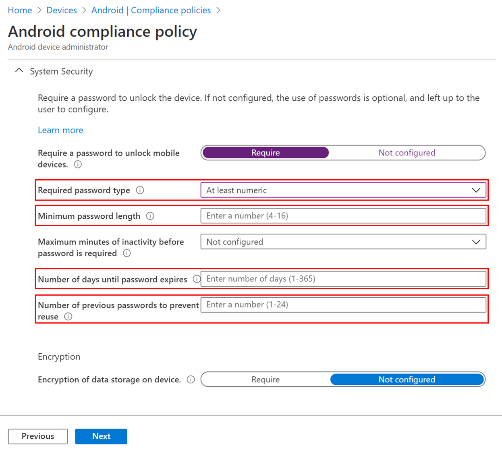

These notices provide important information that can help you prepare for future Intune changes and features.

### Updated end-user experience for Android device administrator Wi-Fi profiles<!-- 7662680  -->
Due to a change made by Google, the end-user experience for new Wi-Fi profiles is significantly different starting in the October release of the Company Portal app. Users will need to accept additional permissions, and explicitly accept Wi-Fi configurations when they're deployed. Wi-Fi configurations will not appear in the known Wi-Fi networks list, but will automatically connect when in range. There are no changes in behavior for existing Wi-Fi profiles. There are also no changes to the admin experience in the Endpoint Manager admin center.

Applies to:
- Android device administrator, Android 10 and later

### Microsoft Intune ends support for Windows Phone 8.1 and Windows 10 Mobile<!-- 3544938, 3544909 -->
Microsoft mainstream support for Windows Phone 8.1 ended in July 2017 and extended support ended in June 2019. The Company Portal app for Windows Phone 8.1 has been in sustain mode since October 2017. Additionally, Microsoft Intune has ended support on February 20, 2020 for Windows Phone 8.1. 

Microsoft mainstream support for Windows 10 Mobile ended in December 2019. As mentioned in the support statement, Windows 10 Mobile users will no longer be eligible to receive new security updates, non-security hotfixes, free assisted support options or online technical content updates from Microsoft. Based on the all-up Mobile OS support, Microsoft Intune ends support for both the Company Portal for the Windows 10 Mobile app and the Windows 10 Mobile Operating System on August 10, 2020.

As of August 10, enrollments for Windows Phone 8.1 and Windows 10 Mobile devices will fail and Windows Mobile profile types are removed from the Intune UI. Devices already enrolled will no longer check into the Intune service and we will delete device and policy data.

### End of support for legacy PC management

Legacy PC management is going out of support on October 15, 2020. Upgrade devices to Windows 10 and reenroll them as Mobile Device Management (MDM) devices to keep them managed by Intune.

[Learn more](https://go.microsoft.com/fwlink/?linkid=2107122)

### Move to the Microsoft Endpoint Manager admin center for all your Intune management
In MC208118 posted last March, we introduced a new, simple URL for your Microsoft Endpoint Manager – Intune administration: [https://endpoint.microsoft.com](https://endpoint.microsoft.com). Microsoft Endpoint Manager is a unified platform that includes Microsoft Intune and Configuration Manager. **Starting August 1, 2020**, we will remove Intune administration at [https://portal.azure.com](https://portal.azure.com) and recommend you instead use [https://endpoint.microsoft.com](https://endpoint.microsoft.com) for all your endpoint management. 

### Decreasing support for Android device administrator<!--7371518-->
Android device administrator management was released in Android 2.2 as a way to manage Android devices. Then beginning with Android 5, the more modern management framework of [Android Enterprise](../enrollment/connect-intune-android-enterprise.md) was released (for devices that can reliably connect to Google Mobile Services). Google is encouraging movement off of device administrator management by decreasing its management support in new Android releases.

#### How does this affect me?
Because of these changes by Google, in October 2020, you will no longer have as extensive management capabilities on impacted device administrator-managed devices. 

> [!NOTE]
> This date was previously communicated as fourth quarter of 2020, but it has been moved out based on the [latest information from Google](https://www.blog.google/products/android-enterprise/da-migration/).

##### Device types that will be impacted
Devices that will be impacted by the decreasing device administrator support are those for which all three conditions below apply:
- Enrolled in device administrator management.
- Running Android 10 or later.
- All Android manufacturers, except Samsung.

Devices will not be impacted if they are any of the below:
- Not enrolled with device administrator management.
- Running an Android version below Android 10.
- Samsung devices. Samsung Knox devices won't be impacted in this timeframe because extended support is provided through Intune’s integration with the Knox platform. This gives you additional time to plan the transition off device administrator management for Samsung devices.

##### Settings that will be impacted
[Google's decreased device administrator support](https://developers.google.com/android/work/device-admin-deprecation) prevents configuration of these settings from applying on impacted devices.

###### Configuration profile device restriction settings

- Block **Camera**
- Set **Minimum password length**
- Set **Number of sign-in failures before wiping device** (will not apply on devices without a password set, but will apply on devices with a password)
- Set **Password expiration (days)**
- Set **Required password type**
- Set **Prevent use of previous passwords**
- Block **Smart Lock and other trust agents**

###### Compliance policy settings

- Set **Required password type**
- Set **Minimum password length**
- Set **Number of days until password expires**
- Set **Number of previous passwords to prevent reuse**

#### User experience of impacted settings on impacted devices

Impacted configuration settings:
- For already enrolled devices that already had the settings applied, the impacted configuration settings will continue being enforced.
- For newly enrolled devices, newly assigned settings, and updated settings, the impacted configuration settings will not be enforced (but all other configuration settings will still be enforced).

Impacted compliance settings:
- For already enrolled devices that already had the settings applied, the impacted compliance settings will still show as reasons for noncompliance on the “Update device settings” page, the device will be out of compliance, and the password requirements will still be enforced in the Settings app.
- For newly enrolled devices, newly assigned settings, and updated settings, the impacted compliance settings will still show as reasons for noncompliance on the “Update device settings” page and the device will be out of compliance, but stricter password requirements will not be enforced in the Settings app.

Additional user experience change for Wi-Fi profiles
- Users will need to accept additional permissions, and explicitly accept Wi-Fi configurations when they're deployed. Wi-Fi configurations will not appear in the known Wi-Fi networks list, but will automatically connect when in range. There are no changes in behavior for existing Wi-Fi profiles. There are also no changes to the admin experience in the Endpoint Manager admin center.  

#### Cause of impact 
Devices will begin being impacted in October 2020. At that time, there will be a Company Portal app update that will increase the Company Portal API targeting from level 28 to level 29 ([as required by Google](https://www.blog.google/products/android-enterprise/da-migration/)). 

At that point, device administrator-managed devices that are not manufactured by Samsung will be impacted once the user completes both these actions:
- Updates to Android 10 or later.
- Updates the Company Portal app to the version that targets API level 29.

#### Additional impacts based on Android OS version 
**Android 10**: For all device administrator managed devices (including Samsung) running Android 10 and later, Google has restricted the ability for device administrator management agents like Company Portal to access device identifier information. This restriction impacts the following Intune features after a device is updated to Android 10 or later: 
- Network access control for VPN will no longer work 
- Identifying devices as corporate-owned with an IMEI or serial number won't automatically mark devices as corporate-owned 
- The IMEI and serial number will no longer be visible to IT admins in Intune 

**Android 11**: We continue to test the latest Android 11 beta release to evaluate the impact on device administrator managed devices. Here’s what we have found: 
- For device administrator devices (excluding Samsung) running Android 11 and later, Google has removed the ability for management agents like Company Portal to enforce blocking Camera, even before the October update to the Company Portal app. Policies blocking camera that are applied to devices before they update to Android 11 will continue to apply.  
- With Android 11, trusted root certificates can no longer be deployed to devices enrolled with device administrator (except on Samsung devices). Users must manually install the trusted root certificate on the device. With the trusted root certificate manually installed on a device, you can then use SCEP to provision certificates to the device. In this scenario you must still create and deploy a trusted certificate policy to the device, and link that policy to the SCEP certificate profile. 
    - If the trusted root certificate is on the device, then the SCEP certificate profile will install successfully.  
    - If the trusted certificate cannot be found, the SCEP certificate profile will fail. 

#### What do I need to do to prepare for this change?
To avoid the reduction in functionality coming in October 2020, we recommend the following:
- **New enrollments**: Onboard new devices into [Android Enterprise](../enrollment/connect-intune-android-enterprise.md) management (where available) and/or [app protection policies](../apps/app-protection-policies.md). Avoid onboarding new devices into device administrator management. 
- **Previously enrolled devices**: If a device administrator-managed device is running Android 10 or later or may update to Android 10 or later (especially if it is not a Samsung device), move it off of device administrator management to [Android Enterprise](../enrollment/connect-intune-android-enterprise.md) management and/or [app protection policies](../apps/app-protection-policies.md). You can leverage the streamlined flow to [move Android devices from device administrator to work profile management](../enrollment/android-move-device-admin-work-profile.md).
- **Configure Password Complexity**: For impacted devices running Android 10 and later, a future setting called Password Complexity lets you continue enforcing password restrictions and compliance. Password Complexity is a measure of password strength that factors in password type, length, and quality.

#### What if I have non-Samsung devices that cannot move to Android Enterprise? 
Some devices can’t move from device administrator to Android Enterprise management. For example, [Google hasn’t made Android Enterprise available in some markets](https://support.google.com/work/android/answer/6270910?hl=en). You can still use Intune to manage non-Samsung devices with device administrator, but the changes to functionality mentioned in this post will apply. For guidance on managing devices when Android Enterprise isn’t available, see [How to use Intune in environments without Google Mobile Services](../apps/manage-without-gms.md). 

#### Additional information
- [Move Android devices from device administrator to work profile management](../enrollment/android-move-device-admin-work-profile.md)
- [Set up enrollment of Android Enterprise work profile devices](../enrollment/android-work-profile-enroll.md)
- [Set up enrollment of Android Enterprise dedicated devices](../enrollment/android-kiosk-enroll.md)
- [Set up enrollment of Android Enterprise fully managed devices](../enrollment/android-fully-managed-enroll.md)
- [How to create an assign app protection policies](../apps/app-protection-policies.md)
- [How to use Intune in environments without Google Mobile Services](../apps/manage-without-gms.md)
- [Understanding app protection policies and work profiles on Android Enterprise devices](../apps/android-deployment-scenarios-app-protection-work-profiles.md)
- [Google’s blog about what you need to know about Device Admin deprecation](https://www.blog.google/products/android-enterprise/da-migration/)
- [Google's guidance for migration from device administrator to Android Enterprise](http://static.googleusercontent.com/media/android.com/en/enterprise/static/2016/pdfs/enterprise/Android-Enterprise-Migration-Bluebook_2019.pdf)
- [Google's documentation of deprecated device administrator APIs](https://developers.google.com/android/work/device-admin-deprecation)

### Plan for Change: Intune Enrollment Flow Update for Apple’s Automated Device Enrollment for iOS/iPadOS
In the July Company Portal release, we’ll be changing the iOS/iPadOS enrollment flow for Apple’s Automated Device Enrollment (formerly known as DEP). The enrollment flow change is only encountered during the “Enroll with User Affinity” flow. Previously, if you set the “Install Company Portal” to “no” as part of your configuration, users could still install the Company Portal app from the store which would then trigger enrollment where the user would add in the appropriate serial number. With this upcoming Company Portal release, we’ll be removing that serial number confirmation screen. Instead, you’ll want to create a corresponding app configuration policy to send down alongside the Company Portal to ensure that users can successfully enroll, or set the “Install Company Portal” to “Yes” as part of your configuration. 
 - See the post [here](https://techcommunity.microsoft.com/t5/intune-customer-success/intune-enrollment-flow-update-for-apple-s-automated-device/ba-p/1431629) for more info.
