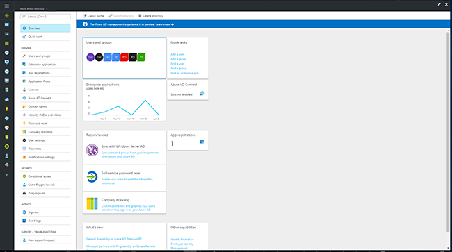
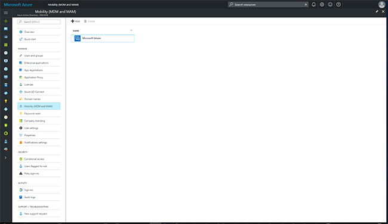

## Enable Windows 10 automatic enrollment

Automatic enrollment lets users enroll their Windows 10 devices in Intune. To enroll, users add their work account to their personally owned devices or join corporate-owned devices to Azure Active Directory. In the background, the device registers and joins Azure Active Directory. Once registered, the device is managed with Intune.

**Prerequisites**

- Azure Active Directory Premium subscription ([trial subscription](https://go.microsoft.com/fwlink/?LinkID=816845))
- Microsoft Intune subscription

### Configure automatic MDM enrollment

1. Sign in to the [Azure portal](https://portal.azure.com), and select **Azure Active Directory**.

   

2. Select **Mobility (MDM and MAM)**.

   

3. Select **Microsoft Intune**.

   

4. Configure **MDM User scope**. Specify which users' devices should be managed by Microsoft Intune. These Windows 10 devices can automatically enroll for management with Microsoft Intune.

   - **None** - MDM automatic enrollment disabled
   - **Some** - Select the **Groups** that can automatically enroll their Windows 10 devices
   - **All** - All users can automatically enroll their Windows 10 devices

      > [!IMPORTANT]
      > For BYOD devices, the MAM user scope takes precedence if both MAM user scope and MDM user scope (automatic MDM enrollment) are enabled for all users (or the same groups of users). The device will use Windows Information Protection (WIP) Policies (if you configured them) rather than being MDM enrolled.
      >
      > For corporate devices, the MDM user scope takes precedence if both scopes are enabled. The devices get MDM enrolled.

   > [!NOTE]
   > MDM user scope must be set to an Azure AD group that contains user objects.

   

5. Use the default values for the following URLs:
    - **MDM Terms of use URL**
    - **MDM Discovery URL**
    - **MDM Compliance URL**

6. Select **Save**.

By default, two-factor authentication is not enabled for the service. However, two-factor authentication is recommended when registering a device. To enable two-factor authentication, configure a two-factor authentication provider in Azure AD and configure your user accounts for multi-factor authentication. See [Getting started with the Azure Multi-Factor Authentication Server](https://docs.microsoft.com/azure/multi-factor-authentication/multi-factor-authentication-get-started-cloud).
