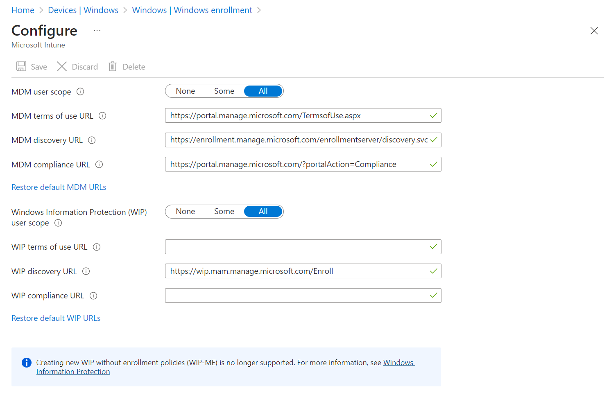

## Enable Windows automatic enrollment

Automatic enrollment lets users enroll their Windows devices in Intune. To enroll, users add their work account to their personally owned devices or join corporate-owned devices to Azure Active Directory. In the background, the device registers and joins Azure Active Directory. Once registered, the device is managed with Intune.

**Prerequisites**

- Azure Active Directory Premium subscription ([trial subscription](https://go.microsoft.com/fwlink/?LinkID=816845))
- Microsoft Intune subscription
- Global Administrator permissions 

### Configure automatic MDM enrollment

1. Sign in to the [Azure portal](https://portal.azure.com), and select **Azure Active Directory** > **Mobility (MDM and MAM)** > **Microsoft Intune**.

   

4. Configure **MDM User scope**. Specify which users' devices should be managed by Microsoft Intune. These Windows 10 devices can automatically enroll for management with Microsoft Intune.

   - **None** - MDM automatic enrollment disabled
   - **Some** - Select the **Groups** that can automatically enroll their Windows 10 devices
   - **All** - All users can automatically enroll their Windows 10 devices

      > [!IMPORTANT]
      > For Windows BYOD devices, the MAM user scope takes precedence if both the MAM user scope and the MDM user scope (automatic MDM enrollment) are enabled for all users (or the same groups of users). The device will not be MDM enrolled, and Windows Information Protection (WIP) Policies will be applied if you have configured them.
      >
      > If your intent is to enable automatic enrollment for Windows BYOD devices to an MDM: configure the MDM user scope to **All** (or **Some**, and specify a group) and configure the MAM user scope to **None** (or **Some**, and specify a group – ensuring that users are not members of a group targeted by both MDM and MAM user scopes).
      >
      >For [corporate devices](../enrollment/enrollment-restrictions-set.md#blocking-personal-windows-devices), the MDM user scope takes precedence if both MDM and MAM user scopes are enabled. The device will get automatically enrolled in the configured MDM.

   > [!NOTE]
   > MDM user scope must be set to an Azure AD group that contains user objects.

   

5. Use the default values for the following URLs:
    - **MDM Terms of use URL**
    - **MDM Discovery URL**
    - **MDM Compliance URL**

6. Select **Save**.

By default, two-factor authentication is not enabled for the service. However, two-factor authentication is recommended when registering a device. To enable two-factor authentication, configure a two-factor authentication provider in Azure AD and configure your user accounts for multi-factor authentication. For more information, see [Getting started with the Azure Active Directory Multi-Factor Authentication Server](/azure/multi-factor-authentication/multi-factor-authentication-get-started-cloud).
