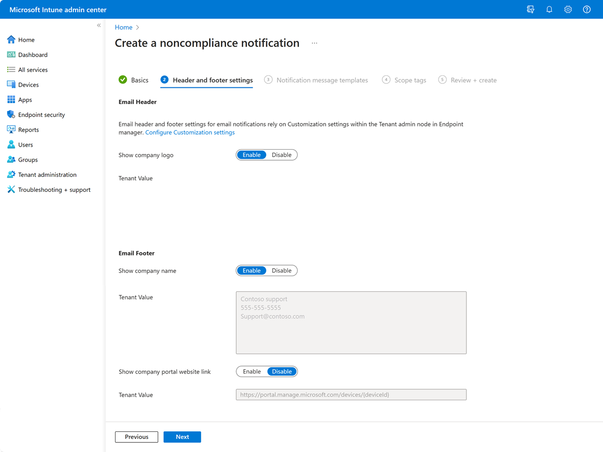

---
# required metadata

title: Configure compliance policies with actions for noncompliance in Microsoft Intune
description: Configure your compliance policies with one or more actions for noncompliance to protect devices and your organization from unprotected devices. Actions can remotely lock devices, send email or notifications to device users, and more.
keywords:
author: lenewsad
ms.author: lanewsad
manager: dougeby
ms.date: 1/23/2024
ms.topic: how-to
ms.service: microsoft-intune
ms.subservice: protect
ms.localizationpriority: high

# optional metadata

#ROBOTS:
#audience:
#ms.devlang:
ms.suite: ems
search.appverid: MET150
ms.reviewer: tycast
#ms.tgt_pltfrm:
ms.custom: intune-azure
ms.collection:
- tier1
- M365-identity-device-management
- highpri
- compliance
- sub-certificates

---

# Configure actions for noncompliant devices in Intune

As part of a [compliance policy](../protect/device-compliance-get-started.md) that protects your organizations resources from devices that don't meet your security requirements, compliance policies also include **Actions for noncompliance**. Actions for noncompliance are one or more time-ordered actions that are taken by a policy to help protect devices and your organization. As an example, an action for noncompliance can remotely lock a device to ensure it's protected, or send a notification to devices or users to help them understand and resolve the noncompliant status.

[!INCLUDE [android_device_administrator_support](../includes/android-device-administrator-support.md)]

## Overview

By default, each compliance policy includes the action for noncompliance of **Mark device noncompliant** with a schedule of zero days (**0**). The result of this default is when Intune detects a device isn't compliant, Intune immediately marks the device as noncompliant. After a device is marked as noncompliant, Microsoft Entra [Conditional Access](/azure/active-directory/active-directory-conditional-access-azure-portal) can block the device.

By configuring  **Actions for noncompliance** you gain flexibility to decide what to do about noncompliant devices, and when to do it. For example, you might choose to not block the device immediately, and give the user a grace period to become compliant.

For each action you set, you can configure a schedule that determines when that action takes effect. The schedule is a number of days after the device is marked as noncompliant. You can also configure multiple instances of an action. When you set multiple instances of an action in a policy, the action runs again at that later scheduled time if the device remains noncompliant.

Not all actions are available for all platforms.

   > [!NOTE]
   > The Microsoft Intune admin center displays the _schedule (days after noncompliance)_ in days. However it is possible to specify a more granular interval (hours), using decimal fractions such as 0.25 (6 hours), 0.5 (12 hours), 1.5 (36 hours), and so on. While other values are possible, they can only be configured using [Microsoft Graph](/graph/overview) and not via the admin center. Attempting to use other values in the admin center, such as 0.33 (8 hours) will result in an error when attempting to save the policy.

## Available actions for noncompliance

Following are the available actions for noncompliance:

- **Mark device non-compliant**: By default, this action is set for each compliance policy and has a schedule of zero (**0**) days, marking devices as noncompliant immediately.

  When you change the default schedule, you provide a grace period in which a user can remediate issues or become compliant without being marked as noncompliant.

  This action is supported on all platforms supported by Intune.

- **Send email to end user**: This action sends an email notification to the user.
When you enable this action:

  - Select a *Notification message template* that this action sends. You [Create a notification message template](#create-a-notification-message-template) before you can assign one to this action. When you create the custom notification, you customize the message locale, subject, message body, and can include the company logo, company name, and other contact information.
  - Choose to send the message to more recipients by selecting one or more of your Microsoft Entra groups.

  Intune uses the email address defined in the end user's profile and not their user principal name (UPN). If there's no defined email address defined in the user's profile, then Intune doesn't send a notification email. When the email is sent, Intune includes details about the noncompliant device in the email notification.

  This action is supported on all platforms supported by Intune.

   > [!NOTE] 
   > Notification emails are sent from: microsoft-noreply@microsoft.com
   > 
   > Ensure you do not have any mailbox policies that would prevent delivery of emails from these addresses, otherwise end users may not receive the email notification.
   > 
   > _Prior to December 2022, notification emails in the commercial cloud were sent from: IntuneNotificationService@microsoft.com_

- **Remotely lock the noncompliant device**: Use this action to issue a remote lock of a device. The user is then prompted for a PIN or password to unlock the device. More on the [Remote Lock](../remote-actions/device-remote-lock.md) feature.

  The following platforms support this action:
  - Android device administrator
  - Android (AOSP)
  - Android Enterprise:
    - Fully Managed
    - Dedicated
    - Corporate-Owned Work Profile
    - Personally Owned Work Profile
    - Android Enterprise kiosk devices
  - iOS/iPadOS
  - macOS

- **Add device to retire list**: When this action is performed on a device, the device is added to a list of retired, noncompliant devices in the Intune admin center. You can go to **Devices** > **Compliance** and select the **Retire noncompliant devices** tab to view the list. However, the device isn't retired until an administrator explicitly initiates the retirement process. When an admin retires the device from that list, retirement removes all company data off the device and removes that device from Intune management. 

  The following platforms support this action:
  - Android device administrator
  - Android (AOSP)
  - Android Enterprise:
    - Fully Managed
    - Dedicated
    - Corporate-Owned Work Profile
    - Personally Owned Work Profile
  - iOS/iPadOS
  - macOS
  - Windows 10/11  
  
  > [!NOTE]
  > Only devices to which the **Add device to retire list** action has been triggered appear in the **Retire selected devices** tab. To see a list of all devices that are not compliant, see the **Noncompliant devices** report mentioned in [Monitor device compliance policy](../protect/compliance-policy-monitor.md#other-compliance-reports).  

  To retire one or more devices from the list, select devices to retire and then select **Retire selected devices**. When you choose an action that retires devices, you're then presented with a dialog box to confirm the action. It's only after confirming the intent to retire the devices that they're cleared of company data and removed from Intune management. 

  Other options include *Retire all devices*, *Clear all devices retire state*, and *Clear selected devices retire state*. Clearing the retire state for a device removes the device from the list of devices that can be retired until the action to *Add device to retire list* is applied to that device again.

  Learn more about [retiring devices](../remote-actions/devices-wipe.md#retire).

- **Send push notification to end user**: Configure this action to send a push notification about noncompliance to a device through the Company Portal app or Intune App on the device.  

  The following platforms support this action:
  - Android device administrator
  - Android Enterprise:
    - Fully Managed
    - Dedicated
    - Corporate-Owned Work Profile
    - Personally Owned Work Profile
  - iOS/iPadOS

  The push notification is sent the first time a device checks in with Intune and is found to be noncompliant to the compliance policy. When a user selects the notification, the Company Portal app or Intune app opens and displays information about why they're noncompliant. The user can then take action to resolve the issue. The message details about noncompliance are generated by Intune and can't be customized.

  > [!IMPORTANT]
  > Intune, the Company Portal app, and the Microsoft Intune app, can't guarantee delivery of a push notification. Notifications might show up after several hours of delay, if at all. This includes when users have turned off push notifications.
  >
  > Do not rely on this notification method for urgent messages.

  Each instance of the action sends a notification a single time. To send the same notification again from a policy, configure more instances of the action in that policy, each with a different schedule.
  
  For example, you might schedule the first action for zero days and then add a second instance of the action set to three days. This delay before the second notification gives the user a few days to resolve the issue, and avoid the second notification.

  To avoid spamming users with too many duplicate messages, review and streamline which compliance policies include a push notification for noncompliance, and review the schedules to avoid repeat notifications for the same too often.

  Consider:
  - For a single policy that includes multiple instances of a push notification set for the same day, only a single notification is sent for that day.

  - When multiple compliance policies include the same compliance conditions, and include the push notification action with the same schedule, Intune sends multiple notifications to the same device on the same day.

> [!NOTE]
> The following actions for noncompliance are not supported for devices that are managed by a [device compliance management partner](../protect/device-compliance-partners.md):  
> - Send email to end user
> - Remotely lock the noncompliant device
> - Add device to retire list
> - Send push notification to end user

## Before you begin

You can [add actions for noncompliance](#add-actions-for-noncompliance) when you configure device compliance policy, or later by editing the policy. You can add extra actions to each policy to meet your needs. Keep in mind that each compliance policy automatically includes the default action for noncompliance that marks devices as noncompliant,  with a schedule set to zero days.

To use device compliance policies to block devices from corporate resources, Microsoft Entra Conditional Access must be set up. See [Conditional Access in Microsoft Entra ID](/azure/active-directory/active-directory-conditional-access-azure-portal) or [common ways to use Conditional Access with Intune](conditional-access-intune-common-ways-use.md) for guidance.

To create a device compliance policy, see the following platform-specific guidance:

- [Android](compliance-policy-create-android.md)
- [Android (AOSP)](compliance-policy-create-android-aosp.md)
- [Android work profiles](compliance-policy-create-android-for-work.md)
- [iOS](compliance-policy-create-ios.md)
- [macOS](compliance-policy-create-mac-os.md)
- [Windows](compliance-policy-create-windows.md)

## Create a notification message template

To send email to your users, create a notification message template and associate that to your compliance policy as an action for noncompliance. Then, when a device is noncompliant, the details you enter in the template is shown in the email sent to your users.        

A *notification message template* can include multiple messages that are each for a different locale. When you specify multiple messages and locales, noncompliant end users receive the appropriate localized message based on their O365 preferred language. 

Add variables to the message to create a personalized email with dynamic content. The following table describes the variables you can use in the subject line and body of the message.  

| Variable name | Token to use | Description |
| --- | --- |--- |
| User name | {{UserName}} | Add the name of the primary user for the noncompliant device.   Example: `John Doe` |
| Device name| {{DeviceName}} | Add the name of the noncompliant device as it's recorded in Microsoft Intune.   Example: `John's iPad` |
| Device ID | {{DeviceId}} | Add the Intune device ID that belongs to the noncompliant device.   Example: `12ab345c-6789-def0-1234-000000000000` |
| Device OS version | {{OSAndVersion}} | Add the operating system and version of the noncompliant device.   Example: `Android 12` |  

### To create the template

1. Sign in to the [Microsoft Intune admin center](https://go.microsoft.com/fwlink/?linkid=2109431).  
2. Select **Endpoint security** > **Device compliance** > **Notifications** > **Create notification**.  
3. On the **Basics** page, give the template a friendly name to help you identify it. Then select **Next**.  
  
4. On the **Header and footer settings** page, add your company details and logo. 

   > [!div class="mx-imgBorder"]
   >   

   Your options:  
   - **Email header – Show company logo** (default = *Enable*) - Upload a logo to add your organization's branding to the email templates. For more information about Company Portal branding, see [Company identity branding customization](../apps/company-portal-app.md#customizing-the-user-experience).
   - **Email footer – Show company name** (default = *Enable*) - Enable this setting to show your company name in the email. See **Tenant Value** to review the company name on record.      
   - **Email footer – Show contact information** (default = *Enable*) -  Enable this setting to show your organization's contact information, such as name, phone number, and email address, in the email. See **Tenant Value** to review the contact information on record.   
   - **Email footer - Show company portal website link** (default = *Disable*) - Enable this setting to include a link to the Company Portal website in the email. See **Tenant Value** to review the website link shown to users. 

   Select **Next** to continue.  

5. On the **Notification message templates** page, configure one or more messages. For each message, specify the following details:  

   - **Locale**: Select the language that correlates to the device user's locale.  
   - **Subject**: Add the subject line for the email. You can enter up to 78 characters.   
   - **Raw HTML editor**: Turn on the HTML editor to get suggestions while adding HTML formatting and links to your message. You can use the `href` attribute to add a link (must be an HTTPS URL). Supported HTML tags include: `<a>`, `<strong>`, `<b>`, `<u>`, `<ol>`, `<ul>`, `<li>`, `
`, ` `, `<code>`, `<table>`, `<tbody>`, `<tr>`, `<td>`, `<thead>`, `<th>`. You aren't required to use the HTML editor, and can add supported HTML without turning the editor on. 
   - **Message**: Create a message explaining the reason for noncompliance. You can enter up to 2,000 characters.  
   
   To create a template with dynamic content, insert the token of a supported variable in the subject line or message. For a list of supported variables, see the table under [Create a notification message template](#create-a-notification-message-template) in this article. 

   >[!IMPORTANT]
   >  Be sure to only use Intune-supported HTML tags and attributes in the message body. Intune will send messages that contain other types of tags, elements, or styling as plaintext instead of HTML format. This includes messages that contain: 
   > - CSS  
   > - Tags and attributes not listed in this article 

   >[!NOTE]
   > Intune converts Windows-style new line characters to ` ` HTML tags but ignores all other types of new line characters, including those for macOS and Linux. To ensure line breaks render properly in templates, we recommend using the ` ` tag to indicate the end of a line.

5. Select the checkbox for **Is Default** for one of the messages. Intune sends your default message to users that haven't set a preferred language, or when the template doesn’t include a specific message for their locale.  Only one message can be set as default. To delete a message, select the ellipsis (...) and then **Delete**.  

   Select **Next** to continue.

6. On the **Scope tags** page, select tags to limit visibility and management of this message to specific Intune admin groups, such as `US-NC IT Team` or `JohnGlenn_ITDepartment`. For more information about scope tags, see [Use RBAC and scope tags for distributed IT](../fundamentals/scope-tags.md).  

   Select **Next** to continue.  
7. On the **Review + create** page, review your configurations to ensure the notification message template is ready to use. Select **Create** to complete creation of the notification.  

### View and edit notifications

Notifications that have been created are available in the *Compliance policies* > *Notifications* page. From the page you can select a notification to view its configuration and:

- Select **Send preview email** to send a preview of the notification email to the account you've used to sign in to Intune.

  To successfully send the preview email, your account must have permissions equal to those of the following Microsoft Entra groups or Intune roles: *Intune Administrator* (also known as Intune Service Administrator) or *Policy and Profile Manager*.  
- Select **Edit** for *Basics* or *Scope tags* to make a change.

> [!NOTE]
> The preview email doesn't contain the device variables that are specified in the notification message template. 

## Add actions for noncompliance

When you create a device compliance policy, Intune automatically creates an action for noncompliance. If a device doesn't meet your compliance policy, this action marks the device as not compliant. You can customize how long the device is marked as not compliant. This action can't be removed.

You can add optional actions when you create a compliance policy, or update an existing policy.

1. Sign in to the [Microsoft Intune admin center](https://go.microsoft.com/fwlink/?linkid=2109431). 

2. Go to **Devices** > **Compliance**.
3. Select a policy, and then select **Properties**.  

   Don't have a policy yet? Create an [Android](compliance-policy-create-android.md), [iOS](compliance-policy-create-ios.md), [Windows](compliance-policy-create-windows.md), or other platform policy.

   > [!NOTE]
   > Devices managed by third-party device compliance partners that are targeted with device groups cannot receive compliance actions at this time.

3. Select **Actions for noncompliance** > **Edit**.  

4. Select your **Action**:

   - **Send email to end users**: When the device is noncompliant, choose to email the user. Also:
     - Choose the **Message template** you previously created
     - Enter any **Additional recipients** by selecting groups

   - **Remotely lock the noncompliant device**: When the device is noncompliant, lock the device. This action forces the user to enter a PIN or passcode to unlock the device.

   - **Add device to retire list**: When the device is noncompliant, remove all company data off the device and remove the device from Intune management.

   - **Send push notification to end user**: Configure this action to send a push notification about noncompliance to a device through the Company Portal app or Intune App on the device.

5. Configure a **Schedule**: Enter the number of days (0 to 365) after noncompliance to trigger the action on users' devices. After this grace period, you can enforce a [conditional access](conditional-access-intune-common-ways-use.md) policy. If you enter **0** (zero) number of days, then conditional access takes effect **immediately**. For example, if a device is noncompliant, use conditional access to block access to email, SharePoint, and other organization resources immediately.

   When you create a compliance policy, the **Mark device noncompliant** action is automatically created, and automatically set to **0** days (immediately). With this action, when the device checks in with Intune and evaluates the policy, if it isn't compliant to that policy Intune immediately marks that device as noncompliant. If the client checks in at a later time after remediating the issues that lead to noncompliance, its status will update to its new compliance status. If you use Conditional Access, those policies also apply as soon as a device is marked as noncompliant. To set a grace period to allow for a condition of noncompliance to be remediated before the device is marked as noncompliant, change the **Schedule** on the **Mark device noncompliant** action.

   In your compliance policy, for example, you also want to notify the user. You can add the **Send email to end user** action. On this **Send email** action, you set the **Schedule** to two days. If the device or end user is still evaluated as noncompliant on day two, then your email is sent on day two. If you want to email the user again on day five of noncompliance, then add another action, and set the **Schedule** to five days.

   For more information on compliance, and the built-in actions, see the [compliance overview](device-compliance-get-started.md).

6. When finished, select **Add** > **OK** to save your changes.

## Next steps

[Monitor your policies](compliance-policy-monitor.md).
