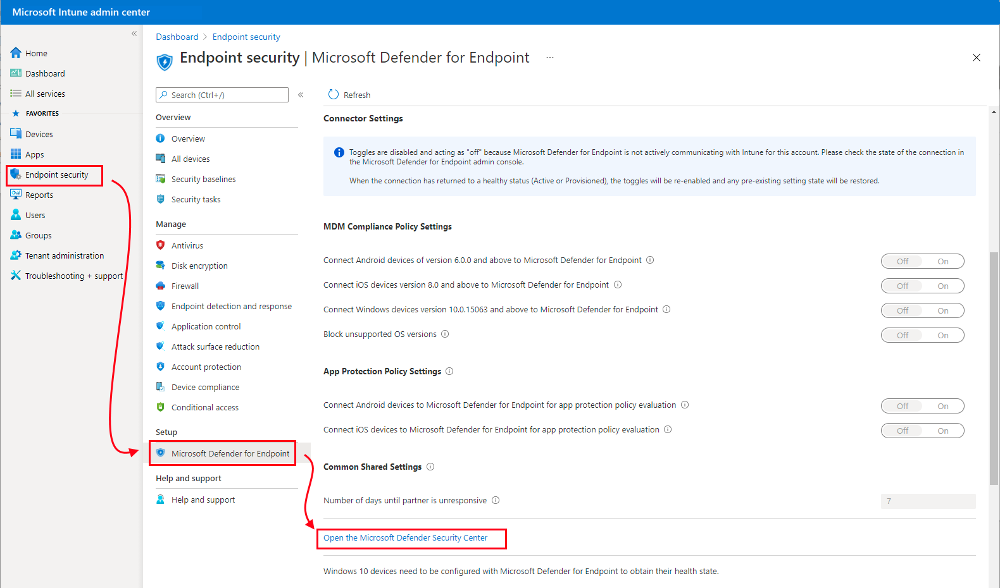
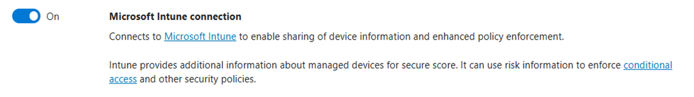

---
# required metadata

title: Configure Microsoft Defender ATP in Microsoft Intune - Azure | Microsoft Docs
description: Configure Microsoft Defender Advanced Threat Protection (Microsoft Defender ATP) in Intune, including connecting to ATP, onboarding devices, assigning compliance for risk levels, and conditional access policies.
keywords:
author: brenduns 
ms.author: brenduns
manager: dougeby
ms.date: 10/30/2020
ms.topic: how-to
ms.service: microsoft-intune
ms.subservice: protect
ms.localizationpriority: high
ms.technology:
ms.reviewer: aanavath

# optional metadata

#ROBOTS:
#audience:

ms.suite: ems
search.appverid: MET150
#ms.tgt_pltfrm:
ms.custom: intune-azure
ms.collection: M365-identity-device-management
---

# Configure Microsoft Defender ATP in Intune

The information and procedures in this article will help you to configure integration of Microsoft Defender ATP with Intune. Configuration includes the following general steps:

- Enable Microsoft Defender ATP for your tenant
- Onboard devices that run Android, iOS/iPadOS, and Windows 10
- Use compliance policies to set device risk levels
- Use conditional access policies to block devices that exceed your expected risk levels

Before starting, your environment must meet the [prerequisites](../protect/advanced-threat-protection.md#prerequisites) to use Microsoft Defender ATP with Intune.

## Enable Microsoft Defender ATP in Intune

The first step you take is to set up the service-to-service connection between Intune and Microsoft Defender ATP. Set up requires administrative access to both the Microsoft Defender Security Center, and to Intune.

You only need to enable Microsoft Defender ATP a single time per tenant.

### To enable Microsoft Defender ATP

1. Sign in to the [Microsoft Endpoint Manager admin center](https://go.microsoft.com/fwlink/?linkid=2109431).

2. Select **Endpoint security** > **Microsoft Defender ATP**, and then select **Open the Microsoft Defender Security Center**.

   

3. In **Microsoft Defender Security Center**:
   1. Select **Settings** > **Advanced features**.
   2. For **Microsoft Intune connection**, choose **On**:

      

   3. Select **Save preferences**.

4. Return to **Microsoft Defender ATP** in the Microsoft Endpoint Manager admin center. Under **MDM Compliance Policy Settings**, depending on your organization's needs:
   - Set **Connect Android devices of version 6.0.0 and above to Microsoft Defender ATP** to **On**
   - Set **Connect iOS devices version 8.0 and above to Microsoft Defender Advanced Threat Protection** to **On**
   - Set **Connect Windows devices version 10.0.15063 and above to Microsoft Defender ATP** to **On**

   After setting these configurations to *On*, applicable devices that are already managed with Intune, as well as devices you enroll in the future, will be connected to Microsoft Defender ATP for the purpose of compliance.

5. Select **Save**.

> [!TIP]
> When you integrate a new application to Intune Mobile Threat Defense and enable the connection to Intune, Intune creates a classic conditional access policy in Azure Active Directory. Each MTD app you integrate, including [Microsoft Defender ATP](advanced-threat-protection.md) or any of our additional [MTD partners](mobile-threat-defense.md#mobile-threat-defense-partners), creates a new classic conditional access policy. These policies can be ignored, but should not be edited, deleted, or disabled.
>
> If the classic policy is deleted, you will need to delete the connection to Intune that was responsible for its creation, and then set it up again. This recreates the classic policy. Its not supported to migrate classic policies for MTD apps to the new policy type for conditional access.
>
> Classic conditional access policies for MTD apps:
>
> - Are used by Intune MTD to require that devices are registered in Azure AD so that they have a device ID before communicating to MTD partners. The ID is required so that devices and can successfully report their status to Intune.
> - Have no effect on any other Cloud apps or Resources.
> - Are distinct from conditional access policies you might create to help manage MTD.
> - By default, don't interact with other conditional access policies you use for evaluation.
>
> To view classic conditional access policies, in [Azure](https://portal.azure.com/#home), go to **Azure Active Directory** > **Conditional Access** > **Classic policies**.

## Onboard devices

When you enabled support for Microsoft Defender ATP in Intune, you establish a service-to-service connection between Intune and Microsoft Defender ATP. You can then onboard devices you manage with Intune to Microsoft Defender ATP, which enables collection of data about device risk levels.

### Onboard Windows devices

When you established the connection between Intune and Microsoft Defender ATP, Intune received a Microsoft Defender ATP onboarding configuration package from Microsoft Defender ATP. You deploy this configuration package to your Windows devices with a device configuration profile for Microsoft Defender ATP.

The configuration package configures devices to communicate with [Microsoft Defender ATP services](/windows/security/threat-protection/microsoft-defender-atp/microsoft-defender-advanced-threat-protection) to scan files and detect threats. The device is also configured to report to Microsoft Defender ATP the devices risk level based on compliance policies you'll create.

After you onboard a device using the configuration package, you don't need to do it again.

In addition to device configuration policy, you can onboard devices using:

- [Endpoint detection and response](../protect/endpoint-security-edr-policy.md) (EDR) policy. Intune EDR policy is part of endpoint security in Intune, which you can use to configure device security without the overhead of the larger body of settings found in device configuration profiles. You can also use EDR policy with tenant attached devices, which are devices you manage with Configuration Manager.
- [Group policy or Microsoft Endpoint Configuration Manager](/windows/security/threat-protection/microsoft-defender-atp/configure-endpoints).

> [!TIP]
> When using multiple polices or policy types like *device configuration* policy and *endpoint detection and response* policy to manage the same device settings (such as onboarding to Defender ATP), you can create policy conflicts for devices. To learn more about conflicts, see [Manage conflicts](../protect/endpoint-security-policy.md#manage-conflicts) in the *Manage security policies* article.

### Create the device configuration profile to onboard Windows devices

1. Sign in to the [Microsoft Endpoint Manager admin center](https://go.microsoft.com/fwlink/?linkid=2109431).
2. Select **Endpoint security > Endpoint detection and response** > **Create profile**.
3. For **Platform**, select **Windows 10 and Later**.
4. For **Profile type**, select **Endpoint detection and response**, and then select **Create**.
5. On the **Basics** page, enter a *Name* and *Description* (optional) for the profile, then choose **Next**.
6. On the **Configuration settings** page, configure the following in **Endpoint Detection and Response**:
  
  > [!NOTE]
    > In this instance, this has been auto populated as Defender for Endpoint has already been integrated with Intune. 
    > 
    > The following image is an example of what you'll see when Microsoft Defender for Endpoint is NOT integrated with Intune:
    >
    > 

   - **Sample sharing for all files**: Returns or sets the Microsoft Defender Advanced Threat Protection Sample Sharing configuration parameter.

   - **Expedite telemetry reporting frequency**: For devices that are at high risk, **Enable** this setting so it reports telemetry to the Microsoft Defender ATP service more frequently.

     [Onboard Windows 10 machines using Microsoft Endpoint Configuration Manager](/windows/security/threat-protection/microsoft-defender-atp/configure-endpoints-sccm) has more details on these Microsoft Defender ATP settings.

7. Select **Next** to open the **Scope tags** page. Scope tags are optional. Select **Next** to continue.

8. On the **Assignments** page, select the groups that will receive this profile. For more information on assigning profiles, see [Assign user and device profiles](../configuration/device-profile-assign.md).

   When deploying to user groups, a user must sign-in on a device before the policy applies and the device can onboard to Defender ATP. 

   Select **Next**.

9. On the **Review + create** page, when you're done, choose **Create**. The new profile is displayed in the list when you select the policy type for the profile you created.
 **OK**, and then **Create** to save your changes, which creates the profile.

### Onboard Android devices

After you establish the service-to-service connection between Intune and Microsoft Defender ATP, you can onboard Android devices to Microsoft Defender ATP. Onboarding configures devices to communicate with Defender ATP, which then collects data about the devices risk level.

Unlike for Windows devices, there isn't a configuration package for devices that run Android. Instead, see [Overview of Microsoft Defender ATP for Android](/windows/security/threat-protection/microsoft-defender-atp/microsoft-defender-atp-android) in the Microsoft Defender ATP documentation for prerequisites and onboarding instructions for Android.

For devices that run Android, you can also use Intune policy to modify Microsoft Defender ATP on Android. For more information, see [Microsoft Defender ATP web protection](../protect/advanced-threat-protection-manage-android.md).

### Onboard iOS/iPadOS devices

After you establish the service-to-service connection between Intune and Microsoft Defender ATP, you can onboard iOS/iPadOS devices to Microsoft Defender ATP. Onboarding configures devices to communicate with Defender ATP, which then collects data about the devices risk level. 

Unlike for Windows devices, there isn't a configuration package for devices that run iOS/iPadOS. Instead, see [Overview of Microsoft Defender Advanced Threat Protection for iOS](/windows/security/threat-protection/microsoft-defender-atp/microsoft-defender-atp-ios) in the Microsoft Defender ATP documentation for prerequisites and onboarding instructions for iOS/iPadOS.

For devices that run iOS/iPadOS (in Supervised Mode), there is specialized ability given the increased management capabilities provided by the platform on these types of devices. To take advantage of these capabilities, the Defender app needs to know if a device is in Supervised Mode. Intune allows you to configure the Defender for iOS app through a App Configuration policy (for managed devices) that should be targeted to all iOS Devices as a best practice. 

1. Sign in to the [Microsoft Endpoint Manager admin center](https://go.microsoft.com/fwlink/?linkid=2109431).
2. Select **Apps** > **App configuration policies** > **Managed devices**.
3. On the **Basics** page, enter a *Name* and *Description* (optional) for the profile, select **Platform** as **iOS/iPadOS** then choose **Next**.
4. Select **Targeted app** as **Microsoft Defender for iOS**.
4. On the **Settings** page, set the **Configuration key** as **issupervised**, then **Value type** as **string** with the **{{issupervised}}** as the **Configuration value**. 
8. Select **Next** to open the **Scope tags** page. Scope tags are optional. Select **Next** to continue.
9. On the **Assignments** page, select the groups that will receive this profile. For this scenario, it is best practice to target **All Devices**. For more information on assigning profiles, see [Assign user and device profiles](../configuration/device-profile-assign.md).

   When deploying to user groups, a user must sign-in on a device before the policy applies. 

   Select **Next**.

10. On the **Review + create** page, when you're done, choose **Create**. The new profile is displayed in the list of configuration profiles. 

Further, for devices that run iOS/iPadOS (in Supervised Mode), the Defender for iOS team has made available a custom .mobileconfig profile to deploy to iPad/iOS devices. This .mobileconfig profile will be used to analyze network traffic to ensure a safe browsing experience - a feature of Defender for iOS.

1. Download the .mobile profile which is hosted here: https://aka.ms/mdatpiossupervisedprofile 
2. Sign in to the [Microsoft Endpoint Manager admin center](https://go.microsoft.com/fwlink/?linkid=2109431).
3. Select **Devices** > **Configuration profiles** > **Create profile**.
4. For **Platform**, select **iOS/iPadOS**
5. For **Profile type**, select **Custom**, and then select **Create**.
6. On the **Basics** page, enter a *Name* and *Description* (optional) for the profile, then choose **Next**.
7. Enter a *Configuration profile name*, and select a file to .mobileconfig file to Upload.
8. Select **Next** to open the **Scope tags** page. Scope tags are optional. Select **Next** to continue.
9. On the **Assignments** page, select the groups that will receive this profile. For this scenario, it is best practice to target **All Devices**. For more information on assigning profiles, see [Assign user and device profiles](../configuration/device-profile-assign.md).

   When deploying to user groups, a user must sign-in on a device before the policy applies. 

   Select **Next**.

10. On the **Review + create** page, when you're done, choose **Create**. The new profile is displayed in the list of configuration profiles. 

## Create and assign compliance policy to set device risk level

For Android, iOS/iPadOS, and Windows devices, the compliance policy determines the level of risk that you consider as acceptable for a device.

If you're not familiar with creating compliance policy, reference the [Create a policy](../protect/create-compliance-policy.md#create-the-policy) procedure from the *Create a compliance policy in Microsoft Intune* article. The following information is specific to configuring Microsoft Defender ATP as part of a compliance policy.

1. Sign in to the [Microsoft Endpoint Manager admin center](https://go.microsoft.com/fwlink/?linkid=2109431).

2. Select **Devices** > **Compliance policies** > **Policies** > **Create Policy**.

3. For **Platform**, use the drop-down box to select one of the following options:
   - **Android device administrator**
   - **Android Enterprise**
   - **iOS/iPadOS**
   - **Windows 10 and later**

   Next, select **Create** to open the **Create policy** configuration window.

4. Specify a **Name** that helps you identify this policy later. You can also choose to specify a **Description**.
  
5. On the **Compliance settings** tab, expand the **Microsoft Defender ATP** group and set the option **Require the device to be at or under the machine risk score** to your preferred level.

   Threat level classifications are [determined by Microsoft Defender ATP](/windows/security/threat-protection/microsoft-defender-atp/alerts-queue).

   - **Clear**: This level is the most secure. The device can't have any existing threats and still access company resources. If any threats are found, the device is evaluated as noncompliant. (Microsoft Defender ATP uses the value *Secure*.)
   - **Low**: The device is compliant if only low-level threats exist. Devices with medium or high threat levels aren't compliant.
   - **Medium**: The device is compliant if the threats found on the device are low or medium. If high-level threats are detected, the device is determined as noncompliant.
   - **High**: This level is the least secure and allows all threat levels. Devices with high, medium, or low threat levels are considered compliant.

6. Complete the configuration of the policy, including assignment of the policy to applicable groups.

## Create a conditional access policy

Conditional access policies can use data from Microsoft Defender ATP to block access to resources for devices that exceed the threat level you set. You can block access from the device to corporate resources, such as SharePoint or Exchange Online.

> [!TIP]
> Conditional access is an Azure Active Directory (Azure AD) technology. The *Conditional access* node found in the Microsoft Endpoint Manager admin center is the node from *Azure AD*.

1. Sign in to the [Microsoft Endpoint Manager admin center](https://go.microsoft.com/fwlink/?linkid=2109431).

2. Select **Endpoint security** > **Conditional Access** > **New policy**.

3. Enter a policy **Name**, and select **Users and groups**. Use the Include or Exclude options to add your groups for the policy, and select **Done**.

4. Select **Cloud apps**, and choose which apps to protect. For example, choose **Select apps**, and select **Office 365 SharePoint Online** and **Office 365 Exchange Online**.

   Select **Done** to save your changes.

5. Select **Conditions** > **Client apps** to apply the policy to apps and browsers. For example, select **Yes**, and then enable **Browser** and **Mobile apps and desktop clients**.

   Select **Done** to save your changes.

6. Select **Grant** to apply Conditional Access based on device compliance. For example, select **Grant access** > **Require device to be marked as compliant**.

    Choose **Select** to save your changes.

7. Select **Enable policy**, and then **Create** to save your changes.

## Next steps

- [Configure Microsoft Defender ATP settings on Android](../protect/advanced-threat-protection-manage-android.md)
- [Monitor compliance for risk levels](../protect/advanced-threat-protection-monitor.md)

Learn more from the Intune documentation:

- [Use security tasks with ATPs Vulnerability Management to remediate issues on devices](atp-manage-vulnerabilities.md)
- [Get started with device compliance policies](device-compliance-get-started.md)

Learn more from the Microsoft Defender ATP documentation:

- [Microsoft Defender ATP Conditional Access](/windows/security/threat-protection/microsoft-defender-atp/conditional-access)
- [Microsoft Defender ATP risk dashboard](/windows/security/threat-protection/microsoft-defender-atp/security-operations-dashboard)
