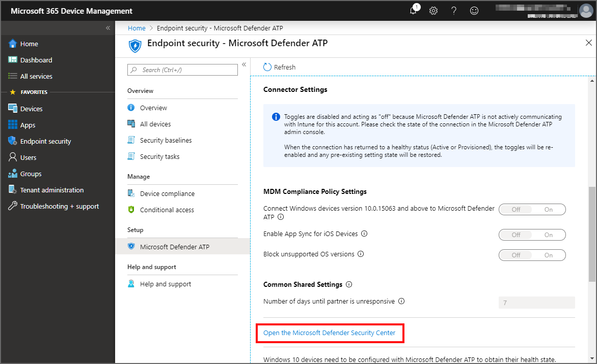

---
# required metadata

title: Use Microsoft Defender ATP in Microsoft Intune - Azure | Microsoft Docs
description: Use Microsoft Defender Advanced Threat Protection (Microsoft Defender ATP) with Intune, including setup and configuration, onboarding of your Intune devices with ATP, and then use a devices ATP risk assessment with your Intune device compliance and conditional access policies to protect network resources.
keywords:
author: brenduns 
ms.author: brenduns
manager: dougeby
ms.date: 11/19/2019
ms.topic: conceptual
ms.service: microsoft-intune
ms.subservice: protect
ms.localizationpriority: high
ms.technology:
ms.reviewer: shpate

# optional metadata

#ROBOTS:
#audience:
#ms.devlang:
ms.suite: ems
search.appverid: MET150
#ms.tgt_pltfrm:
ms.custom: intune-azure
ms.collection: M365-identity-device-management
---

# Enforce compliance for Microsoft Defender ATP with Conditional Access in Intune

You can integrate Microsoft Defender Advanced Threat Protection (Microsoft Defender ATP) with Microsoft Intune as a Mobile Threat Defense solution. Integration can help you prevent security breaches and limit the impact of breaches within an organization. Microsoft Defender ATP works with devices that run Windows 10 or later.

To be successful, you use the following configurations in concert:

- **Establish a service-to-service connection between Intune and Microsoft Defender ATP**. This connection lets Microsoft Defender ATP collect data about machine risk from Windows 10 devices you manage with Intune.
- **Use a device configuration profile to onboard devices with Microsoft Defender ATP**. You onboard devices to configure them to communicate with Microsoft Defender ATP and to provide data that helps assess their risk level.
- **Use a device compliance policy to set the level of risk you want to allow**. Risk levels are reported by Microsoft Defender ATP. Devices that exceed the allowed risk level are identified as non-compliant.
- **Use a conditional access policy** to block users from accessing corporate resources from devices that are non-compliant.

When you integrate Intune with Microsoft Defender ATP, you can take advantage of ATPs Threat & Vulnerability Management (TVM) and [use Intune to remediate endpoint weakness identified by TVM](atp-manage-vulnerabilities.md).

## Example of using Microsoft Defender ATP with Intune

The following example helps explain how these solutions work together to help protect your organization. For this example, Microsoft Defender ATP and Intune are already integrated.

Consider an event where someone sends a Word attachment with embedded malicious code to a user within your organization.

- The user opens the attachment, and enables the content.
- An elevated privilege attack starts, and an attacker from a remote machine has admin rights to the victim’s device.
- The attacker then remotely accesses the user's other devices. This security breach can impact the entire organization.

Microsoft Defender ATP can help resolve security events like this scenario.

- In our example, Microsoft Defender ATP detects that the device executed abnormal code, experienced a process privilege escalation, injected malicious code, and issued a suspicious remote shell.
- Based on these actions from the device, Microsoft Defender ATP [classifies the device as high-risk](https://docs.microsoft.com/windows/security/threat-protection/microsoft-defender-atp/alerts-queue#severity) and includes a detailed report of suspicious activity in the Microsoft Defender Security Center portal.

Because you have an Intune device compliance policy to classify devices with a *Medium* or *High* level of risk as non-compliant, the compromised device is classified as non-compliant. This classification allows your conditional access policy to kick in and block access from that device to your corporate resources.

## Prerequisites

To use Microsoft Defender ATP with Intune, be sure you have the following configured, and ready for use:

- Licensed tenant for Enterprise Mobility + Security E3 and Windows E5 (or Microsoft 365 Enterprise E5)
- Microsoft Intune environment, with [Intune managed](../intune/enrollment/windows-enroll.md) Windows 10 devices that are also Azure AD joined
- [Microsoft Defender ATP](https://docs.microsoft.com/windows/security/threat-protection/microsoft-defender-atp/microsoft-defender-advanced-threat-protection) and access to the Microsoft Defender Security Center (ATP portal)

> [!NOTE]
> Microsoft Defender ATP is not supported with iOS/iPadOS and Android Intune app protection policies.

## Enable Microsoft Defender ATP in Intune

The first step you take is to set up the service-to-service connection between Intune and Microsoft Defender ATP. This requires administrative access to both the Microsoft Defender Security Center, and to Intune.

### To enable Defender ATP

You only need to enable Defender ATP a single time per tenant.

1. Sign in to the [Microsoft Endpoint Manager Admin Center](https://go.microsoft.com/fwlink/?linkid=2109431).

2. Select **Endpoint security** > **Microsoft Defender ATP**, and then select **Open the Microsoft Defender Security Center**.

   

4. In **Microsoft Defender Security Center**:
    1. Select **Settings** > **Advanced features**.
    2. For **Microsoft Intune connection**, choose **On**:

        

    3. Select **Save preferences**.

4. Return to **Microsoft Defender ATP** in the Microsoft Endpoint Manager Admin Center. Under **MDM Compliance Policy Settings**, set **Connect Windows devices version 10.0.15063 and above to Microsoft Defender ATP** to **On**.

5. Select **Save**.

> [!TIP]
> When you integrate a new application to Intune Mobile Threat Defense and enable the connection to Intune, Intune creates a classic conditional access policy in Azure Active Directory. Each MTD app you integrate, including [Defender ATP](advanced-threat-protection.md) or any of our additional [MTD partners](mobile-threat-defense.md#mobile-threat-defense-partners), creates a new classic conditional access policy. These policies can be ignored, but should not be edited, deleted, or disabled.
>
> If the classic policy is deleted, you will need to delete the connection to Intune that was responsible for its creation, and then set it up again. This recreates the classic policy. Its not supported to migrate classic policies for MTD apps to the new policy type for conditional access.
>
> Classic conditional access policies for MTD apps:
>
> - Are used by Intune MTD to require that devices are registered in Azure AD so that they have a device ID before communicating to MTD partners. The ID is required so that devices and can successfully report their status to Intune.
> - Have no effect on any other Cloud apps or Resources.
> - Are distinct from conditional access policies you might create to help manage MTD.
> - By default, don’t interact with other conditional access policies you use for evaluation.
>
> To view classic conditional access policies, in [Azure](https://portal.azure.com/#home), go to **Azure Active Directory** > **Conditional Access** > **Classic policies**.

## Onboard devices by using a configuration profile

After you establish the service-to-service connection between Intune and Microsoft Defender ATP, you onboard your Intune managed devices to ATP so that data about their risk level can be collected and used. To onboard devices, you use a device configuration profile for Microsoft Defender ATP.

When you established the connection to Microsoft Defender ATP, Intune received a Microsoft Defender ATP onboarding configuration package from Microsoft Defender ATP. This package is deployed to devices with the device configuration profile. The configuration package configures devices to communicate with [Microsoft Defender ATP services](https://docs.microsoft.com/windows/security/threat-protection/microsoft-defender-atp/microsoft-defender-advanced-threat-protection) to scan files, detect threats, and report the risk to Microsoft Defender ATP. After you onboard a device using configuration package, you don't need to do it again. You can also onboard devices using a [group policy or Microsoft Endpoint Configuration Manager](https://docs.microsoft.com/windows/security/threat-protection/microsoft-defender-atp/configure-endpoints).

### Create the device configuration profile

1. Sign in to the [Microsoft Endpoint Manager Admin Center](https://go.microsoft.com/fwlink/?linkid=2109431).
2. Select **Devices** > **Configuration profiles** > **Create profile**.
3. Enter a **Name** and **Description**.
4. For **Platform**, select **Windows 10 and later**
5. For **Profile type**, select **Microsoft Defender ATP (Windows 10 Desktop)**.
6. Configure the settings:

   - **Microsoft Defender ATP client configuration package type**: Select **Onboard** to add the configuration package to the profile. Select **Offboard** to remove the configuration package from the profile.
  
     > [!NOTE]
     > If you've properly established a connection with Microsoft Defender ATP, Intune will automatically **Onboard** the configuration profile for you, and the **Microsoft Defender ATP client configuration package type** setting will not be available.
  
   - **Sample sharing for all files**: **Enable** allows samples to be collected, and shared with Microsoft Defender ATP. For example, if you see a suspicious file, you can submit it to Microsoft Defender ATP for deep analysis. **Not configured** doesn't share any samples to Microsoft Defender ATP.
   - **Expedite telemetry reporting frequency**: For devices that are at high risk, **Enable** this setting so it reports telemetry to the Microsoft Defender ATP service more frequently.

     [Onboard Windows 10 machines using Microsoft Endpoint Configuration Manager](https://docs.microsoft.com/windows/security/threat-protection/microsoft-defender-atp/configure-endpoints-sccm) has more details on these Microsoft Defender ATP settings.

7. Select **OK**, and **Create** to save your changes, which creates the profile.
8. [Assign the device configuration profile](../intune/configuration/device-profile-assign.md) to devices you want to assess with Microsoft Defender ATP.

## Create and assign the compliance policy

The compliance policy determines the level of risk that you consider as acceptable for a device.

### Create the compliance policy

1. Sign in to the [Microsoft Endpoint Manager Admin Center](https://go.microsoft.com/fwlink/?linkid=2109431).
2. Select **Devices** > **Compliance policies** > **Create policy**.
3. Enter a **Name** and **Description**.
4. In **Platform**, select **Windows 10 and later**.
5. Under **Settings**, select **Microsoft Defender ATP**.
6. Set **Require the device to be at or under the machine risk score** to your preferred level.

   Threat level classifications are [determined by Microsoft Defender ATP](https://docs.microsoft.com/windows/security/threat-protection/microsoft-defender-atp/alerts-queue).

   - **Clear**: This level is the most secure. The device can't have any existing threats and still access company resources. If any threats are found, the device is evaluated as noncompliant. (Microsoft Defender ATP users the value *Secure*.)
   - **Low**: The device is compliant if only low-level threats exist. Devices with medium or high threat levels aren't compliant.
   - **Medium**: The device is compliant if the threats found on the device are low or medium. If high-level threats are detected, the device is determined as noncompliant.
   - **High**: This level is the least secure and allows all threat levels. So devices that with high, medium, or low threat levels are considered compliant.

7. Select **OK**, and **Create** to save your changes (and create the policy).
8. [Assign the device compliance policy](create-compliance-policy.md#assign-the-policy) to applicable groups.

## Create a Conditional Access policy

The Conditional Access policy blocks access to resources for devices that exceed the threat level you set in your compliance policy. You can block access from the device to corporate resources, such as SharePoint or Exchange Online.

> [!TIP]
> Conditional Access is an Azure Active Directory (Azure AD) technology. The Conditional Access node accessed from the Microsoft Endpoint Manager Admin Center is the same node as accessed from *Azure AD*.

1. Sign in to the [Microsoft Endpoint Manager Admin Center](https://go.microsoft.com/fwlink/?linkid=2109431).

2. Select **Endpoint security** > **Conditional Access** > **New policy**.

3. Enter a policy **Name**, and select **Users and groups**. Use the Include or Exclude options to add your groups for the policy, and select **Done**.

4. Select **Cloud apps**, and choose which apps to protect. For example, choose **Select apps**, and select **Office 365 SharePoint Online** and **Office 365 Exchange Online**.

   Select **Done** to save your changes.

5. Select **Conditions** > **Client apps** to apply the policy to apps and browsers. For example, select **Yes**, and then enable **Browser** and **Mobile apps and desktop clients**.

   Select **Done** to save your changes.

6. Select **Grant** to apply Conditional Access based on device compliance. For example, select **Grant access** > **Require device to be marked as compliant**.

    Choose **Select** to save your changes.

7. Select **Enable policy**, and then **Create** to save your changes.

## Monitor device compliance

Next, monitor the state of devices that have the Microsoft Defender ATP compliance policy.

1. Sign in to the [Microsoft Endpoint Manager Admin Center](https://go.microsoft.com/fwlink/?linkid=2109431).

2. Select **Devices** > **Monitor** > **Policy compliance**.

3. Find your Microsoft Defender ATP policy in the list, and see which devices are compliant or noncompliant.

You can also use the *operational* report for noncompliant devices from the same location:

1. Select **Devices** > **Monitor** > **Noncompliant devices**.

For more information about reports, see [Intune reports](../intune/fundamentals/reports.md).

## View onboarding status

To view the onboarding status of all Intune-managed Windows 10 devices, you can go to **Device compliance** > **Microsoft Defender ATP**. From this page, you can also initiate the creation of a device configuration profile for onboarding more devices to Microsoft Defender ATP.

## Next steps

[Microsoft Defender ATP Conditional Access](https://docs.microsoft.com/windows/security/threat-protection/microsoft-defender-atp/conditional-access)

[Microsoft Defender ATP risk dashboard](https://docs.microsoft.com/windows/security/threat-protection/microsoft-defender-atp/security-operations-dashboard)

[Use security tasks with ATPs Vulnerability Management to remediate issues on devices](atp-manage-vulnerabilities.md).

[Get started with device compliance policies](device-compliance-get-started.md)
