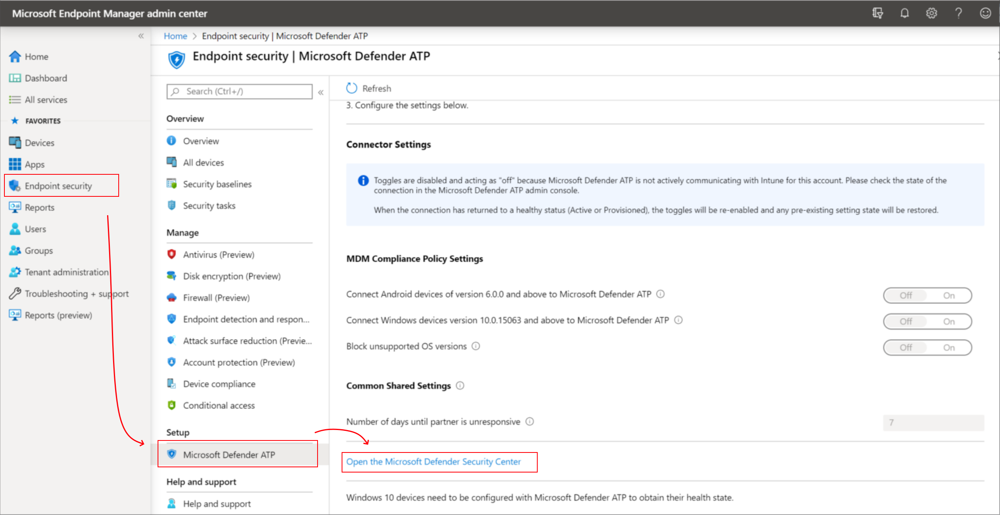

---
# required metadata

title: Use Microsoft Defender ATP in Microsoft Intune - Azure | Microsoft Docs
description: Use Microsoft Defender Advanced Threat Protection (Microsoft Defender ATP) with Intune, including setup and configuration, onboarding of your Intune devices with ATP, and then use a devices ATP risk assessment with your Intune device compliance and conditional access policies to protect network resources.
keywords:
author: brenduns 
ms.author: brenduns
manager: dougeby
ms.date: 06/17/2020
ms.topic: how-to
ms.service: microsoft-intune
ms.subservice: protect
ms.localizationpriority: high
ms.technology:
ms.reviewer: shpate

# optional metadata

#ROBOTS:
#audience:

ms.suite: ems
search.appverid: MET150
#ms.tgt_pltfrm:
ms.custom: intune-azure
ms.collection: M365-identity-device-management
---

# Enforce compliance for Microsoft Defender ATP with Conditional Access in Intune

You can integrate Microsoft Defender Advanced Threat Protection (Microsoft Defender ATP) with Microsoft Intune as a Mobile Threat Defense solution. Integration can help you prevent security breaches and limit the impact of breaches within an organization. Microsoft Defender ATP works with devices that run Windows 10 or later, and with Android devices.

To be successful, use the following configurations in concert:

- **Establish a service-to-service connection between Intune and Microsoft Defender ATP**. This connection lets Microsoft Defender ATP collect data about machine risk from supported devices you manage with Intune.
- **Use a device configuration profile to onboard devices with Microsoft Defender ATP**. You onboard devices to configure them to communicate with Microsoft Defender ATP and to provide data that helps assess their risk level.
- **Use a device compliance policy to set the level of risk you want to allow**. Risk levels are reported by Microsoft Defender ATP. Devices that exceed the allowed risk level are identified as noncompliant.
- **Use a conditional access policy** to block users from accessing corporate resources from devices that are noncompliant.

When you integrate Intune with Microsoft Defender ATP, you can take advantage of Microsoft Defender ATPs Threat & Vulnerability Management (TVM) and [use Intune to remediate endpoint weakness identified by TVM](atp-manage-vulnerabilities.md).

## Example of using Microsoft Defender ATP with Intune

The following example helps explain how these solutions work together to help protect your organization. For this example, Microsoft Defender ATP and Intune are already integrated.

Consider an event where someone sends a Word attachment with embedded malicious code to a user within your organization.

- The user opens the attachment, and enables the content.
- An elevated privilege attack starts, and an attacker from a remote machine has admin rights to the victim's device.
- The attacker then remotely accesses the user's other devices. This security breach can impact the entire organization.

Microsoft Defender ATP can help resolve security events like this scenario.

- In our example, Microsoft Defender ATP detects that the device executed abnormal code, experienced a process privilege escalation, injected malicious code, and issued a suspicious remote shell.
- Based on these actions from the device, Microsoft Defender ATP [classifies the device as high-risk](https://docs.microsoft.com/windows/security/threat-protection/microsoft-defender-atp/alerts-queue#severity) and includes a detailed report of suspicious activity in the Microsoft Defender Security Center portal.

Because you have an Intune device compliance policy to classify devices with a *Medium* or *High* level of risk as noncompliant, the compromised device is classified as noncompliant. This classification allows your conditional access policy to kick in and block access from that device to your corporate resources.

You can also use Intune policy to modify some configurations for Microsoft Defender ATP on Android. For more information, see [Configure web protection on devices that run Android](#configure-web-protection-on-devices-that-run-android), later in this article.

## Prerequisites

To use Microsoft Defender ATP with Intune, be sure you have the following configured, and ready for use:

- Licensed tenant for Enterprise Mobility + Security E3 and Windows E5 (or Microsoft 365 Enterprise E5)
- Microsoft Intune environment, with [Intune managed](../enrollment/windows-enroll.md) Windows 10, or Android devices that are also Azure AD joined
- [Microsoft Defender ATP](https://docs.microsoft.com/windows/security/threat-protection/microsoft-defender-atp/microsoft-defender-advanced-threat-protection) and access to the Microsoft Defender Security Center (ATP portal)

> [!NOTE]
> Microsoft Defender ATP is not supported with iOS/iPadOS and Android Intune app protection policies.

## Enable Microsoft Defender ATP in Intune

The first step you take is to set up the service-to-service connection between Intune and Microsoft Defender ATP. This requires administrative access to both the Microsoft Defender Security Center, and to Intune.

### To enable Microsoft Defender ATP

You only need to enable Microsoft Defender ATP a single time per tenant.

1. Sign in to the [Microsoft Endpoint Manager admin center](https://go.microsoft.com/fwlink/?linkid=2109431).

2. Select **Endpoint security** > **Microsoft Defender ATP**, and then select **Open the Microsoft Defender Security Center**.

   

3. In **Microsoft Defender Security Center**:
   1. Select **Settings** > **Advanced features**.
   2. For **Microsoft Intune connection**, choose **On**:

      

   3. Select **Save preferences**.

4. Return to **Microsoft Defender ATP** in the Microsoft Endpoint Manager admin center. Under **MDM Compliance Policy Settings**, depending on your organization's needs:
   - Set **Connect Windows devices version 10.0.15063 and above to Microsoft Defender ATP** to **On**
   - Set **Connect Android devices of version 6.0.0 and above to Microsoft Defender ATP** to **On**

5. Select **Save**.

> [!TIP]
> When you integrate a new application to Intune Mobile Threat Defense and enable the connection to Intune, Intune creates a classic conditional access policy in Azure Active Directory. Each MTD app you integrate, including [Microsoft Defender ATP](advanced-threat-protection.md) or any of our additional [MTD partners](mobile-threat-defense.md#mobile-threat-defense-partners), creates a new classic conditional access policy. These policies can be ignored, but should not be edited, deleted, or disabled.
>
> If the classic policy is deleted, you will need to delete the connection to Intune that was responsible for its creation, and then set it up again. This recreates the classic policy. Its not supported to migrate classic policies for MTD apps to the new policy type for conditional access.
>
> Classic conditional access policies for MTD apps:
>
> - Are used by Intune MTD to require that devices are registered in Azure AD so that they have a device ID before communicating to MTD partners. The ID is required so that devices and can successfully report their status to Intune.
> - Have no effect on any other Cloud apps or Resources.
> - Are distinct from conditional access policies you might create to help manage MTD.
> - By default, don't interact with other conditional access policies you use for evaluation.
>
> To view classic conditional access policies, in [Azure](https://portal.azure.com/#home), go to **Azure Active Directory** > **Conditional Access** > **Classic policies**.

## Onboard Windows devices by using a configuration profile

For the Windows platform, after you establish the service-to-service connection between Intune and Microsoft Defender ATP, onboard your Intune managed devices to Microsoft Defender ATP so data about their risk level can be collected used. To onboard devices, you use a device configuration profile for Microsoft Defender ATP.

When you established the connection to Microsoft Defender ATP, Intune received a Microsoft Defender ATP onboarding configuration package from Microsoft Defender ATP. This package is deployed to devices with the device configuration profile. The configuration package configures devices to communicate with [Microsoft Defender ATP services](https://docs.microsoft.com/windows/security/threat-protection/microsoft-defender-atp/microsoft-defender-advanced-threat-protection) to scan files, detect threats, and report the risk to Microsoft Defender ATP. After you onboard a device using configuration package, you don't need to do it again. You can also onboard devices using a [group policy or Microsoft Endpoint Configuration Manager](https://docs.microsoft.com/windows/security/threat-protection/microsoft-defender-atp/configure-endpoints).

### Create the device configuration profile

1. Sign in to the [Microsoft Endpoint Manager admin center](https://go.microsoft.com/fwlink/?linkid=2109431).
2. Select **Devices** > **Configuration profiles** > **Create profile**.
3. Enter a **Name** and **Description**.
4. For **Platform**, select **Windows 10 and later**
5. For **Profile type**, select **Microsoft Defender ATP (Windows 10 Desktop)**.
6. Configure the settings:

   - **Microsoft Defender ATP client configuration package type**: Select **Onboard** to add the configuration package to the profile. Select **Offboard** to remove the configuration package from the profile.
  
     > [!NOTE]
     > If you've properly established a connection with Microsoft Defender ATP, Intune will automatically **Onboard** the configuration profile for you, and the **Microsoft Defender ATP client configuration package type** setting will not be available.
  
   - **Sample sharing for all files**: **Enable** allows samples to be collected, and shared with Microsoft Defender ATP. For example, if you see a suspicious file, you can submit it to Microsoft Defender ATP for deep analysis. **Not configured** doesn't share any samples to Microsoft Defender ATP.
   - **Expedite telemetry reporting frequency**: For devices that are at high risk, **Enable** this setting so it reports telemetry to the Microsoft Defender ATP service more frequently.

     [Onboard Windows 10 machines using Microsoft Endpoint Configuration Manager](https://docs.microsoft.com/windows/security/threat-protection/microsoft-defender-atp/configure-endpoints-sccm) has more details on these Microsoft Defender ATP settings.

7. Select **OK**, and then **Create** to save your changes, which creates the profile.
8. [Assign the device configuration profile](../configuration/device-profile-assign.md) to devices you want to assess with Microsoft Defender ATP.

## Onboard Android devices
After you establish the service-to-service connection between Intune and Microsoft Defender ATP, you must onboard managed devices to Microsoft Defender ATP so data about their risk level can be collected and used.

For detailed instructions for onboarding Android devices, including prerequisites for end users and administrators, see [Microsoft Defender Advanced Threat Protection for Android](https://docs.microsoft.com/windows/security/threat-protection/microsoft-defender-atp/microsoft-defender-atp-android) in the Microsoft Defender ATP documentation.

## Create and assign compliance policy to set device risk level

For both Windows, and Android devices, the compliance policy determines the level of risk that you consider as acceptable for a device.

If you're not familiar with creating compliance policy, reference the [Create a policy](../protect/create-compliance-policy.md#create-the-policy) procedure from the *Create a compliance policy in Microsoft Intune* article. The following information is specific to configuring Microsoft Defender ATP as part of a compliance policy.

1. Sign in to the [Microsoft Endpoint Manager admin center](https://go.microsoft.com/fwlink/?linkid=2109431).

2. Select **Devices** > **Compliance policies** > **Policies** > **Create Policy**.

3. For **Platform**, use the drop-down box to select one of the following options:
   - **Windows 10 and later**
   - **Android device administrator**
   - **Android Enterprise**

   Next, select **Create** to open the **Create policy** configuration window.

4. Specify a **Name** that helps you identify this policy later. You can also choose to specify a **Description**.
  
5. On the **Compliance settings** tab, expand the **Microsoft Defender ATP** group and set the option **Require the device to be at or under the machine risk score** to your preferred level.

   Threat level classifications are [determined by Microsoft Defender ATP](https://docs.microsoft.com/windows/security/threat-protection/microsoft-defender-atp/alerts-queue).

   - **Clear**: This level is the most secure. The device can't have any existing threats and still access company resources. If any threats are found, the device is evaluated as noncompliant. (Microsoft Defender ATP uses the value *Secure*.)
   - **Low**: The device is compliant if only low-level threats exist. Devices with medium or high threat levels aren't compliant.
   - **Medium**: The device is compliant if the threats found on the device are low or medium. If high-level threats are detected, the device is determined as noncompliant.
   - **High**: This level is the least secure and allows all threat levels. Devices with high, medium, or low threat levels are considered compliant.

6. Complete the configuration of the policy, including assignment of the policy to applicable groups.

## Configure web protection on devices that run Android

By default, Microsoft Defender ATP for Android includes and enables the web protection feature. [Web protection](https://docs.microsoft.com/windows/security/threat-protection/microsoft-defender-atp/web-protection-overview) helps to secure devices against web threats and protect users from phishing attacks.

While enabled by default, there are valid reasons to disable this protection on some Android devices. For example, you might choose to use only the Microsoft Defender ATP app scan feature, or to prevent web protection from using your VPN while it scans for harmful URLs.

Intune supports turning off all or part of the web protection feature. The method you use and the capabilities you can disable depend on how the Android device is enrolled with Intune:

- **Android device administrator**: Use a configuration profile to set custom OMA-URI settings on the device to disable the entire web protection feature or to disable only the use of VPNs. For general information about custom settings for Android devices, see [Custom settings](../configuration/custom-settings-android.md).

- **Android Enterprise work profile**: Use an app configuration profile and the *configuration designer* to disable web protection. This method and enrollment type support disabling all web protection capabilities but doesn't support disabling only the use of VPNs. For general information about app configuration policies, see [Use the configuration designer](../apps/app-configuration-policies-use-android.md#use-the-configuration-designer).

To configure web protection on devices, use the following procedures to create and deploy the applicable configuration.

### Disable web protection for Android device administrator

1. Sign in to the [Microsoft Endpoint Manager admin center](https://go.microsoft.com/fwlink/?linkid=2109431).

2. Select **Devices** > **Configuration profiles** > **Create profile**.

3. Enter the following settings:

   - **Platform**: Select **Android device administrator**
   - **Profile**: Select **Custom**

   Select **Create**.

4. On **Basics**, enter the following details:

   - **Name**: Enter a descriptive name for the profile. Name your profiles so you can easily identify them later. For example, *Android custom profile for Microsoft Defender ATP web protection*
   - **Description**: Enter a description for the profile. This setting is optional but recommended.

5. On **Configuration settings**, select **Add**.

   Specify settings for the configuration you want to deploy:

   - **Disable web protection**:
     - **Name**: Enter a unique name for this OMA-URI setting so you can easily find it. For example, *Disable Microsoft Defender ATP web protection*
     - **Description**: (Optional) Enter a description that gives an overview of the setting, and any other important details.
     - **OMA-URI**: Enter **./Vendor/MSFT/DefenderATP/AntiPhishing**
     - **Data type**: Use the drop-down, and select **Integer**
     - **Value**: Enter **0** to disable web protection, including the VPN-based scan.
       > [!NOTE]
       > Enter **1** to enable web protection, which is the default for web protection.

   - **Disable only the use of VPN by web protection**:
     - **Name**: Enter a unique name for this OMA-URI setting so you can easily find it. For example, *Disable Microsoft Defender ATP web protection VPN*
     - **Description**: (Optional) Enter a description that gives an overview of the setting, and any other important details.
     - **OMA-URI**: Enter **./Vendor/MSFT/DefenderATP/Vpn**
     - **Data type**: Use the drop-down, and select **Integer**
     - **Value**: Enter **0** to disable the VPN-based scan.
       > [!NOTE]
       > Enter **1** to enable web protection, which is the default for web protection.

   Select **Add** to save the OMA-URI settings configuration, and then select **Next** to continue.

6. On **Assignments**, specify the groups that will receive this profile. For more information on assigning profiles, see [Assign user and device profiles](../configuration/device-profile-assign.md).

7. On **Review + create**, when you're done, choose **Create**. The new profile is displayed in the list when you select the policy type for the profile you created.

### Disable web protection for Android Enterprise work profile

1. Sign in to the [Microsoft Endpoint Manager admin center](https://go.microsoft.com/fwlink/?linkid=2109431).

2. Select **Apps** > **App configuration policies** > **Add**, and then select Managed devices.

3. On **Basics**, enter the following details:

   - **Name**: Enter a descriptive name for the profile. Name your profiles so you can easily identify them later. For example, *Android app configuration for Microsoft Defender ATP web protection*.
   - **Description**: Enter a description for the profile. This setting is optional but recommended.
   - **Platform**: Select **Android Enterprise**
   - **Profile Type**: Select **Work Profile Only**
   - **Targeted app**: Click on **Select app**.

4. On **Associated app**, find and select **Defender ATP**, and then select **OK** > **Next**.

5. On **Settings**, use the drop-down for **Configuration settings format**, select **Use configuration designer**, and then click **Add**. The JSON editor opens.

6. Find and select **Web Protection**, and then select **OK** to return to the **Settings** page.

7. For **Configuration value**, enter **0** to disable web protection.

   > [!NOTE]
   > Enter **1** to enable web protection, which is the default for web protection.

   Select **Next** to continue.

8. On **Assignments**, specify the groups that will receive this profile. For more information on assigning profiles, see [Assign user and device profiles](../configuration/device-profile-assign.md).

9. On **Review + create**, when you're done, choose **Create**. The new profile is displayed in the list when you select the policy type for the profile you created.

## Create a conditional access policy

Conditional access policies can use data from Microsoft Defender ATP to block access to resources for devices that exceed the threat level you set. You can block access from the device to corporate resources, such as SharePoint or Exchange Online.

> [!TIP]
> Conditional access is an Azure Active Directory (Azure AD) technology. The *Conditional access* node found in the Microsoft Endpoint Manager admin center is the node from *Azure AD*.

1. Sign in to the [Microsoft Endpoint Manager admin center](https://go.microsoft.com/fwlink/?linkid=2109431).

2. Select **Endpoint security** > **Conditional Access** > **New policy**.

3. Enter a policy **Name**, and select **Users and groups**. Use the Include or Exclude options to add your groups for the policy, and select **Done**.

4. Select **Cloud apps**, and choose which apps to protect. For example, choose **Select apps**, and select **Office 365 SharePoint Online** and **Office 365 Exchange Online**.

   Select **Done** to save your changes.

5. Select **Conditions** > **Client apps** to apply the policy to apps and browsers. For example, select **Yes**, and then enable **Browser** and **Mobile apps and desktop clients**.

   Select **Done** to save your changes.

6. Select **Grant** to apply Conditional Access based on device compliance. For example, select **Grant access** > **Require device to be marked as compliant**.

    Choose **Select** to save your changes.

7. Select **Enable policy**, and then **Create** to save your changes.

## Monitor device compliance

Monitor the state of devices that have the Microsoft Defender ATP compliance policy.

1. Sign in to the [Microsoft Endpoint Manager admin center](https://go.microsoft.com/fwlink/?linkid=2109431).

2. Select **Devices** > **Monitor** > **Policy compliance**.

3. Find your Microsoft Defender ATP policy in the list, and see which devices are compliant or noncompliant.

You can also use the *operational* report for noncompliant devices from the same location:

1. Select **Devices** > **Monitor** > **Noncompliant devices**.

For more information about reports, see [Intune reports](../fundamentals/reports.md).

## View onboarding status

To view the onboarding status of all Intune-managed devices, you can go to **Endpoint security** > **Microsoft Defender ATP**. From this page, you can also start the creation of a device configuration profile for onboarding more devices to Microsoft Defender ATP.

## Next steps

[Microsoft Defender ATP Conditional Access](https://docs.microsoft.com/windows/security/threat-protection/microsoft-defender-atp/conditional-access)

[Microsoft Defender ATP risk dashboard](https://docs.microsoft.com/windows/security/threat-protection/microsoft-defender-atp/security-operations-dashboard)

[Use security tasks with ATPs Vulnerability Management to remediate issues on devices](atp-manage-vulnerabilities.md).

[Get started with device compliance policies](device-compliance-get-started.md)
