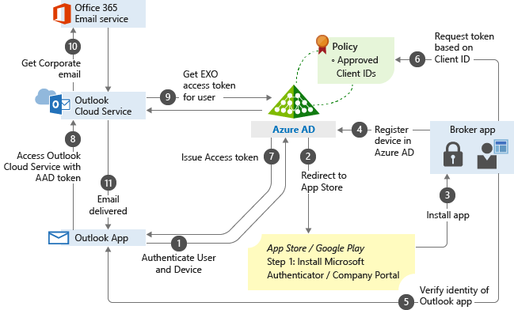

---
# required metadata

title: Use app-based Conditional Access policies with Intune
titleSuffix: Microsoft Intune
description: Learn about using app-based Conditional Access policies with Microsoft Intune for both enrolled and unenrolled devices.
keywords:
author: brenduns
ms.author: brenduns
manager: dougeby
ms.date: 04/14/2022
ms.topic: conceptual
ms.service: microsoft-intune
ms.subservice: protect
ms.localizationpriority: high
ms.technology:
ms.assetid: b399fba0-5dd4-4777-bc9b-856af038ec41

# optional metadata

#ROBOTS:
#audience:

ms.reviewer: elocholi
ms.suite: ems
search.appverid: MET150
#ms.tgt_pltfrm:
ms.custom: intune-azure
ms.collection:
- tier2
- M365-identity-device-management
---

# Use app-based Conditional Access policies with Intune

Intune app protection policies work with Conditional Access, an Azure Active  (Azure AD) capability, to help protect your organizational data on devices your employees use. These policies work on devices that enroll with Intune and on employee owned devices that don't enroll.

[App protection policies](../apps/app-protection-policy.md) are rules that ensure an organization's data remains safe or contained in a managed app.

- An app protection policy can be a rule that's enforced when the user attempts to access or move "corporate" data, or a set of actions that are prohibited or monitored when the user is inside the app.
- A managed app is an app that has app protection policies applied to it, and can be managed by Intune.
- You can also block the built-in mail apps on iOS/iPadOS and Android when you allow only the Microsoft Outlook app to access Exchange Online. Additionally, you can block apps that don't have Intune app protection policies applied from accessing SharePoint Online.

App-based Conditional Access with client app management adds a security layer by making sure only client apps that support Intune app protection policies can access Exchange online and other Microsoft 365 services.

## Prerequisites

Before you create an app-based Conditional Access policy, you must have:

- **Enterprise Mobility + Security (EMS)** or an **Azure AD Premium subscription**
- Users must be licensed for EMS or Azure AD

For more information, see [Enterprise Mobility pricing](https://www.microsoft.com/cloud-platform/enterprise-mobility-pricing) or [Azure Active Directory pricing](https://azure.microsoft.com/pricing/details/active-directory/).

## Supported apps

A list of apps that support app-based Conditional Access can be found in [Conditional Access: Conditions](/azure/active-directory/conditional-access/concept-conditional-access-conditions#client-apps) in the Azure AD documentation.

App-based Conditional Access [also supports line-of-business (LOB) apps](../protect/app-modern-authentication-block.md), but these apps need to use [Microsoft 365 modern authentication](/microsoft-365/enterprise/modern-auth-for-office-2013-and-2016?view=o365-worldwide&preserve-view=true).

## How app-based Conditional Access works

In this example, the admin has applied app protection policies to the Outlook app followed by a Conditional Access rule that adds the Outlook app to an approved list of apps that can be used when accessing corporate e-mail.

> [!NOTE]
> The following flowchart  can be used for other managed apps.

1. The user tries to authenticate to Azure AD from the Outlook app.

2. The user gets redirected to the app store to install a broker app when trying to authenticate for the first time. The broker app can be the Microsoft Authenticator for iOS, or Microsoft Company portal for Android devices.

   If users try to use a native e-mail app, they'll be redirected to the app store to then install the Outlook app.

3. The broker app gets installed on the device.

4. The broker app starts the Azure AD registration process, which creates a device record in Azure AD. This process isn't the same as the mobile device management (MDM) enrollment process, but this record is necessary so the Conditional Access policies can be enforced on the device.

5. The broker app confirms the Azure AD device ID, the user, and the application. This information is passed to the Azure AD sign-in servers to validate access to the requested service.

6. The broker app sends the App Client ID to Azure AD as part of the user authentication process to check if it's in the policy approved list.

7. Azure AD allows the user to authenticate and use the app based on the policy approved list. If the app isn't on the list, Azure AD denies access to the app.

8. The Outlook app communicates with Outlook Cloud Service to initiate communication with Exchange Online.

9. Outlook Cloud Service communicates with Azure AD to retrieve Exchange Online service access token for the user.

10. The Outlook app communicates with Exchange Online to retrieve the user's corporate e-mail.

11. Corporate e-mail is delivered to the user's mailbox.

## Next steps

- [Create an app-based Conditional Access policy](app-based-conditional-access-intune-create.md)
- [Block apps that don't have modern authentication](app-modern-authentication-block.md)
