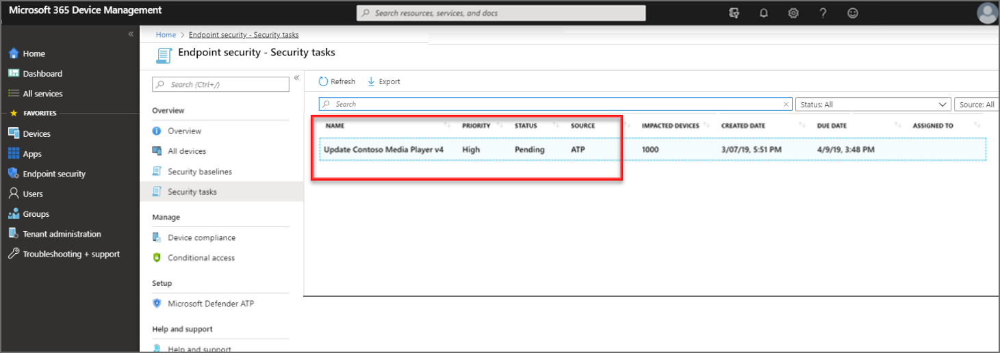
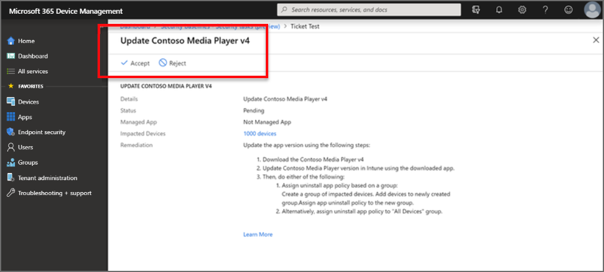

---
# required metadata

title: Use Intune to remediate vulnerabilities found by Microsoft Defender for Endpoint
description: See how to manage security tasks from and Threat & vulnerability Management, part of Microsoft Defender for Endpoint from within the Microsoft Intune admin center.
keywords:
author: brenduns 
ms.author: brenduns
manager: dougeby
ms.date: 11/30/2021
ms.topic: how-to
ms.service: microsoft-intune
ms.subservice: protect
ms.localizationpriority: high
ms.technology:
ms.reviewer: shpate

# optional metadata

#ROBOTS:
#audience:

ms.suite: ems
search.appverid: MET150
#ms.tgt_pltfrm:
ms.custom: intune-azure
ms.collection:
- tier2
- M365-identity-device-management
---

# Use Intune to remediate vulnerabilities identified by Microsoft Defender for Endpoint

When you integrate Intune with Microsoft Defender for Endpoint, you can take advantage of Defender for Endpoint's threat and vulnerability management and use Intune to remediate endpoint weakness identified by Defender's vulnerability management capability. This integration brings a risk-based approach to the discovery and prioritization of vulnerabilities that can improve remediation response time across your environment.

[Threat & Vulnerability Management](/windows/security/threat-protection/windows-defender-atp/next-gen-threat-and-vuln-mgt) is part of [Microsoft Defender for Endpoint](/microsoft-365/security/defender-endpoint/microsoft-defender-endpoint).

## How integration works

After you connect Intune to Microsoft Defender for Endpoint, Defender for Endpoint receives threat and vulnerability details from managed devices.

- Vulnerabilities that are discovered aren't based on configurations from Intune. They're based on Microsoft Defender for Endpoint configurations and scan details.
- Not all issues that Defender for Endpoint flags for remediation support remediation through the creation of a security task for Intune.

In the Microsoft Defender Security Center console, Defender for Endpoint security admins review data about endpoint vulnerabilities. The admins then use a few clicks to create security tasks that flag the vulnerable devices for remediation. The security tasks are immediately passed to the Microsoft Intune admin center where Intune admins can view them. The security task identifies the type of vulnerability, priority, status, and the steps to take to remediate the vulnerability. The Intune admin chooses to accept or reject the task.

When a task is accepted, the Intune admin then acts to remediate the vulnerability through Intune, using the guidance provided as part of the security task.

Each task is identified by a *Remediation Type*:

- **Application** – An application is identified that has a vulnerability or issue you can mitigate with Intune. For example, Microsoft Defender for Endpoint identifies a vulnerability for an app named *Contoso Media Player v4*, and an admin creates a security task to update that app. The Contoso Media player is an unmanaged app that was deployed with Intune, and there could be a security update or newer version of an application that resolves the issue.
- **Configuration** – Vulnerabilities or risks in your environment can be mitigated through use of Intune endpoint security policies. For example, Microsoft Defender for Endpoint identifies that devices lack protection from *Potentially Unwanted Applications* (PUA). An admin creates a security task for this, which identifies a mitigation of configuring the setting **Action to take on potentially unwanted apps** as part of the Microsoft Defender Antivirus profile for Antivirus policy. 

  For configuration issues, when there isn’t a plausible remediation that Intune can provide, then Microsoft Defender for Endpoint won’t create a security task for it.

Common actions for remediation include:

- **Block** an application from being run.
- **Deploy** an operating system update to mitigate the vulnerability.
- **Deploy** endpoint security policy to mitigate the vulnerability.
- **Modify** a registry value.
- **Disable** or **Enable** a configuration to affect the vulnerability.
- **Require Attention** alerts the admin to the threat when there's no suitable recommendation to provide.

Following is an example workflow for an application. This same general workflow applies for configuration issues:

- A Microsoft Defender for Endpoint scan identifies a vulnerability for an app named Contoso Media Player v4, and an admin creates a security task to update that app. The Contoso Media player is an unmanaged app that was deployed with Intune.

  This security task appears in the Microsoft Intune admin center with a status of Pending:

  

- The Intune admin selects the security task to view details about the task.  The admin then selects **Accept**, which updates the status in Intune, and in Defender for Endpoint to be *Accepted*.

  

- The admin then remediates the task based on the guidance provided. The guidance varies depending on the type of remediation that's needed. When available, remediation guidance includes links that open relevant panes for configurations in Intune.

  Because the media player in this example isn't a managed app, Intune can only provide text instructions. If the app was managed, Intune could provide instructions to download an updated version, and provide a link to open the deployment for the app so that the updated files can be added to the deployment.

- After completing the remediation, the Intune admin opens the security task and selects **Complete Task**. The remediation status is updated for Intune and in Defender for Endpoint, where security admins confirm the revised status for the vulnerability.

## Prerequisites  

**Subscriptions**:

- Microsoft Intune  
- Microsoft Defender for Endpoint ([Sign up for a free trial](https://www.microsoft.com/WindowsForBusiness/windows-atp?ocid=docs-wdatp-main-abovefoldlink).)

**Intune configurations for Defender for Endpoint**:

- Configure a service-to-service connection with Microsoft Defender for Endpoint.
- Deploy a device configuration policy with a profile type of **Microsoft Defender for Endpoint (desktop devices running Windows 10 or later)** to devices that will have risk assessed by Defender for Endpoint.

  For information about how to set up Intune to work with Defender for Endpoint, see [Enforce compliance for Microsoft Defender for Endpoint with Conditional Access in Intune](advanced-threat-protection-configure.md#enable-microsoft-defender-for-endpoint-in-intune).

## Work with security tasks

Before you can work with security tasks, they must be created from within the Defender Security Center. For information on using the Microsoft Defender Security Center to create security tasks, see [Remediate vulnerabilities with threat and vulnerability management](/microsoft-365/security/defender-endpoint/tvm-remediation?view=o365-worldwide&preserve-view=true#request-remediation) in the Defender for Endpoint documentation.

To manage security tasks:

1. Sign in to the [Microsoft Intune admin center](https://go.microsoft.com/fwlink/?linkid=2109431).

2. Select **Endpoint security** > **Security tasks**.

3. Select a task from the list to open a resource window that displays more details for that security task.

   While viewing the security task resource window, you can select additional links:

   - MANAGED APPS - View the app that is vulnerable. When the vulnerability applies to multiple apps, you'll see a filtered list of apps.
   - DEVICES - View a list of the *Vulnerable devices*, from which you can link through to an entry with more details for the vulnerability on that device.
   - REQUESTOR - Use the link to send mail to the admin who submitted this security task.
   - NOTES - Read custom messages submitted by the requestor when opening the security task.

4. Select **Accept** or **Reject** to send notification to Defender for Endpoint for your planned action. When you accept or reject a task, you can submit notes, which are sent to Defender for Endpoint.

5. After accepting a task, reopen the security task (if it closed), and follow the REMEDIATION details to remediate the vulnerability. The instructions provided by Defender for Endpoint in the security task details vary depending on the vulnerability involved.

   When it's possible to do so, the remediation instructions include links that open the relevant configuration objects in the Microsoft Intune admin center.

6. After completing the remediation steps, open the security task and select **Complete Task**. This action updates the security task status in both Intune and Defender for Endpoint.

After remediation is successful, the risk exposure score in Defender for Endpoint can drop, based on new information from the remediated devices.

## Next Steps

Learn more about Intune and [Microsoft Defender for Endpoint](advanced-threat-protection.md).

Review Intune [Mobile Threat Defense](mobile-threat-defense.md).

Review the [Threat & Vulnerability Management dashboard](/windows/security/threat-protection/windows-defender-atp/tvm-dashboard-insights) in Microsoft Defender for Endpoint.
