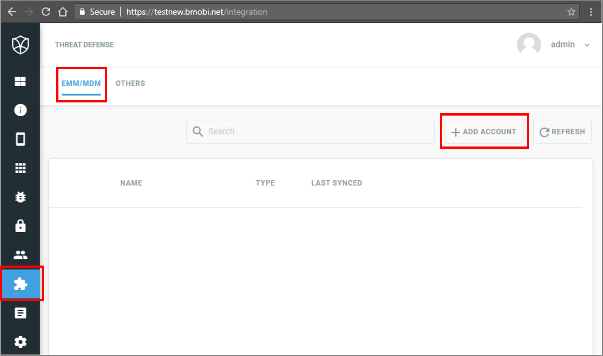

---
# required metadata

title: Set up Better Mobile integration with Intune
description: Integrate the third-party mobile threat defense solution of Better Mobile with Microsoft Intune.
keywords:
author: brenduns
ms.author: brenduns
manager: dougeby
ms.date: 07/19/2024
ms.topic: how-to
ms.service: microsoft-intune
ms.subservice: protect
ms.localizationpriority: high
ms.assetid: 

# optional metadata

#ROBOTS:
#audience:

ms.reviewer: aanavath
#ms.suite: ems
search.appverid: MET150
#ms.tgt_pltfrm:
#ms.custom:
ms.collection:
- tier3
- M365-identity-device-management
- sub-mtd-apps
---

# Integrate Better Mobile with Intune

Complete the following steps to integrate the Better Mobile Threat Defense solution with Intune.

## Before you begin

The following steps are to be completed in the Better Mobile admin console and will enable a connection to Better Mobile's service for both Intune enrolled devices (using device compliance) and unenrolled devices (using app protection policies).

Before starting the process of integrating Better Mobile with Intune, make sure you have the following:

- Microsoft Intune Plan 1 subscription

- Microsoft Entra admin credentials to grant the following permissions:

  - Sign in and read user profile

  - Access the directory as the signed-in user

  - Read directory data

  - Send device information to Intune

- Admin credentials to access the Better Mobile admin console.

### Better Mobile app authorization

The Better Mobile app authorization process follows:

- Allow the Better Mobile service to communicate information related to device health state back to Intune.

- Better Mobile syncs with Microsoft Entra Enrollment Group membership to populate its device's database.

- Allow the Better Mobile admin console to use Microsoft Entra single sign-on (SSO).

- Allow the Better Mobile app to sign in using Microsoft Entra SSO.

## To set up Better Mobile integration

1. Go to the Better Mobile admin console and sign in with your credentials.
2. Choose **Integration** > **EMM/MDM** > **ADD ACCOUNT**.

     

3. Choose **Intune**.
4. Next to **ACCOUNT NAME**, type a descriptor.
5. In the **Microsoft Sign in** window, enter your Intune credentials.
6. In the **Permissions requested** window, choose **Accept**.
7. Search for the Microsoft Entra security groups that you want Better Mobile to sync devices from, and select them in the list. Then select **Continue**.
8. Select **Done**.
9. The **Add account** page reappears. Close the page.

## Next steps

- [Set up Better Mobile apps for enrolled devices](mtd-apps-ios-app-configuration-policy-add-assign.md)
- [Set up Better Mobile apps for unenrolled devices](mtd-add-apps-unenrolled-devices.md)
