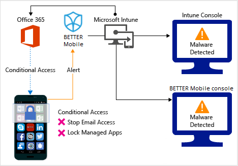
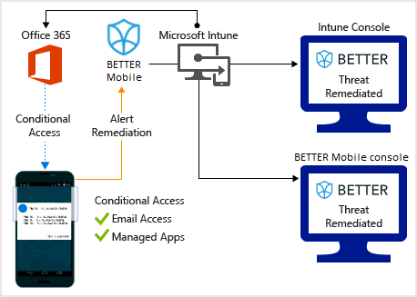
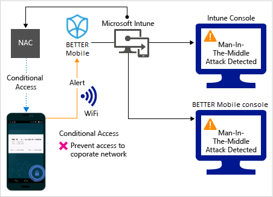
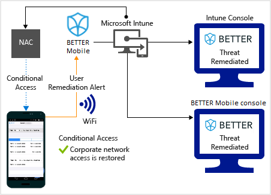
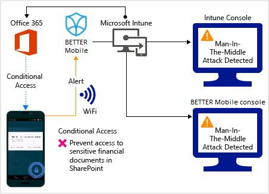
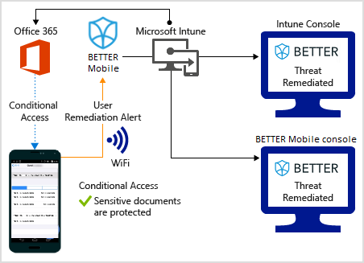

---
# required metadata

title: Better Mobile Threat Defense connector with Intune
titleSuffix: Intune on Azure
description: Set up Better Mobile Threat Defense connector with Intune.
keywords:
author: brenduns
ms.author: brenduns
manager: dougeby
ms.date: 02/21/2020
ms.topic: conceptual
ms.service: microsoft-intune
ms.subservice: protect
ms.localizationpriority: high
ms.technology:
ms.assetid: 

# optional metadata

#ROBOTS:
#audience:
#ms.devlang:
#ms.reviewer: [ALIAS]
#ms.suite: ems
search.appverid: MET150
#ms.tgt_pltfrm:
#ms.custom:
ms.collection: M365-identity-device-management
---

# Better Mobile Threat Defense connector with Intune

You can control mobile device access to corporate resources using Conditional Access based on risk assessment conducted by Better Mobile, a Mobile Threat Defense (MTD) solution that integrates with Microsoft Intune. Risk is assessed based on telemetry collected from devices running the Better Mobile app.

You can configure Conditional Access policies based on Better Mobile risk assessment enabled through Intune device compliance policies for enrolled devices, which you can use to allow or block noncompliant devices to access corporate resources based on detected threats. For unenrolled devices, you can use app protection policies to enforce a block or selective wipe based on detected threats.

## How do Intune and Better Mobile help protect your company resources?

The Better Mobile app is installed and run on mobile devices. This app captures file system, network stack, device, and application telemetry where available, and then sends the data to the Better Mobile cloud service to assess the device's risk for mobile threats.

The Intune device compliance policy includes a rule for Mobile Threat Defense, which is based on the Better Mobile risk assessment. When this rule is enabled, Intune evaluates device compliance with the policy that you enabled. If the device is found noncompliant, users are blocked access to corporate resources like Exchange Online and SharePoint Online. Users also receive guidance from the Better Mobile app installed in their devices to resolve the issue and regain access to corporate resources.

## Sample scenarios

Here are some common scenarios.

### Control access based on threats from malicious apps

When malicious apps such as malware are detected on devices, you can block devices from the following actions until the threat is resolved:

- Connecting to corporate e-mail

- Syncing corporate files with the OneDrive for Work app

- Accessing company apps

**Block when malicious apps are detected:**

**Access granted on remediation:**

### Control access based on threat to network

Detect threats to your network like **Man-in-the-middle** attacks, and protect access to Wi-Fi networks based on the device risk.

**Block network access through Wi-Fi:**

**Access granted on remediation:**

### Control access to SharePoint Online based on threat to network

Detect threats to your network like **Man-in-the-middle** attacks, and prevent synchronization of corporate files based on the device risk.

**Block SharePoint Online when network threats are detected:**

**Access granted on remediation:**

## Supported platforms

- **Android 4.1 and later**

- **iOS 8.0 and later**

## Prerequisites

- Azure Active Directory Premium

- Microsoft Intune subscription

- Better Mobile Threat Defense subscription

  - For more information, see the [Better Mobile website](https://www.better.mobi/).

## Next steps

- [Integrate Better Mobile with Intune](better-mobile-mtd-connector-integration.md)

- [Set up Better Mobile apps](mtd-apps-ios-app-configuration-policy-add-assign.md)

- [Create Better Mobile device compliance policy](mtd-device-compliance-policy-create.md)

- [Enable Better Mobile MTD connector](mtd-connector-enable.md)

- [Create an MTD app protection policy](mtd-app-protection-policy.md) 
